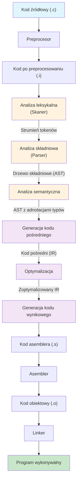
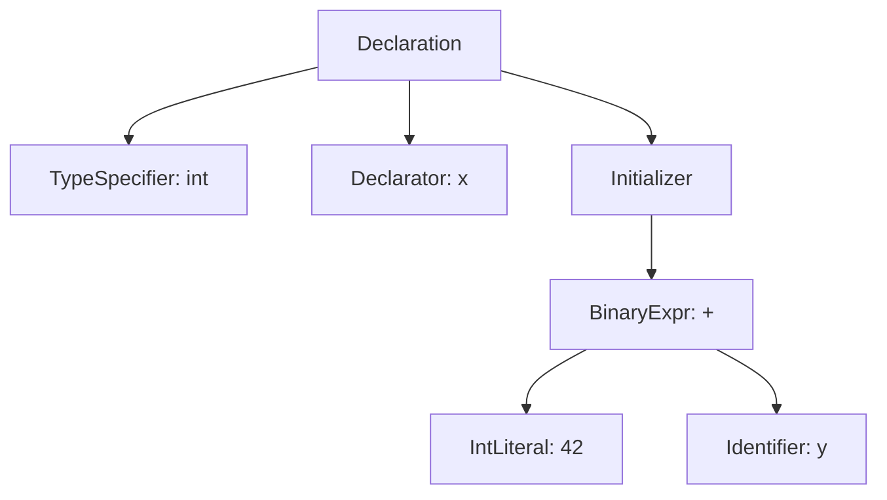
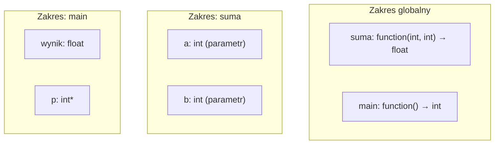
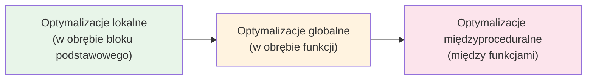
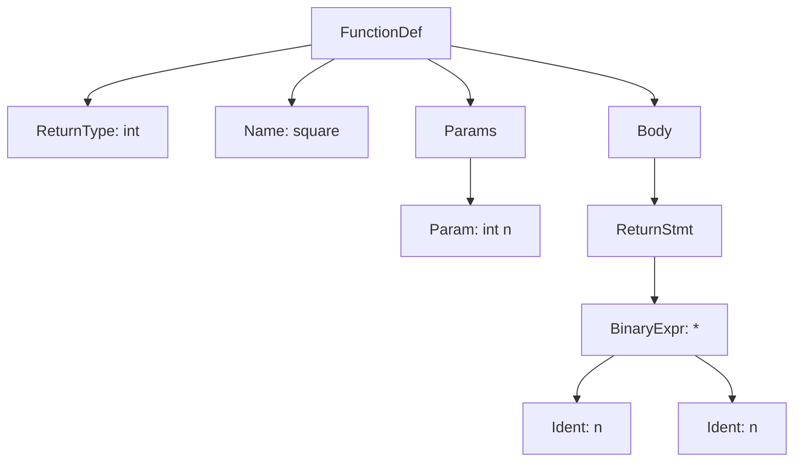
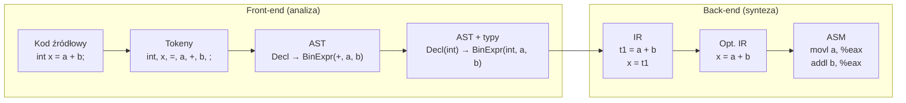

# Pytanie 1: Opisać etapy przetwarzania realizowane przez typowy kompilator języka C.

## Kluczowe pojęcia

- **Kompilator** — program tłumaczący kod źródłowy napisany w języku wysokiego poziomu (np. C) na kod maszynowy (lub inny język docelowy). Kompilator przetwarza cały program przed jego wykonaniem, w odróżnieniu od interpretera, który wykonuje instrukcje sekwencyjnie.
- **Analiza leksykalna (skanowanie)** — pierwszy etap kompilacji, w którym ciąg znaków kodu źródłowego jest dzielony na tokeny (leksemy), czyli najmniejsze jednostki znaczeniowe języka (słowa kluczowe, identyfikatory, literały, operatory, separatory).
- **Analiza składniowa (parsowanie)** — etap, w którym ciąg tokenów jest sprawdzany pod kątem zgodności z gramatyką bezkontekstową języka i przekształcany w drzewo składniowe (parse tree) lub abstrakcyjne drzewo składniowe (AST).
- **Analiza semantyczna** — etap weryfikacji poprawności znaczeniowej programu: sprawdzanie typów, deklaracji zmiennych, zgodności sygnatur funkcji, zakresów widoczności i innych reguł semantycznych języka.
- **Kod pośredni (IR — Intermediate Representation)** — wewnętrzna reprezentacja programu niezależna od architektury docelowej, ułatwiająca optymalizację i generację kodu dla różnych platform. Przykłady: trójki, czwórki, kod trójadresowy, SSA, LLVM IR.
- **Optymalizacja** — etap transformacji kodu pośredniego (lub kodu wynikowego) w celu poprawy wydajności programu (szybkość, zużycie pamięci) bez zmiany jego semantyki. Wyróżniamy optymalizacje lokalne, globalne i międzyproceduralne.
- **Generacja kodu** — końcowy etap kompilacji, w którym kod pośredni jest tłumaczony na kod maszynowy (lub asembler) dla konkretnej architektury docelowej, z uwzględnieniem alokacji rejestrów i planowania instrukcji.

## Przegląd etapów kompilacji

Typowy kompilator języka C realizuje przetwarzanie w kilku sekwencyjnych etapach, które można podzielić na dwie główne fazy:

1. **Faza analizy (front-end)** — rozpoznaje strukturę i znaczenie kodu źródłowego
2. **Faza syntezy (back-end)** — generuje kod wynikowy na podstawie reprezentacji pośredniej

Dodatkowo, przed właściwą kompilacją działa **preprocesor**, a po kompilacji — **asembler** i **linker**.

### Diagram przepływu kompilacji



## Etap 0: Preprocesowanie

Preprocesor (`cpp`) działa przed właściwą kompilacją i realizuje:

- **Włączanie plików nagłówkowych** — dyrektywa `#include` zastępowana jest treścią wskazanego pliku
- **Rozwijanie makr** — dyrektywy `#define` i makra parametryczne są rozwijane tekstowo
- **Kompilacja warunkowa** — dyrektywy `#ifdef`, `#ifndef`, `#if`, `#else`, `#endif` sterują włączaniem fragmentów kodu
- **Usuwanie komentarzy** — komentarze `//` i `/* */` są eliminowane

Wynikiem jest plik `.i` — czysty kod C bez dyrektyw preprocesora.

## Etap 1: Analiza leksykalna (skanowanie)

### Opis

Skaner (lekser) czyta strumień znaków kodu źródłowego i grupuje je w **tokeny** — najmniejsze jednostki znaczeniowe języka. Jednocześnie:

- Pomija białe znaki i komentarze (jeśli nie usunięte przez preprocesor)
- Rozpoznaje słowa kluczowe, identyfikatory, literały, operatory i separatory
- Buduje **tablicę symboli** (wstępnie — nazwy identyfikatorów)
- Raportuje błędy leksykalne (np. niepoprawne literały)

Skaner jest zazwyczaj implementowany jako **automat skończony (DFA)** — deterministyczny automat skończony zbudowany na podstawie wyrażeń regularnych opisujących tokeny.

### Kategorie tokenów w języku C

| Kategoria | Przykłady | Wzorzec (regex) |
|---|---|---|
| Słowa kluczowe | `int`, `return`, `if`, `while` | lista zamknięta |
| Identyfikatory | `main`, `x`, `suma` | `[a-zA-Z_][a-zA-Z0-9_]*` |
| Literały całkowite | `42`, `0xFF`, `077` | `[0-9]+`, `0[xX][0-9a-fA-F]+` |
| Literały zmiennoprzecinkowe | `3.14`, `1e-5` | `[0-9]+\.[0-9]*([eE][+-]?[0-9]+)?` |
| Literały znakowe | `'a'`, `'\n'` | `'([^'\\]|\\.)'` |
| Literały łańcuchowe | `"hello"` | `"([^"\\]|\\.)*"` |
| Operatory | `+`, `==`, `->`, `<<` | lista zamknięta |
| Separatory | `(`, `)`, `{`, `}`, `;` | lista zamknięta |

### Przykład tokenizacji

Dla kodu:
```c
int x = 42 + y;
```

Skaner generuje następujący strumień tokenów:

| Token | Typ | Wartość |
|---|---|---|
| `int` | KEYWORD | `int` |
| `x` | IDENTIFIER | `x` |
| `=` | OPERATOR | `=` |
| `42` | INT_LITERAL | `42` |
| `+` | OPERATOR | `+` |
| `y` | IDENTIFIER | `y` |
| `;` | SEPARATOR | `;` |

### Pseudokod skanera

```
function scan():
    while not EOF:
        skip_whitespace()
        ch = peek()
        if ch is letter or '_':
            token = read_identifier_or_keyword()
        else if ch is digit:
            token = read_number()
        else if ch is '"':
            token = read_string_literal()
        else if ch is "'":
            token = read_char_literal()
        else:
            token = read_operator_or_separator()
        emit(token)
```

## Etap 2: Analiza składniowa (parsowanie)

### Opis

Parser otrzymuje strumień tokenów od skanera i sprawdza, czy tworzą one poprawną strukturę zgodną z **gramatyką bezkontekstową** języka C. Wynikiem jest **drzewo składniowe** (parse tree) lub **abstrakcyjne drzewo składniowe (AST)**.

Główne zadania parsera:
- Weryfikacja poprawności składniowej programu
- Budowa hierarchicznej struktury programu (AST)
- Raportowanie błędów składniowych z informacją o lokalizacji
- Odtwarzanie po błędach (error recovery) — kontynuacja parsowania mimo błędów

### Metody parsowania

| Metoda | Kierunek | Typ | Przykłady |
|---|---|---|---|
| **Top-down** | Od symbolu startowego do liści | LL(1), LL(k), rekursywne zstępowanie | GCC (częściowo), Clang |
| **Bottom-up** | Od liści do symbolu startowego | LR(0), SLR, LALR(1), LR(1) | Yacc/Bison (LALR(1)) |

### Fragment gramatyki bezkontekstowej języka C (uproszczony)

```
program        → declaration_list
declaration    → type_specifier declarator ';'
               | type_specifier declarator '=' expression ';'
               | function_definition
type_specifier → 'int' | 'float' | 'char' | 'void'
expression     → term (('+' | '-') term)*
term           → factor (('*' | '/') factor)*
factor         → IDENTIFIER | INT_LITERAL | '(' expression ')'
```

### Przykład drzewa składniowego (AST)

Dla instrukcji `int x = 42 + y;`:



### Pseudokod parsera rekursywnego zstępowania

```
function parse_declaration():
    type = parse_type_specifier()
    name = expect(IDENTIFIER)
    if match('='):
        init = parse_expression()
    expect(';')
    return DeclarationNode(type, name, init)

function parse_expression():
    left = parse_term()
    while current_token in ['+', '-']:
        op = consume()
        right = parse_term()
        left = BinaryExprNode(op, left, right)
    return left

function parse_term():
    left = parse_factor()
    while current_token in ['*', '/']:
        op = consume()
        right = parse_factor()
        left = BinaryExprNode(op, left, right)
    return left

function parse_factor():
    if current_token is INT_LITERAL:
        return IntLiteralNode(consume().value)
    else if current_token is IDENTIFIER:
        return IdentifierNode(consume().value)
    else if match('('):
        expr = parse_expression()
        expect(')')
        return expr
    else:
        error("Unexpected token")
```

## Etap 3: Analiza semantyczna

### Opis

Analiza semantyczna sprawdza **poprawność znaczeniową** programu — aspekty, których nie da się wyrazić gramatyką bezkontekstową. Operuje na AST wzbogaconym o informacje z tablicy symboli.

### Główne zadania

1. **Sprawdzanie typów (type checking)**
   - Zgodność typów w wyrażeniach (np. `int + float` → niejawna konwersja)
   - Zgodność typów w przypisaniach
   - Poprawność typów argumentów funkcji
   - Poprawność typów zwracanych przez funkcje

2. **Zarządzanie tablicą symboli**
   - Rejestracja deklaracji zmiennych, funkcji, typów
   - Sprawdzanie, czy zmienne są zadeklarowane przed użyciem
   - Obsługa zakresów widoczności (scope) — blokowy, funkcyjny, plikowy
   - Wykrywanie wielokrotnych deklaracji w tym samym zakresie

3. **Niejawne konwersje typów (coercion)**
   - Promocja `int` → `float` w wyrażeniach mieszanych
   - Konwersja tablic na wskaźniki
   - Konwersja `char` → `int` (integer promotion)

4. **Inne sprawdzenia**
   - Poprawność instrukcji `break`/`continue` (czy są wewnątrz pętli)
   - Poprawność `return` (czy typ zgadza się z deklaracją funkcji)
   - Sprawdzanie osiągalności kodu (unreachable code)

### Przykład analizy semantycznej

```c
float suma(int a, int b) {
    return a + b;  // OK: int + int = int, niejawna konwersja int → float
}

int main() {
    float wynik = suma(3, 4.5);  // Ostrzeżenie: 4.5 (double) → int (utrata precyzji)
    int *p = wynik;              // Błąd: niezgodność typów (float vs int*)
    return 0;
}
```

Analizator semantyczny:
- Sprawdza, że `a + b` jest poprawne (oba `int`)
- Wstawia niejawną konwersję `int → float` dla `return`
- Ostrzega o konwersji `double → int` w wywołaniu `suma(3, 4.5)`
- Raportuje błąd typów przy `int *p = wynik`

### Diagram tablicy symboli



## Etap 4: Generacja kodu pośredniego (IR)

### Opis

Po analizie semantycznej kompilator tłumaczy AST na **reprezentację pośrednią (IR)** — wewnętrzny język niezależny od architektury docelowej. IR stanowi pomost między front-endem (analiza) a back-endem (generacja kodu).

### Zalety stosowania IR

- **Modularność** — front-end i back-end mogą być rozwijane niezależnie
- **Przenośność** — ten sam front-end obsługuje wiele architektur docelowych
- **Optymalizacja** — łatwiej optymalizować kod na poziomie IR niż AST lub kodu maszynowego
- **Wielojęzyczność** — wiele języków źródłowych może współdzielić back-end (np. LLVM)

### Popularne formy IR

| Forma IR | Opis | Przykład użycia |
|---|---|---|
| **Kod trójadresowy** | Instrukcje z max. 3 operandami: `x = y op z` | Klasyczne podręczniki kompilatorów |
| **Trójki** | `(op, arg1, arg2)` — wynik niejawny (numer instrukcji) | Kompilatory akademickie |
| **Czwórki** | `(op, arg1, arg2, result)` — wynik jawny | Kompilatory akademickie |
| **SSA (Static Single Assignment)** | Każda zmienna przypisana dokładnie raz | GCC (GIMPLE → SSA), LLVM IR |
| **LLVM IR** | Typowany, SSA-based, niskopoziomowy IR | Clang/LLVM |

### Przykład generacji kodu trójadresowego

Dla wyrażenia C:
```c
int result = (a + b) * (c - d);
```

Kod trójadresowy:
```
t1 = a + b
t2 = c - d
t3 = t1 * t2
result = t3
```

Reprezentacja w czwórkach:

| Nr | Operator | Arg1 | Arg2 | Wynik |
|---|---|---|---|---|
| 1 | `+` | `a` | `b` | `t1` |
| 2 | `-` | `c` | `d` | `t2` |
| 3 | `*` | `t1` | `t2` | `t3` |
| 4 | `=` | `t3` | — | `result` |

### Przykład LLVM IR

Dla funkcji C:
```c
int add(int a, int b) {
    return a + b;
}
```

LLVM IR:
```llvm
define i32 @add(i32 %a, i32 %b) {
entry:
    %sum = add i32 %a, %b
    ret i32 %sum
}
```

### Pseudokod generacji IR z AST

```
function generate_ir(node):
    match node:
        case BinaryExpr(op, left, right):
            t_left = generate_ir(left)
            t_right = generate_ir(right)
            t_result = new_temp()
            emit(t_result, '=', t_left, op, t_right)
            return t_result
        case IntLiteral(value):
            return value
        case Identifier(name):
            return lookup(name)
        case Declaration(type, name, init):
            t_init = generate_ir(init)
            emit(name, '=', t_init)
        case Return(expr):
            t_expr = generate_ir(expr)
            emit('return', t_expr)
```

## Etap 5: Optymalizacja kodu

### Opis

Optymalizator transformuje kod pośredni w celu poprawy wydajności programu wynikowego, zachowując jego semantykę. Optymalizacje mogą być stosowane na różnych poziomach.

### Poziomy optymalizacji



### Główne techniki optymalizacji

#### Optymalizacje lokalne (peephole)

| Technika | Opis | Przed | Po |
|---|---|---|---|
| **Propagacja stałych** | Zastąpienie zmiennej jej znaną wartością | `x = 5; y = x + 3` | `x = 5; y = 8` |
| **Zwijanie stałych** | Obliczenie wyrażeń stałych w czasie kompilacji | `y = 3 * 4 + 1` | `y = 13` |
| **Eliminacja martwego kodu** | Usunięcie kodu, którego wynik nie jest używany | `x = 5; x = 7; y = x` | `x = 7; y = x` |
| **Redukcja siły operacji** | Zamiana kosztownych operacji na tańsze | `x = y * 2` | `x = y << 1` |

#### Optymalizacje globalne

| Technika | Opis |
|---|---|
| **Eliminacja wspólnych podwyrażeń (CSE)** | Obliczenie powtarzającego się wyrażenia tylko raz |
| **Przesuwanie kodu niezmienniczego pętli (LICM)** | Wyniesienie obliczeń niezależnych od pętli przed pętlę |
| **Eliminacja zmiennych indukcyjnych** | Uproszczenie zmiennych zależnych od iteratora pętli |
| **Rozwijanie pętli (loop unrolling)** | Powielenie ciała pętli w celu redukcji narzutu sterowania |

#### Optymalizacje międzyproceduralne

| Technika | Opis |
|---|---|
| **Inline expansion** | Wstawienie ciała funkcji w miejsce wywołania |
| **Analiza aliasów** | Określenie, czy dwa wskaźniki mogą wskazywać na ten sam obiekt |
| **Interproceduralna propagacja stałych** | Propagacja stałych między funkcjami |

### Przykład optymalizacji

Kod przed optymalizacją:
```
t1 = 4
t2 = a + t1
t3 = a + t1      // wspólne podwyrażenie
t4 = t2 * t3
t5 = 0            // martwy kod (t5 nigdy nie użyte)
result = t4
```

Kod po optymalizacji:
```
t2 = a + 4        // propagacja stałej t1 = 4
t4 = t2 * t2      // eliminacja wspólnego podwyrażenia (t3 = t2)
result = t4        // eliminacja martwego kodu (t5 usunięte)
```

## Etap 6: Generacja kodu wynikowego

### Opis

Generator kodu tłumaczy zoptymalizowany IR na **kod maszynowy** (lub asembler) dla konkretnej architektury docelowej (np. x86-64, ARM, RISC-V). Jest to najbardziej zależny od platformy etap kompilacji.

### Główne zadania

1. **Wybór instrukcji (instruction selection)**
   - Mapowanie operacji IR na instrukcje maszynowe
   - Wykorzystanie specjalizowanych instrukcji (np. SIMD, FMA)

2. **Alokacja rejestrów (register allocation)**
   - Przypisanie zmiennych tymczasowych do rejestrów procesora
   - Minimalizacja operacji load/store do pamięci
   - Algorytmy: kolorowanie grafów, alokacja liniowa (linear scan)

3. **Planowanie instrukcji (instruction scheduling)**
   - Uporządkowanie instrukcji w celu minimalizacji opóźnień pipeline'u
   - Unikanie hazardów danych i strukturalnych

### Przykład generacji kodu x86-64

Dla kodu pośredniego:
```
t1 = a + b
t2 = t1 * c
result = t2
```

Kod asemblera x86-64:
```asm
    movl    -4(%rbp), %eax      ; załaduj a do eax
    addl    -8(%rbp), %eax      ; eax = a + b
    imull   -12(%rbp), %eax     ; eax = (a + b) * c
    movl    %eax, -16(%rbp)     ; zapisz wynik do result
```

### Pseudokod alokacji rejestrów (uproszczony — kolorowanie grafów)

```
function allocate_registers(ir_code, num_registers):
    // 1. Budowa grafu interferencji
    interference_graph = build_interference_graph(ir_code)
    
    // 2. Kolorowanie grafu (heurystyka)
    stack = []
    while graph is not empty:
        node = find_node_with_degree < num_registers
        if node exists:
            remove node from graph, push to stack
        else:
            // spill: wybierz zmienną do przeniesienia do pamięci
            node = select_spill_candidate()
            mark node as spilled
            remove node from graph
    
    // 3. Przypisanie kolorów (rejestrów)
    while stack is not empty:
        node = pop from stack
        assign_color(node, available_color not used by neighbors)
    
    // 4. Wstawienie load/store dla zmiennych spilled
    insert_spill_code()
```

## Etapy końcowe: Asemblacja i linkowanie

Po generacji kodu asemblera, dwa dodatkowe etapy tworzą program wykonywalny:

### Asembler

- Tłumaczy kod asemblera (`.s`) na **kod obiektowy** (`.o`) — binarną reprezentację instrukcji maszynowych
- Rozwiązuje lokalne etykiety i adresy
- Generuje tablicę symboli i tablicę relokacji

### Linker

- Łączy wiele plików obiektowych (`.o`) i bibliotek w jeden **program wykonywalny**
- Rozwiązuje zewnętrzne referencje (symbole zdefiniowane w innych modułach)
- Wykonuje relokację adresów
- Typy linkowania: statyczne (biblioteki `.a`) i dynamiczne (biblioteki `.so`/`.dll`)

## Przykłady

### Kompilacja prostego programu C krok po kroku

Rozważmy następujący program:

```c
#include <stdio.h>

int square(int n) {
    return n * n;
}

int main() {
    int x = 5;
    int y = square(x) + 1;
    printf("%d\n", y);
    return 0;
}
```

#### Krok 1: Preprocesowanie

Dyrektywa `#include <stdio.h>` zostaje zastąpiona zawartością pliku nagłówkowego (deklaracje `printf` itp.). Wynik to plik `.i` z rozwiniętymi nagłówkami.

#### Krok 2: Analiza leksykalna

Fragment tokenizacji funkcji `square`:

| Token | Typ |
|---|---|
| `int` | KEYWORD |
| `square` | IDENTIFIER |
| `(` | SEPARATOR |
| `int` | KEYWORD |
| `n` | IDENTIFIER |
| `)` | SEPARATOR |
| `{` | SEPARATOR |
| `return` | KEYWORD |
| `n` | IDENTIFIER |
| `*` | OPERATOR |
| `n` | IDENTIFIER |
| `;` | SEPARATOR |
| `}` | SEPARATOR |

#### Krok 3: Analiza składniowa

AST dla funkcji `square`:



#### Krok 4: Analiza semantyczna

- `square`: funkcja `int → int` — poprawna
- `n * n`: `int * int = int` — poprawne, zgodne z typem zwracanym
- `square(x)`: `x` jest `int`, parametr `n` jest `int` — zgodność typów
- `square(x) + 1`: `int + int = int` — poprawne
- `printf("%d\n", y)`: `y` jest `int`, format `%d` oczekuje `int` — poprawne

#### Krok 5: Generacja kodu pośredniego

Kod trójadresowy dla `main`:
```
    x = 5
    param x
    t1 = call square, 1       // square(x)
    t2 = t1 + 1               // square(x) + 1
    y = t2
    param y
    param "%d\n"
    call printf, 2
    return 0
```

Kod trójadresowy dla `square`:
```
    t1 = n * n
    return t1
```

#### Krok 6: Optymalizacja

Możliwe optymalizacje:
- **Inline expansion**: wstawienie ciała `square` w miejsce wywołania
- **Propagacja stałych**: `x = 5` → `square(5)` → `5 * 5 = 25` → `y = 26`
- Po pełnej optymalizacji (z `-O2`): `printf` może być wywołane bezpośrednio z wartością `26`

Zoptymalizowany IR (po inline i propagacji stałych):
```
    param 26
    param "%d\n"
    call printf, 2
    return 0
```

#### Krok 7: Generacja kodu (x86-64)

Fragment kodu asemblera (GCC, bez optymalizacji):
```asm
square:
    pushq   %rbp
    movq    %rsp, %rbp
    movl    %edi, -4(%rbp)      ; n = parametr
    movl    -4(%rbp), %eax
    imull   -4(%rbp), %eax      ; eax = n * n
    popq    %rbp
    ret

main:
    pushq   %rbp
    movq    %rsp, %rbp
    subq    $16, %rsp
    movl    $5, -4(%rbp)        ; x = 5
    movl    -4(%rbp), %edi
    call    square               ; square(x)
    addl    $1, %eax            ; + 1
    movl    %eax, -8(%rbp)      ; y = wynik
    movl    -8(%rbp), %esi
    leaq    .LC0(%rip), %rdi    ; "%d\n"
    call    printf
    movl    $0, %eax            ; return 0
    leave
    ret
```

### Diagram podsumowujący przepływ danych



## Podsumowanie

1. **Kompilacja języka C** to wieloetapowy proces transformacji kodu źródłowego w kod maszynowy, obejmujący fazę analizy (front-end) i fazę syntezy (back-end).

2. **Preprocesowanie** (etap 0) rozwija makra, włącza pliki nagłówkowe i realizuje kompilację warunkową.

3. **Analiza leksykalna** dzieli kod na tokeny za pomocą automatu skończonego (DFA) opartego na wyrażeniach regularnych.

4. **Analiza składniowa** buduje drzewo składniowe (AST) na podstawie gramatyki bezkontekstowej, stosując metody top-down (LL) lub bottom-up (LR).

5. **Analiza semantyczna** weryfikuje poprawność typów, deklaracji i zakresów widoczności, korzystając z tablicy symboli.

6. **Generacja kodu pośredniego** tworzy reprezentację niezależną od platformy (np. kod trójadresowy, SSA, LLVM IR), umożliwiając modularność kompilatora.

7. **Optymalizacja** poprawia wydajność kodu na poziomie lokalnym, globalnym i międzyproceduralnym, zachowując semantykę programu.

8. **Generacja kodu wynikowego** tłumaczy IR na instrukcje maszynowe z alokacją rejestrów i planowaniem instrukcji.

9. **Asemblacja i linkowanie** tworzą końcowy program wykonywalny z plików obiektowych i bibliotek.

10. Architektura z IR jako punktem pośrednim umożliwia budowę kompilatorów obsługujących wiele języków źródłowych i wiele architektur docelowych (np. LLVM).

## Powiązane pytania

- [Pytanie 2: Omówić zasadę działania analizatora składniowego typu LL(1) ze stosem](02-analizator-ll1.md)
- [Pytanie 3: Przedstawić zasady kompilowania wyrażeń regularnych do automatów skończonych](03-wyrazenia-regularne-nfa-dfa.md)
- [Pytanie 4: Na wybranym przykładzie omówić zasadę działania generatorów analizatorów leksykalno-składniowych](04-generatory-lex-yacc.md)
- [Pytanie 5: Omów rolę reprezentacji pośredniej w procesie kompilacji](05-reprezentacja-posrednia-ir.md)
