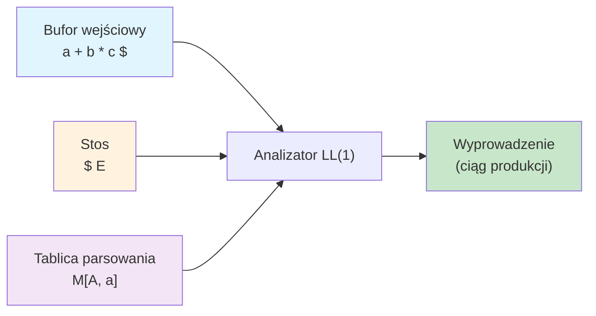
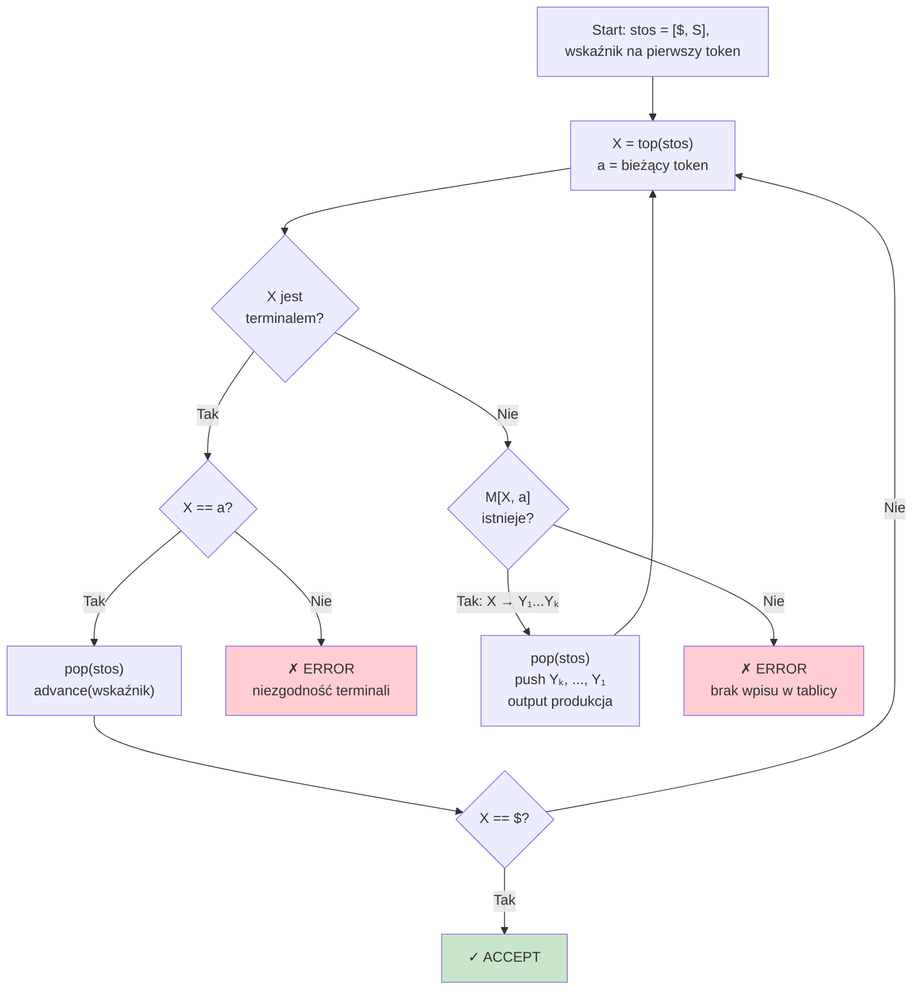
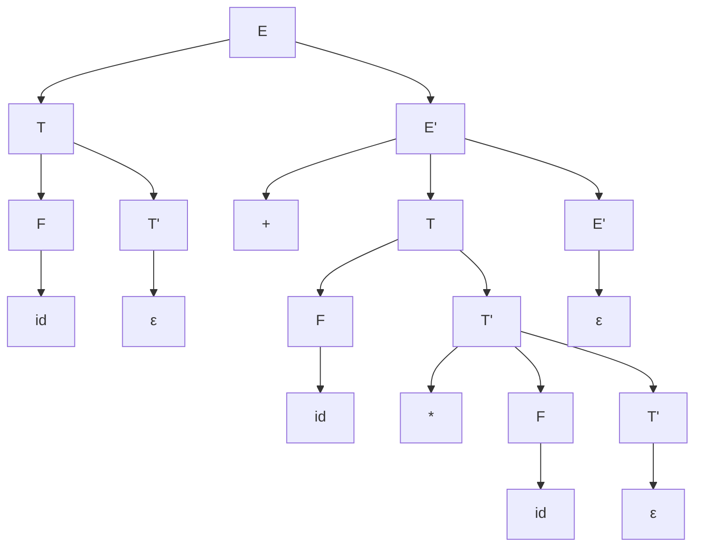

# Pytanie 2: Omówić zasadę działania analizatora składniowego typu LL(1) ze stosem.

## Kluczowe pojęcia

- **Gramatyka LL(1)** — gramatyka bezkontekstowa, dla której można zbudować deterministyczny analizator składniowy czytający wejście od lewej do prawej (L), produkujący wyprowadzenie lewostronne (L) i podejmujący decyzję na podstawie jednego symbolu podglądu (1). Gramatyka jest LL(1), gdy tablica parsowania nie zawiera konfliktów (każda komórka ma co najwyżej jedną produkcję).
- **Tablica parsowania (parsing table)** — dwuwymiarowa tablica indeksowana nieterminalem (wiersze) i terminalem (kolumny), w której każda komórka zawiera numer produkcji do zastosowania. Tablica jest budowana na podstawie zbiorów FIRST i FOLLOW.
- **Stos (stack)** — struktura danych LIFO używana przez analizator LL(1) do śledzenia oczekiwanych symboli gramatyki. Na początku stos zawiera marker końca (`$`) i symbol startowy gramatyki.
- **Zbiór FIRST(α)** — zbiór terminali, które mogą rozpoczynać ciąg wyprowadzony z formy zdaniowej α. Jeśli α może wyprowadzić ciąg pusty (ε), to ε ∈ FIRST(α). Formalnie: FIRST(α) = { a ∈ T | α ⇒* aβ } ∪ { ε | α ⇒* ε }.
- **Zbiór FOLLOW(A)** — zbiór terminali, które mogą wystąpić bezpośrednio po nieterminalu A w dowolnej formie zdaniowej. Formalnie: FOLLOW(A) = { a ∈ T | S ⇒* αAaβ } ∪
 { X | S ⇒* αA }. Symbol `X` oznacza koniec wejścia.
- **Wyprowadzenie lewostronne (leftmost derivation)** — sposób wyprowadzenia ciągu z gramatyki, w którym w każdym kroku zastępowany jest zawsze skrajnie lewy nieterminal. Analizator LL(1) konstruuje wyprowadzenie lewostronne.

## Definicja analizatora LL(1)

Analizator składniowy LL(1) to **deterministyczny analizator zstępujący (top-down)**, który:

1. Czyta wejście **od lewej do prawej** (Left-to-right scan)
2. Produkuje **wyprowadzenie lewostronne** (Leftmost derivation)
3. Podejmuje decyzję o wyborze produkcji na podstawie **jednego symbolu podglądu** (1 lookahead)

Analizator LL(1) jest sterowany **tablicą parsowania** i wykorzystuje **stos** do śledzenia oczekiwanej struktury wejścia. Jest to najprostsza forma analizatora predykcyjnego — nie wymaga nawrotów (backtracking).

### Architektura analizatora LL(1)



Analizator składa się z trzech elementów:
- **Bufor wejściowy** — zawiera ciąg tokenów zakończony symbolem `$`
- **Stos** — przechowuje symbole gramatyki (terminale i nieterminale); na dnie stosu znajduje się `$`
- **Tablica parsowania** — dyktuje, którą produkcję zastosować dla danej pary (nieterminal na szczycie stosu, terminal na wejściu)

## Zbiory FIRST i FOLLOW

### Obliczanie zbioru FIRST

Zbiór FIRST jest obliczany rekurencyjnie według następujących reguł:

1. Jeśli $X$ jest terminalem: $\text{FIRST}(X) = \{X\}$
2. Jeśli $X \to \varepsilon$ jest produkcją: dodaj $\varepsilon$ do $\text{FIRST}(X)$
3. Jeśli $X \to Y_1 Y_2 \ldots Y_k$ jest produkcją:
   - Dodaj $\text{FIRST}(Y_1) \setminus \{\varepsilon\}$ do $\text{FIRST}(X)$
   - Jeśli $\varepsilon \in \text{FIRST}(Y_1)$, dodaj $\text{FIRST}(Y_2) \setminus \{\varepsilon\}$ do $\text{FIRST}(X)$
   - Kontynuuj analogicznie dla $Y_3, Y_4, \ldots$
   - Jeśli $\varepsilon \in \text{FIRST}(Y_i)$ dla wszystkich $i = 1, \ldots, k$, dodaj $\varepsilon$ do $\text{FIRST}(X)$

```
function FIRST(X):
    if X is terminal:
        return {X}
    result = {}
    for each production X → Y1 Y2 ... Yk:
        for i = 1 to k:
            result = result ∪ (FIRST(Yi) \ {ε})
            if ε ∉ FIRST(Yi):
                break
            if i == k:
                result = result ∪ {ε}
    return result
```

### Obliczanie zbioru FOLLOW

Zbiór FOLLOW jest obliczany iteracyjnie:

1. Dodaj `$` do $\text{FOLLOW}(S)$, gdzie $S$ jest symbolem startowym
2. Dla każdej produkcji $A \to \alpha B \beta$:
   - Dodaj $\text{FIRST}(\beta) \setminus \{\varepsilon\}$ do $\text{FOLLOW}(B)$
   - Jeśli $\varepsilon \in \text{FIRST}(\beta)$ lub $\beta = \varepsilon$ (B jest na końcu produkcji), dodaj $\text{FOLLOW}(A)$ do $\text{FOLLOW}(B)$
3. Powtarzaj krok 2, aż żaden zbiór FOLLOW się nie zmieni

```
function compute_FOLLOW(grammar):
    FOLLOW[S] = {$}                    // S = symbol startowy
    repeat until no changes:
        for each production A → α B β:
            FOLLOW[B] = FOLLOW[B] ∪ (FIRST(β) \ {ε})
            if ε ∈ FIRST(β) or β is empty:
                FOLLOW[B] = FOLLOW[B] ∪ FOLLOW[A]
```

## Budowa tablicy parsowania

Tablica parsowania $M$ jest budowana na podstawie zbiorów FIRST i FOLLOW:

Dla każdej produkcji $A \to \alpha$:

1. Dla każdego terminala $a \in \text{FIRST}(\alpha)$, $a \neq \varepsilon$:
   - Wstaw $A \to \alpha$ do $M[A, a]$
2. Jeśli $\varepsilon \in \text{FIRST}(\alpha)$:
   - Dla każdego terminala $b \in \text{FOLLOW}(A)$:
     - Wstaw $A \to \alpha$ do $M[A, b]$
   - Jeśli $\$ \in \text{FOLLOW}(A)$:
     - Wstaw $A \to \alpha$ do $M[A, \$]$

```
function build_parsing_table(grammar):
    M = empty table
    for each production A → α:
        for each terminal a in FIRST(α), a ≠ ε:
            M[A, a] = A → α
        if ε ∈ FIRST(α):
            for each terminal b in FOLLOW(A):
                M[A, b] = A → α
            if $ ∈ FOLLOW(A):
                M[A, $] = A → α
    return M
```

Jeśli po zakończeniu algorytmu jakakolwiek komórka tablicy zawiera więcej niż jedną produkcję, gramatyka **nie jest LL(1)**.

## Algorytm analizy ze stosem

### Pseudokod analizatora LL(1)

```
function LL1_parse(input, parsing_table):
    stack = [$, S]                     // S = symbol startowy na szczycie
    pointer = first symbol of input    // input zakończony symbolem $
    
    repeat:
        X = top(stack)
        a = current input symbol (pointer)
        
        if X is terminal or X == $:
            if X == a:
                pop(stack)             // dopasowanie terminala
                advance(pointer)       // przesuń wskaźnik wejścia
                if X == $:
                    return ACCEPT      // sukces — wejście zaakceptowane
            else:
                return ERROR           // niezgodność terminali
        
        else:                          // X jest nieterminalem
            if M[X, a] = X → Y1 Y2 ... Yk:
                pop(stack)             // zdejmij nieterminal X
                push Yk, ..., Y2, Y1   // wstaw prawą stronę w odwrotnej kolejności
                                       // (Y1 na szczycie stosu)
                output "X → Y1 Y2 ... Yk"
            else:
                return ERROR           // brak wpisu w tablicy — błąd składniowy
```

### Diagram przepływu algorytmu



### Kluczowe obserwacje

- Symbole prawej strony produkcji są wstawiane na stos **w odwrotnej kolejności**, aby pierwszy symbol ($Y_1$) znalazł się na szczycie stosu
- Jeśli produkcja to $A \to \varepsilon$, po prostu zdejmujemy $A$ ze stosu (nic nie wstawiamy)
- Algorytm działa w czasie $O(n)$ dla wejścia o długości $n$ (każdy token jest czytany dokładnie raz)

## Warunki LL(1)

Gramatyka bezkontekstowa $G$ jest gramatyką LL(1) wtedy i tylko wtedy, gdy dla każdej pary produkcji $A \to \alpha$ i $A \to \beta$ (gdzie $\alpha \neq \beta$) spełnione są następujące warunki:

1. **Brak wspólnych prefiksów w FIRST:**
   $$\text{FIRST}(\alpha) \cap \text{FIRST}(\beta) = \emptyset$$
   (z wyjątkiem ewentualnego $\varepsilon$)

2. **Jednoznaczność z ε:**
   Co najwyżej jedna z alternatyw $\alpha, \beta$ może wyprowadzać $\varepsilon$.

3. **Rozdzielność FIRST i FOLLOW:**
   Jeśli $\varepsilon \in \text{FIRST}(\beta)$, to:
   $$\text{FIRST}(\alpha) \cap \text{FOLLOW}(A) = \emptyset$$
   (i analogicznie, jeśli $\varepsilon \in \text{FIRST}(\alpha)$)

### Gramatyki, które NIE są LL(1)

Następujące cechy gramatyki uniemożliwiają jej bycie LL(1):

| Problem | Przykład | Rozwiązanie |
|---|---|---|
| **Lewostronna rekursja** | $A \to A\alpha \mid \beta$ | Eliminacja lewostronnej rekursji |
| **Wspólne prefiksy** | $A \to a\beta_1 \mid a\beta_2$ | Faktoryzacja lewej strony (left factoring) |
| **Niejednoznaczność** | $S \to \text{if } E \text{ then } S \mid \text{if } E \text{ then } S \text{ else } S$ | Przeformułowanie gramatyki |

### Eliminacja lewostronnej rekursji

Produkcje postaci $A \to A\alpha \mid \beta$ zastępujemy:

$$A \to \beta A'$$
$$A' \to \alpha A' \mid \varepsilon$$

### Faktoryzacja lewej strony (left factoring)

Produkcje postaci $A \to \alpha\beta_1 \mid \alpha\beta_2$ zastępujemy:

$$A \to \alpha A'$$
$$A' \to \beta_1 \mid \beta_2$$

## Przykłady

### Przykład: Analiza wyrażenia arytmetycznego

Rozważmy klasyczną gramatykę wyrażeń arytmetycznych (po eliminacji lewostronnej rekursji):

**Gramatyka G:**

| Nr | Produkcja |
|---|---|
| 1 | $E \to T \; E'$ |
| 2 | $E' \to + \; T \; E'$ |
| 3 | $E' \to \varepsilon$ |
| 4 | $T \to F \; T'$ |
| 5 | $T' \to * \; F \; T'$ |
| 6 | $T' \to \varepsilon$ |
| 7 | $F \to ( \; E \; )$ |
| 8 | $F \to \textbf{id}$ |

Terminale: $\{ +, *, (, ), \textbf{id}, \$ \}$

Nieterminale: $\{ E, E', T, T', F \}$

Symbol startowy: $E$

#### Krok 1: Obliczanie zbiorów FIRST

| Symbol | FIRST |
|---|---|
| $F$ | $\{ (, \textbf{id} \}$ |
| $T'$ | $\{ *, \varepsilon \}$ |
| $T$ | $\{ (, \textbf{id} \}$ |
| $E'$ | $\{ +, \varepsilon \}$ |
| $E$ | $\{ (, \textbf{id} \}$ |

Uzasadnienie:
- $\text{FIRST}(F)$: z produkcji 7 i 8 → $\{(, \textbf{id}\}$
- $\text{FIRST}(T')$: z produkcji 5 → $\{*\}$, z produkcji 6 → $\{\varepsilon\}$
- $\text{FIRST}(T)$: z produkcji 4, $T \to F \; T'$ → $\text{FIRST}(F) = \{(, \textbf{id}\}$
- $\text{FIRST}(E')$: z produkcji 2 → $\{+\}$, z produkcji 3 → $\{\varepsilon\}$
- $\text{FIRST}(E)$: z produkcji 1, $E \to T \; E'$ → $\text{FIRST}(T) = \{(, \textbf{id}\}$

#### Krok 2: Obliczanie zbiorów FOLLOW

| Symbol | FOLLOW |
|---|---|
| $E$ | $\{ ), \$ \}$ |
| $E'$ | $\{ ), \$ \}$ |
| $T$ | $\{ +, ), \$ \}$ |
| $T'$ | $\{ +, ), \$ \}$ |
| $F$ | $\{ *, +, ), \$ \}$ |

Uzasadnienie:
- $\text{FOLLOW}(E)$: $E$ jest symbolem startowym → $\{\$\}$; z produkcji 7 ($F \to (E)$) → $\{)\}$
- $\text{FOLLOW}(E')$: z produkcji 1 ($E \to T \; E'$), $E'$ jest na końcu → $\text{FOLLOW}(E) = \{), \$\}$
- $\text{FOLLOW}(T)$: z produkcji 1 ($E \to T \; E'$) → $\text{FIRST}(E') \setminus \{\varepsilon\} = \{+\}$; ponieważ $\varepsilon \in \text{FIRST}(E')$ → $\text{FOLLOW}(E) = \{), \$\}$; razem: $\{+, ), \$\}$
- $\text{FOLLOW}(T')$: z produkcji 4 ($T \to F \; T'$), $T'$ na końcu → $\text{FOLLOW}(T) = \{+, ), \$\}$
- $\text{FOLLOW}(F)$: z produkcji 4 ($T \to F \; T'$) → $\text{FIRST}(T') \setminus \{\varepsilon\} = \{*\}$; ponieważ $\varepsilon \in \text{FIRST}(T')$ → $\text{FOLLOW}(T) = \{+, ), \$\}$; razem: $\{*, +, ), \$\}$

#### Krok 3: Tablica parsowania

|  | **id** | **+** | **\*** | **(** | **)** | **$** |
|---|---|---|---|---|---|---|
| $E$ | $E \to T \; E'$ | | | $E \to T \; E'$ | | |
| $E'$ | | $E' \to + \; T \; E'$ | | | $E' \to \varepsilon$ | $E' \to \varepsilon$ |
| $T$ | $T \to F \; T'$ | | | $T \to F \; T'$ | | |
| $T'$ | | $T' \to \varepsilon$ | $T' \to * \; F \; T'$ | | $T' \to \varepsilon$ | $T' \to \varepsilon$ |
| $F$ | $F \to \textbf{id}$ | | | $F \to ( \; E \; )$ | | |

Żadna komórka nie zawiera więcej niż jednej produkcji — gramatyka jest LL(1).

#### Krok 4: Analiza wyrażenia `id + id * id`

Wejście: `id + id * id $`

| Krok | Stos | Wejście | Akcja |
|---|---|---|---|
| 1 | `$ E` | `id + id * id $` | $M[E, \textbf{id}] = E \to T \; E'$ → pop $E$, push $E', T$ |
| 2 | `$ E' T` | `id + id * id $` | $M[T, \textbf{id}] = T \to F \; T'$ → pop $T$, push $T', F$ |
| 3 | `$ E' T' F` | `id + id * id $` | $M[F, \textbf{id}] = F \to \textbf{id}$ → pop $F$, push $\textbf{id}$ |
| 4 | `$ E' T' id` | `id + id * id $` | dopasowanie: pop $\textbf{id}$, advance |
| 5 | `$ E' T'` | `+ id * id $` | $M[T', +] = T' \to \varepsilon$ → pop $T'$ |
| 6 | `$ E'` | `+ id * id $` | $M[E', +] = E' \to + \; T \; E'$ → pop $E'$, push $E', T, +$ |
| 7 | `$ E' T +` | `+ id * id $` | dopasowanie: pop $+$, advance |
| 8 | `$ E' T` | `id * id $` | $M[T, \textbf{id}] = T \to F \; T'$ → pop $T$, push $T', F$ |
| 9 | `$ E' T' F` | `id * id $` | $M[F, \textbf{id}] = F \to \textbf{id}$ → pop $F$, push $\textbf{id}$ |
| 10 | `$ E' T' id` | `id * id $` | dopasowanie: pop $\textbf{id}$, advance |
| 11 | `$ E' T'` | `* id $` | $M[T', *] = T' \to * \; F \; T'$ → pop $T'$, push $T', F, *$ |
| 12 | `$ E' T' F *` | `* id $` | dopasowanie: pop $*$, advance |
| 13 | `$ E' T' F` | `id $` | $M[F, \textbf{id}] = F \to \textbf{id}$ → pop $F$, push $\textbf{id}$ |
| 14 | `$ E' T' id` | `id $` | dopasowanie: pop $\textbf{id}$, advance |
| 15 | `$ E' T'` | `$` | $M[T', \$] = T' \to \varepsilon$ → pop $T'$ |
| 16 | `$ E'` | `$` | $M[E', \$] = E' \to \varepsilon$ → pop $E'$ |
| 17 | `$` | `$` | dopasowanie: `$ == $` → **ACCEPT** |

#### Wyprowadzenie lewostronne

Ciąg zastosowanych produkcji daje wyprowadzenie lewostronne:

$$E \Rightarrow T \; E' \Rightarrow F \; T' \; E' \Rightarrow \textbf{id} \; T' \; E' \Rightarrow \textbf{id} \; E'$$
$$\Rightarrow \textbf{id} + T \; E' \Rightarrow \textbf{id} + F \; T' \; E' \Rightarrow \textbf{id} + \textbf{id} \; T' \; E'$$
$$\Rightarrow \textbf{id} + \textbf{id} * F \; T' \; E' \Rightarrow \textbf{id} + \textbf{id} * \textbf{id} \; T' \; E'$$
$$\Rightarrow \textbf{id} + \textbf{id} * \textbf{id} \; E' \Rightarrow \textbf{id} + \textbf{id} * \textbf{id}$$

#### Drzewo wyprowadzenia



### Przykład: Wykrywanie błędu składniowego

Wejście: `id + * id $` (błędne — brak operandu po `+`)

| Krok | Stos | Wejście | Akcja |
|---|---|---|---|
| 1 | `$ E` | `id + * id $` | $E \to T \; E'$ |
| 2 | `$ E' T` | `id + * id $` | $T \to F \; T'$ |
| 3 | `$ E' T' F` | `id + * id $` | $F \to \textbf{id}$ |
| 4 | `$ E' T' id` | `id + * id $` | dopasowanie `id` |
| 5 | `$ E' T'` | `+ * id $` | $T' \to \varepsilon$ |
| 6 | `$ E'` | `+ * id $` | $E' \to + \; T \; E'$ |
| 7 | `$ E' T +` | `+ * id $` | dopasowanie `+` |
| 8 | `$ E' T` | `* id $` | $M[T, *]$ = **pusta komórka** → **ERROR** |

Analizator wykrywa błąd: po operatorze `+` oczekiwany jest term (zaczynający się od `id` lub `(`), a napotkano `*`.

## Podsumowanie

1. **Analizator LL(1)** to deterministyczny analizator zstępujący sterowany tablicą parsowania i stosem, produkujący wyprowadzenie lewostronne na podstawie jednego symbolu podglądu.

2. **Zbiory FIRST i FOLLOW** stanowią fundament budowy tablicy parsowania — FIRST określa, jakie terminale mogą rozpoczynać wyprowadzenie z danego symbolu, a FOLLOW określa, jakie terminale mogą następować po nieterminalu.

3. **Tablica parsowania** jest budowana algorytmicznie z produkcji gramatyki i zbiorów FIRST/FOLLOW. Brak konfliktów w tablicy potwierdza, że gramatyka jest LL(1).

4. **Algorytm analizy** jest prosty i efektywny ($O(n)$): w pętli porównuje szczyt stosu z bieżącym tokenem — dopasowuje terminale lub rozwija nieterminale zgodnie z tablicą.

5. **Warunki LL(1)** wymagają, aby dla każdej pary alternatywnych produkcji zbiory FIRST były rozłączne, a w przypadku produkcji ε-pustych — aby FIRST i FOLLOW były rozłączne.

6. Gramatyki z **lewostronną rekursją** lub **wspólnymi prefiksami** nie są LL(1), ale mogą być przekształcone (eliminacja rekursji, faktoryzacja) do postaci LL(1).

7. Analizator LL(1) jest szeroko stosowany w praktyce (np. parsery rekursywnego zstępowania w kompilatorach) ze względu na prostotę implementacji i dobrą diagnostykę błędów.

## Powiązane pytania

- [Pytanie 1: Opisać etapy przetwarzania realizowane przez typowy kompilator języka C](01-etapy-kompilatora-c.md)
- [Pytanie 3: Przedstawić zasady kompilowania wyrażeń regularnych do automatów skończonych](03-wyrazenia-regularne-nfa-dfa.md)
- [Pytanie 4: Na wybranym przykładzie omówić zasadę działania generatorów analizatorów leksykalno-składniowych](04-generatory-lex-yacc.md)
