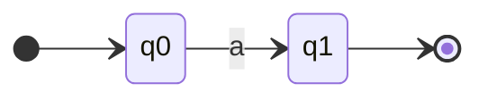
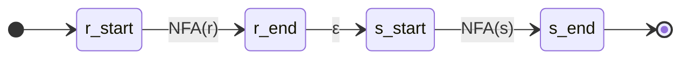
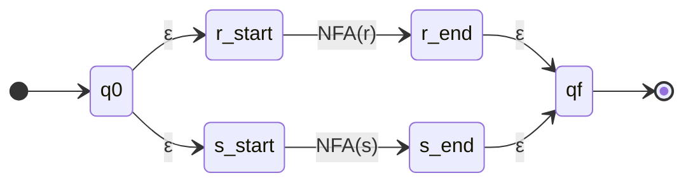
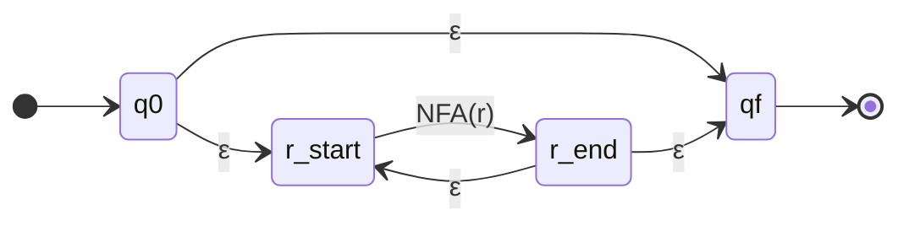
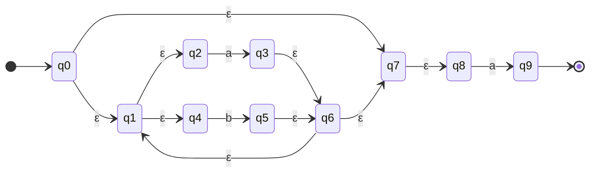
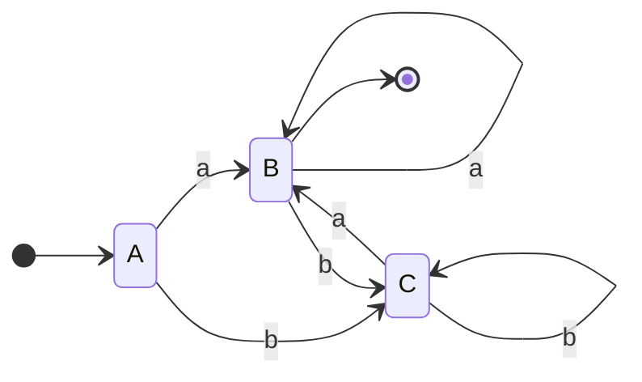
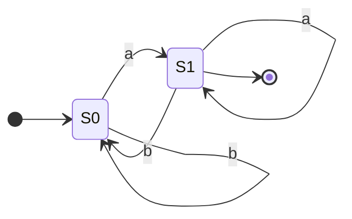

# Pytanie 3: Przedstawić zasady kompilowania wyrażeń regularnych do automatów skończonych.

## Kluczowe pojęcia

- **Wyrażenie regularne (regex)** — formalizm algebraiczny opisujący zbiór ciągów znaków (język regularny) za pomocą operatorów: konkatenacji (ab), alternatywy (a|b) i domknięcia Kleene'ego (a*). Wyrażenia regularne są równoważne automatom skończonym pod względem mocy opisowej — każde wyrażenie regularne można skompilować do automatu skończonego i odwrotnie (twierdzenie Kleene'ego).
- **NFA (Niedeterministyczny Automat Skończony)** — automat skończony $(Q, \Sigma, \delta, q_0, F)$, w którym funkcja przejścia $\delta: Q \times (\Sigma \cup \{\varepsilon\}) \to \mathcal{P}(Q)$ może zwracać zbiór stanów (wiele możliwych przejść dla tego samego symbolu) oraz dopuszcza przejścia $\varepsilon$ (bez konsumowania symbolu wejściowego). NFA akceptuje słowo, jeśli istnieje co najmniej jedna ścieżka prowadząca do stanu akceptującego.
- **DFA (Deterministyczny Automat Skończony)** — automat skończony $(Q, \Sigma, \delta, q_0, F)$, w którym funkcja przejścia $\delta: Q \times \Sigma \to Q$ jest jednoznaczna — dla każdego stanu i symbolu istnieje dokładnie jedno przejście. DFA nie dopuszcza przejść $\varepsilon$. DFA jest bezpośrednio implementowalny jako tablica przejść w programie.
- **Konstrukcja Thompsona** — algorytm kompilacji wyrażenia regularnego do NFA, zaproponowany przez Kena Thompsona (1968). Algorytm działa rekurencyjnie: dla każdego operatora wyrażenia regularnego (konkatenacja, alternatywa, domknięcie) buduje fragment NFA o dokładnie jednym stanie początkowym i jednym stanie akceptującym, a następnie łączy fragmenty zgodnie ze strukturą wyrażenia.
- **Konstrukcja podzbiorów (subset construction)** — algorytm konwersji NFA do równoważnego DFA, w którym każdy stan DFA odpowiada zbiorowi stanów NFA. Algorytm oblicza domknięcia $\varepsilon$ (epsilon-closure) i śledzi, do jakich zbiorów stanów NFA prowadzą przejścia po poszczególnych symbolach. W najgorszym przypadku DFA może mieć $2^n$ stanów, gdzie $n$ to liczba stanów NFA.

## Wyrażenia regularne — formalna definicja

Wyrażenie regularne nad alfabetem $\Sigma$ definiujemy indukcyjnie:

1. $\emptyset$ jest wyrażeniem regularnym (opisuje język pusty)
2. $\varepsilon$ jest wyrażeniem regularnym (opisuje język $\{\varepsilon\}$)
3. Dla każdego $a \in \Sigma$, symbol $a$ jest wyrażeniem regularnym (opisuje język $\{a\}$)
4. Jeśli $r$ i $s$ są wyrażeniami regularnymi, to:
   - $(r \cdot s)$ — **konkatenacja** (język $L(r) \cdot L(s)$)
   - $(r | s)$ — **alternatywa** (język $L(r) \cup L(s)$)
   - $(r^*)$ — **domknięcie Kleene'ego** (język $L(r)^* = \bigcup_{i=0}^{\infty} L(r)^i$)

Priorytet operatorów (od najwyższego): domknięcie `*` > konkatenacja > alternatywa `|`.

## Konstrukcja Thompsona (regex → NFA)

### Idea algorytmu

Konstrukcja Thompsona przekształca wyrażenie regularne w NFA metodą **indukcji strukturalnej**. Każdy fragment NFA ma dokładnie:
- **jeden stan początkowy** (bez przejść wchodzących z zewnątrz)
- **jeden stan akceptujący** (bez przejść wychodzących)

Fragmenty są łączone za pomocą przejść $\varepsilon$ zgodnie z operatorem wyrażenia regularnego.

### Reguły konstrukcji

#### 1. Symbol $a \in \Sigma$

Dla pojedynczego symbolu tworzymy automat z dwoma stanami i jednym przejściem:



#### 2. Konkatenacja $r \cdot s$

Łączymy stan akceptujący NFA($r$) ze stanem początkowym NFA($s$) przejściem $\varepsilon$:



#### 3. Alternatywa $r | s$

Tworzymy nowy stan początkowy i nowy stan akceptujący, łącząc je przejściami $\varepsilon$ z fragmentami NFA($r$) i NFA($s$):



#### 4. Domknięcie Kleene'ego $r^*$

Tworzymy nowy stan początkowy i akceptujący z przejściami $\varepsilon$ umożliwiającymi:
- pominięcie NFA($r$) (akceptacja $\varepsilon$)
- wielokrotne przejście przez NFA($r$) (pętla)



### Pseudokod konstrukcji Thompsona

```
function ThompsonConstruction(regex):
    // Parsuj wyrażenie regularne do drzewa składniowego
    tree = parse(regex)
    return buildNFA(tree)

function buildNFA(node):
    switch node.type:
        case SYMBOL(a):
            start = newState()
            end = newState()
            addTransition(start, a, end)
            return NFA(start, end)

        case CONCATENATION(r, s):
            nfa_r = buildNFA(r)
            nfa_s = buildNFA(s)
            addTransition(nfa_r.end, ε, nfa_s.start)
            return NFA(nfa_r.start, nfa_s.end)

        case ALTERNATION(r, s):
            nfa_r = buildNFA(r)
            nfa_s = buildNFA(s)
            start = newState()
            end = newState()
            addTransition(start, ε, nfa_r.start)
            addTransition(start, ε, nfa_s.start)
            addTransition(nfa_r.end, ε, end)
            addTransition(nfa_s.end, ε, end)
            return NFA(start, end)

        case KLEENE_STAR(r):
            nfa_r = buildNFA(r)
            start = newState()
            end = newState()
            addTransition(start, ε, nfa_r.start)
            addTransition(start, ε, end)
            addTransition(nfa_r.end, ε, nfa_r.start)
            addTransition(nfa_r.end, ε, end)
            return NFA(start, end)
```

### Właściwości NFA z konstrukcji Thompsona

Wynikowy NFA ma następujące gwarancje:
- Liczba stanów: co najwyżej $2 \cdot |r|$, gdzie $|r|$ to długość wyrażenia regularnego
- Liczba przejść: co najwyżej $4 \cdot |r|$
- Każdy stan ma co najwyżej **dwa** przejścia wychodzące
- Dokładnie **jeden** stan początkowy i **jeden** stan akceptujący

## Konwersja NFA → DFA (konstrukcja podzbiorów)

### Idea algorytmu

Konstrukcja podzbiorów (subset construction, Rabin-Scott) eliminuje niedeterminizm NFA poprzez symulację **wszystkich możliwych ścieżek jednocześnie**. Każdy stan DFA reprezentuje zbiór stanów NFA, w których automat mógłby się znajdować po przeczytaniu dotychczasowego wejścia.

### Domknięcie epsilon (ε-closure)

Kluczową operacją jest obliczenie **domknięcia epsilon** — zbioru wszystkich stanów osiągalnych z danego stanu (lub zbioru stanów) wyłącznie przez przejścia $\varepsilon$:

$$\varepsilon\text{-closure}(T) = T \cup \bigcup_{q \in T} \varepsilon\text{-closure}(\delta(q, \varepsilon))$$

```
function epsilonClosure(states):
    stack = states.copy()
    closure = states.copy()
    while stack is not empty:
        q = stack.pop()
        for each state r in δ(q, ε):
            if r ∉ closure:
                closure.add(r)
                stack.push(r)
    return closure
```

### Operacja move

Operacja `move(T, a)` zwraca zbiór stanów NFA osiągalnych z dowolnego stanu w zbiorze $T$ po przeczytaniu symbolu $a$:

$$\text{move}(T, a) = \bigcup_{q \in T} \delta(q, a)$$

### Pseudokod algorytmu konstrukcji podzbiorów

```
function SubsetConstruction(NFA):
    // Stan początkowy DFA = ε-closure stanu początkowego NFA
    dfa_start = epsilonClosure({nfa.start})
    
    unmarked = {dfa_start}     // Zbiory stanów do przetworzenia
    dfa_states = {dfa_start}   // Wszystkie stany DFA
    dfa_transitions = {}       // Tablica przejść DFA
    
    while unmarked is not empty:
        T = unmarked.removeAny()
        
        for each symbol a in Σ:
            U = epsilonClosure(move(T, a))
            
            if U is not empty:
                if U ∉ dfa_states:
                    dfa_states.add(U)
                    unmarked.add(U)
                
                dfa_transitions[T, a] = U
    
    // Stany akceptujące DFA: te, które zawierają
    // co najmniej jeden stan akceptujący NFA
    dfa_accept = {T ∈ dfa_states | T ∩ nfa.accept ≠ ∅}
    
    return DFA(dfa_start, dfa_states, dfa_transitions, dfa_accept)
```

### Złożoność

- **Czasowa:** $O(2^n \cdot |\Sigma|)$ w najgorszym przypadku, gdzie $n$ = liczba stanów NFA
- **Pamięciowa:** $O(2^n)$ stanów DFA w najgorszym przypadku
- W praktyce liczba osiągalnych stanów DFA jest zwykle znacznie mniejsza niż $2^n$

## Minimalizacja DFA

### Cel

Po konstrukcji podzbiorów wynikowy DFA może zawierać **stany nadmiarowe** (redundantne). Minimalizacja DFA polega na znalezieniu równoważnego DFA o **minimalnej liczbie stanów**. Minimalny DFA jest **jedyny** (z dokładnością do izomorfizmu) — twierdzenie Myhill-Nerode.

### Algorytm Hopcrofta (minimalizacja przez podział)

Algorytm dzieli stany DFA na klasy równoważności. Dwa stany $p$ i $q$ są **równoważne**, jeśli dla każdego słowa $w \in \Sigma^*$ automat z obu stanów prowadzi do tego samego wyniku (akceptacja lub odrzucenie).

```
function MinimizeDFA(DFA):
    // Krok 1: Usuń stany nieosiągalne
    reachable = findReachableStates(DFA)
    
    // Krok 2: Początkowy podział na dwie grupy
    P = {F ∩ reachable, (Q \ F) ∩ reachable}
    //   F = stany akceptujące, Q \ F = stany nieakceptujące
    
    W = {F ∩ reachable}  // Zbiór roboczy (worklist)
    
    // Krok 3: Iteracyjne dzielenie grup
    while W is not empty:
        A = W.removeAny()
        
        for each symbol a in Σ:
            // X = stany, z których przejście po 'a' prowadzi do A
            X = {q ∈ Q | δ(q, a) ∈ A}
            
            for each group Y in P:
                // Sprawdź, czy X dzieli grupę Y
                intersection = X ∩ Y
                difference = Y \ X
                
                if intersection ≠ ∅ and difference ≠ ∅:
                    // Podziel Y na dwie grupy
                    P.remove(Y)
                    P.add(intersection)
                    P.add(difference)
                    
                    if Y ∈ W:
                        W.remove(Y)
                        W.add(intersection)
                        W.add(difference)
                    else:
                        // Dodaj mniejszą grupę do W
                        if |intersection| ≤ |difference|:
                            W.add(intersection)
                        else:
                            W.add(difference)
    
    // Krok 4: Zbuduj minimalny DFA
    // Każda klasa równoważności = jeden stan minimalnego DFA
    return buildMinimalDFA(P, DFA)
```

### Złożoność algorytmu Hopcrofta

- **Czasowa:** $O(n \cdot |\Sigma| \cdot \log n)$, gdzie $n$ = liczba stanów DFA
- Jest to najszybszy znany algorytm minimalizacji DFA

## Przykłady

### Przykład: Kompilacja wyrażenia $(a|b)^*a$ krok po kroku

Skompilujemy wyrażenie regularne $(a|b)^*a$ do DFA. Wyrażenie to opisuje język: wszystkie ciągi nad $\{a, b\}$ kończące się literą $a$.

#### Krok 1: Drzewo składniowe wyrażenia

```
        CONCAT
       /      \
    STAR       a
      |
    ALT
   /   \
  a     b
```

#### Krok 2: Konstrukcja Thompsona — budowa NFA

Budujemy NFA od liści drzewa do korzenia.

**Fragment dla `a` (lewy liść alternatywy):**
- Stany: $q_2 \xrightarrow{a} q_3$

**Fragment dla `b`:**
- Stany: $q_4 \xrightarrow{b} q_5$

**Fragment dla `a|b` (alternatywa):**
- Nowy start $q_1$, nowy koniec $q_6$
- $q_1 \xrightarrow{\varepsilon} q_2$, $q_1 \xrightarrow{\varepsilon} q_4$
- $q_3 \xrightarrow{\varepsilon} q_6$, $q_5 \xrightarrow{\varepsilon} q_6$

**Fragment dla $(a|b)^*$ (domknięcie Kleene'ego):**
- Nowy start $q_0$, nowy koniec $q_7$
- $q_0 \xrightarrow{\varepsilon} q_1$, $q_0 \xrightarrow{\varepsilon} q_7$
- $q_6 \xrightarrow{\varepsilon} q_1$, $q_6 \xrightarrow{\varepsilon} q_7$

**Fragment dla końcowego `a`:**
- Stany: $q_8 \xrightarrow{a} q_9$

**Konkatenacja $(a|b)^* \cdot a$:**
- $q_7 \xrightarrow{\varepsilon} q_8$

**Wynikowy NFA:**



Stan początkowy: $q_0$, stan akceptujący: $q_9$.

#### Krok 3: Konwersja NFA → DFA (konstrukcja podzbiorów)

Obliczamy stany DFA jako zbiory stanów NFA.

**Stan A** (start DFA):
$$A = \varepsilon\text{-closure}(\{q_0\}) = \{q_0, q_1, q_2, q_4, q_7, q_8\}$$

Przejścia z A:
- $\text{move}(A, a) = \{q_3, q_9\}$ → $\varepsilon\text{-closure}(\{q_3, q_9\}) = \{q_3, q_6, q_1, q_2, q_4, q_7, q_8, q_9\}$ = **B**
- $\text{move}(A, b) = \{q_5\}$ → $\varepsilon\text{-closure}(\{q_5\}) = \{q_5, q_6, q_1, q_2, q_4, q_7, q_8\}$ = **C**

**Stan B** = $\{q_1, q_2, q_3, q_4, q_6, q_7, q_8, q_9\}$ — **akceptujący** (zawiera $q_9$)

Przejścia z B:
- $\text{move}(B, a) = \{q_3, q_9\}$ → $\varepsilon\text{-closure} = B$ (ten sam zbiór)
- $\text{move}(B, b) = \{q_5\}$ → $\varepsilon\text{-closure} = C$

**Stan C** = $\{q_1, q_2, q_4, q_5, q_6, q_7, q_8\}$ — **nieakceptujący**

Przejścia z C:
- $\text{move}(C, a) = \{q_3, q_9\}$ → $\varepsilon\text{-closure} = B$
- $\text{move}(C, b) = \{q_5\}$ → $\varepsilon\text{-closure} = C$

**Tablica przejść DFA:**

| Stan DFA | Zbiór stanów NFA | a | b | Akceptujący? |
|---|---|---|---|---|
| A | $\{q_0, q_1, q_2, q_4, q_7, q_8\}$ | B | C | Nie |
| B | $\{q_1, q_2, q_3, q_4, q_6, q_7, q_8, q_9\}$ | B | C | **Tak** |
| C | $\{q_1, q_2, q_4, q_5, q_6, q_7, q_8\}$ | B | C | Nie |

**Wynikowy DFA:**



#### Krok 4: Minimalizacja DFA

Sprawdzamy, czy DFA jest już minimalny.

**Początkowy podział:**
- Grupa 1 (akceptujące): $\{B\}$
- Grupa 2 (nieakceptujące): $\{A, C\}$

**Sprawdzenie grupy $\{A, C\}$:**
- $\delta(A, a) = B$ (grupa 1), $\delta(C, a) = B$ (grupa 1) — **zgodne**
- $\delta(A, b) = C$ (grupa 2), $\delta(C, b) = C$ (grupa 2) — **zgodne**

Stany $A$ i $C$ są **równoważne** — nie da się ich rozróżnić. Łączymy je w jeden stan.

**Minimalny DFA (2 stany):**



Gdzie:
- $S_0 = \{A, C\}$ — stan nieakceptujący (start)
- $S_1 = \{B\}$ — stan akceptujący

Ten minimalny DFA ma **2 stany** i poprawnie rozpoznaje język $(a|b)^*a$ — wszystkie ciągi nad $\{a, b\}$ kończące się literą $a$.

### Weryfikacja na przykładowych słowach

| Słowo | Ścieżka w DFA | Wynik |
|---|---|---|
| `a` | $S_0 \xrightarrow{a} S_1$ | ✓ Akceptacja |
| `b` | $S_0 \xrightarrow{b} S_0$ | ✗ Odrzucenie |
| `ba` | $S_0 \xrightarrow{b} S_0 \xrightarrow{a} S_1$ | ✓ Akceptacja |
| `ab` | $S_0 \xrightarrow{a} S_1 \xrightarrow{b} S_0$ | ✗ Odrzucenie |
| `abba` | $S_0 \xrightarrow{a} S_1 \xrightarrow{b} S_0 \xrightarrow{b} S_0 \xrightarrow{a} S_1$ | ✓ Akceptacja |
| `ε` | $S_0$ | ✗ Odrzucenie |

## Podsumowanie

- **Wyrażenia regularne** opisują języki regularne za pomocą trzech operatorów: konkatenacji, alternatywy i domknięcia Kleene'ego.
- **Konstrukcja Thompsona** przekształca wyrażenie regularne w NFA metodą indukcji strukturalnej. Wynikowy NFA ma co najwyżej $2|r|$ stanów i $4|r|$ przejść.
- **Konstrukcja podzbiorów** (Rabin-Scott) konwertuje NFA do równoważnego DFA. Każdy stan DFA odpowiada zbiorowi stanów NFA. W najgorszym przypadku DFA ma $2^n$ stanów, ale w praktyce jest ich znacznie mniej.
- **Minimalizacja DFA** (algorytm Hopcrofta) redukuje DFA do minimalnej liczby stanów w czasie $O(n \cdot |\Sigma| \cdot \log n)$. Minimalny DFA jest jedyny z dokładnością do izomorfizmu.
- Cały pipeline **regex → NFA → DFA → minimalny DFA** jest fundamentem analizy leksykalnej w kompilatorach — skanery (np. generowane przez Lex/Flex) działają na zasadzie DFA skonstruowanego z wyrażeń regularnych opisujących tokeny.

## Powiązane pytania

- [Pytanie 1: Opisać etapy przetwarzania realizowane przez typowy kompilator języka C](01-etapy-kompilatora-c.md)
- [Pytanie 2: Omówić zasadę działania analizatora składniowego typu LL(1) ze stosem](02-analizator-ll1.md)
- [Pytanie 4: Na wybranym przykładzie omówić zasadę działania generatorów analizatorów leksykalno-składniowych](04-generatory-lex-yacc.md)
