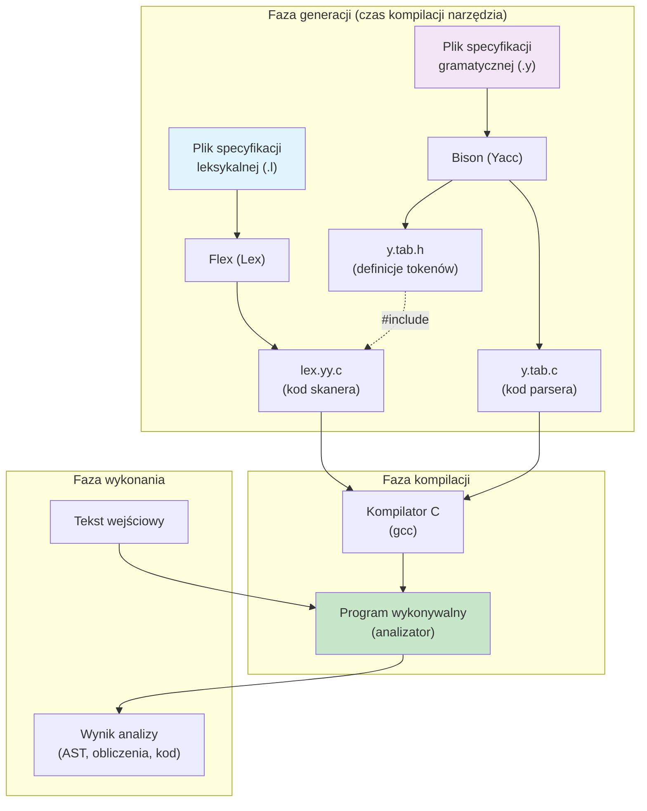
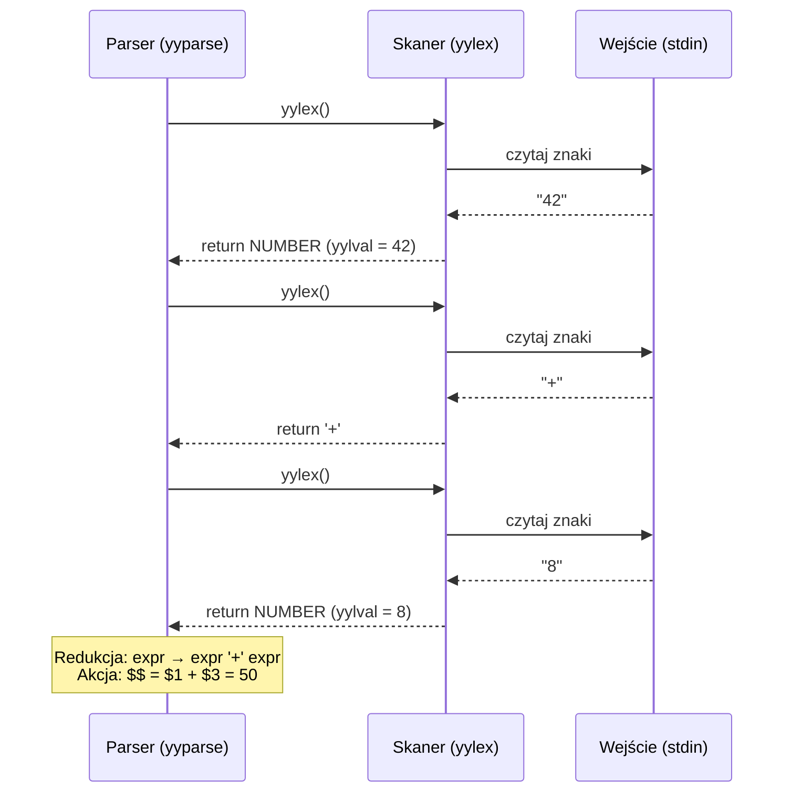
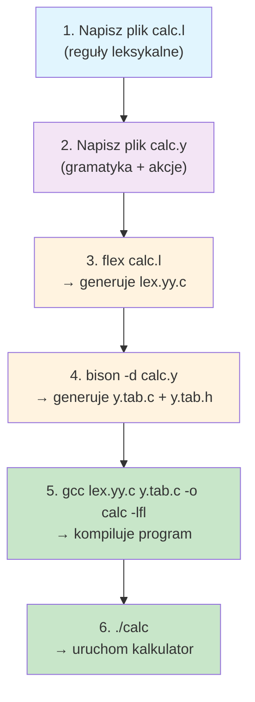
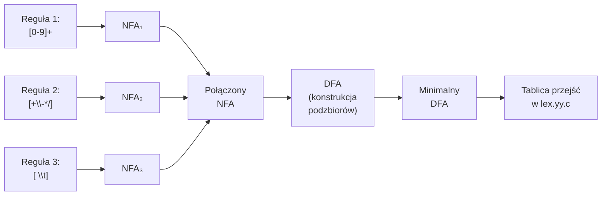
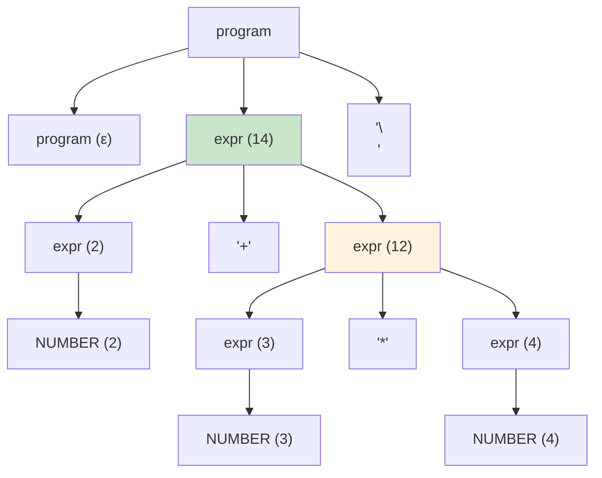

# Pytanie 4: Na wybranym przykładzie omówić zasadę działania generatorów analizatorów leksykalno-składniowych.

## Kluczowe pojęcia

- **Lex (Flex)** — generator analizatorów leksykalnych (skanerów). Na podstawie specyfikacji w postaci wyrażeń regularnych i przypisanych im akcji w języku C generuje kod źródłowy skanera w C. Flex (Fast Lexical Analyzer) jest nowoczesną, wolną implementacją Lexa, w pełni z nim kompatybilną. Wygenerowany skaner działa jako automat skończony (DFA) rozpoznający tokeny w strumieniu wejściowym.
- **Yacc (Bison)** — generator analizatorów składniowych (parserów). Na podstawie gramatyki bezkontekstowej w notacji BNF z akcjami semantycznymi w C generuje parser typu LALR(1). GNU Bison jest wolną implementacją Yacca, rozszerzającą go o dodatkowe funkcje (m.in. obsługę GLR, lokalizację błędów). Wygenerowany parser buduje drzewo wyprowadzenia metodą bottom-up (redukcja shift-reduce).
- **Reguły leksykalne** — pary (wyrażenie regularne, akcja), definiowane w pliku `.l`. Wyrażenie regularne opisuje wzorzec tokenu, a akcja (fragment kodu C) określa, co skaner ma zrobić po rozpoznaniu tokenu (np. zwrócić typ tokenu, zapisać wartość). Reguły są przetwarzane zgodnie z zasadą **najdłuższego dopasowania** (longest match) i **priorytetu** (pierwsza pasująca reguła).
- **Gramatyka BNF (Backus-Naur Form)** — formalizm opisu gramatyk bezkontekstowych używany w plikach `.y`. Definiuje symbole nieterminalne jako produkcje złożone z symboli terminalnych (tokenów) i nieterminalnych. Yacc/Bison rozszerza BNF o akcje semantyczne — fragmenty kodu C wykonywane przy redukcji produkcji.
- **Akcje semantyczne** — fragmenty kodu C umieszczone w nawiasach klamrowych `{ }` wewnątrz reguł gramatycznych pliku `.y`. Wykonywane są w momencie redukcji produkcji przez parser. Mają dostęp do wartości semantycznych symboli produkcji przez pseudozmienne `$$` (wartość lewej strony), `$1`, `$2`, ... (wartości symboli prawej strony). Umożliwiają budowę AST, obliczenia, generację kodu itp.

## Architektura Lex + Yacc

### Ogólna idea

Lex i Yacc to para współpracujących generatorów, które automatyzują tworzenie front-endu kompilatora (lub interpretera). Programista definiuje:
1. **Reguły leksykalne** (w pliku `.l`) — jak rozpoznawać tokeny
2. **Gramatykę** (w pliku `.y`) — jak tokeny łączą się w struktury składniowe

Generatory produkują kod C, który po kompilacji tworzy gotowy analizator leksykalno-składniowy.

### Diagram architektury



### Współpraca skanera i parsera

Wygenerowany skaner (z Lexa) i parser (z Yacca) współpracują według prostego protokołu:

1. Parser wywołuje funkcję `yylex()` (skaner), gdy potrzebuje kolejnego tokenu
2. Skaner czyta znaki z wejścia, dopasowuje je do reguł leksykalnych i zwraca typ tokenu (wartość `int`)
3. Wartość semantyczna tokenu (np. wartość liczbowa) jest przekazywana przez globalną zmienną `yylval`
4. Parser stosuje algorytm LALR(1) — shift/reduce — do budowy drzewa wyprowadzenia
5. Przy każdej redukcji produkcji parser wykonuje przypisaną akcję semantyczną



## Format pliku Lex/Flex (.l)

Plik specyfikacji leksykalnej ma trzy sekcje oddzielone znacznikiem `%%`:

```
%{
/* Sekcja definicji — kod C kopiowany dosłownie do wyjścia */
#include "y.tab.h"   /* definicje tokenów z Yacca */
#include <stdlib.h>
%}

/* Definicje pomocnicze (makra regex) */
DIGIT   [0-9]
LETTER  [a-zA-Z]

%%

/* Sekcja reguł — pary (wzorzec, akcja) */
{DIGIT}+        { yylval = atoi(yytext); return NUMBER; }
"+"             { return '+'; }
"-"             { return '-'; }
"*"             { return '*'; }
"/"             { return '/'; }
"("             { return '('; }
")"             { return ')'; }
\n              { return '\n'; }
[ \t]           { /* ignoruj białe znaki */ }
.               { printf("Nieznany znak: %s\n", yytext); }

%%

/* Sekcja kodu użytkownika — dodatkowe funkcje C */
/* (opcjonalna — często pusta, bo main() jest w pliku .y) */
```

### Opis sekcji pliku .l

| Sekcja | Zawartość | Cel |
|---|---|---|
| **Definicje** (`%{ ... %}`) | Kod C, dyrektywy `#include`, deklaracje zmiennych | Kod kopiowany na początek wygenerowanego pliku `lex.yy.c` |
| **Makra regex** | Nazwane wzorce, np. `DIGIT [0-9]` | Skróty używane w regułach jako `{DIGIT}` |
| **Reguły** (między `%%`) | Pary: wyrażenie regularne → akcja C | Definicja tokenów i ich obsługi |
| **Kod użytkownika** (po drugim `%%`) | Dowolny kod C | Funkcje pomocnicze, `main()` (opcjonalnie) |

### Zasady dopasowywania reguł

1. **Najdłuższe dopasowanie (longest match)** — skaner zawsze wybiera regułę, która dopasowuje najdłuższy prefiks wejścia
2. **Priorytet kolejności** — jeśli dwie reguły dopasowują ten sam najdłuższy prefiks, wybierana jest reguła zdefiniowana wcześniej w pliku
3. **Zmienna `yytext`** — wskaźnik na dopasowany tekst (leksem)
4. **Zmienna `yyleng`** — długość dopasowanego tekstu
5. **Zmienna `yylval`** — wartość semantyczna tokenu przekazywana do parsera

## Format pliku Yacc/Bison (.y)

Plik specyfikacji gramatycznej ma analogiczną strukturę trzech sekcji:

```
%{
/* Sekcja definicji — kod C */
#include <stdio.h>
#include <stdlib.h>

void yyerror(const char *s);
int yylex(void);
%}

/* Deklaracje tokenów i priorytetów */
%token NUMBER
%left '+' '-'
%left '*' '/'
%right UMINUS        /* minus unarny — najwyższy priorytet */

%%

/* Sekcja reguł gramatycznych z akcjami semantycznymi */
program:
      program expr '\n'   { printf("Wynik: %d\n", $2); }
    | /* pusta produkcja */
    ;

expr:
      expr '+' expr       { $$ = $1 + $3; }
    | expr '-' expr       { $$ = $1 - $3; }
    | expr '*' expr       { $$ = $1 * $3; }
    | expr '/' expr       {
                            if ($3 == 0) {
                                yyerror("Dzielenie przez zero");
                                $$ = 0;
                            } else {
                                $$ = $1 / $3;
                            }
                          }
    | '(' expr ')'        { $$ = $2; }
    | '-' expr %prec UMINUS { $$ = -$2; }
    | NUMBER              { $$ = $1; }
    ;

%%

/* Sekcja kodu użytkownika */
void yyerror(const char *s) {
    fprintf(stderr, "Błąd: %s\n", s);
}

int main(void) {
    printf("Kalkulator. Wpisz wyrażenie:\n");
    yyparse();
    return 0;
}
```

### Opis sekcji pliku .y

| Sekcja | Zawartość | Cel |
|---|---|---|
| **Definicje** (`%{ ... %}`) | Kod C, deklaracje funkcji | Kod kopiowany do wygenerowanego `y.tab.c` |
| **Deklaracje tokenów** | `%token`, `%left`, `%right`, `%nonassoc` | Definicja tokenów i ich priorytetów/łączności |
| **Reguły gramatyczne** (między `%%`) | Produkcje BNF z akcjami semantycznymi | Definicja gramatyki i przetwarzania |
| **Kod użytkownika** (po drugim `%%`) | `main()`, `yyerror()`, funkcje pomocnicze | Punkt wejścia programu i obsługa błędów |

### Deklaracje priorytetów i łączności operatorów

Yacc/Bison rozwiązuje konflikty shift/reduce za pomocą deklaracji priorytetów:

```
%left '+' '-'       /* najniższy priorytet, łączność lewostronna */
%left '*' '/'       /* wyższy priorytet, łączność lewostronna */
%right UMINUS       /* najwyższy priorytet, łączność prawostronna */
```

Operatory zadeklarowane **później** mają **wyższy priorytet**. Typy łączności:
- `%left` — łączność lewostronna: `a - b - c` = `(a - b) - c`
- `%right` — łączność prawostronna: `a = b = c` = `a = (b = c)`
- `%nonassoc` — brak łączności: `a < b < c` → błąd składniowy

### Pseudozmienne w akcjach semantycznych

| Pseudozmienna | Znaczenie |
|---|---|
| `$$` | Wartość semantyczna symbolu po lewej stronie produkcji (wynik redukcji) |
| `$1` | Wartość semantyczna pierwszego symbolu prawej strony |
| `$2` | Wartość semantyczna drugiego symbolu prawej strony |
| `$n` | Wartość semantyczna n-tego symbolu prawej strony |

Dla produkcji `expr: expr '+' expr { $$ = $1 + $3; }`:
- `$1` = wartość lewego `expr`
- `$2` = wartość tokenu `'+'` (zwykle nieużywana)
- `$3` = wartość prawego `expr`
- `$$` = wynik, który staje się wartością zredukowanego `expr`

## Proces generacji analizatora

### Krok po kroku



### Szczegóły procesu generacji

#### Flex: wyrażenia regularne → DFA

1. Flex parsuje plik `.l` i wyodrębnia reguły (pary wzorzec-akcja)
2. Każde wyrażenie regularne jest kompilowane do NFA (konstrukcja Thompsona)
3. Wszystkie NFA są łączone w jeden NFA z alternatywą (wspólny stan początkowy)
4. NFA jest konwertowany do DFA (konstrukcja podzbiorów)
5. DFA jest minimalizowany
6. Tablica przejść DFA jest zapisywana w pliku `lex.yy.c` wraz z kodem obsługi



#### Bison: gramatyka BNF → tablica LALR(1)

1. Bison parsuje plik `.y` i wyodrębnia produkcje gramatyczne
2. Buduje zbiory FIRST i FOLLOW dla symboli nieterminalnych
3. Konstruuje automat LR(0) (zbiór kanoniczny elementów LR)
4. Oblicza tablicę parsowania LALR(1) (ACTION + GOTO)
5. Rozwiązuje konflikty shift/reduce i reduce/reduce na podstawie deklaracji priorytetów
6. Tablica parsowania jest zapisywana w pliku `y.tab.c` wraz z kodem parsera

### Algorytm parsera LALR(1) — shift/reduce

Parser wygenerowany przez Bison działa na stosie i tablicy parsowania:

```
function yyparse():
    stack = [stan_początkowy]
    token = yylex()          // pobierz pierwszy token
    
    while true:
        state = stack.top()
        action = ACTION[state, token]
        
        switch action:
            case SHIFT(s):
                stack.push(token)
                stack.push(s)
                token = yylex()      // pobierz następny token
            
            case REDUCE(A → β):
                // Zdejmij |β| par (symbol, stan) ze stosu
                pop 2 * |β| elements from stack
                state = stack.top()
                stack.push(A)
                stack.push(GOTO[state, A])
                // Wykonaj akcję semantyczną dla A → β
                execute_semantic_action(A → β)
            
            case ACCEPT:
                return SUCCESS
            
            case ERROR:
                yyerror("syntax error")
                // Procedura odtwarzania po błędzie
                error_recovery()
```

## Przykłady

### Kompletny przykład: kalkulator wyrażeń arytmetycznych

Poniżej przedstawiono kompletny, działający przykład kalkulatora obsługującego cztery działania arytmetyczne, nawiasy i minus unarny. Przykład składa się z dwóch plików: `calc.l` (skaner) i `calc.y` (parser).

#### Plik `calc.l` — specyfikacja leksykalna

```c
%{
/*
 * calc.l — skaner dla kalkulatora wyrażeń arytmetycznych
 * Rozpoznaje: liczby całkowite, operatory +, -, *, /, nawiasy, nową linię
 */
#include "y.tab.h"    /* Plik nagłówkowy wygenerowany przez Bison —
                          zawiera definicje tokenów (NUMBER itp.) */
#include <stdlib.h>
%}

/* Definicje pomocnicze */
DIGIT   [0-9]

%%

{DIGIT}+        {
                    /* Dopasowano liczbę całkowitą */
                    yylval = atoi(yytext);  /* konwersja tekstu na int */
                    return NUMBER;           /* zwróć typ tokenu */
                }
"+"             { return '+'; }
"-"             { return '-'; }
"*"             { return '*'; }
"/"             { return '/'; }
"("             { return '('; }
")"             { return ')'; }
\n              { return '\n'; }    /* nowa linia = koniec wyrażenia */
[ \t]           { /* ignoruj spacje i tabulatory */ }
.               {
                    fprintf(stderr, "Nieznany znak: '%s'\n", yytext);
                    /* Znak nie pasujący do żadnej reguły */
                }

%%

/*
 * yywrap() — wywoływana, gdy skaner osiągnie koniec wejścia.
 * Zwraca 1 = koniec przetwarzania (brak kolejnych plików wejściowych).
 */
int yywrap(void) {
    return 1;
}
```

**Objaśnienie sekcji pliku `calc.l`:**

1. **Sekcja `%{ ... %}`** — dołączamy `y.tab.h` (definicje tokenów z Bisona) i `stdlib.h` (dla `atoi`)
2. **Makro `DIGIT`** — skrót dla klasy znaków `[0-9]`, używany w regułach jako `{DIGIT}`
3. **Reguła `{DIGIT}+`** — dopasowuje jedną lub więcej cyfr. Akcja konwertuje tekst (`yytext`) na liczbę całkowitą i zapisuje ją w `yylval`, a następnie zwraca token `NUMBER`
4. **Reguły operatorów** — każdy operator zwraca swój kod ASCII jako typ tokenu (konwencja Yacca dla tokenów jednoznakowych)
5. **Reguła `[ \t]`** — pusta akcja = ignorowanie białych znaków
6. **Reguła `.`** — dopasowuje dowolny znak nierozpoznany przez wcześniejsze reguły (catch-all)
7. **Funkcja `yywrap()`** — informuje skaner, że nie ma więcej plików wejściowych

#### Plik `calc.y` — specyfikacja gramatyczna

```c
%{
/*
 * calc.y — parser dla kalkulatora wyrażeń arytmetycznych
 * Gramatyka: wyrażenia z +, -, *, /, nawiasami i minusem unarnym
 */
#include <stdio.h>
#include <stdlib.h>

void yyerror(const char *s);
int yylex(void);
%}

/* Deklaracja tokenu — NUMBER jest tokenem zwracanym przez skaner */
%token NUMBER

/* Deklaracje priorytetów i łączności operatorów.
   Operatory zadeklarowane później mają WYŻSZY priorytet. */
%left '+' '-'           /* priorytet 1 (najniższy), łączność lewostronna */
%left '*' '/'           /* priorytet 2, łączność lewostronna */
%right UMINUS           /* priorytet 3 (najwyższy), łączność prawostronna */

%%

/*
 * Reguły gramatyczne (produkcje BNF) z akcjami semantycznymi.
 *
 * program składa się z ciągu linii, każda linia to wyrażenie + '\n'.
 * Pusta linia jest dozwolona (pusta produkcja).
 */
program:
      program expr '\n'     { printf("= %d\n", $2); }
    | program '\n'          { /* pusta linia — ignoruj */ }
    | /* ε — pusta produkcja (baza rekurencji) */
    ;

/*
 * expr — wyrażenie arytmetyczne.
 * Priorytet operatorów wynika z deklaracji %left/%right powyżej.
 */
expr:
      expr '+' expr         { $$ = $1 + $3; }
    | expr '-' expr         { $$ = $1 - $3; }
    | expr '*' expr         { $$ = $1 * $3; }
    | expr '/' expr         {
                                if ($3 == 0) {
                                    yyerror("dzielenie przez zero");
                                    $$ = 0;
                                } else {
                                    $$ = $1 / $3;
                                }
                            }
    | '(' expr ')'          { $$ = $2; }
    | '-' expr %prec UMINUS { $$ = -$2; }
    | NUMBER                { $$ = $1; }
    ;

%%

/*
 * yyerror() — wywoływana przez parser w przypadku błędu składniowego.
 * Wypisuje komunikat na stderr.
 */
void yyerror(const char *s) {
    fprintf(stderr, "Błąd: %s\n", s);
}

/*
 * main() — punkt wejścia programu.
 * Wywołuje yyparse(), który steruje całą analizą.
 */
int main(void) {
    printf("Kalkulator wyrażeń arytmetycznych.\n");
    printf("Wpisz wyrażenie i naciśnij Enter.\n");
    printf("Ctrl+D aby zakończyć.\n\n");
    yyparse();
    return 0;
}
```

**Objaśnienie sekcji pliku `calc.y`:**

1. **Sekcja `%{ ... %}`** — deklaracje funkcji `yyerror` i `yylex` (wymagane przez parser) oraz dołączenie nagłówków
2. **`%token NUMBER`** — deklaracja tokenu `NUMBER` (Bison przypisze mu wartość liczbową i umieści definicję w `y.tab.h`)
3. **`%left '+' '-'`** — operatory `+` i `-` mają najniższy priorytet i łączność lewostronną
4. **`%left '*' '/'`** — operatory `*` i `/` mają wyższy priorytet (zadeklarowane później)
5. **`%right UMINUS`** — sztuczny token do nadania najwyższego priorytetu minusowi unarnemu
6. **Produkcja `program`** — rekurencyjna, przetwarza ciąg linii (wyrażenie + `\n`)
7. **Produkcja `expr`** — definiuje wyrażenia arytmetyczne z akcjami obliczającymi wartość
8. **`%prec UMINUS`** — dyrektywa nadająca produkcji `'-' expr` priorytet tokenu `UMINUS`

#### Kompilacja i uruchomienie

```bash
# 1. Generacja skanera z pliku .l
flex calc.l                    # → lex.yy.c

# 2. Generacja parsera z pliku .y
bison -d calc.y                # → y.tab.c + y.tab.h
                               # Flaga -d generuje plik nagłówkowy z tokenami

# 3. Kompilacja wszystkiego razem
gcc lex.yy.c y.tab.c -o calc -lfl
# -lfl = linkowanie z biblioteką Flex (zawiera domyślny yywrap)

# 4. Uruchomienie
./calc
```

#### Przykładowa sesja

```
Kalkulator wyrażeń arytmetycznych.
Wpisz wyrażenie i naciśnij Enter.
Ctrl+D aby zakończyć.

2 + 3 * 4
= 14
(2 + 3) * 4
= 20
-5 + 3
= -2
100 / (2 + 3)
= 20
10 / 0
Błąd: dzielenie przez zero
= 0
```

### Śledzenie analizy wyrażenia `2 + 3 * 4`

Poniżej przedstawiono krok po kroku, jak skaner i parser współpracują przy analizie wyrażenia `2 + 3 * 4\n`.

#### Faza leksykalna (skaner)

Skaner generuje następujący strumień tokenów:

| Dopasowany tekst | Reguła | Token | `yylval` |
|---|---|---|---|
| `2` | `{DIGIT}+` | `NUMBER` | `2` |
| ` ` | `[ \t]` | (ignorowany) | — |
| `+` | `"+"` | `'+'` | — |
| ` ` | `[ \t]` | (ignorowany) | — |
| `3` | `{DIGIT}+` | `NUMBER` | `3` |
| ` ` | `[ \t]` | (ignorowany) | — |
| `*` | `"*"` | `'*'` | — |
| ` ` | `[ \t]` | (ignorowany) | — |
| `4` | `{DIGIT}+` | `NUMBER` | `4` |
| `\n` | `\n` | `'\n'` | — |

#### Faza składniowa (parser LALR(1))

Parser przetwarza tokeny metodą shift/reduce. Priorytet `*` > `+` zapewnia poprawną kolejność operacji:

| Krok | Stos | Wejście | Akcja | Komentarz |
|---|---|---|---|---|
| 1 | `$` | `NUMBER + NUMBER * NUMBER \n $` | shift | Przesuń `NUMBER(2)` |
| 2 | `$ NUMBER(2)` | `+ NUMBER * NUMBER \n $` | reduce | `expr → NUMBER` {`$$ = 2`} |
| 3 | `$ expr(2)` | `+ NUMBER * NUMBER \n $` | shift | Przesuń `+` |
| 4 | `$ expr(2) +` | `NUMBER * NUMBER \n $` | shift | Przesuń `NUMBER(3)` |
| 5 | `$ expr(2) + NUMBER(3)` | `* NUMBER \n $` | reduce | `expr → NUMBER` {`$$ = 3`} |
| 6 | `$ expr(2) + expr(3)` | `* NUMBER \n $` | shift | `*` ma wyższy priorytet niż `+` → shift (nie reduce!) |
| 7 | `$ expr(2) + expr(3) *` | `NUMBER \n $` | shift | Przesuń `NUMBER(4)` |
| 8 | `$ expr(2) + expr(3) * NUMBER(4)` | `\n $` | reduce | `expr → NUMBER` {`$$ = 4`} |
| 9 | `$ expr(2) + expr(3) * expr(4)` | `\n $` | reduce | `expr → expr * expr` {`$$ = 3 * 4 = 12`} |
| 10 | `$ expr(2) + expr(12)` | `\n $` | reduce | `expr → expr + expr` {`$$ = 2 + 12 = 14`} |
| 11 | `$ expr(14)` | `\n $` | shift | Przesuń `\n` |
| 12 | `$ expr(14) \n` | `$` | reduce | `program → program expr '\n'` {`printf("= 14")`} |

Kluczowy moment to **krok 6**: parser widzi `+` na stosie i `*` na wejściu. Ponieważ `*` ma wyższy priorytet niż `+`, parser wykonuje **shift** (przesunięcie), a nie reduce. Dzięki temu `3 * 4` jest obliczane przed dodaniem do `2`.

### Diagram drzewa wyprowadzenia

Drzewo wyprowadzenia dla wyrażenia `2 + 3 * 4`:



### Pliki generowane przez Flex i Bison

| Plik źródłowy | Polecenie | Pliki wygenerowane | Zawartość |
|---|---|---|---|
| `calc.l` | `flex calc.l` | `lex.yy.c` | Funkcja `yylex()` — skaner jako DFA z tablicą przejść |
| `calc.y` | `bison -d calc.y` | `y.tab.c` | Funkcja `yyparse()` — parser z tablicą LALR(1) |
| | | `y.tab.h` | Definicje tokenów: `#define NUMBER 258` itp. |

Plik `y.tab.h` jest kluczowy dla współpracy — skaner dołącza go (`#include "y.tab.h"`), aby znać wartości liczbowe tokenów zdefiniowanych w gramatyce.

### Obsługa błędów w Yacc/Bison

Bison oferuje wbudowany mechanizm odtwarzania po błędach składniowych za pomocą specjalnego tokenu `error`:

```c
program:
      program expr '\n'     { printf("= %d\n", $2); }
    | program '\n'
    | program error '\n'    { yyerrok; /* wyczyść stan błędu */ }
    | /* ε */
    ;
```

Gdy parser napotka błąd składniowy:
1. Wywołuje `yyerror("syntax error")`
2. Zdejmuje symbole ze stosu, aż znajdzie stan obsługujący token `error`
3. Przesuwa token `error` na stos
4. Odrzuca tokeny wejściowe, aż znajdzie token synchronizujący (tu: `'\n'`)
5. Kontynuuje parsowanie od następnej linii

## Podsumowanie

- **Lex/Flex** i **Yacc/Bison** to para generatorów automatyzujących budowę front-endu kompilatora — skanera (analiza leksykalna) i parsera (analiza składniowa).
- **Flex** kompiluje wyrażenia regularne do minimalnego DFA, generując funkcję `yylex()` w C. Skaner działa na zasadzie najdłuższego dopasowania i priorytetu reguł.
- **Bison** kompiluje gramatykę BNF do tablicy parsowania LALR(1), generując funkcję `yyparse()` w C. Parser działa metodą shift/reduce z obsługą priorytetów i łączności operatorów.
- Współpraca skanera i parsera opiera się na prostym protokole: parser wywołuje `yylex()`, skaner zwraca typ tokenu i wartość semantyczną (`yylval`).
- Pliki specyfikacji mają trójsekcyjną strukturę: definicje (`%{ %}` + deklaracje), reguły (między `%%`), kod użytkownika (po drugim `%%`).
- Akcje semantyczne w regułach gramatycznych umożliwiają obliczenia, budowę AST lub generację kodu w momencie redukcji produkcji.
- Deklaracje `%left`, `%right`, `%nonassoc` i `%prec` rozwiązują konflikty shift/reduce wynikające z niejednoznaczności gramatyki.
- Proces budowy analizatora: napisz `.l` i `.y` → `flex` + `bison` → `gcc` → program wykonywalny.
- Lex/Yacc pozostają fundamentem wielu narzędzi (kompilatory, interpretery, parsery konfiguracji, procesory języków domenowych) i stanowią wzorzec dla nowszych generatorów (ANTLR, PLY, tree-sitter).

## Powiązane pytania

- [Pytanie 1: Opisać etapy przetwarzania realizowane przez typowy kompilator języka C](01-etapy-kompilatora-c.md)
- [Pytanie 2: Omówić zasadę działania analizatora składniowego typu LL(1) ze stosem](02-analizator-ll1.md)
- [Pytanie 3: Przedstawić zasady kompilowania wyrażeń regularnych do automatów skończonych](03-wyrazenia-regularne-nfa-dfa.md)
- [Pytanie 5: Omów rolę reprezentacji pośredniej w procesie kompilacji](05-reprezentacja-posrednia-ir.md)
