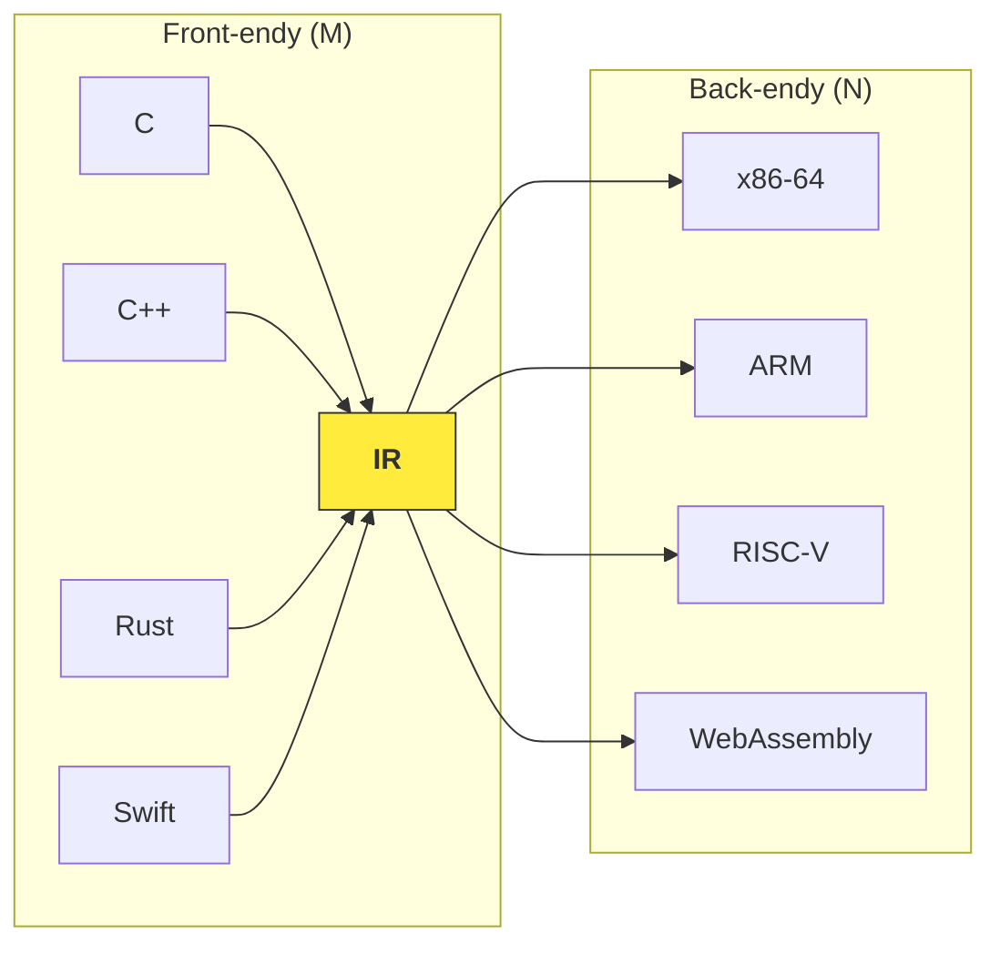
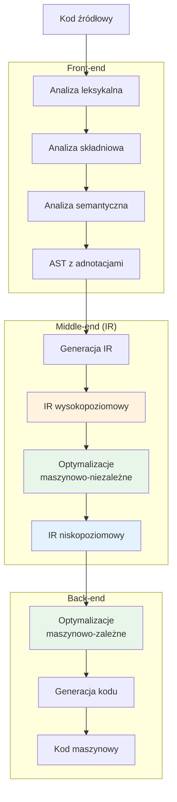
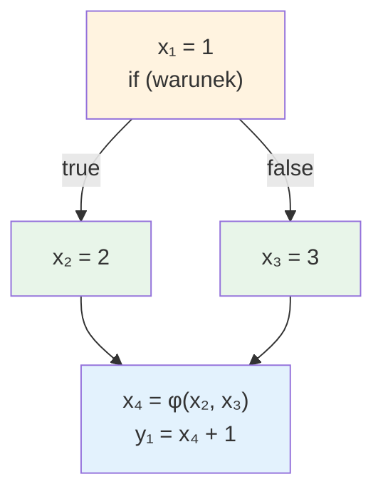
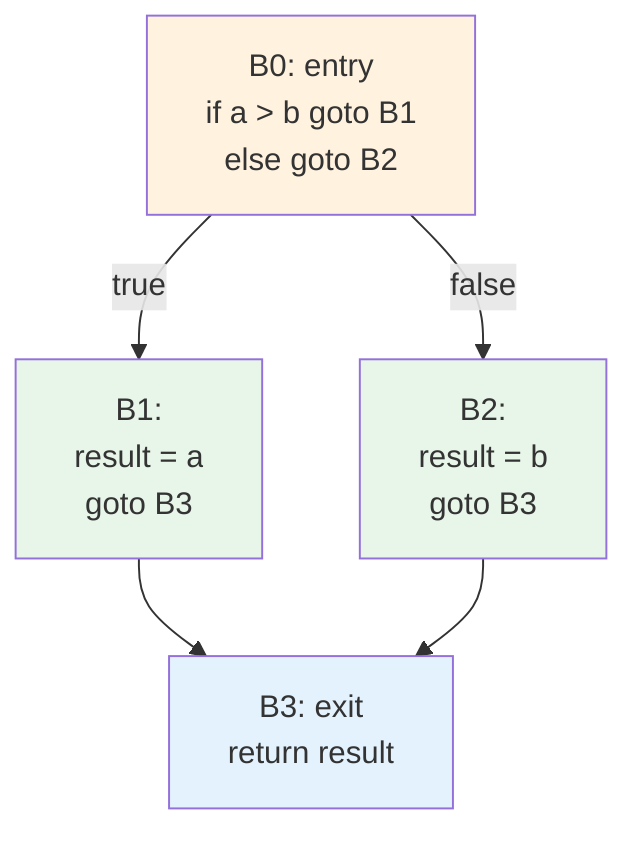
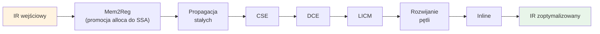
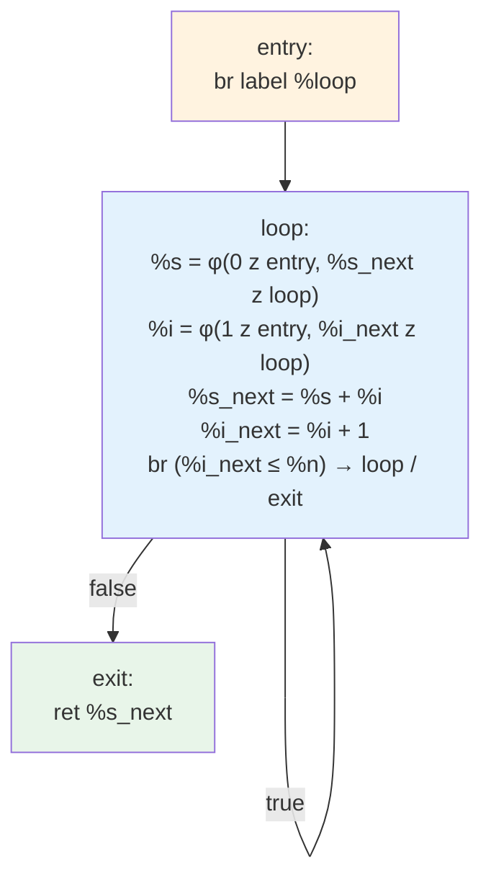

# Pytanie 5: Omów rolę reprezentacji pośredniej w procesie kompilacji.

## Kluczowe pojęcia

- **Reprezentacja pośrednia (IR — Intermediate Representation)** — wewnętrzna forma programu stosowana przez kompilator między fazą analizy (front-end) a fazą syntezy (back-end). IR jest niezależna od języka źródłowego i architektury docelowej, co umożliwia modularną budowę kompilatora.
- **SSA (Static Single Assignment)** — forma IR, w której każda zmienna jest przypisywana dokładnie raz. Wielokrotne przypisania do tej samej zmiennej są rozróżniane przez indeksy (np. `x₁`, `x₂`), a w punktach łączenia przepływu sterowania stosuje się specjalne funkcje φ (phi). SSA ułatwia wiele optymalizacji (propagacja stałych, eliminacja martwego kodu, eliminacja wspólnych podwyrażeń).
- **Trójki (triples)** — forma IR, w której każda instrukcja ma postać `(operator, argument1, argument2)`, a wynik jest identyfikowany niejawnie przez numer instrukcji. Nie wymaga jawnych zmiennych tymczasowych, ale utrudnia zmianę kolejności instrukcji.
- **Czwórki (quadruples)** — forma IR, w której każda instrukcja ma postać `(operator, argument1, argument2, wynik)`. Wynik jest jawnie nazwany, co ułatwia reorganizację i optymalizację kodu.
- **Graf przepływu sterowania (CFG — Control Flow Graph)** — skierowany graf, w którym węzłami są bloki podstawowe (sekwencje instrukcji bez rozgałęzień wewnętrznych), a krawędziami — możliwe przejścia sterowania (skoki warunkowe, bezwarunkowe, wywołania). CFG jest fundamentalną strukturą do analizy przepływu danych i optymalizacji.
- **LLVM IR** — niskopoziomowa, typowana reprezentacja pośrednia w formie SSA, stosowana w infrastrukturze kompilatorowej LLVM. Jest dobrze zdefiniowana, posiada trzy równoważne formy (tekstową `.ll`, binarną bitcode `.bc`, in-memory) i stanowi de facto standard IR w nowoczesnych kompilatorach.

## Rola IR w architekturze kompilatora

### Problem M × N

Bez reprezentacji pośredniej, kompilator obsługujący *M* języków źródłowych i *N* architektur docelowych wymagałby *M × N* oddzielnych translatorów. Wprowadzenie wspólnego IR redukuje ten problem do *M + N* komponentów: *M* front-endów (język → IR) i *N* back-endów (IR → kod maszynowy).



### Funkcje IR w procesie kompilacji

IR pełni kilka kluczowych funkcji:

1. **Oddzielenie front-endu od back-endu** — front-end (analiza leksykalna, składniowa, semantyczna) generuje IR, a back-end (optymalizacja, generacja kodu) konsumuje IR. Dzięki temu oba komponenty mogą być rozwijane niezależnie.

2. **Platforma optymalizacji** — większość optymalizacji kompilatora (propagacja stałych, eliminacja martwego kodu, przesuwanie kodu niezmienniczego pętli) jest wykonywana na poziomie IR, ponieważ IR jest wystarczająco abstrakcyjna, by ukryć szczegóły maszynowe, a jednocześnie wystarczająco niskopoziomowa, by umożliwić precyzyjne transformacje.

3. **Przenośność** — ten sam IR może być przetłumaczony na kod maszynowy dla różnych architektur, co umożliwia kompilację krzyżową (cross-compilation).

4. **Wielojęzyczność** — różne języki źródłowe mogą współdzielić ten sam back-end i optymalizator, jeśli generują wspólny IR (np. Clang, Rust, Swift → LLVM IR).

5. **Analiza programu** — IR umożliwia zaawansowane analizy statyczne: analizę przepływu danych, analizę aliasów, analizę zależności, wykrywanie martwego kodu.

### Diagram architektury kompilatora z IR



## Rodzaje reprezentacji pośredniej

Reprezentacje pośrednie można klasyfikować według poziomu abstrakcji:

### IR wysokopoziomowy (High-Level IR)

IR wysokopoziomowy jest bliski strukturze języka źródłowego. Zachowuje informacje o typach, pętlach, tablicach i strukturach danych.

**Cechy:**
- Zachowuje konstrukcje języka źródłowego (pętle `for`/`while`, tablice, struktury)
- Ułatwia optymalizacje zależne od języka (np. wektoryzacja pętli)
- Przykłady: AST z adnotacjami, GIMPLE (GCC, wczesna faza), Rust MIR (Mid-level IR)

**Przykład — GIMPLE (GCC):**
```
// Kod C:
// for (int i = 0; i < n; i++) sum += a[i];

// GIMPLE (uproszczony):
i_1 = 0;
goto <bb 3>;

<bb 2>:
_2 = a[i_1];
sum_3 = sum_4 + _2;
i_5 = i_1 + 1;

<bb 3>:
if (i_1 < n_6) goto <bb 2>; else goto <bb 4>;

<bb 4>:
return sum_3;
```

### IR średniopoziomowy (Mid-Level IR)

IR średniopoziomowy stanowi kompromis — jest niezależny od języka źródłowego, ale zachowuje pewne informacje o typach i strukturze programu.

**Cechy:**
- Niezależny od języka źródłowego
- Zachowuje informacje o typach
- Umożliwia większość optymalizacji
- Przykłady: LLVM IR, Java Bytecode

### IR niskopoziomowy (Low-Level IR)

IR niskopoziomowy jest bliski kodowi maszynowemu. Operuje na rejestrach (wirtualnych lub fizycznych), adresach pamięci i instrukcjach zbliżonych do instrukcji procesora.

**Cechy:**
- Bliski architekturze docelowej
- Operuje na rejestrach wirtualnych
- Umożliwia optymalizacje maszynowo-zależne (planowanie instrukcji, alokacja rejestrów)
- Przykłady: RTL (GCC), LLVM MachineIR, LIR (HotSpot JVM)

### Porównanie poziomów IR

| Cecha | IR wysokopoziomowy | IR średniopoziomowy | IR niskopoziomowy |
|---|---|---|---|
| Abstrakcja | Bliska językowi źródłowemu | Niezależna od języka | Bliska maszynie docelowej |
| Typy danych | Złożone (tablice, struktury) | Proste + wskaźniki | Rejestry, adresy |
| Pętle | Jawne (`for`, `while`) | Grafy przepływu | Skoki warunkowe |
| Optymalizacje | Zależne od języka | Maszynowo-niezależne | Maszynowo-zależne |
| Przykłady | AST, GIMPLE | LLVM IR, Java Bytecode | RTL, MachineIR |

## Formy zapisu IR

### Kod trójadresowy (Three-Address Code — TAC)

Kod trójadresowy to jedna z najpopularniejszych form IR. Każda instrukcja ma co najwyżej trzy operandy i jedną operację:

```
x = y op z      // operacja binarna
x = op y        // operacja unarna
x = y           // kopiowanie
```

Kod trójadresowy może być implementowany jako **trójki** lub **czwórki**.

### Trójki (Triples)

W trójkach każda instrukcja ma postać `(operator, arg1, arg2)`. Wynik instrukcji jest identyfikowany przez jej numer (indeks), co eliminuje potrzebę jawnych zmiennych tymczasowych.

**Zalety:** mniejsze zużycie pamięci (brak jawnych nazw wyników).
**Wady:** zmiana kolejności instrukcji wymaga aktualizacji wszystkich odwołań do numerów instrukcji.

**Przykład** — wyrażenie `a + b * c - d`:

| Nr | Operator | Arg1 | Arg2 |
|---|---|---|---|
| (0) | `*` | `b` | `c` |
| (1) | `+` | `a` | (0) |
| (2) | `-` | (1) | `d` |

Wynik instrukcji (0) to `b * c`, instrukcji (1) to `a + (0)` = `a + b*c`, instrukcji (2) to `(1) - d`.

### Czwórki (Quadruples)

W czwórkach każda instrukcja ma postać `(operator, arg1, arg2, wynik)`. Wynik jest jawnie nazwany zmienną tymczasową.

**Zalety:** łatwa reorganizacja instrukcji (wyniki mają stałe nazwy), prostsza optymalizacja.
**Wady:** większe zużycie pamięci (dodatkowe nazwy zmiennych tymczasowych).

**Przykład** — to samo wyrażenie `a + b * c - d`:

| Nr | Operator | Arg1 | Arg2 | Wynik |
|---|---|---|---|---|
| (0) | `*` | `b` | `c` | `t1` |
| (1) | `+` | `a` | `t1` | `t2` |
| (2) | `-` | `t2` | `d` | `t3` |

### Porównanie trójek i czwórek

| Cecha | Trójki | Czwórki |
|---|---|---|
| Wynik | Niejawny (numer instrukcji) | Jawny (zmienna tymczasowa) |
| Pamięć | Mniejsza | Większa |
| Reorganizacja | Trudna | Łatwa |
| Optymalizacja | Utrudniona | Ułatwiona |
| Zastosowanie | Kompilatory akademickie | Większość kompilatorów produkcyjnych |

## Forma SSA (Static Single Assignment)

### Definicja

W formie SSA każda zmienna jest definiowana (przypisywana) **dokładnie raz** w tekście programu. Jeśli zmienna oryginalna jest przypisywana wielokrotnie, każde przypisanie tworzy nową wersję zmiennej z unikalnym indeksem.

### Funkcja φ (phi)

W punktach łączenia przepływu sterowania (gdzie zbiegają się dwie lub więcej ścieżek wykonania) stosuje się specjalną **funkcję φ**, która wybiera odpowiednią wersję zmiennej w zależności od ścieżki, którą dotarło sterowanie.

### Przykład konwersji do SSA

**Kod oryginalny:**
```c
x = 1;
if (warunek) {
    x = 2;
} else {
    x = 3;
}
y = x + 1;
```

**Forma SSA:**
```
x₁ = 1
if (warunek) goto L1 else goto L2

L1:
    x₂ = 2
    goto L3

L2:
    x₃ = 3
    goto L3

L3:
    x₄ = φ(x₂, x₃)
    y₁ = x₄ + 1
```

### Diagram przepływu sterowania w SSA



### Zalety SSA

| Zaleta | Opis |
|---|---|
| **Jednoznaczność definicji** | Każda zmienna ma dokładnie jedną definicję — łatwo znaleźć, skąd pochodzi wartość |
| **Uproszczenie analizy def-use** | Łańcuchy definicja-użycie (def-use chains) są trywialne do zbudowania |
| **Propagacja stałych** | Jeśli `x₁ = 5`, to wszędzie, gdzie pojawia się `x₁`, można wstawić `5` |
| **Eliminacja martwego kodu** | Jeśli `x₁` nie ma żadnego użycia, instrukcja definiująca `x₁` jest martwa |
| **Eliminacja wspólnych podwyrażeń** | Dwa identyczne wyrażenia z tymi samymi operandami SSA dają ten sam wynik |
| **Alokacja rejestrów** | Zakresy życia zmiennych SSA nie nakładają się (chyba że przez φ) |

### Algorytm konwersji do SSA (szkic)

```
Algorytm: Konwersja do formy SSA
Wejście: CFG z kodem trójadresowym
Wyjście: CFG w formie SSA

1. Oblicz granice dominacji (dominance frontiers) dla każdego bloku
2. Dla każdej zmiennej v definiowanej w bloku B:
   a. Wstaw funkcje φ dla v na początku każdego bloku w DF(B)
   b. Powtarzaj iteracyjnie (wstawienie φ może wymagać kolejnych φ)
3. Przemianuj zmienne:
   a. Przejdź CFG w porządku dominacji (dominator tree)
   b. Dla każdej definicji v: nadaj nowy indeks (v₁, v₂, ...)
   c. Dla każdego użycia v: użyj aktualnej wersji ze stosu
   d. Zaktualizuj argumenty funkcji φ w blokach następnikach
```

## Graf przepływu sterowania (CFG)

### Definicja

**Graf przepływu sterowania (Control Flow Graph — CFG)** to skierowany graf, w którym:
- **Węzły** to **bloki podstawowe** (basic blocks) — maksymalne sekwencje instrukcji wykonywanych sekwencyjnie, bez rozgałęzień wewnętrznych (skok może wystąpić tylko na końcu bloku, a cel skoku — tylko na początku bloku)
- **Krawędzie** reprezentują możliwe przejścia sterowania między blokami (skoki warunkowe, bezwarunkowe, przejścia sekwencyjne)

CFG jest fundamentalną strukturą danych do analizy przepływu danych i optymalizacji na IR.

### Budowa CFG

```
Algorytm: Budowa CFG
Wejście: lista instrukcji IR
Wyjście: CFG

1. Identyfikacja liderów bloków podstawowych:
   a. Pierwsza instrukcja programu jest liderem
   b. Cel każdego skoku jest liderem
   c. Instrukcja następująca po skoku jest liderem

2. Budowa bloków: każdy blok zaczyna się od lidera
   i kończy przed następnym liderem

3. Budowa krawędzi:
   a. Skok warunkowy → dwie krawędzie (true/false)
   b. Skok bezwarunkowy → jedna krawędź do celu
   c. Brak skoku → krawędź do następnego bloku (fall-through)
```

### Przykład CFG

Dla kodu C:
```c
int max(int a, int b) {
    int result;
    if (a > b) {
        result = a;
    } else {
        result = b;
    }
    return result;
}
```

IR i odpowiadający CFG:



### Pojęcia związane z CFG

| Pojęcie | Definicja |
|---|---|
| **Dominator** | Blok A dominuje blok B, jeśli każda ścieżka od wejścia do B przechodzi przez A |
| **Granica dominacji** | Blok B jest na granicy dominacji A, jeśli A dominuje poprzednika B, ale nie dominuje B |
| **Pętla naturalna** | Krawędź wsteczna (back edge) B → A, gdzie A dominuje B; ciało pętli to zbiór bloków, z których można dotrzeć do B bez przechodzenia przez A |
| **Blok wejściowy** | Blok bez poprzedników (entry block) |
| **Blok wyjściowy** | Blok zawierający instrukcję `return` lub bez następników |

## LLVM IR — szczegółowy opis

### Charakterystyka

LLVM IR jest jedną z najważniejszych współczesnych reprezentacji pośrednich. Jej kluczowe cechy:

1. **Forma SSA** — każda zmienna (rejestr wirtualny) jest definiowana dokładnie raz
2. **Typowanie** — każda wartość ma jawny typ (np. `i32`, `float`, `i8*`)
3. **Nieskończona liczba rejestrów wirtualnych** — nazwy `%0`, `%1`, `%nazwa`
4. **Trzy równoważne formy:**
   - Tekstowa (`.ll`) — czytelna dla człowieka
   - Binarna bitcode (`.bc`) — kompaktowa, szybka do parsowania
   - In-memory — wewnętrzna struktura danych w kompilatorze

### Podstawowe elementy LLVM IR

| Element | Opis | Przykład |
|---|---|---|
| **Moduł** | Jednostka kompilacji (odpowiednik pliku `.c`) | `; ModuleID = 'example.c'` |
| **Funkcja** | Definicja lub deklaracja funkcji | `define i32 @add(i32 %a, i32 %b)` |
| **Blok podstawowy** | Sekwencja instrukcji z etykietą | `entry:` |
| **Instrukcja** | Operacja na wartościach | `%sum = add i32 %a, %b` |
| **Typ** | Typ wartości | `i32`, `float`, `i8*`, `[10 x i32]` |
| **Rejestr wirtualny** | Zmienna SSA | `%x`, `%0` |
| **Zmienna globalna** | Zmienna widoczna w całym module | `@global_var` |

### Przykład LLVM IR

Kod C:
```c
int factorial(int n) {
    if (n <= 1) return 1;
    return n * factorial(n - 1);
}
```

LLVM IR (tekstowa forma `.ll`):
```llvm
define i32 @factorial(i32 %n) {
entry:
    %cmp = icmp sle i32 %n, 1
    br i1 %cmp, label %then, label %else

then:
    ret i32 1

else:
    %n_minus_1 = sub i32 %n, 1
    %rec = call i32 @factorial(i32 %n_minus_1)
    %result = mul i32 %n, %rec
    ret i32 %result
}
```

### Typy instrukcji LLVM IR

| Kategoria | Instrukcje | Opis |
|---|---|---|
| **Arytmetyczne** | `add`, `sub`, `mul`, `sdiv`, `srem` | Operacje na liczbach całkowitych |
| **Zmiennoprzecinkowe** | `fadd`, `fsub`, `fmul`, `fdiv` | Operacje na floatach |
| **Porównania** | `icmp`, `fcmp` | Porównania (eq, ne, slt, sgt, ...) |
| **Pamięć** | `alloca`, `load`, `store` | Alokacja na stosie, odczyt, zapis |
| **Przepływ sterowania** | `br`, `switch`, `ret` | Skoki, powrót z funkcji |
| **Konwersje** | `sext`, `zext`, `trunc`, `bitcast` | Konwersje typów |
| **Wywołania** | `call`, `invoke` | Wywołania funkcji |
| **Funkcje φ** | `phi` | Wybór wartości w SSA |

## Optymalizacje na IR

Reprezentacja pośrednia jest główną platformą optymalizacji w kompilatorze. Optymalizacje na IR dzielą się na maszynowo-niezależne (middle-end) i maszynowo-zależne (back-end).

### Optymalizacje maszynowo-niezależne

#### 1. Propagacja stałych (Constant Propagation)

Jeśli zmienna SSA ma znaną wartość stałą, wszystkie jej użycia zastępujemy tą stałą.

```
// Przed:                    // Po:
x₁ = 5                      x₁ = 5
y₁ = x₁ + 3                 y₁ = 5 + 3    →    y₁ = 8
z₁ = y₁ * 2                 z₁ = 8 * 2    →    z₁ = 16
```

#### 2. Eliminacja martwego kodu (Dead Code Elimination — DCE)

Instrukcja jest martwa, jeśli jej wynik nie jest nigdzie używany. W SSA jest to trywialne — wystarczy sprawdzić, czy zmienna ma puste use-list.

```
// Przed:                    // Po:
x₁ = a₁ + b₁               x₁ = a₁ + b₁
y₁ = c₁ * d₁    ← martwa   (usunięta — y₁ nie jest nigdzie używana)
z₁ = x₁ - 1                 z₁ = x₁ - 1
```

#### 3. Eliminacja wspólnych podwyrażeń (Common Subexpression Elimination — CSE)

Jeśli dwa wyrażenia obliczają tę samą wartość (te same operandy SSA i operator), drugie obliczenie zastępujemy odwołaniem do wyniku pierwszego.

```
// Przed:                    // Po:
t₁ = a₁ + b₁                t₁ = a₁ + b₁
t₂ = a₁ + b₁                t₂ = t₁        // CSE
t₃ = t₁ * t₂                t₃ = t₁ * t₁
```

#### 4. Przesuwanie kodu niezmienniczego pętli (Loop-Invariant Code Motion — LICM)

Wyrażenie, którego wartość nie zmienia się w iteracjach pętli, jest przenoszone przed pętlę.

```
// Przed:                    // Po:
                             t₁ = b₁ * c₁    // wyniesione przed pętlę
loop:                        loop:
    t₁ = b₁ * c₁                a₂ = a₁ + t₁
    a₂ = a₁ + t₁                ...
    ...
```

#### 5. Rozwijanie pętli (Loop Unrolling)

Ciało pętli jest powielane, aby zmniejszyć narzut sterowania (sprawdzanie warunku, inkrementacja iteratora).

```
// Przed:                    // Po (unroll ×2):
for i = 0 to n:              for i = 0 to n step 2:
    a[i] = b[i] + c[i]          a[i]   = b[i]   + c[i]
                                  a[i+1] = b[i+1] + c[i+1]
```

### Przebieg optymalizacji (pass pipeline)

Optymalizacje są stosowane jako sekwencja **przebiegów (passes)**. Każdy przebieg transformuje IR i przekazuje wynik do następnego.



## Przykłady

### Przykład 1: Translacja kodu C do kodu trójadresowego (czwórki)

**Kod C:**
```c
int compute(int a, int b, int c) {
    int x = a + b;
    int y = x * c;
    if (y > 100) {
        return y - a;
    }
    return y + a;
}
```

**Kod trójadresowy (czwórki):**

| Nr | Operator | Arg1 | Arg2 | Wynik |
|---|---|---|---|---|
| 1 | `+` | `a` | `b` | `t1` |
| 2 | `=` | `t1` | — | `x` |
| 3 | `*` | `x` | `c` | `t2` |
| 4 | `=` | `t2` | — | `y` |
| 5 | `>` | `y` | `100` | `t3` |
| 6 | `iffalse` | `t3` | — | `goto 9` |
| 7 | `-` | `y` | `a` | `t4` |
| 8 | `return` | `t4` | — | — |
| 9 | `+` | `y` | `a` | `t5` |
| 10 | `return` | `t5` | — | — |

### Przykład 2: Translacja do formy SSA

**Ten sam kod w formie SSA:**
```
entry:
    t1₁ = a₁ + b₁
    x₁ = t1₁
    t2₁ = x₁ * c₁
    y₁ = t2₁
    cond₁ = y₁ > 100
    br cond₁, label %then, label %else

then:
    t4₁ = y₁ - a₁
    ret t4₁

else:
    t5₁ = y₁ + a₁
    ret t5₁
```

### Przykład 3: Translacja do LLVM IR

**LLVM IR dla tego samego kodu:**
```llvm
define i32 @compute(i32 %a, i32 %b, i32 %c) {
entry:
    %x = add i32 %a, %b
    %y = mul i32 %x, %c
    %cond = icmp sgt i32 %y, 100
    br i1 %cond, label %then, label %else

then:
    %r1 = sub i32 %y, %a
    ret i32 %r1

else:
    %r2 = add i32 %y, %a
    ret i32 %r2
}
```

### Przykład 4: Optymalizacja na IR — pełny przebieg

**Kod C (przed optymalizacją):**
```c
int example(int n) {
    int a = 10;
    int b = 20;
    int c = a + b;       // stałe — można obliczyć w czasie kompilacji
    int d = c * 2;       // j.w.
    int e = n + d;
    int f = n + d;       // wspólne podwyrażenie z e
    int g = a * b;       // martwy kod (g nie jest używane)
    return e + f;
}
```

**Krok 1 — IR wejściowy (czwórki):**

| Nr | Op | Arg1 | Arg2 | Wynik |
|---|---|---|---|---|
| 1 | `=` | `10` | — | `a` |
| 2 | `=` | `20` | — | `b` |
| 3 | `+` | `a` | `b` | `c` |
| 4 | `*` | `c` | `2` | `d` |
| 5 | `+` | `n` | `d` | `e` |
| 6 | `+` | `n` | `d` | `f` |
| 7 | `*` | `a` | `b` | `g` |
| 8 | `+` | `e` | `f` | `t1` |
| 9 | `ret` | `t1` | — | — |

**Krok 2 — Propagacja stałych:**
- `a = 10`, `b = 20` → `c = 10 + 20 = 30` → `d = 30 * 2 = 60`

| Nr | Op | Arg1 | Arg2 | Wynik |
|---|---|---|---|---|
| 5 | `+` | `n` | `60` | `e` |
| 6 | `+` | `n` | `60` | `f` |
| 7 | `*` | `10` | `20` | `g` |
| 8 | `+` | `e` | `f` | `t1` |
| 9 | `ret` | `t1` | — | — |

**Krok 3 — CSE:** `f = n + 60` jest identyczne z `e = n + 60`, więc `f = e`.

| Nr | Op | Arg1 | Arg2 | Wynik |
|---|---|---|---|---|
| 5 | `+` | `n` | `60` | `e` |
| 8 | `+` | `e` | `e` | `t1` |
| 7 | `*` | `10` | `20` | `g` |
| 9 | `ret` | `t1` | — | — |

**Krok 4 — DCE:** `g = 10 * 20` — zmienna `g` nie jest nigdzie używana → usunięta.

| Nr | Op | Arg1 | Arg2 | Wynik |
|---|---|---|---|---|
| 5 | `+` | `n` | `60` | `e` |
| 8 | `+` | `e` | `e` | `t1` |
| 9 | `ret` | `t1` | — | — |

**Wynik końcowy — zoptymalizowany LLVM IR:**
```llvm
define i32 @example(i32 %n) {
entry:
    %e = add i32 %n, 60
    %t1 = add i32 %e, %e
    ret i32 %t1
}
```

Z 9 instrukcji pozostały 3 — redukcja o 67%.

### Przykład 5: Pętla z funkcją φ w SSA

**Kod C:**
```c
int sum(int n) {
    int s = 0;
    for (int i = 1; i <= n; i++) {
        s = s + i;
    }
    return s;
}
```

**LLVM IR z funkcjami φ:**
```llvm
define i32 @sum(i32 %n) {
entry:
    br label %loop

loop:
    %s = phi i32 [0, %entry], [%s_next, %loop]
    %i = phi i32 [1, %entry], [%i_next, %loop]
    %s_next = add i32 %s, %i
    %i_next = add i32 %i, 1
    %cond = icmp sle i32 %i_next, %n
    br i1 %cond, label %loop, label %exit

exit:
    ret i32 %s_next
}
```

**Diagram CFG z funkcjami φ:**



## Podsumowanie

1. **Reprezentacja pośrednia (IR)** jest kluczowym elementem architektury kompilatora, stanowiącym pomost między front-endem (analiza kodu źródłowego) a back-endem (generacja kodu maszynowego). Rozwiązuje problem *M × N*, redukując go do *M + N*.

2. **Rodzaje IR** różnią się poziomem abstrakcji: IR wysokopoziomowy (bliski językowi źródłowemu, np. GIMPLE), średniopoziomowy (niezależny od języka i maszyny, np. LLVM IR) oraz niskopoziomowy (bliski architekturze docelowej, np. RTL).

3. **Kod trójadresowy** to klasyczna forma IR, implementowana jako **trójki** (wynik niejawny — numer instrukcji) lub **czwórki** (wynik jawny — zmienna tymczasowa). Czwórki są preferowane w praktyce ze względu na łatwość optymalizacji.

4. **Forma SSA** wymaga, by każda zmienna była definiowana dokładnie raz. Stosuje **funkcje φ** w punktach łączenia przepływu sterowania. SSA radykalnie upraszcza wiele optymalizacji (propagacja stałych, DCE, CSE).

5. **Graf przepływu sterowania (CFG)** jest fundamentalną strukturą do analizy i optymalizacji IR. Węzłami są bloki podstawowe, krawędziami — przejścia sterowania.

6. **LLVM IR** to współczesny standard IR: typowany, w formie SSA, z trzema równoważnymi reprezentacjami (tekstowa, bitcode, in-memory). Stosowany przez Clang, Rust, Swift i wiele innych kompilatorów.

7. **Optymalizacje na IR** obejmują: propagację stałych, eliminację martwego kodu (DCE), eliminację wspólnych podwyrażeń (CSE), przesuwanie kodu niezmienniczego pętli (LICM), rozwijanie pętli i inline expansion. Są stosowane jako sekwencja przebiegów (passes).

8. Dobrze zaprojektowany IR umożliwia budowę **modularnych, przenośnych i wydajnych kompilatorów**, co potwierdza sukces infrastruktury LLVM.

## Powiązane pytania

- [Pytanie 1: Opisać etapy przetwarzania realizowane przez typowy kompilator języka C](01-etapy-kompilatora-c.md)
- [Pytanie 4: Na wybranym przykładzie omówić zasadę działania generatorów analizatorów leksykalno-składniowych](04-generatory-lex-yacc.md)
