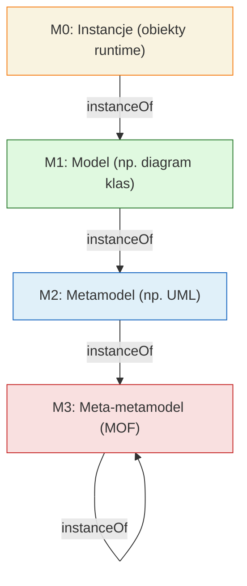
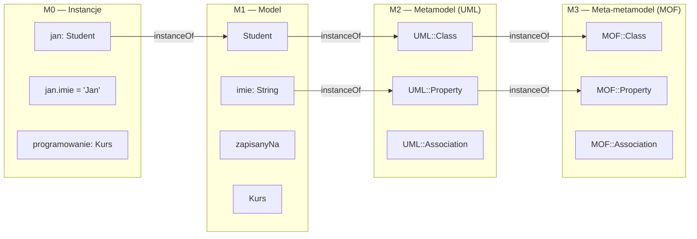
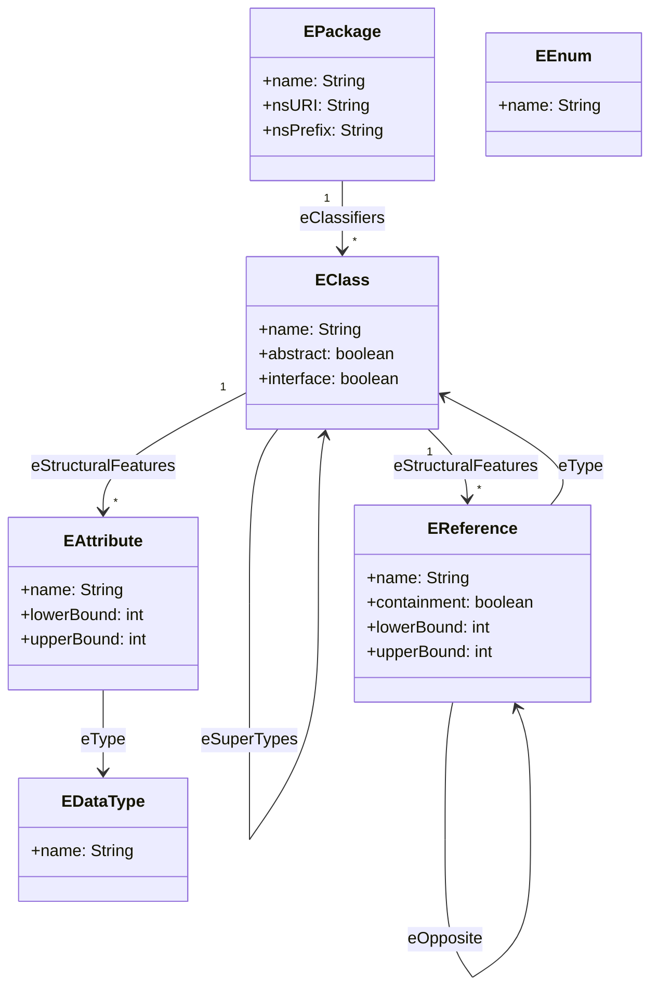
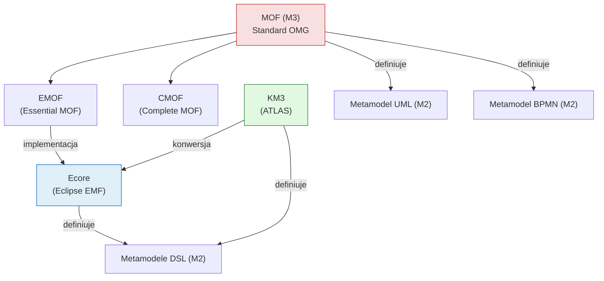
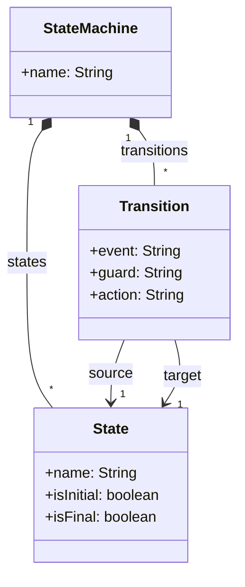
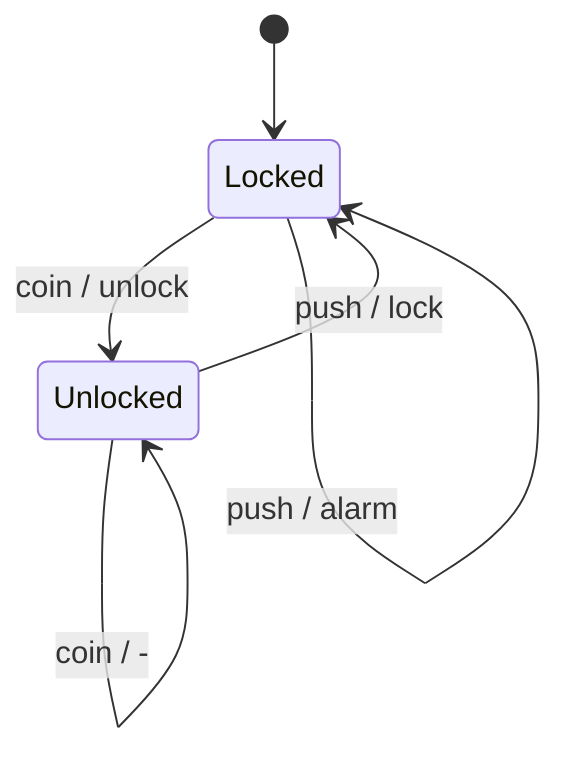
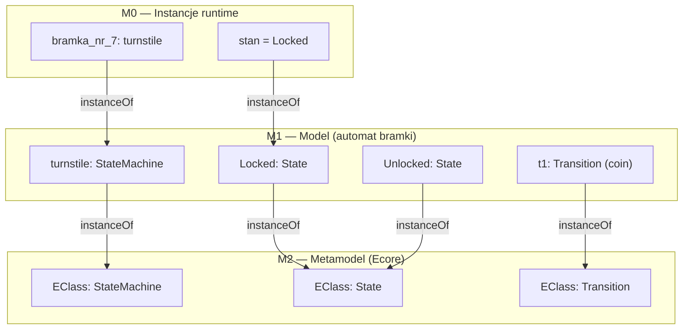
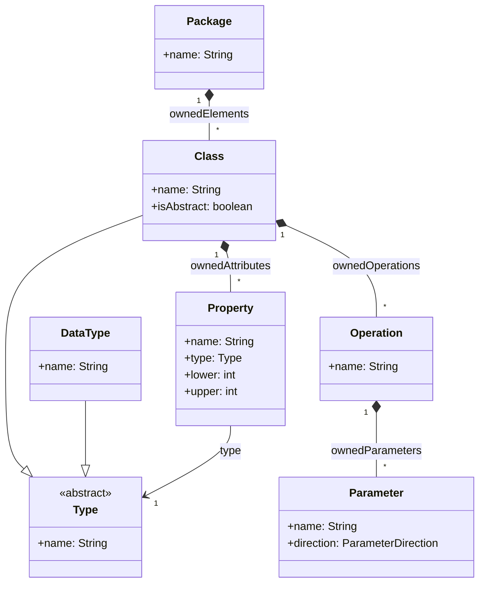

# Pytanie 6: Co to jest metamodel? W jakich językach można tworzyć metamodele?

## Kluczowe pojęcia

- **Metamodel** — model modelu, czyli formalny opis struktury, składni i ograniczeń języka modelowania. Metamodel definiuje, jakie elementy (metaklasy, atrybuty, relacje) mogą występować w modelach tworzonych w danym języku. Relacja między metamodelem a modelem jest analogiczna do relacji między gramatyką a zdaniem w języku naturalnym.
- **MOF (Meta-Object Facility)** — standard OMG definiujący język metamodelowania na najwyższym poziomie abstrakcji (M3). MOF jest samoopisujący (meta-metamodel) i stanowi fundament architektury modelowania OMG. Służy do definiowania metamodeli takich jak UML czy BPMN.
- **Ecore** — metamodel bazowy platformy Eclipse Modeling Framework (EMF), będący praktyczną implementacją podzbioru MOF (tzw. EMOF — Essential MOF). Ecore jest najszerzej stosowanym językiem metamodelowania w narzędziach open-source.
- **KM3 (Kernel MetaMetaModel)** — lekki język metamodelowania opracowany w ramach projektu ATLAS (INRIA/LINA). KM3 oferuje tekstową składnię do definiowania metamodeli, jest prostszy od MOF i stosowany głównie w ekosystemie ATL.
- **Poziomy modelowania (M0–M3)** — czterowarstwowa hierarchia modelowania zdefiniowana przez OMG:
  - **M0 (instancje)** — rzeczywiste obiekty i dane w systemie (np. konkretny student „Jan Kowalski")
  - **M1 (model)** — model opisujący dziedzinę (np. diagram klas UML z klasą `Student`)
  - **M2 (metamodel)** — metamodel definiujący język modelowania (np. metamodel UML definiujący pojęcie „klasa", „atrybut", „asocjacja")
  - **M3 (meta-metamodel)** — meta-metamodel definiujący język metamodelowania (np. MOF)

## Definicja metamodelu

### Czym jest metamodel?

Metamodel to **model opisujący strukturę i reguły języka modelowania**. Określa:

1. **Składnię abstrakcyjną** — jakie elementy (metaklasy) mogą występować w modelu i jakie mają atrybuty
2. **Relacje** — jakie powiązania (asocjacje, kompozycje, dziedziczenie) mogą zachodzić między elementami
3. **Ograniczenia** — jakie reguły poprawności (invarianty, krotności, typy) muszą być spełnione
4. **Semantykę statyczną** — dodatkowe warunki poprawności wyrażone np. w OCL (Object Constraint Language)

Metamodel **nie definiuje** składni konkretnej (graficznej lub tekstowej) — ta jest określana osobno.

### Analogia lingwistyczna

| Poziom | Lingwistyka | Modelowanie |
|---|---|---|
| Reguły | Gramatyka języka polskiego | Metamodel (np. metamodel UML) |
| Wyrażenie | Zdanie „Kot siedzi na macie" | Model (np. diagram klas) |
| Rzeczywistość | Konkretny kot na konkretnej macie | Instancje (obiekty w systemie) |

### Relacja „instanceOf"

Kluczową relacją w hierarchii modelowania jest **instanceOf** (jest instancją):



Każdy element na danym poziomie jest instancją elementu z poziomu wyższego. MOF (M3) jest samoopisujący — jest instancją samego siebie.

## Hierarchia modelowania OMG (M0–M3)

Object Management Group (OMG) zdefiniowała czterowarstwową architekturę modelowania, która stanowi fundament standardów takich jak UML, BPMN, SysML i CWM.

### Poziom M0 — Instancje (dane rzeczywiste)

Poziom M0 reprezentuje **konkretne obiekty i dane** istniejące w działającym systemie. Są to instancje elementów zdefiniowanych w modelu (M1).

**Przykład:** Konkretny obiekt w pamięci programu:
- Obiekt `jan` klasy `Student` z atrybutami: `imie = "Jan"`, `nazwisko = "Kowalski"`, `nrIndeksu = 123456`

### Poziom M1 — Model (opis dziedziny)

Poziom M1 to **modele** tworzone przez projektantów i analityków. Opisują strukturę i zachowanie systemu w terminach zdefiniowanych przez metamodel (M2).

**Przykład:** Diagram klas UML zawierający:
- Klasę `Student` z atrybutami `imie: String`, `nazwisko: String`, `nrIndeksu: Integer`
- Klasę `Kurs` z atrybutem `nazwa: String`
- Asocjację `zapisanyNa` między `Student` a `Kurs`

### Poziom M2 — Metamodel (opis języka modelowania)

Poziom M2 to **metamodele** definiujące języki modelowania. Metamodel określa, jakie konstrukcje są dostępne w języku.

**Przykład:** Metamodel UML definiuje pojęcia:
- `Class` — metaklasa opisująca klasy w modelach UML
- `Property` — metaklasa opisująca atrybuty i końce asocjacji
- `Association` — metaklasa opisująca powiązania między klasami
- Reguły: klasa może mieć wiele atrybutów, asocjacja łączy dokładnie dwie klasy itp.

### Poziom M3 — Meta-metamodel (opis języka metamodelowania)

Poziom M3 to **meta-metamodel** — język służący do definiowania metamodeli. W architekturze OMG rolę tę pełni MOF.

**Przykład:** MOF definiuje pojęcia:
- `Class` (metaklasa w meta-metamodelu) — służy do definiowania metaklas w metamodelach
- `Property`, `Association`, `Package`, `DataType` — podstawowe konstrukcje metamodelowania

### Diagram poziomów z przykładami




## Języki metamodelowania — przegląd

Języki metamodelowania służą do formalnego definiowania metamodeli. Poniżej przedstawiono trzy najważniejsze: MOF, Ecore i KM3.

### MOF (Meta-Object Facility)

#### Charakterystyka

MOF to standard OMG (ISO/IEC 19508) pełniący rolę meta-metamodelu (M3) w architekturze modelowania. MOF definiuje podstawowe konstrukcje, z których budowane są metamodele.

**Warianty MOF:**

| Wariant | Opis | Zastosowanie |
|---|---|---|
| **EMOF (Essential MOF)** | Uproszczony podzbiór MOF z podstawowymi konstrukcjami | Proste metamodele, Ecore |
| **CMOF (Complete MOF)** | Pełna specyfikacja z refleksją i rozszerzeniami | Złożone metamodele, narzędzia OMG |

#### Podstawowe konstrukcje MOF

| Konstrukcja | Opis |
|---|---|
| `Class` | Metaklasa — definiuje typ elementu w metamodelu |
| `Property` | Atrybut lub koniec asocjacji metaklasy |
| `Association` | Relacja między metaklasami (w CMOF) |
| `Package` | Kontener grupujący metaklasy |
| `DataType` | Typ prosty (String, Integer, Boolean itp.) |
| `Enumeration` | Typ wyliczeniowy |
| `Operation` | Operacja zdefiniowana na metaklasie |
| `Constraint` | Ograniczenie poprawności (np. w OCL) |

#### Zalety i ograniczenia MOF

| Zalety | Ograniczenia |
|---|---|
| Standard OMG — szeroka akceptacja | Złożona specyfikacja (szczególnie CMOF) |
| Samoopisujący (M3 = instanceOf M3) | Brak bezpośredniego wsparcia narzędziowego open-source |
| Fundament dla UML, BPMN, SysML, CWM | Abstrakcyjny — wymaga implementacji (np. Ecore) |
| Obsługa XMI (serializacja modeli) | Krzywa uczenia się |

### Ecore (Eclipse Modeling Framework)

#### Charakterystyka

Ecore to praktyczna implementacja EMOF w ramach Eclipse Modeling Framework (EMF). Jest to **najszerzej stosowany język metamodelowania** w ekosystemie open-source. Ecore stanowi fundament wielu narzędzi modelowania: GMF, Sirius, Xtext, ATL, Acceleo.

#### Podstawowe konstrukcje Ecore

| Konstrukcja Ecore | Odpowiednik MOF | Opis |
|---|---|---|
| `EClass` | `Class` | Metaklasa — definiuje typ elementu |
| `EAttribute` | `Property` (atrybut) | Atrybut metaklasy (typ prosty) |
| `EReference` | `Property` (koniec asocjacji) | Referencja do innej metaklasy |
| `EPackage` | `Package` | Kontener grupujący metaklasy |
| `EDataType` | `DataType` | Typ danych (String, int, boolean itp.) |
| `EEnum` | `Enumeration` | Typ wyliczeniowy |
| `EOperation` | `Operation` | Operacja na metaklasie |
| `EAnnotation` | — | Adnotacja (metadane) |

#### Kluczowe cechy Ecore

1. **Dziedziczenie** — `EClass` może dziedziczyć po wielu `EClass` (wielodziedziczenie)
2. **Kompozycja** — `EReference` z flagą `containment = true` oznacza relację kompozycji (część-całość)
3. **Krotności** — `lowerBound` i `upperBound` na `EReference` i `EAttribute`
4. **Typy generyczne** — wsparcie dla parametryzacji typów
5. **Serializacja XMI** — automatyczna serializacja/deserializacja modeli do XML

#### Diagram metamodelu Ecore (uproszczony)



### KM3 (Kernel MetaMetaModel)

#### Charakterystyka

KM3 to lekki język metamodelowania opracowany przez zespół ATLAS (INRIA/Université de Nantes). Oferuje **tekstową składnię** do definiowania metamodeli, co czyni go bardziej przystępnym niż graficzny MOF czy Ecore.

#### Składnia KM3

KM3 używa składni zbliżonej do języków programowania:

```
package PetriNet {
    class PetriNet {
        attribute name : String;
        reference places ordered container : Place oppositeOf net;
        reference transitions ordered container : Transition oppositeOf net;
    }
    
    class Place {
        attribute name : String;
        attribute tokens : Integer;
        reference net container : PetriNet oppositeOf places;
        reference outgoing[*] : Arc oppositeOf source;
        reference incoming[*] : Arc oppositeOf target;
    }
    
    class Transition {
        attribute name : String;
        reference net container : PetriNet oppositeOf transitions;
        reference outgoing[*] : Arc oppositeOf source;
        reference incoming[*] : Arc oppositeOf target;
    }
    
    class Arc {
        attribute weight : Integer;
        reference source : Place oppositeOf outgoing;
        reference target : Transition oppositeOf incoming;
    }
}
```

#### Podstawowe konstrukcje KM3

| Konstrukcja | Opis |
|---|---|
| `package` | Kontener grupujący metaklasy |
| `class` | Metaklasa |
| `attribute` | Atrybut (typ prosty) |
| `reference` | Referencja do innej metaklasy |
| `container` | Oznaczenie relacji kompozycji (odwrotność containment) |
| `oppositeOf` | Referencja odwrotna (bidirectional) |
| `ordered` | Kolekcja uporządkowana |
| `[*]` | Krotność „wiele" (0..*) |

#### Zalety i ograniczenia KM3

| Zalety | Ograniczenia |
|---|---|
| Prosta, czytelna składnia tekstowa | Mniejsza popularność niż Ecore |
| Łatwy do nauki | Ograniczony ekosystem narzędziowy |
| Dobrze integruje się z ATL | Brak wsparcia dla operacji (EOperation) |
| Konwertowalny do/z Ecore | Brak standardu OMG |

## Porównanie MOF, Ecore i KM3

### Tabela porównawcza

| Cecha | MOF | Ecore | KM3 |
|---|---|---|---|
| **Organizacja** | OMG (standard ISO) | Eclipse Foundation | ATLAS/INRIA |
| **Poziom** | M3 (meta-metamodel) | M3 (implementacja EMOF) | M3 (alternatywny) |
| **Składnia** | Abstrakcyjna (XMI) | Graficzna + XMI | Tekstowa |
| **Wielodziedziczenie** | Tak | Tak | Tak |
| **Kompozycja** | Tak (Association) | Tak (containment) | Tak (container) |
| **Operacje** | Tak | Tak (EOperation) | Nie |
| **Ograniczenia OCL** | Tak | Tak (przez EMF Validation) | Nie natywnie |
| **Serializacja** | XMI | XMI (automatyczna) | Tekst / konwersja do XMI |
| **Narzędzia** | Komercyjne (MagicDraw, EA) | EMF, Sirius, Xtext, GMF | ATL, AM3 |
| **Krzywa uczenia** | Stroma | Umiarkowana | Łagodna |
| **Zastosowanie** | Standardy OMG | Projekty open-source, przemysł | Badania, ATL |

### Diagram relacji między językami metamodelowania



## Zastosowania metamodeli

### 1. Definiowanie języków dziedzinowych (DSL)

Metamodele służą do tworzenia **Domain-Specific Languages** — języków modelowania dostosowanych do konkretnej dziedziny (np. sieci Petriego, automaty stanowe, modele biznesowe).

### 2. Transformacje modeli (M2M)

Metamodele źródłowy i docelowy stanowią podstawę **transformacji model-do-modelu** (np. w ATL, QVT). Reguły transformacji odwołują się do metaklas zdefiniowanych w metamodelach.

### 3. Generacja kodu (M2T)

Metamodel definiuje strukturę modelu, z którego **generowany jest kod** (np. w Acceleo, Xpand, JET). Generator kodu nawiguje po instancjach metaklas.

### 4. Walidacja modeli

Metamodel wraz z ograniczeniami OCL umożliwia **automatyczną walidację** poprawności modeli — sprawdzenie, czy model jest zgodny ze swoim metamodelem.

### 5. Interoperacyjność narzędzi

Wspólny metamodel (np. UML zdefiniowany w MOF) zapewnia **wymianę modeli** między różnymi narzędziami CASE za pośrednictwem formatu XMI.

### 6. Model-Driven Architecture (MDA)

Metamodele są fundamentem podejścia **MDA/MDD** — transformacje CIM → PIM → PSM → kod opierają się na metamodelach poszczególnych poziomów abstrakcji.


## Przykłady

### Prosty metamodel w Ecore — język automatów stanowych

Zaprojektujemy metamodel prostego języka automatów stanowych (Finite State Machine). Metamodel definiuje, jakie elementy mogą występować w modelu automatu.

#### Wymagania dziedzinowe

Automat stanowy składa się z:
- **Stanów** (states) — w tym stanu początkowego i stanów końcowych
- **Przejść** (transitions) — łączących stany, wyzwalanych zdarzeniami

#### Metamodel w Ecore (diagram)



**Legenda:**
- `*--` oznacza kompozycję (containment) — stany i przejścia należą do automatu
- `-->` oznacza referencję — przejście wskazuje na stan źródłowy i docelowy

#### Metamodel w składni KM3

```
package StateMachine {
    class StateMachine {
        attribute name : String;
        reference states ordered container : State oppositeOf machine;
        reference transitions ordered container : Transition oppositeOf machine;
    }
    
    class State {
        attribute name : String;
        attribute isInitial : Boolean;
        attribute isFinal : Boolean;
        reference machine container : StateMachine oppositeOf states;
        reference outgoing[*] : Transition oppositeOf source;
        reference incoming[*] : Transition oppositeOf target;
    }
    
    class Transition {
        attribute event : String;
        attribute guard : String;
        attribute action : String;
        reference machine container : StateMachine oppositeOf transitions;
        reference source : State oppositeOf outgoing;
        reference target : State oppositeOf incoming;
    }
}
```

#### Przykładowa instancja modelu (M1)

Na podstawie powyższego metamodelu możemy utworzyć model konkretnego automatu — np. automat sterujący bramką obrotową (turnstile):



Ten model jest **instancją** metamodelu `StateMachine`:

| Element modelu (M1) | Metaklasa (M2) | Atrybuty |
|---|---|---|
| `turnstile` | `StateMachine` | `name = "Turnstile"` |
| `Locked` | `State` | `name = "Locked"`, `isInitial = true`, `isFinal = false` |
| `Unlocked` | `State` | `name = "Unlocked"`, `isInitial = false`, `isFinal = false` |
| `t1: coin` | `Transition` | `event = "coin"`, `source = Locked`, `target = Unlocked`, `action = "unlock"` |
| `t2: push` | `Transition` | `event = "push"`, `source = Unlocked`, `target = Locked`, `action = "lock"` |
| `t3: coin` | `Transition` | `event = "coin"`, `source = Unlocked`, `target = Unlocked` |
| `t4: push` | `Transition` | `event = "push"`, `source = Locked`, `target = Locked`, `action = "alarm"` |

#### Relacja instanceOf na trzech poziomach



### Metamodel UML — fragment (klasy i atrybuty)

Poniżej uproszczony fragment metamodelu UML pokazujący, jak sam UML jest zdefiniowany jako metamodel:



Ten metamodel (M2) definiuje, że w modelu UML (M1) mogą występować klasy, atrybuty, operacje itd. Sam metamodel UML jest instancją MOF (M3).

## Podsumowanie

1. **Metamodel** to formalny opis języka modelowania — definiuje składnię abstrakcyjną, relacje i ograniczenia. Jest „modelem modelu" i stanowi fundament inżynierii sterowanej modelami (MDE).

2. **Hierarchia OMG (M0–M3)** organizuje modelowanie w cztery poziomy: instancje (M0), modele (M1), metamodele (M2) i meta-metamodel (M3). Każdy poziom jest instancją poziomu wyższego.

3. **MOF** (Meta-Object Facility) to standard OMG na poziomie M3, definiujący język metamodelowania. Występuje w wariantach EMOF (uproszczony) i CMOF (pełny).

4. **Ecore** to praktyczna implementacja EMOF w Eclipse Modeling Framework — najszerzej stosowany język metamodelowania w ekosystemie open-source. Oferuje metaklasy (`EClass`), atrybuty (`EAttribute`), referencje (`EReference`) i pakiety (`EPackage`).

5. **KM3** to lekki język metamodelowania z tekstową składnią, stosowany głównie w ekosystemie ATL. Jest prostszy od MOF/Ecore, ale ma mniejszy ekosystem narzędziowy.

6. **Zastosowania metamodeli** obejmują: definiowanie DSL, transformacje modeli (M2M), generację kodu (M2T), walidację modeli, interoperacyjność narzędzi i architekturę MDA/MDD.

7. Wybór języka metamodelowania zależy od kontekstu: **MOF** dla standardów OMG, **Ecore** dla projektów opartych na Eclipse/EMF, **KM3** dla szybkiego prototypowania metamodeli w ekosystemie ATL.

## Powiązane pytania

- [Pytanie 7: Proszę omówić podstawowe konstrukcje wybranego języka metamodelowania](07-konstrukcje-jezyka-metamodelowania.md)
- [Pytanie 8: Proszę omówić podstawowe konstrukcje wybranego języka transformacji modeli](08-jezyki-transformacji-modeli.md)
- [Pytanie 9: Proszę narysować przykładowy metamodel języka modelowania składający się z 2-3 metaklas](09-przykladowy-metamodel.md)
- [Pytanie 10: Proszę wyjaśnić zasady procesu wytwarzania oprogramowania sterowanego modelami](10-mda-mdd.md)
