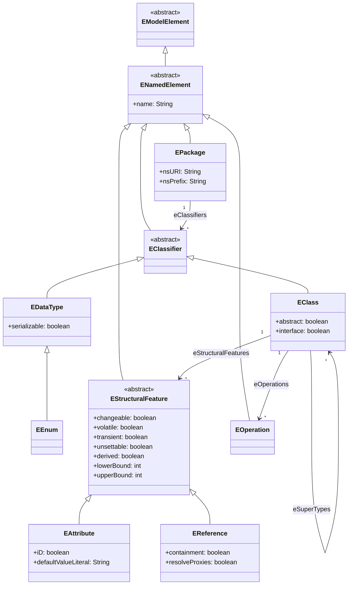
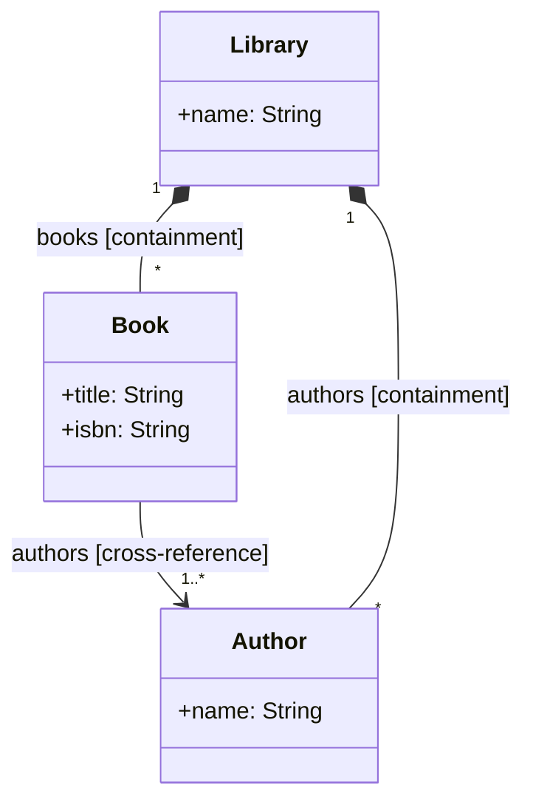
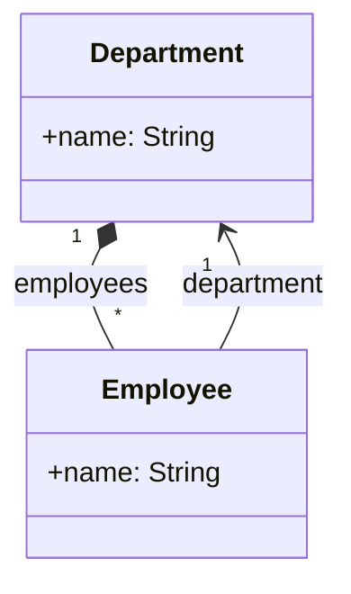
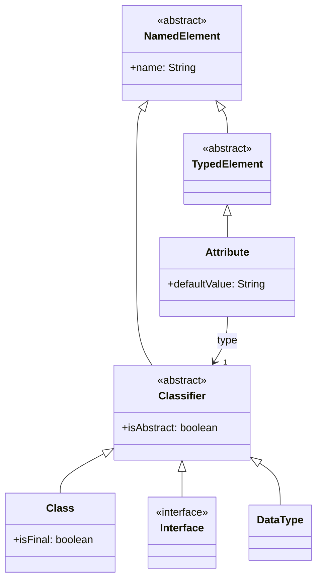
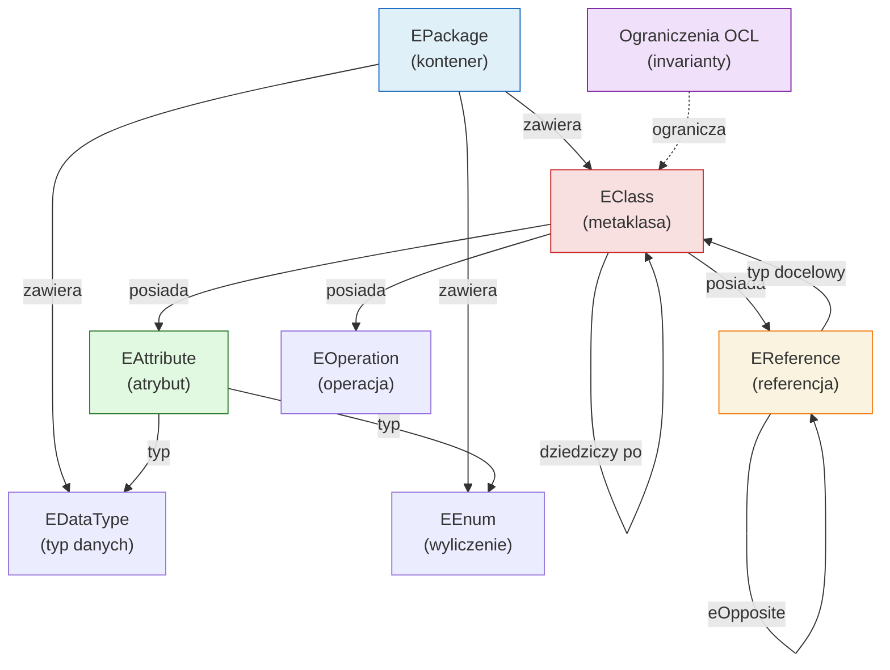
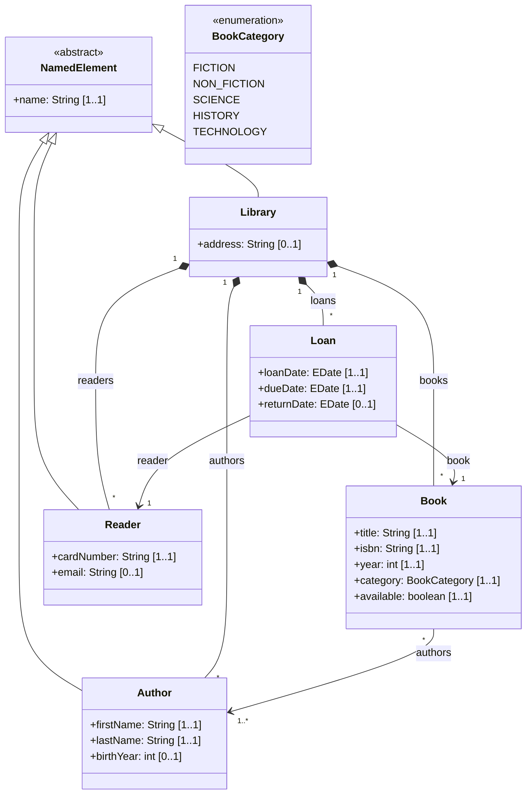
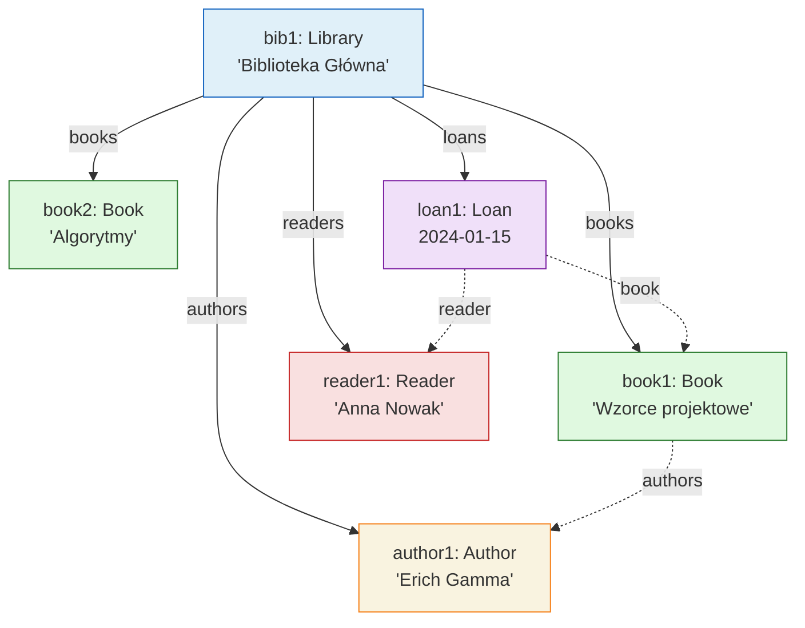

# Pytanie 7: Proszę omówić podstawowe konstrukcje wybranego języka metamodelowania.

## Kluczowe pojęcia

- **Metaklasa (EClass)** — podstawowy element metamodelu definiujący typ elementu w języku modelowania. Metaklasa opisuje strukturę (atrybuty, referencje) i zachowanie (operacje) swoich instancji. W Ecore metaklasa jest reprezentowana przez `EClass` i może być abstrakcyjna (`abstract = true`) lub konkretna. Metaklasa może dziedziczyć po wielu innych metaklasach (wielodziedziczenie).
- **Atrybut (EAttribute)** — cecha strukturalna metaklasy przechowująca wartość typu prostego (prymitywnego). W Ecore atrybut jest reprezentowany przez `EAttribute` i posiada typ (`eType`) będący instancją `EDataType` (np. `EString`, `EInt`, `EBoolean`). Atrybuty mogą mieć wartość domyślną, krotność oraz flagę `unsettable`.
- **Asocjacja / Referencja (EReference)** — cecha strukturalna metaklasy reprezentująca powiązanie z inną metaklasą. W Ecore asocjacje są modelowane jako `EReference` — jednostronne wskaźniki na inną `EClass`. Referencja dwukierunkowa wymaga pary `EReference` połączonych przez `eOpposite`. Referencja może być typu kompozycji (`containment = true`) lub zwykłej referencji.
- **Dziedziczenie** — mechanizm pozwalający metaklasie dziedziczyć atrybuty, referencje i operacje po jednej lub wielu metaklasach nadrzędnych (`eSuperTypes`). Ecore wspiera wielodziedziczenie. Metaklasy abstrakcyjne (`abstract = true`) nie mogą mieć bezpośrednich instancji i służą jako wspólna baza dla metaklas pochodnych.
- **Kompozycja (Containment)** — szczególny rodzaj referencji oznaczający relację część-całość z semantyką posiadania. W Ecore kompozycja jest wyrażona przez `EReference` z flagą `containment = true`. Element może należeć do co najwyżej jednego kontenera (właściciela). Usunięcie kontenera powoduje kaskadowe usunięcie zawartych elementów. Kompozycja definiuje strukturę drzewiastą modelu.
- **Referencja zwykła (Cross-reference)** — referencja niebędąca kompozycją (`containment = false`), reprezentująca luźne powiązanie między elementami modelu. Element wskazywany przez cross-reference może istnieć niezależnie od elementu wskazującego. Referencje zwykłe tworzą graf powiązań nakładany na drzewo kompozycji.

## Wprowadzenie — Ecore jako język metamodelowania

Ecore jest praktyczną implementacją EMOF (Essential MOF) w ramach Eclipse Modeling Framework (EMF). Jest to najszerzej stosowany język metamodelowania w ekosystemie open-source i stanowi fundament wielu narzędzi: Sirius, Xtext, ATL, Acceleo, GMF.

Ecore definiuje zestaw **konstrukcji metamodelowania**, z których budowane są metamodele języków modelowania. Każda konstrukcja Ecore jest sama w sobie metaklasą — Ecore jest więc metamodelem opisującym, jak tworzyć inne metamodele.

### Hierarchia konstrukcji Ecore



## Metaklasa (EClass)

### Definicja i rola

`EClass` jest centralną konstrukcją Ecore — definiuje **typ elementu** w metamodelu. Każda metaklasa posiada nazwę, może zawierać atrybuty, referencje i operacje, oraz może dziedziczyć po innych metaklasach.

### Właściwości EClass

| Właściwość | Typ | Opis |
|---|---|---|
| `name` | `String` | Nazwa metaklasy (unikalna w obrębie pakietu) |
| `abstract` | `boolean` | Czy metaklasa jest abstrakcyjna (nie może mieć bezpośrednich instancji) |
| `interface` | `boolean` | Czy metaklasa jest interfejsem (analogia do interfejsu Java) |
| `eSuperTypes` | `EClass[*]` | Lista metaklas nadrzędnych (wielodziedziczenie) |
| `eStructuralFeatures` | `EStructuralFeature[*]` | Lista atrybutów i referencji |
| `eOperations` | `EOperation[*]` | Lista operacji |

### Metaklasy abstrakcyjne vs konkretne

- **Metaklasa konkretna** (`abstract = false`) — może mieć bezpośrednie instancje w modelu. Przykład: `State`, `Transition` w metamodelu automatu stanowego.
- **Metaklasa abstrakcyjna** (`abstract = true`) — nie może mieć bezpośrednich instancji, służy jako wspólna baza dla metaklas pochodnych. Przykład: `NamedElement` jako baza dla `Class` i `Package`.
- **Interfejs** (`interface = true`) — specjalny rodzaj metaklasy abstrakcyjnej, analogiczny do interfejsu w Javie. Definiuje kontrakt (zestaw cech), który muszą implementować metaklasy pochodne.

### Przykład w Ecore (XMI)

```xml
<eClassifiers xsi:type="ecore:EClass" name="NamedElement" abstract="true">
  <eStructuralFeatures xsi:type="ecore:EAttribute" name="name" 
                       eType="ecore:EDataType http://www.eclipse.org/emf/2002/Ecore#//EString"/>
</eClassifiers>

<eClassifiers xsi:type="ecore:EClass" name="State" eSuperTypes="#//NamedElement">
  <eStructuralFeatures xsi:type="ecore:EAttribute" name="isInitial" 
                       eType="ecore:EDataType http://www.eclipse.org/emf/2002/Ecore#//EBoolean"/>
</eClassifiers>
```

## Atrybut (EAttribute)

### Definicja i rola

`EAttribute` reprezentuje **cechę strukturalną** metaklasy, której wartość jest typu prostego (prymitywnego). Atrybuty przechowują dane skalarne — łańcuchy znaków, liczby, wartości logiczne itp.

### Właściwości EAttribute

| Właściwość | Typ | Opis |
|---|---|---|
| `name` | `String` | Nazwa atrybutu |
| `eType` | `EDataType` | Typ danych atrybutu (np. `EString`, `EInt`) |
| `lowerBound` | `int` | Dolna granica krotności (domyślnie 0) |
| `upperBound` | `int` | Górna granica krotności (-1 = nieograniczona) |
| `defaultValueLiteral` | `String` | Wartość domyślna (jako tekst) |
| `iD` | `boolean` | Czy atrybut jest identyfikatorem instancji |
| `unsettable` | `boolean` | Czy atrybut może być w stanie „nieustawiony" |
| `derived` | `boolean` | Czy wartość jest obliczana (nie przechowywana) |
| `changeable` | `boolean` | Czy wartość może być zmieniana (domyślnie `true`) |

### Typy danych w Ecore (EDataType)

Ecore definiuje zestaw wbudowanych typów danych odpowiadających typom Javy:

| EDataType | Typ Java | Opis |
|---|---|---|
| `EString` | `java.lang.String` | Łańcuch znaków |
| `EInt` | `int` | Liczba całkowita 32-bitowa |
| `ELong` | `long` | Liczba całkowita 64-bitowa |
| `EFloat` | `float` | Liczba zmiennoprzecinkowa 32-bitowa |
| `EDouble` | `double` | Liczba zmiennoprzecinkowa 64-bitowa |
| `EBoolean` | `boolean` | Wartość logiczna |
| `EChar` | `char` | Pojedynczy znak |
| `EByte` | `byte` | Bajt |
| `EDate` | `java.util.Date` | Data |
| `EBigInteger` | `java.math.BigInteger` | Liczba całkowita dowolnej precyzji |
| `EBigDecimal` | `java.math.BigDecimal` | Liczba dziesiętna dowolnej precyzji |

Użytkownik może definiować własne typy danych (`EDataType`) oraz typy wyliczeniowe (`EEnum`).

### Typ wyliczeniowy (EEnum)

`EEnum` definiuje typ z zamkniętym zbiorem wartości (literałów). Każdy literał (`EEnumLiteral`) posiada nazwę i wartość liczbową.

```xml
<eClassifiers xsi:type="ecore:EEnum" name="Visibility">
  <eLiterals name="PUBLIC" value="0"/>
  <eLiterals name="PRIVATE" value="1"/>
  <eLiterals name="PROTECTED" value="2"/>
  <eLiterals name="PACKAGE" value="3"/>
</eClassifiers>
```

### Krotności atrybutów

Krotność (`lowerBound`, `upperBound`) określa, ile wartości może przechowywać atrybut:

| lowerBound | upperBound | Notacja | Znaczenie |
|---|---|---|---|
| 0 | 1 | `[0..1]` | Opcjonalny, co najwyżej jedna wartość |
| 1 | 1 | `[1..1]` | Wymagany, dokładnie jedna wartość |
| 0 | -1 | `[0..*]` | Opcjonalny, wiele wartości (lista) |
| 1 | -1 | `[1..*]` | Wymagany, co najmniej jedna wartość (lista) |

Wartość `upperBound = -1` oznacza nieograniczoną liczbę elementów (odpowiednik `*` w UML). Atrybut wielowartościowy (`upperBound > 1` lub `-1`) jest reprezentowany w Javie jako `EList<T>`.

## Referencja (EReference) — asocjacja i kompozycja

### Definicja i rola

`EReference` reprezentuje **powiązanie między metaklasami**. W odróżnieniu od `EAttribute`, którego typ jest prymitywny, typ `EReference` jest zawsze inną `EClass`. Referencje modelują zarówno asocjacje (luźne powiązania), jak i kompozycje (relacje część-całość).

### Właściwości EReference

| Właściwość | Typ | Opis |
|---|---|---|
| `name` | `String` | Nazwa referencji (rola) |
| `eType` | `EClass` | Typ docelowy (metaklasa, na którą wskazuje referencja) |
| `containment` | `boolean` | Czy referencja jest kompozycją (`true`) czy zwykłą referencją (`false`) |
| `eOpposite` | `EReference` | Referencja odwrotna (tworzy powiązanie dwukierunkowe) |
| `lowerBound` | `int` | Dolna granica krotności |
| `upperBound` | `int` | Górna granica krotności (-1 = `*`) |
| `resolveProxies` | `boolean` | Czy referencja rozwiązuje proxy (dla modeli rozproszonych) |
| `ordered` | `boolean` | Czy kolekcja jest uporządkowana |
| `unique` | `boolean` | Czy elementy kolekcji są unikalne |

### Kompozycja vs referencja zwykła

To rozróżnienie jest **fundamentalne** w Ecore i determinuje strukturę modelu:

| Cecha | Kompozycja (`containment = true`) | Referencja zwykła (`containment = false`) |
|---|---|---|
| **Semantyka** | Relacja część-całość (owns) | Luźne powiązanie (refers to) |
| **Cykl życia** | Usunięcie rodzica → usunięcie dzieci | Usunięcie źródła nie wpływa na cel |
| **Przynależność** | Element może mieć co najwyżej jednego właściciela | Element może być wskazywany przez wiele referencji |
| **Struktura modelu** | Tworzy drzewo (hierarchię) | Tworzy graf powiązań |
| **Serializacja XMI** | Elementy zagnieżdżone w XML | Elementy wskazywane przez URI/XPath |
| **Przykład** | `StateMachine` zawiera `State` | `Transition` wskazuje na `State` (source/target) |

### Diagram: kompozycja vs referencja



W powyższym przykładzie:
- `Library` **zawiera** (kompozycja) `Book` i `Author` — usunięcie biblioteki usuwa wszystkie książki i autorów
- `Book` **wskazuje na** (referencja zwykła) `Author` — usunięcie książki nie usuwa autora

### Referencje dwukierunkowe (eOpposite)

Dwie referencje mogą być połączone jako **para odwrotna** (`eOpposite`). EMF automatycznie utrzymuje spójność obu końców — dodanie elementu do jednej referencji automatycznie aktualizuje drugą.



W Ecore:
- `Department.employees` — `EReference`, `containment = true`, `eOpposite = Employee.department`
- `Employee.department` — `EReference`, `containment = false`, `eOpposite = Department.employees`

Ustawienie `employee.setDepartment(dept)` automatycznie dodaje `employee` do `dept.getEmployees()` i odwrotnie.

## Dziedziczenie (eSuperTypes)

### Definicja i rola

Dziedziczenie w Ecore pozwala metaklasie **dziedziczyć** atrybuty, referencje i operacje po jednej lub wielu metaklasach nadrzędnych. Jest to mechanizm analogiczny do dziedziczenia klas w językach obiektowych.

### Cechy dziedziczenia w Ecore

| Cecha | Opis |
|---|---|
| **Wielodziedziczenie** | `EClass` może mieć wiele `eSuperTypes` |
| **Dziedziczenie cech** | Metaklasa pochodna dziedziczy wszystkie `EStructuralFeature` i `EOperation` |
| **Nadpisywanie** | Metaklasa pochodna może redefiniować odziedziczone cechy |
| **Metaklasy abstrakcyjne** | Służą jako wspólna baza — nie mogą mieć instancji |
| **Polimorfizm** | Instancja metaklasy pochodnej może być użyta wszędzie, gdzie oczekiwana jest instancja metaklasy bazowej |

### Przykład hierarchii dziedziczenia



W tym przykładzie:
- `NamedElement` jest abstrakcyjną metaklasą bazową z atrybutem `name`
- `Classifier` dziedziczy `name` z `NamedElement` i dodaje `isAbstract`
- `Class` dziedziczy zarówno `name`, jak i `isAbstract`
- `Attribute` dziedziczy `name` z `NamedElement` (przez `TypedElement`) i dodaje `defaultValue`

## Pakiet (EPackage)

### Definicja i rola

`EPackage` jest **kontenerem** grupującym metaklasy, typy danych i podpakiety. Pełni rolę przestrzeni nazw (namespace) dla elementów metamodelu.

### Właściwości EPackage

| Właściwość | Typ | Opis |
|---|---|---|
| `name` | `String` | Nazwa pakietu |
| `nsURI` | `String` | Unikalny identyfikator URI pakietu (np. `http://example.org/myDSL/1.0`) |
| `nsPrefix` | `String` | Prefiks XML używany przy serializacji XMI |
| `eClassifiers` | `EClassifier[*]` | Lista metaklas i typów danych w pakiecie |
| `eSubpackages` | `EPackage[*]` | Lista podpakietów |

`nsURI` jest kluczowy — służy do jednoznacznej identyfikacji metamodelu w rejestrze EMF (`EPackage.Registry`). Dwa metamodele o tym samym `nsURI` są traktowane jako ten sam metamodel.

## Operacja (EOperation)

### Definicja i rola

`EOperation` definiuje **operację** (metodę) na metaklasie. Operacje mają parametry (`EParameter`), typ zwracany i mogą deklarować wyjątki.

### Właściwości EOperation

| Właściwość | Typ | Opis |
|---|---|---|
| `name` | `String` | Nazwa operacji |
| `eType` | `EClassifier` | Typ zwracany (lub `null` dla `void`) |
| `eParameters` | `EParameter[*]` | Lista parametrów |
| `eExceptions` | `EClassifier[*]` | Lista typów wyjątków |

Operacje w Ecore definiują jedynie **sygnaturę** — implementacja jest dostarczana w wygenerowanym kodzie Java (metoda w klasie implementującej interfejs metaklasy).

## Krotności (Multiplicities)

### Definicja

Krotność określa **minimalną i maksymalną liczbę** wartości, jakie może przyjąć cecha strukturalna (atrybut lub referencja). W Ecore krotność jest wyrażona parą `(lowerBound, upperBound)`.

### Tabela krotności

| lowerBound | upperBound | Notacja UML | Znaczenie | Typ Java (EMF) |
|---|---|---|---|---|
| 0 | 1 | `[0..1]` | Opcjonalny, pojedynczy | `T` (może być `null`) |
| 1 | 1 | `[1..1]` | Wymagany, pojedynczy | `T` (nie może być `null`) |
| 0 | -1 | `[0..*]` | Opcjonalny, wielowartościowy | `EList<T>` |
| 1 | -1 | `[1..*]` | Wymagany, co najmniej jeden | `EList<T>` (niepusta) |
| 0 | 5 | `[0..5]` | Opcjonalny, max 5 elementów | `EList<T>` (max 5) |
| 2 | 4 | `[2..4]` | Od 2 do 4 elementów | `EList<T>` (2-4) |

### Semantyka krotności

- **`lowerBound = 0`** — cecha jest opcjonalna (może nie mieć wartości)
- **`lowerBound > 0`** — cecha jest wymagana (musi mieć co najmniej `lowerBound` wartości)
- **`upperBound = 1`** — cecha jest jednowartościowa (skalar)
- **`upperBound > 1` lub `upperBound = -1`** — cecha jest wielowartościowa (kolekcja)
- **`upperBound = -1`** — oznacza nieograniczoną liczbę elementów (`*` w UML)

### Dodatkowe flagi kolekcji

Dla cech wielowartościowych Ecore definiuje dodatkowe właściwości:

| Flaga | Opis |
|---|---|
| `ordered` | Czy elementy kolekcji zachowują kolejność wstawiania (domyślnie `true`) |
| `unique` | Czy elementy kolekcji muszą być unikalne (domyślnie `true` dla referencji) |

Kombinacja tych flag daje cztery rodzaje kolekcji:

| ordered | unique | Odpowiednik | Typ kolekcji |
|---|---|---|---|
| `true` | `true` | `OrderedSet` | Uporządkowany zbiór |
| `true` | `false` | `Sequence` | Lista (z powtórzeniami) |
| `false` | `true` | `Set` | Zbiór (bez kolejności) |
| `false` | `false` | `Bag` | Wielozbiór |

## Ograniczenia OCL (Object Constraint Language)

### Rola OCL w metamodelowaniu

OCL (Object Constraint Language) to formalny język wyrażeń zdefiniowany przez OMG, służący do specyfikowania **ograniczeń** (constraints) i **zapytań** na modelach. OCL jest deklaratywny i wolny od efektów ubocznych — nie modyfikuje modelu, jedynie go odpytuje.

W kontekście metamodelowania OCL uzupełnia metamodel o **reguły poprawności**, których nie da się wyrazić samą strukturą (metaklasami, atrybutami, referencjami). Metamodel definiuje składnię abstrakcyjną, a OCL definiuje **semantykę statyczną** — dodatkowe warunki, które musi spełniać poprawny model.

### Rodzaje ograniczeń OCL

| Rodzaj | Słowo kluczowe | Opis |
|---|---|---|
| **Niezmiennik (invariant)** | `inv` | Warunek, który musi być spełniony dla każdej instancji metaklasy w każdym momencie |
| **Warunek wstępny** | `pre` | Warunek, który musi być spełniony przed wywołaniem operacji |
| **Warunek końcowy** | `post` | Warunek, który musi być spełniony po wywołaniu operacji |
| **Wartość początkowa** | `init` | Wyrażenie definiujące wartość początkową atrybutu |
| **Wartość pochodna** | `derive` | Wyrażenie obliczające wartość atrybutu pochodnego |
| **Ciało operacji** | `body` | Wyrażenie definiujące wynik operacji zapytania |

### Przykłady ograniczeń OCL na metamodelu

Rozważmy metamodel systemu uniwersyteckiego:

```
context Student
  -- Student musi mieć niepusty numer indeksu
  inv nonEmptyIndex: self.nrIndeksu > 0
  
  -- Student może być zapisany na co najwyżej 10 kursów
  inv maxCourses: self.kursy->size() <= 10

context Kurs
  -- Kurs musi mieć co najmniej jednego prowadzącego
  inv hasInstructor: self.prowadzacy->notEmpty()
  
  -- Nazwa kursu musi być unikalna w obrębie wydziału
  inv uniqueName: Kurs.allInstances()->forAll(k | 
    k <> self implies k.nazwa <> self.nazwa or k.wydzial <> self.wydzial)

context Egzamin
  -- Data egzaminu musi być po dacie rozpoczęcia kursu
  inv dateOrder: self.data > self.kurs.dataRozpoczecia
  
  -- Ocena musi być z zakresu 2.0 - 5.0
  inv validGrade: self.ocena >= 2.0 and self.ocena <= 5.0

context Wydzial::dodajStudenta(s: Student)
  -- Warunek wstępny: student nie jest już na wydziale
  pre: not self.studenci->includes(s)
  -- Warunek końcowy: student został dodany
  post: self.studenci->includes(s) and self.studenci->size() = self.studenci@pre->size() + 1
```

### Operatory nawigacji OCL

OCL pozwala nawigować po strukturze modelu zgodnie z metamodelem:

| Operator | Opis | Przykład |
|---|---|---|
| `.` | Dostęp do atrybutu/referencji | `self.name` |
| `->` | Operacja na kolekcji | `self.students->size()` |
| `->select(expr)` | Filtrowanie kolekcji | `self.students->select(s \| s.age > 20)` |
| `->reject(expr)` | Odrzucanie elementów | `self.students->reject(s \| s.age < 18)` |
| `->collect(expr)` | Mapowanie kolekcji | `self.students->collect(s \| s.name)` |
| `->forAll(expr)` | Kwantyfikator uniwersalny | `self.students->forAll(s \| s.age > 0)` |
| `->exists(expr)` | Kwantyfikator egzystencjalny | `self.students->exists(s \| s.name = 'Jan')` |
| `->isEmpty()` | Czy kolekcja jest pusta | `self.errors->isEmpty()` |
| `->notEmpty()` | Czy kolekcja jest niepusta | `self.students->notEmpty()` |
| `->includes(e)` | Czy kolekcja zawiera element | `self.students->includes(s)` |
| `->isUnique(expr)` | Czy wartości są unikalne | `self.students->isUnique(s \| s.nrIndeksu)` |

### Integracja OCL z Ecore w EMF

W Eclipse Modeling Framework ograniczenia OCL mogą być zintegrowane z metamodelem Ecore na kilka sposobów:

1. **EMF Validation Framework** — ograniczenia jako adnotacje `EAnnotation` na metaklasach
2. **OCLinEcore** — rozszerzenie składni Ecore o wyrażenia OCL inline
3. **Complete OCL** — osobny dokument OCL dołączany do metamodelu

Przykład ograniczenia w OCLinEcore:

```
class Student {
    attribute name : String[1];
    attribute nrIndeksu : Integer[1];
    attribute wiek : Integer[1];
    
    invariant adultStudent: wiek >= 18;
    invariant validIndex: nrIndeksu > 0;
}
```

## Podsumowanie konstrukcji Ecore

### Tabela zbiorcza

| Konstrukcja | Klasa Ecore | Rola | Odpowiednik UML |
|---|---|---|---|
| Metaklasa | `EClass` | Definiuje typ elementu | Klasa |
| Atrybut | `EAttribute` | Cecha o typie prostym | Atrybut klasy |
| Referencja | `EReference` | Powiązanie z inną metaklasą | Asocjacja / Kompozycja |
| Kompozycja | `EReference` (`containment=true`) | Relacja część-całość | Kompozycja (♦) |
| Dziedziczenie | `eSuperTypes` | Hierarchia metaklas | Generalizacja (△) |
| Pakiet | `EPackage` | Przestrzeń nazw | Pakiet |
| Typ danych | `EDataType` | Typ prymitywny | Typ danych |
| Typ wyliczeniowy | `EEnum` | Zbiór literałów | Enumeracja |
| Operacja | `EOperation` | Metoda na metaklasie | Operacja klasy |

### Diagram relacji między konstrukcjami



## Przykłady

### Kompletny metamodel w Ecore — system zarządzania biblioteką

Poniższy metamodel wykorzystuje **wszystkie omówione konstrukcje** Ecore: metaklasy (abstrakcyjne i konkretne), atrybuty, referencje (kompozycja i cross-reference), dziedziczenie, typy wyliczeniowe, krotności i ograniczenia OCL.

#### Wymagania dziedzinowe

System biblioteczny obejmuje:
- **Bibliotekę** zawierającą książki, autorów i czytelników
- **Książki** z tytułem, ISBN, rokiem wydania i kategorią
- **Autorów** z imieniem i nazwiskiem
- **Czytelników** mogących wypożyczać książki
- **Wypożyczenia** z datą wypożyczenia i zwrotu

#### Diagram metamodelu



#### Opis konstrukcji użytych w metamodelu

| Konstrukcja | Elementy w metamodelu | Opis |
|---|---|---|
| **Metaklasa abstrakcyjna** | `NamedElement` | Wspólna baza z atrybutem `name` |
| **Metaklasa konkretna** | `Library`, `Book`, `Author`, `Reader`, `Loan` | Typy elementów modelu |
| **Dziedziczenie** | `Library`, `Author`, `Reader` → `NamedElement` | Dziedziczenie atrybutu `name` |
| **Atrybut [1..1]** | `Book.title`, `Book.isbn`, `Loan.loanDate` | Atrybuty wymagane |
| **Atrybut [0..1]** | `Library.address`, `Author.birthYear`, `Loan.returnDate` | Atrybuty opcjonalne |
| **Typ wyliczeniowy** | `BookCategory` | Kategoria książki |
| **Kompozycja [0..*]** | `Library.books`, `Library.authors`, `Library.readers`, `Library.loans` | Biblioteka zawiera elementy |
| **Referencja [1..*]** | `Book.authors` | Książka ma co najmniej jednego autora |
| **Referencja [1..1]** | `Loan.book`, `Loan.reader` | Wypożyczenie wskazuje na książkę i czytelnika |

#### Ograniczenia OCL dla metamodelu biblioteki

```
context Book
  -- ISBN musi mieć dokładnie 13 znaków (ISBN-13)
  inv validISBN: self.isbn.size() = 13
  
  -- Rok wydania musi być rozsądny
  inv validYear: self.year >= 1450 and self.year <= 2100
  
  -- Książka dostępna, jeśli nie ma aktywnego wypożyczenia
  derive available: not self.library.loans->exists(l | 
    l.book = self and l.returnDate.oclIsUndefined())

context Loan
  -- Data zwrotu musi być po dacie wypożyczenia
  inv returnAfterLoan: not self.returnDate.oclIsUndefined() implies 
    self.returnDate > self.loanDate
  
  -- Termin oddania musi być po dacie wypożyczenia
  inv dueAfterLoan: self.dueDate > self.loanDate

context Reader
  -- Czytelnik może mieć co najwyżej 5 aktywnych wypożyczeń
  inv maxActiveLoans: self.library.loans->select(l | 
    l.reader = self and l.returnDate.oclIsUndefined())->size() <= 5
  
  -- Numer karty musi być unikalny
  inv uniqueCard: Reader.allInstances()->isUnique(r | r.cardNumber)

context Library
  -- Biblioteka musi mieć co najmniej jedną książkę
  inv hasBooks: self.books->notEmpty()
```

#### Metamodel w formacie Ecore XMI

```xml
<?xml version="1.0" encoding="UTF-8"?>
<ecore:EPackage xmi:version="2.0" xmlns:xmi="http://www.omg.org/XMI"
    xmlns:ecore="http://www.eclipse.org/emf/2002/Ecore"
    name="library" nsURI="http://example.org/library/1.0" nsPrefix="lib">
    
  <eClassifiers xsi:type="ecore:EClass" name="NamedElement" abstract="true">
    <eStructuralFeatures xsi:type="ecore:EAttribute" name="name"
        lowerBound="1" eType="ecore:EDataType http://www.eclipse.org/emf/2002/Ecore#//EString"/>
  </eClassifiers>
  
  <eClassifiers xsi:type="ecore:EClass" name="Library" eSuperTypes="#//NamedElement">
    <eStructuralFeatures xsi:type="ecore:EAttribute" name="address"
        eType="ecore:EDataType http://www.eclipse.org/emf/2002/Ecore#//EString"/>
    <eStructuralFeatures xsi:type="ecore:EReference" name="books"
        upperBound="-1" eType="#//Book" containment="true"/>
    <eStructuralFeatures xsi:type="ecore:EReference" name="authors"
        upperBound="-1" eType="#//Author" containment="true"/>
    <eStructuralFeatures xsi:type="ecore:EReference" name="readers"
        upperBound="-1" eType="#//Reader" containment="true"/>
    <eStructuralFeatures xsi:type="ecore:EReference" name="loans"
        upperBound="-1" eType="#//Loan" containment="true"/>
  </eClassifiers>
  
  <eClassifiers xsi:type="ecore:EClass" name="Book">
    <eStructuralFeatures xsi:type="ecore:EAttribute" name="title"
        lowerBound="1" eType="ecore:EDataType http://www.eclipse.org/emf/2002/Ecore#//EString"/>
    <eStructuralFeatures xsi:type="ecore:EAttribute" name="isbn"
        lowerBound="1" eType="ecore:EDataType http://www.eclipse.org/emf/2002/Ecore#//EString"/>
    <eStructuralFeatures xsi:type="ecore:EAttribute" name="year"
        lowerBound="1" eType="ecore:EDataType http://www.eclipse.org/emf/2002/Ecore#//EInt"/>
    <eStructuralFeatures xsi:type="ecore:EAttribute" name="category"
        lowerBound="1" eType="#//BookCategory"/>
    <eStructuralFeatures xsi:type="ecore:EReference" name="authors"
        lowerBound="1" upperBound="-1" eType="#//Author"/>
  </eClassifiers>

  <eClassifiers xsi:type="ecore:EClass" name="Author" eSuperTypes="#//NamedElement">
    <eStructuralFeatures xsi:type="ecore:EAttribute" name="firstName"
        lowerBound="1" eType="ecore:EDataType http://www.eclipse.org/emf/2002/Ecore#//EString"/>
    <eStructuralFeatures xsi:type="ecore:EAttribute" name="lastName"
        lowerBound="1" eType="ecore:EDataType http://www.eclipse.org/emf/2002/Ecore#//EString"/>
  </eClassifiers>
  
  <eClassifiers xsi:type="ecore:EClass" name="Reader" eSuperTypes="#//NamedElement">
    <eStructuralFeatures xsi:type="ecore:EAttribute" name="cardNumber"
        lowerBound="1" eType="ecore:EDataType http://www.eclipse.org/emf/2002/Ecore#//EString"/>
  </eClassifiers>
  
  <eClassifiers xsi:type="ecore:EClass" name="Loan">
    <eStructuralFeatures xsi:type="ecore:EAttribute" name="loanDate"
        lowerBound="1" eType="ecore:EDataType http://www.eclipse.org/emf/2002/Ecore#//EDate"/>
    <eStructuralFeatures xsi:type="ecore:EAttribute" name="dueDate"
        lowerBound="1" eType="ecore:EDataType http://www.eclipse.org/emf/2002/Ecore#//EDate"/>
    <eStructuralFeatures xsi:type="ecore:EAttribute" name="returnDate"
        eType="ecore:EDataType http://www.eclipse.org/emf/2002/Ecore#//EDate"/>
    <eStructuralFeatures xsi:type="ecore:EReference" name="book"
        lowerBound="1" eType="#//Book"/>
    <eStructuralFeatures xsi:type="ecore:EReference" name="reader"
        lowerBound="1" eType="#//Reader"/>
  </eClassifiers>
  
  <eClassifiers xsi:type="ecore:EEnum" name="BookCategory">
    <eLiterals name="FICTION" value="0"/>
    <eLiterals name="NON_FICTION" value="1"/>
    <eLiterals name="SCIENCE" value="2"/>
    <eLiterals name="HISTORY" value="3"/>
    <eLiterals name="TECHNOLOGY" value="4"/>
  </eClassifiers>
</ecore:EPackage>
```

#### Przykładowa instancja modelu (M1)

Na podstawie metamodelu biblioteki, oto przykładowa instancja — konkretna biblioteka z danymi:

| Element (M1) | Metaklasa (M2) | Atrybuty |
|---|---|---|
| `bib1` | `Library` | `name = "Biblioteka Główna"`, `address = "ul. Akademicka 1"` |
| `book1` | `Book` | `title = "Wzorce projektowe"`, `isbn = "9788328347786"`, `year = 2010`, `category = TECHNOLOGY` |
| `book2` | `Book` | `title = "Algorytmy"`, `isbn = "9788328347793"`, `year = 2012`, `category = SCIENCE` |
| `author1` | `Author` | `name = "GoF"`, `firstName = "Erich"`, `lastName = "Gamma"` |
| `reader1` | `Reader` | `name = "Anna Nowak"`, `cardNumber = "R-001"`, `email = "anna@uni.pl"` |
| `loan1` | `Loan` | `loanDate = 2024-01-15`, `dueDate = 2024-02-15`, `book = book1`, `reader = reader1` |

### Drzewo kompozycji modelu



**Legenda:**
- Linie ciągłe (→) oznaczają **kompozycję** — elementy należą do biblioteki
- Linie przerywane (⇢) oznaczają **referencje zwykłe** — luźne powiązania między elementami

## Podsumowanie

1. **Ecore** jest praktyczną implementacją EMOF i najszerzej stosowanym językiem metamodelowania. Oferuje bogaty zestaw konstrukcji do definiowania metamodeli języków modelowania.

2. **Metaklasa (EClass)** jest centralną konstrukcją — definiuje typ elementu w metamodelu. Może być abstrakcyjna (baza dla innych metaklas) lub konkretna (z instancjami). Ecore wspiera wielodziedziczenie.

3. **Atrybut (EAttribute)** przechowuje wartości typów prostych (`EString`, `EInt`, `EBoolean` itp.) lub wyliczeniowych (`EEnum`). Atrybuty mogą mieć wartości domyślne, być wymagane lub opcjonalne, oraz być pochodne (obliczane).

4. **Referencja (EReference)** modeluje powiązania między metaklasami. Kluczowe rozróżnienie to **kompozycja** (`containment = true`) — relacja część-całość z kaskadowym usuwaniem, tworząca drzewo modelu — oraz **referencja zwykła** (`containment = false`) — luźne powiązanie tworzące graf.

5. **Krotności** (`lowerBound`, `upperBound`) precyzyjnie określają liczbę wartości cechy. Wartość `-1` oznacza nieograniczoną liczbę elementów. Dodatkowe flagi `ordered` i `unique` definiują rodzaj kolekcji.

6. **Dziedziczenie** (`eSuperTypes`) pozwala budować hierarchie metaklas z dziedziczeniem cech. Metaklasy abstrakcyjne definiują wspólne cechy bez możliwości tworzenia instancji.

7. **Ograniczenia OCL** uzupełniają metamodel o reguły poprawności (niezmienniki, warunki wstępne/końcowe), których nie da się wyrazić samą strukturą. OCL jest deklaratywny i wolny od efektów ubocznych.

8. **Pakiet (EPackage)** grupuje metaklasy i typy danych, pełniąc rolę przestrzeni nazw. Identyfikator `nsURI` jednoznacznie identyfikuje metamodel w rejestrze EMF.

9. Wszystkie konstrukcje współpracują, tworząc kompletny metamodel: pakiet zawiera metaklasy, metaklasy posiadają atrybuty i referencje, dziedziczenie buduje hierarchię, kompozycja definiuje strukturę drzewiastą, a OCL dodaje reguły poprawności.

## Powiązane pytania

- [Pytanie 6: Co to jest metamodel? W jakich językach można tworzyć metamodele?](06-metamodel-jezyki.md)
- [Pytanie 8: Proszę omówić podstawowe konstrukcje wybranego języka transformacji modeli](08-jezyki-transformacji-modeli.md)
- [Pytanie 9: Proszę narysować przykładowy metamodel języka modelowania składający się z 2-3 metaklas](09-przykladowy-metamodel.md)
