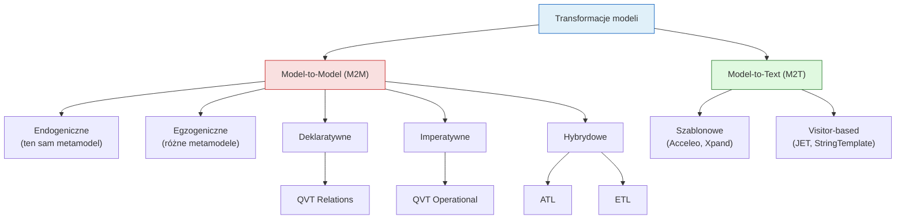
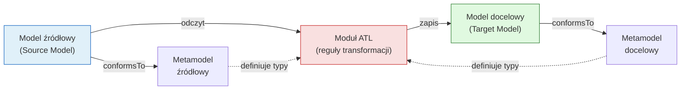
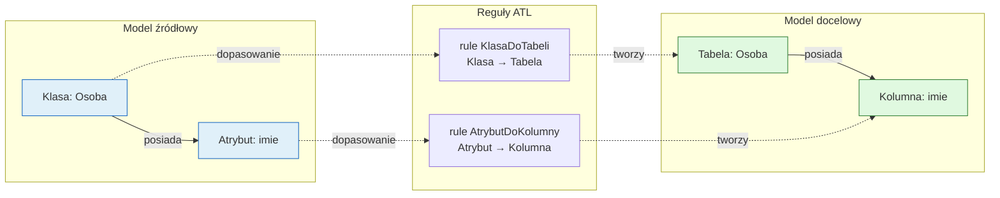
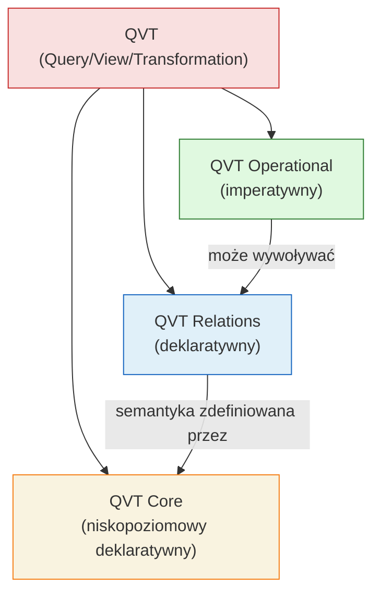
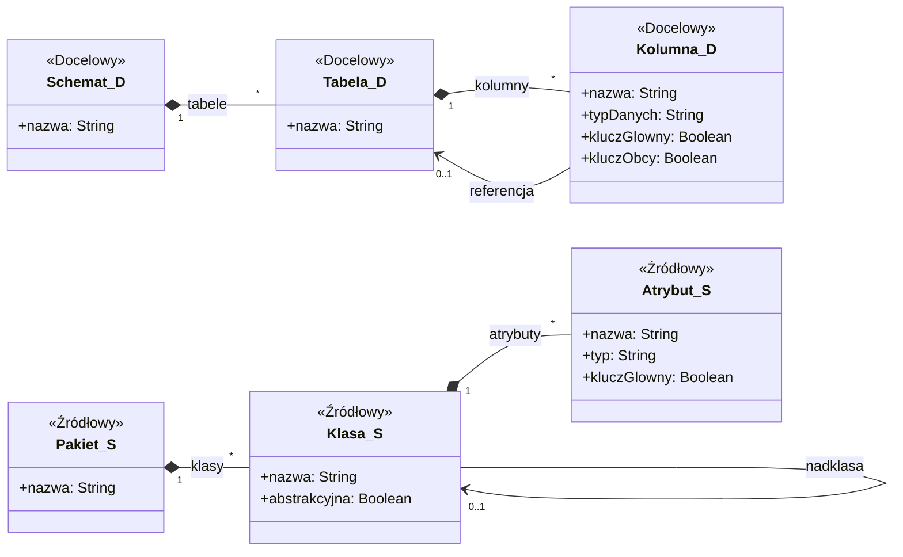
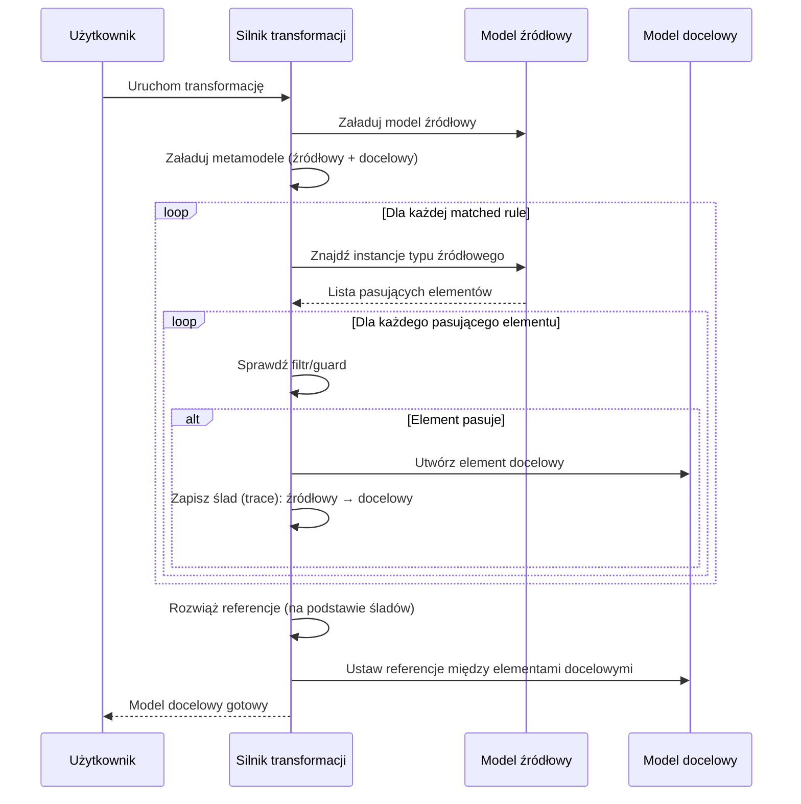

# Pytanie 8: Proszę omówić podstawowe konstrukcje wybranego języka transformacji modeli.

## Kluczowe pojęcia

- **Transformacja modeli (Model Transformation)** — proces automatycznego przekształcania modelu źródłowego (zgodnego z metamodelem źródłowym) w model docelowy (zgodny z metamodelem docelowym). Transformacja jest zdefiniowana jako zbiór reguł mapujących elementy metamodelu źródłowego na elementy metamodelu docelowego. Transformacje są fundamentem podejścia MDA/MDD (Model-Driven Architecture / Model-Driven Development).
- **ATL (Atlas Transformation Language)** — hybrydowy język transformacji modeli opracowany przez INRIA/OBEO w ramach projektu Eclipse. ATL łączy podejście deklaratywne (matched rules) z imperatywnym (called rules). Jest najszerzej stosowanym językiem transformacji w ekosystemie Eclipse Modeling Framework (EMF). ATL operuje na modelach zgodnych z metamodelami Ecore/KM3.
- **QVT (Query/View/Transformation)** — standard OMG definiujący trzy języki transformacji modeli: QVT Relations (deklaratywny), QVT Operational (imperatywny) i QVT Core (niskopoziomowy deklaratywny). QVT jest częścią specyfikacji MOF 2.0 i stanowi oficjalny standard transformacji w architekturze MDA.
- **ETL (Epsilon Transformation Language)** — język transformacji modeli będący częścią platformy Epsilon. ETL jest hybrydowy (deklaratywno-imperatywny), wspiera transformacje wiele-do-wielu i oferuje elastyczny mechanizm reguł z dziedziczeniem i strażnikami (guards).
- **Reguła transformacji (Transformation Rule)** — podstawowa jednostka transformacji definiująca mapowanie między elementami modelu źródłowego a elementami modelu docelowego. Reguła składa się z wzorca dopasowania (pattern matching) w modelu źródłowym oraz akcji tworzenia/modyfikacji elementów w modelu docelowym.
- **Model źródłowy (Source Model)** — model wejściowy transformacji, zgodny z metamodelem źródłowym. Model źródłowy jest odczytywany (read-only) podczas transformacji.
- **Model docelowy (Target Model)** — model wyjściowy transformacji, zgodny z metamodelem docelowym. Model docelowy jest tworzony (write-only w ATL) lub modyfikowany podczas transformacji.
- **Dopasowanie wzorców (Pattern Matching)** — mechanizm automatycznego wyszukiwania elementów modelu źródłowego spełniających warunki zdefiniowane we wzorcu reguły. Dopasowanie może uwzględniać typ elementu, wartości atrybutów, powiązania z innymi elementami oraz warunki OCL/logiczne.

## Wprowadzenie — transformacje modeli w MDE

Transformacja modeli jest kluczowym mechanizmem w inżynierii sterowanej modelami (Model-Driven Engineering, MDE). Pozwala na automatyczne przekształcanie modeli między różnymi poziomami abstrakcji (np. PIM → PSM) lub między różnymi dziedzinami (np. RSL → UML). Transformacje eliminują ręczne, podatne na błędy mapowanie i zapewniają powtarzalność procesu.

### Klasyfikacja transformacji modeli



### Porównanie języków transformacji

| Cecha | ATL | QVT Relations | QVT Operational | ETL |
|---|---|---|---|---|
| **Paradygmat** | Hybrydowy (dekl. + imper.) | Deklaratywny | Imperatywny | Hybrydowy (dekl. + imper.) |
| **Standard** | De facto (Eclipse) | OMG (oficjalny) | OMG (oficjalny) | Epsilon (Eclipse) |
| **Kierunkowość** | Jednokierunkowy | Dwukierunkowy | Jednokierunkowy | Jednokierunkowy |
| **Metamodel** | Ecore / KM3 | MOF 2.0 | MOF 2.0 | EMF (Ecore) |
| **Dojrzałość narzędzi** | Wysoka (Eclipse ATL) | Średnia (mediniQVT, Echo) | Średnia (SmartQVT) | Wysoka (Epsilon/Eclipse) |
| **Śledzenie (traceability)** | Automatyczne | Wbudowane (klucze) | Ręczne | Automatyczne |
| **Dziedziczenie reguł** | Tak (rule inheritance) | Tak (pattern hierarchy) | Nie | Tak (rule inheritance) |
| **Strażnicy (guards)** | Filtr OCL w from | Warunki when/where | Warunki if | Guard expression |

## ATL (Atlas Transformation Language) — szczegółowy opis

### Architektura ATL

ATL jest hybrydowym językiem transformacji modeli, w którym dominuje podejście deklaratywne (matched rules), uzupełnione konstrukcjami imperatywnymi (called rules, action blocks). ATL działa w środowisku Eclipse i operuje na modelach EMF (Ecore).

#### Schemat wykonania transformacji ATL



### Struktura modułu ATL

Moduł ATL (`*.atl`) ma następującą strukturę:

```
module NazwaModulu;
create OUT : MetamodelDocelowy from IN : MetamodelZrodlowy;

-- Helpery (funkcje pomocnicze)
helper context TypZrodlowy def: nazwaHelpera() : TypWyniku = ...;

-- Matched Rules (reguły dopasowujące)
rule NazwaReguly {
    from
        s : MetamodelZrodlowy!TypZrodlowy (warunek_filtrujacy)
    to
        t : MetamodelDocelowy!TypDocelowy (
            atrybut1 <- wartosc1,
            atrybut2 <- wartosc2
        )
}

-- Lazy Rules (reguły leniwe)
lazy rule NazwaRegulyLeniwej { ... }

-- Called Rules (reguły wywoływane)
rule NazwaRegulyWywolywanej(param : Typ) { ... }
```

### Matched Rules (reguły dopasowujące)

Matched rules to podstawowy i najważniejszy typ reguł w ATL. Działają **deklaratywnie** — silnik ATL automatycznie iteruje po wszystkich instancjach typu źródłowego i dla każdej pasującej instancji tworzy odpowiednie elementy docelowe.

#### Struktura matched rule

```
rule NazwaReguly {
    from
        s : MetamodelZrodlowy!TypZrodlowy (
            -- opcjonalny filtr (warunek OCL)
            s.warunek = true
        )
    to
        t : MetamodelDocelowy!TypDocelowy (
            -- bindingi: mapowanie atrybutów i referencji
            atrybut <- s.atrybutZrodlowy,
            referencja <- s.referencjaZrodlowa
        )
    do {
        -- opcjonalny blok imperatywny (action block)
    }
}
```

#### Semantyka wykonania matched rule

1. **Faza dopasowania (matching):** Silnik ATL iteruje po wszystkich instancjach `TypZrodlowy` w modelu źródłowym i sprawdza warunek filtrujący (jeśli istnieje).
2. **Faza tworzenia (instantiation):** Dla każdej pasującej instancji tworzy instancję `TypDocelowy` w modelu docelowym.
3. **Faza wiązania (binding):** Ustawia atrybuty i referencje elementu docelowego zgodnie z bindingami.
4. **Faza akcji (action):** Wykonuje opcjonalny blok imperatywny `do { ... }`.

#### Kluczowe cechy matched rules

| Cecha | Opis |
|---|---|
| **Automatyczna iteracja** | Silnik sam iteruje po instancjach — nie trzeba pisać pętli |
| **Filtrowanie** | Warunek OCL w sekcji `from` ogranicza dopasowanie |
| **Rozwiązywanie referencji** | ATL automatycznie rozwiązuje referencje — jeśli binding wskazuje na element źródłowy, ATL zastępuje go odpowiednim elementem docelowym |
| **Jednokrotne dopasowanie** | Każdy element źródłowy jest dopasowany przez co najwyżej jedną matched rule |
| **Kolejność niezależna** | Reguły mogą być definiowane w dowolnej kolejności |

### Lazy Rules (reguły leniwe)

Lazy rules nie są wykonywane automatycznie — są wywoływane jawnie z bindingów innych reguł. Służą do tworzenia elementów docelowych „na żądanie", gdy standardowy mechanizm rozwiązywania referencji nie wystarcza.

```
lazy rule TworzAdres {
    from
        s : Zrodlowy!Osoba
    to
        t : Docelowy!Adres (
            ulica <- s.ulica,
            miasto <- s.miasto
        )
}

-- Użycie w matched rule:
rule OsobaDoKlienta {
    from
        s : Zrodlowy!Osoba
    to
        t : Docelowy!Klient (
            nazwa <- s.imie + ' ' + s.nazwisko,
            adres <- thisModule.TworzAdres(s)  -- jawne wywołanie lazy rule
        )
}
```

#### Różnice: matched rule vs lazy rule

| Cecha | Matched Rule | Lazy Rule |
|---|---|---|
| **Wywołanie** | Automatyczne (silnik ATL) | Jawne (`thisModule.NazwaReguly(elem)`) |
| **Iteracja** | Po wszystkich instancjach typu | Tylko dla przekazanego elementu |
| **Wielokrotne wywołanie** | Raz na element | Każde wywołanie tworzy nowy element |
| **Zastosowanie** | Główne mapowanie typów | Tworzenie elementów pomocniczych |

Wariant `unique lazy rule` gwarantuje, że dla tego samego elementu źródłowego zostanie utworzony tylko jeden element docelowy (wynik jest cache'owany).

### Helpery (funkcje pomocnicze)

Helpery to funkcje pomocnicze definiowane w module ATL. Mogą być kontekstowe (wywoływane na elemencie) lub modułowe (wywoływane przez `thisModule`).

#### Helper kontekstowy

```
-- Helper obliczający pełną nazwę klasy (z pakietem)
helper context Zrodlowy!Klasa def: pelnaSciezka() : String =
    if self.pakiet.oclIsUndefined() then
        self.nazwa
    else
        self.pakiet.pelnaSciezka() + '.' + self.nazwa
    endif;
```

#### Helper modułowy (atrybutowy)

```
-- Helper modułowy zwracający stałą wartość
helper def: domyslnaWidocznosc : String = 'public';

-- Helper modułowy z logiką
helper def: wszystkieKlasy : Sequence(Zrodlowy!Klasa) =
    Zrodlowy!Klasa.allInstances()->select(k | not k.abstrakcyjna);
```

#### Rola helperów

| Typ helpera | Składnia wywołania | Zastosowanie |
|---|---|---|
| **Kontekstowy** | `element.nazwaHelpera()` | Obliczenia zależne od konkretnego elementu |
| **Modułowy (def)** | `thisModule.nazwaHelpera` | Stałe, kolekcje globalne, logika niezwiązana z elementem |

### Called Rules (reguły wywoływane)

Called rules to reguły imperatywne wywoływane jawnie z bloków `do { ... }` innych reguł. Służą do tworzenia elementów, których nie da się wyrazić deklaratywnie.

```
-- Called rule tworząca element docelowy
rule TworzKomentarz(tekst : String) {
    to
        t : Docelowy!Komentarz (
            tresc <- tekst,
            data <- thisModule.aktualnaData
        )
    do {
        t;  -- zwraca utworzony element
    }
}
```

### Mechanizm rozwiązywania referencji w ATL

Jedną z najważniejszych cech ATL jest **automatyczne rozwiązywanie referencji** (automatic reference resolution). Gdy binding w sekcji `to` wskazuje na element modelu źródłowego, ATL automatycznie zastępuje go odpowiednim elementem docelowym (utworzonym przez matched rule dla tego elementu źródłowego).



W regule `KlasaDoTabeli` binding `kolumny <- s.atrybuty` automatycznie zamieni kolekcję atrybutów źródłowych na kolekcję kolumn docelowych (utworzonych przez regułę `AtrybutDoKolumny`).

## QVT (Query/View/Transformation)

### Przegląd standardu QVT

QVT jest oficjalnym standardem OMG (Object Management Group) dla transformacji modeli, zdefiniowanym jako część specyfikacji MOF 2.0. Standard QVT definiuje trzy powiązane języki:



### QVT Relations

QVT Relations jest deklaratywnym językiem transformacji, w którym transformacja jest definiowana jako zbiór **relacji** (relations) między modelami. Relacje mogą być sprawdzane (check-only) lub wymuszane (enforce) — co umożliwia transformacje dwukierunkowe.

#### Struktura transformacji QVT Relations

```
transformation NazwaTransformacji(zrodlowy : MetamodelZrodlowy, docelowy : MetamodelDocelowy) {

    -- Relacja top-level (wywoływana automatycznie)
    top relation KlasaDoTabeli {
        nazwaKlasy : String;
        
        checkonly domain zrodlowy k : Klasa {
            nazwa = nazwaKlasy,
            abstrakcyjna = false
        };
        
        enforce domain docelowy t : Tabela {
            nazwa = nazwaKlasy
        };
        
        when {
            -- warunek wstępny (kiedy relacja ma być sprawdzana)
        }
        
        where {
            -- warunek końcowy (co musi być prawdziwe po wykonaniu)
            AtrybutDoKolumny(k, t);  -- wywołanie innej relacji
        }
    }
    
    -- Relacja wywoływana z where
    relation AtrybutDoKolumny {
        nazwaAtrybutu : String;
        typAtrybutu : String;
        
        checkonly domain zrodlowy k : Klasa {
            atrybuty = a : Atrybut {
                nazwa = nazwaAtrybutu,
                typ = typAtrybutu
            }
        };
        
        enforce domain docelowy t : Tabela {
            kolumny = kol : Kolumna {
                nazwa = nazwaAtrybutu,
                typDanych = typAtrybutu
            }
        };
    }
}
```

#### Kluczowe pojęcia QVT Relations

| Pojęcie | Opis |
|---|---|
| **Relacja (Relation)** | Definiuje korespondencję między wzorcami w modelach źródłowym i docelowym |
| **Domena (Domain)** | Wzorzec elementów w jednym modelu; `checkonly` = tylko sprawdzanie, `enforce` = tworzenie/modyfikacja |
| **Top-level relation** | Relacja wywoływana automatycznie przez silnik (analogia do matched rule w ATL) |
| **Non-top relation** | Relacja wywoływana z klauzuli `where` innej relacji |
| **when** | Warunek wstępny — kiedy relacja ma być sprawdzana |
| **where** | Warunek końcowy — co musi być prawdziwe po wykonaniu relacji |
| **Klucz (Key)** | Definiuje, jak identyfikować istniejące elementy docelowe (do aktualizacji zamiast tworzenia nowych) |

#### Dwukierunkowość QVT Relations

Unikalna cecha QVT Relations — ta sama definicja transformacji może być wykonana w obu kierunkach:
- **Kierunek enforce docelowy:** Tworzy/aktualizuje model docelowy na podstawie źródłowego (jak ATL)
- **Kierunek enforce źródłowy:** Tworzy/aktualizuje model źródłowy na podstawie docelowego (transformacja odwrotna)
- **Tryb check-only:** Sprawdza, czy modele są spójne bez modyfikacji

### QVT Operational

QVT Operational jest imperatywnym językiem transformacji, bliższym tradycyjnemu programowaniu. Transformacja jest wyrażona jako sekwencja operacji na modelach.

```
transformation KlasyDoTabel(in zrodlowy : MetamodelZrodlowy, out docelowy : MetamodelDocelowy) {

    main() {
        zrodlowy.rootObjects()[Pakiet]->map pakietDoSchematu();
    }
    
    mapping Pakiet::pakietDoSchematu() : Schemat {
        nazwa := self.nazwa;
        tabele := self.klasy->map klasaDoTabeli();
    }
    
    mapping Klasa::klasaDoTabeli() : Tabela 
        when { not self.abstrakcyjna }
    {
        nazwa := self.nazwa;
        kolumny := self.atrybuty->map atrybutDoKolumny();
    }
    
    mapping Atrybut::atrybutDoKolumny() : Kolumna {
        nazwa := self.nazwa;
        typDanych := self.typ.nazwa;
    }
}
```

#### Porównanie QVT Relations vs QVT Operational

| Cecha | QVT Relations | QVT Operational |
|---|---|---|
| **Paradygmat** | Deklaratywny | Imperatywny |
| **Dwukierunkowość** | Tak (wbudowana) | Nie |
| **Kontrola przepływu** | Automatyczna (silnik) | Jawna (programista) |
| **Śledzenie** | Automatyczne (klucze) | Jawne (`resolve`, `late resolve`) |
| **Złożoność** | Wyższa krzywa uczenia | Łatwiejszy dla programistów |
| **Elastyczność** | Ograniczona (deklaratywna) | Pełna (imperatywna) |

## ETL (Epsilon Transformation Language)

### Przegląd ETL

ETL jest częścią platformy Epsilon — rodziny języków do pracy z modelami (ETL, EVL, EGL, EOL, ECL, EML). ETL jest hybrydowym językiem transformacji, łączącym deklaratywne reguły z imperatywnym językiem EOL (Epsilon Object Language).

### Struktura transformacji ETL

```
-- Deklaracja modelu (pre/post bloki opcjonalne)
pre {
    "Rozpoczynam transformację".println();
}

-- Reguła transformacji
rule KlasaDoTabeli
    transform s : Zrodlowy!Klasa
    to t : Docelowy!Tabela {
    
    guard : not s.abstrakcyjna
    
    t.nazwa = s.nazwa;
    t.kolumny = s.atrybuty.equivalent();
}

rule AtrybutDoKolumny
    transform s : Zrodlowy!Atrybut
    to t : Docelowy!Kolumna {
    
    t.nazwa = s.nazwa;
    t.typDanych = s.typ.nazwa;
    t.nullable = (s.lowerBound = 0);
}

-- Reguła abstrakcyjna (nie jest wykonywana bezpośrednio)
@abstract
rule NazwanyElementDoNazwanego
    transform s : Zrodlowy!NazwanyElement
    to t : Docelowy!NazwanyElement {
    
    t.nazwa = s.nazwa;
}

-- Reguła dziedzicząca
rule KlasaDoTabeli2
    transform s : Zrodlowy!Klasa
    to t : Docelowy!Tabela
    extends NazwanyElementDoNazwanego {
    
    -- dziedziczy: t.nazwa = s.nazwa
    t.kolumny = s.atrybuty.equivalent();
}

post {
    "Transformacja zakończona".println();
}
```

### Kluczowe cechy ETL

| Cecha | Opis |
|---|---|
| **Reguły z guard** | Warunek `guard` filtruje elementy źródłowe (analogia do filtra w ATL) |
| **`equivalent()`** | Metoda rozwiązująca referencje — zwraca element docelowy odpowiadający źródłowemu |
| **Dziedziczenie reguł** | Reguła może dziedziczyć po innej (`extends`), przejmując jej logikę |
| **Reguły abstrakcyjne** | Oznaczone `@abstract` — nie są wykonywane bezpośrednio, służą jako baza |
| **Reguły @greedy** | Oznaczone `@greedy` — dopasowują również podtypy typu źródłowego |
| **Reguły @lazy** | Oznaczone `@lazy` — wywoływane jawnie, nie automatycznie |
| **Bloki pre/post** | Kod wykonywany przed/po transformacji |
| **Wiele modeli docelowych** | ETL wspiera tworzenie elementów w wielu modelach docelowych jednocześnie |

### Porównanie ATL vs ETL

| Aspekt | ATL | ETL |
|---|---|---|
| **Składnia** | Własna (ATL-specific) | Oparta na EOL (Epsilon Object Language) |
| **Blok imperatywny** | `do { ... }` (ograniczony) | Pełny język EOL w ciele reguły |
| **Rozwiązywanie referencji** | Automatyczne (implicit) | Jawne (`equivalent()`) |
| **Dziedziczenie reguł** | `extends` (ograniczone) | `extends` + `@abstract` + `@greedy` |
| **Wiele celów** | Jeden model docelowy | Wiele modeli docelowych |
| **Ekosystem** | ATL + OCL | Epsilon (ETL + EVL + EGL + EOL + ...) |
| **Walidacja** | Osobne narzędzie | EVL (Epsilon Validation Language) zintegrowane |

## Przykłady

### Przykład 1: Kompletna transformacja ATL — model klas → model relacyjny

Poniższy przykład przedstawia transformację metamodelu obiektowego (klasy, atrybuty, asocjacje) na metamodel relacyjny (tabele, kolumny, klucze obce). Jest to klasyczny przykład transformacji egzogenicznej M2M.

#### Metamodele źródłowy i docelowy



#### Kod transformacji ATL z objaśnieniem

```
-- ============================================================
-- Moduł: Class2Relational
-- Transformacja: Model klas → Model relacyjny
-- ============================================================
module Class2Relational;
create OUT : Relational from IN : ClassModel;

-- ============================================================
-- HELPERY
-- ============================================================

-- Helper: mapowanie typów obiektowych na typy SQL
helper context ClassModel!Atrybut def: typSQL() : String =
    if self.typ = 'String' then 'VARCHAR(255)'
    else if self.typ = 'Integer' then 'INT'
    else if self.typ = 'Boolean' then 'BOOLEAN'
    else if self.typ = 'Date' then 'DATE'
    else 'TEXT'
    endif endif endif endif;

-- Helper: pobranie wszystkich atrybutów (własnych + odziedziczonych)
helper context ClassModel!Klasa def: wszystkieAtrybuty() : Sequence(ClassModel!Atrybut) =
    if self.nadklasa.oclIsUndefined() then
        self.atrybuty
    else
        self.nadklasa.wszystkieAtrybuty()->union(self.atrybuty)
    endif;

-- ============================================================
-- MATCHED RULES
-- ============================================================

-- Reguła 1: Pakiet → Schemat
-- Każdy pakiet źródłowy staje się schematem bazy danych
rule PakietDoSchematu {
    from
        s : ClassModel!Pakiet
    to
        t : Relational!Schemat (
            nazwa <- s.nazwa,
            tabele <- s.klasy  -- automatyczne rozwiązanie referencji
        )
}

-- Reguła 2: Klasa (nieabstrakcyjna) → Tabela
-- Tylko klasy konkretne są mapowane na tabele
rule KlasaDoTabeli {
    from
        s : ClassModel!Klasa (
            not s.abstrakcyjna  -- filtr: pomijamy klasy abstrakcyjne
        )
    to
        t : Relational!Tabela (
            nazwa <- s.nazwa,
            -- Mapujemy WSZYSTKIE atrybuty (własne + odziedziczone)
            kolumny <- s.wszystkieAtrybuty()
        )
}

-- Reguła 3: Atrybut → Kolumna
-- Każdy atrybut klasy staje się kolumną tabeli
rule AtrybutDoKolumny {
    from
        s : ClassModel!Atrybut
    to
        t : Relational!Kolumna (
            nazwa <- s.nazwa,
            typDanych <- s.typSQL(),       -- użycie helpera
            kluczGlowny <- s.kluczGlowny,
            kluczObcy <- false
        )
}

-- ============================================================
-- LAZY RULES
-- ============================================================

-- Lazy rule: tworzenie kolumny klucza obcego dla asocjacji
lazy rule TworzKluczObcy {
    from
        s : ClassModel!Klasa
    to
        t : Relational!Kolumna (
            nazwa <- s.nazwa + '_id',
            typDanych <- 'INT',
            kluczGlowny <- false,
            kluczObcy <- true,
            referencja <- s  -- rozwiązane na Tabelę (przez KlasaDoTabeli)
        )
}
```

#### Objaśnienie krok po kroku

| Linia / Sekcja | Objaśnienie |
|---|---|
| `module Class2Relational` | Deklaracja nazwy modułu transformacji |
| `create OUT : Relational from IN : ClassModel` | Deklaracja modeli: `IN` (źródłowy, read-only) i `OUT` (docelowy, write-only) |
| `helper context ... def: typSQL()` | Helper kontekstowy mapujący typy obiektowe na SQL |
| `helper context ... def: wszystkieAtrybuty()` | Helper rekurencyjny zbierający atrybuty z hierarchii dziedziczenia |
| `rule PakietDoSchematu` | Matched rule: automatycznie dopasowuje każdy `Pakiet` i tworzy `Schemat` |
| `tabele <- s.klasy` | Binding z automatycznym rozwiązaniem referencji — kolekcja `Klasa` zostanie zamieniona na kolekcję `Tabela` |
| `rule KlasaDoTabeli` | Matched rule z filtrem `not s.abstrakcyjna` — pomija klasy abstrakcyjne |
| `kolumny <- s.wszystkieAtrybuty()` | Użycie helpera — mapuje atrybuty własne i odziedziczone |
| `rule AtrybutDoKolumny` | Matched rule mapująca każdy atrybut na kolumnę |
| `s.typSQL()` | Wywołanie helpera kontekstowego na elemencie źródłowym |
| `lazy rule TworzKluczObcy` | Lazy rule wywoływana jawnie — tworzy kolumnę klucza obcego |

### Przykład 2: Transformacja w QVT Relations

Ta sama transformacja (klasy → tabele) wyrażona w QVT Relations:

```
transformation Class2Relational(classModel : ClassModel, relational : Relational) {

    key Tabela { nazwa };
    key Kolumna { nazwa, tabela };

    top relation PakietDoSchematu {
        n : String;
        
        checkonly domain classModel p : Pakiet {
            nazwa = n
        };
        enforce domain relational s : Schemat {
            nazwa = n
        };
        where {
            KlasaDoTabeli(p, s);
        }
    }

    relation KlasaDoTabeli {
        cn : String;
        
        checkonly domain classModel p : Pakiet {
            klasy = k : Klasa {
                nazwa = cn,
                abstrakcyjna = false
            }
        };
        enforce domain relational s : Schemat {
            tabele = t : Tabela {
                nazwa = cn
            }
        };
        where {
            AtrybutDoKolumny(k, t);
        }
    }

    relation AtrybutDoKolumny {
        an : String;
        at : String;
        
        checkonly domain classModel k : Klasa {
            atrybuty = a : Atrybut {
                nazwa = an,
                typ = at
            }
        };
        enforce domain relational t : Tabela {
            kolumny = kol : Kolumna {
                nazwa = an,
                typDanych = at
            }
        };
    }
}
```

### Przykład 3: Transformacja w ETL

Ta sama transformacja wyrażona w ETL:

```
rule PakietDoSchematu
    transform s : ClassModel!Pakiet
    to t : Relational!Schemat {
    
    t.nazwa = s.nazwa;
    t.tabele = s.klasy.equivalent();
}

rule KlasaDoTabeli
    transform s : ClassModel!Klasa
    to t : Relational!Tabela {
    
    guard : not s.abstrakcyjna
    
    t.nazwa = s.nazwa;
    t.kolumny = s.atrybuty.equivalent();
}

rule AtrybutDoKolumny
    transform s : ClassModel!Atrybut
    to t : Relational!Kolumna {
    
    t.nazwa = s.nazwa;
    t.typDanych = s.typ;
    t.kluczGlowny = s.kluczGlowny;
    t.kluczObcy = false;
}
```

### Przykład 4: Porównanie składni trzech języków — ta sama reguła

Poniżej zestawiono tę samą regułę transformacji (Klasa → Tabela) w trzech językach:

#### ATL

```
rule KlasaDoTabeli {
    from  s : ClassModel!Klasa (not s.abstrakcyjna)
    to    t : Relational!Tabela (
              nazwa <- s.nazwa,
              kolumny <- s.atrybuty
          )
}
```

#### QVT Relations

```
top relation KlasaDoTabeli {
    cn : String;
    checkonly domain classModel k : Klasa { nazwa = cn, abstrakcyjna = false };
    enforce domain relational t : Tabela { nazwa = cn };
    where { AtrybutDoKolumny(k, t); }
}
```

#### ETL

```
rule KlasaDoTabeli
    transform s : ClassModel!Klasa
    to t : Relational!Tabela {
    guard : not s.abstrakcyjna
    t.nazwa = s.nazwa;
    t.kolumny = s.atrybuty.equivalent();
}
```

### Diagram procesu transformacji



## Podsumowanie

- Transformacja modeli to automatyczne przekształcanie modelu źródłowego w docelowy na podstawie zdefiniowanych reguł — jest fundamentem podejścia MDA/MDD.
- ATL jest najszerzej stosowanym językiem transformacji w ekosystemie Eclipse; łączy podejście deklaratywne (matched rules) z imperatywnym (called rules) i oferuje automatyczne rozwiązywanie referencji.
- Podstawowe konstrukcje ATL to: matched rules (automatyczne dopasowanie i tworzenie elementów), lazy rules (tworzenie na żądanie), helpery (funkcje pomocnicze) i called rules (reguły imperatywne).
- QVT jest oficjalnym standardem OMG obejmującym trzy języki: QVT Relations (deklaratywny, dwukierunkowy), QVT Operational (imperatywny) i QVT Core (niskopoziomowy).
- Unikalna cecha QVT Relations to dwukierunkowość — ta sama definicja transformacji może być wykonana w obu kierunkach (źródło → cel i cel → źródło).
- ETL (Epsilon Transformation Language) jest częścią platformy Epsilon i oferuje elastyczne reguły z dziedziczeniem, strażnikami (guards) oraz pełną integrację z ekosystemem Epsilon (walidacja EVL, generacja kodu EGL).
- Mechanizm dopasowania wzorców (pattern matching) jest wspólny dla wszystkich języków — silnik automatycznie wyszukuje elementy spełniające warunki reguły.
- Automatyczne śledzenie (traceability) w ATL i ETL eliminuje konieczność ręcznego zarządzania mapowaniem między elementami źródłowymi a docelowymi.
- Wybór języka transformacji zależy od kontekstu: ATL dla transformacji jednokierunkowych w Eclipse, QVT Relations dla transformacji dwukierunkowych i zgodności ze standardem OMG, ETL dla elastycznych transformacji z bogatym ekosystemem narzędzi Epsilon.

## Powiązane pytania

- [Pytanie 6: Co to jest metamodel? W jakich językach można tworzyć metamodele?](06-metamodel-jezyki.md)
- [Pytanie 7: Proszę omówić podstawowe konstrukcje wybranego języka metamodelowania.](07-konstrukcje-jezyka-metamodelowania.md)
- [Pytanie 9: Proszę narysować przykładowy metamodel języka modelowania składający się z 2-3 metaklas.](09-przykladowy-metamodel.md)
- [Pytanie 11: Proszę określić kilka przykładowych reguł transformacji modeli dla wybranych języków modelowania (np. RSL i UML).](11-reguly-transformacji-rsl-uml.md)
- [Pytanie 14: Proszę opisać zasady tworzenia i transformacji modeli (np. w językach RSL i UML) oraz generacji kodu dla wybranych narzędzi CASE.](14-narzedzia-case-generacja-kodu.md)
