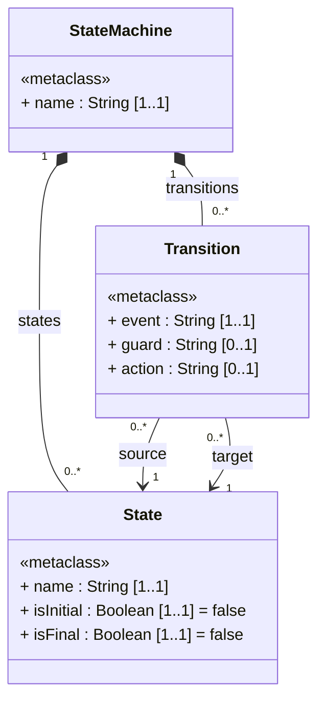
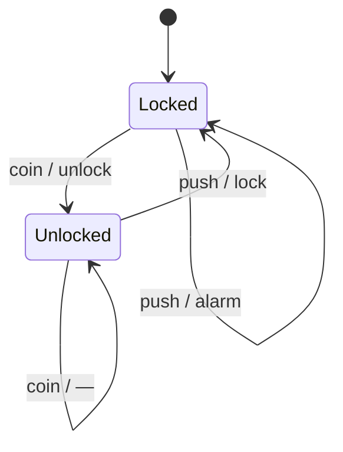
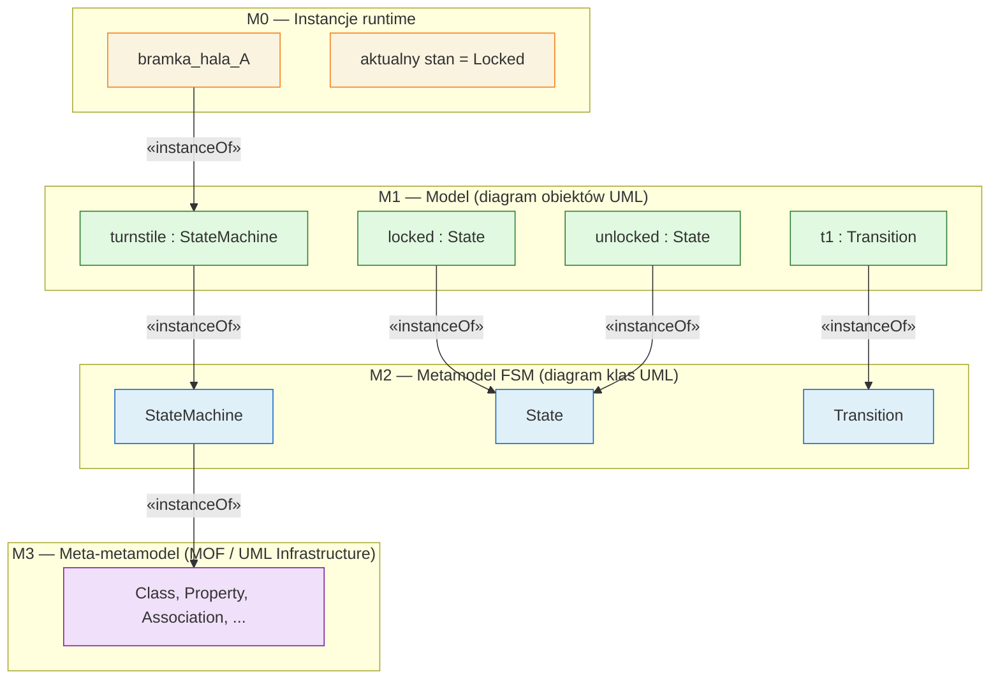
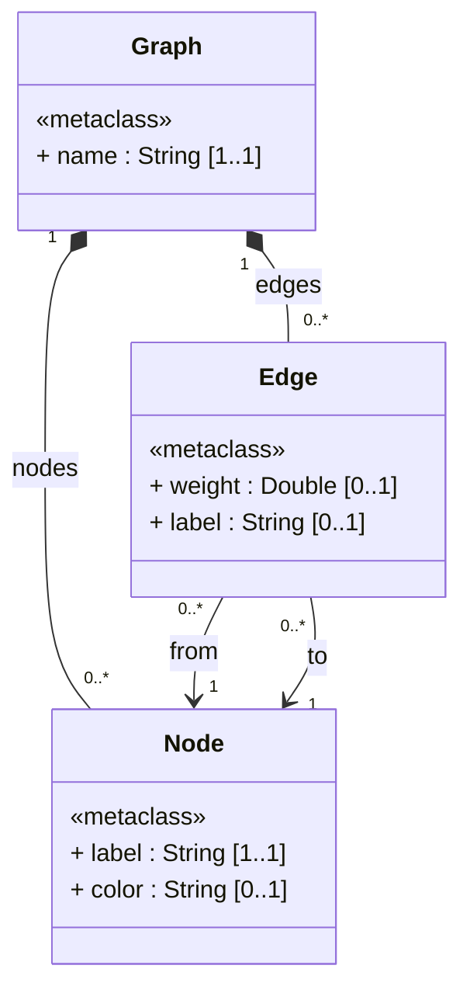
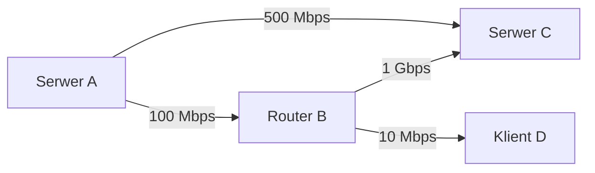

# Pytanie 9: Proszę narysować przykładowy metamodel języka modelowania składający się z 2-3 metaklas.

## Kluczowe pojęcia

- **Metaklasa** — podstawowy element metamodelu definiujący typ elementu w języku modelowania. W UML metaklasa jest przedstawiana jako klasa na diagramie klas, oznaczona stereotypem `«metaclass»`. Metaklasa opisuje strukturę swoich instancji poprzez atrybuty i asocjacje. Przykładowo, w metamodelu języka stanów metaklasami są `State` i `Transition`.
- **Instancja** — konkretny element modelu będący realizacją (wystąpieniem) metaklasy. Relacja między instancją a metaklasą to `«instanceOf»`. Na przykład stan `Locked` jest instancją metaklasy `State`, a przejście `coin` jest instancją metaklasy `Transition`.
- **Diagram klas UML** — podstawowa notacja graficzna do przedstawiania metamodeli. Metaklasy rysujemy jako prostokąty podzielone na trzy sekcje: nazwa, atrybuty, operacje. Relacje między metaklasami przedstawiamy jako: asocjację (linia), kompozycję (wypełniony romb ♦), agregację (pusty romb ◇), generalizację (trójkąt △).
- **Relacje między metaklasami** — powiązania strukturalne w metamodelu. W notacji UML wyróżniamy: **kompozycję** (relacja część-całość, wypełniony romb), **asocjację skierowaną** (strzałka →, odpowiednik referencji), **generalizację** (trójkąt, hierarchia typów). Krotności na końcach asocjacji (np. `1..*`, `0..1`) określają ograniczenia strukturalne.

## Proces projektowania metamodelu w UML

Projektowanie metamodelu to systematyczny proces przekształcania wymagań dziedzinowych w formalną strukturę języka modelowania. UML jest naturalnym wyborem do tego celu — sam standard UML jest zdefiniowany jako metamodel (opisany w dokumencie MOF/UML Infrastructure).

### Etap 1: Wybór dziedziny

Pierwszym krokiem jest **określenie dziedziny**, dla której projektujemy język modelowania. Dziedzina powinna być:

- **Dobrze zdefiniowana** — z jasno określonymi granicami i pojęciami
- **Wystarczająco prosta** — aby metamodel składał się z 2-3 metaklas
- **Reprezentatywna** — aby ilustrować kluczowe konstrukcje UML (atrybuty, asocjacje, kompozycje, krotności)

Przykłady odpowiednich dziedzin:

| Dziedzina | Metaklasy | Relacje UML |
|---|---|---|
| Język stanów (FSM) | `StateMachine`, `State`, `Transition` | kompozycja, asocjacja skierowana |
| Język grafów | `Graph`, `Node`, `Edge` | kompozycja, asocjacja skierowana |
| Język formularzy | `Form`, `Field`, `Validation` | kompozycja, asocjacja |
| Język procesów | `Process`, `Activity`, `Flow` | kompozycja, asocjacja skierowana |

### Etap 2: Identyfikacja metaklas

Dla wybranej dziedziny identyfikujemy **kluczowe pojęcia**, które staną się metaklasami na diagramie klas UML:

1. **Reprezentują odrębny typ elementu** — nie są wariantem innego pojęcia
2. **Posiadają własne atrybuty** — cechy odróżniające instancje
3. **Uczestniczą w asocjacjach** — są powiązane z innymi metaklasami

Proces identyfikacji:
- Wypisz wszystkie pojęcia dziedzinowe
- Odfiltruj pojęcia będące atrybutami (wartościami prostymi) — np. „nazwa stanu" to atrybut typu `String`, nie metaklasa
- Odfiltruj pojęcia będące instancjami — np. „stan początkowy" to instancja `State` z `isInitial = true`
- Pozostałe pojęcia to kandydaci na metaklasy

### Etap 3: Definiowanie atrybutów (sekcja atrybutów klasy UML)

Dla każdej metaklasy określamy atrybuty w notacji UML:

```
widoczność nazwa : typ [krotność] = wartośćDomyślna
```

Przykłady:
- `+ name : String [1..1]` — atrybut wymagany
- `+ guard : String [0..1]` — atrybut opcjonalny
- `+ isInitial : Boolean [1..1] = false` — atrybut z wartością domyślną

### Etap 4: Definiowanie relacji (asocjacje UML)

Między metaklasami definiujemy relacje, korzystając z notacji UML:

| Typ relacji UML | Notacja | Kiedy stosować |
|---|---|---|
| **Kompozycja** | Wypełniony romb ♦ po stronie kontenera | Element nie istnieje bez właściciela (np. State w StateMachine) |
| **Asocjacja skierowana** | Strzałka → | Element wskazuje na inny, ale nie jest jego właścicielem (np. Transition → State) |
| **Generalizacja** | Trójkąt △ po stronie nadklasy | Metaklasa jest specjalizacją innej (np. InitialState extends State) |

Każda asocjacja ma:
- **Nazwę roli** na każdym końcu (np. `source`, `target`)
- **Krotność** (np. `1`, `0..*`, `1..*`)
- **Nawigację** (strzałka wskazuje kierunek nawigacji)

## Przykładowy metamodel — język automatów stanowych (FSM)

### Wybór dziedziny

Jako dziedzinę wybieramy **automaty stanowe** (Finite State Machines) — klasyczny język modelowania zachowania systemu jako zbioru stanów i przejść.

### Identyfikacja metaklas

Metamodel składa się z **trzech metaklas**:

1. **`StateMachine`** — kontener główny, reprezentujący cały automat
2. **`State`** — stan automatu (w tym stan początkowy i końcowy)
3. **`Transition`** — przejście między stanami, wyzwalane zdarzeniem

### Diagram klas UML (metamodel)



**Legenda notacji UML:**
- `*--` = kompozycja (wypełniony romb ♦ po stronie `StateMachine`)
- `-->` = asocjacja skierowana (nawigacja od `Transition` do `State`)
- `[1..1]` = dokładnie jeden, `[0..*]` = zero lub więcej, `[0..1]` = opcjonalny

### Opis metaklas

#### Metaklasa `StateMachine`

| Cecha UML | Wartość |
|---|---|
| **Stereotyp** | `«metaclass»` |
| **Atrybuty** | `+ name : String [1..1]` |
| **Kompozycje** | `states : State [0..*]` — stany należące do automatu |
| | `transitions : Transition [0..*]` — przejścia należące do automatu |
| **Semantyka** | Element korzeniowy modelu. Usunięcie `StateMachine` powoduje kaskadowe usunięcie wszystkich stanów i przejść (semantyka kompozycji UML). |

#### Metaklasa `State`

| Cecha UML | Wartość |
|---|---|
| **Stereotyp** | `«metaclass»` |
| **Atrybuty** | `+ name : String [1..1]` — unikalna nazwa stanu |
| | `+ isInitial : Boolean [1..1] = false` — flaga stanu początkowego |
| | `+ isFinal : Boolean [1..1] = false` — flaga stanu końcowego |
| **Kompozycja zwrotna** | Należy do `StateMachine` (rola `states`) |
| **Semantyka** | Wierzchołek w grafie stanów. Dokładnie jeden stan powinien mieć `isInitial = true`. |

#### Metaklasa `Transition`

| Cecha UML | Wartość |
|---|---|
| **Stereotyp** | `«metaclass»` |
| **Atrybuty** | `+ event : String [1..1]` — zdarzenie wyzwalające |
| | `+ guard : String [0..1]` — warunek strzegący |
| | `+ action : String [0..1]` — akcja przy przejściu |
| **Asocjacje skierowane** | `source : State [1..1]` — stan źródłowy |
| | `target : State [1..1]` — stan docelowy |
| **Kompozycja zwrotna** | Należy do `StateMachine` (rola `transitions`) |
| **Semantyka** | Krawędź w grafie stanów. Przejście ze stanu `source` do `target` wyzwalane zdarzeniem `event`. |

### Tabela asocjacji UML

| Asocjacja | Typ UML | Krotność | Rola | Nawigacja |
|---|---|---|---|---|
| StateMachine ↔ State | Kompozycja ♦ | `1` — `0..*` | `states` | dwukierunkowa |
| StateMachine ↔ Transition | Kompozycja ♦ | `1` — `0..*` | `transitions` | dwukierunkowa |
| Transition → State | Asocjacja → | `0..*` — `1` | `source` | jednokierunkowa |
| Transition → State | Asocjacja → | `0..*` — `1` | `target` | jednokierunkowa |

### Ograniczenia OCL

Ograniczenia OCL (Object Constraint Language) uzupełniają diagram klas UML o reguły, których nie da się wyrazić samą strukturą:

```
context StateMachine
  -- Dokładnie jeden stan początkowy
  inv oneInitialState: 
    self.states->select(s | s.isInitial)->size() = 1

  -- Co najmniej jeden stan
  inv hasStates: 
    self.states->notEmpty()

context Transition
  -- Stany źródłowy i docelowy należą do tego samego automatu
  inv sameStateMachine: 
    self.source.oclContainer() = self.oclContainer()

  -- Stan końcowy nie może być źródłem przejścia
  inv noTransitionFromFinal: 
    not self.source.isFinal
```

## Przykłady

### Instancja modelu — automat bramki obrotowej (Turnstile)

Na podstawie metamodelu FSM tworzymy **konkretny model** (poziom M1). Każdy element modelu jest instancją odpowiedniej metaklasy z poziomu M2.

#### Opis dziedzinowy

Bramka obrotowa ma dwa stany:
- **Locked** (zablokowana) — stan początkowy
- **Unlocked** (odblokowana) — po wrzuceniu monety

Zdarzenia: **coin** (moneta), **push** (pchnięcie)

#### Diagram stanów UML (instancja modelu)



#### Diagram obiektów UML (mapowanie instancji)

W UML instancje modelu przedstawiamy na **diagramie obiektów** — każdy obiekt jest podkreślony i ma format `nazwa : Klasa`:

| Obiekt (M1) | Metaklasa (M2) | Wartości atrybutów |
|---|---|---|
| `turnstile : StateMachine` | `StateMachine` | `name = "Turnstile"` |
| `locked : State` | `State` | `name = "Locked"`, `isInitial = true`, `isFinal = false` |
| `unlocked : State` | `State` | `name = "Unlocked"`, `isInitial = false`, `isFinal = false` |
| `t1 : Transition` | `Transition` | `event = "coin"`, `source = locked`, `target = unlocked`, `action = "unlock"` |
| `t2 : Transition` | `Transition` | `event = "push"`, `source = unlocked`, `target = locked`, `action = "lock"` |
| `t3 : Transition` | `Transition` | `event = "coin"`, `source = unlocked`, `target = unlocked` |
| `t4 : Transition` | `Transition` | `event = "push"`, `source = locked`, `target = locked`, `action = "alarm"` |

#### Hierarchia poziomów modelowania (M0–M3)



### Drugi przykład — metamodel prostego języka grafów

Aby pokazać uniwersalność podejścia, projektujemy drugi metamodel w notacji UML — dla **prostego języka grafów skierowanych**.

#### Diagram klas UML (metamodel)



#### Opis metaklas

- **`Graph`** — kontener główny (kompozycja z `Node` i `Edge`)
- **`Node`** — węzeł grafu z etykietą i opcjonalnym kolorem
- **`Edge`** — krawędź skierowana z opcjonalną wagą; asocjacje skierowane `from` i `to` wskazują na węzły

#### Instancja — graf sieci komputerowej (diagram obiektów UML)



| Obiekt (M1) | Metaklasa (M2) | Atrybuty |
|---|---|---|
| `siec : Graph` | `Graph` | `name = "Sieć LAN"` |
| `serwerA : Node` | `Node` | `label = "Serwer A"`, `color = "blue"` |
| `routerB : Node` | `Node` | `label = "Router B"`, `color = "green"` |
| `e1 : Edge` | `Edge` | `from = serwerA`, `to = routerB`, `weight = 100.0` |
| `e2 : Edge` | `Edge` | `from = routerB`, `to = serwerC`, `weight = 1000.0` |

### Porównanie obu metamodeli

| Cecha | Metamodel FSM | Metamodel grafów |
|---|---|---|
| **Liczba metaklas** | 3 | 3 |
| **Kontener (kompozycja ♦)** | `StateMachine` | `Graph` |
| **Elementy** | `State`, `Transition` | `Node`, `Edge` |
| **Asocjacje skierowane →** | `source`, `target` | `from`, `to` |
| **Atrybuty flagowe** | `isInitial`, `isFinal` | — |
| **Wzorzec strukturalny** | kontener + węzły + krawędzie | kontener + węzły + krawędzie |

## Podsumowanie

1. **Metamodel** definiuje strukturę języka modelowania. W UML metamodel przedstawiamy jako **diagram klas** z metaklasami oznaczonymi stereotypem `«metaclass»`, atrybutami w notacji UML i relacjami (kompozycja ♦, asocjacja →, generalizacja △).

2. **Kompozycja UML** (♦) wyraża relację część-całość z semantyką posiadania — usunięcie kontenera kaskadowo usuwa elementy. **Asocjacja skierowana** (→) wyraża referencję bez posiadania.

3. **Krotności** na końcach asocjacji (`1`, `0..1`, `0..*`, `1..*`) definiują ograniczenia strukturalne metamodelu.

4. **Ograniczenia OCL** uzupełniają diagram klas o reguły poprawności niemożliwe do wyrażenia samą strukturą (np. „dokładnie jeden stan początkowy").

5. **Hierarchia M0–M3** w UML: M3 (meta-metamodel MOF), M2 (metamodel — diagram klas), M1 (model — diagram obiektów), M0 (instancje runtime). Relacja między poziomami to `«instanceOf»`.

6. Wzorzec **kontener + węzły + krawędzie** jest uniwersalny — zarówno metamodel FSM jak i grafów mają identyczną strukturę asocjacji w UML.

## Powiązane pytania

- [Pytanie 6: Co to jest metamodel? W jakich językach można tworzyć metamodele?](06-metamodel-jezyki.md)
- [Pytanie 7: Proszę omówić podstawowe konstrukcje wybranego języka metamodelowania.](07-konstrukcje-jezyka-metamodelowania.md)
- [Pytanie 10: Proszę wyjaśnić zasady procesu wytwarzania oprogramowania sterowanego modelami.](10-mda-mdd.md)
