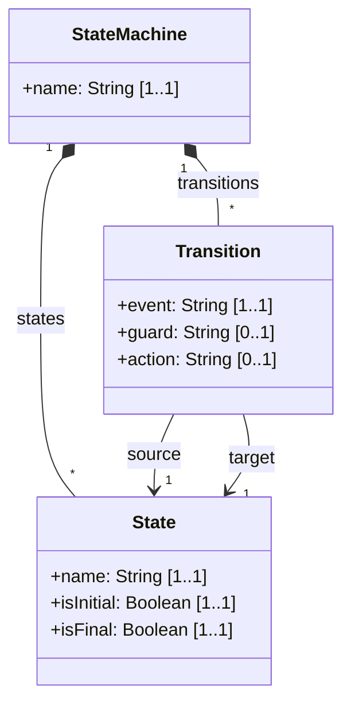
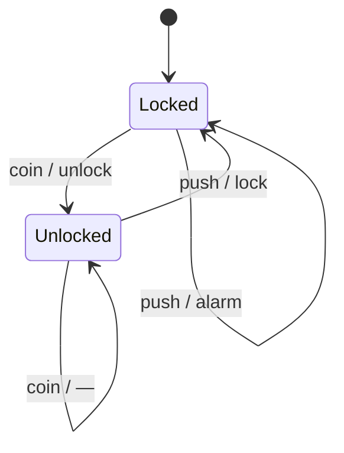
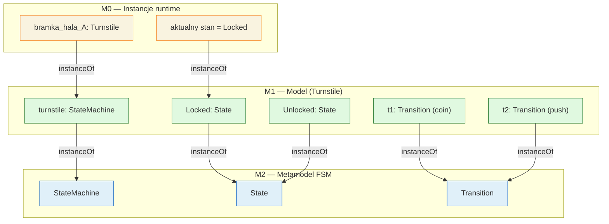
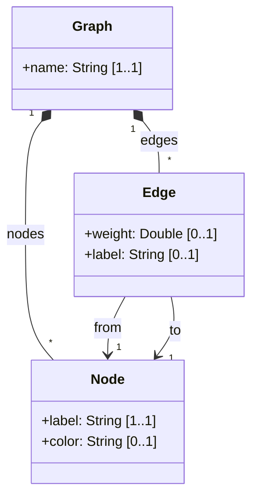
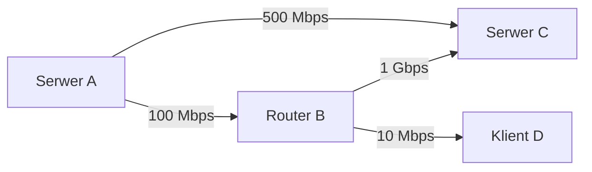

# Pytanie 9: Proszę narysować przykładowy metamodel języka modelowania składający się z 2-3 metaklas.

## Kluczowe pojęcia

- **Metaklasa** — podstawowy element metamodelu definiujący typ elementu w języku modelowania. Metaklasa opisuje strukturę swoich instancji poprzez atrybuty (cechy o typie prostym) i referencje (powiązania z innymi metaklasami). W Ecore metaklasa jest reprezentowana przez `EClass`. Przykładowo, w metamodelu języka stanów metaklasami są `State` i `Transition`.
- **Instancja** — konkretny element modelu będący realizacją (wystąpieniem) metaklasy. Relacja między instancją a metaklasą to `instanceOf` — instancja posiada wartości atrybutów i referencji zdefiniowanych w metaklasie. Na przykład stan `Locked` jest instancją metaklasy `State`, a przejście `coin` jest instancją metaklasy `Transition`.
- **Diagram klas** — notacja graficzna UML służąca do przedstawiania metamodeli. Metaklasy są rysowane jako prostokąty z nazwą, atrybutami i operacjami. Relacje między metaklasami (asocjacje, kompozycje, dziedziczenie) są przedstawiane jako linie z odpowiednimi oznaczeniami (strzałki, romby, trójkąty).
- **Relacje między metaklasami** — powiązania strukturalne definiujące, jak metaklasy współdziałają w metamodelu. Wyróżniamy: **asocjację** (luźne powiązanie), **kompozycję** (relacja część-całość z semantyką posiadania), **dziedziczenie** (hierarchia typów) oraz **referencję** (wskaźnik na inną metaklasę). Krotności na końcach relacji określają, ile instancji może uczestniczyć w powiązaniu.

## Proces projektowania metamodelu

Projektowanie metamodelu to systematyczny proces przekształcania wymagań dziedzinowych w formalną strukturę języka modelowania. Poniżej przedstawiono kluczowe etapy tego procesu.

### Etap 1: Wybór dziedziny

Pierwszym krokiem jest **określenie dziedziny**, dla której projektujemy język modelowania. Dziedzina powinna być:

- **Dobrze zdefiniowana** — z jasno określonymi granicami i pojęciami
- **Wystarczająco prosta** — aby metamodel składał się z 2-3 metaklas (zgodnie z wymaganiem pytania)
- **Reprezentatywna** — aby ilustrować kluczowe konstrukcje metamodelowania (atrybuty, relacje, krotności)

Przykłady odpowiednich dziedzin dla metamodelu z 2-3 metaklasami:

| Dziedzina | Metaklasy | Relacje |
|---|---|---|
| Język stanów (FSM) | `StateMachine`, `State`, `Transition` | kompozycja, referencja |
| Język grafów | `Graph`, `Node`, `Edge` | kompozycja, referencja |
| Język formularzy | `Form`, `Field`, `Validation` | kompozycja, referencja |
| Język procesów | `Process`, `Activity`, `Flow` | kompozycja, referencja |

### Etap 2: Identyfikacja metaklas

Dla wybranej dziedziny identyfikujemy **kluczowe pojęcia**, które staną się metaklasami. Każde pojęcie powinno:

1. **Reprezentować odrębny typ elementu** — nie być wariantem innego pojęcia
2. **Posiadać własne atrybuty** — cechy odróżniające instancje
3. **Uczestniczyć w relacjach** — być powiązane z innymi metaklasami

Proces identyfikacji:
- Wypisz wszystkie pojęcia dziedzinowe
- Odfiltruj pojęcia, które są atrybutami (wartościami prostymi) — np. „nazwa stanu" to atrybut, nie metaklasa
- Odfiltruj pojęcia, które są instancjami, a nie typami — np. „stan początkowy" to instancja `State` z flagą `isInitial = true`
- Pozostałe pojęcia to kandydaci na metaklasy

### Etap 3: Definiowanie atrybutów

Dla każdej metaklasy określamy **atrybuty** — cechy o typie prostym (String, Integer, Boolean itp.):

- Każdy atrybut ma **nazwę**, **typ** i **krotność**
- Atrybuty wymagane mają `lowerBound = 1`
- Atrybuty opcjonalne mają `lowerBound = 0`
- Atrybuty logiczne (flagi) służą do rozróżniania wariantów (np. `isInitial`, `isFinal`)

### Etap 4: Definiowanie relacji

Między metaklasami definiujemy **relacje**, wybierając odpowiedni typ:

| Typ relacji | Kiedy stosować | Notacja UML |
|---|---|---|
| **Kompozycja** | Element należy do kontenera i nie istnieje bez niego | Wypełniony romb (♦) |
| **Referencja** | Element wskazuje na inny element, ale nie jest jego właścicielem | Strzałka (→) |
| **Dziedziczenie** | Metaklasa jest specjalizacją innej metaklasy | Trójkąt (△) |

Dla każdej relacji określamy **krotności** na obu końcach (np. `1..*`, `0..1`, `*`).

## Przykładowy metamodel — język automatów stanowych (FSM)

### Wybór dziedziny

Jako dziedzinę wybieramy **automaty stanowe** (Finite State Machines) — jeden z najbardziej klasycznych i intuicyjnych języków modelowania. Automat stanowy opisuje zachowanie systemu jako zbiór stanów i przejść między nimi.

### Identyfikacja metaklas

Metamodel składa się z **trzech metaklas**:

1. **`StateMachine`** — kontener główny, reprezentujący cały automat
2. **`State`** — stan automatu (w tym stan początkowy i stany końcowe)
3. **`Transition`** — przejście między stanami, wyzwalane zdarzeniem

### Metamodel — diagram klas (Mermaid)



### Opis metaklas

#### Metaklasa `StateMachine`

| Cecha | Wartość |
|---|---|
| **Rola** | Kontener główny — element korzeniowy modelu |
| **Atrybuty** | `name: String [1..1]` — nazwa automatu |
| **Kompozycje** | `states: State [0..*]` — stany należące do automatu |
| | `transitions: Transition [0..*]` — przejścia należące do automatu |
| **Semantyka** | Reprezentuje kompletny automat stanowy. Usunięcie `StateMachine` powoduje kaskadowe usunięcie wszystkich stanów i przejść. |

#### Metaklasa `State`

| Cecha | Wartość |
|---|---|
| **Rola** | Stan automatu — wierzchołek w grafie stanów |
| **Atrybuty** | `name: String [1..1]` — unikalna nazwa stanu |
| | `isInitial: Boolean [1..1]` — czy stan jest stanem początkowym (domyślnie `false`) |
| | `isFinal: Boolean [1..1]` — czy stan jest stanem końcowym (domyślnie `false`) |
| **Kontener** | Należy do `StateMachine` przez kompozycję `states` |
| **Semantyka** | Reprezentuje dyskretny stan, w którym może znajdować się system. Dokładnie jeden stan powinien mieć `isInitial = true`. |

#### Metaklasa `Transition`

| Cecha | Wartość |
|---|---|
| **Rola** | Przejście między stanami — krawędź w grafie stanów |
| **Atrybuty** | `event: String [1..1]` — zdarzenie wyzwalające przejście |
| | `guard: String [0..1]` — opcjonalny warunek strzegący (warunek logiczny) |
| | `action: String [0..1]` — opcjonalna akcja wykonywana przy przejściu |
| **Referencje** | `source: State [1..1]` — stan źródłowy |
| | `target: State [1..1]` — stan docelowy |
| **Kontener** | Należy do `StateMachine` przez kompozycję `transitions` |
| **Semantyka** | Reprezentuje przejście ze stanu `source` do stanu `target`, wyzwalane zdarzeniem `event`. Opcjonalnie przejście może mieć warunek `guard` i akcję `action`. |

### Relacje w metamodelu

| Relacja | Typ | Krotność | Opis |
|---|---|---|---|
| `StateMachine → State` | Kompozycja | `1..*` (co najmniej 1 stan) | Automat zawiera stany |
| `StateMachine → Transition` | Kompozycja | `0..*` | Automat zawiera przejścia |
| `Transition → State (source)` | Referencja | `1..1` | Przejście ma dokładnie jeden stan źródłowy |
| `Transition → State (target)` | Referencja | `1..1` | Przejście ma dokładnie jeden stan docelowy |

### Ograniczenia poprawności (OCL)

Metamodel strukturalny nie wyraża wszystkich reguł poprawności. Dodatkowe ograniczenia w OCL:

```
context StateMachine
  -- Automat musi mieć dokładnie jeden stan początkowy
  inv oneInitialState: 
    self.states->select(s | s.isInitial)->size() = 1

  -- Automat musi mieć co najmniej jeden stan
  inv hasStates: 
    self.states->notEmpty()

context Transition
  -- Stan źródłowy i docelowy muszą należeć do tego samego automatu
  inv sameStateMachine: 
    self.source.stateMachine = self.target.stateMachine

  -- Stan końcowy nie może być stanem źródłowym przejścia
  inv noTransitionFromFinal: 
    not self.source.isFinal
```

### Metamodel w składni Ecore (XMI)

```xml
<?xml version="1.0" encoding="UTF-8"?>
<ecore:EPackage xmi:version="2.0"
    xmlns:xmi="http://www.omg.org/XMI"
    xmlns:ecore="http://www.eclipse.org/emf/2002/Ecore"
    name="fsm" nsURI="http://example.org/fsm/1.0" nsPrefix="fsm">

  <eClassifiers xsi:type="ecore:EClass" name="StateMachine">
    <eStructuralFeatures xsi:type="ecore:EAttribute" name="name"
        lowerBound="1" eType="ecore:EDataType http://www.eclipse.org/emf/2002/Ecore#//EString"/>
    <eStructuralFeatures xsi:type="ecore:EReference" name="states"
        upperBound="-1" eType="#//State" containment="true"/>
    <eStructuralFeatures xsi:type="ecore:EReference" name="transitions"
        upperBound="-1" eType="#//Transition" containment="true"/>
  </eClassifiers>

  <eClassifiers xsi:type="ecore:EClass" name="State">
    <eStructuralFeatures xsi:type="ecore:EAttribute" name="name"
        lowerBound="1" eType="ecore:EDataType http://www.eclipse.org/emf/2002/Ecore#//EString"/>
    <eStructuralFeatures xsi:type="ecore:EAttribute" name="isInitial"
        eType="ecore:EDataType http://www.eclipse.org/emf/2002/Ecore#//EBoolean"/>
    <eStructuralFeatures xsi:type="ecore:EAttribute" name="isFinal"
        eType="ecore:EDataType http://www.eclipse.org/emf/2002/Ecore#//EBoolean"/>
  </eClassifiers>

  <eClassifiers xsi:type="ecore:EClass" name="Transition">
    <eStructuralFeatures xsi:type="ecore:EAttribute" name="event"
        lowerBound="1" eType="ecore:EDataType http://www.eclipse.org/emf/2002/Ecore#//EString"/>
    <eStructuralFeatures xsi:type="ecore:EAttribute" name="guard"
        eType="ecore:EDataType http://www.eclipse.org/emf/2002/Ecore#//EString"/>
    <eStructuralFeatures xsi:type="ecore:EAttribute" name="action"
        eType="ecore:EDataType http://www.eclipse.org/emf/2002/Ecore#//EString"/>
    <eStructuralFeatures xsi:type="ecore:EReference" name="source"
        lowerBound="1" eType="#//State"/>
    <eStructuralFeatures xsi:type="ecore:EReference" name="target"
        lowerBound="1" eType="#//State"/>
  </eClassifiers>
</ecore:EPackage>
```

### Metamodel w składni KM3

```
package fsm {
    class StateMachine {
        attribute name : String;
        reference states ordered container : State oppositeOf machine;
        reference transitions ordered container : Transition oppositeOf machine;
    }

    class State {
        attribute name : String;
        attribute isInitial : Boolean;
        attribute isFinal : Boolean;
        reference machine container : StateMachine oppositeOf states;
        reference outgoing[*] : Transition oppositeOf source;
        reference incoming[*] : Transition oppositeOf target;
    }

    class Transition {
        attribute event : String;
        attribute guard : String;
        attribute action : String;
        reference machine container : StateMachine oppositeOf transitions;
        reference source : State oppositeOf outgoing;
        reference target : State oppositeOf incoming;
    }
}
```

## Przykłady

### Przykładowa instancja modelu — automat bramki obrotowej (Turnstile)

Na podstawie metamodelu FSM tworzymy **konkretny model** automatu sterującego bramką obrotową. Model ten jest instancją metamodelu — każdy element modelu jest instancją odpowiedniej metaklasy.

#### Opis dziedzinowy

Bramka obrotowa (turnstile) ma dwa stany:
- **Locked** (zablokowana) — stan początkowy, bramka nie przepuszcza
- **Unlocked** (odblokowana) — bramka przepuszcza po wrzuceniu monety

Zdarzenia:
- **coin** — wrzucenie monety
- **push** — pchnięcie bramki

#### Diagram stanów (instancja modelu)



#### Mapowanie instancji na metaklasy

| Element modelu (M1) | Metaklasa (M2) | Wartości atrybutów |
|---|---|---|
| `turnstile` | `StateMachine` | `name = "Turnstile"` |
| `Locked` | `State` | `name = "Locked"`, `isInitial = true`, `isFinal = false` |
| `Unlocked` | `State` | `name = "Unlocked"`, `isInitial = false`, `isFinal = false` |
| `t1` | `Transition` | `event = "coin"`, `source = Locked`, `target = Unlocked`, `action = "unlock"` |
| `t2` | `Transition` | `event = "push"`, `source = Unlocked`, `target = Locked`, `action = "lock"` |
| `t3` | `Transition` | `event = "coin"`, `source = Unlocked`, `target = Unlocked`, `action = "—"` |
| `t4` | `Transition` | `event = "push"`, `source = Locked`, `target = Locked`, `action = "alarm"` |

#### Relacja instanceOf na trzech poziomach



### Drugi przykład — metamodel prostego języka grafów

Aby pokazać uniwersalność podejścia, zaprojektujemy drugi metamodel — dla **prostego języka grafów skierowanych**.

#### Metamodel (2 metaklasy + kontener)



#### Opis metaklas

- **`Graph`** — kontener główny, posiada nazwę, zawiera węzły i krawędzie (kompozycja)
- **`Node`** — węzeł grafu z etykietą i opcjonalnym kolorem
- **`Edge`** — krawędź skierowana z opcjonalną wagą, wskazuje na węzeł źródłowy (`from`) i docelowy (`to`)

#### Przykładowa instancja — graf sieci komputerowej



| Element modelu | Metaklasa | Atrybuty |
|---|---|---|
| `siec` | `Graph` | `name = "Sieć LAN"` |
| `serwerA` | `Node` | `label = "Serwer A"`, `color = "blue"` |
| `routerB` | `Node` | `label = "Router B"`, `color = "green"` |
| `serwerC` | `Node` | `label = "Serwer C"`, `color = "blue"` |
| `klientD` | `Node` | `label = "Klient D"`, `color = "gray"` |
| `e1` | `Edge` | `from = serwerA`, `to = routerB`, `weight = 100.0`, `label = "100 Mbps"` |
| `e2` | `Edge` | `from = routerB`, `to = serwerC`, `weight = 1000.0`, `label = "1 Gbps"` |
| `e3` | `Edge` | `from = serwerA`, `to = serwerC`, `weight = 500.0`, `label = "500 Mbps"` |
| `e4` | `Edge` | `from = routerB`, `to = klientD`, `weight = 10.0`, `label = "10 Mbps"` |

### Porównanie obu metamodeli

| Cecha | Metamodel FSM | Metamodel grafów |
|---|---|---|
| **Liczba metaklas** | 3 (StateMachine, State, Transition) | 3 (Graph, Node, Edge) |
| **Kontener** | `StateMachine` | `Graph` |
| **Elementy** | `State`, `Transition` | `Node`, `Edge` |
| **Relacja kluczowa** | Transition → State (source/target) | Edge → Node (from/to) |
| **Atrybuty flagowe** | `isInitial`, `isFinal` | — |
| **Atrybuty opcjonalne** | `guard`, `action` | `color`, `weight`, `label` |
| **Dziedzina** | Zachowanie systemu | Struktura sieci/grafu |
| **Podobieństwo strukturalne** | Wysoka analogia — oba mają wzorzec „kontener + węzły + krawędzie" |

## Podsumowanie

1. **Metamodel** definiuje strukturę języka modelowania poprzez metaklasy, atrybuty i relacje. Projektowanie metamodelu to systematyczny proces: wybór dziedziny → identyfikacja metaklas → definiowanie atrybutów → definiowanie relacji → dodanie ograniczeń.

2. **Metaklasa** to centralny element metamodelu — definiuje typ elementu w języku modelowania. Każda metaklasa posiada atrybuty (cechy o typie prostym) i uczestniczy w relacjach z innymi metaklasami.

3. **Relacje między metaklasami** dzielą się na: kompozycję (część-całość, z semantyką posiadania), referencję (luźne powiązanie) i dziedziczenie (hierarchia typów). Krotności na końcach relacji określają ograniczenia strukturalne.

4. **Metamodel FSM** (3 metaklasy: `StateMachine`, `State`, `Transition`) ilustruje typowy wzorzec „kontener + elementy + powiązania" — automat zawiera stany i przejścia, przejścia wskazują na stany źródłowe i docelowe.

5. **Instancja modelu** to konkretny model zgodny z metamodelem — każdy element modelu jest instancją odpowiedniej metaklasy (relacja `instanceOf`). Np. stan `Locked` jest instancją metaklasy `State`.

6. **Ograniczenia OCL** uzupełniają metamodel o reguły poprawności, których nie da się wyrazić samą strukturą (np. „dokładnie jeden stan początkowy", „stan końcowy nie może być źródłem przejścia").

7. Metamodel można zapisać w różnych notacjach: **diagram klas UML/Mermaid** (wizualnie), **Ecore XMI** (format wymiany), **KM3** (składnia tekstowa). Wszystkie notacje wyrażają tę samą strukturę.

## Powiązane pytania

- [Pytanie 6: Co to jest metamodel? W jakich językach można tworzyć metamodele?](06-metamodel-jezyki.md)
- [Pytanie 7: Proszę omówić podstawowe konstrukcje wybranego języka metamodelowania.](07-konstrukcje-jezyka-metamodelowania.md)
- [Pytanie 10: Proszę wyjaśnić zasady procesu wytwarzania oprogramowania sterowanego modelami.](10-mda-mdd.md)
