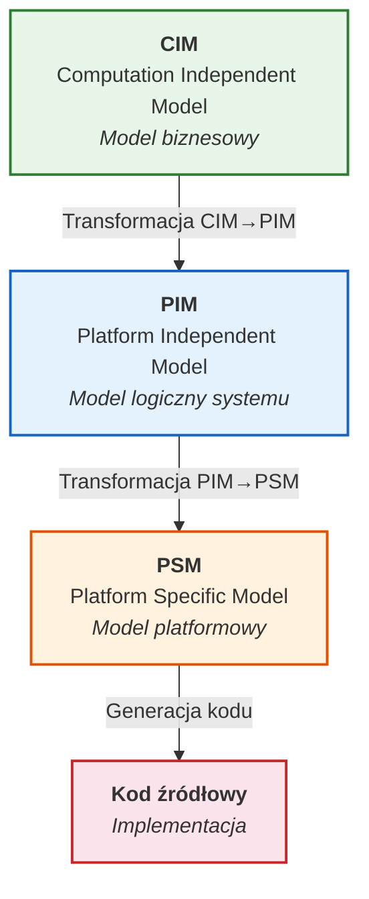
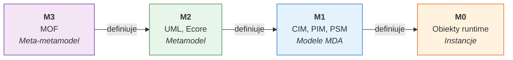
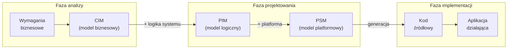
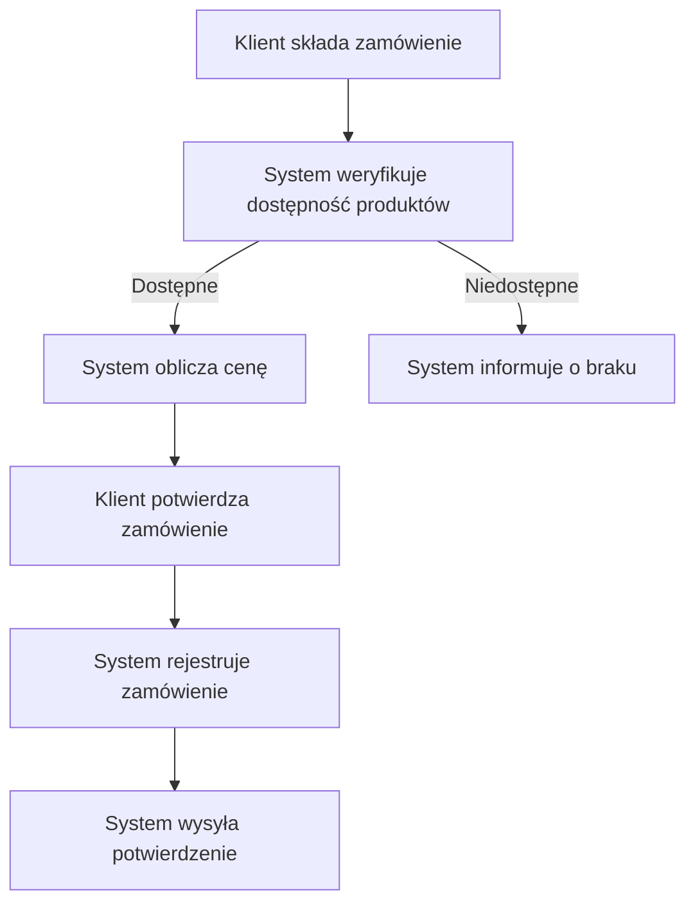
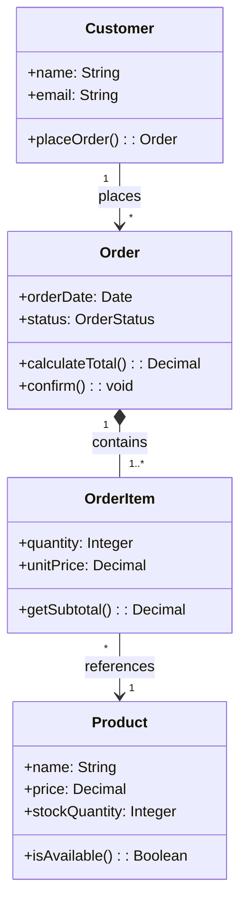
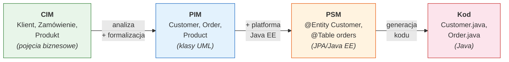
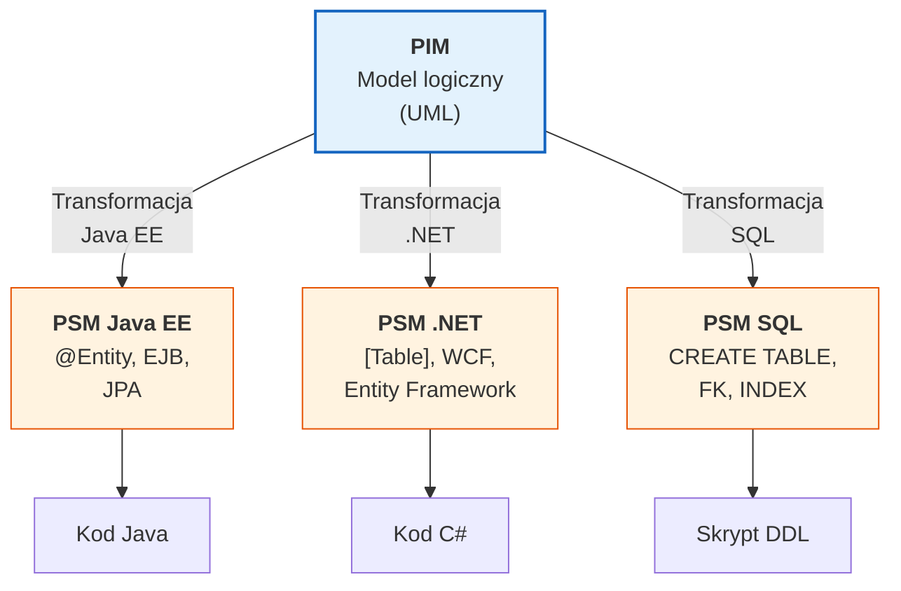

# Pytanie 10: Proszę wyjaśnić zasady procesu wytwarzania oprogramowania sterowanego modelami.

## Kluczowe pojęcia

- **MDD (Model-Driven Development)** — podejście do wytwarzania oprogramowania, w którym modele są podstawowymi artefaktami procesu rozwoju, a nie jedynie dokumentacją. Modele służą jako formalne specyfikacje systemu i są automatycznie transformowane w kod źródłowy lub inne modele. MDD obejmuje różne metodyki i frameworki, w tym MDA, Software Factories czy Domain-Specific Modeling (DSM).
- **MDA (Model-Driven Architecture)** — konkretna realizacja podejścia MDD zaproponowana przez organizację OMG (Object Management Group) w 2001 roku. MDA definiuje trzy poziomy abstrakcji modeli (CIM, PIM, PSM) oraz standardowe mechanizmy transformacji między nimi. Celem MDA jest oddzielenie logiki biznesowej od szczegółów technologicznych platformy docelowej.
- **CIM (Computation Independent Model)** — model niezależny od obliczeń, opisujący dziedzinę biznesową i wymagania systemu bez odniesień do implementacji informatycznej. CIM odpowiada na pytanie „co system ma robić?" z perspektywy biznesowej. Przykłady: diagramy procesów biznesowych (BPMN), modele przypadków użycia, modele dziedziny w języku naturalnym.
- **PIM (Platform Independent Model)** — model niezależny od platformy, opisujący strukturę i zachowanie systemu w sposób formalny, ale bez powiązania z konkretną technologią implementacji. PIM odpowiada na pytanie „jak system działa logicznie?". Przykłady: diagramy klas UML, diagramy sekwencji, diagramy stanów — bez odniesień do konkretnego języka programowania czy frameworka.
- **PSM (Platform Specific Model)** — model specyficzny dla platformy, opisujący system z uwzględnieniem szczegółów technologicznych konkretnej platformy docelowej (np. Java EE, .NET, baza danych SQL). PSM odpowiada na pytanie „jak system jest zrealizowany na danej platformie?". Przykłady: diagramy klas z adnotacjami JPA, modele EJB, schematy bazy danych.
- **Transformacja modeli** — automatyczny lub półautomatyczny proces przekształcania jednego modelu w inny, zgodnie ze zdefiniowanymi regułami transformacji. W MDA wyróżniamy transformacje: CIM→PIM, PIM→PSM, PSM→kod. Transformacje mogą być realizowane w językach takich jak ATL, QVT czy ETL. Transformacja zachowuje semantykę modelu źródłowego, dodając informacje specyficzne dla poziomu docelowego.
- **OMG (Object Management Group)** — międzynarodowe konsorcjum standaryzacyjne, które opracowało MDA oraz powiązane standardy: UML (Unified Modeling Language), MOF (Meta-Object Facility), XMI (XML Metadata Interchange), QVT (Query/View/Transformation). OMG definiuje czterowarstwową architekturę modelowania (M0–M3).

## Architektura MDA

### Idea i motywacja

Główną motywacją MDA jest **oddzielenie logiki biznesowej od technologii implementacji**. W tradycyjnym podejściu zmiana platformy (np. migracja z Java EE na .NET) wymaga przepisania znacznej części kodu. W MDA logika biznesowa jest zapisana w modelu PIM, który jest niezależny od platformy — zmiana technologii wymaga jedynie zastosowania innej transformacji PIM→PSM.

Kluczowe zasady MDA:
1. **Modele jako artefakty pierwszoklasowe** — modele nie są tylko dokumentacją, lecz formalnymi specyfikacjami, z których generowany jest kod
2. **Separacja zagadnień** (Separation of Concerns) — oddzielenie logiki biznesowej (PIM) od szczegółów platformy (PSM)
3. **Automatyzacja transformacji** — przejścia między poziomami abstrakcji są realizowane przez narzędzia, nie ręcznie
4. **Standardy otwarte** — MDA opiera się na standardach OMG (UML, MOF, QVT, XMI)

### Trzy poziomy abstrakcji

Architektura MDA definiuje trzy poziomy modeli, uporządkowane od najwyższego poziomu abstrakcji do najniższego:



#### CIM — Computation Independent Model

CIM opisuje system z perspektywy **dziedziny biznesowej**, bez jakichkolwiek odniesień do informatyki:

| Aspekt | Opis |
|---|---|
| **Perspektywa** | Biznesowa — „co system ma robić?" |
| **Odbiorcy** | Analitycy biznesowi, klienci, eksperci dziedzinowi |
| **Notacje** | BPMN, diagramy przypadków użycia, język naturalny, RSL |
| **Zawartość** | Procesy biznesowe, aktorzy, wymagania funkcjonalne |
| **Niezależność** | Od obliczeń — brak pojęć informatycznych |

#### PIM — Platform Independent Model

PIM opisuje **logiczną strukturę i zachowanie systemu** w sposób formalny, ale bez powiązania z konkretną platformą:

| Aspekt | Opis |
|---|---|
| **Perspektywa** | Logiczna — „jak system działa?" |
| **Odbiorcy** | Architekci, projektanci, programiści |
| **Notacje** | UML (diagramy klas, sekwencji, stanów, aktywności) |
| **Zawartość** | Klasy, interfejsy, relacje, algorytmy, wzorce |
| **Niezależność** | Od platformy — brak odniesień do Java, .NET, SQL itp. |

#### PSM — Platform Specific Model

PSM opisuje system z uwzględnieniem **szczegółów konkretnej platformy docelowej**:

| Aspekt | Opis |
|---|---|
| **Perspektywa** | Technologiczna — „jak system jest zrealizowany?" |
| **Odbiorcy** | Programiści, administratorzy |
| **Notacje** | UML z profilami platformowymi, DSL platformowe |
| **Zawartość** | Klasy z adnotacjami JPA, konfiguracja EJB, schematy BD |
| **Specyficzność** | Powiązany z konkretną platformą (Java EE, .NET, SQL) |

### Związek z hierarchią modelowania OMG (M0–M3)

Modele MDA funkcjonują w ramach czterowarstwowej hierarchii modelowania OMG:



- **M3 (MOF)** — definiuje strukturę metamodeli (np. UML)
- **M2 (UML, Ecore)** — metamodele, w których zapisujemy modele MDA
- **M1 (CIM, PIM, PSM)** — konkretne modele systemu na różnych poziomach abstrakcji
- **M0** — działające instancje obiektów w runtime

## Proces transformacji modeli w MDA

### Schemat ogólny procesu

Proces MDA składa się z sekwencji transformacji, w których każdy krok dodaje informacje specyficzne dla niższego poziomu abstrakcji:



### Transformacja CIM → PIM

Transformacja CIM→PIM przekształca model biznesowy w model logiczny systemu informatycznego:

| Element CIM | Element PIM | Reguła transformacji |
|---|---|---|
| Aktor (przypadek użycia) | Interfejs użytkownika / Rola | Aktor → klasa z rolą w systemie |
| Przypadek użycia | Klasa serwisowa / Operacja | Przypadek użycia → metoda serwisu |
| Proces biznesowy | Diagram aktywności / Sekwencji | Kroki procesu → akcje w diagramie |
| Encja biznesowa | Klasa dziedzinowa | Pojęcie biznesowe → klasa z atrybutami |
| Reguła biznesowa | Ograniczenie OCL / Walidacja | Reguła → invariant lub precondition |

Ta transformacja jest **częściowo automatyczna** — wymaga decyzji architektonicznych (np. wybór wzorców projektowych, podział na warstwy).

### Transformacja PIM → PSM

Transformacja PIM→PSM jest kluczowym krokiem MDA — dodaje szczegóły platformy docelowej:

| Element PIM | Element PSM (Java EE) | Element PSM (.NET) |
|---|---|---|
| Klasa dziedzinowa | Klasa z `@Entity` (JPA) | Klasa z `[Table]` (Entity Framework) |
| Atrybut | Pole z `@Column` | Właściwość z `[Column]` |
| Asocjacja 1:N | `@OneToMany` + `@JoinColumn` | Kolekcja z `[ForeignKey]` |
| Interfejs serwisu | EJB `@Stateless` / Spring `@Service` | Klasa z `[ServiceContract]` (WCF) |
| Operacja | Metoda z `@Transactional` | Metoda z `[OperationContract]` |

Ta transformacja jest **w dużej mierze automatyczna** — reguły mapowania PIM→PSM są dobrze zdefiniowane dla każdej platformy.

### Transformacja PSM → Kod

Ostatni krok to **generacja kodu** z modelu PSM:

- Generowane są: klasy, interfejsy, pliki konfiguracyjne, schematy bazy danych
- Generacja jest **w pełni automatyczna** — PSM zawiera wystarczająco dużo informacji
- Wygenerowany kod może wymagać uzupełnienia o logikę biznesową (tzw. „protected regions")
- Narzędzia: Eclipse EMF, Acceleo, Xpand, JET

### Typy transformacji

W MDA wyróżniamy kilka typów transformacji:

| Typ | Opis | Przykład |
|---|---|---|
| **M2M (Model-to-Model)** | Transformacja modelu w inny model | PIM → PSM |
| **M2T (Model-to-Text)** | Generacja tekstu (kodu) z modelu | PSM → kod Java |
| **T2M (Text-to-Model)** | Parsowanie tekstu do modelu (reverse engineering) | Kod Java → PSM |
| **Endogeniczna** | Transformacja w ramach tego samego metamodelu | Refaktoryzacja modelu UML |
| **Egzogeniczna** | Transformacja między różnymi metamodelami | UML → schemat BD |

## Zalety i wady MDD/MDA

### Zalety

1. **Przenośność** — model PIM jest niezależny od platformy; zmiana technologii wymaga jedynie nowej transformacji PIM→PSM, bez przepisywania logiki biznesowej
2. **Produktywność** — automatyczna generacja kodu z modeli eliminuje powtarzalną pracę programistyczną (boilerplate code)
3. **Spójność** — modele na różnych poziomach abstrakcji są powiązane transformacjami, co zapewnia spójność między dokumentacją a kodem
4. **Jakość** — transformacje są testowane i weryfikowane raz, a następnie stosowane wielokrotnie, co redukuje błędy ludzkie
5. **Komunikacja** — modele CIM i PIM są zrozumiałe dla interesariuszy nietechnicznych, co ułatwia komunikację z klientem
6. **Dokumentacja** — modele stanowią aktualną dokumentację systemu (w przeciwieństwie do tradycyjnej dokumentacji, która szybko się dezaktualizuje)
7. **Interoperacyjność** — standardy OMG (UML, XMI, MOF) zapewniają wymianę modeli między narzędziami różnych dostawców

### Wady

1. **Złożoność narzędzi** — narzędzia MDA (Eclipse Modeling Framework, MagicDraw, Enterprise Architect) mają stromą krzywą uczenia
2. **Koszt początkowy** — opracowanie metamodeli, transformacji i profili platformowych wymaga znacznego nakładu pracy
3. **Ograniczenia ekspresji** — nie wszystkie aspekty systemu da się wyrazić w modelach; logika biznesowa często wymaga ręcznego kodowania
4. **Synchronizacja** — utrzymanie spójności między modelami a kodem (round-trip engineering) jest trudne w praktyce
5. **Wydajność generowanego kodu** — automatycznie wygenerowany kod może być mniej wydajny niż ręcznie zoptymalizowany
6. **Vendor lock-in** — mimo standardów OMG, narzędzia MDA różnych dostawców nie zawsze są w pełni kompatybilne
7. **Nadmiarowość** — dla prostych systemów narzut MDA (tworzenie modeli, transformacji) może przewyższać korzyści

### Kiedy stosować MDD/MDA?

| Scenariusz | Rekomendacja |
|---|---|
| Duży system enterprise z wieloma platformami | ✅ Silna rekomendacja |
| System wymagający migracji między platformami | ✅ Silna rekomendacja |
| Dziedzina z dobrze zdefiniowanym metamodelem | ✅ Rekomendacja |
| Prototyp / MVP | ❌ Nadmierny narzut |
| Mały projekt z jedną platformą | ❌ Niewspółmierne koszty |
| System z nietypową logiką biznesową | ⚠️ Ograniczone korzyści |

## Przykłady

### Przepływ MDA — od modelu biznesowego do kodu

Poniższy przykład ilustruje kompletny przepływ MDA dla prostego systemu zarządzania zamówieniami.

#### Krok 1: CIM — Model biznesowy

Model biznesowy opisuje proces składania zamówienia z perspektywy użytkownika:



Encje biznesowe (CIM):
- **Klient** — osoba składająca zamówienie
- **Zamówienie** — żądanie zakupu produktów
- **Produkt** — towar dostępny w ofercie
- **Pozycja zamówienia** — konkretny produkt w zamówieniu z ilością

#### Krok 2: PIM — Model logiczny (UML)

Transformacja CIM→PIM przekształca encje biznesowe w klasy UML:



Model PIM nie zawiera żadnych odniesień do konkretnej technologii — jest to czysty model logiczny.

#### Krok 3: PSM — Model platformowy (Java EE + JPA)

Transformacja PIM→PSM dodaje adnotacje specyficzne dla platformy Java EE:

```java
// PSM: Klasa Customer z adnotacjami JPA
@Entity
@Table(name = "customers")
public class Customer {
    @Id
    @GeneratedValue(strategy = GenerationType.IDENTITY)
    private Long id;

    @Column(nullable = false, length = 100)
    private String name;

    @Column(nullable = false, unique = true)
    private String email;

    @OneToMany(mappedBy = "customer", cascade = CascadeType.ALL)
    private List<Order> orders;
}

// PSM: Klasa Order z adnotacjami JPA
@Entity
@Table(name = "orders")
public class Order {
    @Id
    @GeneratedValue(strategy = GenerationType.IDENTITY)
    private Long id;

    @Temporal(TemporalType.TIMESTAMP)
    @Column(nullable = false)
    private Date orderDate;

    @Enumerated(EnumType.STRING)
    private OrderStatus status;

    @ManyToOne(fetch = FetchType.LAZY)
    @JoinColumn(name = "customer_id", nullable = false)
    private Customer customer;

    @OneToMany(mappedBy = "order", cascade = CascadeType.ALL)
    private List<OrderItem> items;
}
```

#### Krok 4: Kod wygenerowany

Z modelu PSM generowany jest kompletny kod, w tym:
- Klasy encji z adnotacjami JPA (jak powyżej)
- Interfejsy repozytoriów (DAO)
- Serwisy biznesowe ze szkieletami metod
- Pliki konfiguracyjne (`persistence.xml`, `web.xml`)
- Skrypty DDL tworzące tabele w bazie danych

#### Podsumowanie przepływu



### Przykład wieloplatformowości MDA

Kluczową zaletą MDA jest możliwość generowania kodu na **różne platformy** z tego samego modelu PIM:



Ten sam model PIM (klasy `Customer`, `Order`, `Product`) może być transformowany do:
- **Java EE** — klasy z adnotacjami JPA, serwisy EJB
- **.NET** — klasy z atrybutami Entity Framework, serwisy WCF
- **SQL** — skrypty DDL tworzące tabele, klucze obce, indeksy

Zmiana platformy docelowej wymaga jedynie zastosowania innego zestawu reguł transformacji — model PIM pozostaje niezmieniony.

## Podsumowanie

1. **MDD (Model-Driven Development)** to podejście, w którym modele są podstawowymi artefaktami procesu wytwarzania oprogramowania — służą nie tylko jako dokumentacja, ale jako formalne specyfikacje, z których automatycznie generowany jest kod.

2. **MDA (Model-Driven Architecture)** to konkretna realizacja MDD zaproponowana przez OMG, definiująca trzy poziomy abstrakcji: CIM (model biznesowy), PIM (model logiczny, niezależny od platformy) i PSM (model specyficzny dla platformy).

3. **Proces transformacji** w MDA przebiega sekwencyjnie: CIM → PIM → PSM → kod. Każdy krok dodaje informacje specyficzne dla niższego poziomu abstrakcji. Transformacje CIM→PIM są częściowo automatyczne, PIM→PSM — w dużej mierze automatyczne, a PSM→kod — w pełni automatyczne.

4. **Kluczową zaletą MDA** jest separacja logiki biznesowej (PIM) od szczegółów platformy (PSM), co umożliwia wieloplatformowość — ten sam model PIM może być transformowany na różne platformy (Java EE, .NET, SQL) bez zmiany logiki.

5. **Transformacje modeli** mogą być typu M2M (model-to-model, np. PIM→PSM) lub M2T (model-to-text, np. PSM→kod). Realizowane są w standardowych językach transformacji: ATL, QVT, ETL.

6. **Wady MDA** obejmują: złożoność narzędzi, wysoki koszt początkowy, ograniczenia ekspresji modeli oraz trudności z synchronizacją modeli i kodu (round-trip engineering).

7. **MDA opiera się na standardach OMG**: UML (język modelowania), MOF (meta-metamodel), QVT (transformacje), XMI (wymiana modeli) — co zapewnia interoperacyjność między narzędziami.

## Powiązane pytania

- [Pytanie 6: Co to jest metamodel? W jakich językach można tworzyć metamodele?](06-metamodel-jezyki.md)
- [Pytanie 8: Proszę omówić podstawowe konstrukcje wybranego języka transformacji modeli.](08-jezyki-transformacji-modeli.md)
- [Pytanie 11: Proszę określić kilka przykładowych reguł transformacji modeli dla wybranych języków modelowania (np. RSL i UML).](11-reguly-transformacji-rsl-uml.md)
- [Pytanie 14: Proszę opisać zasady tworzenia i transformacji modeli (np. w językach RSL i UML) oraz generacji kodu dla wybranych narzędzi CASE.](14-narzedzia-case-generacja-kodu.md)
