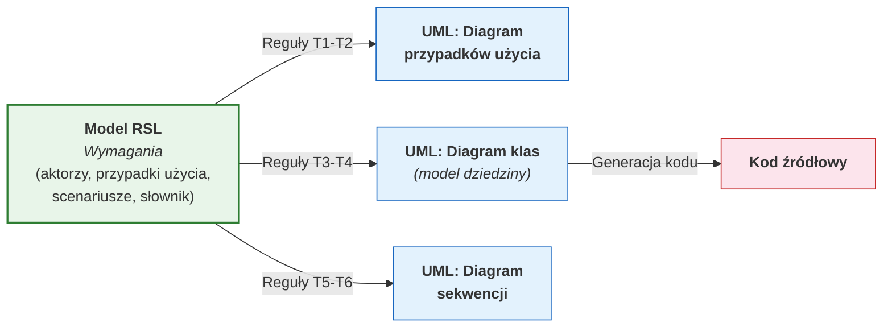
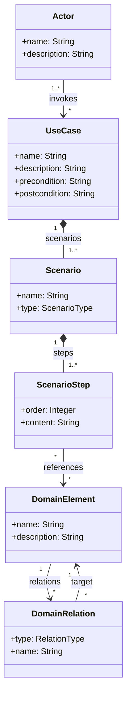
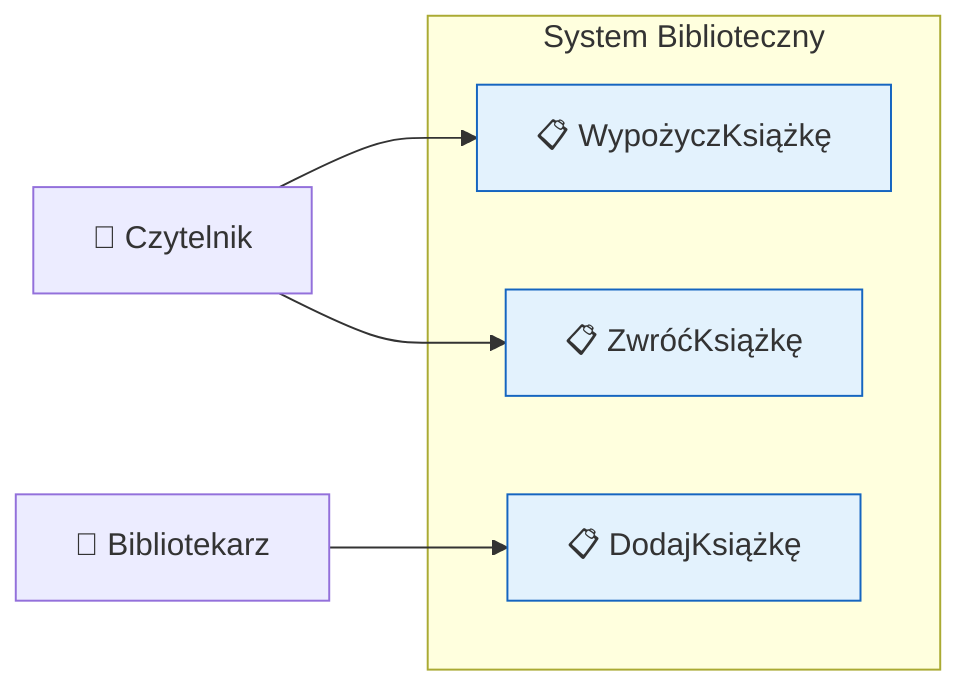
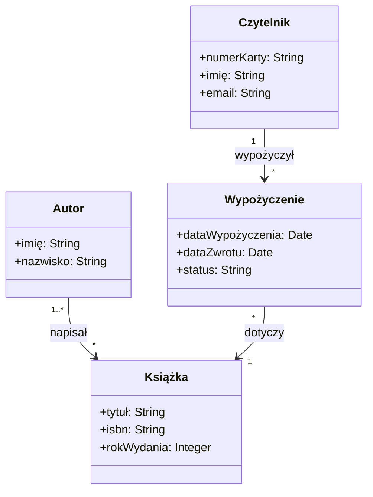
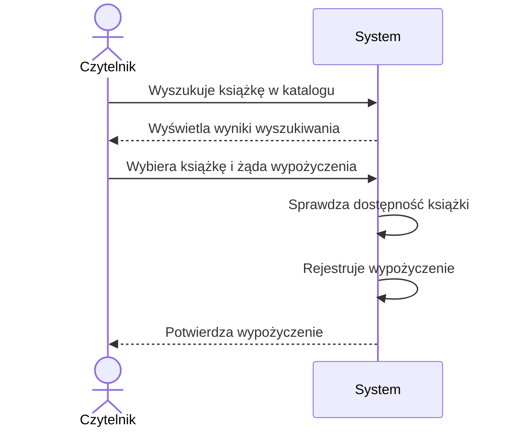
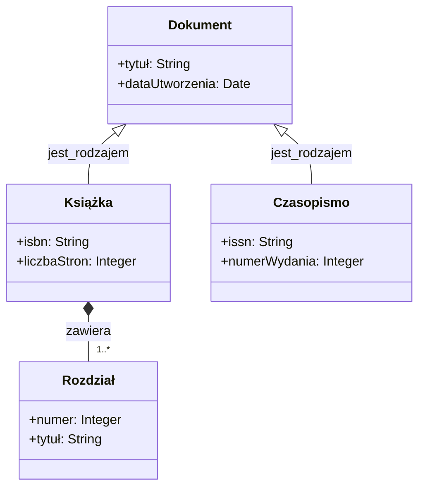
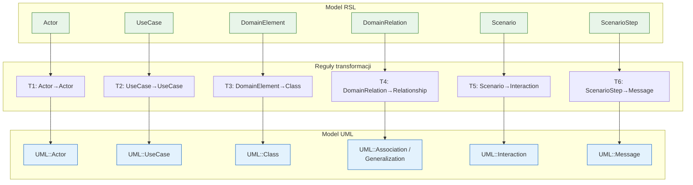

# Pytanie 11: Proszę określić kilka przykładowych reguł transformacji modeli dla wybranych języków modelowania (np. RSL i UML).

## Kluczowe pojęcia

- **RSL (Requirements Specification Language)** — język modelowania wymagań opracowany na Politechnice Warszawskiej w ramach projektu ReDSeeDS (Requirements-Driven Software Development System). RSL służy do formalnego specyfikowania wymagań funkcjonalnych i niefunkcjonalnych systemu informatycznego. RSL integruje notacje przypadków użycia, scenariuszy, słownika dziedzinowego i modelu dziedziny w jednym spójnym języku. Metamodel RSL definiuje pojęcia takie jak: aktor (Actor), przypadek użycia (UseCase), scenariusz (Scenario), krok scenariusza (ScenarioStep), pojęcie dziedzinowe (DomainElement), fraza (Phrase) i relacje między nimi.
- **UML (Unified Modeling Language)** — standardowy język modelowania opracowany przez OMG (Object Management Group), służący do wizualizacji, specyfikacji, projektowania i dokumentowania systemów informatycznych. UML definiuje 14 typów diagramów (m.in. klas, sekwencji, przypadków użycia, stanów, aktywności). W kontekście transformacji RSL→UML istotne są przede wszystkim: diagram przypadków użycia, diagram klas oraz diagram sekwencji.
- **Reguła transformacji (Transformation Rule)** — formalna definicja mapowania między elementem metamodelu źródłowego a elementem metamodelu docelowego. Reguła określa: warunek dopasowania (jakie elementy źródłowe są transformowane), akcję tworzenia (jakie elementy docelowe powstają) oraz mapowanie atrybutów i relacji. Reguły transformacji mogą być wyrażone w językach takich jak ATL, QVT czy ETL.
- **Transformacja M2M (Model-to-Model)** — automatyczne przekształcenie modelu zgodnego z jednym metamodelem w model zgodny z innym metamodelem. Transformacja RSL→UML jest przykładem transformacji egzogenicznej (różne metamodele źródłowy i docelowy). Transformacja M2M zachowuje semantykę modelu źródłowego, wyrażając ją w notacji modelu docelowego.
- **Mapowanie pojęć (Concept Mapping)** — proces identyfikacji odpowiedniości (korespondencji) między pojęciami dwóch metamodeli. Mapowanie jest podstawą definiowania reguł transformacji. Przykład: RSL::Actor ↔ UML::Actor, RSL::UseCase ↔ UML::UseCase. Mapowanie może być 1:1 (jeden element źródłowy → jeden docelowy), 1:N (jeden → wiele) lub N:1 (wiele → jeden).

## Wprowadzenie — kontekst transformacji RSL → UML

Transformacja modeli RSL na modele UML jest kluczowym krokiem w procesie wytwarzania oprogramowania sterowanego modelami (MDD/MDA). RSL, jako język specyfikacji wymagań, operuje na poziomie zbliżonym do CIM/PIM — opisuje **co** system ma robić z perspektywy użytkownika. UML natomiast służy do modelowania **jak** system jest zaprojektowany — na poziomie PIM/PSM.

Transformacja RSL→UML realizuje przejście od modelu wymagań do modelu projektowego, automatyzując proces, który tradycyjnie wykonywany jest ręcznie przez analityków i projektantów.

### Miejsce transformacji RSL→UML w procesie MDA



### Dlaczego transformacja RSL→UML jest potrzebna?

1. **Automatyzacja** — eliminuje ręczne, podatne na błędy tworzenie diagramów UML na podstawie specyfikacji wymagań
2. **Spójność** — gwarantuje, że model projektowy (UML) jest zgodny z modelem wymagań (RSL)
3. **Śledzenie wymagań** (traceability) — każdy element UML ma źródło w konkretnym elemencie RSL
4. **Powtarzalność** — te same reguły transformacji dają ten sam wynik dla tych samych danych wejściowych

## Przegląd języków RSL i UML

### RSL — Requirements Specification Language

RSL został zaprojektowany jako zintegrowany język specyfikacji wymagań, łączący kilka perspektyw modelowania w jednym spójnym metamodelu:

#### Główne elementy metamodelu RSL

| Element RSL | Opis | Odpowiednik w analizie |
|---|---|---|
| **Actor** | Aktor zewnętrzny wchodzący w interakcję z systemem | Użytkownik, system zewnętrzny |
| **UseCase** | Przypadek użycia — funkcjonalność systemu widziana z perspektywy aktora | Wymaganie funkcjonalne |
| **Scenario** | Scenariusz — sekwencja kroków realizujących przypadek użycia | Przepływ zdarzeń |
| **ScenarioStep** | Pojedynczy krok scenariusza (akcja aktora lub systemu) | Krok w przepływie |
| **DomainElement** | Pojęcie dziedzinowe (rzeczownik ze słownika dziedziny) | Klasa konceptualna |
| **DomainRelation** | Relacja między pojęciami dziedzinowymi | Asocjacja, generalizacja |
| **Phrase** | Fraza w kroku scenariusza, powiązana z pojęciami dziedzinowymi | Opis akcji |
| **SystemBoundary** | Granica systemu oddzielająca aktorów od funkcjonalności | Zakres systemu |

#### Struktura metamodelu RSL (uproszczona)



### UML — elementy docelowe transformacji

W kontekście transformacji RSL→UML interesują nas trzy główne typy diagramów UML:

| Diagram UML | Elementy | Źródło w RSL |
|---|---|---|
| **Diagram przypadków użycia** | Actor, UseCase, Association, Include, Extend, System Boundary | Actor, UseCase, relacje między nimi |
| **Diagram klas** | Class, Attribute, Operation, Association, Generalization, Aggregation | DomainElement, DomainRelation, atrybuty |
| **Diagram sekwencji** | Lifeline, Message, CombinedFragment, InteractionOperand | Scenario, ScenarioStep, Actor |

## Zasady mapowania elementów RSL na UML

### Tabela mapowania pojęć RSL → UML

Poniższa tabela przedstawia systematyczne mapowanie między elementami metamodelu RSL a elementami metamodelu UML:

| Element RSL | Element UML | Typ mapowania | Uwagi |
|---|---|---|---|
| `RSL::Actor` | `UML::Actor` | 1:1 | Bezpośrednie mapowanie nazwy i opisu |
| `RSL::UseCase` | `UML::UseCase` | 1:1 | Mapowanie nazwy; pre/postconditions → constraints |
| `RSL::UseCase.precondition` | `UML::Constraint` | 1:1 | Warunek wstępny jako ograniczenie UML |
| `RSL::Actor→UseCase` | `UML::Association` | 1:1 | Relacja invokes → asocjacja na diagramie UC |
| `RSL::DomainElement` | `UML::Class` | 1:1 | Pojęcie dziedzinowe → klasa UML |
| `RSL::DomainElement.attribute` | `UML::Property` | 1:1 | Atrybut pojęcia → atrybut klasy |
| `RSL::DomainRelation (association)` | `UML::Association` | 1:1 | Relacja asocjacji → asocjacja UML |
| `RSL::DomainRelation (generalization)` | `UML::Generalization` | 1:1 | Relacja generalizacji → generalizacja UML |
| `RSL::DomainRelation (composition)` | `UML::Composition` | 1:1 | Relacja kompozycji → kompozycja UML |
| `RSL::Scenario` | `UML::Interaction` | 1:1 | Scenariusz → interakcja (diagram sekwencji) |
| `RSL::ScenarioStep (actor)` | `UML::Message` | 1:1 | Krok aktora → komunikat od aktora do systemu |
| `RSL::ScenarioStep (system)` | `UML::Message` | 1:1 | Krok systemu → komunikat wewnętrzny lub zwrotny |
| `RSL::Actor` (w scenariuszu) | `UML::Lifeline` | 1:1 | Aktor uczestniczący → linia życia |

### Zasady ogólne transformacji

1. **Zachowanie nazw** — nazwy elementów RSL są przenoszone do odpowiadających elementów UML bez zmian (lub z minimalną normalizacją, np. usunięcie spacji w nazwach klas)
2. **Zachowanie relacji** — relacje między elementami RSL są odwzorowywane na odpowiednie relacje UML (asocjacja → asocjacja, generalizacja → generalizacja)
3. **Zachowanie hierarchii** — struktura zagnieżdżenia (np. UseCase zawiera Scenario, Scenario zawiera ScenarioStep) jest odwzorowywana w strukturze UML
4. **Wzbogacanie informacji** — transformacja może dodawać informacje specyficzne dla UML (np. widoczność atrybutów, krotności asocjacji), które nie istnieją w RSL
5. **Jednokierunkowość** — transformacja RSL→UML jest jednokierunkowa (nie ma automatycznej transformacji odwrotnej UML→RSL)

## Formalizacja reguł transformacji

Reguły transformacji RSL→UML można sformalizować w notacji zbliżonej do ATL (Atlas Transformation Language). Poniżej przedstawiono formalizację kluczowych reguł.

### Notacja formalna reguł

Każda reguła jest opisana w formacie:

```
REGUŁA: NazwaReguły
ŹRÓDŁO: MetamodelRSL::TypElementu [warunek]
CEL:    MetamodelUML::TypElementu
MAPOWANIE:
  cel.atrybut ← źródło.atrybut
  cel.referencja ← źródło.referencja [transformacja]
```

### Reguła T1: Actor → Actor (RSL → UML Use Case Diagram)

```
REGUŁA: RSL_Actor_to_UML_Actor
ŹRÓDŁO: RSL::Actor
CEL:    UML::Actor
MAPOWANIE:
  umlActor.name       ← rslActor.name
  umlActor.description ← rslActor.description
```

**Zapis w ATL:**

```
rule ActorToActor {
    from
        s : RSL!Actor
    to
        t : UML!Actor (
            name <- s.name,
            ownedComment <- thisModule.CreateComment(s.description)
        )
}
```

### Reguła T2: UseCase → UseCase (RSL → UML Use Case Diagram)

```
REGUŁA: RSL_UseCase_to_UML_UseCase
ŹRÓDŁO: RSL::UseCase
CEL:    UML::UseCase + UML::Constraint (opcjonalnie)
MAPOWANIE:
  umlUC.name          ← rslUC.name
  umlUC.description   ← rslUC.description
  umlUC.precondition  ← Constraint(rslUC.precondition)   [jeśli istnieje]
  umlUC.postcondition ← Constraint(rslUC.postcondition)  [jeśli istnieje]
```

**Zapis w ATL:**

```
rule UseCaseToUseCase {
    from
        s : RSL!UseCase
    to
        t : UML!UseCase (
            name <- s.name,
            ownedComment <- thisModule.CreateComment(s.description)
        ),
        pre : UML!Constraint (
            name <- 'precondition',
            specification <- thisModule.CreateOpaqueExpression(s.precondition),
            constrainedElement <- t
        ),
        post : UML!Constraint (
            name <- 'postcondition',
            specification <- thisModule.CreateOpaqueExpression(s.postcondition),
            constrainedElement <- t
        )
}
```

### Reguła T3: DomainElement → Class (RSL → UML Class Diagram)

```
REGUŁA: RSL_DomainElement_to_UML_Class
ŹRÓDŁO: RSL::DomainElement
CEL:    UML::Class
MAPOWANIE:
  umlClass.name        ← rslDE.name
  umlClass.isAbstract  ← false  [domyślnie]
  umlClass.visibility   ← public
  umlClass.ownedAttribute ← rslDE.attributes [transformacja T4]
```

**Zapis w ATL:**

```
rule DomainElementToClass {
    from
        s : RSL!DomainElement
    to
        t : UML!Class (
            name <- s.name,
            isAbstract <- false,
            visibility <- #public,
            ownedAttribute <- s.attributes  -- rozwiązanie automatyczne
        )
}
```

### Reguła T4: DomainRelation → Association / Generalization

Ta reguła jest bardziej złożona, ponieważ typ relacji RSL determinuje typ elementu UML:

```
REGUŁA: RSL_DomainRelation_to_UML_Relationship
ŹRÓDŁO: RSL::DomainRelation
CEL:    UML::Association | UML::Generalization | UML::Composition
WARUNEK:
  JEŚLI rslRel.type = 'association'    → UML::Association
  JEŚLI rslRel.type = 'generalization' → UML::Generalization
  JEŚLI rslRel.type = 'composition'    → UML::Composition (agregacja całkowita)
```

**Zapis w ATL (z użyciem wielu reguł):**

```
-- Reguła dla asocjacji
rule AssociationRelToAssociation {
    from
        s : RSL!DomainRelation (s.type = #association)
    to
        t : UML!Association (
            name <- s.name,
            memberEnd <- Sequence { srcEnd, tgtEnd }
        ),
        srcEnd : UML!Property (
            name <- s.source.name.toLower(),
            type <- s.source  -- rozwiązane na UML::Class
        ),
        tgtEnd : UML!Property (
            name <- s.target.name.toLower(),
            type <- s.target  -- rozwiązane na UML::Class
        )
}

-- Reguła dla generalizacji
rule GeneralizationRelToGeneralization {
    from
        s : RSL!DomainRelation (s.type = #generalization)
    to
        t : UML!Generalization (
            general <- s.target,   -- klasa nadrzędna
            specific <- s.source   -- klasa podrzędna
        )
}
```

### Reguła T5: Scenario → Interaction (RSL → UML Sequence Diagram)

```
REGUŁA: RSL_Scenario_to_UML_Interaction
ŹRÓDŁO: RSL::Scenario
CEL:    UML::Interaction + UML::Lifeline[]
MAPOWANIE:
  umlInteraction.name     ← rslScenario.name
  umlInteraction.lifeline ← {Lifeline(actor) | actor ∈ rslScenario.useCase.actors}
                             ∪ {Lifeline("System")}
  umlInteraction.message  ← rslScenario.steps [transformacja T6, zachowując kolejność]
```

**Zapis w ATL:**

```
rule ScenarioToInteraction {
    from
        s : RSL!Scenario
    to
        t : UML!Interaction (
            name <- s.name,
            lifeline <- s.useCase.actors->collect(a |
                thisModule.CreateLifeline(a)
            )->append(thisModule.CreateSystemLifeline()),
            message <- s.steps  -- rozwiązane przez regułę T6
        )
}

lazy rule CreateLifeline {
    from s : RSL!Actor
    to   t : UML!Lifeline (
        name <- s.name,
        represents <- s  -- rozwiązane na UML::Actor
    )
}
```

### Reguła T6: ScenarioStep → Message (RSL → UML Sequence Diagram)

```
REGUŁA: RSL_ScenarioStep_to_UML_Message
ŹRÓDŁO: RSL::ScenarioStep
CEL:    UML::Message
MAPOWANIE:
  umlMessage.name       ← rslStep.content
  umlMessage.messageSort ← JEŚLI rslStep.isActorStep
                              TO synchCall   (komunikat synchroniczny)
                              INACZEJ reply  (komunikat zwrotny)
  umlMessage.sendEvent  ← JEŚLI rslStep.isActorStep
                              TO Lifeline(actor)
                              INACZEJ Lifeline("System")
  umlMessage.receiveEvent ← JEŚLI rslStep.isActorStep
                              TO Lifeline("System")
                              INACZEJ Lifeline(actor)
```

**Zapis w ATL:**

```
rule ScenarioStepToMessage {
    from
        s : RSL!ScenarioStep
    to
        t : UML!Message (
            name <- s.content,
            messageSort <- if s.isActorStep then #synchCall
                           else #reply endif,
            sendEvent <- thisModule.CreateSendEvent(s),
            receiveEvent <- thisModule.CreateReceiveEvent(s)
        )
}
```

## Przykłady

### Przykład 1: Transformacja aktorów i przypadków użycia (T1 + T2)

Rozważmy system biblioteczny opisany w RSL z dwoma aktorami i trzema przypadkami użycia.

#### Model RSL (przed transformacją)

```
RSL Model: SystemBiblioteczny

Actor: Czytelnik
  description: "Osoba korzystająca z zasobów biblioteki"

Actor: Bibliotekarz
  description: "Pracownik zarządzający zasobami biblioteki"

UseCase: WypożyczKsiążkę
  actor: Czytelnik
  precondition: "Czytelnik jest zalogowany i ma aktywne konto"
  postcondition: "Książka jest przypisana do czytelnika"

UseCase: ZwróćKsiążkę
  actor: Czytelnik
  precondition: "Czytelnik posiada wypożyczoną książkę"
  postcondition: "Książka jest zwrócona do zasobów biblioteki"

UseCase: DodajKsiążkę
  actor: Bibliotekarz
  precondition: "Bibliotekarz jest zalogowany"
  postcondition: "Nowa książka jest w katalogu"
```

#### Zastosowane reguły

| Reguła | Element RSL | Element UML |
|---|---|---|
| T1 | Actor: Czytelnik | UML::Actor: Czytelnik |
| T1 | Actor: Bibliotekarz | UML::Actor: Bibliotekarz |
| T2 | UseCase: WypożyczKsiążkę | UML::UseCase: WypożyczKsiążkę + Constraints |
| T2 | UseCase: ZwróćKsiążkę | UML::UseCase: ZwróćKsiążkę + Constraints |
| T2 | UseCase: DodajKsiążkę | UML::UseCase: DodajKsiążkę + Constraints |

#### Model UML (po transformacji) — diagram przypadków użycia



Każdy przypadek użycia UML posiada dodatkowo ograniczenia (Constraints) wygenerowane z warunków wstępnych i końcowych RSL:
- `WypożyczKsiążkę` → precondition: „Czytelnik jest zalogowany i ma aktywne konto", postcondition: „Książka jest przypisana do czytelnika"

### Przykład 2: Transformacja modelu dziedziny (T3 + T4)

Rozważmy model dziedziny systemu bibliotecznego w RSL.

#### Model RSL (przed transformacją)

```
RSL Domain Model:

DomainElement: Książka
  attributes:
    - tytuł: String
    - isbn: String
    - rokWydania: Integer

DomainElement: Autor
  attributes:
    - imię: String
    - nazwisko: String

DomainElement: Czytelnik
  attributes:
    - numerKarty: String
    - imię: String
    - email: String

DomainElement: Wypożyczenie
  attributes:
    - dataWypożyczenia: Date
    - dataZwrotu: Date
    - status: String

DomainRelation: napisał
  type: association
  source: Autor
  target: Książka
  multiplicity: 1..* → *

DomainRelation: wypożyczył
  type: association
  source: Czytelnik
  target: Wypożyczenie
  multiplicity: 1 → *

DomainRelation: dotyczy
  type: association
  source: Wypożyczenie
  target: Książka
  multiplicity: * → 1
```

#### Zastosowane reguły

| Reguła | Element RSL | Element UML |
|---|---|---|
| T3 | DomainElement: Książka | UML::Class: Książka (z atrybutami) |
| T3 | DomainElement: Autor | UML::Class: Autor (z atrybutami) |
| T3 | DomainElement: Czytelnik | UML::Class: Czytelnik (z atrybutami) |
| T3 | DomainElement: Wypożyczenie | UML::Class: Wypożyczenie (z atrybutami) |
| T4 | DomainRelation: napisał | UML::Association: napisał |
| T4 | DomainRelation: wypożyczył | UML::Association: wypożyczył |
| T4 | DomainRelation: dotyczy | UML::Association: dotyczy |

#### Model UML (po transformacji) — diagram klas



Reguła T3 przekształciła każdy `DomainElement` w `UML::Class` z odpowiednimi atrybutami. Reguła T4 przekształciła każdą `DomainRelation` typu `association` w `UML::Association` z zachowaniem krotności i nazwy relacji.

### Przykład 3: Transformacja scenariusza na diagram sekwencji (T5 + T6)

Rozważmy scenariusz główny przypadku użycia „WypożyczKsiążkę".

#### Model RSL (przed transformacją)

```
RSL Scenario: WypożyczKsiążkę_Główny
  useCase: WypożyczKsiążkę
  type: main

  Step 1 [actor: Czytelnik]:
    "Czytelnik wyszukuje książkę w katalogu"
  Step 2 [system]:
    "System wyświetla wyniki wyszukiwania"
  Step 3 [actor: Czytelnik]:
    "Czytelnik wybiera książkę i żąda wypożyczenia"
  Step 4 [system]:
    "System sprawdza dostępność książki"
  Step 5 [system]:
    "System rejestruje wypożyczenie"
  Step 6 [system]:
    "System potwierdza wypożyczenie czytelnikowi"
```

#### Zastosowane reguły

| Reguła | Element RSL | Element UML |
|---|---|---|
| T5 | Scenario: WypożyczKsiążkę_Główny | UML::Interaction + Lifelines |
| T6 | Step 1 (actor) | UML::Message (synchCall: Czytelnik → System) |
| T6 | Step 2 (system) | UML::Message (reply: System → Czytelnik) |
| T6 | Step 3 (actor) | UML::Message (synchCall: Czytelnik → System) |
| T6 | Step 4 (system) | UML::Message (reply: System → System, wewnętrzny) |
| T6 | Step 5 (system) | UML::Message (reply: System → System, wewnętrzny) |
| T6 | Step 6 (system) | UML::Message (reply: System → Czytelnik) |

#### Model UML (po transformacji) — diagram sekwencji



Reguła T5 utworzyła obiekt `UML::Interaction` z dwiema liniami życia (Czytelnik i System). Reguła T6 przekształciła każdy krok scenariusza w komunikat UML — kroki aktora stały się komunikatami synchronicznymi (`synchCall`), a kroki systemu komunikatami zwrotnymi (`reply`) lub wewnętrznymi.

### Przykład 4: Transformacja z generalizacją i kompozycją (T3 + T4 — zaawansowane)

Rozważmy model dziedziny z relacjami generalizacji i kompozycji.

#### Model RSL (przed transformacją)

```
RSL Domain Model:

DomainElement: Dokument
  attributes:
    - tytuł: String
    - dataUtworzenia: Date

DomainElement: Książka
  attributes:
    - isbn: String
    - liczbaStron: Integer

DomainElement: Czasopismo
  attributes:
    - issn: String
    - numerWydania: Integer

DomainElement: Rozdział
  attributes:
    - numer: Integer
    - tytuł: String

DomainRelation: jest_rodzajem
  type: generalization
  source: Książka
  target: Dokument

DomainRelation: jest_rodzajem
  type: generalization
  source: Czasopismo
  target: Dokument

DomainRelation: zawiera
  type: composition
  source: Książka
  target: Rozdział
  multiplicity: 1 → 1..*
```

#### Zastosowane reguły

| Reguła | Element RSL | Element UML |
|---|---|---|
| T3 | DomainElement: Dokument | UML::Class: Dokument |
| T3 | DomainElement: Książka | UML::Class: Książka |
| T3 | DomainElement: Czasopismo | UML::Class: Czasopismo |
| T3 | DomainElement: Rozdział | UML::Class: Rozdział |
| T4 (generalization) | jest_rodzajem: Książka→Dokument | UML::Generalization |
| T4 (generalization) | jest_rodzajem: Czasopismo→Dokument | UML::Generalization |
| T4 (composition) | zawiera: Książka→Rozdział | UML::Composition |

#### Model UML (po transformacji) — diagram klas z generalizacją i kompozycją



W tym przykładzie reguła T4 rozróżnia trzy typy relacji RSL:
- `generalization` → `UML::Generalization` (strzałka z pustym trójkątem ◁)
- `composition` → `UML::Composition` (romb wypełniony ◆)
- `association` → `UML::Association` (zwykła linia)

Reguła T4 musi zatem zawierać logikę warunkową (dispatch) opartą na typie relacji RSL.

## Kompletna transformacja ATL: RSL → UML

Poniżej przedstawiono kompletny moduł ATL realizujący transformację RSL→UML, integrujący wszystkie omówione reguły:

```
-- ============================================================
-- Moduł: RSL2UML
-- Transformacja: Model wymagań RSL → Model projektowy UML
-- ============================================================
module RSL2UML;
create OUT : UML from IN : RSL;

-- ============================================================
-- HELPERY
-- ============================================================

-- Helper: normalizacja nazwy (usunięcie spacji, polskich znaków)
helper context String def: toClassName() : String =
    self.replaceAll(' ', '');

-- Helper: pobranie wszystkich aktorów scenariusza
helper context RSL!Scenario def: getActors() : Set(RSL!Actor) =
    self.useCase.actors->asSet();

-- ============================================================
-- REGUŁY T1-T2: Diagram przypadków użycia
-- ============================================================

-- T1: RSL::Actor → UML::Actor
rule ActorToActor {
    from  s : RSL!Actor
    to    t : UML!Actor (
              name <- s.name,
              ownedComment <- comment
          ),
          comment : UML!Comment (
              body <- s.description
          )
}

-- T2: RSL::UseCase → UML::UseCase + Constraints
rule UseCaseToUseCase {
    from  s : RSL!UseCase
    to    t : UML!UseCase (
              name <- s.name
          ),
          pre : UML!Constraint (
              name <- 'precondition',
              constrainedElement <- t,
              specification <- preExpr
          ),
          preExpr : UML!OpaqueExpression (
              body <- s.precondition
          ),
          post : UML!Constraint (
              name <- 'postcondition',
              constrainedElement <- t,
              specification <- postExpr
          ),
          postExpr : UML!OpaqueExpression (
              body <- s.postcondition
          )
}

-- ============================================================
-- REGUŁY T3-T4: Diagram klas
-- ============================================================

-- T3: RSL::DomainElement → UML::Class
rule DomainElementToClass {
    from  s : RSL!DomainElement
    to    t : UML!Class (
              name <- s.name.toClassName(),
              visibility <- #public,
              isAbstract <- false,
              ownedAttribute <- s.attributes
          )
}

-- T4a: RSL::DomainRelation (association) → UML::Association
rule AssociationToAssociation {
    from  s : RSL!DomainRelation (s.type = #association)
    to    t : UML!Association (
              name <- s.name,
              memberEnd <- Sequence { srcEnd, tgtEnd }
          ),
          srcEnd : UML!Property (
              type <- s.source
          ),
          tgtEnd : UML!Property (
              type <- s.target
          )
}

-- T4b: RSL::DomainRelation (generalization) → UML::Generalization
rule GeneralizationToGeneralization {
    from  s : RSL!DomainRelation (s.type = #generalization)
    to    t : UML!Generalization (
              general <- s.target,
              specific <- s.source
          )
}

-- ============================================================
-- REGUŁY T5-T6: Diagram sekwencji
-- ============================================================

-- T5: RSL::Scenario → UML::Interaction
rule ScenarioToInteraction {
    from  s : RSL!Scenario
    to    t : UML!Interaction (
              name <- s.name,
              lifeline <- s.getActors()->collect(a |
                  thisModule.CreateLifeline(a)
              )->append(sysLifeline),
              message <- s.steps
          ),
          sysLifeline : UML!Lifeline (
              name <- 'System'
          )
}

-- T5 (lazy): Tworzenie linii życia dla aktora
lazy rule CreateLifeline {
    from  s : RSL!Actor
    to    t : UML!Lifeline (
              name <- s.name
          )
}

-- T6: RSL::ScenarioStep → UML::Message
rule ScenarioStepToMessage {
    from  s : RSL!ScenarioStep
    to    t : UML!Message (
              name <- s.content,
              messageSort <- if s.isActorStep
                             then #synchCall
                             else #reply
                             endif
          )
}
```

## Zestawienie reguł transformacji

Poniższa tabela podsumowuje wszystkie zdefiniowane reguły transformacji RSL→UML:

| Reguła | Źródło (RSL) | Cel (UML) | Diagram UML | Typ mapowania |
|---|---|---|---|---|
| **T1** | Actor | Actor | Przypadków użycia | 1:1 |
| **T2** | UseCase | UseCase + Constraint | Przypadków użycia | 1:N |
| **T3** | DomainElement | Class | Klas | 1:1 |
| **T4a** | DomainRelation (association) | Association | Klas | 1:1 |
| **T4b** | DomainRelation (generalization) | Generalization | Klas | 1:1 |
| **T4c** | DomainRelation (composition) | Composition | Klas | 1:1 |
| **T5** | Scenario | Interaction + Lifeline[] | Sekwencji | 1:N |
| **T6** | ScenarioStep | Message | Sekwencji | 1:1 |

### Diagram przepływu transformacji



## Podsumowanie

- Transformacja RSL→UML jest przykładem transformacji egzogenicznej M2M (Model-to-Model), realizującej przejście od modelu wymagań do modelu projektowego w procesie MDA/MDD.
- RSL (Requirements Specification Language) integruje notacje przypadków użycia, scenariuszy i modelu dziedziny w jednym spójnym metamodelu, co umożliwia systematyczną transformację do UML.
- Zdefiniowano 6 głównych reguł transformacji (T1–T6) pokrywających trzy typy diagramów UML: przypadków użycia, klas i sekwencji.
- Reguły T1 i T2 transformują aktorów i przypadki użycia RSL na odpowiadające elementy diagramu przypadków użycia UML, z zachowaniem warunków wstępnych i końcowych jako ograniczeń (Constraints).
- Reguły T3 i T4 transformują pojęcia dziedzinowe i relacje RSL na klasy, asocjacje, generalizacje i kompozycje w diagramie klas UML.
- Reguły T5 i T6 transformują scenariusze i kroki scenariuszy RSL na interakcje i komunikaty w diagramie sekwencji UML, z automatycznym tworzeniem linii życia.
- Reguła T4 wymaga logiki warunkowej (dispatch) — typ relacji RSL (association, generalization, composition) determinuje typ elementu UML.
- Reguły transformacji można sformalizować w języku ATL (Atlas Transformation Language), wykorzystując matched rules, lazy rules i helpery.
- Automatyzacja transformacji RSL→UML zapewnia spójność między modelem wymagań a modelem projektowym oraz umożliwia śledzenie wymagań (traceability).

## Powiązane pytania

- [Pytanie 8: Proszę omówić podstawowe konstrukcje wybranego języka transformacji modeli.](08-jezyki-transformacji-modeli.md)
- [Pytanie 10: Proszę wyjaśnić zasady procesu wytwarzania oprogramowania sterowanego modelami.](10-mda-mdd.md)
- [Pytanie 13: Proszę wymienić i opisać składnię i znaczenie (semantykę) poszczególnych składników modelu interakcji (diagramy sekwencji).](13-diagramy-sekwencji-uml.md)
- [Pytanie 14: Proszę opisać zasady tworzenia i transformacji modeli (np. w językach RSL i UML) oraz generacji kodu dla wybranych narzędzi CASE.](14-narzedzia-case-generacja-kodu.md)
