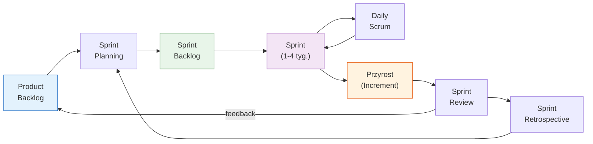
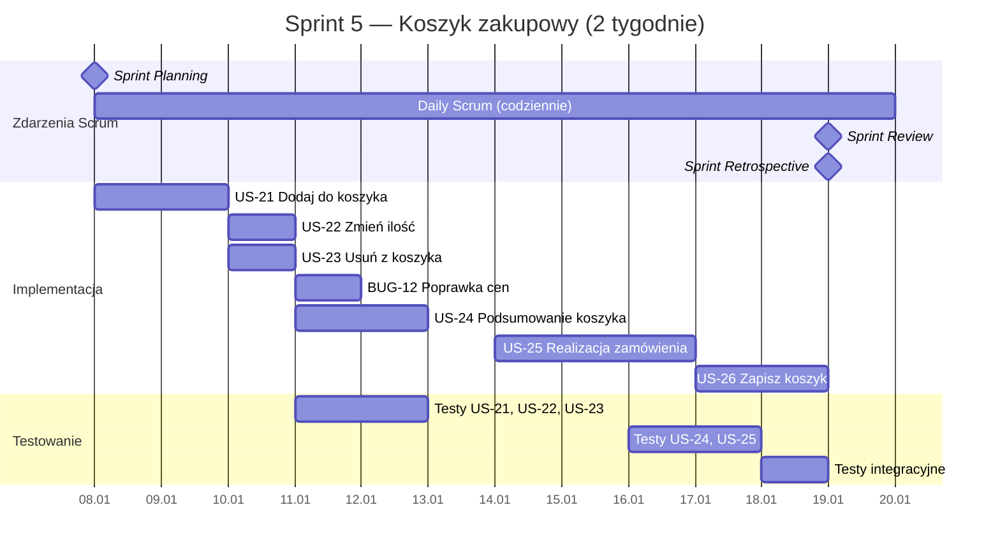

# Pytanie 12: Proszę krótko omówić wybraną formalną metodykę wytwarzania oprogramowania (np. RUP).

## Kluczowe pojęcia

- **Scrum** — lekka, iteracyjno-przyrostowa metodyka (framework) wytwarzania oprogramowania, należąca do rodziny metodyk Agile. Scrum został sformalizowany przez Kena Schwabera i Jeffa Sutherlanda w latach 90. XX wieku. Opiera się na empiryzmie — decyzje podejmowane są na podstawie obserwacji i doświadczenia, a nie szczegółowych planów z góry. Scrum definiuje trzy role, pięć zdarzeń i trzy artefakty.
- **Sprint** — podstawowa jednostka pracy w Scrum — iteracja o stałej długości (typowo 1-4 tygodnie), w której zespół tworzy potencjalnie wdrażalny przyrost produktu. Sprint ma stały czas trwania (timebox), nie może być skrócony ani wydłużony. Każdy Sprint zawiera planowanie, codzienne spotkania, przegląd i retrospektywę.
- **Product Backlog** — uporządkowana lista wszystkich wymagań, funkcjonalności, poprawek i usprawnień, które mogą być potrzebne w produkcie. Jest jedynym źródłem pracy dla zespołu Scrum. Product Backlog jest dynamiczny — ciągle ewoluuje w miarę poznawania produktu i rynku. Za jego zawartość i priorytetyzację odpowiada Product Owner.
- **Sprint Backlog** — zbiór elementów Product Backlog wybranych do realizacji w bieżącym Sprincie, wraz z planem ich dostarczenia. Sprint Backlog jest własnością zespołu deweloperskiego — tylko zespół może go modyfikować w trakcie Sprintu.
- **Przyrost (Increment)** — suma wszystkich elementów Product Backlog ukończonych w bieżącym Sprincie oraz wartość przyrostów ze wszystkich poprzednich Sprintów. Przyrost musi spełniać Definition of Done i być w stanie potencjalnie wdrażalnym — niezależnie od tego, czy Product Owner zdecyduje się go wydać.
- **Definition of Done (DoD)** — formalna definicja jakości, którą musi spełnić każdy element Product Backlog, aby mógł zostać uznany za ukończony. DoD jest wspólna dla całego zespołu i zapewnia przejrzystość. Przykład: kod napisany, testy jednostkowe przechodzą, code review wykonane, dokumentacja zaktualizowana.
- **Trzy filary empiryzmu** — fundamenty Scrum: **przejrzystość** (transparency — wszyscy rozumieją proces i artefakty), **inspekcja** (inspection — regularne sprawdzanie postępu i artefaktów), **adaptacja** (adaptation — dostosowywanie procesu na podstawie wyników inspekcji).

## Struktura Scrum — role, zdarzenia, artefakty

### Trzy role Scrum

#### 1. Product Owner (Właściciel Produktu)

| Aspekt | Opis |
|---|---|
| **Odpowiedzialność** | Maksymalizacja wartości produktu i pracy zespołu deweloperskiego |
| **Kluczowe zadania** | Zarządzanie Product Backlog (tworzenie, priorytetyzacja, wyjaśnianie elementów), komunikacja wizji produktu, podejmowanie decyzji o wydaniu |
| **Uprawnienia** | Jedyna osoba decydująca o zawartości i kolejności Product Backlog |
| **Cechy** | Jedna osoba (nie komitet), dostępna dla zespołu, decyzyjna |

#### 2. Scrum Master

| Aspekt | Opis |
|---|---|
| **Odpowiedzialność** | Zapewnienie, że Scrum jest rozumiany i stosowany; usuwanie przeszkód (impediments) |
| **Kluczowe zadania** | Coaching zespołu i organizacji, facylitacja zdarzeń Scrum, ochrona zespołu przed zakłóceniami, promowanie samoorganizacji |
| **Uprawnienia** | Servant-leader — służy zespołowi, nie zarządza nim |
| **Cechy** | Nie jest kierownikiem projektu, nie przydziela zadań |

#### 3. Zespół deweloperski (Development Team)

| Aspekt | Opis |
|---|---|
| **Odpowiedzialność** | Dostarczanie potencjalnie wdrażalnego przyrostu na koniec każdego Sprintu |
| **Kluczowe cechy** | Samoorganizujący się, wielofunkcyjny (cross-functional), brak podról (wszyscy są „deweloperami") |
| **Rozmiar** | 3-9 osób (optymalnie 5-7) |
| **Uprawnienia** | Decyduje JAK wykonać pracę (Product Owner decyduje CO) |

### Pięć zdarzeń Scrum

Wszystkie zdarzenia Scrum są timeboxowane — mają maksymalny czas trwania, którego nie można przekroczyć.

#### 1. Sprint

- **Timebox:** 1-4 tygodnie (stała długość przez cały projekt)
- **Cel:** Dostarczenie potencjalnie wdrażalnego przyrostu
- **Reguły:** Nie zmienia się celu Sprintu, nie obniża się jakości (DoD), zakres może być renegocjowany z Product Ownerem
- **Zawiera:** Wszystkie pozostałe zdarzenia Scrum

#### 2. Sprint Planning (Planowanie Sprintu)

- **Timebox:** max 8h dla Sprintu 4-tygodniowego (proporcjonalnie mniej dla krótszych)
- **Uczestnicy:** Cały Scrum Team
- **Wynik:** Sprint Goal (cel Sprintu) + Sprint Backlog
- **Dwa pytania:**
  1. **CO** można dostarczyć w tym Sprincie? (wybór elementów z Product Backlog)
  2. **JAK** to dostarczymy? (plan pracy, dekompozycja na zadania)

#### 3. Daily Scrum (Codzienny Scrum)

- **Timebox:** max 15 minut
- **Uczestnicy:** Zespół deweloperski (Scrum Master facylituje w razie potrzeby)
- **Cel:** Synchronizacja, identyfikacja przeszkód, planowanie najbliższych 24h
- **Format (opcjonalny):** Co zrobiłem wczoraj? Co zrobię dziś? Jakie mam przeszkody?

#### 4. Sprint Review (Przegląd Sprintu)

- **Timebox:** max 4h dla Sprintu 4-tygodniowego
- **Uczestnicy:** Scrum Team + interesariusze
- **Cel:** Inspekcja przyrostu, zebranie feedbacku, adaptacja Product Backlog
- **Format:** Demo działającego oprogramowania (nie prezentacja slajdów)

#### 5. Sprint Retrospective (Retrospektywa Sprintu)

- **Timebox:** max 3h dla Sprintu 4-tygodniowego
- **Uczestnicy:** Scrum Team
- **Cel:** Inspekcja procesu, identyfikacja usprawnień
- **Wynik:** Konkretne akcje usprawniające do wdrożenia w następnym Sprincie
- **Trzy pytania:** Co poszło dobrze? Co można poprawić? Co zrobimy inaczej?

### Trzy artefakty Scrum

| Artefakt | Właściciel | Cel | Przejrzystość zapewniona przez |
|---|---|---|---|
| **Product Backlog** | Product Owner | Lista wszystkich wymagań produktu | Product Goal (cel produktu) |
| **Sprint Backlog** | Zespół deweloperski | Plan pracy na bieżący Sprint | Sprint Goal (cel Sprintu) |
| **Przyrost (Increment)** | Scrum Team | Działające oprogramowanie | Definition of Done |

## Przepływ procesu Scrum



## Wartości Scrum

Scrum definiuje pięć wartości, które zespół powinien wyznawać:

| Wartość | Znaczenie w praktyce |
|---|---|
| **Zaangażowanie (Commitment)** | Zespół zobowiązuje się do osiągnięcia celu Sprintu |
| **Odwaga (Courage)** | Członkowie zespołu mają odwagę podejmować trudne decyzje i mówić o problemach |
| **Skupienie (Focus)** | Zespół skupia się na pracy w Sprincie i celu Sprintu |
| **Otwartość (Openness)** | Scrum Team i interesariusze są otwarci na pracę i wyzwania |
| **Szacunek (Respect)** | Członkowie zespołu szanują się nawzajem jako kompetentne, niezależne osoby |

## Przykłady

### Przykładowy Sprint — system e-commerce

**Sprint 5 — Moduł koszyka zakupowego**

| Element | Szczegóły |
|---|---|
| **Długość Sprintu** | 2 tygodnie |
| **Sprint Goal** | Użytkownik może dodawać produkty do koszyka, modyfikować ilości i przejść do realizacji zamówienia |
| **Velocity zespołu** | ~30 story points / Sprint |

**Sprint Backlog (wybrane elementy z Product Backlog):**

| ID | User Story | Story Points | Priorytet |
|---|---|---|---|
| US-21 | Jako użytkownik chcę dodać produkt do koszyka | 5 | Wysoki |
| US-22 | Jako użytkownik chcę zmienić ilość produktu w koszyku | 3 | Wysoki |
| US-23 | Jako użytkownik chcę usunąć produkt z koszyka | 2 | Wysoki |
| US-24 | Jako użytkownik chcę widzieć podsumowanie koszyka z ceną | 5 | Wysoki |
| US-25 | Jako użytkownik chcę przejść do realizacji zamówienia | 8 | Wysoki |
| US-26 | Jako użytkownik chcę zapisać koszyk na później | 5 | Średni |
| BUG-12 | Poprawka wyświetlania cen z VAT | 2 | Wysoki |

**Harmonogram Sprintu:**



**Definition of Done dla tego zespołu:**
- Kod napisany i zgodny ze standardami
- Testy jednostkowe napisane (pokrycie ≥ 80%)
- Code review wykonane i zatwierdzone
- Testy integracyjne przechodzą
- Dokumentacja API zaktualizowana
- Brak defektów krytycznych

### Sprint Retrospective — przykładowe wyniki

| Co poszło dobrze? | Co można poprawić? | Akcje na następny Sprint |
|---|---|---|
| Dobra współpraca przy US-25 | Za późno zaczęliśmy testy integracyjne | Testy integracyjne od 2. dnia Sprintu |
| Szybka naprawa BUG-12 | Niejasne kryteria akceptacji US-26 | PO doprecyzuje kryteria przed planowaniem |
| Daily Scrum skuteczne i krótkie | Brak automatyzacji deploymentu | Dodać task na CI/CD do następnego Sprintu |

### Tablica Scrum (Sprint Board)

```
┌─────────────┬─────────────┬─────────────┬─────────────┐
│   TO DO     │ IN PROGRESS │  IN REVIEW  │    DONE     │
├─────────────┼─────────────┼─────────────┼─────────────┤
│ US-26       │ US-25       │ US-24       │ US-21       │
│ Zapisz      │ Realizacja  │ Podsumowanie│ Dodaj do    │
│ koszyk [5]  │ zamówienia  │ koszyka [5] │ koszyka [5] │
│             │ [8]         │             │             │
│             │             │             │ US-22       │
│             │             │             │ Zmień       │
│             │             │             │ ilość [3]   │
│             │             │             │             │
│             │             │             │ US-23       │
│             │             │             │ Usuń [2]    │
│             │             │             │             │
│             │             │             │ BUG-12 [2]  │
└─────────────┴─────────────┴─────────────┴─────────────┘
```

## Porównanie Scrum z innymi metodykami

| Aspekt | Scrum | RUP | Waterfall (kaskadowy) |
|---|---|---|---|
| **Podejście** | Iteracyjno-przyrostowe, empiryczne | Iteracyjno-przyrostowe, planowe | Sekwencyjne, planowe |
| **Iteracje** | Sprinty 1-4 tyg. | Iteracje 2-6 tyg. w ramach faz | Brak (jedna iteracja) |
| **Dokumentacja** | Minimalna — działający software | Rozbudowana — >100 typów artefaktów | Rozbudowana — na każdym etapie |
| **Planowanie** | Adaptacyjne (Sprint Planning) | Szczegółowe z góry (plan projektu) | Kompletne z góry |
| **Architektura** | Emergentna, ewoluująca | Ustalana w fazie Elaboration | Ustalana w fazie projektowania |
| **Rozmiar zespołu** | 3-9 osób | 10-100+ osób | Dowolny |
| **Reagowanie na zmiany** | Szybkie (co Sprint) | Zarządzane (Change Request) | Trudne (wymaga powrotu do wcześniejszych faz) |
| **Kiedy stosować** | Złożone problemy, zmieniające się wymagania | Duże projekty enterprise, regulacje | Stabilne wymagania, krótkie projekty |

## Podsumowanie

1. **Scrum** to lekki framework Agile oparty na empiryzmie (przejrzystość, inspekcja, adaptacja). Definiuje trzy role (Product Owner, Scrum Master, zespół deweloperski), pięć zdarzeń (Sprint, Sprint Planning, Daily Scrum, Sprint Review, Sprint Retrospective) i trzy artefakty (Product Backlog, Sprint Backlog, Increment).

2. **Sprint** to podstawowa jednostka pracy — timeboxowana iteracja (1-4 tygodnie), w której zespół dostarcza potencjalnie wdrażalny przyrost produktu spełniający Definition of Done.

3. **Product Owner** odpowiada za wartość produktu i zarządza Product Backlog. **Scrum Master** służy zespołowi jako servant-leader, usuwając przeszkody. **Zespół deweloperski** jest samoorganizujący się i wielofunkcyjny.

4. **Pięć wartości Scrum** (zaangażowanie, odwaga, skupienie, otwartość, szacunek) stanowi fundament kultury zespołu.

5. **W porównaniu z RUP**, Scrum jest lżejszy, wymaga mniej dokumentacji i jest lepiej przystosowany do szybko zmieniających się wymagań. RUP jest bardziej formalny i lepiej sprawdza się w dużych projektach enterprise z rygorystycznymi wymaganiami regulacyjnymi.

6. **Scrum nie jest kompletną metodyką** — jest frameworkiem, który celowo pozostawia wiele decyzji zespołowi. Praktyki inżynieryjne (TDD, CI/CD, pair programming) nie są częścią Scrum, ale są często stosowane razem z nim.

## Powiązane pytania

- [Pytanie 10: Proszę wyjaśnić zasady procesu wytwarzania oprogramowania sterowanego modelami.](10-mda-mdd.md)
- [Pytanie 33: Proszę omówić kierunki (nowe technologie i metodyki) mające na celu zwiększenie efektywności tworzenia systemów oprogramowania.](33-efektywnosc-tworzenia-systemow.md)
