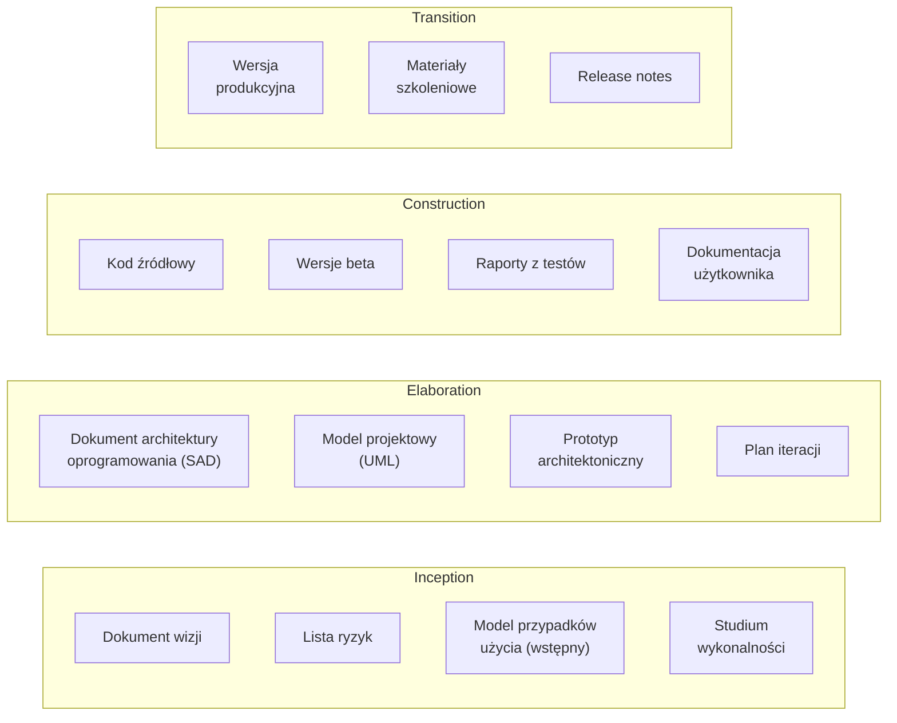
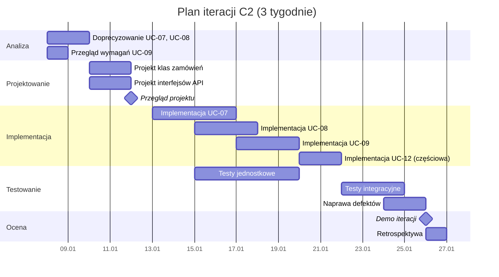
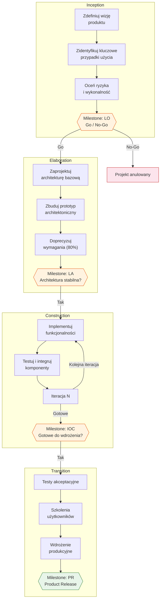

# Pytanie 12: Proszę krótko omówić wybraną formalną metodykę wytwarzania oprogramowania (np. RUP).

## Kluczowe pojęcia

- **RUP (Rational Unified Process)** — formalna, iteracyjno-przyrostowa metodyka wytwarzania oprogramowania opracowana przez firmę Rational Software (obecnie IBM) w latach 90. XX wieku. RUP definiuje kompletny framework procesu, obejmujący fazy, dyscypliny, role, artefakty i najlepsze praktyki. Metodyka jest oparta na UML i ściśle zintegrowana z narzędziami Rational (Rational Rose, ClearCase, RequisitePro). RUP jest konfigurowalny — organizacja może dostosować proces do swoich potrzeb, wybierając odpowiednie elementy.
- **Faza (Phase)** — główny etap cyklu życia projektu w RUP. Każda faza kończy się kamieniem milowym (milestone), w którym podejmowana jest decyzja go/no-go. RUP definiuje cztery fazy: Inception (rozpoczęcie), Elaboration (opracowanie), Construction (budowa) i Transition (przekazanie). Fazy są realizowane sekwencyjnie, ale wewnątrz każdej fazy praca odbywa się iteracyjnie.
- **Iteracja** — krótki cykl rozwojowy (typowo 2-6 tygodni) w ramach fazy, kończący się działającym przyrostem systemu. Każda iteracja obejmuje aktywności ze wszystkich dyscyplin (analiza, projektowanie, implementacja, testowanie), choć ich proporcje zmieniają się w zależności od fazy. Iteracyjność pozwala na wczesne wykrywanie ryzyk i ciągłą walidację z interesariuszami.
- **Dyscyplina (Discipline)** — logiczna grupa powiązanych aktywności w procesie RUP. RUP definiuje 9 dyscyplin: 6 inżynieryjnych (modelowanie biznesowe, wymagania, analiza i projektowanie, implementacja, testowanie, wdrożenie) oraz 3 wspierające (zarządzanie konfiguracją, zarządzanie projektem, środowisko). Dyscypliny przebiegają przez wszystkie fazy, ale z różną intensywnością.
- **Artefakt** — formalny produkt pracy w procesie RUP, tworzony lub modyfikowany w ramach aktywności. Przykłady artefaktów: dokument wizji, model przypadków użycia, model projektowy (UML), kod źródłowy, plan testów, plan iteracji. Artefakty są wersjonowane i podlegają zarządzaniu konfiguracją.
- **Rola (Role)** — zbiór powiązanych odpowiedzialności i umiejętności przypisanych osobie lub zespołowi w procesie RUP. Przykłady ról: analityk systemowy, architekt oprogramowania, programista, tester, kierownik projektu. Jedna osoba może pełnić wiele ról, a jedna rola może być realizowana przez wiele osób.
- **Kamień milowy (Milestone)** — punkt decyzyjny na końcu każdej fazy, w którym oceniany jest postęp projektu i podejmowana decyzja o kontynuacji. Kamienie milowe RUP: Lifecycle Objectives (LO), Lifecycle Architecture (LA), Initial Operational Capability (IOC), Product Release (PR).
- **Najlepsze praktyki RUP** — sześć fundamentalnych zasad leżących u podstaw metodyki: (1) iteracyjne wytwarzanie, (2) zarządzanie wymaganiami, (3) architektura komponentowa, (4) wizualne modelowanie (UML), (5) ciągła weryfikacja jakości, (6) zarządzanie zmianami.

## Struktura RUP — fazy i dyscypliny

### Dwuwymiarowa organizacja procesu

RUP organizuje proces wytwarzania w dwóch wymiarach:
- **Wymiar poziomy (czas)** — cztery fazy sekwencyjne, każda składająca się z jednej lub wielu iteracji
- **Wymiar pionowy (treść)** — dziewięć dyscyplin, realizowanych z różną intensywnością w każdej fazie

Ta dwuwymiarowa struktura jest kluczową cechą RUP — w każdej iteracji wykonywane są aktywności ze wszystkich dyscyplin, ale ich proporcje zmieniają się w miarę postępu projektu.

### Cztery fazy RUP

#### 1. Inception (Rozpoczęcie)

| Aspekt | Opis |
|---|---|
| **Cel** | Określenie zakresu projektu, wizji produktu i uzasadnienia biznesowego |
| **Kluczowe aktywności** | Analiza wykonalności, identyfikacja kluczowych przypadków użycia (10-20%), wstępna ocena ryzyk, oszacowanie kosztów |
| **Artefakty** | Dokument wizji, model przypadków użycia (wstępny), lista ryzyk, plan projektu (wstępny), studium wykonalności |
| **Kamień milowy** | **Lifecycle Objectives (LO)** — czy projekt ma sens biznesowy? Czy zakres jest zrozumiały? |
| **Typowy czas** | 1 iteracja (ok. 10% czasu projektu) |

#### 2. Elaboration (Opracowanie)

| Aspekt | Opis |
|---|---|
| **Cel** | Ustabilizowanie architektury systemu, eliminacja głównych ryzyk technicznych, doprecyzowanie wymagań |
| **Kluczowe aktywności** | Projektowanie architektury bazowej, prototypowanie architektoniczne, szczegółowa analiza wymagań (80%), implementacja szkieletu architektury |
| **Artefakty** | Model architektury (UML), prototyp architektoniczny, model przypadków użycia (szczegółowy), model projektowy, plan iteracji |
| **Kamień milowy** | **Lifecycle Architecture (LA)** — czy architektura jest stabilna? Czy główne ryzyka zostały wyeliminowane? |
| **Typowy czas** | 2-3 iteracje (ok. 30% czasu projektu) |

#### 3. Construction (Budowa)

| Aspekt | Opis |
|---|---|
| **Cel** | Implementacja pełnej funkcjonalności systemu na bazie ustalonej architektury |
| **Kluczowe aktywności** | Kodowanie, testowanie jednostkowe i integracyjne, integracja komponentów, dokumentacja użytkownika |
| **Artefakty** | Kod źródłowy, wersje beta systemu, dokumentacja użytkownika, raporty z testów |
| **Kamień milowy** | **Initial Operational Capability (IOC)** — czy system jest gotowy do wdrożenia pilotażowego? |
| **Typowy czas** | 3-5 iteracji (ok. 50% czasu projektu) |

#### 4. Transition (Przekazanie)

| Aspekt | Opis |
|---|---|
| **Cel** | Przekazanie systemu użytkownikom końcowym, wdrożenie produkcyjne |
| **Kluczowe aktywności** | Testy akceptacyjne, szkolenia użytkowników, wdrożenie, poprawki błędów, tuning wydajności |
| **Artefakty** | Wersja produkcyjna, materiały szkoleniowe, notatki wydania (release notes), raport końcowy |
| **Kamień milowy** | **Product Release (PR)** — czy system spełnia wymagania? Czy użytkownicy są zadowoleni? |
| **Typowy czas** | 1-2 iteracje (ok. 10% czasu projektu) |

### Dziewięć dyscyplin RUP

RUP definiuje 9 dyscyplin — 6 inżynieryjnych i 3 wspierające:

#### Dyscypliny inżynieryjne

1. **Modelowanie biznesowe (Business Modeling)** — zrozumienie procesów biznesowych organizacji, identyfikacja problemów i możliwości usprawnienia. Artefakty: model procesów biznesowych, słownik biznesowy.

2. **Wymagania (Requirements)** — pozyskiwanie, dokumentowanie i zarządzanie wymaganiami. Artefakty: dokument wizji, model przypadków użycia, specyfikacja wymagań dodatkowych.

3. **Analiza i projektowanie (Analysis & Design)** — transformacja wymagań w architekturę i projekt systemu. Artefakty: model projektowy (diagramy klas, sekwencji, stanów UML), dokument architektury oprogramowania (SAD).

4. **Implementacja (Implementation)** — kodowanie, testowanie jednostkowe, integracja komponentów. Artefakty: kod źródłowy, komponenty, podsystemy.

5. **Testowanie (Test)** — weryfikacja i walidacja systemu na różnych poziomach. Artefakty: plan testów, przypadki testowe, raporty z testów, defekty.

6. **Wdrożenie (Deployment)** — dostarczenie systemu użytkownikom końcowym. Artefakty: plan wdrożenia, materiały szkoleniowe, notatki wydania.

#### Dyscypliny wspierające

7. **Zarządzanie konfiguracją i zmianami (Configuration & Change Management)** — kontrola wersji artefaktów, zarządzanie zmianami i zgłoszeniami. Narzędzia: Rational ClearCase, ClearQuest.

8. **Zarządzanie projektem (Project Management)** — planowanie iteracji, monitorowanie postępu, zarządzanie ryzykami. Artefakty: plan projektu, plan iteracji, lista ryzyk, raport statusu.

9. **Środowisko (Environment)** — konfiguracja narzędzi, procesów i infrastruktury dla zespołu. Artefakty: wytyczne projektowe, szablony artefaktów, konfiguracja narzędzi.

## Role w RUP

RUP definiuje ponad 30 ról pogrupowanych według dyscyplin. Najważniejsze role:

| Rola | Odpowiedzialność | Dyscyplina |
|---|---|---|
| **Analityk systemowy** | Identyfikacja i dokumentowanie wymagań, modelowanie przypadków użycia | Wymagania |
| **Architekt oprogramowania** | Projektowanie architektury, podejmowanie kluczowych decyzji technicznych | Analiza i projektowanie |
| **Projektant** | Szczegółowy projekt klas, interfejsów i komponentów | Analiza i projektowanie |
| **Programista** | Implementacja kodu, testy jednostkowe | Implementacja |
| **Tester** | Planowanie i wykonywanie testów, raportowanie defektów | Testowanie |
| **Kierownik projektu** | Planowanie, monitorowanie, zarządzanie ryzykami i zasobami | Zarządzanie projektem |
| **Kierownik konfiguracji** | Zarządzanie wersjami, bazami kodu, procesem zmian | Zarządzanie konfiguracją |
| **Analityk biznesowy** | Modelowanie procesów biznesowych, identyfikacja potrzeb | Modelowanie biznesowe |

## Artefakty RUP

### Kluczowe artefakty według faz

### Hierarchia artefaktów

| Kategoria | Artefakty | Format |
|---|---|---|
| **Zarządcze** | Plan projektu, plan iteracji, lista ryzyk, raport statusu | Dokumenty tekstowe |
| **Wymaganiowe** | Dokument wizji, model przypadków użycia, specyfikacja wymagań dodatkowych, słownik | UML + tekst |
| **Projektowe** | Model projektowy, dokument architektury (SAD), model danych | Diagramy UML |
| **Implementacyjne** | Kod źródłowy, komponenty, skrypty budowania | Pliki kodu |
| **Testowe** | Plan testów, przypadki testowe, raporty z testów, defekty | Dokumenty + narzędzia |
| **Wdrożeniowe** | Plan wdrożenia, materiały szkoleniowe, notatki wydania | Dokumenty + pakiety |

## Sześć najlepszych praktyk RUP

RUP opiera się na sześciu fundamentalnych najlepszych praktykach, które stanowią filozofię metodyki:

### 1. Iteracyjne wytwarzanie oprogramowania (Develop Iteratively)

Zamiast jednorazowego przejścia przez fazy (jak w modelu kaskadowym), RUP dzieli projekt na krótkie iteracje. Każda iteracja produkuje działający przyrost systemu, co pozwala na:
- Wczesne wykrywanie i eliminację ryzyk
- Ciągłą walidację z interesariuszami
- Adaptację do zmieniających się wymagań

### 2. Zarządzanie wymaganiami (Manage Requirements)

Wymagania są aktywnie zarządzane przez cały cykl życia projektu:
- Systematyczne pozyskiwanie i dokumentowanie wymagań
- Śledzenie powiązań (traceability) między wymaganiami a artefaktami
- Zarządzanie zmianami wymagań z oceną wpływu

### 3. Architektura komponentowa (Use Component-Based Architectures)

System jest projektowany jako zbiór luźno powiązanych komponentów:
- Ponowne użycie istniejących komponentów
- Modularność ułatwiająca równoległą pracę zespołów
- Łatwiejsze testowanie i utrzymanie

### 4. Wizualne modelowanie (Model Visually)

UML jest podstawowym narzędziem komunikacji i dokumentacji:
- Diagramy klas, sekwencji, stanów, aktywności
- Modele jako formalne specyfikacje (nie tylko szkice)
- Automatyczna generacja kodu z modeli (MDA)

### 5. Ciągła weryfikacja jakości (Verify Quality Continuously)

Jakość jest weryfikowana w każdej iteracji, nie tylko na końcu projektu:
- Testy jednostkowe, integracyjne, systemowe, akceptacyjne
- Przeglądy kodu i inspekcje
- Metryki jakości (pokrycie testami, gęstość defektów)

### 6. Zarządzanie zmianami (Manage Change)

Zmiany w artefaktach są kontrolowane i śledzone:
- System kontroli wersji (Rational ClearCase)
- Proces zarządzania zmianami (Change Request)
- Śledzenie wpływu zmian na inne artefakty

## Porównanie RUP z metodykami Agile

### Podobieństwa

RUP i metodyki Agile (np. Scrum, XP) mają wspólne korzenie w podejściu iteracyjnym:

| Cecha wspólna | RUP | Agile (Scrum) |
|---|---|---|
| Iteracyjność | ✅ Iteracje 2-6 tygodni | ✅ Sprinty 1-4 tygodnie |
| Przyrostowość | ✅ Działający przyrost po iteracji | ✅ Potencjalnie wdrażalny przyrost |
| Adaptacja do zmian | ✅ Zarządzanie zmianami | ✅ Reagowanie na zmiany |
| Współpraca z klientem | ✅ Walidacja na kamieniach milowych | ✅ Ciągła współpraca |

### Różnice

| Aspekt | RUP | Agile (Scrum) |
|---|---|---|
| **Formalność** | Wysoka — rozbudowana dokumentacja, formalne role i artefakty | Niska — minimalna dokumentacja, elastyczne role |
| **Dokumentacja** | Obszerny zestaw artefaktów (>100 typów) | Minimalna — „działający software ponad dokumentację" |
| **Planowanie** | Szczegółowe planowanie z góry (plan projektu, plan iteracji) | Planowanie adaptacyjne (sprint planning, backlog) |
| **Architektura** | Architektura ustalana w fazie Elaboration | Architektura emergentna, ewoluująca |
| **Rozmiar zespołu** | Duże zespoły (10-100+ osób) | Małe zespoły (5-9 osób) |
| **Skalowalność** | Zaprojektowany dla dużych projektów enterprise | Wymaga frameworków skalowania (SAFe, LeSS) |
| **Narzędzia** | Ścisła integracja z narzędziami Rational/IBM | Narzędzia lekkie (Jira, Trello) |
| **Konfigurowalność** | Proces konfigurowalny — można wybrać podzbiór elementów | Proces lekki — mniej do konfiguracji |
| **Certyfikacja** | Formalne kamienie milowe z decyzją go/no-go | Przegląd sprintu (Sprint Review) |
| **Ryzyka** | Formalna lista ryzyk, eliminacja w Elaboration | Ryzyka zarządzane przez Product Ownera i zespół |

### Kiedy wybrać RUP, a kiedy Agile?

| Scenariusz | Rekomendacja |
|---|---|
| Duży projekt enterprise (>20 osób) | ✅ RUP |
| Projekt z rygorystycznymi wymaganiami regulacyjnymi | ✅ RUP |
| Mały zespół, szybko zmieniające się wymagania | ✅ Agile |
| Startup, MVP, prototyp | ✅ Agile |
| Projekt wymagający obszernej dokumentacji (np. obronność, medycyna) | ✅ RUP |
| Projekt z dobrze zdefiniowaną architekturą | ⚠️ Oba podejścia |
| Organizacja z dojrzałymi procesami | ✅ RUP |
| Organizacja rozpoczynająca transformację procesową | ✅ Agile (prostszy start) |

## Przykłady

### Diagram faz RUP z intensywnością dyscyplin

Poniższy diagram ilustruje dwuwymiarową strukturę RUP — fazy (oś pozioma) i dyscypliny (oś pionowa) z zaznaczeniem intensywności prac:

```mermaid
gantt
    title Intensywność dyscyplin w fazach RUP
    dateFormat  X
    axisFormat %s

    section Modelowanie biznesowe
    Inception           :active, mb1, 0, 3
    Elaboration         :mb2, 3, 5
    Construction        :mb3, 5, 6
    Transition          :mb4, 6, 7

    section Wymagania
    Inception           :active, req1, 0, 4
    Elaboration         :active, req2, 4, 8
    Construction        :req3, 8, 10
    Transition          :req4, 10, 11

    section Analiza i projektowanie
    Inception           :ad1, 0, 2
    Elaboration         :active, ad2, 2, 8
    Construction        :ad3, 8, 11
    Transition          :ad4, 11, 12

    section Implementacja
    Inception           :imp1, 0, 1
    Elaboration         :imp2, 1, 4
    Construction        :active, imp3, 4, 11
    Transition          :imp4, 11, 12

    section Testowanie
    Inception           :t1, 0, 1
    Elaboration         :t2, 1, 4
    Construction        :active, t3, 4, 11
    Transition          :active, t4, 11, 13

    section Wdrożenie
    Inception           :d1, 0, 0
    Elaboration         :d2, 0, 1
    Construction        :d3, 1, 3
    Transition          :active, d4, 3, 7
```

### Przykładowy plan iteracji (faza Construction, iteracja C2)

Poniżej przedstawiono przykładowy plan jednej iteracji w fazie Construction dla systemu e-commerce:

**Iteracja C2 — System zarządzania zamówieniami**

| Element | Szczegóły |
|---|---|
| **Faza** | Construction |
| **Numer iteracji** | C2 (5. iteracja projektu) |
| **Czas trwania** | 3 tygodnie |
| **Cel iteracji** | Implementacja modułu składania i przetwarzania zamówień |

**Przypadki użycia realizowane w iteracji:**

| Przypadek użycia | Priorytet | Status |
|---|---|---|
| UC-07: Złóż zamówienie | Wysoki | Do implementacji |
| UC-08: Anuluj zamówienie | Wysoki | Do implementacji |
| UC-09: Śledź status zamówienia | Średni | Do implementacji |
| UC-12: Generuj raport zamówień | Niski | Częściowa implementacja |

**Harmonogram iteracji:**

**Kryteria zakończenia iteracji:**
- Wszystkie przypadki użycia o wysokim priorytecie zaimplementowane i przetestowane
- Pokrycie testami jednostkowymi ≥ 80%
- Brak defektów krytycznych (severity 1-2)
- Pomyślna integracja z modułami z poprzednich iteracji
- Demo zaakceptowane przez interesariuszy

### Przepływ procesu RUP — od wizji do wdrożenia

## Podsumowanie

1. **RUP (Rational Unified Process)** to formalna, iteracyjno-przyrostowa metodyka wytwarzania oprogramowania opracowana przez Rational Software (IBM). Definiuje kompletny framework procesu z fazami, dyscyplinami, rolami, artefaktami i najlepszymi praktykami.

2. **Struktura RUP jest dwuwymiarowa** — wymiar czasowy obejmuje cztery fazy (Inception → Elaboration → Construction → Transition), a wymiar treściowy obejmuje dziewięć dyscyplin (od modelowania biznesowego po zarządzanie środowiskiem). Każda iteracja realizuje aktywności ze wszystkich dyscyplin, ale z różną intensywnością.

3. **Cztery fazy RUP** kończą się kamieniami milowymi z decyzją go/no-go: Inception (LO — cele cyklu życia), Elaboration (LA — architektura cyklu życia), Construction (IOC — początkowa zdolność operacyjna), Transition (PR — wydanie produktu).

4. **Sześć najlepszych praktyk RUP** to: iteracyjne wytwarzanie, zarządzanie wymaganiami, architektura komponentowa, wizualne modelowanie (UML), ciągła weryfikacja jakości i zarządzanie zmianami.

5. **RUP jest konfigurowalny** — organizacja może dostosować proces do swoich potrzeb, wybierając odpowiedni podzbiór ról, artefaktów i aktywności. Nie jest to sztywna metodyka, lecz framework procesowy.

6. **W porównaniu z metodykami Agile**, RUP jest bardziej formalny, wymaga obszerniejszej dokumentacji i jest lepiej przystosowany do dużych projektów enterprise. Agile jest lżejszy i bardziej elastyczny, ale wymaga frameworków skalowania (SAFe, LeSS) dla dużych zespołów.

7. **RUP opiera się na UML** jako podstawowym narzędziu modelowania i jest ściśle zintegrowany z narzędziami IBM Rational (Rose, ClearCase, RequisitePro), co zapewnia spójność procesu, ale może prowadzić do vendor lock-in.

## Powiązane pytania

- [Pytanie 10: Proszę wyjaśnić zasady procesu wytwarzania oprogramowania sterowanego modelami.](10-mda-mdd.md)
- [Pytanie 33: Proszę omówić kierunki (nowe technologie i metodyki) mające na celu zwiększenie efektywności tworzenia systemów oprogramowania.](33-efektywnosc-tworzenia-systemow.md)
