# Pytanie 13: Proszę wymienić i opisać składnię i znaczenie (semantykę) poszczególnych składników modelu interakcji (diagramy sekwencji).

## Kluczowe pojęcia

- **Diagram sekwencji (Sequence Diagram)** — jeden z diagramów interakcji w UML, przedstawiający wymianę komunikatów między obiektami (uczestnikami) w określonym porządku czasowym. Oś pionowa reprezentuje upływ czasu (z góry na dół), a oś pozioma — uczestników interakcji. Diagram sekwencji jest najczęściej używanym diagramem interakcji w praktyce inżynierii oprogramowania, szczególnie do modelowania scenariuszy przypadków użycia.
- **Linia życia (Lifeline)** — pionowa linia przerywana biegnąca od prostokąta uczestnika w dół diagramu, reprezentująca istnienie obiektu w czasie. Na szczycie linii życia znajduje się prostokąt z nazwą uczestnika w formacie `obiekt:Klasa` lub `:Klasa` (obiekt anonimowy). Linia życia może być zakończona symbolem „X" oznaczającym zniszczenie obiektu.
- **Komunikat (Message)** — strzałka między liniami życia reprezentująca interakcję (wywołanie operacji, wysłanie sygnału, odpowiedź). Komunikaty są podstawowym elementem diagramu sekwencji i mogą być synchroniczne, asynchroniczne, zwrotne lub reprezentować tworzenie/niszczenie obiektów. Każdy komunikat ma nazwę (zazwyczaj odpowiadającą nazwie operacji) i opcjonalne argumenty.
- **Komunikat synchroniczny (Synchronous Message)** — komunikat reprezentowany przez strzałkę z wypełnionym grotem (▶), oznaczający wywołanie operacji, w którym nadawca czeka na odpowiedź (blokuje się) do momentu zakończenia przetwarzania przez odbiorcę. Jest to najczęstszy typ komunikatu, odpowiadający wywołaniu metody w programowaniu obiektowym.
- **Komunikat asynchroniczny (Asynchronous Message)** — komunikat reprezentowany przez strzałkę z otwartym grotem (▷), oznaczający wysłanie sygnału lub komunikatu, po którym nadawca kontynuuje działanie bez oczekiwania na odpowiedź. Stosowany w modelowaniu systemów współbieżnych, komunikacji przez kolejki wiadomości, zdarzeń i sygnałów.
- **Komunikat zwrotny (Return Message)** — komunikat reprezentowany przez strzałkę przerywaną (- - - ▷), oznaczający odpowiedź na wcześniejszy komunikat synchroniczny. Zawiera wartość zwracaną przez operację. Komunikaty zwrotne są opcjonalne na diagramie — mogą być pominięte, gdy kontekst jest oczywisty.
- **Pasek aktywacji (Execution Specification / Activation Bar)** — wąski prostokąt nałożony na linię życia, oznaczający okres, w którym obiekt wykonuje operację (jest aktywny). Pasek aktywacji zaczyna się w momencie otrzymania komunikatu i kończy w momencie wysłania odpowiedzi. Zagnieżdżone paski aktywacji oznaczają wywołania rekurencyjne lub wywołania własnych metod.
- **Fragment kombinowany (Combined Fragment)** — prostokątny obszar na diagramie sekwencji z etykietą operatora interakcji (np. `alt`, `loop`, `opt`, `par`), definiujący złożoną logikę sterowania przepływem komunikatów. Fragment kombinowany składa się z jednego lub wielu operandów interakcji oddzielonych linią przerywaną. Pozwala modelować warunki, pętle, współbieżność i inne wzorce sterowania.
- **Operand interakcji (Interaction Operand)** — sekcja wewnątrz fragmentu kombinowanego, zawierająca warunek strażnika (guard condition) w nawiasach kwadratowych `[warunek]` oraz sekwencję komunikatów. Np. w fragmencie `alt` każdy operand odpowiada jednej gałęzi warunkowej.
- **Brama (Gate)** — punkt na ramce diagramu sekwencji, przez który komunikat wchodzi do interakcji lub z niej wychodzi. Bramy umożliwiają łączenie diagramów sekwencji i definiowanie interfejsów interakcji.
- **Odwołanie do interakcji (Interaction Use / ref)** — prostokąt z etykietą `ref` i nazwą innej interakcji, reprezentujący odwołanie do osobnego diagramu sekwencji. Pozwala na dekompozycję złożonych scenariuszy na mniejsze, wielokrotnie używane fragmenty.

## Elementy diagramu sekwencji

### Uczestnicy (Participants)

Uczestnicy interakcji są reprezentowani jako prostokąty na górze diagramu. Każdy uczestnik posiada:

| Element | Składnia | Znaczenie |
|---|---|---|
| **Nazwa obiektu** | `obiekt:Klasa` | Konkretna instancja klasy |
| **Obiekt anonimowy** | `:Klasa` | Dowolna instancja danej klasy |
| **Aktor** | ikona ludzika + nazwa | Użytkownik lub system zewnętrzny |
| **Komponent** | `<<component>> Nazwa` | Komponent systemu |

Kolejność uczestników na osi poziomej nie ma formalnego znaczenia semantycznego, ale konwencja nakazuje umieszczać inicjatora interakcji po lewej stronie, a kolejnych uczestników w porządku pierwszego wystąpienia.

### Linie życia i czas

Linia życia biegnie pionowo od prostokąta uczestnika w dół. Czas płynie z góry na dół — komunikaty wyżej na diagramie zachodzą wcześniej niż komunikaty niżej. Linia życia może być zakończona na dwa sposoby:

- **Naturalne zakończenie** — linia życia kończy się na dole diagramu (obiekt istnieje przez cały czas trwania interakcji)
- **Zniszczenie obiektu** — linia życia kończy się symbolem „X" (krzyżyk), oznaczającym, że obiekt został zniszczony w tym momencie

### Pasek aktywacji (Execution Specification)

Pasek aktywacji to wąski prostokąt na linii życia, wskazujący okres aktywnego przetwarzania:

- Rozpoczyna się w momencie otrzymania komunikatu
- Kończy się w momencie wysłania komunikatu zwrotnego
- Może być zagnieżdżony (pasek na pasku) — oznacza wywołanie własnej metody lub rekurencję
- Szerokość paska nie ma znaczenia semantycznego

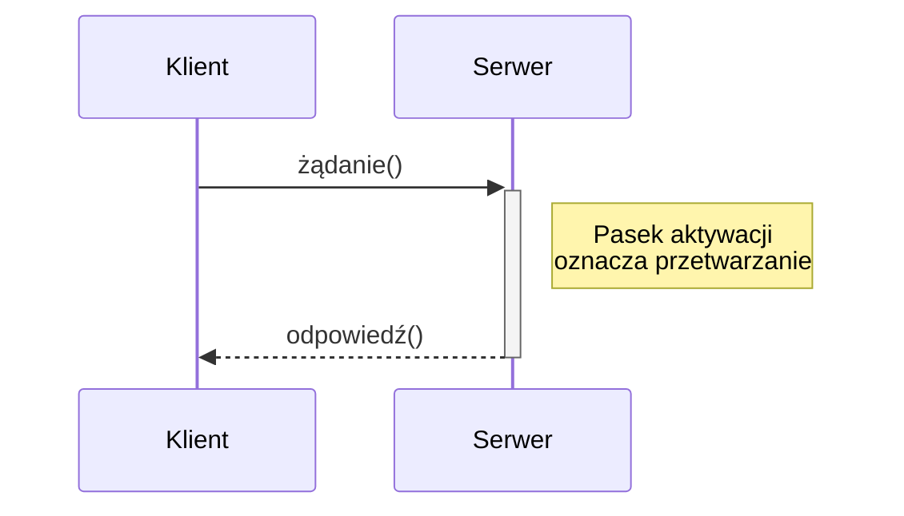

## Typy komunikatów

### Przegląd typów komunikatów

| Typ komunikatu | Notacja strzałki | Opis | Przykład |
|---|---|---|---|
| **Synchroniczny** | `─────▶` (wypełniony grot) | Wywołanie z oczekiwaniem na odpowiedź | Wywołanie metody |
| **Asynchroniczny** | `─────▷` (otwarty grot) | Wysłanie bez oczekiwania | Wysłanie zdarzenia |
| **Zwrotny** | `- - - ▷` (przerywana) | Odpowiedź na komunikat synchroniczny | Wartość zwracana |
| **Tworzenie** | `─────▶` do nowego prostokąta | Utworzenie nowego obiektu | `<<create>>` / `new` |
| **Niszczenie** | `─────▶` + „X" na linii życia | Zniszczenie obiektu | `<<destroy>>` |
| **Znaleziony (found)** | `○─────▶` (kółko po lewej) | Komunikat z nieznanego źródła | Zdarzenie zewnętrzne |
| **Zagubiony (lost)** | `─────▶○` (kółko po prawej) | Komunikat do nieznanego odbiorcy | Wysłanie logu |
| **Do siebie (self)** | strzałka zwrotna na tej samej linii życia | Wywołanie własnej metody | Metoda prywatna |

### Komunikat synchroniczny

Komunikat synchroniczny jest najczęściej stosowanym typem. Nadawca wysyła komunikat i blokuje się (czeka) do momentu otrzymania odpowiedzi. Odpowiada wywołaniu metody w programowaniu obiektowym.

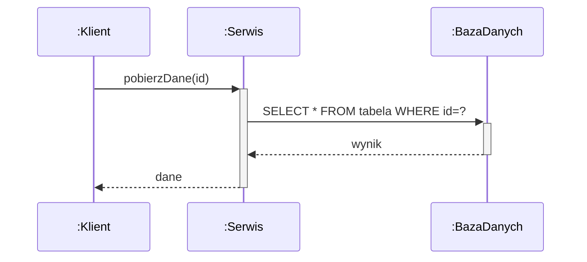

### Komunikat asynchroniczny

Komunikat asynchroniczny oznacza, że nadawca kontynuuje działanie natychmiast po wysłaniu, nie czekając na odpowiedź. Stosowany w systemach zdarzeniowych, kolejkach wiadomości i komunikacji współbieżnej.

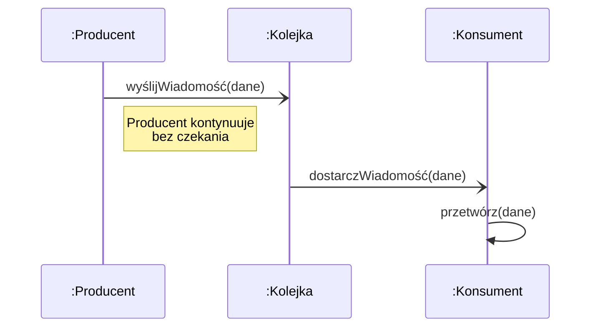

### Komunikat tworzenia i niszczenia obiektu

Komunikat tworzenia (`<<create>>`) kierowany jest do nowo tworzonego obiektu — prostokąt uczestnika pojawia się na poziomie komunikatu, a nie na górze diagramu. Komunikat niszczenia (`<<destroy>>`) kończy linię życia obiektu symbolem „X".

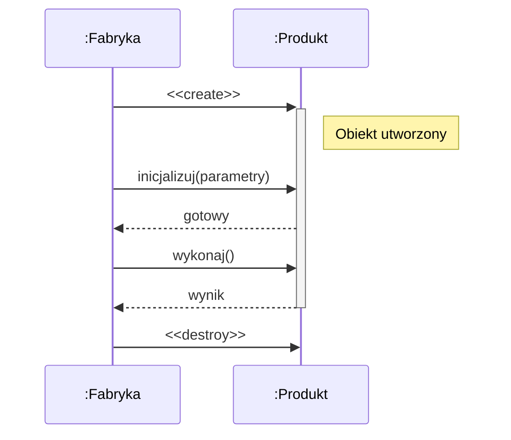

## Fragmenty kombinowane

### Przegląd operatorów interakcji

Fragmenty kombinowane pozwalają modelować złożoną logikę sterowania na diagramie sekwencji. Każdy fragment jest oznaczony operatorem interakcji w lewym górnym rogu:

| Operator | Nazwa | Znaczenie | Liczba operandów |
|---|---|---|---|
| **alt** | Alternative | Rozgałęzienie warunkowe (if-else) | ≥ 2 |
| **opt** | Option | Opcjonalne wykonanie (if bez else) | 1 |
| **loop** | Loop | Pętla z warunkiem | 1 |
| **break** | Break | Przerwanie otaczającej interakcji | 1 |
| **par** | Parallel | Wykonanie równoległe | ≥ 2 |
| **seq** | Weak Sequencing | Słabe uporządkowanie | ≥ 2 |
| **strict** | Strict Sequencing | Ścisłe uporządkowanie | ≥ 2 |
| **critical** | Critical Region | Region krytyczny (niepodzielny) | 1 |
| **neg** | Negative | Scenariusz niedozwolony | 1 |
| **ignore** | Ignore | Komunikaty do zignorowania | 1 |
| **consider** | Consider | Komunikaty do uwzględnienia | 1 |
| **assert** | Assertion | Jedyny dopuszczalny scenariusz | 1 |
| **ref** | Interaction Use | Odwołanie do innej interakcji | 1 |

### Fragment `alt` (Alternative)

Fragment `alt` modeluje rozgałęzienie warunkowe — odpowiednik instrukcji `if-else`. Zawiera co najmniej dwa operandy oddzielone linią przerywaną, każdy z warunkiem strażnika `[warunek]`. Wykonywany jest operand, którego warunek jest spełniony. Warunek `[else]` oznacza domyślną gałąź.

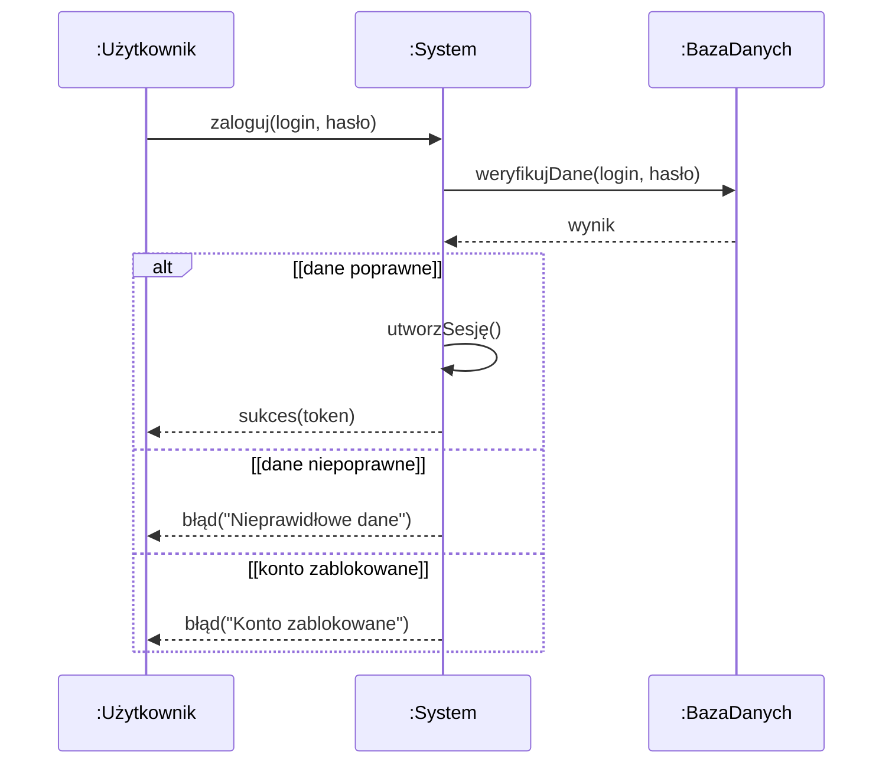

### Fragment `opt` (Option)

Fragment `opt` modeluje opcjonalne wykonanie — odpowiednik instrukcji `if` bez `else`. Zawiera jeden operand z warunkiem strażnika. Jeśli warunek jest spełniony, komunikaty wewnątrz fragmentu są wykonywane; w przeciwnym razie fragment jest pomijany.

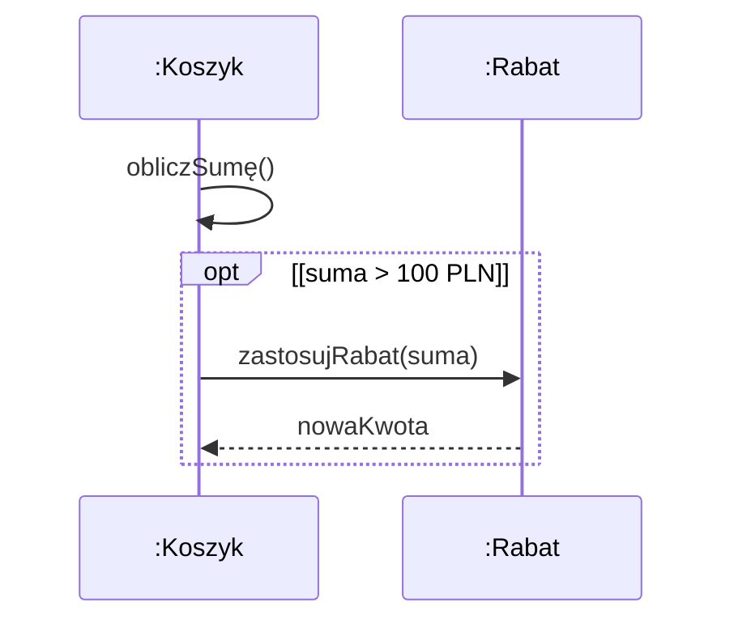

### Fragment `loop` (Loop)

Fragment `loop` modeluje pętlę. Warunek strażnika określa, kiedy pętla kontynuuje iteracje. Opcjonalnie można podać minimalną i maksymalną liczbę iteracji w formacie `loop(min, max)` lub `loop [warunek]`.

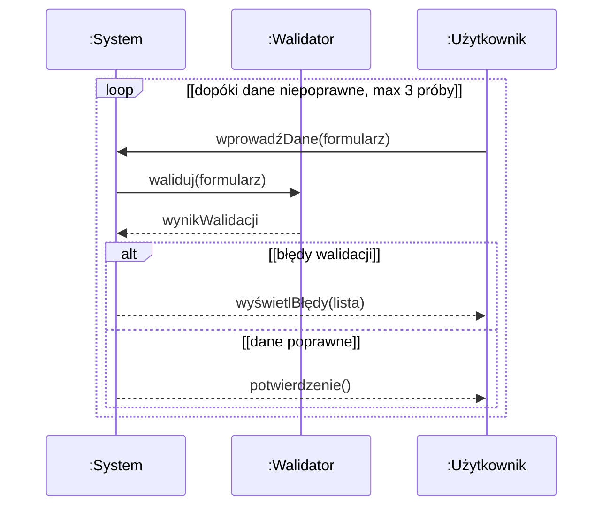

### Fragment `par` (Parallel)

Fragment `par` modeluje wykonanie równoległe — operandy są realizowane współbieżnie. Kolejność komunikatów między operandami jest nieokreślona, ale kolejność wewnątrz każdego operandu jest zachowana.

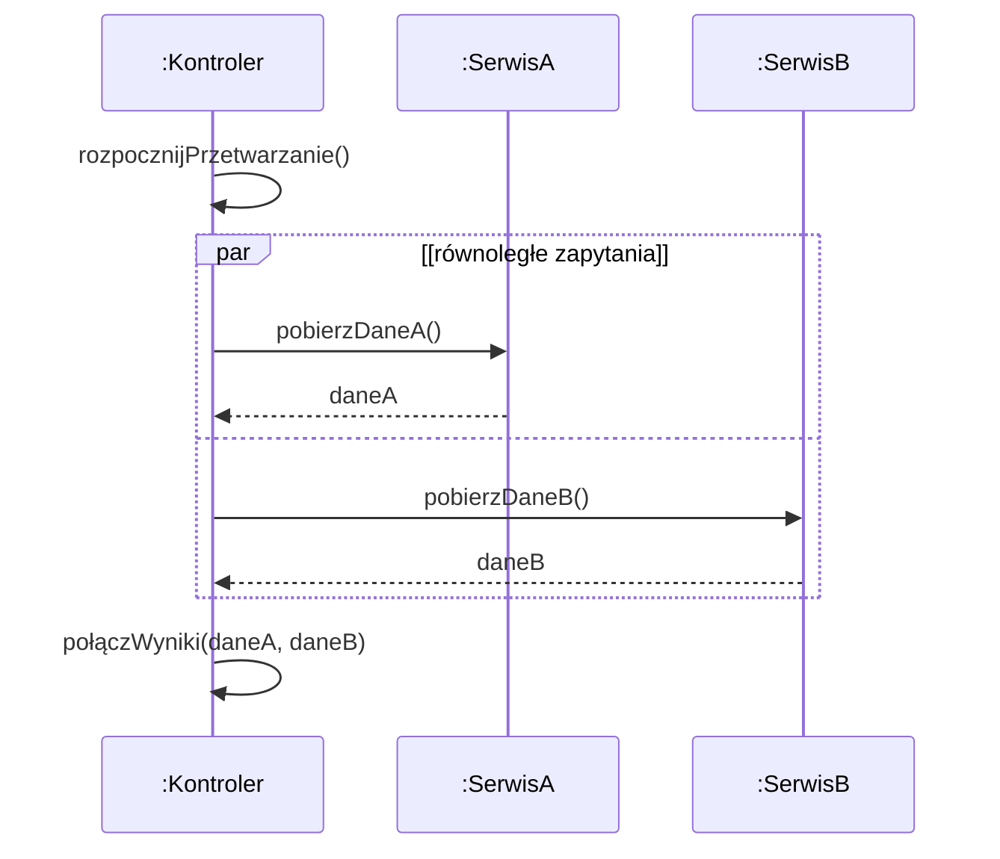

### Fragment `break` (Break)

Fragment `break` modeluje przerwanie otaczającej interakcji — jeśli warunek strażnika jest spełniony, wykonywane są komunikaty wewnątrz fragmentu `break`, a następnie reszta otaczającej interakcji jest pomijana. Odpowiada instrukcji `break` w pętli lub wczesnemu wyjściu z funkcji.

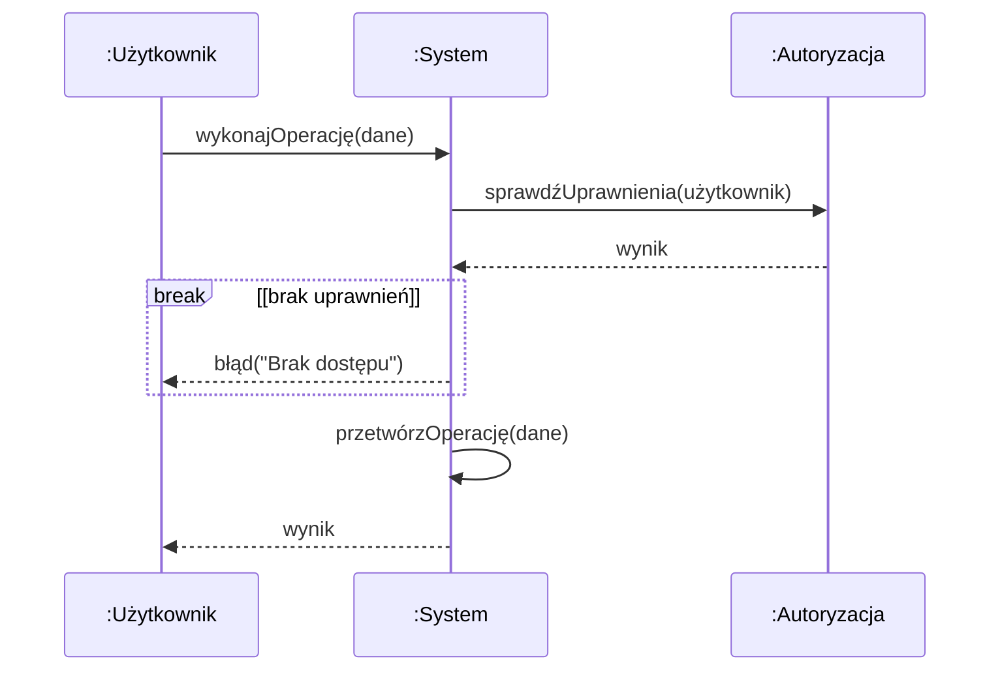

### Fragment `ref` (Interaction Use)

Fragment `ref` pozwala odwołać się do innej interakcji (innego diagramu sekwencji), co umożliwia dekompozycję złożonych scenariuszy i ponowne użycie fragmentów interakcji.

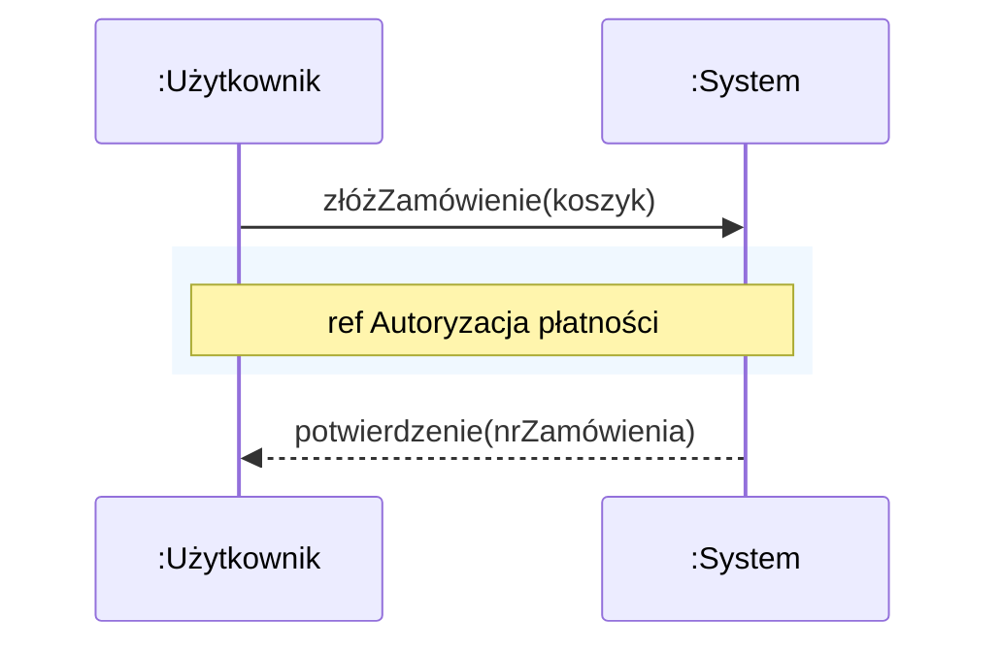

## Operatory interakcji — szczegóły semantyczne

### Operatory porządkowania

| Operator | Semantyka |
|---|---|
| **seq** | Słabe uporządkowanie — komunikaty na tej samej linii życia zachowują kolejność, ale komunikaty na różnych liniach życia mogą być przeplecione |
| **strict** | Ścisłe uporządkowanie — wszystkie komunikaty we wszystkich operandach zachowują globalną kolejność (operand 1 przed operandem 2) |

### Operatory filtrowania

| Operator | Semantyka |
|---|---|
| **ignore** | Komunikaty wymienione w klauzuli `ignore {msg1, msg2}` są pomijane (nie mają znaczenia w tej interakcji) |
| **consider** | Tylko komunikaty wymienione w klauzuli `consider {msg1, msg2}` są istotne (reszta jest ignorowana) |

### Operatory asercji

| Operator | Semantyka |
|---|---|
| **assert** | Interakcja wewnątrz fragmentu jest jedynym dopuszczalnym zachowaniem — każde inne zachowanie jest błędem |
| **neg** | Interakcja wewnątrz fragmentu jest niedozwolona — jeśli wystąpi, oznacza błąd systemu |

### Region krytyczny (`critical`)

Fragment `critical` oznacza region krytyczny — sekwencja komunikatów wewnątrz fragmentu musi być wykonana atomowo (niepodzielnie), bez przeplotu z innymi współbieżnymi komunikatami. Stosowany w modelowaniu synchronizacji i sekcji krytycznych.

## Przykłady

### Kompletny diagram sekwencji — scenariusz logowania

Poniższy diagram przedstawia pełny scenariusz logowania użytkownika do systemu, wykorzystujący różne elementy diagramu sekwencji: komunikaty synchroniczne i zwrotne, fragmenty `alt`, `opt`, `loop` oraz pasek aktywacji.

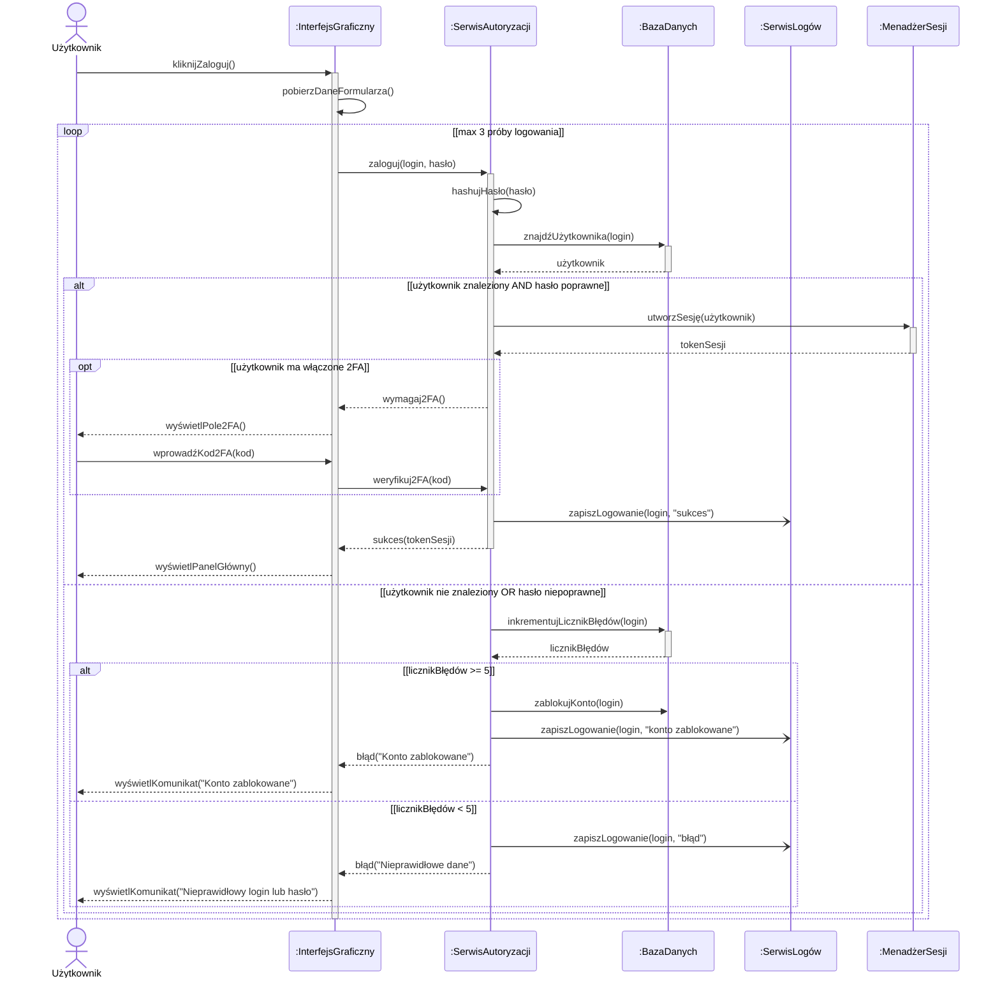

### Diagram sekwencji — wzorzec Observer

Przykład diagramu sekwencji ilustrującego wzorzec projektowy Observer z komunikatami asynchronicznymi:

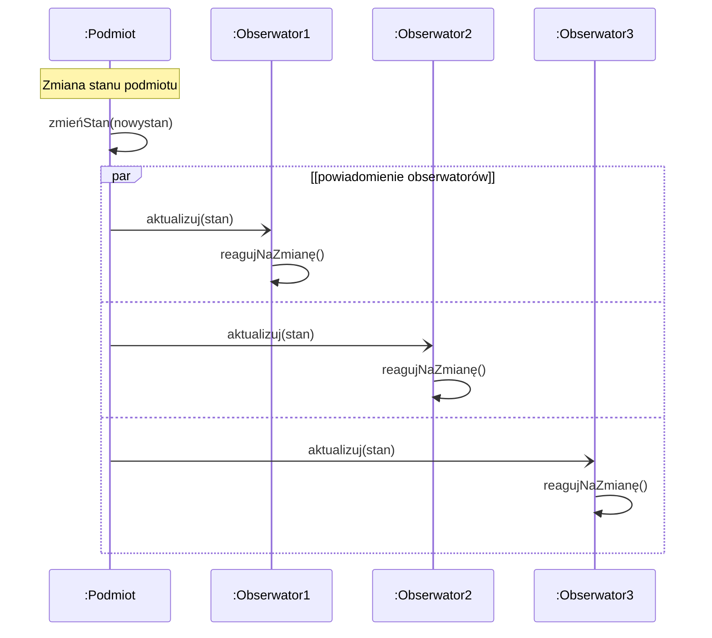

### Diagram sekwencji — tworzenie i niszczenie obiektów

```mermaid
sequenceDiagram
    participant K as :Klient
    participant F as :Fabryka
    participant P as :Połączenie
    participant DB as :BazaDanych

    K->>F: utwórzPołączenie(config)
    create participant P
    F->>P: <<create>>(config)
    F-->>K: połączenie

    K->>+P: wykonajZapytanie(sql)
    P->>+DB: wyślijSQL(sql)
    DB-->>-P: wynik
    P-->>-K: dane

    K->>P: zamknij()
    destroy P
    P->>P: zwolnijZasoby()
```

## Podsumowanie

1. **Diagram sekwencji** jest najczęściej używanym diagramem interakcji w UML. Przedstawia wymianę komunikatów między uczestnikami w porządku czasowym (oś pionowa — czas, oś pozioma — uczestnicy).

2. **Linia życia** reprezentuje istnienie obiektu w czasie. Na jej szczycie znajduje się prostokąt z nazwą uczestnika (`obiekt:Klasa`), a zakończenie symbolem „X" oznacza zniszczenie obiektu.

3. **Komunikaty** dzielą się na: synchroniczne (wypełniony grot — nadawca czeka na odpowiedź), asynchroniczne (otwarty grot — nadawca kontynuuje bez czekania), zwrotne (linia przerywana — odpowiedź na komunikat synchroniczny) oraz komunikaty tworzenia i niszczenia obiektów.

4. **Pasek aktywacji** (execution specification) to wąski prostokąt na linii życia, oznaczający okres aktywnego przetwarzania przez obiekt. Zagnieżdżone paski oznaczają wywołania rekurencyjne lub wywołania własnych metod.

5. **Fragmenty kombinowane** pozwalają modelować złożoną logikę sterowania: `alt` (rozgałęzienie warunkowe if-else), `opt` (opcjonalne wykonanie if), `loop` (pętla), `par` (wykonanie równoległe), `break` (przerwanie interakcji), `critical` (region krytyczny).

6. **Operatory interakcji** obejmują również: `seq`/`strict` (porządkowanie), `ignore`/`consider` (filtrowanie komunikatów), `assert`/`neg` (asercje poprawności) oraz `ref` (odwołanie do innej interakcji).

7. **Warunki strażnika** (guard conditions) w nawiasach kwadratowych `[warunek]` określają, kiedy dany operand fragmentu kombinowanego jest wykonywany. Warunek `[else]` oznacza gałąź domyślną.

8. **Odwołania do interakcji** (`ref`) umożliwiają dekompozycję złożonych scenariuszy na mniejsze, wielokrotnie używane fragmenty, co poprawia czytelność i modularność diagramów.

## Powiązane pytania

- [Pytanie 11: Proszę określić kilka przykładowych reguł transformacji modeli dla wybranych języków modelowania (np. RSL i UML).](11-reguly-transformacji-rsl-uml.md)
- [Pytanie 14: Proszę opisać zasady tworzenia i transformacji modeli (np. w językach RSL i UML) oraz generacji kodu dla wybranych narzędzi CASE.](14-narzedzia-case-generacja-kodu.md)
