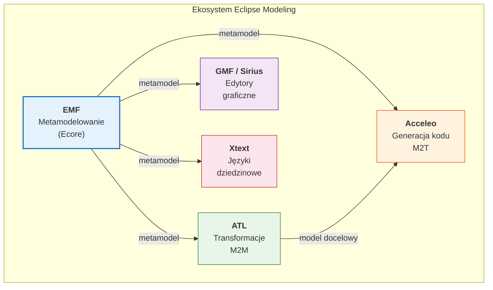
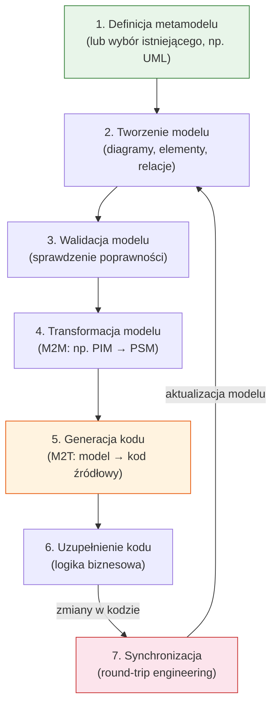
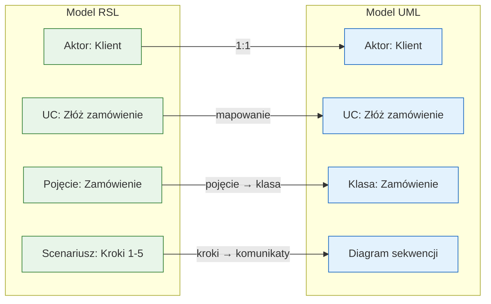
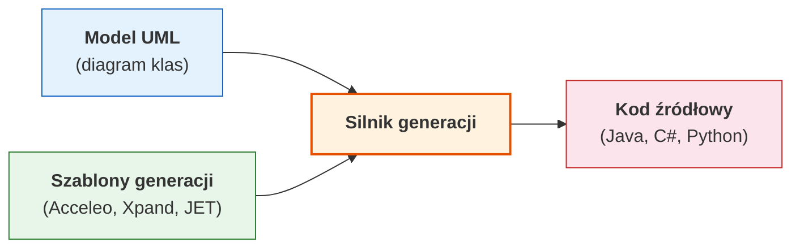
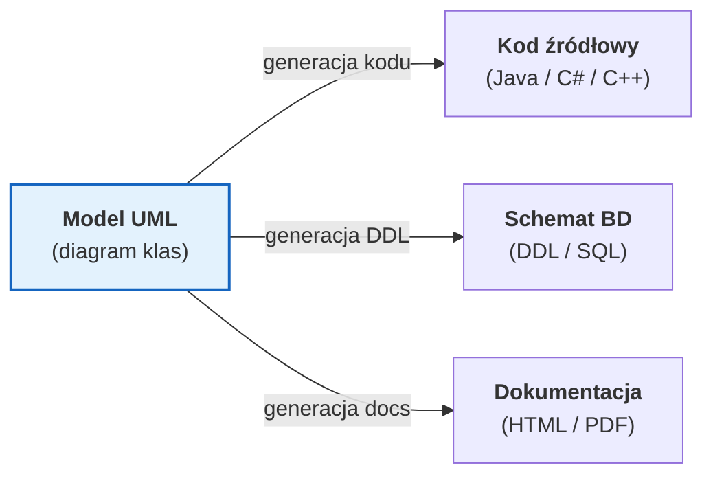
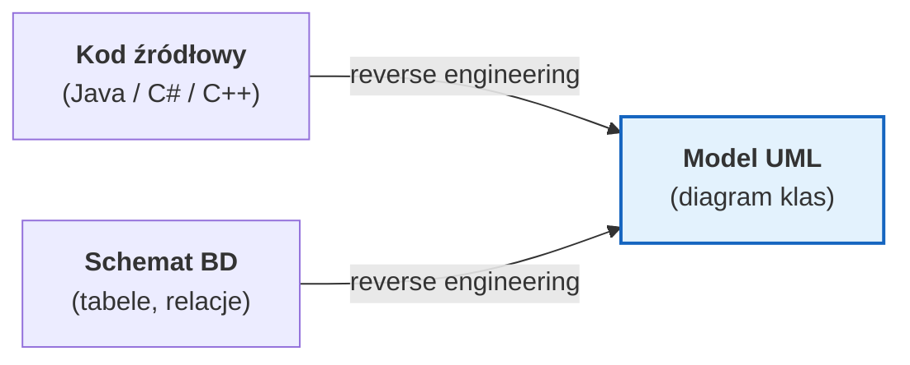
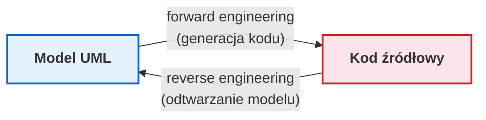
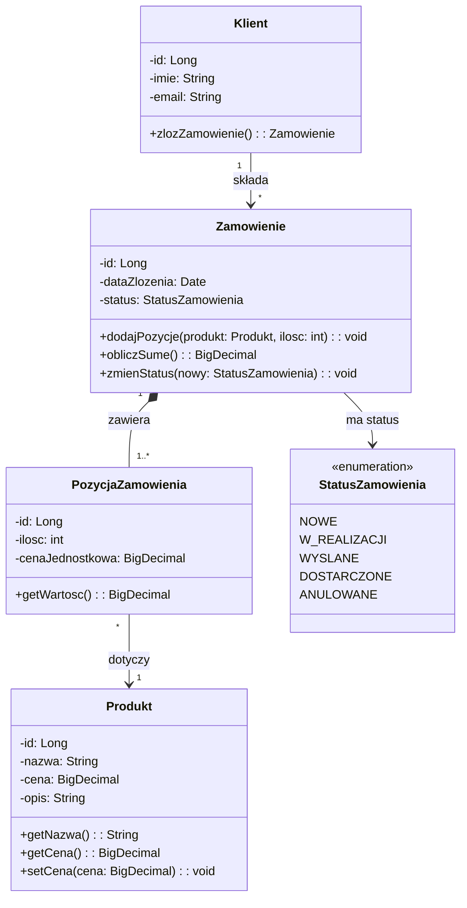
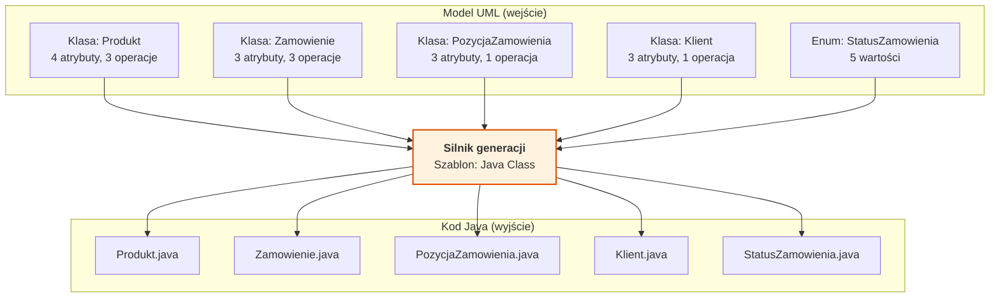

# Pytanie 14: Proszę opisać zasady tworzenia i transformacji modeli (np. w językach RSL i UML) oraz generacji kodu dla wybranych narzędzi CASE.

## Kluczowe pojęcia

- **CASE (Computer-Aided Software Engineering)** — zbiór narzędzi programistycznych wspierających proces wytwarzania oprogramowania na różnych etapach cyklu życia: od analizy wymagań, przez modelowanie i projektowanie, po generację kodu i testowanie. Narzędzia CASE automatyzują powtarzalne czynności inżynierskie, zapewniają spójność artefaktów projektowych i umożliwiają transformację modeli w kod źródłowy. Przykłady: Enterprise Architect, MagicDraw, Eclipse Modeling Framework.
- **Generacja kodu (Code Generation)** — automatyczny proces przekształcania modelu (np. diagramu klas UML) w kod źródłowy w wybranym języku programowania (Java, C#, Python). Generacja kodu jest realizowana przez silnik generacji na podstawie szablonów (templates), które definiują mapowanie elementów modelu na konstrukcje językowe. Wyróżniamy generację pełną (kompletny kod) i szkieletową (tylko sygnatury klas i metod).
- **Inżynieria w przód (Forward Engineering)** — proces transformacji modelu wyższego poziomu abstrakcji w artefakt niższego poziomu, np. generacja kodu źródłowego z diagramu klas UML lub generacja schematu bazy danych z modelu danych. Jest to podstawowy kierunek pracy w podejściu MDA/MDD — od modelu do implementacji.
- **Inżynieria wsteczna (Reverse Engineering)** — proces odtwarzania modelu wyższego poziomu abstrakcji z istniejącego kodu źródłowego lub innego artefaktu niższego poziomu. Przykład: wygenerowanie diagramu klas UML z kodu Java. Inżynieria wsteczna jest przydatna przy dokumentowaniu systemów legacy oraz przy migracji do podejścia modelowego.
- **Round-trip Engineering** — technika zapewniająca dwukierunkową synchronizację między modelem a kodem źródłowym. Zmiany w modelu są propagowane do kodu (forward engineering), a zmiany w kodzie są odzwierciedlane w modelu (reverse engineering). Round-trip engineering jest najtrudniejszym do realizacji trybem pracy, wymagającym śledzenia powiązań (traceability) między elementami modelu a fragmentami kodu.
- **Szablon generacji (Generation Template)** — plik definiujący reguły przekształcania elementów modelu w tekst (kod źródłowy, konfigurację, dokumentację). Szablony zawierają stały tekst (boilerplate) przeplatany wyrażeniami dynamicznymi odwołującymi się do właściwości elementów modelu. Języki szablonów: Acceleo (MTL), Xpand, JET (Java Emitter Templates), Velocity, StringTemplate.
- **RSL (Requirements Specification Language)** — język modelowania wymagań opracowany na Politechnice Warszawskiej, umożliwiający formalne specyfikowanie wymagań funkcjonalnych i niefunkcjonalnych systemu. RSL definiuje pojęcia takie jak: aktor, przypadek użycia, notacja scenariuszy, słownik pojęć. Modele RSL mogą być transformowane do modeli UML za pomocą zdefiniowanych reguł transformacji.
- **UML (Unified Modeling Language)** — standardowy język modelowania graficznego opracowany przez OMG, służący do specyfikowania, wizualizacji i dokumentowania artefaktów systemów informatycznych. UML definiuje 14 typów diagramów (klas, sekwencji, przypadków użycia, stanów itp.) i jest najszerzej stosowanym językiem modelowania w narzędziach CASE.

## Przegląd narzędzi CASE

### Klasyfikacja narzędzi CASE

Narzędzia CASE można klasyfikować według etapu cyklu życia oprogramowania, który wspierają:

| Kategoria | Etap | Przykłady narzędzi | Funkcje |
|---|---|---|---|
| **Upper CASE** | Analiza i projektowanie | Enterprise Architect, MagicDraw, Visual Paradigm | Modelowanie wymagań, diagramy UML, analiza |
| **Lower CASE** | Implementacja i testowanie | Eclipse EMF, Acceleo, Xpand | Generacja kodu, refaktoryzacja, testowanie |
| **Integrated CASE (I-CASE)** | Cały cykl życia | Enterprise Architect, Rational Software Architect | Modelowanie + generacja + reverse engineering |

### Enterprise Architect (Sparx Systems)

Enterprise Architect (EA) jest jednym z najpopularniejszych komercyjnych narzędzi CASE, wspierającym pełen cykl życia oprogramowania:

- **Modelowanie**: pełne wsparcie UML 2.5 (wszystkie 14 typów diagramów), SysML, BPMN, ArchiMate, ERD
- **Generacja kodu**: Java, C#, C++, Python, PHP, Delphi, ActionScript — z konfigurowalnych szablonów
- **Reverse engineering**: import kodu źródłowego i generacja diagramów klas
- **Round-trip engineering**: synchronizacja dwukierunkowa model ↔ kod
- **Transformacje MDA**: wbudowane transformacje PIM→PSM dla platform Java, .NET, C++
- **Szablony generacji**: własny język szablonów oparty na makrach z dostępem do API modelu

### MagicDraw / Cameo Systems Modeler (Dassault Systèmes)

MagicDraw to zaawansowane narzędzie CASE szczególnie popularne w branży systemowej i obronnej:

- **Modelowanie**: UML 2.5, SysML, BPMN, profil UPDM/UAF
- **Generacja kodu**: Java, C#, C++, CORBA IDL, DDL (SQL)
- **Transformacje**: wbudowany silnik transformacji z edytorem reguł
- **Walidacja modeli**: automatyczne sprawdzanie poprawności modeli (well-formedness rules)
- **Integracja**: API OpenAPI, wtyczki do Eclipse i IntelliJ, integracja z Teamwork Cloud

### Eclipse Modeling Framework (EMF) i ekosystem Eclipse

Eclipse Modeling to otwartoźródłowy ekosystem narzędzi do modelowania i generacji kodu:

| Komponent | Rola | Opis |
|---|---|---|
| **EMF (Eclipse Modeling Framework)** | Metamodelowanie | Definiowanie metamodeli w Ecore, generacja kodu Java z metamodelu |
| **GMF (Graphical Modeling Framework)** | Edytory graficzne | Tworzenie edytorów diagramów na podstawie metamodelu |
| **Acceleo** | Generacja kodu (M2T) | Język szablonów zgodny ze standardem OMG MOF2Text |
| **ATL (Atlas Transformation Language)** | Transformacje M2M | Język transformacji modeli (model-to-model) |
| **Xtext** | DSL | Tworzenie języków dziedzinowych (Domain-Specific Languages) z edytorem |
| **Sirius** | Edytory graficzne | Tworzenie edytorów diagramów bez programowania (konfiguracja) |



## Proces tworzenia i transformacji modeli

### Ogólny schemat pracy z narzędziem CASE

Typowy przepływ pracy z narzędziem CASE obejmuje następujące etapy:



### Tworzenie modeli w UML

Tworzenie modelu UML w narzędziu CASE obejmuje:

1. **Wybór typu diagramu** — diagram klas, sekwencji, przypadków użycia, stanów itp.
2. **Definiowanie elementów** — klasy, interfejsy, atrybuty, operacje, relacje
3. **Określanie właściwości** — typy danych, krotności, widoczność, stereotypy
4. **Definiowanie ograniczeń** — reguły OCL (Object Constraint Language), warunki wstępne/końcowe
5. **Walidacja** — automatyczne sprawdzanie poprawności modelu (np. brak cykli w dziedziczeniu, poprawność krotności)

### Tworzenie modeli w RSL

Tworzenie modelu w języku RSL (Requirements Specification Language) obejmuje:

1. **Definiowanie słownika pojęć** — formalne definicje terminów dziedzinowych
2. **Specyfikowanie aktorów** — użytkownicy i systemy zewnętrzne
3. **Definiowanie przypadków użycia** — scenariusze interakcji aktor-system
4. **Opisywanie scenariuszy** — sekwencje kroków w notacji RSL (warunki, akcje, odpowiedzi)
5. **Definiowanie notacji danych** — struktury danych wymienianych między aktorem a systemem

### Transformacja modeli RSL → UML

Transformacja modeli RSL do UML jest kluczowym procesem w podejściu MDA, realizowanym przez narzędzia CASE z wbudowanymi regułami transformacji:

| Element RSL | Element UML | Reguła transformacji |
|---|---|---|
| Aktor | Aktor (diagram przypadków użycia) | Bezpośrednie mapowanie 1:1 |
| Przypadek użycia | Przypadek użycia + diagram sekwencji | UC → przypadek użycia; scenariusz → diagram sekwencji |
| Pojęcie ze słownika | Klasa (diagram klas) | Pojęcie → klasa z atrybutami |
| Scenariusz | Diagram sekwencji / aktywności | Kroki scenariusza → komunikaty / akcje |
| Warunek | Fragment kombinowany `alt` / `opt` | Warunek → guard condition |
| Dane wejściowe/wyjściowe | Parametry operacji / klasy DTO | Struktura danych → klasa lub parametr |



## Generacja kodu z modeli UML

### Zasady generacji kodu

Generacja kodu z modelu UML opiera się na mapowaniu elementów modelu na konstrukcje języka programowania. Proces ten jest realizowany przez silnik generacji (generator), który przetwarza model wejściowy za pomocą szablonów generacji.



### Mapowanie elementów UML na kod

Poniższa tabela przedstawia standardowe reguły mapowania elementów diagramu klas UML na konstrukcje języka Java:

| Element UML | Konstrukcja Java | Uwagi |
|---|---|---|
| Klasa | `public class NazwaKlasy` | Klasa publiczna w osobnym pliku |
| Klasa abstrakcyjna | `public abstract class Nazwa` | Modyfikator `abstract` |
| Interfejs | `public interface Nazwa` | Interfejs Java |
| Atrybut | Pole klasy + getter/setter | Typ, widoczność, wartość domyślna |
| Operacja | Metoda klasy | Sygnatura z parametrami i typem zwracanym |
| Generalizacja | `extends KlasaBazowa` | Dziedziczenie jednokrotne |
| Realizacja interfejsu | `implements Interfejs` | Implementacja interfejsu |
| Asocjacja 1:1 | Pole typu referencyjnego | `private Klasa pole;` |
| Asocjacja 1:* | Kolekcja | `private List<Klasa> pole;` |
| Kompozycja | Pole + tworzenie w konstruktorze | Silna zależność cyklu życia |
| Agregacja | Pole referencyjne | Słaba zależność |
| Enumeracja | `public enum Nazwa` | Typ wyliczeniowy |
| Widoczność `+` | `public` | Dostęp publiczny |
| Widoczność `-` | `private` | Dostęp prywatny |
| Widoczność `#` | `protected` | Dostęp chroniony |
| Widoczność `~` | (package-private) | Dostęp pakietowy |

### Szablony generacji kodu

Szablony generacji definiują, jak elementy modelu są przekształcane w tekst. Poniżej przedstawiono przykład szablonu w języku Acceleo (standard OMG MOF2Text):

```
[comment Szablon Acceleo generujący klasę Java z elementu UML Class /]
[template public generateClass(aClass : Class)]
[file (aClass.name.concat('.java'), false)]
package [aClass.getPackageName()/];

[for (imp : Class | aClass.getImports())]
import [imp.getQualifiedName()/];
[/for]

/**
 * Klasa wygenerowana z modelu UML.
 * Źródło: [aClass.qualifiedName/]
 */
public [if (aClass.isAbstract)]abstract [/if]class [aClass.name/][if (aClass.getSuperClass() <> null)] extends [aClass.getSuperClass().name/][/if][if (aClass.getInterfaces()->notEmpty())] implements [for (i : Interface | aClass.getInterfaces()) separator(', ')][i.name/][/for][/if] {

[for (attr : Property | aClass.ownedAttribute)]
    private [attr.type.name/] [attr.name/];
[/for]

[for (attr : Property | aClass.ownedAttribute)]
    public [attr.type.name/] get[attr.name.toUpperFirst()/]() {
        return this.[attr.name/];
    }

    public void set[attr.name.toUpperFirst()/]([attr.type.name/] [attr.name/]) {
        this.[attr.name/] = [attr.name/];
    }
[/for]

[for (op : Operation | aClass.ownedOperation)]
    public [if (op.type <> null)][op.type.name/][else]void[/if] [op.name/]([for (p : Parameter | op.ownedParameter->select(direction = ParameterDirectionKind::_in)) separator(', ')][p.type.name/] [p.name/][/for]) {
        // TODO: implementacja metody [op.name/]
    }
[/for]
}
[/file]
[/template]
```

### Tryby generacji kodu

Narzędzia CASE oferują różne tryby generacji kodu:

| Tryb | Opis | Zastosowanie |
|---|---|---|
| **Generacja szkieletowa** | Generowane są tylko sygnatury klas, metod i pól (bez ciał metod) | Początek projektu — programista uzupełnia logikę |
| **Generacja pełna** | Generowany jest kompletny kod, w tym logika (np. gettery/settery, konstruktory, equals/hashCode) | Kod infrastrukturalny, DAO, DTO |
| **Generacja z regionami chronionymi** | Wygenerowany kod zawiera oznaczone sekcje (`// @generated` vs `// @custom`), w których programista może dodać własny kod bez ryzyka nadpisania | Round-trip engineering |
| **Generacja przyrostowa** | Generowany jest tylko kod dla nowych lub zmienionych elementów modelu | Iteracyjny rozwój |

### Regiony chronione (Protected Regions)

Regiony chronione to kluczowy mechanizm umożliwiający współistnienie kodu generowanego i ręcznie pisanego:

```java
// @generated — początek regionu generowanego
public class Zamowienie {
    private Long id;
    private Date dataZlozenia;
    private List<PozycjaZamowienia> pozycje;

    // @generated — gettery i settery
    public Long getId() { return id; }
    public void setId(Long id) { this.id = id; }

    // @custom — początek regionu chronionego (nie będzie nadpisany)
    public BigDecimal obliczSume() {
        return pozycje.stream()
            .map(PozycjaZamowienia::getWartosc)
            .reduce(BigDecimal.ZERO, BigDecimal::add);
    }
    // @end-custom
}
```

Przy ponownej generacji kodu silnik generacji:
1. Rozpoznaje regiony `@custom` i zachowuje ich zawartość
2. Regeneruje regiony `@generated` na podstawie aktualnego modelu
3. Scala oba typy regionów w wynikowy plik

## Inżynieria w przód, wstecz i round-trip

### Inżynieria w przód (Forward Engineering)

Inżynieria w przód to podstawowy kierunek pracy w narzędziach CASE — od modelu do kodu:



Typowe artefakty generowane w inżynierii w przód:
- **Kod źródłowy** — klasy, interfejsy, enumeracje z sygnaturami metod
- **Schematy bazy danych** — skrypty DDL (CREATE TABLE, ALTER TABLE, klucze obce, indeksy)
- **Pliki konfiguracyjne** — persistence.xml, web.xml, application.properties
- **Dokumentacja** — specyfikacja API, diagramy w formacie HTML/PDF

### Inżynieria wsteczna (Reverse Engineering)

Inżynieria wsteczna odtwarza model z istniejącego kodu:



Proces inżynierii wstecznej:
1. **Parsowanie kodu źródłowego** — analiza składniowa plików źródłowych
2. **Ekstrakcja elementów** — identyfikacja klas, interfejsów, metod, pól, relacji
3. **Budowa modelu** — tworzenie elementów UML odpowiadających elementom kodu
4. **Rozpoznawanie relacji** — identyfikacja dziedziczenia, asocjacji, zależności na podstawie typów pól i parametrów
5. **Generacja diagramów** — automatyczny układ (layout) elementów na diagramie

Ograniczenia inżynierii wstecznej:
- Utrata informacji o intencji projektowej (wzorce projektowe, decyzje architektoniczne)
- Trudność w rozpoznawaniu asocjacji vs zależności (oba wyglądają jak pola w kodzie)
- Brak informacji o krotności relacji (wymaga analizy semantycznej)
- Generowane diagramy mogą być nieczytelne bez ręcznego uporządkowania

### Round-trip Engineering

Round-trip engineering zapewnia ciągłą synchronizację między modelem a kodem:



Wyzwania round-trip engineering:

| Wyzwanie | Opis | Rozwiązanie |
|---|---|---|
| **Konflikty zmian** | Zmiana tego samego elementu w modelu i kodzie jednocześnie | Mechanizm scalania (merge) z rozwiązywaniem konfliktów |
| **Utrata informacji** | Kod zawiera szczegóły niereprezentowalne w modelu (i odwrotnie) | Regiony chronione, adnotacje, komentarze |
| **Śledzenie powiązań** | Konieczność mapowania element modelu ↔ fragment kodu | Identyfikatory (UUID), adnotacje `@generated` |
| **Wydajność** | Synchronizacja dużych modeli i baz kodu | Synchronizacja przyrostowa (incremental sync) |
| **Refaktoryzacja** | Zmiana nazwy klasy w kodzie musi być odzwierciedlona w modelu | Integracja z narzędziami refaktoryzacji IDE |

## Ograniczenia narzędzi CASE i generacji kodu

### Ograniczenia techniczne

1. **Niepełność generacji** — wygenerowany kod zawiera jedynie strukturę (szkielet); logika biznesowa musi być dopisana ręcznie
2. **Jakość generowanego kodu** — automatycznie wygenerowany kod może nie spełniać standardów jakości zespołu (konwencje nazewnictwa, formatowanie, wzorce)
3. **Ograniczenia ekspresji modelu** — nie wszystkie konstrukcje językowe mają odpowiedniki w UML (np. wyrażenia lambda, generics z wildcardami, adnotacje niestandardowe)
4. **Zależność od narzędzia** (vendor lock-in) — modele zapisane w formacie własnościowym mogą być trudne do przeniesienia do innego narzędzia
5. **Skalowalność** — duże modele (tysiące klas) mogą powodować problemy wydajnościowe w narzędziu CASE

### Ograniczenia organizacyjne

1. **Krzywa uczenia** — narzędzia CASE wymagają szkolenia zespołu
2. **Koszt licencji** — komercyjne narzędzia CASE (Enterprise Architect, MagicDraw) wymagają zakupu licencji
3. **Narzut procesu** — utrzymywanie modeli w synchronizacji z kodem wymaga dyscypliny i dodatkowego czasu
4. **Opór zespołu** — programiści mogą preferować bezpośrednie kodowanie nad modelowaniem

### Kiedy generacja kodu się opłaca?

| Scenariusz | Opłacalność | Uzasadnienie |
|---|---|---|
| Duży projekt z wieloma klasami DTO/Entity | ✅ Wysoka | Eliminacja powtarzalnego kodu boilerplate |
| Wieloplatformowa generacja (Java + C# + SQL) | ✅ Wysoka | Jeden model, wiele platform docelowych |
| Generacja API (REST, SOAP) z modelu | ✅ Wysoka | Spójność interfejsów, dokumentacja |
| Mały projekt z nietypową logiką | ❌ Niska | Narzut modelowania przewyższa korzyści |
| Prototyp / MVP | ❌ Niska | Szybsze jest bezpośrednie kodowanie |
| System z intensywną logiką algorytmiczną | ⚠️ Ograniczona | Logika algorytmiczna trudna do modelowania |

## Przykłady

### Generacja kodu Java z diagramu klas UML

Poniższy przykład ilustruje kompletny proces generacji kodu Java z diagramu klas UML w narzędziu CASE.

#### Krok 1: Diagram klas UML (model wejściowy)



#### Krok 2: Wygenerowany kod Java

Na podstawie powyższego diagramu narzędzie CASE generuje następujący kod:

**Enumeracja `StatusZamowienia`:**

```java
// @generated z modelu UML — StatusZamowienia
public enum StatusZamowienia {
    NOWE,
    W_REALIZACJI,
    WYSLANE,
    DOSTARCZONE,
    ANULOWANE
}
```

**Klasa `Produkt`:**

```java
// @generated z modelu UML — Produkt
public class Produkt {
    private Long id;
    private String nazwa;
    private BigDecimal cena;
    private String opis;

    // @generated — konstruktor
    public Produkt() {}

    // @generated — gettery i settery
    public Long getId() { return id; }
    public void setId(Long id) { this.id = id; }

    public String getNazwa() { return nazwa; }
    public void setNazwa(String nazwa) { this.nazwa = nazwa; }

    public BigDecimal getCena() { return cena; }
    public void setCena(BigDecimal cena) { this.cena = cena; }

    public String getOpis() { return opis; }
    public void setOpis(String opis) { this.opis = opis; }
}
```

**Klasa `PozycjaZamowienia` (z kompozycją):**

```java
// @generated z modelu UML — PozycjaZamowienia
public class PozycjaZamowienia {
    private Long id;
    private int ilosc;
    private BigDecimal cenaJednostkowa;
    private Produkt produkt; // asocjacja *-->1 Produkt

    // @generated — konstruktor
    public PozycjaZamowienia() {}

    // @generated — gettery i settery
    public Long getId() { return id; }
    public void setId(Long id) { this.id = id; }

    public int getIlosc() { return ilosc; }
    public void setIlosc(int ilosc) { this.ilosc = ilosc; }

    public BigDecimal getCenaJednostkowa() { return cenaJednostkowa; }
    public void setCenaJednostkowa(BigDecimal cenaJednostkowa) {
        this.cenaJednostkowa = cenaJednostkowa;
    }

    public Produkt getProdukt() { return produkt; }
    public void setProdukt(Produkt produkt) { this.produkt = produkt; }

    // @custom — logika biznesowa (region chroniony)
    public BigDecimal getWartosc() {
        return cenaJednostkowa.multiply(BigDecimal.valueOf(ilosc));
    }
    // @end-custom
}
```

**Klasa `Zamowienie` (z kompozycją i asocjacją):**

```java
// @generated z modelu UML — Zamowienie
public class Zamowienie {
    private Long id;
    private Date dataZlozenia;
    private StatusZamowienia status;
    private List<PozycjaZamowienia> pozycje; // kompozycja 1--*

    // @generated — konstruktor
    public Zamowienie() {
        this.pozycje = new ArrayList<>();
        this.status = StatusZamowienia.NOWE;
        this.dataZlozenia = new Date();
    }

    // @generated — gettery i settery
    public Long getId() { return id; }
    public void setId(Long id) { this.id = id; }

    public Date getDataZlozenia() { return dataZlozenia; }
    public StatusZamowienia getStatus() { return status; }
    public List<PozycjaZamowienia> getPozycje() {
        return Collections.unmodifiableList(pozycje);
    }

    // @custom — logika biznesowa (region chroniony)
    public void dodajPozycje(Produkt produkt, int ilosc) {
        PozycjaZamowienia pozycja = new PozycjaZamowienia();
        pozycja.setProdukt(produkt);
        pozycja.setIlosc(ilosc);
        pozycja.setCenaJednostkowa(produkt.getCena());
        this.pozycje.add(pozycja);
    }

    public BigDecimal obliczSume() {
        return pozycje.stream()
            .map(PozycjaZamowienia::getWartosc)
            .reduce(BigDecimal.ZERO, BigDecimal::add);
    }

    public void zmienStatus(StatusZamowienia nowy) {
        this.status = nowy;
    }
    // @end-custom
}
```

#### Krok 3: Podsumowanie generacji



### Porównanie narzędzi CASE — generacja kodu

| Cecha | Enterprise Architect | MagicDraw | Eclipse EMF + Acceleo |
|---|---|---|---|
| **Licencja** | Komercyjna (~$229+) | Komercyjna (~$2000+) | Open source (EPL) |
| **Języki docelowe** | Java, C#, C++, Python, PHP | Java, C#, C++, CORBA IDL | Dowolny (szablony Acceleo) |
| **Szablony** | Wbudowane + własne (makra) | Wbudowane + własne | Acceleo (MOF2Text) |
| **Round-trip** | Tak (Java, C#, C++) | Tak (Java, C#) | Częściowe (EMF) |
| **Reverse engineering** | Tak (wiele języków) | Tak (Java, C#, C++) | Tak (Java via EMF) |
| **Transformacje MDA** | Wbudowane PIM→PSM | Wbudowane + edytor reguł | ATL (pełny język transformacji) |
| **Rozszerzalność** | Skrypty, Add-Ins (COM) | Wtyczki Java (OpenAPI) | Pełna (Eclipse plugins) |

## Podsumowanie

1. **Narzędzia CASE** (Computer-Aided Software Engineering) wspierają cały cykl życia oprogramowania — od analizy wymagań i modelowania, przez transformację modeli, po generację kodu i dokumentacji. Wyróżniamy narzędzia Upper CASE (analiza/projektowanie), Lower CASE (implementacja) i Integrated CASE (cały cykl).

2. **Generacja kodu** z modeli UML polega na automatycznym mapowaniu elementów diagramu klas (klasy, atrybuty, operacje, relacje) na konstrukcje języka programowania (klasy, pola, metody, dziedziczenie, kolekcje). Proces jest realizowany przez silnik generacji na podstawie konfigurowalnych szablonów.

3. **Szablony generacji** (Acceleo, Xpand, JET) definiują reguły przekształcania elementów modelu w tekst. Zawierają stały tekst (boilerplate) przeplatany wyrażeniami dynamicznymi odwołującymi się do właściwości elementów modelu.

4. **Inżynieria w przód** (forward engineering) to generacja kodu z modelu. **Inżynieria wsteczna** (reverse engineering) to odtwarzanie modelu z kodu. **Round-trip engineering** zapewnia dwukierunkową synchronizację model ↔ kod, wykorzystując mechanizmy regionów chronionych i śledzenia powiązań.

5. **Transformacja RSL → UML** mapuje elementy języka wymagań (aktorzy, przypadki użycia, pojęcia, scenariusze) na elementy UML (aktorzy, przypadki użycia, klasy, diagramy sekwencji), umożliwiając przejście od specyfikacji wymagań do modelu projektowego.

6. **Regiony chronione** (`@generated` vs `@custom`) umożliwiają współistnienie kodu generowanego automatycznie i kodu pisanego ręcznie — przy ponownej generacji silnik zachowuje regiony chronione i regeneruje tylko regiony generowane.

7. **Główne ograniczenia** generacji kodu to: niepełność generacji (logika biznesowa wymaga ręcznego kodowania), ograniczenia ekspresji modelu, zależność od narzędzia (vendor lock-in) oraz narzut organizacyjny związany z utrzymywaniem modeli w synchronizacji z kodem.

8. **Popularne narzędzia CASE**: Enterprise Architect (komercyjne, wszechstronne), MagicDraw/Cameo (zaawansowane, branża systemowa), Eclipse Modeling (open source, rozszerzalne) — każde oferuje generację kodu, reverse engineering i wsparcie dla transformacji MDA.

## Powiązane pytania

- [Pytanie 8: Proszę omówić podstawowe konstrukcje wybranego języka transformacji modeli.](08-jezyki-transformacji-modeli.md)
- [Pytanie 10: Proszę wyjaśnić zasady procesu wytwarzania oprogramowania sterowanego modelami.](10-mda-mdd.md)
- [Pytanie 11: Proszę określić kilka przykładowych reguł transformacji modeli dla wybranych języków modelowania (np. RSL i UML).](11-reguly-transformacji-rsl-uml.md)
