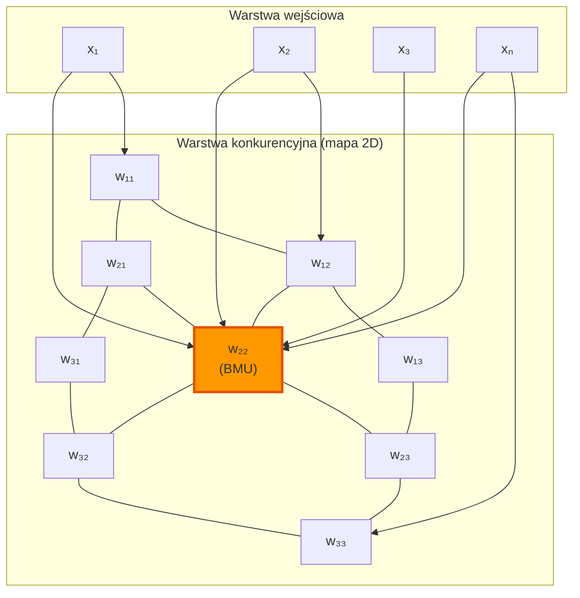
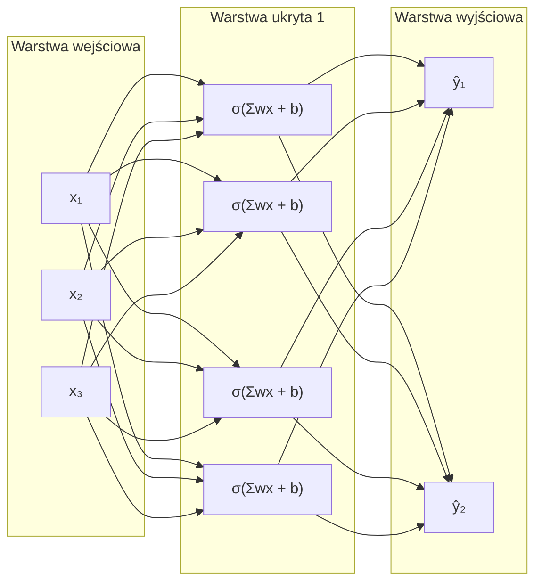
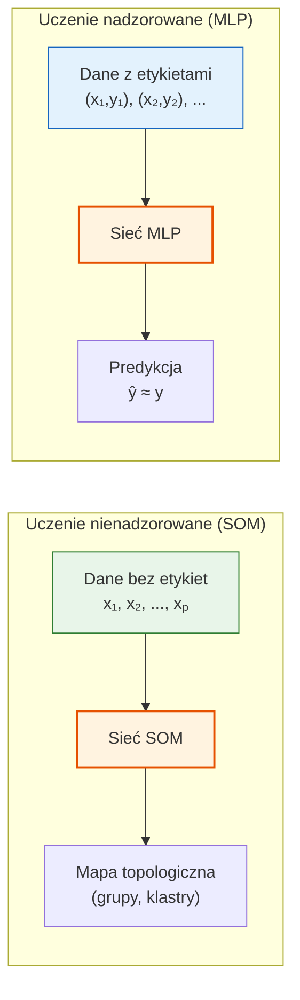
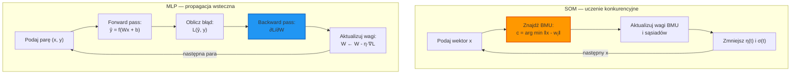
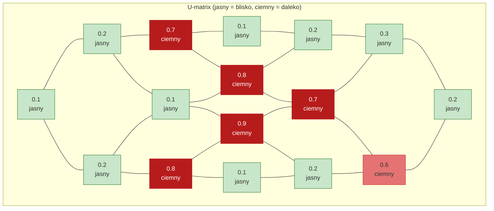

# Pytanie 15: Sztuczne sieci neuronowe: omówić sieci samoorganizujące i trenowane z nauczycielem.

## Kluczowe pojęcia

- **Sieć Kohonena (SOM — Self-Organizing Map)** — rodzaj sztucznej sieci neuronowej uczonej bez nadzoru (unsupervised learning), zaproponowanej przez Teuvo Kohonena w 1982 roku. SOM realizuje odwzorowanie danych wielowymiarowych na niskowymiarową (zwykle dwuwymiarową) siatkę neuronów, zachowując przy tym topologię danych wejściowych. Neurony w sieci SOM rywalizują o aktywację — dla każdego wektora wejściowego aktywowany jest jeden neuron zwycięzca (winner-takes-all), a następnie aktualizowane są wagi zwycięzcy i jego sąsiadów.
- **Uczenie nadzorowane (supervised learning)** — paradygmat uczenia maszynowego, w którym sieć neuronowa jest trenowana na zbiorze par (wejście, oczekiwane wyjście). Algorytm uczenia minimalizuje funkcję kosztu mierzącą różnicę między wyjściem sieci a wartością oczekiwaną (etykietą). Przykłady: klasyfikacja obrazów, regresja, rozpoznawanie mowy. Typowe architektury: perceptron wielowarstwowy (MLP), sieci konwolucyjne (CNN), sieci rekurencyjne (RNN).
- **Uczenie nienadzorowane (unsupervised learning)** — paradygmat uczenia maszynowego, w którym sieć neuronowa uczy się na danych bez etykiet. Celem jest odkrycie ukrytej struktury danych: grupowanie (clustering), redukcja wymiarowości, wykrywanie anomalii. Sieć samodzielnie organizuje reprezentację danych. Przykłady algorytmów: SOM, autoenkodery, k-means, DBSCAN.
- **Mapa topologiczna** — właściwość sieci SOM polegająca na tym, że neurony bliskie sobie na siatce SOM reprezentują podobne wzorce danych wejściowych. Mapa topologiczna zachowuje relacje sąsiedztwa z przestrzeni wejściowej — dane podobne w przestrzeni wielowymiarowej są mapowane na sąsiednie neurony na siatce. Dzięki temu SOM realizuje nieliniową projekcję zachowującą topologię.
- **Neuron zwycięzca (Best Matching Unit, BMU)** — neuron w sieci SOM, którego wektor wagowy jest najbliższy (w sensie odległości euklidesowej) aktualnemu wektorowi wejściowemu. Neuron zwycięzca jest wybierany w fazie rywalizacji (competitive phase) algorytmu SOM. Jego wagi oraz wagi neuronów w jego sąsiedztwie topologicznym są aktualizowane w kierunku wektora wejściowego.

## Sieci samoorganizujące — mapa Kohonena (SOM)

### Architektura sieci SOM

Sieć Kohonena składa się z dwóch warstw:

1. **Warstwa wejściowa** — przyjmuje wektor wejściowy $\mathbf{x} = (x_1, x_2, \ldots, x_n) \in \mathbb{R}^n$. Każdy neuron wejściowy odpowiada jednej cesze (wymiarowi) danych.
2. **Warstwa konkurencyjna (mapa)** — dwuwymiarowa siatka neuronów o wymiarach $M \times N$. Każdy neuron $j$ posiada wektor wagowy $\mathbf{w}_j = (w_{j1}, w_{j2}, \ldots, w_{jn}) \in \mathbb{R}^n$ o tym samym wymiarze co wektor wejściowy.

Każdy neuron warstwy wejściowej jest połączony z każdym neuronem warstwy konkurencyjnej (połączenia pełne). Neurony warstwy konkurencyjnej nie mają bezpośrednich połączeń między sobą, ale są powiązane topologicznie przez funkcję sąsiedztwa.



### Zasada działania SOM

Algorytm SOM działa w trybie uczenia konkurencyjnego (competitive learning). Dla każdego wektora wejściowego:

1. **Rywalizacja** — neurony warstwy konkurencyjnej rywalizują o aktywację. Zwycięża neuron, którego wektor wagowy jest najbliższy wektorowi wejściowemu.
2. **Współpraca** — neuron zwycięzca aktywuje swoje sąsiedztwo topologiczne na siatce. Siła aktywacji maleje z odległością od zwycięzcy.
3. **Adaptacja** — wagi neuronu zwycięzcy i jego sąsiadów są przesuwane w kierunku wektora wejściowego.

### Algorytm uczenia Kohonena

Algorytm uczenia SOM przebiega iteracyjnie:

```
Algorytm: Uczenie sieci Kohonena (SOM)
─────────────────────────────────────────
Wejście: zbiór danych X = {x₁, x₂, ..., xₚ}, siatka neuronów M×N
Parametry: η₀ (początkowy learning rate), σ₀ (początkowy promień sąsiedztwa),
           T (liczba epok)

1. INICJALIZACJA:
   Dla każdego neuronu j na siatce:
       wⱼ ← losowy wektor z przestrzeni danych
       (lub inicjalizacja PCA — wzdłuż głównych składowych)

2. DLA t = 1, 2, ..., T:
   a) Oblicz parametry zależne od czasu:
      η(t) = η₀ · exp(-t / τ_η)          // malejący learning rate
      σ(t) = σ₀ · exp(-t / τ_σ)          // malejący promień sąsiedztwa

   b) DLA KAŻDEGO wektora wejściowego x ∈ X (w losowej kolejności):

      i.  RYWALIZACJA — znajdź neuron zwycięzca (BMU):
          c = arg min_j ‖x - wⱼ‖²

      ii. WSPÓŁPRACA I ADAPTACJA — aktualizuj wagi:
          DLA KAŻDEGO neuronu j na siatce:
              h_cj(t) = exp(-‖rⱼ - r_c‖² / (2·σ(t)²))   // funkcja sąsiedztwa
              wⱼ(t+1) = wⱼ(t) + η(t) · h_cj(t) · (x - wⱼ(t))

3. ZWRÓĆ wyuczoną mapę SOM (wektory wagowe wszystkich neuronów)
```

Gdzie:
- $c$ — indeks neuronu zwycięzcy (BMU)
- $\mathbf{r}_j$, $\mathbf{r}_c$ — pozycje neuronów $j$ i $c$ na siatce (współrzędne topologiczne)
- $h_{cj}(t)$ — funkcja sąsiedztwa (Gaussowska) określająca wpływ zwycięzcy na neuron $j$
- $\eta(t)$ — współczynnik uczenia malejący w czasie
- $\sigma(t)$ — promień sąsiedztwa malejący w czasie

### Funkcja sąsiedztwa

Funkcja sąsiedztwa $h_{cj}(t)$ określa, jak silnie neuron zwycięzca wpływa na aktualizację wag sąsiednich neuronów:

$$h_{cj}(t) = \exp\left(-\frac{\|\mathbf{r}_j - \mathbf{r}_c\|^2}{2\sigma(t)^2}\right)$$

- Dla neuronu zwycięzcy ($j = c$): $h_{cc} = 1$ (maksymalny wpływ)
- Dla neuronów oddalonych: $h_{cj} \to 0$ (minimalny wpływ)
- Promień sąsiedztwa $\sigma(t)$ maleje w czasie — początkowo aktualizowane są duże obszary mapy, pod koniec uczenia tylko najbliżsi sąsiedzi

### Właściwości mapy SOM

1. **Zachowanie topologii** — dane podobne w przestrzeni wejściowej są mapowane na sąsiednie neurony na siatce
2. **Redukcja wymiarowości** — dane wielowymiarowe są rzutowane na siatkę 2D (lub 1D)
3. **Kwantyzacja wektorowa** — każdy neuron reprezentuje prototyp (centroid) grupy podobnych danych
4. **Uporządkowanie** — mapa samoistnie organizuje się tak, że sąsiednie neurony reprezentują podobne wzorce
5. **Gęstość odwzorowania** — obszary mapy z większą liczbą neuronów odpowiadają gęstszym regionom przestrzeni danych

## Sieci trenowane z nauczycielem — perceptron wielowarstwowy (MLP)

### Architektura MLP

Perceptron wielowarstwowy (Multi-Layer Perceptron, MLP) jest najpopularniejszą architekturą sieci neuronowej uczonej z nadzorem. Składa się z:

1. **Warstwa wejściowa** — przyjmuje wektor cech $\mathbf{x} = (x_1, x_2, \ldots, x_n)$
2. **Warstwy ukryte** — jedna lub więcej warstw neuronów z nieliniowymi funkcjami aktywacji
3. **Warstwa wyjściowa** — produkuje wynik $\hat{\mathbf{y}}$ (predykcję)

Każdy neuron w warstwie ukrytej oblicza:

$$z_j = f\left(\sum_{i=1}^{n} w_{ji} x_i + b_j\right)$$

gdzie $f$ to funkcja aktywacji (sigmoid, tanh, ReLU), $w_{ji}$ to wagi, $b_j$ to bias.



### Zasada uczenia nadzorowanego

Uczenie nadzorowane opiera się na minimalizacji funkcji kosztu (loss function), która mierzy rozbieżność między wyjściem sieci $\hat{\mathbf{y}}$ a oczekiwaną wartością $\mathbf{y}$ (etykietą):

1. **Propagacja w przód (forward pass)** — wektor wejściowy jest przetwarzany przez kolejne warstwy sieci, produkując wyjście $\hat{\mathbf{y}}$
2. **Obliczenie błędu** — funkcja kosztu $L(\hat{\mathbf{y}}, \mathbf{y})$ mierzy różnicę między predykcją a etykietą
3. **Propagacja wsteczna (backpropagation)** — gradient funkcji kosztu jest propagowany wstecz przez warstwy sieci
4. **Aktualizacja wag** — wagi są korygowane w kierunku przeciwnym do gradientu: $w \leftarrow w - \eta \cdot \frac{\partial L}{\partial w}$

Typowe funkcje kosztu:
- **MSE (Mean Squared Error)** — dla regresji: $L = \frac{1}{N}\sum_{i=1}^{N}(\hat{y}_i - y_i)^2$
- **Cross-entropy** — dla klasyfikacji: $L = -\sum_{i=1}^{C} y_i \log(\hat{y}_i)$

### Algorytm uczenia MLP (backpropagation)

```
Algorytm: Uczenie MLP metodą propagacji wstecznej
──────────────────────────────────────────────────
Wejście: zbiór treningowy D = {(x₁,y₁), (x₂,y₂), ..., (xₚ,yₚ)}
Parametry: η (learning rate), T (liczba epok)

1. INICJALIZACJA:
   Losowa inicjalizacja wag W i biasów b (np. Xavier, He)

2. DLA t = 1, 2, ..., T:
   DLA KAŻDEJ pary (x, y) ∈ D:

   a) PROPAGACJA W PRZÓD:
      Dla każdej warstwy l = 1, 2, ..., L:
          z⁽ˡ⁾ = W⁽ˡ⁾ · a⁽ˡ⁻¹⁾ + b⁽ˡ⁾
          a⁽ˡ⁾ = f(z⁽ˡ⁾)                    // f = funkcja aktywacji
      ŷ = a⁽ᴸ⁾                               // wyjście sieci

   b) OBLICZENIE BŁĘDU:
      L = Loss(ŷ, y)                          // funkcja kosztu

   c) PROPAGACJA WSTECZNA:
      δ⁽ᴸ⁾ = ∂L/∂a⁽ᴸ⁾ ⊙ f'(z⁽ᴸ⁾)           // błąd warstwy wyjściowej
      Dla l = L-1, L-2, ..., 1:
          δ⁽ˡ⁾ = (W⁽ˡ⁺¹⁾ᵀ · δ⁽ˡ⁺¹⁾) ⊙ f'(z⁽ˡ⁾)

   d) AKTUALIZACJA WAG:
      Dla każdej warstwy l = 1, 2, ..., L:
          W⁽ˡ⁾ ← W⁽ˡ⁾ - η · δ⁽ˡ⁾ · a⁽ˡ⁻¹⁾ᵀ
          b⁽ˡ⁾ ← b⁽ˡ⁾ - η · δ⁽ˡ⁾

3. ZWRÓĆ wyuczone wagi W i biasy b
```

## Porównanie sieci samoorganizujących i trenowanych z nauczycielem

### Porównanie paradygmatów uczenia



### Tabela porównawcza

| Cecha | SOM (samoorganizująca) | MLP (z nauczycielem) |
|---|---|---|
| **Paradygmat uczenia** | Nienadzorowane (unsupervised) | Nadzorowane (supervised) |
| **Dane treningowe** | Tylko wektory wejściowe $\mathbf{x}$ | Pary (wejście, etykieta) $(\mathbf{x}, \mathbf{y})$ |
| **Cel uczenia** | Odkrycie struktury danych, grupowanie | Minimalizacja błędu predykcji |
| **Funkcja kosztu** | Brak jawnej — minimalizacja odległości BMU | MSE, cross-entropy, itp. |
| **Algorytm uczenia** | Uczenie konkurencyjne (winner-takes-all) | Propagacja wsteczna (backpropagation) |
| **Architektura** | 2 warstwy (wejściowa + mapa 2D) | Wiele warstw (wejściowa + ukryte + wyjściowa) |
| **Funkcja aktywacji** | Odległość euklidesowa (rywalizacja) | Sigmoid, tanh, ReLU, softmax |
| **Wyjście** | Indeks neuronu zwycięzcy (BMU) | Wektor predykcji $\hat{\mathbf{y}}$ |
| **Topologia** | Zachowuje topologię danych wejściowych | Nie zachowuje topologii |
| **Wymiarowość** | Redukcja wymiarowości (n-D → 2D) | Dowolne mapowanie wejście → wyjście |
| **Interpretacja** | Wizualizacja, eksploracja danych | Klasyfikacja, regresja, predykcja |
| **Skalowalność** | Ograniczona (duże mapy są kosztowne) | Dobra (GPU, mini-batch) |
| **Wymagania danych** | Nie wymaga etykiet | Wymaga dużego zbioru etykietowanych danych |

### Porównanie procesu uczenia



## Zastosowania obu typów sieci

### Zastosowania sieci SOM (samoorganizujących)

1. **Wizualizacja danych wielowymiarowych** — projekcja danych o wielu cechach na mapę 2D, umożliwiająca wizualną eksplorację struktury danych (np. wizualizacja profili klientów, danych genomowych)
2. **Grupowanie (clustering)** — automatyczne odkrywanie grup podobnych obiektów bez wcześniejszej wiedzy o liczbie klas (np. segmentacja rynku, grupowanie dokumentów)
3. **Wykrywanie anomalii** — identyfikacja danych odstających jako wektorów odległych od wszystkich neuronów mapy (np. wykrywanie oszustw finansowych, anomalii w ruchu sieciowym)
4. **Kwantyzacja wektorowa** — kompresja danych przez zastąpienie wektorów danych najbliższymi prototypami (neuronami mapy)
5. **Eksploracyjna analiza danych (EDA)** — odkrywanie ukrytych wzorców i zależności w danych bez hipotez a priori
6. **Organizacja dokumentów** — automatyczne tworzenie map tematycznych kolekcji dokumentów (np. WEBSOM)

### Zastosowania sieci MLP (z nauczycielem)

1. **Klasyfikacja** — przypisywanie obiektów do predefiniowanych klas (np. rozpoznawanie cyfr MNIST, klasyfikacja e-maili spam/nie-spam, diagnostyka medyczna)
2. **Regresja** — predykcja wartości ciągłych (np. prognozowanie cen, estymacja parametrów fizycznych)
3. **Rozpoznawanie wzorców** — identyfikacja wzorców w danych (np. rozpoznawanie mowy, rozpoznawanie twarzy)
4. **Aproksymacja funkcji** — przybliżanie dowolnych funkcji ciągłych (twierdzenie o uniwersalnej aproksymacji Cybenko)
5. **Przetwarzanie języka naturalnego** — analiza sentymentu, tłumaczenie maszynowe, generowanie tekstu
6. **Sterowanie** — systemy sterowania adaptacyjnego, robotyka, gry

## Przykłady

### Wizualizacja działania mapy SOM

Poniższy przykład ilustruje, jak sieć SOM organizuje siatkę neuronów 4×4 dla zbioru danych 2D składającego się z trzech skupisk (klastrów):

```
Przestrzeń wejściowa (2D):          Mapa SOM (4×4) po uczeniu:

  y                                  ┌────┬────┬────┬────┐
  ↑   ○○○                           │ A  │ A  │ AB │ B  │
  │  ○○○○○     △△△                  ├────┼────┼────┼────┤
  │   ○○○     △△△△                  │ A  │ A  │ B  │ B  │
  │           △△△                   ├────┼────┼────┼────┤
  │                                  │ AC │ C  │ BC │ B  │
  │     □□□□                        ├────┼────┼────┼────┤
  │    □□□□□                        │ C  │ C  │ C  │ BC │
  │     □□□                         └────┴────┴────┴────┘
  └──────────→ x
                                     A = klaster ○ (górny lewy)
  ○ = klaster A                      B = klaster △ (prawy)
  △ = klaster B                      C = klaster □ (dolny)
  □ = klaster C                      AB, BC, AC = strefy przejściowe
```

Mapa SOM zachowuje topologię: klastry sąsiadujące w przestrzeni wejściowej są mapowane na sąsiednie regiony siatki. Strefy przejściowe (AB, BC, AC) odpowiadają granicom między klastrami.

### Wizualizacja mapy SOM — U-matrix

U-matrix (Unified Distance Matrix) to popularna metoda wizualizacji wyników SOM. Dla każdego neuronu obliczana jest średnia odległość do sąsiadów — duże odległości wskazują granice między klastrami:



Ciemne komórki (duże odległości) tworzą „granice" oddzielające trzy klastry na mapie.

### Porównanie tabelaryczne: kiedy wybrać SOM, a kiedy MLP?

| Scenariusz | Rekomendacja | Uzasadnienie |
|---|---|---|
| Mamy etykietowane dane i chcemy klasyfikować nowe obiekty | **MLP** | Uczenie nadzorowane wymaga etykiet, ale daje precyzyjne predykcje |
| Mamy dane bez etykiet i chcemy odkryć grupy | **SOM** | Uczenie nienadzorowane nie wymaga etykiet |
| Chcemy zwizualizować dane wielowymiarowe | **SOM** | Mapa 2D zachowuje topologię danych |
| Chcemy przewidzieć wartość ciągłą (regresja) | **MLP** | Sieć nadzorowana z wyjściem liniowym |
| Chcemy wykryć anomalie w danych | **SOM** | Anomalie = dane odległe od wszystkich neuronów |
| Mamy mało danych, ale z etykietami | **MLP** | Nawet mały zbiór etykietowany pozwala na uczenie nadzorowane |
| Chcemy zrozumieć strukturę danych przed modelowaniem | **SOM** | Eksploracyjna analiza danych (EDA) |
| Potrzebujemy wysokiej dokładności klasyfikacji | **MLP** | Sieci nadzorowane osiągają wyższą dokładność niż nienadzorowane |

## Podsumowanie

1. **Sieci samoorganizujące (SOM)** to sieci uczone bez nadzoru, które realizują odwzorowanie danych wielowymiarowych na niskowymiarową siatkę neuronów z zachowaniem topologii. Algorytm Kohonena opiera się na rywalizacji neuronów (winner-takes-all) i adaptacji wag zwycięzcy oraz jego sąsiadów.

2. **Sieci trenowane z nauczycielem (MLP)** to sieci uczone na parach (wejście, etykieta) metodą propagacji wstecznej. Algorytm minimalizuje funkcję kosztu, korygując wagi w kierunku przeciwnym do gradientu błędu.

3. **Kluczowa różnica** dotyczy paradygmatu uczenia: SOM nie wymaga etykiet i odkrywa strukturę danych samodzielnie, natomiast MLP wymaga etykietowanych danych treningowych, ale osiąga wyższą dokładność w zadaniach klasyfikacji i regresji.

4. **Algorytm SOM** wykorzystuje trzy fazy: rywalizację (znajdowanie BMU), współpracę (funkcja sąsiedztwa Gaussowska) i adaptację (aktualizacja wag). Parametry $\eta(t)$ i $\sigma(t)$ maleją w czasie, zapewniając zbieżność.

5. **Zastosowania SOM**: wizualizacja danych wielowymiarowych, grupowanie, wykrywanie anomalii, kwantyzacja wektorowa. **Zastosowania MLP**: klasyfikacja, regresja, rozpoznawanie wzorców, aproksymacja funkcji.

6. **Wybór między SOM a MLP** zależy od dostępności etykiet, celu analizy (eksploracja vs predykcja) i wymagań dotyczących interpretowalności wyników.

## Powiązane pytania

- [Pytanie 16: Na czym polega idea i zasada algorytmu propagacji wstecznej w sieciach neuronowych?](16-backpropagation.md)
- [Pytanie 17: Algorytmy deterministyczne uczenia sieci neuronowych.](17-algorytmy-deterministyczne-uczenia.md)
- [Pytanie 20: Wyjaśnić specyfikę zastosowania sieci neuronowych w charakterze klasyfikatora uniwersalnego aproksymatora – podać przykłady obu rodzajów sieci.](20-klasyfikator-aproksymator.md)
- [Pytanie 26: Przedstawić algorytmy grupowania danych: klasyczne i rozmyte.](26-algorytmy-grupowania.md)
