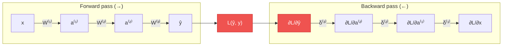
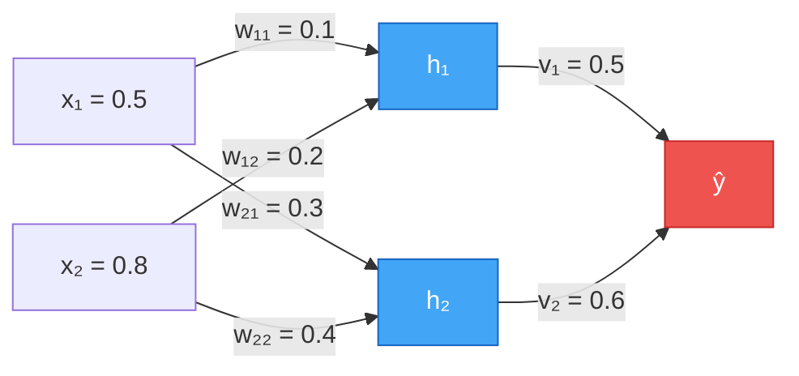

# Pytanie 16: Na czym polega idea i zasada algorytmu propagacji wstecznej w sieciach neuronowych?

## Kluczowe pojęcia

- **Propagacja wsteczna (backpropagation)** — algorytm obliczania gradientów funkcji kosztu względem wag sieci neuronowej, polegający na propagacji błędu od warstwy wyjściowej do warstwy wejściowej z wykorzystaniem reguły łańcuchowej różniczkowania. Backpropagation nie jest samodzielnym algorytmem uczenia — jest metodą efektywnego obliczania gradientów, które następnie wykorzystuje algorytm optymalizacji (np. SGD, Adam) do aktualizacji wag. Algorytm został spopularyzowany przez Rumelharta, Hintona i Williamsa w 1986 roku.
- **Gradient** — wektor pochodnych cząstkowych funkcji kosztu względem wszystkich wag sieci: $\nabla_{\mathbf{W}} L = \left(\frac{\partial L}{\partial w_1}, \frac{\partial L}{\partial w_2}, \ldots, \frac{\partial L}{\partial w_n}\right)$. Gradient wskazuje kierunek najszybszego wzrostu funkcji kosztu. Aktualizacja wag odbywa się w kierunku przeciwnym do gradientu (gradient descent), co prowadzi do minimalizacji błędu.
- **Reguła łańcuchowa (chain rule)** — fundamentalna zasada rachunku różniczkowego umożliwiająca obliczanie pochodnej funkcji złożonej. Jeśli $y = f(g(x))$, to $\frac{dy}{dx} = \frac{dy}{dg} \cdot \frac{dg}{dx}$. W kontekście sieci neuronowych reguła łańcuchowa pozwala propagować gradient błędu przez kolejne warstwy sieci, rozkładając złożoną pochodną na iloczyn prostszych pochodnych lokalnych.
- **Funkcja kosztu (loss function)** — funkcja mierząca rozbieżność między wyjściem sieci $\hat{y}$ a wartością oczekiwaną $y$. Typowe funkcje kosztu: MSE (Mean Squared Error) $L = \frac{1}{N}\sum_{i}(\hat{y}_i - y_i)^2$ dla regresji, cross-entropy $L = -\sum_{i} y_i \log(\hat{y}_i)$ dla klasyfikacji. Celem uczenia jest minimalizacja funkcji kosztu na zbiorze treningowym.
- **Epoka (epoch)** — jedno pełne przejście algorytmu uczenia przez cały zbiór treningowy. W każdej epoce sieć widzi każdy przykład treningowy dokładnie raz. Uczenie sieci wymaga zwykle wielu epok (dziesiątek do tysięcy), aż funkcja kosztu osiągnie akceptowalnie niską wartość lub spełniony zostanie warunek stopu (early stopping).
- **Współczynnik uczenia (learning rate, η)** — hiperparametr kontrolujący wielkość kroku aktualizacji wag: $w \leftarrow w - \eta \cdot \frac{\partial L}{\partial w}$. Zbyt duży η powoduje oscylacje i rozbieżność, zbyt mały η prowadzi do bardzo wolnej zbieżności i ryzyka utknięcia w minimum lokalnym. Dobór learning rate jest jednym z najważniejszych aspektów trenowania sieci neuronowych.

## Idea algorytmu propagacji wstecznej

### Kontekst — uczenie sieci neuronowej

Sieć neuronowa (np. perceptron wielowarstwowy, MLP) jest funkcją parametryczną $f_{\mathbf{W}}(\mathbf{x})$, gdzie $\mathbf{W}$ oznacza zbiór wszystkich wag i biasów sieci. Uczenie sieci polega na znalezieniu takich wartości $\mathbf{W}$, które minimalizują funkcję kosztu $L$ na zbiorze treningowym:

$$\mathbf{W}^* = \arg\min_{\mathbf{W}} \frac{1}{N} \sum_{i=1}^{N} L\left(f_{\mathbf{W}}(\mathbf{x}_i),\; \mathbf{y}_i\right)$$

Do minimalizacji stosuje się metody gradientowe, które wymagają obliczenia gradientu $\nabla_{\mathbf{W}} L$ — czyli pochodnych cząstkowych funkcji kosztu względem każdej wagi w sieci.

### Problem — jak obliczyć gradient w sieci wielowarstwowej?

Sieć wielowarstwowa jest złożeniem wielu funkcji:

$$\hat{\mathbf{y}} = f_L\left(f_{L-1}\left(\cdots f_2\left(f_1(\mathbf{x})\right)\cdots\right)\right)$$

Obliczenie pochodnej $\frac{\partial L}{\partial w}$ dla wagi $w$ w warstwie wewnętrznej wymaga „przejścia" przez wszystkie warstwy pośrednie. Naiwne obliczanie każdej pochodnej osobno byłoby nieefektywne — backpropagation rozwiązuje ten problem, obliczając wszystkie gradienty w jednym przejściu wstecznym.

### Idea backpropagation

Algorytm propagacji wstecznej składa się z dwóch faz:

1. **Propagacja w przód (forward pass)** — wektor wejściowy $\mathbf{x}$ jest przetwarzany przez kolejne warstwy sieci, obliczając aktywacje $\mathbf{a}^{(l)}$ każdej warstwy aż do wyjścia $\hat{\mathbf{y}}$.
2. **Propagacja wsteczna (backward pass)** — gradient błędu jest propagowany od warstwy wyjściowej do wejściowej, wykorzystując regułę łańcuchową. Dla każdej warstwy obliczany jest lokalny gradient (sygnał błędu $\boldsymbol{\delta}^{(l)}$), który jest następnie przekazywany do warstwy poprzedniej.

Kluczowa obserwacja: gradient w warstwie $l$ zależy od gradientu w warstwie $l+1$ — stąd nazwa „propagacja wsteczna".



## Wyprowadzenie matematyczne — reguła łańcuchowa

### Notacja

Rozważmy sieć z $L$ warstwami. Dla warstwy $l$ ($l = 1, 2, \ldots, L$):

- $\mathbf{W}^{(l)}$ — macierz wag warstwy $l$ (wymiar: $n_l \times n_{l-1}$)
- $\mathbf{b}^{(l)}$ — wektor biasów warstwy $l$ (wymiar: $n_l \times 1$)
- $\mathbf{z}^{(l)} = \mathbf{W}^{(l)} \mathbf{a}^{(l-1)} + \mathbf{b}^{(l)}$ — wejście netto warstwy $l$ (pre-aktywacja)
- $\mathbf{a}^{(l)} = f(\mathbf{z}^{(l)})$ — aktywacja warstwy $l$ (post-aktywacja), gdzie $f$ to funkcja aktywacji
- $\mathbf{a}^{(0)} = \mathbf{x}$ — wejście sieci

### Forward pass — obliczanie wyjścia

Dla każdej warstwy $l = 1, 2, \ldots, L$:

$$\mathbf{z}^{(l)} = \mathbf{W}^{(l)} \mathbf{a}^{(l-1)} + \mathbf{b}^{(l)}$$

$$\mathbf{a}^{(l)} = f\left(\mathbf{z}^{(l)}\right)$$

Wyjście sieci: $\hat{\mathbf{y}} = \mathbf{a}^{(L)}$.

### Backward pass — obliczanie gradientów

#### Krok 1: Gradient warstwy wyjściowej

Definiujemy sygnał błędu (delta) warstwy wyjściowej $L$:

$$\boldsymbol{\delta}^{(L)} = \frac{\partial L}{\partial \mathbf{z}^{(L)}} = \frac{\partial L}{\partial \mathbf{a}^{(L)}} \odot f'\left(\mathbf{z}^{(L)}\right)$$

gdzie $\odot$ oznacza iloczyn Hadamarda (element-wise), a $f'$ to pochodna funkcji aktywacji.

Dla MSE z aktywacją liniową na wyjściu:

$$\boldsymbol{\delta}^{(L)} = \hat{\mathbf{y}} - \mathbf{y}$$

Dla cross-entropy z softmax na wyjściu:

$$\boldsymbol{\delta}^{(L)} = \hat{\mathbf{y}} - \mathbf{y}$$

(ta sama forma dzięki uproszczeniu pochodnej softmax + cross-entropy)

#### Krok 2: Propagacja błędu do warstw ukrytych (reguła łańcuchowa)

Dla warstwy $l = L-1, L-2, \ldots, 1$:

$$\boldsymbol{\delta}^{(l)} = \left(\mathbf{W}^{(l+1)\top} \boldsymbol{\delta}^{(l+1)}\right) \odot f'\left(\mathbf{z}^{(l)}\right)$$

Interpretacja: błąd warstwy $l$ jest sumą ważoną błędów warstwy $l+1$ (przemnożoną przez transpozycję macierzy wag), pomnożoną element-wise przez pochodną funkcji aktywacji.

#### Krok 3: Obliczenie gradientów wag i biasów

Dla każdej warstwy $l = 1, 2, \ldots, L$:

$$\frac{\partial L}{\partial \mathbf{W}^{(l)}} = \boldsymbol{\delta}^{(l)} \cdot \mathbf{a}^{(l-1)\top}$$

$$\frac{\partial L}{\partial \mathbf{b}^{(l)}} = \boldsymbol{\delta}^{(l)}$$

#### Krok 4: Aktualizacja wag (gradient descent)

$$\mathbf{W}^{(l)} \leftarrow \mathbf{W}^{(l)} - \eta \cdot \frac{\partial L}{\partial \mathbf{W}^{(l)}}$$

$$\mathbf{b}^{(l)} \leftarrow \mathbf{b}^{(l)} - \eta \cdot \frac{\partial L}{\partial \mathbf{b}^{(l)}}$$

### Reguła łańcuchowa — wizualizacja

Dla pojedynczej wagi $w_{jk}^{(l)}$ łączącej neuron $k$ warstwy $l-1$ z neuronem $j$ warstwy $l$:

$$\frac{\partial L}{\partial w_{jk}^{(l)}} = \frac{\partial L}{\partial z_j^{(l)}} \cdot \frac{\partial z_j^{(l)}}{\partial w_{jk}^{(l)}} = \delta_j^{(l)} \cdot a_k^{(l-1)}$$

Reguła łańcuchowa rozkłada złożoną pochodną na iloczyn:
- $\delta_j^{(l)}$ — „jak bardzo zmiana $z_j^{(l)}$ wpływa na koszt" (sygnał błędu)
- $a_k^{(l-1)}$ — „jak bardzo zmiana $w_{jk}^{(l)}$ wpływa na $z_j^{(l)}$" (aktywacja wejściowa)


$$\frac{\partial L}{\partial w_{jk}^{(l)}} = \underbrace{\frac{\partial L}{\partial a_j^{(l)}}}_{\text{z warstwy } l+1} \cdot \underbrace{\frac{\partial a_j^{(l)}}{\partial z_j^{(l)}}}_{f'(z_j^{(l)})} \cdot \underbrace{\frac{\partial z_j^{(l)}}{\partial w_{jk}^{(l)}}}_{a_k^{(l-1)}}$$

## Pseudokod algorytmu propagacji wstecznej

```
Algorytm: Propagacja wsteczna (Backpropagation) z gradientem prostym (SGD)
──────────────────────────────────────────────────────────────────────────
Wejście: zbiór treningowy D = {(x₁,y₁), (x₂,y₂), ..., (xₙ,yₙ)}
         architektura sieci: L warstw, nₗ neuronów w warstwie l
Parametry: η (learning rate), T (liczba epok), f (funkcja aktywacji)

1. INICJALIZACJA:
   Dla każdej warstwy l = 1, 2, ..., L:
       W⁽ˡ⁾ ← losowe wartości (np. Xavier: U[-√(6/(nₗ₋₁+nₗ)), √(6/(nₗ₋₁+nₗ))])
       b⁽ˡ⁾ ← wektor zerowy

2. DLA epoki t = 1, 2, ..., T:
   Przetasuj zbiór treningowy D

   DLA KAŻDEJ pary treningowej (x, y) ∈ D:

   ─── FORWARD PASS ───
   a⁽⁰⁾ ← x
   DLA l = 1, 2, ..., L:
       z⁽ˡ⁾ ← W⁽ˡ⁾ · a⁽ˡ⁻¹⁾ + b⁽ˡ⁾
       a⁽ˡ⁾ ← f(z⁽ˡ⁾)
   ŷ ← a⁽ᴸ⁾

   ─── OBLICZENIE KOSZTU ───
   L ← Loss(ŷ, y)

   ─── BACKWARD PASS ───
   δ⁽ᴸ⁾ ← ∂L/∂a⁽ᴸ⁾ ⊙ f'(z⁽ᴸ⁾)          // błąd warstwy wyjściowej
   DLA l = L-1, L-2, ..., 1:
       δ⁽ˡ⁾ ← (W⁽ˡ⁺¹⁾ᵀ · δ⁽ˡ⁺¹⁾) ⊙ f'(z⁽ˡ⁾)  // propagacja błędu

   ─── AKTUALIZACJA WAG ───
   DLA l = 1, 2, ..., L:
       W⁽ˡ⁾ ← W⁽ˡ⁾ - η · δ⁽ˡ⁾ · a⁽ˡ⁻¹⁾ᵀ
       b⁽ˡ⁾ ← b⁽ˡ⁾ - η · δ⁽ˡ⁾

   ─── MONITOROWANIE ───
   Oblicz średni koszt na zbiorze treningowym
   (opcjonalnie) Oblicz koszt na zbiorze walidacyjnym

3. ZWRÓĆ wyuczone wagi W i biasy b
```

### Warianty aktualizacji wag

| Wariant | Aktualizacja po | Zalety | Wady |
|---|---|---|---|
| **SGD (Stochastic)** | Każdym przykładzie | Szybkie iteracje, regularyzacja szumem | Duża wariancja gradientu |
| **Mini-batch SGD** | Każdym mini-batchu (np. 32 przykłady) | Kompromis szybkość/stabilność, GPU | Wymaga doboru rozmiaru batcha |
| **Batch GD** | Całym zbiorze treningowym | Stabilny gradient, deterministyczny | Wolny, wymaga dużo pamięci |

W praktyce najczęściej stosuje się **mini-batch SGD** z rozmiarem batcha 32–256.

## Wpływ hiperparametrów

### Współczynnik uczenia (learning rate, η)

Learning rate jest najważniejszym hiperparametrem algorytmu:

```
η zbyt duży:                    η optymalny:                   η zbyt mały:
                                
  L(W)                           L(W)                           L(W)
  │  ╱╲                          │                              │
  │ ╱  ╲  ╱╲                     │ ╲                             │ ╲
  │╱    ╲╱  ╲  ← oscylacje      │  ╲                            │  ╲
  │          ╲                   │   ╲                           │   ·
  │           ╲                  │    ╲                          │    ·
  │            → rozbieżność     │     ╲___  ← zbieżność        │     · · · · ← bardzo wolno
  └──────────── epoki            └──────────── epoki             └──────────── epoki
```

Typowe wartości: $\eta \in [10^{-4}, 10^{-1}]$. Popularne strategie:
- **Stały learning rate** — najprostszy, ale wymaga starannego doboru
- **Learning rate decay** — $\eta(t) = \eta_0 \cdot \gamma^t$ (np. $\gamma = 0.95$)
- **Learning rate schedule** — redukcja η po określonej liczbie epok
- **Adaptive methods** — Adam, RMSProp automatycznie dostosowują η dla każdej wagi

### Liczba epok i early stopping

Zbyt mało epok → niedouczenie (underfitting), zbyt wiele epok → przeuczenie (overfitting):

```
  Koszt
  │
  │ ╲                    ·····  ← koszt walidacyjny (rośnie = overfitting)
  │  ╲              ····
  │   ╲         ···
  │    ╲    ···
  │     ╲··         ← optimum (early stopping)
  │      ╲───────────────  ← koszt treningowy (maleje)
  │
  └──────────────────────── epoki
         ↑
    early stopping
```

**Early stopping** — zatrzymanie uczenia, gdy koszt na zbiorze walidacyjnym zaczyna rosnąć.

### Inicjalizacja wag

Sposób inicjalizacji wag wpływa na zbieżność:

| Metoda | Wzór | Zastosowanie |
|---|---|---|
| **Xavier/Glorot** | $w \sim U\left[-\sqrt{\frac{6}{n_{in}+n_{out}}},\; \sqrt{\frac{6}{n_{in}+n_{out}}}\right]$ | Sigmoid, tanh |
| **He** | $w \sim \mathcal{N}\left(0,\; \sqrt{\frac{2}{n_{in}}}\right)$ | ReLU |
| **Zerowa** | $w = 0$ | ❌ Nie stosować (symetria wag) |

### Funkcja aktywacji

Wybór funkcji aktywacji wpływa na gradient i zbieżność:

| Funkcja | Wzór | Pochodna | Zalety / Wady |
|---|---|---|---|
| **Sigmoid** | $\sigma(z) = \frac{1}{1+e^{-z}}$ | $\sigma(z)(1-\sigma(z))$ | Gładka, ale zanikający gradient |
| **Tanh** | $\tanh(z) = \frac{e^z - e^{-z}}{e^z + e^{-z}}$ | $1 - \tanh^2(z)$ | Wycentrowana, ale zanikający gradient |
| **ReLU** | $\max(0, z)$ | $\begin{cases}1 & z > 0 \\ 0 & z \leq 0\end{cases}$ | Szybka zbieżność, ale „martwe neurony" |
| **Leaky ReLU** | $\max(\alpha z, z)$ | $\begin{cases}1 & z > 0 \\ \alpha & z \leq 0\end{cases}$ | Brak martwych neuronów |

## Przykłady

### Obliczenie propagacji wstecznej dla sieci 2-2-1

Rozważmy prostą sieć neuronową z 2 neuronami wejściowymi, 2 neuronami w warstwie ukrytej i 1 neuronem wyjściowym. Funkcja aktywacji: sigmoid $\sigma(z) = \frac{1}{1+e^{-z}}$, funkcja kosztu: MSE.



**Dane:**
- Wejście: $x_1 = 0.5$, $x_2 = 0.8$
- Oczekiwane wyjście: $y = 1.0$
- Wagi warstwa ukryta: $w_{11} = 0.1$, $w_{12} = 0.2$, $w_{21} = 0.3$, $w_{22} = 0.4$
- Biasy warstwa ukryta: $b_1 = 0.1$, $b_2 = 0.1$
- Wagi warstwa wyjściowa: $v_1 = 0.5$, $v_2 = 0.6$
- Bias warstwa wyjściowa: $b_o = 0.1$
- Learning rate: $\eta = 0.5$

#### Krok 1: Forward pass

**Warstwa ukryta:**

$$z_1 = w_{11} \cdot x_1 + w_{12} \cdot x_2 + b_1 = 0.1 \cdot 0.5 + 0.2 \cdot 0.8 + 0.1 = 0.05 + 0.16 + 0.1 = 0.31$$

$$h_1 = \sigma(z_1) = \sigma(0.31) = \frac{1}{1 + e^{-0.31}} \approx 0.5769$$

$$z_2 = w_{21} \cdot x_1 + w_{22} \cdot x_2 + b_2 = 0.3 \cdot 0.5 + 0.4 \cdot 0.8 + 0.1 = 0.15 + 0.32 + 0.1 = 0.57$$

$$h_2 = \sigma(z_2) = \sigma(0.57) = \frac{1}{1 + e^{-0.57}} \approx 0.6387$$

**Warstwa wyjściowa:**

$$z_o = v_1 \cdot h_1 + v_2 \cdot h_2 + b_o = 0.5 \cdot 0.5769 + 0.6 \cdot 0.6387 + 0.1$$

$$z_o = 0.2885 + 0.3832 + 0.1 = 0.7717$$

$$\hat{y} = \sigma(z_o) = \sigma(0.7717) \approx 0.6838$$

**Koszt (MSE):**

$$L = \frac{1}{2}(\hat{y} - y)^2 = \frac{1}{2}(0.6838 - 1.0)^2 = \frac{1}{2}(−0.3162)^2 \approx 0.0500$$

#### Krok 2: Backward pass — warstwa wyjściowa

Sygnał błędu warstwy wyjściowej:

$$\delta_o = \frac{\partial L}{\partial z_o} = (\hat{y} - y) \cdot \sigma'(z_o) = (\hat{y} - y) \cdot \hat{y}(1 - \hat{y})$$

$$\delta_o = (0.6838 - 1.0) \cdot 0.6838 \cdot (1 - 0.6838) = (-0.3162) \cdot 0.6838 \cdot 0.3162$$

$$\delta_o \approx -0.0684$$

Gradienty wag wyjściowych:

$$\frac{\partial L}{\partial v_1} = \delta_o \cdot h_1 = -0.0684 \cdot 0.5769 \approx -0.0395$$

$$\frac{\partial L}{\partial v_2} = \delta_o \cdot h_2 = -0.0684 \cdot 0.6387 \approx -0.0437$$

$$\frac{\partial L}{\partial b_o} = \delta_o = -0.0684$$

#### Krok 3: Backward pass — warstwa ukryta

Sygnały błędu warstwy ukrytej:

$$\delta_1 = (v_1 \cdot \delta_o) \cdot \sigma'(z_1) = (0.5 \cdot (-0.0684)) \cdot h_1(1 - h_1)$$

$$\delta_1 = (-0.0342) \cdot 0.5769 \cdot 0.4231 \approx -0.0083$$

$$\delta_2 = (v_2 \cdot \delta_o) \cdot \sigma'(z_2) = (0.6 \cdot (-0.0684)) \cdot h_2(1 - h_2)$$

$$\delta_2 = (-0.0410) \cdot 0.6387 \cdot 0.3613 \approx -0.0095$$

Gradienty wag ukrytych:

$$\frac{\partial L}{\partial w_{11}} = \delta_1 \cdot x_1 = -0.0083 \cdot 0.5 \approx -0.0042$$

$$\frac{\partial L}{\partial w_{12}} = \delta_1 \cdot x_2 = -0.0083 \cdot 0.8 \approx -0.0066$$

$$\frac{\partial L}{\partial w_{21}} = \delta_2 \cdot x_1 = -0.0095 \cdot 0.5 \approx -0.0047$$

$$\frac{\partial L}{\partial w_{22}} = \delta_2 \cdot x_2 = -0.0095 \cdot 0.8 \approx -0.0076$$

#### Krok 4: Aktualizacja wag ($\eta = 0.5$)

**Wagi wyjściowe:**

$$v_1' = v_1 - \eta \cdot \frac{\partial L}{\partial v_1} = 0.5 - 0.5 \cdot (-0.0395) = 0.5 + 0.0197 = 0.5197$$

$$v_2' = v_2 - \eta \cdot \frac{\partial L}{\partial v_2} = 0.6 - 0.5 \cdot (-0.0437) = 0.6 + 0.0218 = 0.6218$$

**Wagi ukryte:**

$$w_{11}' = 0.1 - 0.5 \cdot (-0.0042) = 0.1021$$

$$w_{12}' = 0.2 - 0.5 \cdot (-0.0066) = 0.2033$$

$$w_{21}' = 0.3 - 0.5 \cdot (-0.0047) = 0.3024$$

$$w_{22}' = 0.4 - 0.5 \cdot (-0.0076) = 0.4038$$

#### Weryfikacja — forward pass z nowymi wagami

Po aktualizacji wag, nowe wyjście sieci:

$$z_1' = 0.1021 \cdot 0.5 + 0.2033 \cdot 0.8 + 0.1 = 0.3137$$

$$h_1' = \sigma(0.3137) \approx 0.5778$$

$$z_2' = 0.3024 \cdot 0.5 + 0.4038 \cdot 0.8 + 0.1 = 0.5742$$

$$h_2' = \sigma(0.5742) \approx 0.6398$$

$$z_o' = 0.5197 \cdot 0.5778 + 0.6218 \cdot 0.6398 + 0.1342 = 0.8670$$

$$\hat{y}' = \sigma(0.8670) \approx 0.7041$$

**Nowy koszt:** $L' = \frac{1}{2}(0.7041 - 1.0)^2 \approx 0.0438$

**Koszt zmniejszył się:** $0.0500 \to 0.0438$ (redukcja o ~12.4% po jednej iteracji). Powtarzając ten proces przez wiele epok, sieć stopniowo zbliża wyjście do wartości oczekiwanej $y = 1.0$.

## Podsumowanie

1. **Propagacja wsteczna (backpropagation)** to algorytm efektywnego obliczania gradientów funkcji kosztu względem wag sieci neuronowej. Wykorzystuje regułę łańcuchową do propagacji sygnału błędu od warstwy wyjściowej do wejściowej w jednym przejściu wstecznym.

2. **Algorytm składa się z dwóch faz**: forward pass (obliczenie wyjścia sieci i aktywacji każdej warstwy) oraz backward pass (obliczenie gradientów przez propagację sygnałów błędu $\boldsymbol{\delta}^{(l)}$ wstecz przez warstwy).

3. **Reguła łańcuchowa** jest fundamentem backpropagation — pozwala rozkładać złożone pochodne na iloczyny prostszych pochodnych lokalnych: $\frac{\partial L}{\partial w_{jk}^{(l)}} = \delta_j^{(l)} \cdot a_k^{(l-1)}$.

4. **Aktualizacja wag** odbywa się w kierunku przeciwnym do gradientu: $\mathbf{W} \leftarrow \mathbf{W} - \eta \cdot \nabla_{\mathbf{W}} L$. Wielkość kroku kontroluje learning rate $\eta$.

5. **Kluczowe hiperparametry** to: learning rate (zbyt duży → oscylacje, zbyt mały → wolna zbieżność), liczba epok (za mało → underfitting, za dużo → overfitting), inicjalizacja wag (Xavier dla sigmoid/tanh, He dla ReLU) oraz wybór funkcji aktywacji.

6. **Warianty aktualizacji**: SGD (po każdym przykładzie), mini-batch SGD (po batchu, najczęściej stosowany), batch GD (po całym zbiorze). Zaawansowane optymalizatory (Adam, RMSProp) adaptują learning rate dla każdej wagi.

7. **Złożoność obliczeniowa** backpropagation jest liniowa względem liczby wag w sieci — $O(W)$ na jeden przykład treningowy, co czyni algorytm praktycznie wykonalnym nawet dla dużych sieci.

## Powiązane pytania

- [Pytanie 15: Sztuczne sieci neuronowe: omówić sieci samoorganizujące i trenowane z nauczycielem.](15-sieci-samoorganizujace-vs-nauczyciel.md)
- [Pytanie 17: Algorytmy deterministyczne uczenia sieci neuronowych.](17-algorytmy-deterministyczne-uczenia.md)
- [Pytanie 22: Algorytmy uczenia sieci głębokich. Na czym polega problem zanikającego gradientu i jak jest rozwiązywany?](22-zanikajacy-gradient.md)
