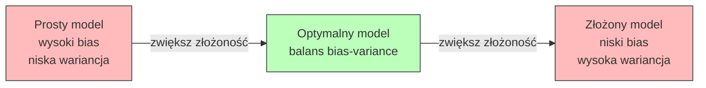
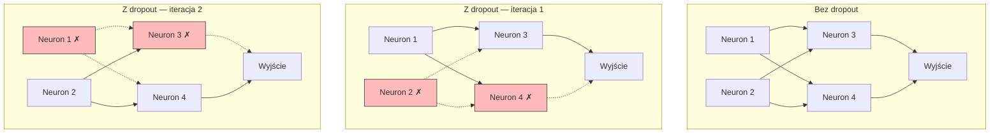
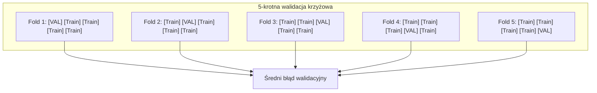
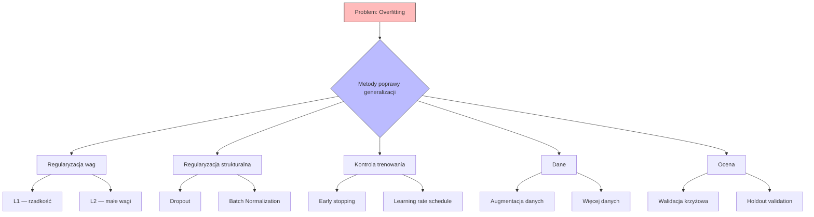

# Pytanie 18: Omówić zdolność generalizacji sieci neuronowych i metody poprawy tych zdolności.

## Kluczowe pojęcia

- **Generalizacja** — zdolność wytrenowanego modelu do poprawnego działania na nowych, niewidzianych wcześniej danych. Model o dobrej generalizacji uczy się ogólnych wzorców (prawidłowości) w danych, a nie zapamiętuje konkretnych przykładów treningowych. Generalizacja jest mierzona jako różnica między błędem na zbiorze treningowym a błędem na zbiorze testowym — im mniejsza różnica, tym lepsza generalizacja.
- **Overfitting (nadmierne dopasowanie)** — sytuacja, w której model zbyt dokładnie dopasowuje się do danych treningowych, ucząc się szumu i przypadkowych zależności zamiast ogólnych wzorców. Objawia się niskim błędem treningowym, ale wysokim błędem na danych testowych. Overfitting jest bardziej prawdopodobny, gdy model ma dużo parametrów w stosunku do ilości danych treningowych.
- **Underfitting (niedostateczne dopasowanie)** — sytuacja, w której model jest zbyt prosty, aby uchwycić rzeczywiste zależności w danych. Objawia się wysokim błędem zarówno na zbiorze treningowym, jak i testowym. Underfitting wskazuje na niewystarczającą pojemność modelu lub zbyt krótkie trenowanie.
- **Regularyzacja** — zbiór technik ograniczających złożoność modelu w celu poprawy generalizacji. Regularyzacja wprowadza dodatkowe ograniczenia lub kary na parametry modelu, zmuszając go do uczenia się prostszych (bardziej ogólnych) reprezentacji. Główne metody: regularyzacja L1/L2, dropout, early stopping, augmentacja danych.
- **Dropout** — technika regularyzacji polegająca na losowym wyłączaniu (zerowaniu) neuronów z prawdopodobieństwem $p$ podczas każdej iteracji trenowania. Zmusza sieć do uczenia się redundantnych reprezentacji — żaden neuron nie może polegać na obecności konkretnego innego neuronu. Podczas inferencji wszystkie neurony są aktywne, a ich wyjścia skalowane przez $(1 - p)$.
- **Early stopping (wczesne zatrzymanie)** — technika regularyzacji polegająca na monitorowaniu błędu na zbiorze walidacyjnym i zatrzymaniu trenowania, gdy błąd walidacyjny zaczyna rosnąć (mimo dalszego spadku błędu treningowego). Punkt zatrzymania odpowiada modelowi o najlepszej generalizacji. Jest to forma regularyzacji przez ograniczenie czasu trenowania.
- **Walidacja krzyżowa (cross-validation)** — metoda oceny generalizacji modelu polegająca na wielokrotnym podziale danych na zbiór treningowy i walidacyjny. W $k$-krotnej walidacji krzyżowej dane dzielone są na $k$ podzbiorów (foldów); model trenowany jest $k$ razy, za każdym razem z innym foldem jako zbiorem walidacyjnym. Średni błąd walidacyjny jest bardziej wiarygodną estymatą błędu generalizacji niż pojedynczy podział train/test.

## Problem nadmiernego dopasowania

### Czym jest generalizacja?

Celem uczenia sieci neuronowej nie jest minimalizacja błędu na zbiorze treningowym, lecz minimalizacja błędu na **nowych, niewidzianych danych**. Formalnie, szukamy modelu $f_\theta$, który minimalizuje oczekiwany błąd (ryzyko):

$$R(\theta) = \mathbb{E}_{(x,y) \sim P_{data}} \left[ L(f_\theta(x), y) \right]$$

gdzie $P_{data}$ to (nieznany) rozkład danych, a $L$ to funkcja kosztu. W praktyce mamy dostęp jedynie do skończonego zbioru treningowego $\{(x_i, y_i)\}_{i=1}^N$, więc minimalizujemy **ryzyko empiryczne**:

$$\hat{R}(\theta) = \frac{1}{N} \sum_{i=1}^{N} L(f_\theta(x_i), y_i)$$

Generalizacja to zdolność modelu do tego, aby $\hat{R}(\theta) \approx R(\theta)$ — błąd na danych treningowych był bliski błędowi na nowych danych.

### Overfitting vs underfitting

```
  Błąd
  │
  │ ╲                                    ╱
  │  ╲  underfitting    overfitting     ╱
  │   ╲    zone            zone        ╱
  │    ╲                              ╱  ← błąd testowy
  │     ╲                            ╱
  │      ╲                          ╱
  │       ╲        ╱───────────╲   ╱
  │        ╲      ╱             ╲ ╱
  │         ╲    ╱    optimum    ╳
  │          ╲  ╱                 ╲
  │           ╲╱                   ╲
  │            ╲                    ╲  ← błąd treningowy
  │             ╲                    ╲
  └──────────────────────────────────────
                Złożoność modelu →
```

| Stan | Błąd treningowy | Błąd testowy | Przyczyna | Rozwiązanie |
|---|---|---|---|---|
| **Underfitting** | Wysoki | Wysoki | Model zbyt prosty | Zwiększ pojemność modelu |
| **Dobre dopasowanie** | Niski | Niski | Optymalna złożoność | — |
| **Overfitting** | Bardzo niski | Wysoki | Model zbyt złożony | Regularyzacja |

### Czynniki sprzyjające overfittingowi

1. **Duża pojemność modelu** — zbyt wiele parametrów w stosunku do ilości danych (np. sieć z milionami wag trenowana na tysiącach przykładów)
2. **Mała ilość danych treningowych** — model nie ma wystarczająco dużo przykładów, aby nauczyć się ogólnych wzorców
3. **Zbyt długie trenowanie** — model zaczyna zapamiętywać szum w danych treningowych
4. **Brak regularyzacji** — model nie ma ograniczeń na złożoność
5. **Szum w danych** — błędne etykiety lub zaszumione cechy, które model próbuje dopasować

## Kompromis bias-variance

### Dekompozycja błędu

Oczekiwany błąd modelu na nowych danych można rozłożyć na trzy składniki:

$$\mathbb{E}\left[(y - f_\theta(x))^2\right] = \underbrace{\text{Bias}^2(f_\theta)}_{\text{błąd systematyczny}} + \underbrace{\text{Var}(f_\theta)}_{\text{wariancja}} + \underbrace{\sigma^2}_{\text{szum nieredukowalny}}$$

gdzie:
- **Bias (obciążenie)** — błąd wynikający z uproszczeń modelu. Wysoki bias oznacza, że model nie potrafi uchwycić rzeczywistych zależności (underfitting). Formalnie: $\text{Bias}(f_\theta) = \mathbb{E}[f_\theta(x)] - f_{true}(x)$
- **Variance (wariancja)** — wrażliwość modelu na konkretny zbiór treningowy. Wysoka wariancja oznacza, że model daje bardzo różne wyniki dla różnych zbiorów treningowych (overfitting). Formalnie: $\text{Var}(f_\theta) = \mathbb{E}\left[(f_\theta(x) - \mathbb{E}[f_\theta(x)])^2\right]$
- **Szum nieredukowalny** $\sigma^2$ — wewnętrzna losowość danych, której żaden model nie może wyeliminować

### Kompromis bias-variance



| Złożoność modelu | Bias | Variance | Błąd całkowity | Stan |
|---|---|---|---|---|
| Niska (np. regresja liniowa) | Wysoki | Niska | Wysoki | Underfitting |
| Optymalna | Umiarkowany | Umiarkowana | Minimalny | Dobre dopasowanie |
| Wysoka (np. głęboka sieć bez regularyzacji) | Niski | Wysoka | Wysoki | Overfitting |

Celem regularyzacji jest przesunięcie modelu w stronę optymalnego punktu — nieznaczne zwiększenie biasu w zamian za znaczące zmniejszenie wariancji, co prowadzi do niższego błędu całkowitego.

## Metody regularyzacji

### 1. Regularyzacja L2 (weight decay, kara Tichonowa)

Regularyzacja L2 dodaje do funkcji kosztu karę proporcjonalną do sumy kwadratów wag:

$$L_{reg}(\theta) = L(\theta) + \frac{\lambda}{2} \sum_{i} w_i^2 = L(\theta) + \frac{\lambda}{2} \|\mathbf{w}\|_2^2$$

gdzie $\lambda > 0$ to współczynnik regularyzacji (hiperparametr).

**Wpływ na gradient:**

$$\frac{\partial L_{reg}}{\partial w_i} = \frac{\partial L}{\partial w_i} + \lambda w_i$$

**Reguła aktualizacji wag:**

$$w_i \leftarrow w_i - \eta \left(\frac{\partial L}{\partial w_i} + \lambda w_i\right) = (1 - \eta\lambda) w_i - \eta \frac{\partial L}{\partial w_i}$$

Czynnik $(1 - \eta\lambda)$ powoduje, że wagi są mnożone przez wartość mniejszą od 1 w każdym kroku — stąd nazwa „weight decay" (zanikanie wag).

**Właściwości L2:**
- Preferuje wagi o małych wartościach (rozkład wag zbliżony do gaussowskiego)
- Nie wymusza zerowania wag — wszystkie wagi są małe, ale niezerowe
- Odpowiada założeniu a priori, że wagi mają rozkład normalny $w_i \sim \mathcal{N}(0, \frac{1}{\lambda})$ (interpretacja bayesowska)
- Wygładza funkcję decyzyjną modelu, zmniejszając wrażliwość na szum

### 2. Regularyzacja L1 (LASSO)

Regularyzacja L1 dodaje karę proporcjonalną do sumy wartości bezwzględnych wag:

$$L_{reg}(\theta) = L(\theta) + \lambda \sum_{i} |w_i| = L(\theta) + \lambda \|\mathbf{w}\|_1$$

**Wpływ na gradient (subgradient):**

$$\frac{\partial L_{reg}}{\partial w_i} = \frac{\partial L}{\partial w_i} + \lambda \cdot \text{sign}(w_i)$$

**Właściwości L1:**
- Wymusza **rzadkość** (sparsity) — wiele wag jest dokładnie zerowych
- Działa jak automatyczna selekcja cech — nieistotne wagi są eliminowane
- Odpowiada założeniu a priori, że wagi mają rozkład Laplace'a
- Gradient kary jest stały ($\pm\lambda$), niezależnie od wielkości wagi

### Porównanie L1 i L2

```
  Kara L1: |w|                    Kara L2: w²
  │                               │
  │╲                 ╱            │         ╱
  │ ╲               ╱             │        ╱
  │  ╲             ╱              │       ╱
  │   ╲           ╱               │      ╱
  │    ╲         ╱                │     ╱
  │     ╲       ╱                 │    ╱
  │      ╲     ╱                  │   ╱
  │       ╲   ╱                   │  ╱
  │        ╲ ╱                    │ ╱
  └─────────╳──────── w           └╱──────────── w
            0                     0

  L1: stały gradient → wymusza    L2: gradient ∝ w → zmniejsza
  zerowanie małych wag            duże wagi, nie zeruje
```

| Cecha | L1 | L2 |
|---|---|---|
| Kara | $\lambda \sum \|w_i\|$ | $\frac{\lambda}{2} \sum w_i^2$ |
| Gradient kary | $\lambda \cdot \text{sign}(w_i)$ | $\lambda \cdot w_i$ |
| Efekt na wagi | Rzadkość (wiele zer) | Małe, ale niezerowe |
| Selekcja cech | Tak (automatyczna) | Nie |
| Interpretacja bayesowska | Prior Laplace'a | Prior gaussowski |
| Zastosowanie | Selekcja cech, modele rzadkie | Ogólna regularyzacja |

### 3. Dropout

Dropout to technika regularyzacji zaproponowana przez Srivastava et al. (2014), polegająca na losowym wyłączaniu neuronów podczas trenowania.

**Algorytm:**

Podczas każdej iteracji trenowania, dla każdego neuronu w warstwie:
1. Wylosuj maskę binarną $\mathbf{m} \sim \text{Bernoulli}(1 - p)$, gdzie $p$ to prawdopodobieństwo wyłączenia (dropout rate)
2. Pomnóż wyjścia neuronów przez maskę: $\tilde{\mathbf{h}} = \mathbf{m} \odot \mathbf{h}$
3. Podczas inferencji (testowania) — użyj wszystkich neuronów, ale przeskaluj wyjścia: $\mathbf{h}_{test} = (1 - p) \cdot \mathbf{h}$

**Alternatywnie — inverted dropout** (stosowany w praktyce):
- Podczas trenowania: $\tilde{\mathbf{h}} = \frac{1}{1-p} \cdot \mathbf{m} \odot \mathbf{h}$ (skalowanie podczas trenowania)
- Podczas inferencji: $\mathbf{h}_{test} = \mathbf{h}$ (bez zmian)

```
Pseudokod: Dropout (inverted)
─────────────────────────────
Wejście: h (wyjścia warstwy), p (dropout rate), tryb (train/test)

JEŚLI tryb == train:
    m ← losowa maska binarna, P(m_i = 1) = 1 - p
    h_out ← (m ⊙ h) / (1 - p)        // skalowanie inverted
JEŚLI tryb == test:
    h_out ← h                          // bez zmian

ZWRÓĆ h_out
```

**Dlaczego dropout działa?**



1. **Zapobiega ko-adaptacji** — neurony nie mogą polegać na obecności konkretnych innych neuronów, więc muszą uczyć się niezależnych, użytecznych cech
2. **Ensemble implicitny** — dropout jest aproksymacją uśredniania predykcji z wykładniczo wielu podsieci (każda maska definiuje inną podsieć)
3. **Dodaje szum** — losowe wyłączanie neuronów działa jak szum regularyzujący, utrudniając zapamiętywanie danych treningowych

**Typowe wartości dropout rate:**
- Warstwy ukryte: $p = 0.5$ (wyłączenie 50% neuronów)
- Warstwa wejściowa: $p = 0.2$ (wyłączenie 20% cech wejściowych)
- Warstwy konwolucyjne: $p = 0.25$ (mniejszy dropout, bo mniej parametrów na filtr)

### 4. Early stopping (wczesne zatrzymanie)

Early stopping to technika regularyzacji polegająca na monitorowaniu błędu na zbiorze walidacyjnym i zatrzymaniu trenowania w momencie, gdy błąd walidacyjny zaczyna rosnąć.

**Algorytm:**

```
Pseudokod: Early Stopping
─────────────────────────────
Wejście: patience (liczba epok tolerancji), dane treningowe, dane walidacyjne

best_val_loss ← ∞
best_weights ← w₀
counter ← 0

DLA epoch = 1, 2, 3, ...:
    Trenuj model na danych treningowych
    val_loss ← oblicz błąd na zbiorze walidacyjnym

    JEŚLI val_loss < best_val_loss:
        best_val_loss ← val_loss
        best_weights ← kopia bieżących wag
        counter ← 0
    W PRZECIWNYM RAZIE:
        counter ← counter + 1

    JEŚLI counter ≥ patience:
        Przywróć best_weights
        ZAKOŃCZ trenowanie

ZWRÓĆ best_weights
```

**Interpretacja jako regularyzacja:**

Early stopping ogranicza liczbę kroków optymalizacji, co jest równoważne ograniczeniu „odległości" wag od punktu inicjalizacji. Dla SGD z małym learning rate, early stopping jest aproksymacyjnie równoważny regularyzacji L2 z $\lambda \approx \frac{1}{\eta \cdot t}$, gdzie $t$ to liczba kroków.

```
  Błąd
  │
  │╲
  │ ╲  błąd walidacyjny
  │  ╲         ╱──────────
  │   ╲       ╱
  │    ╲     ╱
  │     ╲   ╱
  │      ╲ ╱
  │       ╳ ← punkt early stopping
  │      ╱ ╲
  │     ╱   ╲
  │    ╱     ╲  błąd treningowy
  │   ╱       ╲──────────────
  │  ╱
  └──────────────────────────── Epoki
         ↑
    best epoch
```

**Parametr patience:**
- Zbyt mały patience → przedwczesne zatrzymanie (underfitting)
- Zbyt duży patience → opóźnione zatrzymanie (overfitting)
- Typowe wartości: 5–20 epok

### 5. Augmentacja danych (data augmentation)

Augmentacja danych to technika zwiększania efektywnego rozmiaru zbioru treningowego przez stosowanie transformacji zachowujących etykietę.

**Typowe transformacje (dla obrazów):**

| Transformacja | Opis | Przykład |
|---|---|---|
| Obrót | Losowy obrót o kąt $\alpha \in [-30°, 30°]$ | Rozpoznawanie obiektów |
| Odbicie | Lustrzane odbicie (poziome/pionowe) | Klasyfikacja obrazów |
| Przycięcie | Losowe wycięcie fragmentu | Detekcja obiektów |
| Skalowanie | Losowa zmiana rozmiaru | Rozpoznawanie twarzy |
| Zmiana kolorów | Losowa zmiana jasności, kontrastu, nasycenia | Klasyfikacja scen |
| Szum | Dodanie szumu gaussowskiego | Odszumianie |
| Mixup | Liniowa interpolacja dwóch obrazów i etykiet | Ogólna regularyzacja |
| Cutout | Losowe wyzerowanie prostokątnego regionu | Klasyfikacja |

**Dlaczego augmentacja poprawia generalizację?**
- Zwiększa efektywny rozmiar zbioru treningowego
- Wymusza niezmienniczość modelu na transformacje (np. obrót, przesunięcie)
- Redukuje overfitting przez zwiększenie różnorodności danych
- Jest formą regularyzacji — model musi uczyć się cech odpornych na perturbacje

### 6. Walidacja krzyżowa (cross-validation)

Walidacja krzyżowa to metoda oceny generalizacji modelu, która pozwala na bardziej wiarygodną estymację błędu niż pojedynczy podział train/test.

**$k$-krotna walidacja krzyżowa:**



**Algorytm:**
1. Podziel dane na $k$ równych podzbiorów (foldów)
2. Dla $i = 1, 2, \ldots, k$:
   - Użyj foldu $i$ jako zbioru walidacyjnego
   - Użyj pozostałych $k-1$ foldów jako zbioru treningowego
   - Wytrenuj model i oblicz błąd walidacyjny $e_i$
3. Estymata błędu generalizacji: $\hat{e} = \frac{1}{k} \sum_{i=1}^{k} e_i$

**Warianty:**
- **$k = 5$ lub $k = 10$** — standardowy wybór, dobry kompromis między obciążeniem a wariancją estymaty
- **Leave-One-Out (LOO)** — $k = N$ (każdy przykład jest raz zbiorem walidacyjnym). Niska obciążenie, ale wysoka wariancja i kosztowne obliczeniowo
- **Stratified $k$-fold** — zachowuje proporcje klas w każdym foldzie (ważne dla niezbalansowanych zbiorów)

## Przykłady

### Krzywe uczenia — train vs validation loss

Krzywe uczenia to wykresy błędu treningowego i walidacyjnego w funkcji epok trenowania. Pozwalają diagnozować overfitting i underfitting.

```
Przypadek 1: Dobre dopasowanie       Przypadek 2: Overfitting
  Błąd                                  Błąd
  │                                     │
  │╲                                    │╲
  │ ╲  val                              │ ╲  val
  │  ╲                                  │  ╲         ╱────
  │   ╲                                 │   ╲       ╱
  │    ╲───────────                     │    ╲     ╱
  │     ╲                               │     ╲   ╱
  │      ╲──────────  train             │      ╲ ╱
  │                                     │       ╳
  │  mała różnica                       │      ╱ ╲
  │  train ≈ val                        │     ╱   ╲──── train
  └────────────────── Epoki             └────────────────── Epoki
                                               ↑
                                          tu zatrzymaj (early stopping)

Przypadek 3: Underfitting              Przypadek 4: Więcej danych potrzebne
  Błąd                                  Błąd
  │                                     │
  │                                     │
  │──────────────── val                 │╲
  │                                     │ ╲  val
  │──────────────── train               │  ╲──────────────
  │                                     │   ╲
  │  oba błędy wysokie                  │    ╲
  │  model zbyt prosty                  │     ╲──────────── train
  │                                     │
  │                                     │  duża luka → więcej danych
  └────────────────── Epoki             └────────────────── Epoki
```

**Diagnostyka na podstawie krzywych uczenia:**

| Obserwacja | Diagnoza | Działanie |
|---|---|---|
| Oba błędy wysokie, zbliżone | Underfitting (wysoki bias) | Zwiększ pojemność modelu, trenuj dłużej |
| Błąd treningowy niski, walidacyjny wysoki | Overfitting (wysoka wariancja) | Regularyzacja, więcej danych, dropout |
| Oba błędy niskie, zbliżone | Dobre dopasowanie | Model gotowy |
| Duża luka, oba maleją | Za mało danych | Więcej danych, augmentacja |

### Efekt dropout — porównanie

Rozważmy sieć MLP z 2 warstwami ukrytymi (po 256 neuronów) trenowaną na zbiorze MNIST (60 000 obrazów cyfr):

| Konfiguracja | Błąd treningowy | Błąd testowy | Luka generalizacji |
|---|---|---|---|
| Bez regularyzacji | 0.2% | 2.1% | 1.9% |
| Dropout $p = 0.5$ | 1.5% | 1.4% | -0.1% |
| L2 ($\lambda = 10^{-4}$) | 0.8% | 1.6% | 0.8% |
| Dropout + L2 | 1.8% | 1.3% | -0.5% |

**Obserwacje:**
- Bez regularyzacji: model zapamiętuje dane treningowe (0.2% błędu), ale generalizuje słabo (2.1%)
- Dropout zwiększa błąd treningowy (1.5%), ale znacząco poprawia generalizację (1.4%)
- Kombinacja dropout + L2 daje najlepszą generalizację (1.3%)

### Zestawienie metod poprawy generalizacji



## Podsumowanie

1. **Generalizacja** to zdolność modelu do poprawnego działania na nowych, niewidzianych danych. Jest kluczowym kryterium jakości modelu — niski błąd treningowy bez dobrej generalizacji jest bezwartościowy.

2. **Overfitting** (nadmierne dopasowanie) objawia się niskim błędem treningowym i wysokim błędem testowym. Występuje, gdy model ma zbyt dużą pojemność w stosunku do ilości danych lub jest trenowany zbyt długo. **Underfitting** to sytuacja odwrotna — model jest zbyt prosty.

3. **Kompromis bias-variance** opisuje fundamentalny dylemat: proste modele mają wysoki bias (underfitting), złożone modele mają wysoką wariancję (overfitting). Celem jest znalezienie optymalnej złożoności minimalizującej błąd całkowity $= \text{Bias}^2 + \text{Variance} + \sigma^2$.

4. **Regularyzacja L2** (weight decay) dodaje karę $\frac{\lambda}{2}\|\mathbf{w}\|_2^2$ do funkcji kosztu, preferując małe wagi. **Regularyzacja L1** dodaje karę $\lambda\|\mathbf{w}\|_1$, wymuszając rzadkość (zerowanie nieistotnych wag).

5. **Dropout** losowo wyłącza neurony z prawdopodobieństwem $p$ podczas trenowania, zapobiegając ko-adaptacji neuronów i działając jak implicitny ensemble podsieci. Typowy dropout rate: $p = 0.5$ dla warstw ukrytych.

6. **Early stopping** monitoruje błąd walidacyjny i zatrzymuje trenowanie, gdy zaczyna rosnąć. Jest równoważny ograniczeniu odległości wag od inicjalizacji — formie regularyzacji przez ograniczenie czasu trenowania.

7. **Augmentacja danych** zwiększa efektywny rozmiar zbioru treningowego przez transformacje zachowujące etykietę (obroty, odbicia, szum), wymuszając niezmienniczość modelu.

8. **Walidacja krzyżowa** ($k$-fold) daje bardziej wiarygodną estymatę błędu generalizacji niż pojedynczy podział train/test, trenując model $k$ razy z różnymi podziałami danych.

## Powiązane pytania

- [Pytanie 16: Na czym polega idea i zasada algorytmu propagacji wstecznej w sieciach neuronowych?](16-backpropagation.md)
- [Pytanie 17: Algorytmy deterministyczne uczenia sieci neuronowych.](17-algorytmy-deterministyczne-uczenia.md)
- [Pytanie 21: Sieci płytkie i głębokie. Przedstawić podobieństwa i różnice.](21-sieci-plytkie-vs-glebokie.md)
- [Pytanie 22: Algorytmy uczenia sieci głębokich. Na czym polega problem zanikającego gradientu i jak jest rozwiązywany?](22-zanikajacy-gradient.md)