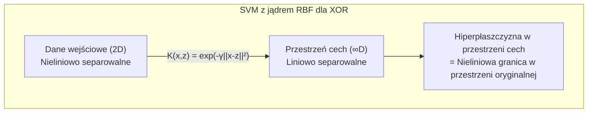

# Pytanie 19: Omówić istotę techniki uczenia opartej na wektorach podtrzymujących (sieci SVM).

## Kluczowe pojęcia

- **SVM (Support Vector Machine)** — algorytm uczenia nadzorowanego służący do klasyfikacji i regresji, którego celem jest znalezienie optymalnej hiperpłaszczyzny rozdzielającej klasy z maksymalnym marginesem. SVM opiera się na teorii uczenia statystycznego Vapnika i Czerwonenkisa. W odróżnieniu od sieci neuronowych, SVM rozwiązuje problem optymalizacji wypukłej, co gwarantuje znalezienie globalnego optimum.
- **Hiperpłaszczyzna** — w przestrzeni $n$-wymiarowej jest to $(n-1)$-wymiarowa podprzestrzeń afiniczna, która dzieli przestrzeń na dwie półprzestrzenie. W SVM hiperpłaszczyzna decyzyjna jest opisana równaniem $\mathbf{w}^T \mathbf{x} + b = 0$, gdzie $\mathbf{w}$ to wektor normalny (prostopadły do hiperpłaszczyzny), a $b$ to przesunięcie (bias). Dla danych 2D hiperpłaszczyzna jest prostą, dla 3D — płaszczyzną.
- **Margines** — odległość między hiperpłaszczyzną decyzyjną a najbliższymi punktami treningowymi z każdej klasy. Margines wynosi $\frac{2}{\|\mathbf{w}\|}$. SVM maksymalizuje margines, co zgodnie z teorią VC prowadzi do lepszej generalizacji — większy margines oznacza mniejsze ryzyko błędnej klasyfikacji nowych danych.
- **Wektory nośne (support vectors)** — punkty treningowe leżące najbliżej hiperpłaszczyzny decyzyjnej, na granicach marginesu. Spełniają warunek $y_i(\mathbf{w}^T \mathbf{x}_i + b) = 1$. Tylko wektory nośne wpływają na położenie hiperpłaszczyzny — usunięcie pozostałych punktów nie zmienia rozwiązania. Nazwa „wektory podtrzymujące" wynika z tego, że te punkty „podtrzymują" (definiują) margines.
- **Kernel trick (sztuczka jądrowa)** — technika umożliwiająca SVM klasyfikację danych nieliniowo separowalnych bez jawnego obliczania transformacji do przestrzeni wyższego wymiaru. Zamiast obliczać $\phi(\mathbf{x}_i)^T \phi(\mathbf{x}_j)$, stosuje się funkcję jądrową $K(\mathbf{x}_i, \mathbf{x}_j) = \phi(\mathbf{x}_i)^T \phi(\mathbf{x}_j)$, co jest obliczeniowo znacznie tańsze. Popularne jądra: liniowe, wielomianowe, RBF (Gaussowskie).
- **Soft margin** — rozszerzenie SVM na przypadek, gdy dane nie są idealnie separowalne. Wprowadza zmienne luzu (slack variables) $\xi_i \geq 0$, które pozwalają na naruszenie marginesu przez niektóre punkty. Parametr $C$ kontroluje kompromis między szerokością marginesu a liczbą naruszeń — duże $C$ oznacza mniejszą tolerancję na błędy (węższy margines), małe $C$ — większą tolerancję (szerszy margines).

## Idea SVM

### Intuicja geometryczna

Rozważmy problem klasyfikacji binarnej: mamy zbiór treningowy $\{(\mathbf{x}_i, y_i)\}_{i=1}^N$, gdzie $\mathbf{x}_i \in \mathbb{R}^n$ to wektor cech, a $y_i \in \{-1, +1\}$ to etykieta klasy. Celem jest znalezienie hiperpłaszczyzny $\mathbf{w}^T \mathbf{x} + b = 0$, która rozdziela klasy.

Istnieje wiele hiperpłaszczyzn rozdzielających dane liniowo separowalne. SVM wybiera tę, która **maksymalizuje margines** — odległość między hiperpłaszczyzną a najbliższymi punktami z każdej klasy.

```
  Klasa +1: ●          Klasa -1: ○

         ●                    ○
      ●     ●          ○         ○
    ●    ●    │    ○        ○
      ●       │  ○     ○
    ●     ●SV │SV○        ○
       ●      │    ○
      ●    ●  │  ○    ○
              │
    ←margines→│←margines→
              │
    w^T x + b = 1    w^T x + b = -1
              │
        w^T x + b = 0
        (hiperpłaszczyzna)
```

**Dlaczego maksymalny margines?**

Zgodnie z teorią Vapnika-Czerwonenkisa (teoria VC), klasyfikator o większym marginesie ma mniejszą wymiarowość VC, co oznacza lepszą zdolność generalizacji. Intuicyjnie — większy margines daje większy „bufor bezpieczeństwa" dla nowych punktów, zmniejszając ryzyko błędnej klasyfikacji.

### Klasyfikacja nowego punktu

Dla nowego punktu $\mathbf{x}$ decyzja klasyfikacyjna to:

$$\hat{y} = \text{sign}(\mathbf{w}^T \mathbf{x} + b)$$

- Jeśli $\mathbf{w}^T \mathbf{x} + b > 0$ → klasa $+1$
- Jeśli $\mathbf{w}^T \mathbf{x} + b < 0$ → klasa $-1$
- Wartość $|\mathbf{w}^T \mathbf{x} + b|$ jest proporcjonalna do odległości punktu od hiperpłaszczyzny (miara pewności klasyfikacji)

## Problem optymalizacji — maksymalizacja marginesu

### Sformułowanie pierwotne (hard margin)

Dla danych liniowo separowalnych, SVM rozwiązuje następujący problem optymalizacji:

$$\min_{\mathbf{w}, b} \frac{1}{2} \|\mathbf{w}\|^2$$

przy ograniczeniach:

$$y_i(\mathbf{w}^T \mathbf{x}_i + b) \geq 1, \quad i = 1, \ldots, N$$

**Interpretacja:**
- Minimalizacja $\frac{1}{2}\|\mathbf{w}\|^2$ jest równoważna maksymalizacji marginesu $\frac{2}{\|\mathbf{w}\|}$
- Ograniczenia zapewniają, że wszystkie punkty treningowe są poprawnie sklasyfikowane i leżą poza marginesem
- Jest to problem optymalizacji wypukłej (kwadratowej) z liniowymi ograniczeniami nierównościowymi

### Sformułowanie dualne i warunki KKT

Wprowadzając mnożniki Lagrange'a $\alpha_i \geq 0$, tworzymy lagranżjan:

$$\mathcal{L}(\mathbf{w}, b, \boldsymbol{\alpha}) = \frac{1}{2}\|\mathbf{w}\|^2 - \sum_{i=1}^{N} \alpha_i \left[ y_i(\mathbf{w}^T \mathbf{x}_i + b) - 1 \right]$$

**Warunki Karusha-Kuhna-Tuckera (KKT):**

1. **Stacjonarność:**

$$\frac{\partial \mathcal{L}}{\partial \mathbf{w}} = 0 \implies \mathbf{w} = \sum_{i=1}^{N} \alpha_i y_i \mathbf{x}_i$$

$$\frac{\partial \mathcal{L}}{\partial b} = 0 \implies \sum_{i=1}^{N} \alpha_i y_i = 0$$

2. **Dopuszczalność pierwotna:** $y_i(\mathbf{w}^T \mathbf{x}_i + b) \geq 1$

3. **Dopuszczalność dualna:** $\alpha_i \geq 0$

4. **Komplementarność:** $\alpha_i \left[ y_i(\mathbf{w}^T \mathbf{x}_i + b) - 1 \right] = 0$

Warunek komplementarności oznacza, że $\alpha_i > 0$ tylko dla punktów leżących na marginesie ($y_i(\mathbf{w}^T \mathbf{x}_i + b) = 1$) — to właśnie **wektory nośne**.

### Problem dualny

Podstawiając warunki stacjonarności do lagranżjanu, otrzymujemy **problem dualny**:

$$\max_{\boldsymbol{\alpha}} \sum_{i=1}^{N} \alpha_i - \frac{1}{2} \sum_{i=1}^{N} \sum_{j=1}^{N} \alpha_i \alpha_j y_i y_j \mathbf{x}_i^T \mathbf{x}_j$$

przy ograniczeniach:

$$\alpha_i \geq 0, \quad \sum_{i=1}^{N} \alpha_i y_i = 0$$

**Zalety sformułowania dualnego:**
- Dane wejściowe pojawiają się tylko jako iloczyny skalarne $\mathbf{x}_i^T \mathbf{x}_j$ — umożliwia to zastosowanie kernel trick
- Liczba zmiennych decyzyjnych to $N$ (liczba próbek), a nie $n$ (wymiar cech) — korzystne gdy $n \gg N$
- Problem jest wypukły (kwadratowy) — gwarantuje globalne optimum

### Odzyskanie parametrów

Po rozwiązaniu problemu dualnego:

$$\mathbf{w} = \sum_{i=1}^{N} \alpha_i y_i \mathbf{x}_i = \sum_{i \in SV} \alpha_i y_i \mathbf{x}_i$$

$$b = y_j - \mathbf{w}^T \mathbf{x}_j \quad \text{dla dowolnego } j \text{ takiego, że } \alpha_j > 0$$

Funkcja decyzyjna:

$$f(\mathbf{x}) = \text{sign}\left(\sum_{i \in SV} \alpha_i y_i \mathbf{x}_i^T \mathbf{x} + b\right)$$

## Kernel trick — SVM dla przypadku nieliniowego

### Problem nieliniowej separowalności

Wiele rzeczywistych zbiorów danych nie jest liniowo separowalnych w oryginalnej przestrzeni cech. Rozwiązaniem jest transformacja danych do przestrzeni wyższego wymiaru $\phi: \mathbb{R}^n \to \mathbb{R}^m$ ($m \gg n$), w której dane stają się liniowo separowalne.

```
Przestrzeń oryginalna (2D)          Przestrzeń cech (3D)
                                    
    ○ ○ ○ ○                              ●
   ○ ● ● ○                           ●     ●
   ○ ● ● ○         φ(x)            ●    ●    ●
   ○ ● ● ○        ──────→       ──────────────── hiperpłaszczyzna
    ○ ○ ○ ○                      ○  ○  ○  ○  ○
                                   ○  ○  ○  ○
  Nieliniowo                     Liniowo
  separowalne                    separowalne
```

### Sztuczka jądrowa (kernel trick)

W sformułowaniu dualnym SVM dane pojawiają się wyłącznie jako iloczyny skalarne $\mathbf{x}_i^T \mathbf{x}_j$. Po transformacji $\phi$ iloczyn skalarny to $\phi(\mathbf{x}_i)^T \phi(\mathbf{x}_j)$.

**Kluczowa obserwacja:** Nie musimy jawnie obliczać $\phi(\mathbf{x})$ — wystarczy znać funkcję jądrową:

$$K(\mathbf{x}_i, \mathbf{x}_j) = \phi(\mathbf{x}_i)^T \phi(\mathbf{x}_j)$$

Funkcja jądrowa oblicza iloczyn skalarny w przestrzeni cech **bez jawnej transformacji**. Jest to obliczeniowo znacznie tańsze, szczególnie gdy $\phi$ mapuje do przestrzeni nieskończenie wymiarowej.

**Problem dualny z jądrem:**

$$\max_{\boldsymbol{\alpha}} \sum_{i=1}^{N} \alpha_i - \frac{1}{2} \sum_{i=1}^{N} \sum_{j=1}^{N} \alpha_i \alpha_j y_i y_j K(\mathbf{x}_i, \mathbf{x}_j)$$

**Funkcja decyzyjna z jądrem:**

$$f(\mathbf{x}) = \text{sign}\left(\sum_{i \in SV} \alpha_i y_i K(\mathbf{x}_i, \mathbf{x}) + b\right)$$

### Popularne funkcje jądrowe

| Jądro | Wzór $K(\mathbf{x}, \mathbf{z})$ | Parametry | Zastosowanie |
|---|---|---|---|
| **Liniowe** | $\mathbf{x}^T \mathbf{z}$ | brak | Dane liniowo separowalne, duży wymiar cech |
| **Wielomianowe** | $(\gamma \mathbf{x}^T \mathbf{z} + r)^d$ | $\gamma, r, d$ | Dane z interakcjami cech do stopnia $d$ |
| **RBF (Gaussowskie)** | $\exp\left(-\gamma \|\mathbf{x} - \mathbf{z}\|^2\right)$ | $\gamma > 0$ | Ogólne zastosowanie, dane nieliniowe |
| **Sigmoidalne** | $\tanh(\gamma \mathbf{x}^T \mathbf{z} + r)$ | $\gamma, r$ | Analogia do sieci neuronowych |

### Jądro liniowe

$$K(\mathbf{x}, \mathbf{z}) = \mathbf{x}^T \mathbf{z}$$

- Brak transformacji — SVM działa w oryginalnej przestrzeni
- Szybkie obliczeniowo, dobrze działa dla danych wysokowymiarowych (np. klasyfikacja tekstu)
- Brak hiperparametrów jądra

### Jądro wielomianowe

$$K(\mathbf{x}, \mathbf{z}) = (\gamma \mathbf{x}^T \mathbf{z} + r)^d$$

**Przykład:** Dla $d = 2$, $\gamma = 1$, $r = 0$ i $\mathbf{x} = (x_1, x_2)$:

$$K(\mathbf{x}, \mathbf{z}) = (\mathbf{x}^T \mathbf{z})^2 = (x_1 z_1 + x_2 z_2)^2 = x_1^2 z_1^2 + 2 x_1 x_2 z_1 z_2 + x_2^2 z_2^2$$

co odpowiada transformacji $\phi(\mathbf{x}) = (x_1^2, \sqrt{2} x_1 x_2, x_2^2)$ — mapowanie z $\mathbb{R}^2$ do $\mathbb{R}^3$.

### Jądro RBF (Radial Basis Function)

$$K(\mathbf{x}, \mathbf{z}) = \exp\left(-\gamma \|\mathbf{x} - \mathbf{z}\|^2\right) = \exp\left(-\frac{\|\mathbf{x} - \mathbf{z}\|^2}{2\sigma^2}\right)$$

gdzie $\gamma = \frac{1}{2\sigma^2}$.

**Właściwości RBF:**
- Mapuje do przestrzeni **nieskończenie wymiarowej** (rozwinięcie w szereg Taylora eksponenty)
- $K(\mathbf{x}, \mathbf{x}) = 1$ dla każdego $\mathbf{x}$ — wszystkie punkty leżą na hipersferze jednostkowej w przestrzeni cech
- Parametr $\gamma$ kontroluje „szerokość" jądra:
  - Duże $\gamma$ → wąskie jądro → granica decyzyjna dopasowuje się do każdego punktu (ryzyko overfittingu)
  - Małe $\gamma$ → szerokie jądro → gładka granica decyzyjna (ryzyko underfittingu)

```
Wpływ parametru γ na granicę decyzyjną (jądro RBF):

  γ = 0.1 (szerokie)       γ = 1 (umiarkowane)      γ = 100 (wąskie)
  ┌──────────────┐         ┌──────────────┐          ┌──────────────┐
  │ ●  ●         │         │ ●  ●         │          │ ●  ●         │
  │    ●  ╱──────│         │    ● ╱─╲     │          │    ●╱╲       │
  │  ●   ╱      ○│         │  ●  ╱   ╲  ○ │          │  ● ╱  ╲  ○  │
  │ ●   ╱   ○  ○ │         │ ●  ╱  ○  ╲ ○ │          │ ● ╱ ○ ╱╲ ○  │
  │    ╱  ○   ○  │         │   ╱ ○   ○ ╲  │          │  ╱○  ╱  ╲○  │
  │   ╱    ○     │         │  ╱   ○    ╲  │          │ ╱  ○╱    ╲   │
  └──────────────┘         └──────────────┘          └──────────────┘
  Underfitting              Dobre dopasowanie         Overfitting
```

### Warunek Mercera

Funkcja $K(\mathbf{x}, \mathbf{z})$ jest poprawnym jądrem (odpowiada iloczynowi skalarnemu w pewnej przestrzeni cech) wtedy i tylko wtedy, gdy macierz Grama $\mathbf{G}_{ij} = K(\mathbf{x}_i, \mathbf{x}_j)$ jest **symetryczna i dodatnio półokreślona** dla dowolnego zbioru punktów $\{\mathbf{x}_1, \ldots, \mathbf{x}_N\}$.

## Soft margin — SVM dla danych nieseparowalnych

### Motywacja

W praktyce dane rzadko są idealnie liniowo separowalne (nawet po transformacji jądrowej). Mogą zawierać:
- **Szum** — błędnie zaetykietowane punkty
- **Nakładające się klasy** — punkty z różnych klas w tym samym regionie przestrzeni
- **Outlierzy** — punkty oddalone od reszty swojej klasy

Hard margin SVM nie ma rozwiązania dla takich danych. Soft margin SVM rozwiązuje ten problem, pozwalając na kontrolowane naruszenia marginesu.

### Sformułowanie soft margin

Wprowadzamy **zmienne luzu** (slack variables) $\xi_i \geq 0$:

$$\min_{\mathbf{w}, b, \boldsymbol{\xi}} \frac{1}{2} \|\mathbf{w}\|^2 + C \sum_{i=1}^{N} \xi_i$$

przy ograniczeniach:

$$y_i(\mathbf{w}^T \mathbf{x}_i + b) \geq 1 - \xi_i, \quad \xi_i \geq 0, \quad i = 1, \ldots, N$$

**Interpretacja zmiennych luzu:**
- $\xi_i = 0$ — punkt poprawnie sklasyfikowany, poza marginesem
- $0 < \xi_i < 1$ — punkt poprawnie sklasyfikowany, ale wewnątrz marginesu
- $\xi_i = 1$ — punkt leży dokładnie na hiperpłaszczyźnie decyzyjnej
- $\xi_i > 1$ — punkt błędnie sklasyfikowany

```
  Klasa +1: ●    Klasa -1: ○    SV: wektory nośne

         ●                         ○
      ●     ●               ○         ○
    ●    ●    │         ○        ○
      ●       │  ○ξ=0.3   ○              ← punkt wewnątrz marginesu
    ●     ●SV │SV○        ○
       ●      │    ○
      ●  ●ξ=1.2  ○    ○                  ← punkt błędnie sklasyfikowany
              │
    w^T x + b = 1    w^T x + b = -1
              │
        w^T x + b = 0
```

### Rola parametru C

Parametr $C > 0$ kontroluje kompromis między szerokością marginesu a tolerancją na błędy:

| Wartość $C$ | Margines | Tolerancja na błędy | Ryzyko |
|---|---|---|---|
| Małe $C$ (np. 0.01) | Szeroki | Duża (wiele naruszeń) | Underfitting |
| Umiarkowane $C$ | Optymalny | Umiarkowana | Dobre dopasowanie |
| Duże $C$ (np. 1000) | Wąski | Mała (mało naruszeń) | Overfitting |

**Przypadki graniczne:**
- $C \to \infty$ — soft margin redukuje się do hard margin (brak tolerancji na błędy)
- $C \to 0$ — margines jest maksymalnie szeroki, ale klasyfikacja może być bardzo niedokładna

### Problem dualny soft margin

$$\max_{\boldsymbol{\alpha}} \sum_{i=1}^{N} \alpha_i - \frac{1}{2} \sum_{i=1}^{N} \sum_{j=1}^{N} \alpha_i \alpha_j y_i y_j K(\mathbf{x}_i, \mathbf{x}_j)$$

przy ograniczeniach:

$$0 \leq \alpha_i \leq C, \quad \sum_{i=1}^{N} \alpha_i y_i = 0$$

Jedyna różnica w stosunku do hard margin to górne ograniczenie $\alpha_i \leq C$. Warunki KKT dla soft margin:

- $\alpha_i = 0$ → punkt poza marginesem (poprawnie sklasyfikowany, $\xi_i = 0$)
- $0 < \alpha_i < C$ → punkt na marginesie (wektor nośny, $\xi_i = 0$)
- $\alpha_i = C$ → punkt wewnątrz marginesu lub błędnie sklasyfikowany ($\xi_i > 0$)

## Algorytm SMO (Sequential Minimal Optimization)

W praktyce problem dualny SVM rozwiązuje się algorytmem **SMO** (Platt, 1998), który iteracyjnie optymalizuje pary mnożników $\alpha_i$:

```
Pseudokod: SMO (uproszczony)
─────────────────────────────
Wejście: dane {(x_i, y_i)}, parametr C, jądro K, tolerancja tol

Inicjalizuj: α_i ← 0 dla i = 1, ..., N; b ← 0

POWTARZAJ:
    changed ← 0
    DLA i = 1, ..., N:
        E_i ← f(x_i) - y_i                    // błąd predykcji
        JEŚLI narusza warunki KKT (z tolerancją tol):
            Wybierz j ≠ i (heurystycznie, max |E_i - E_j|)
            Oblicz granice L, H dla α_j
            JEŚLI L == H: KONTYNUUJ
            η ← 2K(x_i, x_j) - K(x_i, x_i) - K(x_j, x_j)
            JEŚLI η ≥ 0: KONTYNUUJ
            α_j^new ← α_j - y_j(E_i - E_j) / η
            α_j^new ← obetnij do [L, H]
            α_i^new ← α_i + y_i y_j (α_j^old - α_j^new)
            Aktualizuj b
            changed ← changed + 1

DOPÓKI changed > 0

ZWRÓĆ α, b
```

**Złożoność obliczeniowa SVM:**

| Aspekt | Złożoność |
|---|---|
| Trenowanie (ogólne QP) | $O(N^3)$ |
| Trenowanie (SMO) | $O(N^2)$ w praktyce |
| Predykcja | $O(N_{SV} \cdot n)$ |
| Pamięć (macierz jądra) | $O(N^2)$ |

gdzie $N$ — liczba próbek, $n$ — wymiar cech, $N_{SV}$ — liczba wektorów nośnych.

## Przykłady

### Klasyfikacja 2D z wizualizacją hiperpłaszczyzny i wektorów nośnych

Rozważmy zbiór 8 punktów w $\mathbb{R}^2$ z dwoma klasami:

| Punkt | $x_1$ | $x_2$ | Klasa $y$ |
|---|---|---|---|
| $\mathbf{x}_1$ | 1 | 3 | +1 |
| $\mathbf{x}_2$ | 2 | 3 | +1 |
| $\mathbf{x}_3$ | 1 | 2 | +1 |
| $\mathbf{x}_4$ | 2 | 1 | +1 |
| $\mathbf{x}_5$ | 4 | 3 | -1 |
| $\mathbf{x}_6$ | 5 | 2 | -1 |
| $\mathbf{x}_7$ | 4 | 1 | -1 |
| $\mathbf{x}_8$ | 5 | 3 | -1 |

```
  x₂
  4│
   │
  3│  ●x₁  ●x₂    │    ○x₅     ○x₈
   │               │
  2│  ●x₃          │         ○x₆
   │               │
  1│     ●x₄       │    ○x₇
   │               │
  0└───────────────│──────────────── x₁
   0   1   2   3   │  4   5   6
                   │
             hiperpłaszczyzna
             w₁x₁ + w₂x₂ + b = 0
```

**Rozwiązanie SVM (jądro liniowe):**

1. Hiperpłaszczyzna decyzyjna: $x_1 = 3$ (uproszczenie: $w_1 = 1, w_2 = 0, b = -3$)
2. Margines: $\frac{2}{\|\mathbf{w}\|} = 2$
3. Wektory nośne: $\mathbf{x}_2 = (2, 3)$, $\mathbf{x}_4 = (2, 1)$ (klasa +1) oraz $\mathbf{x}_5 = (4, 3)$, $\mathbf{x}_7 = (4, 1)$ (klasa -1)
4. Granice marginesu: $x_1 = 2$ (klasa +1) i $x_1 = 4$ (klasa -1)

### Przykład z jądrem RBF — dane nieliniowe (XOR)

Problem XOR nie jest liniowo separowalny:

| Punkt | $x_1$ | $x_2$ | Klasa |
|---|---|---|---|
| A | 0 | 0 | +1 |
| B | 1 | 1 | +1 |
| C | 0 | 1 | -1 |
| D | 1 | 0 | -1 |

```
  x₂
  1│  ○C          ●B
   │
   │
  0│  ●A          ○D
   └──────────────── x₁
   0              1
```

SVM z jądrem liniowym nie rozwiąże tego problemu. Natomiast SVM z jądrem RBF ($\gamma = 1$) tworzy nieliniową granicę decyzyjną:



Macierz jądra RBF ($\gamma = 1$):

$$K_{ij} = \exp(-\|\mathbf{x}_i - \mathbf{x}_j\|^2)$$

$$\mathbf{K} = \begin{pmatrix} 1 & e^{-2} & e^{-1} & e^{-1} \\ e^{-2} & 1 & e^{-1} & e^{-1} \\ e^{-1} & e^{-1} & 1 & e^{-2} \\ e^{-1} & e^{-1} & e^{-2} & 1 \end{pmatrix}$$

Wszystkie 4 punkty są wektorami nośnymi — każdy punkt jest niezbędny do zdefiniowania granicy decyzyjnej.

### Porównanie SVM z innymi klasyfikatorami

| Cecha | SVM | Sieć neuronowa (MLP) | k-NN |
|---|---|---|---|
| Optymalizacja | Wypukła (globalne optimum) | Niewypukła (lokalne minima) | Brak trenowania |
| Generalizacja | Teoria VC, margines | Zależy od regularyzacji | Zależy od $k$ i metryki |
| Hiperparametry | $C$, jądro, $\gamma$ | Architektura, lr, regularyzacja | $k$, metryka |
| Skalowalność | $O(N^2)$–$O(N^3)$ | $O(N \cdot \text{parametry})$ | $O(N \cdot n)$ na predykcję |
| Interpretowalność | Wektory nośne | Niska (czarna skrzynka) | Intuicyjna (sąsiedzi) |
| Dane nieliniowe | Kernel trick | Warstwy ukryte | Naturalnie nieliniowy |

## Podsumowanie

1. **SVM** to algorytm klasyfikacji, który szuka optymalnej hiperpłaszczyzny rozdzielającej klasy z **maksymalnym marginesem**. Opiera się na solidnych podstawach teoretycznych (teoria VC) i rozwiązuje problem optymalizacji wypukłej, gwarantując globalne optimum.

2. **Problem optymalizacji** SVM polega na minimalizacji $\frac{1}{2}\|\mathbf{w}\|^2$ (równoważne maksymalizacji marginesu $\frac{2}{\|\mathbf{w}\|}$) przy ograniczeniach poprawnej klasyfikacji. Sformułowanie dualne z warunkami KKT ujawnia, że rozwiązanie zależy wyłącznie od **wektorów nośnych** — punktów leżących na granicy marginesu.

3. **Kernel trick** umożliwia klasyfikację danych nieliniowo separowalnych bez jawnego obliczania transformacji do przestrzeni wyższego wymiaru. Popularne jądra to: liniowe ($\mathbf{x}^T\mathbf{z}$), wielomianowe ($(\gamma\mathbf{x}^T\mathbf{z} + r)^d$) i RBF ($\exp(-\gamma\|\mathbf{x}-\mathbf{z}\|^2)$). Jądro RBF mapuje do przestrzeni nieskończenie wymiarowej.

4. **Soft margin** rozszerza SVM na dane nieseparowalne, wprowadzając zmienne luzu $\xi_i$ i parametr kary $C$. Duże $C$ → wąski margines, mało błędów (ryzyko overfittingu). Małe $C$ → szeroki margines, więcej błędów (ryzyko underfittingu).

5. **Warunki KKT** są kluczowe dla zrozumienia SVM: warunek komplementarności $\alpha_i[y_i(\mathbf{w}^T\mathbf{x}_i + b) - 1] = 0$ oznacza, że tylko wektory nośne ($\alpha_i > 0$) wpływają na rozwiązanie. Pozostałe punkty treningowe mogą być usunięte bez zmiany hiperpłaszczyzny.

6. W praktyce SVM trenuje się algorytmem **SMO**, który iteracyjnie optymalizuje pary mnożników Lagrange'a. SVM dobrze sprawdza się dla danych o umiarkowanej liczbie próbek i wysokim wymiarze cech (np. klasyfikacja tekstu, bioinformatyka).

## Powiązane pytania

- [Pytanie 15: Sztuczne sieci neuronowe: omówić sieci samoorganizujące i trenowane z nauczycielem.](15-sieci-samoorganizujace-vs-nauczyciel.md)
- [Pytanie 20: Wyjaśnić specyfikę zastosowania sieci neuronowych w charakterze klasyfikatora uniwersalnego aproksymatora.](20-klasyfikator-aproksymator.md)
- [Pytanie 26: Przedstawić algorytmy grupowania danych: klasyczne i rozmyte.](26-algorytmy-grupowania.md)
