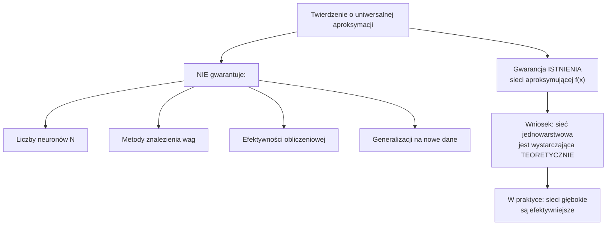
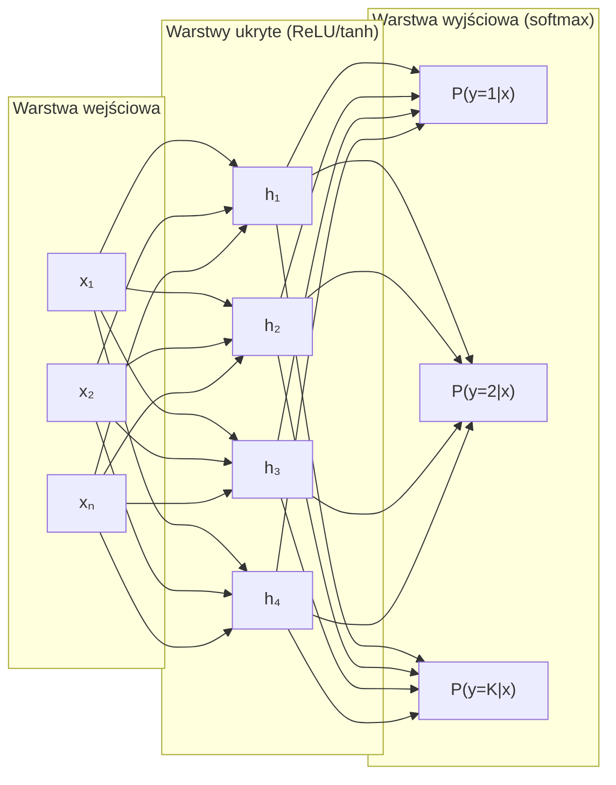
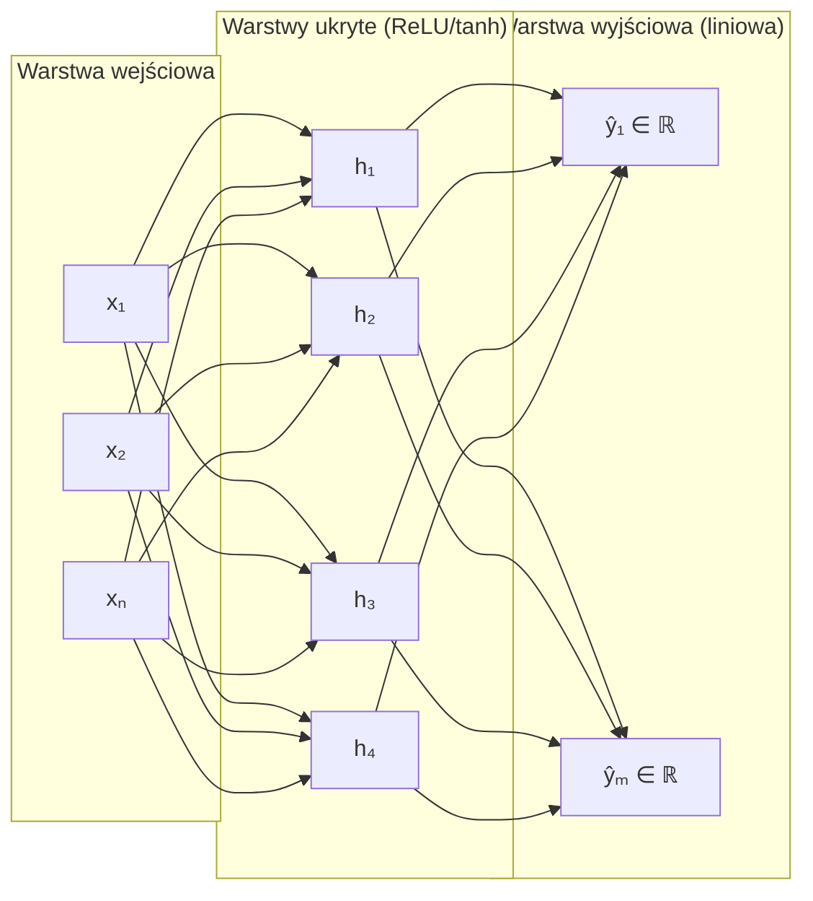

# Pytanie 20: Wyjaśnić specyfikę zastosowania sieci neuronowych w charakterze klasyfikatora uniwersalnego aproksymatora – podać przykłady obu rodzajów sieci.

## Kluczowe pojęcia

- **Klasyfikator** — model przypisujący dane wejściowe do jednej z predefiniowanych klas dyskretnych. Sieć neuronowa pełniąca rolę klasyfikatora na wyjściu generuje rozkład prawdopodobieństwa przynależności do poszczególnych klas. Warstwa wyjściowa zawiera tyle neuronów, ile jest klas, a funkcja aktywacji softmax normalizuje wyjścia do przedziału $[0, 1]$ z sumą równą 1. Decyzja klasyfikacyjna to $\hat{y} = \arg\max_k P(y = k \mid \mathbf{x})$.
- **Aproksymator uniwersalny** — model zdolny do przybliżenia dowolnej ciągłej funkcji $f: \mathbb{R}^n \to \mathbb{R}^m$ z dowolną dokładnością na zbiorze zwartym. Twierdzenie Cybenko (1989) i Hornka (1991) dowodzą, że sieć neuronowa z jedną warstwą ukrytą o wystarczającej liczbie neuronów i nieliniowej funkcji aktywacji jest aproksymatorem uniwersalnym. W praktyce sieć aproksymująca realizuje zadanie regresji — przewiduje wartości ciągłe.
- **Twierdzenie Cybenko** — twierdzenie z 1989 roku sformułowane przez George'a Cybenko, mówiące że sieć jednowarstwowa (feedforward) z sigmoidalną funkcją aktywacji w warstwie ukrytej i liniowym wyjściem może aproksymować dowolną ciągłą funkcję na zwartym podzbiorze $\mathbb{R}^n$ z dowolną dokładnością $\varepsilon > 0$, pod warunkiem wystarczającej liczby neuronów w warstwie ukrytej. Twierdzenie jest egzystencjalne — gwarantuje istnienie takiej sieci, ale nie podaje sposobu jej konstrukcji ani wymaganej liczby neuronów.
- **Softmax** — funkcja aktywacji stosowana w warstwie wyjściowej klasyfikatorów wieloklasowych. Przekształca wektor logitów $\mathbf{z} \in \mathbb{R}^K$ w rozkład prawdopodobieństwa: $\text{softmax}(z_i) = \frac{e^{z_i}}{\sum_{j=1}^{K} e^{z_j}}$. Gwarantuje, że wyjścia są nieujemne i sumują się do 1. Dla klasyfikacji binarnej ($K = 2$) softmax redukuje się do funkcji logistycznej (sigmoid).
- **Funkcja aktywacji** — nieliniowa transformacja stosowana do wyjścia neuronu, wprowadzająca nieliniowość do modelu. Bez funkcji aktywacji sieć wielowarstwowa byłaby równoważna pojedynczej transformacji liniowej. Popularne funkcje: sigmoid $\sigma(x) = \frac{1}{1+e^{-x}}$, tanh, ReLU $\max(0, x)$. Wybór funkcji aktywacji wpływa na zdolność aproksymacji, szybkość uczenia i problem zanikającego gradientu.

## Twierdzenie o uniwersalnej aproksymacji

### Sformułowanie twierdzenia Cybenko (1989)

Niech $\sigma: \mathbb{R} \to \mathbb{R}$ będzie ciągłą funkcją sigmoidalną (tj. $\sigma(x) \to 1$ gdy $x \to +\infty$ i $\sigma(x) \to 0$ gdy $x \to -\infty$). Wówczas dla dowolnej ciągłej funkcji $f: [0,1]^n \to \mathbb{R}$, dowolnego $\varepsilon > 0$ i dowolnego zwartego podzbioru $K \subset \mathbb{R}^n$ istnieje sieć jednowarstwowa postaci:

$$F(\mathbf{x}) = \sum_{i=1}^{N} \alpha_i \, \sigma(\mathbf{w}_i^T \mathbf{x} + b_i)$$

taka, że:

$$\sup_{\mathbf{x} \in K} |f(\mathbf{x}) - F(\mathbf{x})| < \varepsilon$$

gdzie $N$ to liczba neuronów w warstwie ukrytej, $\alpha_i$ to wagi wyjściowe, $\mathbf{w}_i$ to wektory wag wejściowych, a $b_i$ to biasy.

### Uogólnienie Hornka (1991)

Kurt Hornik rozszerzył twierdzenie Cybenko, pokazując że:
1. Twierdzenie zachodzi dla **dowolnej** niepolynomialnej funkcji aktywacji (nie tylko sigmoidalnej) — w tym ReLU, tanh, ELU itp.
2. Sieć jednowarstwowa jest **gęsta** w przestrzeni funkcji ciągłych $C(K)$ z normą supremum.
3. Kluczowa jest **nieliniowość** funkcji aktywacji, a nie jej konkretna postać.

### Implikacje i ograniczenia



**Kluczowe ograniczenia twierdzenia:**
- Twierdzenie jest **egzystencjalne** — mówi, że taka sieć istnieje, ale nie podaje algorytmu jej konstrukcji
- Wymagana liczba neuronów $N$ może rosnąć **wykładniczo** z wymiarem wejścia (przekleństwo wymiarowości)
- Twierdzenie dotyczy aproksymacji na zbiorze **zwartym** — nie gwarantuje ekstrapolacji
- Nie mówi nic o **generalizacji** — sieć może idealnie aproksymować dane treningowe, ale źle działać na nowych danych

## Sieci neuronowe jako klasyfikatory

### Architektura sieci klasyfikującej

Sieć klasyfikująca to sieć feedforward, której zadaniem jest przypisanie wektora wejściowego $\mathbf{x}$ do jednej z $K$ klas. Typowa architektura:



### Warstwa wyjściowa — softmax

Dla klasyfikacji wieloklasowej ($K > 2$) warstwa wyjściowa stosuje funkcję **softmax**:

$$P(y = k \mid \mathbf{x}) = \text{softmax}(z_k) = \frac{e^{z_k}}{\sum_{j=1}^{K} e^{z_j}}, \quad k = 1, \ldots, K$$

gdzie $z_k = \mathbf{w}_k^T \mathbf{h} + b_k$ to logit klasy $k$, a $\mathbf{h}$ to wyjście ostatniej warstwy ukrytej.

**Właściwości softmax:**
- $P(y = k \mid \mathbf{x}) \in (0, 1)$ dla każdego $k$
- $\sum_{k=1}^{K} P(y = k \mid \mathbf{x}) = 1$
- Softmax jest różniczkowalny — umożliwia propagację wsteczną
- Wzmacnia różnice między logitami — największy logit dominuje w rozkładzie

Dla klasyfikacji binarnej ($K = 2$) stosuje się jeden neuron wyjściowy z funkcją **sigmoid**:

$$P(y = 1 \mid \mathbf{x}) = \sigma(z) = \frac{1}{1 + e^{-z}}$$

### Funkcja kosztu — cross-entropy

Dla klasyfikacji stosuje się **entropię krzyżową** (cross-entropy) jako funkcję kosztu:

**Klasyfikacja wieloklasowa** (categorical cross-entropy):

$$\mathcal{L} = -\sum_{i=1}^{N} \sum_{k=1}^{K} y_{ik} \log P(y = k \mid \mathbf{x}_i)$$

gdzie $y_{ik}$ to etykieta one-hot (1 jeśli próbka $i$ należy do klasy $k$, 0 w przeciwnym razie).

**Klasyfikacja binarna** (binary cross-entropy):

$$\mathcal{L} = -\sum_{i=1}^{N} \left[ y_i \log \hat{y}_i + (1 - y_i) \log(1 - \hat{y}_i) \right]$$

**Dlaczego cross-entropy, a nie MSE?**
- Cross-entropy ma silniejszy gradient, gdy predykcja jest daleka od prawdy — szybsza zbieżność
- MSE z softmax/sigmoid prowadzi do plateau gradientu (gradient bliski zeru dla dużych błędów)
- Cross-entropy jest naturalną funkcją kosztu wynikającą z zasady maksymalnej wiarygodności (MLE) dla rozkładu kategorycznego

### Proces klasyfikacji — podsumowanie

| Element | Opis |
|---|---|
| **Wejście** | Wektor cech $\mathbf{x} \in \mathbb{R}^n$ |
| **Wyjście** | Rozkład prawdopodobieństwa $P(y = k \mid \mathbf{x})$ dla $k = 1, \ldots, K$ |
| **Aktywacja wyjściowa** | Softmax (wieloklasowa) lub sigmoid (binarna) |
| **Funkcja kosztu** | Cross-entropy |
| **Decyzja** | $\hat{y} = \arg\max_k P(y = k \mid \mathbf{x})$ |
| **Metryki** | Accuracy, precision, recall, F1-score, macierz pomyłek |

## Sieci neuronowe jako aproksymatory (regresja)

### Architektura sieci aproksymującej

Sieć aproksymująca (regresyjna) przewiduje wartości ciągłe $\hat{y} \in \mathbb{R}^m$. Kluczowa różnica w stosunku do klasyfikatora: warstwa wyjściowa ma **liniową** funkcję aktywacji (lub brak aktywacji).



### Warstwa wyjściowa — aktywacja liniowa

Wyjście sieci aproksymującej:

$$\hat{y}_j = \mathbf{w}_j^T \mathbf{h} + b_j, \quad j = 1, \ldots, m$$

Brak nieliniowej aktywacji na wyjściu pozwala sieci generować dowolne wartości rzeczywiste — niezbędne dla regresji, gdzie zakres wyjść nie jest ograniczony do $[0, 1]$.

**Warianty aktywacji wyjściowej w regresji:**
- **Liniowa (identyczność)** — standardowy wybór, $\hat{y} \in (-\infty, +\infty)$
- **ReLU** — gdy wyjście musi być nieujemne, $\hat{y} \in [0, +\infty)$
- **Sigmoid** — gdy wyjście musi być w przedziale $[0, 1]$ (np. prawdopodobieństwo)

### Funkcja kosztu — MSE (Mean Squared Error)

Dla regresji standardową funkcją kosztu jest **błąd średniokwadratowy**:

$$\mathcal{L}_{\text{MSE}} = \frac{1}{N} \sum_{i=1}^{N} \|\mathbf{y}_i - \hat{\mathbf{y}}_i\|^2 = \frac{1}{N} \sum_{i=1}^{N} \sum_{j=1}^{m} (y_{ij} - \hat{y}_{ij})^2$$

Alternatywne funkcje kosztu:
- **MAE** (Mean Absolute Error): $\frac{1}{N} \sum_{i=1}^{N} |\mathbf{y}_i - \hat{\mathbf{y}}_i|$ — bardziej odporna na outlierzy
- **Huber loss**: kombinacja MSE (dla małych błędów) i MAE (dla dużych błędów)

### Proces aproksymacji — podsumowanie

| Element | Opis |
|---|---|
| **Wejście** | Wektor cech $\mathbf{x} \in \mathbb{R}^n$ |
| **Wyjście** | Wartość ciągła $\hat{y} \in \mathbb{R}^m$ |
| **Aktywacja wyjściowa** | Liniowa (identyczność) |
| **Funkcja kosztu** | MSE, MAE lub Huber loss |
| **Decyzja** | Bezpośrednia wartość $\hat{y}$ |
| **Metryki** | MSE, RMSE, MAE, $R^2$ (współczynnik determinacji) |

## Różnice w architekturze i funkcjach kosztu

### Porównanie tabelaryczne

| Aspekt | Klasyfikator | Aproksymator (regresja) |
|---|---|---|
| **Typ wyjścia** | Klasa dyskretna $y \in \{1, \ldots, K\}$ | Wartość ciągła $y \in \mathbb{R}^m$ |
| **Neurony wyjściowe** | $K$ (liczba klas) | $m$ (wymiar wyjścia) |
| **Aktywacja wyjściowa** | Softmax / sigmoid | Liniowa (identyczność) |
| **Funkcja kosztu** | Cross-entropy | MSE / MAE |
| **Interpretacja wyjścia** | Prawdopodobieństwo $P(y=k \mid \mathbf{x})$ | Przewidywana wartość $\hat{y}$ |
| **Metryki oceny** | Accuracy, F1, AUC-ROC | RMSE, MAE, $R^2$ |
| **Granica decyzyjna** | Hiperpowierzchnia w przestrzeni cech | Nie dotyczy |
| **Warstwy ukryte** | ReLU, tanh, sigmoid | ReLU, tanh, sigmoid |
| **Uczenie** | Backpropagation + SGD/Adam | Backpropagation + SGD/Adam |

### Wspólne elementy

Mimo różnic w warstwie wyjściowej i funkcji kosztu, obie architektury dzielą:
1. **Warstwy ukryte** — identyczne (ReLU, tanh jako aktywacje)
2. **Algorytm uczenia** — propagacja wsteczna z optymalizatorem (SGD, Adam)
3. **Regularyzacja** — dropout, L2, early stopping
4. **Zdolność do aproksymacji nieliniowych zależności** — wynikająca z twierdzenia o uniwersalnej aproksymacji

## Przykłady

### Sieć klasyfikująca — rozpoznawanie cyfr MNIST

**Zadanie:** Klasyfikacja obrazów ręcznie pisanych cyfr (0-9) ze zbioru MNIST.

**Dane:**
- Wejście: obraz $28 \times 28$ pikseli (784 cechy po spłaszczeniu), wartości $\in [0, 1]$
- Wyjście: jedna z 10 klas ($K = 10$)
- Zbiór treningowy: 60 000 obrazów, testowy: 10 000 obrazów

**Architektura MLP dla MNIST:**

```
Warstwa wejściowa:    784 neuronów (28×28 pikseli)
                         │
Warstwa ukryta 1:     256 neuronów, aktywacja ReLU
                         │
Warstwa ukryta 2:     128 neuronów, aktywacja ReLU
                         │
Warstwa wyjściowa:     10 neuronów, aktywacja softmax
```

**Przepływ danych:**

$$\mathbf{x} \in \mathbb{R}^{784} \xrightarrow{\text{ReLU}} \mathbf{h}_1 \in \mathbb{R}^{256} \xrightarrow{\text{ReLU}} \mathbf{h}_2 \in \mathbb{R}^{128} \xrightarrow{\text{softmax}} \mathbf{p} \in \mathbb{R}^{10}$$

**Przykład predykcji:**

Dla obrazu cyfry „7":
- Logity: $\mathbf{z} = [-2.1, -1.5, 0.3, -0.8, -1.2, -0.5, -1.8, \mathbf{5.2}, -0.9, -1.1]$
- Po softmax: $\mathbf{p} = [0.001, 0.002, 0.012, 0.004, 0.003, 0.005, 0.001, \mathbf{0.960}, 0.003, 0.003]$
- Decyzja: $\hat{y} = \arg\max_k p_k = 7$ ✓

**Funkcja kosztu:**

$$\mathcal{L} = -\sum_{k=0}^{9} y_k \log p_k = -\log p_7 = -\log(0.960) \approx 0.041$$

**Typowe wyniki:** MLP osiąga ~98% accuracy na MNIST, CNN (LeNet-5) ~99.3%.

### Sieć aproksymująca — regresja funkcji

**Zadanie:** Aproksymacja funkcji $f(x) = \sin(x) \cdot e^{-0.1x}$ na przedziale $[0, 10]$.

**Dane:**
- Wejście: wartość $x \in [0, 10]$ (1 cecha)
- Wyjście: wartość $y = f(x) \in \mathbb{R}$ (1 wartość ciągła)
- Zbiór treningowy: 200 punktów z szumem gaussowskim $\mathcal{N}(0, 0.05)$

**Architektura MLP dla regresji:**

```
Warstwa wejściowa:      1 neuron (wartość x)
                           │
Warstwa ukryta 1:       32 neurony, aktywacja ReLU
                           │
Warstwa ukryta 2:       16 neuronów, aktywacja ReLU
                           │
Warstwa wyjściowa:       1 neuron, aktywacja LINIOWA
```

**Przepływ danych:**

$$x \in \mathbb{R} \xrightarrow{\text{ReLU}} \mathbf{h}_1 \in \mathbb{R}^{32} \xrightarrow{\text{ReLU}} \mathbf{h}_2 \in \mathbb{R}^{16} \xrightarrow{\text{liniowa}} \hat{y} \in \mathbb{R}$$

**Przykład predykcji:**

Dla $x = 3.0$:
- Wartość prawdziwa: $f(3.0) = \sin(3.0) \cdot e^{-0.3} \approx 0.141 \cdot 0.741 = 0.1045$
- Predykcja sieci: $\hat{y} = 0.108$
- Błąd: $|y - \hat{y}| = 0.0035$

**Funkcja kosztu:**

$$\mathcal{L}_{\text{MSE}} = \frac{1}{200} \sum_{i=1}^{200} (y_i - \hat{y}_i)^2$$

**Wizualizacja aproksymacji:**

```
  y
  1.0│     .
     │    . .        Legenda:
  0.5│   .   .       ─── f(x) = sin(x)·e^(-0.1x)
     │  .     .      ... predykcja sieci
  0.0│.────────.──────.──────────── x
     │          .    . .
 -0.5│           .  .   .  .
     │            ..     .. ..
 -1.0│
     └──────────────────────────
     0    2    4    6    8   10
```

### Porównanie obu przykładów

| Aspekt | MNIST (klasyfikacja) | Regresja $\sin(x) \cdot e^{-0.1x}$ |
|---|---|---|
| **Wejście** | $\mathbb{R}^{784}$ (obraz) | $\mathbb{R}^1$ (skalar) |
| **Wyjście** | 10 klas (cyfry 0-9) | $\mathbb{R}^1$ (wartość ciągła) |
| **Aktywacja wyjściowa** | Softmax | Liniowa |
| **Funkcja kosztu** | Cross-entropy | MSE |
| **Metryka sukcesu** | Accuracy = 98% | RMSE < 0.01 |
| **Interpretacja** | „To jest cyfra 7 z prawdopodobieństwem 96%" | „Wartość funkcji w punkcie 3.0 wynosi ~0.108" |

## Podsumowanie

1. **Twierdzenie o uniwersalnej aproksymacji** (Cybenko 1989, Hornik 1991) gwarantuje, że sieć neuronowa z jedną warstwą ukrytą i nieliniową funkcją aktywacji może przybliżyć dowolną ciągłą funkcję z dowolną dokładnością. Twierdzenie jest egzystencjalne — nie podaje wymaganej liczby neuronów ani metody znalezienia wag.

2. **Sieć jako klasyfikator** przypisuje dane do klas dyskretnych. Warstwa wyjściowa zawiera $K$ neuronów z aktywacją **softmax**, generując rozkład prawdopodobieństwa. Funkcja kosztu to **cross-entropy**, a decyzja to $\hat{y} = \arg\max_k P(y = k \mid \mathbf{x})$. Przykład: rozpoznawanie cyfr MNIST (10 klas).

3. **Sieć jako aproksymator** (regresor) przewiduje wartości ciągłe. Warstwa wyjściowa ma **liniową** aktywację, a funkcja kosztu to **MSE**. Sieć bezpośrednio modeluje zależność $\hat{y} = f(\mathbf{x})$. Przykład: aproksymacja funkcji matematycznej $\sin(x) \cdot e^{-0.1x}$.

4. **Kluczowa różnica** między klasyfikatorem a aproksymatorem leży w warstwie wyjściowej (softmax vs liniowa) i funkcji kosztu (cross-entropy vs MSE). Warstwy ukryte, algorytm uczenia (backpropagation) i metody regularyzacji są identyczne w obu przypadkach.

5. W praktyce sieci głębokie (wiele warstw) są efektywniejsze niż sieci płytkie (jedna warstwa ukryta), mimo że twierdzenie o uniwersalnej aproksymacji dotyczy sieci jednowarstwowych. Głębokość pozwala na hierarchiczną ekstrakcję cech i wymaga mniejszej łącznej liczby neuronów.

## Powiązane pytania

- [Pytanie 15: Sztuczne sieci neuronowe: omówić sieci samoorganizujące i trenowane z nauczycielem.](15-sieci-samoorganizujace-vs-nauczyciel.md)
- [Pytanie 19: Omówić istotę techniki uczenia opartej na wektorach podtrzymujących (sieci SVM).](19-svm.md)
- [Pytanie 21: Sieci płytkie i głębokie. Przedstawić podobieństwa i różnice.](21-sieci-plytkie-vs-glebokie.md)