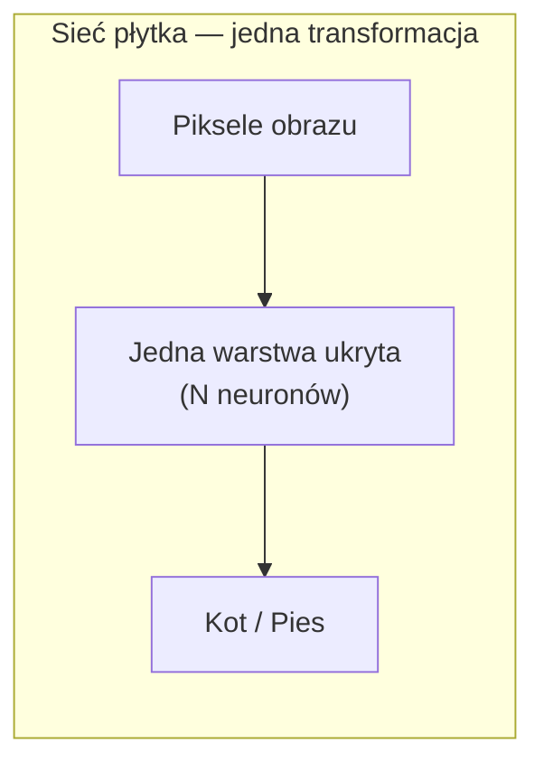
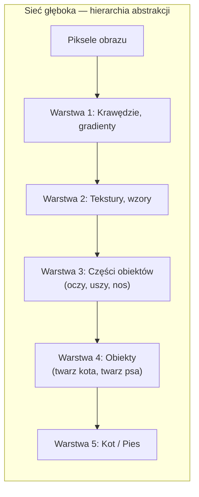
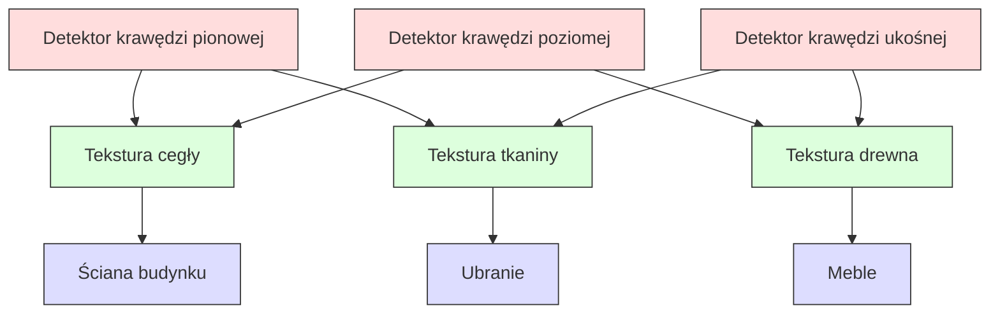
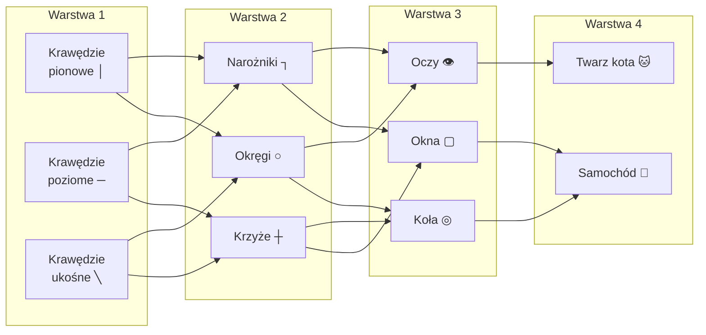
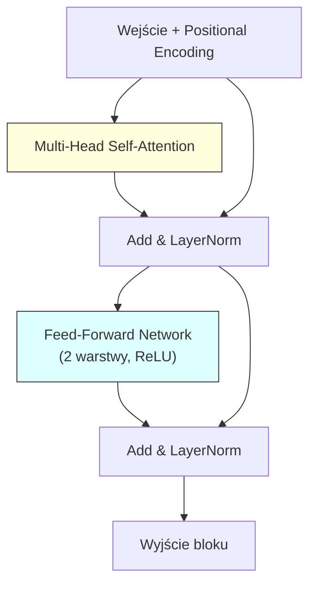

# Pytanie 21: Sieci płytkie i głębokie. Przedstawić podobieństwa i różnice. Skąd wynika potrzeba stosowania wielu warstw w sieciach głębokich?

## Kluczowe pojęcia

- **Sieć płytka** — sieć neuronowa posiadająca co najwyżej jedną lub dwie warstwy ukryte między warstwą wejściową a wyjściową. Klasycznym przykładem jest perceptron wielowarstwowy (MLP) z jedną warstwą ukrytą. Zgodnie z twierdzeniem Cybenko (1989) sieć płytka z wystarczającą liczbą neuronów w warstwie ukrytej jest uniwersalnym aproksymatorem — może przybliżyć dowolną ciągłą funkcję z dowolną dokładnością. W praktyce jednak wymagana liczba neuronów może rosnąć wykładniczo z wymiarem problemu, co czyni sieci płytkie nieefektywnymi dla złożonych zadań.
- **Sieć głęboka** — sieć neuronowa posiadająca wiele warstw ukrytych (typowo od kilku do kilkuset). Głębokość sieci umożliwia hierarchiczną ekstrakcję cech — każda kolejna warstwa uczy się coraz bardziej abstrakcyjnych reprezentacji danych wejściowych. Przykłady architektur głębokich: CNN (konwolucyjne), RNN (rekurencyjne), Transformer. Sieci głębokie stanowią fundament współczesnego uczenia głębokiego (deep learning).
- **Hierarchia cech** — kluczowa właściwość sieci głębokich polegająca na tym, że kolejne warstwy uczą się reprezentacji o rosnącym poziomie abstrakcji. W CNN: pierwsza warstwa wykrywa krawędzie, druga — tekstury i proste kształty, trzecia — części obiektów, kolejne — całe obiekty. Hierarchia cech pozwala sieci głębokiej na kompozycyjne budowanie złożonych pojęć z prostszych elementów.
- **Reprezentacja** — wewnętrzny sposób kodowania danych wejściowych przez sieć neuronową. Każda warstwa ukryta tworzy nową reprezentację (embedding) danych w przestrzeni o innym wymiarze. Jakość wyuczonych reprezentacji determinuje skuteczność sieci. Sieci głębokie uczą się reprezentacji automatycznie (representation learning), eliminując potrzebę ręcznego projektowania cech (feature engineering).
- **CNN (Convolutional Neural Network)** — architektura głęboka zaprojektowana do przetwarzania danych o strukturze siatkowej (obrazy, sygnały). Wykorzystuje warstwy konwolucyjne (filtry lokalne ze współdzielonymi wagami), warstwy poolingu (redukcja wymiarowości) i warstwy w pełni połączone. CNN naturalnie realizuje hierarchię cech: krawędzie → tekstury → części → obiekty. Przykłady: LeNet-5, AlexNet, VGG, ResNet, EfficientNet.
- **RNN (Recurrent Neural Network)** — architektura głęboka do przetwarzania danych sekwencyjnych (tekst, mowa, szeregi czasowe). Posiada połączenia zwrotne umożliwiające przechowywanie stanu (pamięci) z poprzednich kroków czasowych. Warianty: LSTM (Long Short-Term Memory) i GRU (Gated Recurrent Unit) rozwiązują problem zanikającego gradientu w długich sekwencjach. RNN jest „głęboka w czasie" — rozwinięcie w czasie tworzy głęboką sieć.
- **Transformer** — architektura głęboka oparta na mechanizmie uwagi (self-attention), bez rekurencji i konwolucji. Przetwarza całą sekwencję równolegle, co umożliwia efektywne trenowanie na GPU. Mechanizm uwagi pozwala modelować zależności na dowolnym dystansie w sekwencji. Fundament modeli językowych (BERT, GPT) i modeli wizyjnych (ViT). Typowy Transformer składa się z wielu warstw enkodera/dekodera (np. 12–96 warstw).

## Definicje i porównanie

### Sieć płytka — definicja formalna

Sieć płytka to sieć feedforward z co najwyżej jedną lub dwiema warstwami ukrytymi. Dla sieci z jedną warstwą ukrytą o $N$ neuronach, wyjście sieci ma postać:

$f(\mathbf{x}) = \mathbf{W}_2 \, \sigma(\mathbf{W}_1 \mathbf{x} + \mathbf{b}_1) + \mathbf{b}_2$

gdzie $\mathbf{W}_1 \in \mathbb{R}^{N \times d}$, $\mathbf{W}_2 \in \mathbb{R}^{m \times N}$, $\sigma$ to nieliniowa funkcja aktywacji, $d$ to wymiar wejścia, $m$ to wymiar wyjścia.

**Cechy sieci płytkiej:**
- Prosta architektura — łatwa do zrozumienia i implementacji
- Twierdzenie o uniwersalnej aproksymacji gwarantuje zdolność do przybliżenia dowolnej funkcji ciągłej
- Wymagana liczba neuronów $N$ może rosnąć **wykładniczo** z wymiarem i złożonością problemu
- Brak hierarchicznej ekstrakcji cech — sieć musi nauczyć się wszystkiego w jednej transformacji
- Dobrze sprawdza się w prostych zadaniach z niskim wymiarem danych

### Sieć głęboka — definicja formalna

Sieć głęboka to sieć feedforward z $L$ warstwami ukrytymi ($L \geq 3$, choć granica jest umowna). Wyjście sieci to kompozycja $L$ transformacji:

$f(\mathbf{x}) = f_L \circ f_{L-1} \circ \cdots \circ f_1(\mathbf{x})$

gdzie $f_l(\mathbf{h}) = \sigma(\mathbf{W}_l \mathbf{h} + \mathbf{b}_l)$ to transformacja $l$-tej warstwy.

**Cechy sieci głębokiej:**
- Hierarchiczna ekstrakcja cech — każda warstwa buduje na reprezentacji poprzedniej
- Efektywniejsza reprezentacja złożonych funkcji — wymaga mniejszej łącznej liczby parametrów niż sieć płytka
- Wymaga zaawansowanych technik trenowania (inicjalizacja, normalizacja, skip connections)
- Podatna na problemy zanikającego/eksplodującego gradientu
- Dominuje we współczesnych zastosowaniach AI (wizja komputerowa, NLP, mowa)

### Porównanie tabelaryczne

| Aspekt | Sieć płytka (1-2 warstwy ukryte) | Sieć głęboka (≥3 warstwy ukryte) |
|---|---|---|
| **Głębokość** | 1-2 warstwy ukryte | Kilka do kilkuset warstw |
| **Ekstrakcja cech** | Jednopoziomowa, „płaska" | Hierarchiczna, wielopoziomowa |
| **Uniwersalna aproksymacja** | Tak (tw. Cybenko) | Tak (a fortiori) |
| **Efektywność parametrów** | Niska — wymaga wielu neuronów | Wysoka — mniej parametrów łącznie |
| **Złożoność trenowania** | Prosta — mniej hiperparametrów | Złożona — wymaga specjalnych technik |
| **Problem gradientu** | Rzadko występuje | Zanikający/eksplodujący gradient |
| **Feature engineering** | Często wymagany ręcznie | Automatyczne uczenie cech |
| **Typowe zastosowania** | Proste klasyfikacje, regresja tabelaryczna | Wizja, NLP, mowa, gry, generacja |
| **Interpretowalność** | Wyższa | Niższa (czarna skrzynka) |
| **Czas trenowania** | Krótki | Długi (GPU/TPU) |
| **Ryzyko overfittingu** | Niższe (mniej parametrów) | Wyższe (wymaga regularyzacji) |

### Podobieństwa

Mimo różnic w głębokości, sieci płytkie i głębokie dzielą fundamentalne cechy:

1. **Podstawowa jednostka** — neuron obliczający $z = \sigma(\mathbf{w}^T \mathbf{x} + b)$
2. **Algorytm uczenia** — propagacja wsteczna (backpropagation) z optymalizatorem gradientowym
3. **Funkcje aktywacji** — ReLU, sigmoid, tanh (choć głębokie preferują ReLU)
4. **Zdolność aproksymacji** — obie mogą aproksymować dowolną funkcję ciągłą
5. **Funkcje kosztu** — cross-entropy (klasyfikacja), MSE (regresja)
6. **Regularyzacja** — dropout, L2, early stopping stosowane w obu typach
7. **Architektura feedforward** — dane przepływają od wejścia do wyjścia (w podstawowej wersji)

## Dlaczego głębokość pomaga — hierarchia abstrakcji

### Intuicja: kompozycja prostych funkcji

Kluczowa przewaga sieci głębokich wynika z faktu, że wiele naturalnych funkcji ma **strukturę kompozycyjną** — można je rozłożyć na hierarchię prostszych operacji. Sieć głęboka naturalnie modeluje tę strukturę, gdzie każda warstwa odpowiada jednemu poziomowi abstrakcji.





### Argument efektywności — wykładnicza oszczędność

Istnieją funkcje, które sieć głęboka z $O(n)$ neuronami może reprezentować, ale sieć płytka potrzebuje $O(2^n)$ neuronów. Klasyczny przykład:

**Funkcja parzystości** (XOR uogólniony) na $n$ bitach:

$f(x_1, \ldots, x_n) = x_1 \oplus x_2 \oplus \cdots \oplus x_n$

- **Sieć głęboka** (drzewo XOR): $O(n)$ neuronów w $O(\log n)$ warstwach — każda warstwa oblicza XOR par z poprzedniej warstwy
- **Sieć płytka** (jedna warstwa ukryta): wymaga $O(2^n)$ neuronów — musi jawnie wyliczyć wszystkie $2^n$ kombinacji wejść

Ten wynik (Håstad 1986, Eldan & Shamir 2016) formalnie uzasadnia, dlaczego głębokość jest kluczowa dla efektywnej reprezentacji.

### Hierarchia cech w praktyce

Sieci głębokie uczą się **hierarchii cech** (feature hierarchy), gdzie każda warstwa buduje coraz bardziej abstrakcyjne reprezentacje:

| Warstwa | Co się uczy | Przykład (obraz) | Przykład (tekst) |
|---|---|---|---|
| **1** | Cechy niskopoziomowe | Krawędzie, gradienty kolorów | Embeddingi słów |
| **2** | Kombinacje cech | Tekstury, proste kształty | Frazy, n-gramy |
| **3** | Części obiektów | Oczy, koła, okna | Zdania, klauzule |
| **4** | Obiekty | Twarze, samochody | Akapity, kontekst |
| **5+** | Sceny, relacje | Scena uliczna, wnętrze | Znaczenie dokumentu |

### Reużywalność cech

Głębokość umożliwia **reużywalność cech** (feature reuse) — cechy nauczone na niższych warstwach (np. detektory krawędzi) są współdzielone przez wiele cech wyższego poziomu. To prowadzi do:

1. **Mniejszej liczby parametrów** — cechy niskopoziomowe nie muszą być uczone wielokrotnie
2. **Lepszej generalizacji** — reużywalne cechy są bardziej uniwersalne
3. **Transfer learningu** — wytrenowane warstwy niższe można przenosić między zadaniami



### Manifold hypothesis

Dane rzeczywiste (obrazy, tekst, mowa) leżą na **rozmaitościach niskiego wymiaru** (low-dimensional manifolds) osadzonych w przestrzeni wysokowymiarowej. Sieci głębokie stopniowo „rozplątują" (disentangle) te rozmaitości:

- **Warstwa 1** — lekkie przekształcenie rozmaitości danych
- **Warstwa 2** — dalsze rozplątywanie splątanych klas
- **Warstwa $L$** — klasy są liniowo separowalne

Sieć płytka musi wykonać to rozplątanie w jednym kroku, co jest znacznie trudniejsze.

## Architektury głębokie

### CNN — Konwolucyjne Sieci Neuronowe

CNN to architektura głęboka zaprojektowana do przetwarzania danych o strukturze siatkowej (obrazy 2D, sygnały 1D, wideo 3D).

**Kluczowe warstwy CNN:**

| Warstwa | Funkcja | Parametry |
|---|---|---|
| **Konwolucyjna** | Ekstrakcja cech lokalnych za pomocą filtrów | Rozmiar filtra, liczba filtrów, stride, padding |
| **Pooling** | Redukcja wymiarowości, invariancja na translację | Rozmiar okna (np. 2×2), typ (max/average) |
| **Batch Normalization** | Stabilizacja trenowania, przyspieszenie zbieżności | Parametry $\gamma$, $\beta$ |
| **W pełni połączona** | Klasyfikacja na podstawie wyekstrahowanych cech | Liczba neuronów |

**Operacja konwolucji:**

Dla wejścia $\mathbf{X}$ i filtra $\mathbf{K}$ o rozmiarze $k \times k$:

$(\mathbf{X} * \mathbf{K})_{ij} = \sum_{p=0}^{k-1} \sum_{q=0}^{k-1} \mathbf{X}_{i+p, j+q} \cdot \mathbf{K}_{p,q}$

**Współdzielenie wag** (weight sharing) — ten sam filtr jest stosowany do wszystkich pozycji w obrazie, co drastycznie redukuje liczbę parametrów w porównaniu z warstwą w pełni połączoną.

**Wizualizacja hierarchii cech w CNN:**



**Ewolucja architektur CNN:**

| Architektura | Rok | Warstwy | Parametry | Top-5 error (ImageNet) |
|---|---|---|---|---|
| LeNet-5 | 1998 | 5 | 60 K | — |
| AlexNet | 2012 | 8 | 60 M | 15.3% |
| VGG-16 | 2014 | 16 | 138 M | 7.3% |
| GoogLeNet | 2014 | 22 | 6.8 M | 6.7% |
| ResNet-152 | 2015 | 152 | 60 M | 3.6% |
| EfficientNet-B7 | 2019 | 66 | 66 M | 2.9% |

### RNN — Rekurencyjne Sieci Neuronowe

RNN to architektura głęboka do przetwarzania danych sekwencyjnych, gdzie kolejność elementów ma znaczenie.

**Podstawowa komórka RNN:**

$\mathbf{h}_t = \sigma(\mathbf{W}_{hh} \mathbf{h}_{t-1} + \mathbf{W}_{xh} \mathbf{x}_t + \mathbf{b}_h)$

$\mathbf{y}_t = \mathbf{W}_{hy} \mathbf{h}_t + \mathbf{b}_y$

gdzie $\mathbf{h}_t$ to stan ukryty w kroku $t$, $\mathbf{x}_t$ to wejście, $\mathbf{y}_t$ to wyjście.

**Głębokość RNN:**
- **Głębokość w czasie** — rozwinięcie RNN w czasie tworzy głęboką sieć o liczbie warstw równej długości sekwencji
- **Głębokość w przestrzeni** — wielowarstwowe RNN (stacked RNN) z wieloma warstwami rekurencyjnymi

**LSTM (Long Short-Term Memory):**

LSTM rozwiązuje problem zanikającego gradientu w RNN poprzez mechanizm bramek:

- **Bramka zapominania** (forget gate): $\mathbf{f}_t = \sigma(\mathbf{W}_f [\mathbf{h}_{t-1}, \mathbf{x}_t] + \mathbf{b}_f)$
- **Bramka wejściowa** (input gate): $\mathbf{i}_t = \sigma(\mathbf{W}_i [\mathbf{h}_{t-1}, \mathbf{x}_t] + \mathbf{b}_i)$
- **Bramka wyjściowa** (output gate): $\mathbf{o}_t = \sigma(\mathbf{W}_o [\mathbf{h}_{t-1}, \mathbf{x}_t] + \mathbf{b}_o)$
- **Stan komórki**: $\mathbf{c}_t = \mathbf{f}_t \odot \mathbf{c}_{t-1} + \mathbf{i}_t \odot \tanh(\mathbf{W}_c [\mathbf{h}_{t-1}, \mathbf{x}_t] + \mathbf{b}_c)$

### Transformer

Transformer to architektura głęboka oparta wyłącznie na mechanizmie uwagi (attention), bez rekurencji i konwolucji.

**Mechanizm self-attention:**

$\text{Attention}(\mathbf{Q}, \mathbf{K}, \mathbf{V}) = \text{softmax}\left(\frac{\mathbf{Q}\mathbf{K}^T}{\sqrt{d_k}}\right) \mathbf{V}$

gdzie $\mathbf{Q}$ (query), $\mathbf{K}$ (key), $\mathbf{V}$ (value) to projekcje liniowe wejścia, a $d_k$ to wymiar klucza.

**Architektura bloku Transformera:**



**Przewagi Transformera:**
- **Równoległość** — przetwarza całą sekwencję jednocześnie (w przeciwieństwie do RNN)
- **Modelowanie zależności dalekiego zasięgu** — attention łączy dowolne pozycje w sekwencji
- **Skalowalność** — efektywne trenowanie na dużych zbiorach danych z GPU/TPU

**Zastosowania:**
- NLP: BERT (enkoder), GPT (dekoder), T5 (enkoder-dekoder)
- Wizja: ViT (Vision Transformer), DINO, Swin Transformer
- Multimodalne: CLIP, DALL-E, Stable Diffusion

### Porównanie architektur głębokich

| Aspekt | CNN | RNN/LSTM | Transformer |
|---|---|---|---|
| **Dane** | Obrazy, sygnały | Sekwencje, tekst | Sekwencje, obrazy, multimodalne |
| **Lokalność** | Lokalne filtry | Sekwencyjna | Globalna (attention) |
| **Równoległość** | Wysoka | Niska (sekwencyjna) | Wysoka |
| **Pamięć** | Brak stanu | Stan ukryty $\mathbf{h}_t$ | Attention na całą sekwencję |
| **Głębokość** | 5-152+ warstw | 1-8 warstw (+ czas) | 6-96+ warstw |
| **Kluczowa innowacja** | Współdzielenie wag, pooling | Bramki (LSTM/GRU) | Self-attention |

## Wyzwania trenowania sieci głębokich

Głębokość sieci wprowadza specyficzne problemy, które nie występują (lub są mniej dotkliwe) w sieciach płytkich:

### 1. Zanikający i eksplodujący gradient

Podczas propagacji wstecznej gradient jest mnożony przez wagi kolejnych warstw. Dla sieci o $L$ warstwach:

$\frac{\partial \mathcal{L}}{\partial \mathbf{W}_1} = \frac{\partial \mathcal{L}}{\partial \mathbf{h}_L} \cdot \prod_{l=2}^{L} \frac{\partial \mathbf{h}_l}{\partial \mathbf{h}_{l-1}} \cdot \frac{\partial \mathbf{h}_1}{\partial \mathbf{W}_1}$

Jeśli $\left\|\frac{\partial \mathbf{h}_l}{\partial \mathbf{h}_{l-1}}\right\| < 1$ dla wielu warstw, gradient zanika wykładniczo. Jeśli $> 1$, gradient eksploduje.

**Rozwiązania:**
- **ReLU** zamiast sigmoid/tanh — gradient nie zanika dla aktywacji > 0
- **Inicjalizacja He/Xavier** — odpowiednie skalowanie wag początkowych
- **Batch Normalization** — normalizacja aktywacji w każdej warstwie
- **Residual connections (skip connections)** — gradient przepływa bezpośrednio przez shortcut

### 2. Degradacja (degradation problem)

Paradoksalnie, dodawanie warstw do sieci głębokiej może **pogorszyć** wyniki — nawet na zbiorze treningowym. Nie jest to overfitting, lecz problem optymalizacji: głębsza sieć jest trudniejsza do wytrenowania.

**Rozwiązanie — ResNet (He et al., 2015):**

Zamiast uczyć się mapowania $\mathbf{h}_l = F(\mathbf{h}_{l-1})$, sieć uczy się **residuum**:

$\mathbf{h}_l = F(\mathbf{h}_{l-1}) + \mathbf{h}_{l-1}$

Skip connection dodaje wejście bloku do jego wyjścia. Jeśli optymalna transformacja jest bliska identyczności, sieć musi nauczyć się jedynie małego residuum $F(\mathbf{h}_{l-1}) \approx \mathbf{0}$, co jest łatwiejsze.

### 3. Koszt obliczeniowy

Sieci głębokie wymagają znacznych zasobów obliczeniowych:

| Model | Parametry | FLOPS (trenowanie) | GPU-godziny |
|---|---|---|---|
| AlexNet (2012) | 60 M | ~$10^{15}$ | ~75 |
| ResNet-50 (2015) | 25 M | ~$10^{18}$ | ~600 |
| BERT-Large (2018) | 340 M | ~$10^{19}$ | ~6 000 |
| GPT-3 (2020) | 175 B | ~$10^{23}$ | ~355 000 |

### 4. Overfitting

Sieci głębokie mają ogromną liczbę parametrów, co zwiększa ryzyko nadmiernego dopasowania. Techniki przeciwdziałania:

- **Dropout** — losowe wyłączanie neuronów podczas trenowania
- **Regularyzacja L2** (weight decay) — kara za duże wagi
- **Data augmentation** — sztuczne powiększanie zbioru treningowego
- **Early stopping** — zatrzymanie trenowania, gdy błąd walidacyjny rośnie
- **Label smoothing** — wygładzanie etykiet one-hot

## Przykłady

### Porównanie tabelaryczne: sieć płytka vs głęboka na zadaniu klasyfikacji obrazów

| Aspekt | MLP (1 warstwa ukryta, 1024 neurony) | CNN (ResNet-18, 18 warstw) |
|---|---|---|
| **Zbiór danych** | CIFAR-10 (32×32, 10 klas) | CIFAR-10 (32×32, 10 klas) |
| **Parametry** | ~3.2 M | ~11 M |
| **Accuracy (test)** | ~55-58% | ~93-95% |
| **Feature engineering** | Wymagane spłaszczenie obrazu | Automatyczna ekstrakcja cech |
| **Invariancja na translację** | Brak | Tak (konwolucja + pooling) |
| **Czas trenowania** | ~5 min (GPU) | ~30 min (GPU) |
| **Generalizacja** | Słaba — nie rozumie struktury obrazu | Dobra — hierarchia cech |

Sieć płytka (MLP) traktuje obraz jako płaski wektor pikseli i nie wykorzystuje przestrzennej struktury danych. CNN dzięki głębokości i konwolucji uczy się hierarchii cech, osiągając znacznie lepsze wyniki.

### Wizualizacja hierarchii cech w CNN (na przykładzie rozpoznawania twarzy)

```
Warstwa 1 (krawędzie):          Warstwa 2 (tekstury):
┌─────┐ ┌─────┐ ┌─────┐        ┌─────┐ ┌─────┐ ┌─────┐
│ │ │ │ │ ─ ─ │ │ ╲ ╲ │        │░░░░░│ │▓▓▓▓▓│ │╱╲╱╲╱│
│ │ │ │ │ ─ ─ │ │ ╲ ╲ │        │░░░░░│ │▓▓▓▓▓│ │╲╱╲╱╲│
│ │ │ │ │ ─ ─ │ │ ╲ ╲ │        │░░░░░│ │▓▓▓▓▓│ │╱╲╱╲╱│
└─────┘ └─────┘ └─────┘        └─────┘ └─────┘ └─────┘

Warstwa 3 (części):             Warstwa 4 (obiekty):
┌─────┐ ┌─────┐ ┌─────┐        ┌─────────────┐
│ ◉   │ │  ▽  │ │ ╭─╮ │        │  ◉       ◉  │
│     │ │ / \ │ │ │ │ │        │     ▽       │
│     │ │     │ │ ╰─╯ │        │   ╭───╮     │
└─────┘ └─────┘ └─────┘        │   ╰───╯     │
  oko     nos    usta           └─────────────┘
                                    twarz
```

Każda warstwa CNN buduje na cechach wyekstrahowanych przez warstwę poprzednią. Sieć płytka musiałaby nauczyć się rozpoznawać twarz bezpośrednio z pikseli — bez pośrednich reprezentacji krawędzi, tekstur i części.

## Podsumowanie

1. **Sieć płytka** (1-2 warstwy ukryte) jest uniwersalnym aproksymatorem (twierdzenie Cybenko), ale wymagana liczba neuronów może rosnąć wykładniczo ze złożonością problemu. Dobrze sprawdza się w prostych zadaniach z niskim wymiarem danych.

2. **Sieć głęboka** (≥3 warstwy ukryte) realizuje **hierarchiczną ekstrakcję cech** — każda warstwa uczy się coraz bardziej abstrakcyjnych reprezentacji. Dzięki temu efektywniej reprezentuje złożone funkcje, wymagając mniejszej łącznej liczby parametrów.

3. **Potrzeba wielu warstw** wynika z: (a) hierarchicznej struktury danych rzeczywistych, (b) wykładniczej oszczędności parametrów przy głębokiej kompozycji, (c) reużywalności cech niskopoziomowych, (d) stopniowego rozplątywania rozmaitości danych.

4. **Główne architektury głębokie** to CNN (dane przestrzenne — obrazy), RNN/LSTM (dane sekwencyjne — tekst, mowa) i Transformer (uniwersalna architektura oparta na mechanizmie uwagi, dominująca we współczesnym AI).

5. **Wyzwania trenowania** sieci głębokich obejmują zanikający/eksplodujący gradient, problem degradacji, wysoki koszt obliczeniowy i ryzyko overfittingu. Rozwiązania: ReLU, batch normalization, residual connections (ResNet), dropout, odpowiednia inicjalizacja wag.

## Powiązane pytania

- [Pytanie 20: Wyjaśnić specyfikę zastosowania sieci neuronowych w charakterze klasyfikatora uniwersalnego aproksymatora – podać przykłady obu rodzajów sieci.](20-klasyfikator-aproksymator.md)
- [Pytanie 22: Algorytmy uczenia sieci głębokich. Na czym polega problem zanikającego gradientu i jak jest rozwiązywany?](22-zanikajacy-gradient.md)
