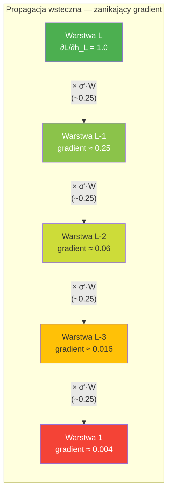
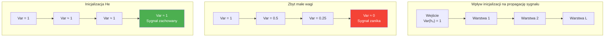
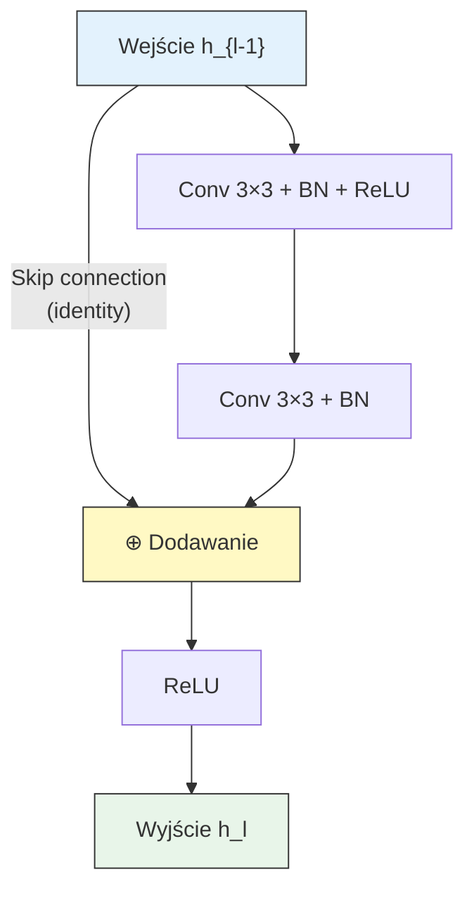
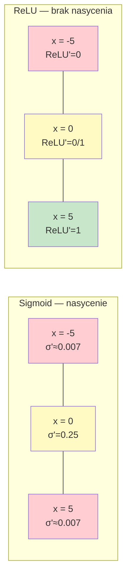

# Pytanie 22: Algorytmy uczenia sieci głębokich. Na czym polega problem zanikającego gradientu i jak jest rozwiązywany?

## Kluczowe pojęcia

- **Zanikający gradient (vanishing gradient)** — problem występujący podczas trenowania głębokich sieci neuronowych, polegający na wykładniczym zmniejszaniu się wartości gradientu w miarę propagacji wstecznej przez kolejne warstwy. Gradient funkcji kosztu względem wag w warstwach bliskich wejściu staje się ekstremalnie mały (bliski zeru), co powoduje, że wagi tych warstw praktycznie przestają się aktualizować. Problem został formalnie opisany przez Hochreitera (1991) i Bengiego et al. (1994). Jest główną przeszkodą w trenowaniu sieci o wielu warstwach z funkcjami aktywacji typu sigmoid lub tanh.
- **Eksplodujący gradient (exploding gradient)** — problem odwrotny do zanikającego gradientu — gradient rośnie wykładniczo podczas propagacji wstecznej, powodując niestabilność numeryczną i rozbieżność procesu uczenia. Wagi otrzymują ogromne aktualizacje, co prowadzi do oscylacji lub wartości NaN. Problem ten jest łatwiejszy do wykrycia (wartości wag rosną gwałtownie) i rozwiązania (gradient clipping) niż zanikający gradient.
- **ReLU (Rectified Linear Unit)** — funkcja aktywacji $\text{ReLU}(x) = \max(0, x)$, której pochodna wynosi 1 dla $x > 0$ i 0 dla $x \leq 0$. W przeciwieństwie do sigmoidy i tanh, ReLU nie powoduje nasycenia gradientu dla dodatnich wartości wejścia, co znacząco łagodzi problem zanikającego gradientu. Warianty: Leaky ReLU, PReLU, ELU, GELU, Swish.
- **ResNet (Residual Network)** — architektura sieci głębokiej zaproponowana przez He et al. (2015), wykorzystująca połączenia rezydualne (skip connections). Zamiast uczyć się bezpośredniego mapowania $H(\mathbf{x})$, sieć uczy się residuum $F(\mathbf{x}) = H(\mathbf{x}) - \mathbf{x}$, a wyjście bloku to $H(\mathbf{x}) = F(\mathbf{x}) + \mathbf{x}$. Skip connections umożliwiają bezpośredni przepływ gradientu przez sieć, rozwiązując problem zanikającego gradientu nawet w sieciach o ponad 100 warstwach.
- **Batch Normalization (BN)** — technika normalizacji aktywacji w każdej warstwie sieci, zaproponowana przez Ioffe i Szegedy (2015). BN normalizuje wejście do każdej warstwy do średniej 0 i wariancji 1 (w obrębie mini-batcha), a następnie skaluje i przesuwa wynik za pomocą uczonych parametrów $\gamma$ i $\beta$. Stabilizuje rozkład aktywacji, przyspiesza zbieżność i działa jako forma regularyzacji.
- **Skip connections (połączenia rezydualne, shortcut connections)** — bezpośrednie połączenia między warstwami niebędącymi sąsiednimi, umożliwiające przepływ sygnału (i gradientu) z pominięciem jednej lub więcej warstw pośrednich. Gradient może przepływać bezpośrednio przez skip connection, omijając mnożenie przez małe pochodne warstw pośrednich. Stosowane w ResNet, DenseNet, U-Net, Transformer (residual connections w blokach attention).

## Matematyczny opis problemu

### Propagacja gradientu przez warstwy

Rozważmy sieć feedforward o $L$ warstwach. Wyjście $l$-tej warstwy:

$\mathbf{h}_l = \sigma(\mathbf{z}_l), \quad \mathbf{z}_l = \mathbf{W}_l \mathbf{h}_{l-1} + \mathbf{b}_l$

gdzie $\sigma$ to funkcja aktywacji, $\mathbf{W}_l$ to macierz wag, $\mathbf{b}_l$ to bias, $\mathbf{h}_0 = \mathbf{x}$ (wejście).

Gradient funkcji kosztu $\mathcal{L}$ względem wag warstwy $l$ obliczamy za pomocą reguły łańcuchowej:

$$\frac{\partial \mathcal{L}}{\partial \mathbf{W}_l} = \frac{\partial \mathcal{L}}{\partial \mathbf{h}_L} \cdot \prod_{k=l+1}^{L} \frac{\partial \mathbf{h}_k}{\partial \mathbf{h}_{k-1}} \cdot \frac{\partial \mathbf{h}_l}{\partial \mathbf{W}_l}$$

Kluczowy jest iloczyn jakobianów:

$$\prod_{k=l+1}^{L} \frac{\partial \mathbf{h}_k}{\partial \mathbf{h}_{k-1}} = \prod_{k=l+1}^{L} \text{diag}\left(\sigma'(\mathbf{z}_k)\right) \cdot \mathbf{W}_k$$

### Warunek zanikania gradientu

Norma iloczynu jakobianów:

$$\left\|\prod_{k=l+1}^{L} \text{diag}\left(\sigma'(\mathbf{z}_k)\right) \cdot \mathbf{W}_k\right\| \leq \prod_{k=l+1}^{L} \left\|\text{diag}\left(\sigma'(\mathbf{z}_k)\right)\right\| \cdot \left\|\mathbf{W}_k\right\|$$

Jeśli $\left\|\sigma'(\mathbf{z}_k)\right\| \cdot \left\|\mathbf{W}_k\right\| < 1$ dla większości warstw $k$, to:

$$\left\|\frac{\partial \mathcal{L}}{\partial \mathbf{W}_l}\right\| \propto \gamma^{L-l}, \quad \gamma < 1$$

Gradient **zanika wykładniczo** z głębokością — warstwy bliskie wejściu otrzymują gradient bliski zeru.

### Warunek eksplozji gradientu

Analogicznie, jeśli $\left\|\sigma'(\mathbf{z}_k)\right\| \cdot \left\|\mathbf{W}_k\right\| > 1$:

$$\left\|\frac{\partial \mathcal{L}}{\partial \mathbf{W}_l}\right\| \propto \gamma^{L-l}, \quad \gamma > 1$$

Gradient **rośnie wykładniczo** — aktualizacje wag stają się niestabilne.

### Rola funkcji aktywacji sigmoid

Dla sigmoidy $\sigma(x) = \frac{1}{1 + e^{-x}}$ pochodna wynosi:

$$\sigma'(x) = \sigma(x)(1 - \sigma(x))$$

Maksymalna wartość pochodnej to $\sigma'(0) = 0{,}25$. Oznacza to, że w każdej warstwie gradient jest mnożony przez wartość $\leq 0{,}25$. Dla sieci o $L$ warstwach:

$$\left\|\frac{\partial \mathcal{L}}{\partial \mathbf{W}_1}\right\| \leq \left(\frac{1}{4}\right)^{L-1} \cdot \left\|\frac{\partial \mathcal{L}}{\partial \mathbf{h}_L}\right\| \cdot \prod_{k} \left\|\mathbf{W}_k\right\|$$

Dla $L = 10$ warstw: $(0{,}25)^9 \approx 3{,}8 \times 10^{-6}$ — gradient jest milion razy mniejszy niż w warstwie wyjściowej.

### Wizualizacja zanikania gradientu



## Rozwiązania problemu zanikającego gradientu

### 1. Funkcja aktywacji ReLU i jej warianty

#### ReLU (Rectified Linear Unit)

$$\text{ReLU}(x) = \max(0, x), \quad \text{ReLU}'(x) = \begin{cases} 1 & \text{jeśli } x > 0 \\ 0 & \text{jeśli } x \leq 0 \end{cases}$$

Kluczowa zaleta: pochodna wynosi dokładnie 1 dla $x > 0$, co eliminuje problem mnożenia przez wartości $< 1$ w kolejnych warstwach. Gradient nie zanika, o ile neurony są aktywne.

**Problem „martwych neuronów" (dying ReLU):** Jeśli wejście neuronu jest zawsze ujemne, gradient wynosi 0 i neuron nigdy się nie uczy. Rozwiązania:

#### Warianty ReLU

| Funkcja | Wzór | Pochodna dla $x \leq 0$ | Zaleta |
|---|---|---|---|
| **Leaky ReLU** | $\max(\alpha x, x)$, $\alpha = 0{,}01$ | $\alpha$ (mała stała) | Brak martwych neuronów |
| **PReLU** | $\max(\alpha x, x)$, $\alpha$ uczony | $\alpha$ (uczony parametr) | Adaptacyjne nachylenie |
| **ELU** | $x$ jeśli $x > 0$; $\alpha(e^x - 1)$ wpp. | $\alpha e^x$ | Gładka, średnia bliższa 0 |
| **GELU** | $x \cdot \Phi(x)$ | ciągła, gładka | Używana w Transformerach |
| **Swish** | $x \cdot \sigma(\beta x)$ | ciągła, gładka | Lepsza od ReLU w głębokich sieciach |

### 2. Inicjalizacja wag (He / Xavier)

Odpowiednia inicjalizacja wag zapewnia, że wariancja aktywacji i gradientów jest zachowana w kolejnych warstwach.

#### Inicjalizacja Xavier (Glorot, 2010)

Dla funkcji aktywacji symetrycznych (tanh, sigmoid):

$$\mathbf{W}_l \sim \mathcal{N}\left(0, \frac{2}{n_{l-1} + n_l}\right) \quad \text{lub} \quad \mathcal{U}\left(-\sqrt{\frac{6}{n_{l-1} + n_l}},\; \sqrt{\frac{6}{n_{l-1} + n_l}}\right)$$

gdzie $n_{l-1}$ to liczba neuronów w warstwie wejściowej, $n_l$ — w warstwie wyjściowej.

#### Inicjalizacja He (Kaiming, 2015)

Dla ReLU (uwzględnia, że ReLU zeruje połowę aktywacji):

$$\mathbf{W}_l \sim \mathcal{N}\left(0, \frac{2}{n_{l-1}}\right)$$

**Intuicja:** Jeśli wagi są zbyt małe, sygnał (i gradient) zanika w kolejnych warstwach. Jeśli zbyt duże — eksploduje. Inicjalizacja He/Xavier dobiera wariancję wag tak, aby wariancja aktywacji była stała w całej sieci.



### 3. Batch Normalization

Batch Normalization (Ioffe & Szegedy, 2015) normalizuje aktywacje w każdej warstwie w obrębie mini-batcha:

**Krok 1 — Normalizacja:**

$$\hat{x}_i = \frac{x_i - \mu_B}{\sqrt{\sigma_B^2 + \epsilon}}$$

gdzie $\mu_B = \frac{1}{m}\sum_{i=1}^{m} x_i$ i $\sigma_B^2 = \frac{1}{m}\sum_{i=1}^{m}(x_i - \mu_B)^2$ to średnia i wariancja mini-batcha o rozmiarze $m$.

**Krok 2 — Skalowanie i przesunięcie:**

$$y_i = \gamma \hat{x}_i + \beta$$

gdzie $\gamma$ i $\beta$ to uczone parametry (pozwalają sieci „cofnąć" normalizację, jeśli to optymalne).

**Dlaczego BN pomaga z zanikającym gradientem:**
1. **Stabilizuje rozkład aktywacji** — zapobiega przesuwaniu się aktywacji w obszar nasycenia sigmoidy/tanh
2. **Utrzymuje gradient w rozsądnym zakresie** — normalizacja zapobiega ekstremalnym wartościom
3. **Pozwala na wyższy learning rate** — stabilniejszy trening umożliwia szybszą zbieżność
4. **Działa jako regularyzacja** — szum z estymacji statystyk mini-batcha ma efekt regularyzujący

### 4. Residual Connections (ResNet)

#### Idea

Zamiast uczyć się bezpośredniego mapowania $H(\mathbf{x})$, blok rezydualny uczy się **residuum** $F(\mathbf{x})$:

$$\mathbf{h}_l = F(\mathbf{h}_{l-1}, \mathbf{W}_l) + \mathbf{h}_{l-1}$$

gdzie $F$ to transformacja rezydualna (np. dwie warstwy konwolucyjne z BN i ReLU).

#### Dlaczego skip connections rozwiązują problem zanikającego gradientu

Gradient przez blok rezydualny:

$$\frac{\partial \mathbf{h}_l}{\partial \mathbf{h}_{l-1}} = \frac{\partial F(\mathbf{h}_{l-1})}{\partial \mathbf{h}_{l-1}} + \mathbf{I}$$

Macierz jednostkowa $\mathbf{I}$ gwarantuje, że gradient nigdy nie zanika całkowicie — nawet jeśli $\frac{\partial F}{\partial \mathbf{h}_{l-1}} \approx \mathbf{0}$, gradient przepływa bezpośrednio przez skip connection.

Dla sieci o $L$ blokach rezydualnych:

$$\frac{\partial \mathcal{L}}{\partial \mathbf{h}_l} = \frac{\partial \mathcal{L}}{\partial \mathbf{h}_L} \cdot \prod_{k=l+1}^{L}\left(\mathbf{I} + \frac{\partial F_k}{\partial \mathbf{h}_{k-1}}\right)$$

Po rozwinięciu iloczynu:

$$\frac{\partial \mathcal{L}}{\partial \mathbf{h}_l} = \frac{\partial \mathcal{L}}{\partial \mathbf{h}_L} \cdot \left(\mathbf{I} + \sum_k \frac{\partial F_k}{\partial \mathbf{h}_{k-1}} + \sum_{k_1 < k_2} \frac{\partial F_{k_1}}{\partial \mathbf{h}_{k_1-1}} \cdot \frac{\partial F_{k_2}}{\partial \mathbf{h}_{k_2-1}} + \cdots\right)$$

Pierwszy składnik ($\mathbf{I}$) zapewnia **bezpośredni przepływ gradientu** z warstwy $L$ do warstwy $l$, niezależnie od głębokości sieci.

#### Architektura bloku rezydualnego



### 5. Gradient Clipping

Gradient clipping ogranicza normę gradientu, zapobiegając eksplozji:

**Clipping by norm:**

$$\hat{\mathbf{g}} = \begin{cases} \mathbf{g} & \text{jeśli } \|\mathbf{g}\| \leq \theta \\ \frac{\theta}{\|\mathbf{g}\|} \cdot \mathbf{g} & \text{jeśli } \|\mathbf{g}\| > \theta \end{cases}$$

gdzie $\theta$ to próg (typowo 1.0 lub 5.0), $\mathbf{g} = \nabla_{\mathbf{W}} \mathcal{L}$.

**Clipping by value:**

$$\hat{g}_i = \text{clip}(g_i, -\theta, \theta)$$

Gradient clipping jest szczególnie ważny w sieciach rekurencyjnych (RNN), gdzie gradient jest propagowany przez wiele kroków czasowych.

### 6. LSTM i GRU — rozwiązanie dla sieci rekurencyjnych

W RNN problem zanikającego gradientu jest szczególnie dotkliwy, ponieważ gradient jest propagowany przez $T$ kroków czasowych (gdzie $T$ to długość sekwencji).

**LSTM (Long Short-Term Memory)** rozwiązuje ten problem poprzez **stan komórki** $\mathbf{c}_t$, który przepływa przez sieć z minimalnymi transformacjami:

$$\mathbf{c}_t = \mathbf{f}_t \odot \mathbf{c}_{t-1} + \mathbf{i}_t \odot \tilde{\mathbf{c}}_t$$

Gradient przez stan komórki:

$$\frac{\partial \mathbf{c}_t}{\partial \mathbf{c}_{t-1}} = \text{diag}(\mathbf{f}_t)$$

Bramka zapominania $\mathbf{f}_t \in (0, 1)$ kontroluje, ile informacji (i gradientu) przepływa. Gdy $\mathbf{f}_t \approx 1$, gradient przepływa niemal bez strat — analogicznie do skip connections w ResNet.

### Zestawienie rozwiązań

| Rozwiązanie | Problem | Mechanizm | Zastosowanie |
|---|---|---|---|
| **ReLU** | Zanikający gradient | Pochodna = 1 dla $x > 0$ | Warstwy ukryte (CNN, MLP) |
| **He initialization** | Zanikający/eksplodujący | Odpowiednia wariancja wag | Inicjalizacja sieci z ReLU |
| **Xavier initialization** | Zanikający/eksplodujący | Odpowiednia wariancja wag | Inicjalizacja sieci z tanh/sigmoid |
| **Batch Normalization** | Zanikający gradient | Normalizacja aktywacji | Między warstwami |
| **Skip connections** | Zanikający gradient | Bezpośredni przepływ gradientu | ResNet, DenseNet, Transformer |
| **Gradient clipping** | Eksplodujący gradient | Ograniczenie normy gradientu | RNN, Transformer |
| **LSTM/GRU** | Zanikający gradient w RNN | Bramki i stan komórki | Sieci rekurencyjne |

## Przykłady

### Porównanie sigmoid vs ReLU

#### Propagacja gradientu w sieci 5-warstwowej

| Warstwa | Gradient (sigmoid) | Gradient (ReLU) |
|---|---|---|
| **5** (wyjściowa) | 1.000 | 1.000 |
| **4** | 0.250 | 1.000 |
| **3** | 0.063 | 1.000 |
| **2** | 0.016 | 1.000 |
| **1** (wejściowa) | 0.004 | 1.000 |

Przy sigmoidzie gradient w warstwie 1 stanowi zaledwie 0,4% gradientu w warstwie 5. Przy ReLU (zakładając aktywne neurony) gradient jest zachowany w pełni.

#### Pochodne funkcji aktywacji

| Funkcja | Wzór | Zakres pochodnej | Problem |
|---|---|---|---|
| **Sigmoid** | $\frac{1}{1+e^{-x}}$ | $(0, 0{,}25]$ | Nasycenie → zanikanie |
| **Tanh** | $\frac{e^x - e^{-x}}{e^x + e^{-x}}$ | $(0, 1]$ | Nasycenie → zanikanie (mniej niż sigmoid) |
| **ReLU** | $\max(0, x)$ | $\{0, 1\}$ | Martwe neurony (gradient = 0 dla $x < 0$) |
| **Leaky ReLU** | $\max(0{,}01x, x)$ | $\{0{,}01, 1\}$ | Brak nasycenia, brak martwych neuronów |



### Architektura ResNet — przykład

ResNet-34 składa się z bloków rezydualnych pogrupowanych w 4 etapy:

```
Wejście (224×224×3)
    │
    ▼
Conv 7×7, 64 filtrów, stride 2 → BN → ReLU
    │
    ▼
MaxPool 3×3, stride 2
    │
    ▼
┌─────────────────────────────────────┐
│ Etap 1: 3 bloki rezydualne (64)    │
│ ┌─────────────────────────────────┐ │
│ │ Conv 3×3, 64 → BN → ReLU       │ │
│ │ Conv 3×3, 64 → BN              │ │
│ │ + skip connection → ReLU        │ │
│ └─────────────────────────────────┘ │
│ × 3 bloki                          │
└─────────────────────────────────────┘
    │
    ▼
┌─────────────────────────────────────┐
│ Etap 2: 4 bloki rezydualne (128)   │
│ (pierwszy blok: stride 2)          │
└─────────────────────────────────────┘
    │
    ▼
┌─────────────────────────────────────┐
│ Etap 3: 6 bloków rezydualnych (256)│
└─────────────────────────────────────┘
    │
    ▼
┌─────────────────────────────────────┐
│ Etap 4: 3 bloki rezydualne (512)   │
└─────────────────────────────────────┘
    │
    ▼
Global Average Pooling → FC 1000 → Softmax
```

**Wyniki ResNet na ImageNet:**

| Architektura | Warstwy | Top-5 error | Zanikający gradient? |
|---|---|---|---|
| VGG-19 | 19 | 7.3% | Tak — trudności z trenowaniem głębszych wersji |
| ResNet-34 | 34 | 5.7% | Nie — skip connections |
| ResNet-152 | 152 | 4.5% | Nie — skip connections |
| ResNet-1202 | 1202 | ~7.9% | Nie, ale overfitting |

Bez skip connections sieć o 56 warstwach miała **gorsze** wyniki niż sieć o 20 warstwach (problem degradacji). Z skip connections — im głębsza sieć, tym lepsze wyniki (do pewnego momentu).

## Podsumowanie

1. **Problem zanikającego gradientu** polega na wykładniczym zmniejszaniu się gradientu podczas propagacji wstecznej przez wiele warstw. Gradient jest mnożony przez pochodne funkcji aktywacji i wagi w każdej warstwie — jeśli te wartości są mniejsze od 1, gradient zanika wykładniczo: $\|\nabla_{W_l} \mathcal{L}\| \propto \gamma^{L-l}$, $\gamma < 1$.

2. **Problem eksplodującego gradientu** jest symetryczny — gradient rośnie wykładniczo, gdy iloczyn pochodnych i wag przekracza 1. Prowadzi do niestabilności numerycznej i rozbieżności uczenia.

3. **Główne rozwiązania** to: (a) funkcja aktywacji **ReLU** (pochodna = 1 dla aktywnych neuronów), (b) inicjalizacja **He/Xavier** (zachowanie wariancji aktywacji), (c) **Batch Normalization** (stabilizacja rozkładu aktywacji), (d) **skip connections / residual connections** (bezpośredni przepływ gradientu przez macierz identyczności), (e) **gradient clipping** (ograniczenie normy gradientu dla problemu eksplozji).

4. **ResNet** (He et al., 2015) jest przełomową architekturą, która dzięki skip connections umożliwiła trenowanie sieci o ponad 100 warstwach. Blok rezydualny $\mathbf{h}_l = F(\mathbf{h}_{l-1}) + \mathbf{h}_{l-1}$ gwarantuje, że gradient zawiera składnik $\mathbf{I}$ (macierz jednostkowa), zapobiegając zanikaniu.

5. W **sieciach rekurencyjnych** (RNN) problem zanikającego gradientu jest rozwiązywany przez architektury bramkowe — **LSTM** i **GRU** — które wykorzystują stan komórki z kontrolowanym przepływem informacji, analogicznie do skip connections w sieciach feedforward.

## Powiązane pytania

- [Pytanie 16: Na czym polega idea i zasada algorytmu propagacji wstecznej w sieciach neuronowych?](16-backpropagation.md)
- [Pytanie 17: Algorytmy deterministyczne uczenia sieci neuronowych.](17-algorytmy-deterministyczne-uczenia.md)
- [Pytanie 21: Sieci płytkie i głębokie. Przedstawić podobieństwa i różnice. Skąd wynika potrzeba stosowania wielu warstw w sieciach głębokich?](21-sieci-plytkie-vs-glebokie.md)
