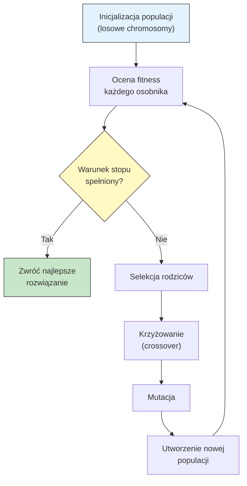
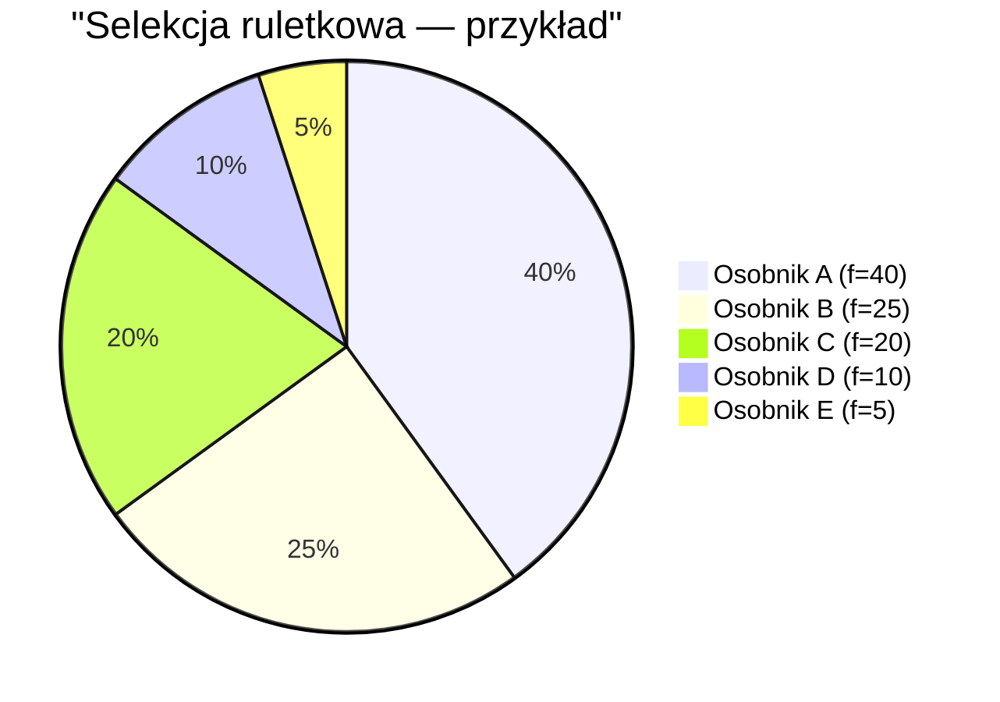
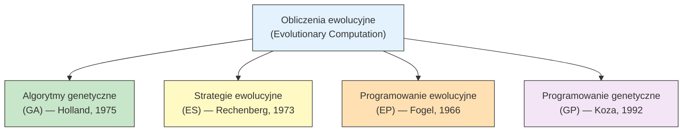

# Pytanie 23: Algorytmy genetyczne i ewolucyjne optymalizacji.

## Kluczowe pojęcia

- **Algorytm genetyczny (GA)** — metaheurystyczny algorytm optymalizacji inspirowany mechanizmami ewolucji biologicznej (dobór naturalny, dziedziczenie, mutacja). Operuje na populacji osobników (rozwiązań kandydujących), które podlegają selekcji, krzyżowaniu i mutacji w kolejnych pokoleniach. Zaproponowany przez Johna Hollanda (1975) i spopularyzowany przez Davida Goldberga (1989). GA nie gwarantuje znalezienia optimum globalnego, ale skutecznie przeszukuje duże, złożone przestrzenie rozwiązań.
- **Chromosom (genotyp)** — zakodowana reprezentacja rozwiązania problemu optymalizacyjnego. Najczęściej jest to ciąg bitów (kodowanie binarne), ale może być też wektor liczb rzeczywistych, permutacja lub struktura drzewiasta. Chromosom składa się z genów — pojedynczych elementów kodowania. Każdy chromosom odpowiada jednemu osobnikowi w populacji i może być zdekodowany do fenotypu (konkretnego rozwiązania w przestrzeni problemu).
- **Selekcja** — operator wyboru osobników z bieżącej populacji do reprodukcji (tworzenia potomstwa). Osobniki o wyższej wartości funkcji fitness mają większe prawdopodobieństwo wyboru, co realizuje mechanizm „przetrwania najlepiej przystosowanych". Główne strategie: selekcja ruletkowa (proporcjonalna do fitness), selekcja turniejowa, selekcja rankingowa, selekcja elitarna.
- **Krzyżowanie (crossover, rekombinacja)** — operator genetyczny łączący materiał genetyczny dwóch rodziców w celu utworzenia potomstwa. Realizuje wymianę informacji między rozwiązaniami. Główne typy: krzyżowanie jednopunktowe, dwupunktowe, jednorodne (uniform). Prawdopodobieństwo krzyżowania $p_c$ wynosi typowo 0,6–0,9.
- **Mutacja** — operator genetyczny wprowadzający losowe, niewielkie zmiany w chromosomie potomka. Zapewnia różnorodność genetyczną populacji i zapobiega przedwczesnej zbieżności do optimum lokalnego. W kodowaniu binarnym polega na odwróceniu losowego bitu. Prawdopodobieństwo mutacji $p_m$ jest niskie, typowo 0,001–0,05.
- **Funkcja fitness (funkcja przystosowania)** — funkcja oceniająca jakość rozwiązania zakodowanego w chromosomie. Przypisuje każdemu osobnikowi wartość liczbową określającą jego „przystosowanie" do środowiska (jakość rozwiązania). Dla problemów minimalizacji fitness jest odwrotnością lub negacją funkcji celu. Funkcja fitness kieruje procesem selekcji — osobniki o wyższym fitness mają większą szansę na reprodukcję.
- **Populacja** — zbiór osobników (chromosomów) istniejących w danym pokoleniu algorytmu. Rozmiar populacji $N$ jest parametrem algorytmu (typowo 50–500). Populacja początkowa jest generowana losowo. W kolejnych pokoleniach populacja ewoluuje dzięki operatorom selekcji, krzyżowania i mutacji, dążąc do coraz lepszych rozwiązań.

## Schemat algorytmu genetycznego

### Ogólny schemat działania



### Pseudokod algorytmu genetycznego

```
ALGORYTM GenetycznyKlasyczny(N, p_c, p_m, max_gen)
  Wejście:
    N       — rozmiar populacji
    p_c     — prawdopodobieństwo krzyżowania
    p_m     — prawdopodobieństwo mutacji
    max_gen — maksymalna liczba pokoleń

  1. t ← 0
  2. P(0) ← Inicjalizuj_Populację(N)          // losowe chromosomy
  3. Oceń fitness każdego osobnika w P(0)

  4. DOPÓKI t < max_gen I NIE warunek_stopu:
       4.1  P'(t) ← ∅                          // nowa populacja
       4.2  [Elitaryzm] Skopiuj najlepszego osobnika z P(t) do P'(t)
       4.3  DOPÓKI |P'(t)| < N:
              a) rodzic1 ← Selekcja(P(t))
              b) rodzic2 ← Selekcja(P(t))
              c) JEŚLI losowa() < p_c:
                   (potomek1, potomek2) ← Krzyżowanie(rodzic1, rodzic2)
                 W PRZECIWNYM RAZIE:
                   (potomek1, potomek2) ← (rodzic1, rodzic2)
              d) potomek1 ← Mutacja(potomek1, p_m)
              e) potomek2 ← Mutacja(potomek2, p_m)
              f) Dodaj potomek1, potomek2 do P'(t)
       4.4  Oceń fitness każdego osobnika w P'(t)
       4.5  P(t+1) ← P'(t)
       4.6  t ← t + 1

  5. ZWRÓĆ najlepszego osobnika z P(t)
```

## Operatory genetyczne

### Kodowanie chromosomów

| Typ kodowania | Reprezentacja | Zastosowanie |
|---|---|---|
| **Binarne** | ciąg bitów: `10110010` | optymalizacja funkcji, problemy kombinatoryczne |
| **Rzeczywiste** | wektor: `[2.31, -0.87, 4.12]` | optymalizacja ciągła |
| **Permutacyjne** | permutacja: `[3, 1, 4, 2, 5]` | TSP, szeregowanie zadań |
| **Drzewiaste** | drzewo wyrażeń | programowanie genetyczne |

### Krzyżowanie (crossover)

#### Krzyżowanie jednopunktowe

Losujemy punkt cięcia $k$ i wymieniamy fragmenty chromosomów po tym punkcie:

```
Rodzic 1:  [A B C | D E F]     Potomek 1: [A B C | d e f]
Rodzic 2:  [a b c | d e f]     Potomek 2: [a b c | D E F]
                ↑ punkt cięcia k=3
```

#### Krzyżowanie dwupunktowe

Losujemy dwa punkty cięcia $k_1, k_2$ i wymieniamy fragment między nimi:

```
Rodzic 1:  [A | B C D | E F]   Potomek 1: [A | b c d | E F]
Rodzic 2:  [a | b c d | e f]   Potomek 2: [a | B C D | e f]
               ↑ k1=1    ↑ k2=4
```

#### Krzyżowanie jednorodne (uniform)

Dla każdego genu losujemy, od którego rodzica pochodzi:

```
Maska:     [1  0  1  0  1  0]
Rodzic 1:  [A  B  C  D  E  F]
Rodzic 2:  [a  b  c  d  e  f]
Potomek:   [A  b  C  d  E  f]   (1 → Rodzic 1, 0 → Rodzic 2)
```

### Mutacja

#### Mutacja binarna

Odwrócenie losowego bitu z prawdopodobieństwem $p_m$:

```
Przed mutacją:  [1 0 1 1 0 0 1 0]
                             ↑ bit wybrany do mutacji
Po mutacji:     [1 0 1 1 0 1 1 0]
```

#### Mutacja rzeczywista (gaussowska)

Dodanie szumu gaussowskiego do wybranego genu:

$x'_i = x_i + \mathcal{N}(0, \sigma^2)$

gdzie $\sigma$ to parametr siły mutacji (może maleć w kolejnych pokoleniach).

#### Mutacja permutacyjna (swap)

Zamiana dwóch losowych pozycji:

```
Przed: [3 1 4 2 5]
            ↑     ↑  pozycje 2 i 5
Po:    [3 5 4 2 1]
```

## Strategie selekcji

### Selekcja ruletkowa (proporcjonalna)

Prawdopodobieństwo wyboru osobnika $i$ jest proporcjonalne do jego fitness:

$p_i = \frac{f_i}{\sum_{j=1}^{N} f_j}$

gdzie $f_i$ to wartość fitness osobnika $i$, $N$ to rozmiar populacji.

```
ALGORYTM Selekcja_Ruletkowa(P)
  1. Oblicz sumę fitness: S ← Σ f_i
  2. Dla każdego osobnika oblicz p_i ← f_i / S
  3. Oblicz dystrybuantę: c_i ← Σ_{j=1}^{i} p_j
  4. Wylosuj r ← losowa(0, 1)
  5. Wybierz osobnika i, dla którego c_{i-1} < r ≤ c_i
```

**Wady:** Osobnik o dominującym fitness może zdominować selekcję (utrata różnorodności). Nie działa dobrze, gdy wartości fitness są ujemne lub bliskie sobie.



### Selekcja turniejowa

Losujemy $k$ osobników z populacji (turniej) i wybieramy najlepszego:

```
ALGORYTM Selekcja_Turniejowa(P, k)
  1. Wylosuj k osobników z P (ze zwracaniem lub bez)
  2. Spośród wylosowanych wybierz osobnika o najwyższym fitness
  3. ZWRÓĆ wybranego osobnika
```

| Rozmiar turnieju $k$ | Presja selekcyjna | Charakterystyka |
|---|---|---|
| $k = 2$ | Niska | Zachowuje różnorodność, wolniejsza zbieżność |
| $k = 5$ | Średnia | Dobry kompromis |
| $k = N$ | Maksymalna | Zawsze wybiera najlepszego (deterministyczna) |

**Zalety:** Prosta implementacja, łatwa kontrola presji selekcyjnej (parametr $k$), działa z ujemnymi wartościami fitness, nie wymaga sortowania populacji.

### Selekcja rankingowa

Osobniki są sortowane według fitness i przypisywane im jest prawdopodobieństwo na podstawie rangi (pozycji w rankingu), a nie bezpośredniej wartości fitness:

$p_i = \frac{2 - s}{N} + \frac{2(r_i - 1)(s - 1)}{N(N - 1)}$

gdzie $r_i$ to ranga osobnika $i$ (1 = najgorszy, $N$ = najlepszy), $s \in [1, 2]$ to parametr presji selekcyjnej.

**Zaleta:** Eliminuje problem dominacji osobnika o ekstremalnie wysokim fitness.

### Selekcja elitarna

Najlepsze $e$ osobników z bieżącej populacji jest kopiowanych bezpośrednio do następnego pokolenia (bez zmian). Gwarantuje, że najlepsze znalezione rozwiązanie nigdy nie zostanie utracone. Typowo $e = 1$ lub $e = 2$.

## Algorytmy ewolucyjne (ES, EP)

Algorytmy genetyczne są częścią szerszej rodziny **algorytmów ewolucyjnych** (Evolutionary Computation). Główne nurty:



### Strategie ewolucyjne (ES — Evolution Strategies)

Strategie ewolucyjne operują na wektorach liczb rzeczywistych i kładą nacisk na **mutację** jako główny operator (krzyżowanie jest opcjonalne).

#### ES (1+1) — najprostsza strategia

Jeden rodzic generuje jednego potomka przez mutację. Lepszy z nich przechodzi do następnego pokolenia:

```
ALGORYTM ES_(1+1)
  1. x ← losowy punkt startowy
  2. σ ← początkowy krok mutacji
  3. DOPÓKI NIE warunek_stopu:
       a) x' ← x + σ · N(0, I)          // mutacja gaussowska
       b) JEŚLI f(x') lepsze niż f(x):
            x ← x'
       c) Adaptuj σ (reguła 1/5 sukcesu)
```

**Reguła 1/5 sukcesu (Rechenberg):** Jeśli odsetek udanych mutacji (polepszających fitness) jest większy niż 1/5, zwiększ $\sigma$ (eksploracja). Jeśli mniejszy — zmniejsz $\sigma$ (eksploatacja).

#### ES (μ+λ) i ES (μ,λ)

- **ES (μ+λ):** Z $\mu$ rodziców generujemy $\lambda$ potomków. Nowa populacja to najlepszych $\mu$ osobników spośród rodziców i potomków łącznie.
- **ES (μ,λ):** Z $\mu$ rodziców generujemy $\lambda \geq \mu$ potomków. Nowa populacja to najlepszych $\mu$ osobników **wyłącznie spośród potomków** (rodzice nie przechodzą). Wymusza eksplorację.

#### CMA-ES (Covariance Matrix Adaptation)

Zaawansowana strategia ewolucyjna, w której macierz kowariancji mutacji jest adaptowana w trakcie działania algorytmu. Uważana za jeden z najskuteczniejszych algorytmów optymalizacji ciągłej bez gradientu.

### Programowanie ewolucyjne (EP — Evolutionary Programming)

- Brak operatora krzyżowania — tylko mutacja i selekcja
- Każdy osobnik generuje jednego potomka przez mutację
- Selekcja turniejowa spośród rodziców i potomków
- Reprezentacja dostosowana do problemu (nie wymaga kodowania binarnego)
- Historycznie stosowane do ewolucji automatów skończonych (Fogel, 1966)

### Porównanie algorytmów ewolucyjnych

| Cecha | GA | ES | EP |
|---|---|---|---|
| **Reprezentacja** | binarna / dowolna | wektory rzeczywiste | dowolna |
| **Główny operator** | krzyżowanie | mutacja | mutacja |
| **Krzyżowanie** | tak (kluczowe) | opcjonalne | brak |
| **Mutacja** | pomocnicza | kluczowa (gaussowska) | kluczowa |
| **Selekcja** | ruletkowa / turniejowa | (μ+λ) lub (μ,λ) | turniejowa |
| **Adaptacja parametrów** | rzadko | tak (σ, macierz kowariancji) | tak (σ) |
| **Zastosowanie** | problemy kombinatoryczne | optymalizacja ciągła | ogólne |

## Zbieżność algorytmów genetycznych

### Twierdzenie o schematach (Schema Theorem)

Holland (1975) udowodnił, że schematy (wzorce w chromosomach) o ponadprzeciętnym fitness, krótkiej długości definiującej i niskim rzędzie rosną wykładniczo w kolejnych pokoleniach:

$E[m(H, t+1)] \geq m(H, t) \cdot \frac{f(H)}{\bar{f}} \cdot \left[1 - p_c \cdot \frac{\delta(H)}{l-1}\right] \cdot (1 - p_m)^{o(H)}$

gdzie:
- $m(H, t)$ — liczba osobników pasujących do schematu $H$ w pokoleniu $t$
- $f(H)$ — średni fitness osobników pasujących do $H$
- $\bar{f}$ — średni fitness populacji
- $\delta(H)$ — długość definiująca schematu (odległość między skrajnymi ustalonymi pozycjami)
- $o(H)$ — rząd schematu (liczba ustalonych pozycji)
- $l$ — długość chromosomu

### Warunki zbieżności

1. **Elitaryzm** — zachowanie najlepszego osobnika gwarantuje monotoniczną poprawę najlepszego rozwiązania
2. **Odpowiedni rozmiar populacji** — zbyt mała populacja prowadzi do przedwczesnej zbieżności, zbyt duża spowalnia algorytm
3. **Balans eksploracja/eksploatacja** — wysoka mutacja = eksploracja (przeszukiwanie nowych obszarów), niska mutacja = eksploatacja (doskonalenie znalezionych rozwiązań)

### Przedwczesna zbieżność

Problem polegający na tym, że populacja traci różnorodność genetyczną i zbiega do optimum lokalnego zamiast globalnego. Przyczyny:
- Zbyt silna presja selekcyjna
- Zbyt mała populacja
- Zbyt niska mutacja

Rozwiązania: zwiększenie mutacji, selekcja turniejowa z małym $k$, techniki niszowe (fitness sharing, crowding), restartowanie populacji.

## Przykłady

### Optymalizacja funkcji jednej zmiennej — krok po kroku

**Problem:** Znaleźć maksimum funkcji $f(x) = x \cdot \sin(10\pi x) + 2$ na przedziale $[-1, 2]$.

#### Krok 1: Kodowanie binarne

Kodujemy $x \in [-1, 2]$ na chromosomie 10-bitowym. Dekodowanie:

$x = -1 + \frac{\text{wartość\_dziesiętna}(chromosom)}{2^{10} - 1} \cdot (2 - (-1)) = -1 + \frac{d}{1023} \cdot 3$

Precyzja: $\frac{3}{1023} \approx 0{,}00293$

#### Krok 2: Inicjalizacja populacji (N=6)

| Osobnik | Chromosom | Wartość dziesiętna | $x$ | $f(x)$ |
|---|---|---|---|---|
| A | `0110100110` | 422 | 0,237 | 2,649 |
| B | `1010011100` | 668 | 0,959 | 2,940 |
| C | `0011001010` | 202 | -0,408 | 2,393 |
| D | `1100110001` | 817 | 1,396 | 2,256 |
| E | `1001100011` | 611 | 0,792 | 1,149 |
| F | `0101110100` | 372 | 0,091 | 2,268 |

#### Krok 3: Selekcja ruletkowa

Suma fitness: $S = 2{,}649 + 2{,}940 + 2{,}393 + 2{,}256 + 1{,}149 + 2{,}268 = 13{,}655$

| Osobnik | Fitness | Prawdopodobieństwo | Dystrybuanta |
|---|---|---|---|
| A | 2,649 | 0,194 | 0,194 |
| B | 2,940 | 0,215 | 0,409 |
| C | 2,393 | 0,175 | 0,584 |
| D | 2,256 | 0,165 | 0,749 |
| E | 1,149 | 0,084 | 0,833 |
| F | 2,268 | 0,166 | 1,000 |

Losujemy 6 razy (np. r = 0,31 → B; r = 0,72 → D; r = 0,15 → A; r = 0,55 → C; r = 0,89 → F; r = 0,42 → B):

Wybrani rodzice: **B, D, A, C, F, B**

#### Krok 4: Krzyżowanie (jednopunktowe, $p_c = 0{,}8$)

Para 1: B × D, punkt cięcia = 4

```
B: [1010 | 011100]    →  Potomek 1: [1010 | 110001] = 1010110001 (d=689, x=1,021)
D: [1100 | 110001]    →  Potomek 2: [1100 | 011100] = 1100011100 (d=796, x=1,334)
```

Para 2: A × C, punkt cięcia = 6

```
A: [011010 | 0110]    →  Potomek 3: [011010 | 1010] = 0110101010 (d=426, x=0,249)
C: [001100 | 1010]    →  Potomek 4: [001100 | 0110] = 0011000110 (d=198, x=-0,419)
```

Para 3: F × B — losowa > $p_c$, brak krzyżowania:

```
Potomek 5: [0101110100] (F, bez zmian)
Potomek 6: [1010011100] (B, bez zmian)
```

#### Krok 5: Mutacja ($p_m = 0{,}01$)

Dla każdego bitu losujemy — z prawdopodobieństwem 0,01 odwracamy bit. Przy 60 bitach łącznie (6 osobników × 10 bitów) oczekujemy ~0,6 mutacji.

Załóżmy, że mutacja trafia bit 7 Potomka 3:

```
Przed: [0110101010]
                ↑ bit 7
Po:    [0110100010]  (d=418, x=0,226)
```

#### Krok 6: Ocena nowej populacji

| Osobnik | Chromosom | $x$ | $f(x)$ |
|---|---|---|---|
| P1 | `1010110001` | 1,021 | 2,072 |
| P2 | `1100011100` | 1,334 | 1,093 |
| P3' | `0110100010` | 0,226 | 2,614 |
| P4 | `0011000110` | -0,419 | 2,406 |
| P5 | `0101110100` | 0,091 | 2,268 |
| P6 | `1010011100` | 0,959 | 2,940 |

Najlepszy osobnik: **P6** z $f(x) = 2{,}940$ (ten sam co B z poprzedniego pokolenia).

Proces powtarza się przez kolejne pokolenia. Z biegiem iteracji populacja zbiega do obszaru optimum globalnego.

### Typowe parametry algorytmu genetycznego

| Parametr | Zakres typowy | Uwagi |
|---|---|---|
| Rozmiar populacji $N$ | 50–500 | Większy dla trudniejszych problemów |
| Prawdopodobieństwo krzyżowania $p_c$ | 0,6–0,9 | Główny operator eksploracji |
| Prawdopodobieństwo mutacji $p_m$ | 0,001–0,05 | Zbyt wysokie → losowe przeszukiwanie |
| Rozmiar turnieju $k$ | 2–7 | Kontrola presji selekcyjnej |
| Elitaryzm $e$ | 1–2 | Zachowanie najlepszego rozwiązania |
| Warunek stopu | 100–10000 pokoleń | Lub brak poprawy przez $n$ pokoleń |

## Podsumowanie

1. **Algorytm genetyczny (GA)** to metaheurystyka inspirowana ewolucją biologiczną, operująca na populacji zakodowanych rozwiązań. Główne operatory to selekcja (wybór rodziców proporcjonalnie do fitness), krzyżowanie (wymiana materiału genetycznego) i mutacja (losowe zaburzenie). GA skutecznie przeszukuje duże przestrzenie rozwiązań, ale nie gwarantuje znalezienia optimum globalnego.

2. **Operatory genetyczne** — krzyżowanie (jednopunktowe, dwupunktowe, jednorodne) odpowiada za eksplorację przestrzeni rozwiązań przez łączenie cech rodziców. Mutacja (odwrócenie bitu, szum gaussowski) zapewnia różnorodność i zapobiega przedwczesnej zbieżności. Balans między krzyżowaniem a mutacją determinuje stosunek eksploracji do eksploatacji.

3. **Strategie selekcji** — selekcja ruletkowa (proporcjonalna do fitness) jest prosta, ale wrażliwa na dominację jednego osobnika. Selekcja turniejowa (wybór najlepszego z $k$ losowych) jest bardziej elastyczna i łatwiejsza w implementacji. Elitaryzm gwarantuje zachowanie najlepszego rozwiązania.

4. **Strategie ewolucyjne (ES)** operują na wektorach rzeczywistych z naciskiem na mutację gaussowską i adaptację parametrów (np. CMA-ES). **Programowanie ewolucyjne (EP)** nie stosuje krzyżowania. Oba podejścia są szczególnie skuteczne w optymalizacji ciągłej.

5. **Zbieżność** GA jest opisana twierdzeniem o schematach Hollanda — schematy o ponadprzeciętnym fitness rosną wykładniczo. Przedwczesna zbieżność (utrata różnorodności) jest głównym zagrożeniem, łagodzonym przez odpowiedni dobór parametrów, techniki niszowe i elitaryzm.

## Powiązane pytania

- [Pytanie 26: Przedstawić algorytmy grupowania danych: klasyczne i rozmyte.](26-algorytmy-grupowania.md)
