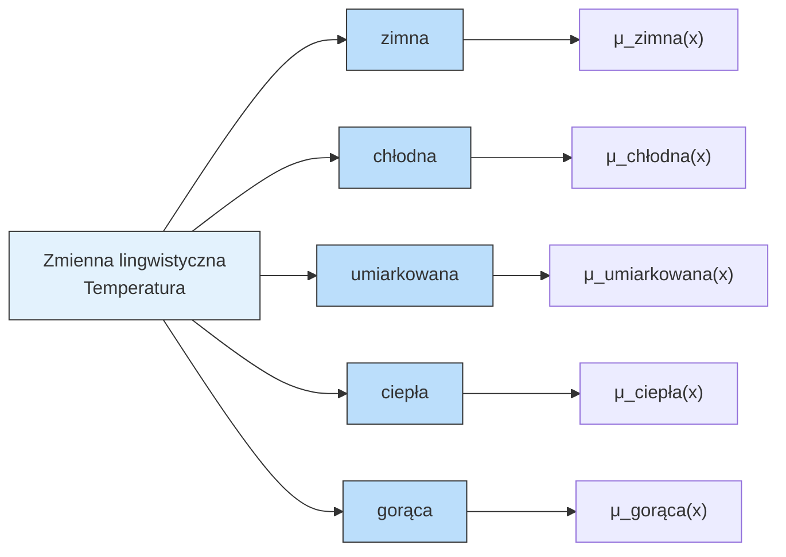
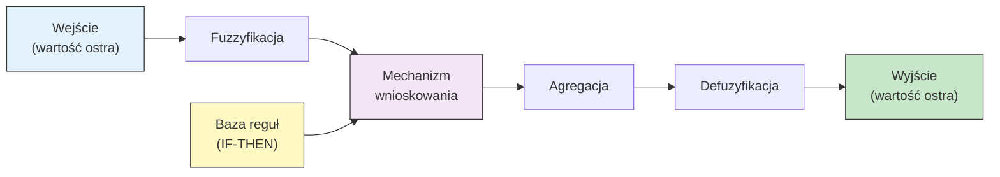
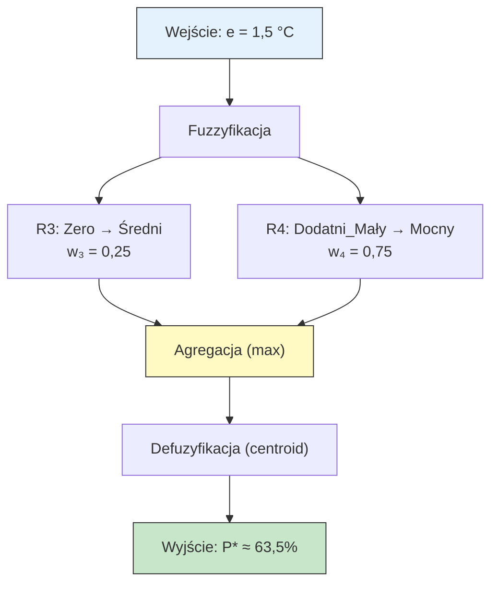

# Pytanie 24: Systemy rozmyte – podstawy matematyczne.

## Kluczowe pojęcia

- **Zbiór rozmyty (fuzzy set)** — uogólnienie klasycznego zbioru, w którym każdy element posiada stopień przynależności z przedziału $[0, 1]$ zamiast binarnej przynależności $\{0, 1\}$. Formalnie zbiór rozmyty $A$ w przestrzeni $X$ jest zdefiniowany przez funkcję przynależności $\mu_A: X \to [0, 1]$. Koncepcja wprowadzona przez Lotfiego Zadeha w 1965 roku. Wartość $\mu_A(x) = 0$ oznacza brak przynależności, $\mu_A(x) = 1$ — pełną przynależność, a wartości pośrednie — częściową przynależność.
- **Funkcja przynależności (membership function)** — funkcja $\mu_A: X \to [0, 1]$ przypisująca każdemu elementowi $x$ przestrzeni $X$ stopień przynależności do zbioru rozmytego $A$. Kształt funkcji przynależności determinuje sposób modelowania nieprecyzyjnych pojęć (np. „wysoka temperatura", „mała prędkość"). Najczęściej stosowane typy: trójkątna, trapezowa, gaussowska, sigmoidalna.
- **Operacje na zbiorach rozmytych** — uogólnienia klasycznych operacji teorii zbiorów na zbiory rozmyte. Suma (OR) realizowana przez operator maximum: $\mu_{A \cup B}(x) = \max(\mu_A(x), \mu_B(x))$. Iloczyn (AND) realizowany przez operator minimum: $\mu_{A \cap B}(x) = \min(\mu_A(x), \mu_B(x))$. Dopełnienie (NOT): $\mu_{\overline{A}}(x) = 1 - \mu_A(x)$. Istnieją też alternatywne realizacje: t-normy (iloczyn algebraiczny) i t-konormy (suma algebraiczna).
- **Reguły rozmyte (fuzzy rules)** — reguły typu IF-THEN operujące na zmiennych lingwistycznych i zbiorach rozmytych. Format: „JEŚLI $x$ jest $A$ TO $y$ jest $B$", gdzie $A$ i $B$ to zbiory rozmyte. Reguły mogą mieć wiele przesłanek połączonych operatorami AND/OR. Zbiór reguł tworzy bazę reguł systemu rozmytego.
- **Wnioskowanie rozmyte (fuzzy inference)** — proces wyznaczania wyjścia systemu rozmytego na podstawie wejść i bazy reguł. Obejmuje: fuzzyfikację wejść, ewaluację reguł, agregację wyników reguł i defuzyfikację. Główne systemy wnioskowania: Mamdani (wyjście reguły to zbiór rozmyty) i Sugeno (wyjście reguły to funkcja liniowa wejść).
- **Defuzyfikacja (defuzzification)** — proces przekształcenia rozmytego zbioru wyjściowego (wyniku wnioskowania) na konkretną wartość liczbową (crisp value). Najczęściej stosowane metody: środek ciężkości (centroid/COG), bisector, średnia maksimów (MOM), najmniejsze/największe maksimum (SOM/LOM).

## Definicja zbioru rozmytego

### Formalna definicja

Niech $X$ będzie przestrzenią rozważań (uniwersum). **Zbiór rozmyty** $A$ w $X$ jest zdefiniowany jako zbiór par:

$$A = \{(x, \mu_A(x)) \mid x \in X\}$$

gdzie $\mu_A: X \to [0, 1]$ jest **funkcją przynależności** zbioru $A$.

Dla zbioru rozmytego definiujemy:
- **Nośnik (support):** $\text{supp}(A) = \{x \in X \mid \mu_A(x) > 0\}$
- **Rdzeń (core):** $\text{core}(A) = \{x \in X \mid \mu_A(x) = 1\}$
- **Wysokość:** $\text{hgt}(A) = \sup_{x \in X} \mu_A(x)$
- **$\alpha$-przekrój ($\alpha$-cut):** $A_\alpha = \{x \in X \mid \mu_A(x) \geq \alpha\}$ dla $\alpha \in (0, 1]$

### Zbiór rozmyty vs zbiór klasyczny

| Cecha | Zbiór klasyczny (ostry) | Zbiór rozmyty |
|---|---|---|
| **Przynależność** | $\mu_A(x) \in \{0, 1\}$ | $\mu_A(x) \in [0, 1]$ |
| **Granice** | ostre, jednoznaczne | rozmyte, gradualne |
| **Przykład** | „temperatura > 30°C" | „wysoka temperatura" |
| **Logika** | dwuwartościowa (prawda/fałsz) | wielowartościowa (stopień prawdziwości) |
| **Zastosowanie** | precyzyjne warunki | modelowanie niepewności i nieprecyzyjności |

### Zmienne lingwistyczne

**Zmienna lingwistyczna** to zmienna, której wartościami są słowa lub wyrażenia języka naturalnego, a nie liczby. Każda wartość lingwistyczna jest reprezentowana przez zbiór rozmyty.

Przykład zmiennej lingwistycznej „Temperatura":
- Wartości: {zimna, chłodna, umiarkowana, ciepła, gorąca}
- Każda wartość to zbiór rozmyty zdefiniowany na dziedzinie np. $[0, 50]$ °C



## Typy funkcji przynależności

### Funkcja trójkątna (triangular)

Zdefiniowana przez trzy parametry $a < b < c$:

$$\mu(x; a, b, c) = \begin{cases} 0 & \text{dla } x \leq a \\ \frac{x - a}{b - a} & \text{dla } a < x \leq b \\ \frac{c - x}{c - b} & \text{dla } b < x < c \\ 0 & \text{dla } x \geq c \end{cases}$$

**Cechy:** prosta, szybka obliczeniowo, wymaga 3 parametrów. Stosowana, gdy wartość centralna jest dobrze określona, a przejścia są liniowe.

```
μ(x)
1.0 |        /\
    |       /  \
    |      /    \
0.5 |     /      \
    |    /        \
    |   /          \
0.0 |__/____________\___
       a    b    c      x
```

### Funkcja trapezowa (trapezoidal)

Zdefiniowana przez cztery parametry $a < b < c < d$:

$$\mu(x; a, b, c, d) = \begin{cases} 0 & \text{dla } x \leq a \\ \frac{x - a}{b - a} & \text{dla } a < x \leq b \\ 1 & \text{dla } b < x \leq c \\ \frac{d - x}{d - c} & \text{dla } c < x < d \\ 0 & \text{dla } x \geq d \end{cases}$$

**Cechy:** posiada plateau (rdzeń) o pełnej przynależności, wymaga 4 parametrów. Stosowana, gdy istnieje zakres wartości o pełnej przynależności. Funkcja trójkątna jest szczególnym przypadkiem trapezowej dla $b = c$.

```
μ(x)
1.0 |      ________
    |     /        \
    |    /          \
0.5 |   /            \
    |  /              \
    | /                \
0.0 |/__________________\___
      a   b      c   d      x
```

### Funkcja Gaussa (Gaussian)

Zdefiniowana przez dwa parametry — średnią $c$ i odchylenie standardowe $\sigma$:

$$\mu(x; c, \sigma) = \exp\left(-\frac{(x - c)^2}{2\sigma^2}\right)$$

**Cechy:** gładka, symetryczna, nieskończony nośnik (nigdy nie osiąga dokładnie 0), wymaga 2 parametrów. Stosowana, gdy potrzebna jest gładka funkcja przynależności bez ostrych przejść.

```
μ(x)
1.0 |        ***
    |      **   **
    |     *       *
0.5 |    *         *
    |   *           *
    |  *             *
0.0 |_*_______________*___
          c-2σ  c  c+2σ    x
```

### Porównanie funkcji przynależności

| Typ | Parametry | Gładkość | Nośnik | Zastosowanie |
|---|---|---|---|---|
| **Trójkątna** | 3 ($a, b, c$) | niegładka (załamania) | skończony $[a, c]$ | proste systemy, szybkie obliczenia |
| **Trapezowa** | 4 ($a, b, c, d$) | niegładka (załamania) | skończony $[a, d]$ | zakresy o pełnej przynależności |
| **Gaussa** | 2 ($c, \sigma$) | gładka ($C^\infty$) | nieskończony | systemy wymagające gładkości |
| **Sigmoidalna** | 2 ($a, c$) | gładka | półnieskończony | pojęcia otwarte (np. „duży") |

## Operacje na zbiorach rozmytych

### Podstawowe operacje (Zadeh)

Dla zbiorów rozmytych $A$ i $B$ zdefiniowanych na tej samej przestrzeni $X$:

**Suma (unia, OR):**

$$\mu_{A \cup B}(x) = \max(\mu_A(x), \mu_B(x))$$

**Iloczyn (przecięcie, AND):**

$$\mu_{A \cap B}(x) = \min(\mu_A(x), \mu_B(x))$$

**Dopełnienie (negacja, NOT):**

$$\mu_{\overline{A}}(x) = 1 - \mu_A(x)$$

### T-normy i t-konormy

Operatory min/max to szczególne przypadki ogólniejszych klas operatorów:

**T-norma** (realizacja AND) — funkcja $T: [0,1] \times [0,1] \to [0,1]$ spełniająca: przemienność, łączność, monotoniczność, $T(a, 1) = a$.

| T-norma | Wzór | Nazwa |
|---|---|---|
| Minimum (Zadeh) | $T(a, b) = \min(a, b)$ | t-norma Gödla |
| Iloczyn algebraiczny | $T(a, b) = a \cdot b$ | t-norma iloczynowa |
| Łukasiewicza | $T(a, b) = \max(0, a + b - 1)$ | t-norma Łukasiewicza |
| Drastyczna | $T(a,b) = \min(a,b)$ jeśli $\max(a,b) = 1$, inaczej $0$ | t-norma drastyczna |

**T-konorma (s-norma)** (realizacja OR) — dualna do t-normy:

| T-konorma | Wzór |
|---|---|
| Maximum (Zadeh) | $S(a, b) = \max(a, b)$ |
| Suma algebraiczna | $S(a, b) = a + b - a \cdot b$ |
| Łukasiewicza | $S(a, b) = \min(1, a + b)$ |

### Właściwości operacji rozmytych

Operacje Zadeha (min/max) zachowują większość praw algebry zbiorów:

| Prawo | Zbiory klasyczne | Zbiory rozmyte (min/max) |
|---|---|---|
| Przemienność | ✓ | ✓ |
| Łączność | ✓ | ✓ |
| Rozdzielność | ✓ | ✓ |
| Idempotentność | ✓ | ✓ |
| Prawo De Morgana | ✓ | ✓ |
| **Prawo wyłączonego środka** | ✓ $A \cup \overline{A} = X$ | **✗** $\mu_{A \cup \overline{A}}(x) \neq 1$ |
| **Prawo niesprzeczności** | ✓ $A \cap \overline{A} = \emptyset$ | **✗** $\mu_{A \cap \overline{A}}(x) \neq 0$ |

Naruszenie prawa wyłączonego środka i niesprzeczności jest fundamentalną różnicą między logiką rozmytą a klasyczną.

## Architektura systemu rozmytego

### Schemat ogólny



### Etapy działania systemu rozmytego

1. **Fuzzyfikacja** — przekształcenie ostrych wartości wejściowych na stopnie przynależności do zbiorów rozmytych
2. **Ewaluacja reguł** — obliczenie stopnia aktywacji każdej reguły na podstawie przesłanek (AND → min, OR → max)
3. **Agregacja** — połączenie wyników wszystkich reguł w jeden rozmyty zbiór wyjściowy
4. **Defuzyfikacja** — przekształcenie rozmytego zbioru wyjściowego na ostrą wartość liczbową

## Systemy wnioskowania rozmytego

### System Mamdaniego

Zaproponowany przez Ebrahima Mamdaniego (1975). Zarówno przesłanki, jak i konkluzje reguł są zbiorami rozmytymi.

**Format reguły:**

$$\text{JEŚLI } x_1 \text{ jest } A_1 \text{ ORAZ } x_2 \text{ jest } A_2 \text{ TO } y \text{ jest } B$$

**Algorytm wnioskowania Mamdaniego:**

```
ALGORYTM Mamdani(wejścia, baza_reguł)
  Wejście:
    x₁, x₂, ..., xₙ  — wartości ostre wejść
    R₁, R₂, ..., Rₘ   — reguły rozmyte

  1. FUZZYFIKACJA:
     Dla każdego wejścia xᵢ oblicz μ_Aᵢ(xᵢ) dla każdego zbioru rozmytego

  2. EWALUACJA REGUŁ:
     Dla każdej reguły Rⱼ:
       a) Oblicz stopień aktywacji (siłę reguły):
          wⱼ = min(μ_A₁(x₁), μ_A₂(x₂), ..., μ_Aₙ(xₙ))   // AND → min
       b) Obetnij zbiór wyjściowy Bⱼ:
          μ_Bⱼ'(y) = min(wⱼ, μ_Bⱼ(y))                     // implikacja Mamdaniego

  3. AGREGACJA:
     Połącz wyjścia wszystkich reguł:
     μ_out(y) = max(μ_B₁'(y), μ_B₂'(y), ..., μ_Bₘ'(y))    // suma (max)

  4. DEFUZYFIKACJA:
     y* = Defuzyfikacja(μ_out)                               // np. centroid
```

### System Sugeno (Takagi-Sugeno-Kang)

Zaproponowany przez Takagi i Sugeno (1985). Przesłanki są zbiorami rozmytymi, ale konkluzje są funkcjami liniowymi wejść (nie zbiorami rozmytymi).

**Format reguły:**

$$\text{JEŚLI } x_1 \text{ jest } A_1 \text{ ORAZ } x_2 \text{ jest } A_2 \text{ TO } y = f(x_1, x_2)$$

Dla systemu Sugeno rzędu 1: $f(x_1, x_2) = p \cdot x_1 + q \cdot x_2 + r$

Dla systemu Sugeno rzędu 0: $f = c$ (stała)

**Algorytm wnioskowania Sugeno:**

```
ALGORYTM Sugeno(wejścia, baza_reguł)
  1. FUZZYFIKACJA: jak w Mamdani

  2. EWALUACJA REGUŁ:
     Dla każdej reguły Rⱼ:
       a) wⱼ = min(μ_A₁(x₁), μ_A₂(x₂))     // stopień aktywacji
       b) zⱼ = fⱼ(x₁, x₂)                    // wyjście reguły (funkcja liniowa)

  3. DEFUZYFIKACJA (średnia ważona):
     y* = Σⱼ(wⱼ · zⱼ) / Σⱼ(wⱼ)
```

### Porównanie Mamdani vs Sugeno

| Cecha | Mamdani | Sugeno |
|---|---|---|
| **Konkluzja reguły** | zbiór rozmyty | funkcja liniowa wejść |
| **Defuzyfikacja** | wymagana (centroid, MOM) | średnia ważona (prosta) |
| **Interpretowalność** | wysoka (lingwistyczna) | niższa (matematyczna) |
| **Efektywność obliczeniowa** | niższa (defuzyfikacja) | wyższa |
| **Uczenie maszynowe** | trudniejsze | łatwiejsze (np. ANFIS) |
| **Zastosowanie** | systemy eksperckie, sterowanie | aproksymacja, ANFIS |

## Metody defuzyfikacji

### Metoda środka ciężkości (Centroid / COG)

Najczęściej stosowana metoda. Wyznacza środek ciężkości rozmytego zbioru wyjściowego:

$$y^* = \frac{\int y \cdot \mu_{out}(y) \, dy}{\int \mu_{out}(y) \, dy}$$

Dla dyskretnej dziedziny:

$$y^* = \frac{\sum_{i=1}^{n} y_i \cdot \mu_{out}(y_i)}{\sum_{i=1}^{n} \mu_{out}(y_i)}$$

**Zalety:** uwzględnia cały kształt zbioru wyjściowego, daje gładkie wyjście.
**Wady:** obliczeniowo kosztowna (całkowanie), wrażliwa na kształt funkcji przynależności.

### Metoda bisektora (Bisector)

Wyznacza wartość $y^*$, która dzieli pole pod krzywą $\mu_{out}(y)$ na dwie równe części:

$$\int_{y_{min}}^{y^*} \mu_{out}(y) \, dy = \int_{y^*}^{y_{max}} \mu_{out}(y) \, dy$$

### Metoda średniej maksimów (MOM — Mean of Maximum)

Wyznacza średnią z wartości $y$, dla których $\mu_{out}(y)$ osiąga maksimum:

$$y^* = \frac{1}{|M|} \sum_{y \in M} y, \quad \text{gdzie } M = \{y \mid \mu_{out}(y) = \sup \mu_{out}\}$$

### Metody SOM i LOM

- **SOM (Smallest of Maximum):** $y^* = \inf M$ — najmniejsza wartość z maksimów
- **LOM (Largest of Maximum):** $y^* = \sup M$ — największa wartość z maksimów

## Przykłady

### System rozmyty sterowania temperaturą

**Problem:** Zaprojektować rozmyty regulator temperatury pomieszczenia. Wejście: błąd temperatury (różnica między temperaturą zadaną a aktualną). Wyjście: moc grzejnika.

#### Krok 1: Definicja zmiennych lingwistycznych

**Wejście — Błąd temperatury** $e$ (zakres: $[-10, 10]$ °C):
- **Ujemny_Duży (UD):** trapezowa $(-10, -10, -6, -2)$
- **Ujemny_Mały (UM):** trójkątna $(-6, -2, 0)$
- **Zero (Z):** trójkątna $(-2, 0, 2)$
- **Dodatni_Mały (DM):** trójkątna $(0, 2, 6)$
- **Dodatni_Duży (DD):** trapezowa $(2, 6, 10, 10)$

**Wyjście — Moc grzejnika** $P$ (zakres: $[0, 100]$ %):
- **Wyłączony (W):** trapezowa $(0, 0, 10, 25)$
- **Słaby (S):** trójkątna $(10, 30, 50)$
- **Średni (Ś):** trójkątna $(30, 50, 70)$
- **Mocny (M):** trójkątna $(50, 70, 90)$
- **Maksymalny (Max):** trapezowa $(75, 90, 100, 100)$

#### Krok 2: Baza reguł

| Reguła | Przesłanka (błąd $e$) | Konkluzja (moc $P$) |
|---|---|---|
| R1 | $e$ jest Ujemny_Duży | $P$ jest Wyłączony |
| R2 | $e$ jest Ujemny_Mały | $P$ jest Słaby |
| R3 | $e$ jest Zero | $P$ jest Średni |
| R4 | $e$ jest Dodatni_Mały | $P$ jest Mocny |
| R5 | $e$ jest Dodatni_Duży | $P$ jest Maksymalny |

Interpretacja: gdy temperatura jest wyższa niż zadana (błąd ujemny) — zmniejsz moc. Gdy niższa (błąd dodatni) — zwiększ moc.

#### Krok 3: Wnioskowanie dla $e = 1{,}5$ °C

**Fuzzyfikacja** — obliczamy stopnie przynależności $e = 1{,}5$:

| Zbiór | Obliczenie | $\mu(1{,}5)$ |
|---|---|---|
| UD | $1{,}5 > -2$ → poza nośnikiem | $0$ |
| UM | $1{,}5 > 0$ → poza nośnikiem | $0$ |
| Z | trójkątna $(-2, 0, 2)$: $\frac{2 - 1{,}5}{2 - 0} = 0{,}25$ | $0{,}25$ |
| DM | trójkątna $(0, 2, 6)$: $\frac{1{,}5 - 0}{2 - 0} = 0{,}75$ | $0{,}75$ |
| DD | $1{,}5 < 2$ → poza nośnikiem | $0$ |

Aktywne reguły: **R3** ($w_3 = 0{,}25$) i **R4** ($w_4 = 0{,}75$).

**Ewaluacja reguł (Mamdani):**
- R3: obcięcie zbioru „Średni" na poziomie $0{,}25$ → $\mu_{Ś}'(y) = \min(0{,}25, \mu_{Ś}(y))$
- R4: obcięcie zbioru „Mocny" na poziomie $0{,}75$ → $\mu_{M}'(y) = \min(0{,}75, \mu_{M}(y))$

**Agregacja:**

$$\mu_{out}(y) = \max(\mu_{Ś}'(y), \mu_{M}'(y))$$

**Defuzyfikacja (centroid):**

$$P^* = \frac{\sum y_i \cdot \mu_{out}(y_i)}{\sum \mu_{out}(y_i)} \approx 63{,}5\%$$

Wynik: dla błędu $e = 1{,}5$ °C (temperatura nieco niższa niż zadana), regulator ustawia moc grzejnika na ok. $63{,}5\%$.

#### Diagram procesu wnioskowania



### Zastosowania systemów rozmytych

| Dziedzina | Przykład zastosowania |
|---|---|
| **Sterowanie** | regulatory temperatury, klimatyzacja, pralki automatyczne |
| **Automatyka** | sterowanie windą, hamulce ABS, autopilot |
| **Przetwarzanie obrazu** | detekcja krawędzi, segmentacja |
| **Medycyna** | systemy diagnostyczne, dawkowanie leków |
| **Ekonomia** | ocena ryzyka kredytowego, prognozowanie |
| **Robotyka** | nawigacja, unikanie przeszkód |

## Podsumowanie

1. **Zbiór rozmyty** uogólnia zbiór klasyczny, przypisując elementom stopień przynależności $\mu(x) \in [0, 1]$ zamiast binarnej przynależności. Pozwala to modelować nieprecyzyjne pojęcia języka naturalnego (np. „wysoka temperatura"). Kluczowe cechy zbioru rozmytego to nośnik, rdzeń, wysokość i $\alpha$-przekroje.

2. **Funkcje przynależności** definiują kształt zbiorów rozmytych. Trzy podstawowe typy to: trójkątna (3 parametry, prosta), trapezowa (4 parametry, z plateau) i gaussowska (2 parametry, gładka). Wybór typu zależy od charakteru modelowanego pojęcia i wymagań obliczeniowych.

3. **Operacje na zbiorach rozmytych** — suma (max), iloczyn (min) i dopełnienie ($1 - \mu$) to operacje Zadeha. Uogólnieniem są t-normy (AND) i t-konormy (OR). W odróżnieniu od zbiorów klasycznych, zbiory rozmyte nie spełniają prawa wyłączonego środka ani prawa niesprzeczności.

4. **System wnioskowania Mamdaniego** używa zbiorów rozmytych zarówno w przesłankach, jak i konkluzjach reguł. Wymaga defuzyfikacji (np. centroid). **System Sugeno** używa funkcji liniowych w konkluzjach, co upraszcza defuzyfikację do średniej ważonej i ułatwia uczenie maszynowe (np. ANFIS).

5. **Defuzyfikacja** przekształca rozmyty wynik wnioskowania na wartość ostrą. Metoda centroidu (środek ciężkości) jest najczęściej stosowana — uwzględnia cały kształt zbioru wyjściowego. Alternatywy to bisector, MOM, SOM i LOM.

## Powiązane pytania

- [Pytanie 25: Sieci neuronowo-rozmyte ANFIS](25-sieci-neuronowo-rozmyte-anfis.md)
- [Pytanie 26: Algorytmy grupowania danych](26-algorytmy-grupowania.md)
