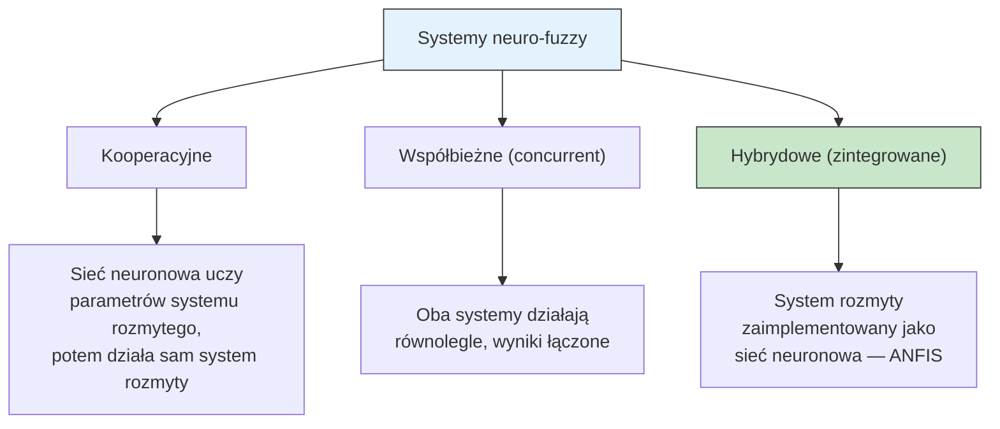
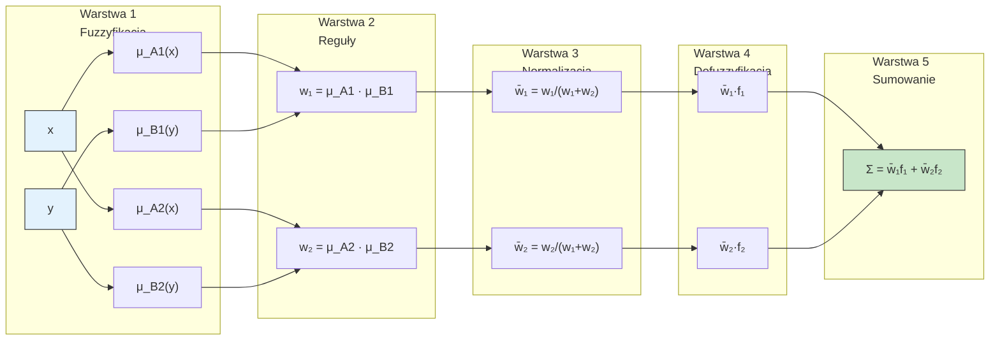
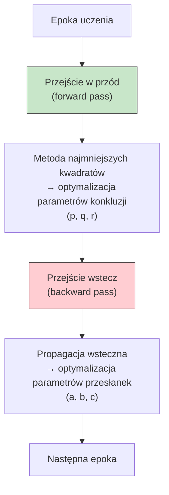
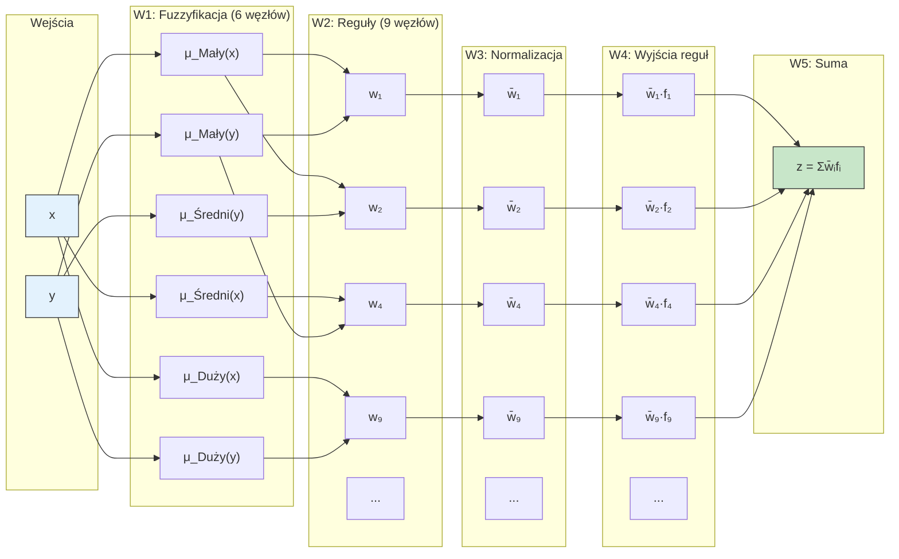

# Pytanie 25: Sieci neuronowe rozmyte – omówić struktury i metody uczenia.

## Kluczowe pojęcia

- **ANFIS (Adaptive Neuro-Fuzzy Inference System)** — adaptacyjny system wnioskowania neuronowo-rozmytego zaproponowany przez Jyh-Shing Rogera Janga (1993). Łączy zdolność uczenia sieci neuronowych z interpretowalną strukturą systemu rozmytego typu Sugeno. Parametry funkcji przynależności i reguł rozmytych są dostrajane automatycznie na podstawie danych treningowych.
- **Neuro-fuzzy (system neuronowo-rozmyty)** — klasa systemów hybrydowych łączących logikę rozmytą z sieciami neuronowymi. System rozmyty zapewnia interpretowalność (reguły IF-THEN), a mechanizm neuronowy — zdolność uczenia się z danych. ANFIS jest najważniejszym przedstawicielem tej klasy.
- **Warstwa fuzzyfikacji** — pierwsza warstwa ANFIS, w której ostre wartości wejściowe są przekształcane na stopnie przynależności do zbiorów rozmytych. Każdy węzeł oblicza wartość funkcji przynależności (np. gaussowskiej lub dzwonowej) dla odpowiedniego wejścia. Parametry funkcji przynależności (tzw. parametry przesłanek) są adaptowalne.
- **Warstwa reguł** — druga warstwa ANFIS, w której obliczane są stopnie aktywacji (siły) poszczególnych reguł rozmytych. Każdy węzeł realizuje operator T-normy (zazwyczaj iloczyn) na stopniach przynależności z warstwy fuzzyfikacji, odpowiadając jednej regule IF-THEN.
- **Warstwa normalizacji** — trzecia warstwa ANFIS, w której stopnie aktywacji reguł są normalizowane tak, aby ich suma wynosiła 1. Znormalizowany stopień aktywacji $\bar{w}_i$ określa względny udział $i$-tej reguły w wyjściu końcowym.
- **Warstwa defuzzyfikacji** — czwarta i piąta warstwa ANFIS. W warstwie czwartej obliczane są ważone wyjścia poszczególnych reguł (iloczyn znormalizowanego stopnia aktywacji i funkcji liniowej wejść — parametry konkluzji). W warstwie piątej sumowane są wyjścia wszystkich reguł, dając końcową wartość ostrą.

## Idea systemów neuronowo-rozmytych

### Motywacja

Klasyczne systemy rozmyte (Mamdani, Sugeno) wymagają ręcznego projektowania reguł i funkcji przynależności przez eksperta. Jest to czasochłonne i subiektywne. Z kolei sieci neuronowe uczą się automatycznie z danych, ale są „czarnymi skrzynkami" — trudno zinterpretować ich wewnętrzną strukturę.

**Systemy neuronowo-rozmyte** łączą zalety obu podejść:

| Cecha | Sieć neuronowa | System rozmyty | Neuro-fuzzy (ANFIS) |
|---|---|---|---|
| **Uczenie z danych** | ✓ | ✗ (ręczne) | ✓ |
| **Interpretowalność** | ✗ (czarna skrzynka) | ✓ (reguły IF-THEN) | ✓ |
| **Aproksymacja nieliniowa** | ✓ | ✓ | ✓ |
| **Ekstrakcja wiedzy** | trudna | naturalna | automatyczna |

### Klasyfikacja systemów neuro-fuzzy



ANFIS należy do kategorii **hybrydowych (zintegrowanych)** systemów neuro-fuzzy — cały system rozmyty Sugeno jest odwzorowany jako wielowarstwowa sieć neuronowa.

## Architektura ANFIS (5 warstw)

### Model Sugeno pierwszego rzędu

ANFIS implementuje system wnioskowania Takagi-Sugeno-Kang (TSK) pierwszego rzędu. Dla systemu z dwoma wejściami $x$ i $y$ oraz dwiema regułami:

**Reguła 1:** JEŚLI $x$ jest $A_1$ ORAZ $y$ jest $B_1$ TO $f_1 = p_1 x + q_1 y + r_1$

**Reguła 2:** JEŚLI $x$ jest $A_2$ ORAZ $y$ jest $B_2$ TO $f_2 = p_2 x + q_2 y + r_2$

Gdzie $A_i$, $B_i$ to zbiory rozmyte (przesłanki), a $p_i$, $q_i$, $r_i$ to parametry liniowe (konkluzje).

### Diagram architektury ANFIS



### Warstwa 1 — Fuzzyfikacja

Każdy węzeł $i$ w tej warstwie jest węzłem adaptacyjnym z funkcją:

$$O_i^1 = \mu_{A_i}(x) \quad \text{lub} \quad O_i^1 = \mu_{B_i}(y)$$

Najczęściej stosowana jest **uogólniona funkcja dzwonowa (generalized bell)**:

$$\mu_{A_i}(x) = \frac{1}{1 + \left|\frac{x - c_i}{a_i}\right|^{2b_i}}$$

lub **funkcja Gaussa**:

$$\mu_{A_i}(x) = \exp\left(-\frac{(x - c_i)^2}{2\sigma_i^2}\right)$$

Parametry $\{a_i, b_i, c_i\}$ (lub $\{c_i, \sigma_i\}$) to **parametry przesłanek (premise parameters)** — są dostrajane w procesie uczenia.

### Warstwa 2 — Reguły (iloczyn)

Każdy węzeł oblicza stopień aktywacji reguły jako iloczyn (T-norma) stopni przynależności:

$$O_i^2 = w_i = \mu_{A_i}(x) \cdot \mu_{B_i}(y), \quad i = 1, 2$$

Węzły tej warstwy są **stałe** (nieadaptacyjne) — realizują jedynie operację mnożenia.

### Warstwa 3 — Normalizacja

Każdy węzeł oblicza znormalizowany stopień aktywacji:

$$O_i^3 = \bar{w}_i = \frac{w_i}{\sum_{j=1}^{R} w_j} = \frac{w_i}{w_1 + w_2}$$

gdzie $R$ to liczba reguł. Węzły tej warstwy są **stałe** (nieadaptacyjne).

### Warstwa 4 — Ważone wyjścia reguł

Każdy węzeł jest adaptacyjny i oblicza ważone wyjście reguły:

$$O_i^4 = \bar{w}_i \cdot f_i = \bar{w}_i (p_i x + q_i y + r_i)$$

Parametry $\{p_i, q_i, r_i\}$ to **parametry konkluzji (consequent parameters)** — są dostrajane w procesie uczenia.

### Warstwa 5 — Sumowanie (wyjście)

Pojedynczy węzeł sumuje wyjścia wszystkich reguł:

$$O^5 = \sum_{i=1}^{R} \bar{w}_i f_i = \frac{\sum_{i=1}^{R} w_i f_i}{\sum_{i=1}^{R} w_i}$$

Jest to **średnia ważona** wyjść reguł, gdzie wagami są znormalizowane stopnie aktywacji.

### Podsumowanie warstw

| Warstwa | Nazwa | Typ węzłów | Wyjście | Parametry |
|---|---|---|---|---|
| **1** | Fuzzyfikacja | adaptacyjne | $\mu_{A_i}(x)$ | przesłanek: $a_i, b_i, c_i$ |
| **2** | Reguły | stałe | $w_i = \prod \mu$ | brak |
| **3** | Normalizacja | stałe | $\bar{w}_i = w_i / \sum w$ | brak |
| **4** | Defuzzyfikacja | adaptacyjne | $\bar{w}_i f_i$ | konkluzji: $p_i, q_i, r_i$ |
| **5** | Sumowanie | stałe | $\sum \bar{w}_i f_i$ | brak |

## Algorytm uczenia hybrydowego

### Dwa zbiory parametrów

ANFIS posiada dwa rodzaje parametrów do optymalizacji:

1. **Parametry przesłanek (premise parameters)** — parametry funkcji przynależności w warstwie 1 (np. $a_i, b_i, c_i$ dla funkcji dzwonowej). Określają kształt zbiorów rozmytych. Optymalizowane metodą **propagacji wstecznej (gradient descent)**.

2. **Parametry konkluzji (consequent parameters)** — współczynniki liniowe $p_i, q_i, r_i$ w warstwie 4. Określają wyjścia reguł. Optymalizowane **metodą najmniejszych kwadratów (LSE)**.

### Idea algorytmu hybrydowego

Algorytm hybrydowy Janga łączy dwie metody optymalizacji w każdej epoce uczenia:



### Przejście w przód (forward pass)

Przy ustalonych parametrach przesłanek, wyjście ANFIS jest **liniowe** względem parametrów konkluzji:

$$f = \bar{w}_1 f_1 + \bar{w}_2 f_2 = \bar{w}_1(p_1 x + q_1 y + r_1) + \bar{w}_2(p_2 x + q_2 y + r_2)$$

Rozwijając:

$$f = (\bar{w}_1 x) p_1 + (\bar{w}_1 y) q_1 + (\bar{w}_1) r_1 + (\bar{w}_2 x) p_2 + (\bar{w}_2 y) q_2 + (\bar{w}_2) r_2$$

To jest równanie liniowe postaci $f = \mathbf{a}^T \boldsymbol{\theta}$, gdzie:
- $\mathbf{a} = [\bar{w}_1 x, \bar{w}_1 y, \bar{w}_1, \bar{w}_2 x, \bar{w}_2 y, \bar{w}_2]^T$ — wektor znanych wartości
- $\boldsymbol{\theta} = [p_1, q_1, r_1, p_2, q_2, r_2]^T$ — wektor parametrów konkluzji

Dla $N$ próbek treningowych otrzymujemy układ równań liniowych:

$$\mathbf{A} \boldsymbol{\theta} = \mathbf{y}$$

Rozwiązanie metodą najmniejszych kwadratów (pseudoinwersja Moore'a-Penrose'a):

$$\boldsymbol{\theta}^* = (\mathbf{A}^T \mathbf{A})^{-1} \mathbf{A}^T \mathbf{y} = \mathbf{A}^+ \mathbf{y}$$

W praktyce stosuje się **rekurencyjną metodę najmniejszych kwadratów (RLSE)** dla efektywności obliczeniowej.

### Przejście wstecz (backward pass)

Po wyznaczeniu optymalnych parametrów konkluzji, obliczany jest błąd wyjściowy:

$$E = \frac{1}{2} \sum_{k=1}^{N} (y_k - \hat{y}_k)^2$$

Gradienty błędu względem parametrów przesłanek są obliczane metodą **propagacji wstecznej** (reguła łańcuchowa):

$$\frac{\partial E}{\partial \alpha} = \frac{\partial E}{\partial f} \cdot \frac{\partial f}{\partial \bar{w}_i} \cdot \frac{\partial \bar{w}_i}{\partial w_i} \cdot \frac{\partial w_i}{\partial \mu_{A_i}} \cdot \frac{\partial \mu_{A_i}}{\partial \alpha}$$

gdzie $\alpha$ to dowolny parametr przesłanki (np. $a_i$, $b_i$, $c_i$).

Aktualizacja parametrów przesłanek:

$$\alpha \leftarrow \alpha - \eta \frac{\partial E}{\partial \alpha}$$

gdzie $\eta$ to współczynnik uczenia (learning rate).

### Pseudokod algorytmu hybrydowego

```
ALGORYTM ANFIS_Uczenie_Hybrydowe(dane_treningowe, epoki, η)
  Wejście:
    {(x_k, y_k, d_k)}  — dane treningowe (wejścia, wyjście pożądane)
    epoki               — liczba epok uczenia
    η                   — współczynnik uczenia

  Inicjalizacja:
    Losowo zainicjalizuj parametry przesłanek {a_i, b_i, c_i}
    Ustaw parametry konkluzji {p_i, q_i, r_i} = 0

  DLA KAŻDEJ epoki = 1, 2, ..., epoki:

    // === PRZEJŚCIE W PRZÓD ===
    DLA KAŻDEJ próbki (x_k, y_k, d_k):
      1. Warstwa 1: Oblicz μ_Ai(x_k), μ_Bi(y_k) dla każdego zbioru rozmytego
      2. Warstwa 2: Oblicz w_i = μ_Ai(x_k) · μ_Bi(y_k)
      3. Warstwa 3: Oblicz w̄_i = w_i / Σw_j
      4. Zbuduj wiersz macierzy A: [w̄₁x, w̄₁y, w̄₁, w̄₂x, w̄₂y, w̄₂]

    5. Rozwiąż układ Aθ = d metodą najmniejszych kwadratów:
       θ* = (AᵀA)⁻¹Aᵀd
       → Uzyskaj optymalne {p_i, q_i, r_i}

    // === PRZEJŚCIE WSTECZ ===
    DLA KAŻDEJ próbki (x_k, y_k, d_k):
      6. Warstwa 4-5: Oblicz wyjście f = Σ w̄_i · f_i
      7. Oblicz błąd: e_k = d_k - f_k
      8. Propaguj gradient wstecz przez warstwy 5→4→3→2→1
      9. Aktualizuj parametry przesłanek:
         a_i ← a_i - η · ∂E/∂a_i
         b_i ← b_i - η · ∂E/∂b_i
         c_i ← c_i - η · ∂E/∂c_i

    Oblicz błąd średniokwadratowy epoki: MSE = (1/N) Σ e_k²
    JEŚLI MSE < próg THEN ZAKOŃCZ

  Wyjście: Wytrenowany model ANFIS
```

### Zalety algorytmu hybrydowego

| Cecha | Opis |
|---|---|
| **Szybsza zbieżność** | LSE wyznacza optymalne parametry konkluzji w jednym kroku (zamiast wielu iteracji gradientowych) |
| **Mniejszy błąd** | Podział na dwa podzbiory parametrów zmniejsza przestrzeń poszukiwań dla gradientu |
| **Stabilność** | LSE jest metodą dokładną (nie iteracyjną) dla parametrów liniowych |
| **Unikanie minimów lokalnych** | Parametry konkluzji nie utykają w minimach lokalnych (LSE daje minimum globalne) |

## Porównanie ANFIS z klasycznymi systemami rozmytymi

| Cecha | System Mamdaniego | System Sugeno (ręczny) | ANFIS |
|---|---|---|---|
| **Projektowanie reguł** | ręczne (ekspert) | ręczne (ekspert) | automatyczne (z danych) |
| **Funkcje przynależności** | ręcznie dobierane | ręcznie dobierane | uczone z danych |
| **Parametry konkluzji** | zbiory rozmyte | funkcje liniowe (stałe) | funkcje liniowe (uczone) |
| **Interpretowalność** | wysoka | średnia | średnia |
| **Dokładność** | zależy od eksperta | zależy od eksperta | wysoka (optymalizacja) |
| **Adaptacyjność** | brak | brak | pełna |
| **Wymagane dane** | wiedza ekspercka | wiedza ekspercka | dane treningowe |
| **Defuzyfikacja** | centroid (kosztowna) | średnia ważona | średnia ważona |
| **Złożoność obliczeniowa** | niska (po zaprojektowaniu) | niska | wyższa (faza uczenia) |

### Ograniczenia ANFIS

1. **Przekleństwo wymiarowości (curse of dimensionality)** — liczba reguł rośnie wykładniczo z liczbą wejść. Dla $n$ wejść i $m$ zbiorów rozmytych na wejście: $R = m^n$ reguł. Np. 5 wejść × 3 zbiory = 243 reguły.

2. **Tylko system Sugeno** — ANFIS implementuje wyłącznie wnioskowanie Sugeno (nie Mamdani), co ogranicza interpretowalność lingwistyczną konkluzji.

3. **Struktura reguł ustalona a priori** — liczba i struktura reguł muszą być określone przed uczeniem. ANFIS nie generuje automatycznie nowych reguł.

4. **Jedno wyjście** — standardowy ANFIS obsługuje tylko jedno wyjście (MISO — Multiple Input, Single Output). Dla wielu wyjść potrzeba wielu niezależnych modeli ANFIS.

## Przykłady

### Struktura ANFIS dla problemu aproksymacji funkcji

**Problem:** Aproksymacja funkcji nieliniowej $z = f(x, y) = \sin(x) \cdot \cos(y)$ na dziedzinie $x, y \in [-\pi, \pi]$.

#### Konfiguracja ANFIS

- **Wejścia:** $x$, $y$ (2 wejścia)
- **Zbiory rozmyte na wejście:** 3 (Mały, Średni, Duży) — funkcje Gaussa
- **Liczba reguł:** $3 \times 3 = 9$
- **Parametry przesłanek:** $2 \times 3 \times 2 = 12$ (2 parametry Gaussa × 3 zbiory × 2 wejścia)
- **Parametry konkluzji:** $9 \times 3 = 27$ (9 reguł × 3 parametry liniowe $p_i, q_i, r_i$)
- **Łączna liczba parametrów:** $12 + 27 = 39$

#### Przykładowe reguły (po uczeniu)

| Nr | Reguła | Konkluzja |
|---|---|---|
| 1 | JEŚLI $x$ jest Mały ORAZ $y$ jest Mały | $f_1 = 0{,}12x - 0{,}95y + 0{,}03$ |
| 2 | JEŚLI $x$ jest Mały ORAZ $y$ jest Średni | $f_2 = 0{,}08x + 0{,}01y - 0{,}02$ |
| 3 | JEŚLI $x$ jest Średni ORAZ $y$ jest Mały | $f_3 = 0{,}97x - 0{,}85y + 0{,}01$ |
| ... | ... | ... |
| 9 | JEŚLI $x$ jest Duży ORAZ $y$ jest Duży | $f_9 = -0{,}11x + 0{,}89y - 0{,}05$ |

#### Diagram warstw dla tego przykładu



#### Proces uczenia

1. **Generacja danych:** 200 próbek $(x_k, y_k, z_k)$ z siatki regularnej na $[-\pi, \pi]^2$
2. **Inicjalizacja:** Funkcje Gaussa rozmieszczone równomiernie, parametry konkluzji = 0
3. **Uczenie:** 100 epok algorytmem hybrydowym, $\eta = 0{,}01$
4. **Wynik:** MSE spada z $\approx 0{,}5$ do $\approx 0{,}001$ po 50 epokach

### Zastosowania ANFIS

| Dziedzina | Przykład zastosowania |
|---|---|
| **Sterowanie** | regulacja PID z adaptacją, sterowanie robotem |
| **Prognozowanie** | prognoza szeregów czasowych, prognoza pogody |
| **Klasyfikacja** | rozpoznawanie wzorców, diagnostyka medyczna |
| **Aproksymacja** | modelowanie nieliniowych zależności wejście-wyjście |
| **Identyfikacja systemów** | modelowanie dynamiki systemów fizycznych |
| **Przetwarzanie sygnałów** | filtracja adaptacyjna, redukcja szumów |

## Podsumowanie

1. **ANFIS** to hybrydowy system neuronowo-rozmyty implementujący wnioskowanie Sugeno jako pięciowarstwową sieć neuronową. Łączy interpretowalność systemu rozmytego (reguły IF-THEN) ze zdolnością uczenia sieci neuronowej. Zaproponowany przez Janga w 1993 roku, pozostaje jednym z najważniejszych modeli neuro-fuzzy.

2. **Architektura 5 warstw** obejmuje: fuzzyfikację (warstwa 1 — obliczanie stopni przynależności), reguły (warstwa 2 — iloczyn przesłanek), normalizację (warstwa 3 — normalizacja stopni aktywacji), defuzzyfikację (warstwa 4 — ważone wyjścia reguł) i sumowanie (warstwa 5 — końcowe wyjście). Warstwy 1 i 4 zawierają parametry adaptacyjne.

3. **Algorytm uczenia hybrydowego** dzieli parametry na dwa zbiory: parametry przesłanek (kształt funkcji przynależności) optymalizowane propagacją wsteczną oraz parametry konkluzji (współczynniki liniowe reguł) optymalizowane metodą najmniejszych kwadratów. Podział ten zapewnia szybszą zbieżność niż czysta propagacja wsteczna.

4. **Wyjście ANFIS** jest liniowe względem parametrów konkluzji (przy ustalonych przesłankach), co umożliwia zastosowanie metody najmniejszych kwadratów — dokładnej metody optymalizacji dającej minimum globalne. Parametry przesłanek są nieliniowe i wymagają metody gradientowej.

5. **Główne ograniczenie** ANFIS to wykładniczy wzrost liczby reguł z liczbą wejść (przekleństwo wymiarowości). Dla $n$ wejść i $m$ zbiorów rozmytych na wejście powstaje $m^n$ reguł, co ogranicza praktyczne zastosowanie do systemów o niewielkiej liczbie wejść (typowo 4-6).

## Powiązane pytania

- [Pytanie 24: Systemy rozmyte — podstawy matematyczne](24-systemy-rozmyte-podstawy.md)
- [Pytanie 15: Sieci samoorganizujące vs trenowane z nauczycielem](15-sieci-samoorganizujace-vs-nauczyciel.md)
- [Pytanie 16: Backpropagation](16-backpropagation.md)