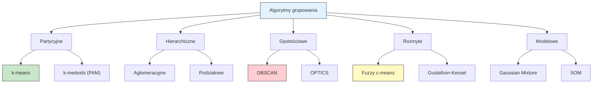
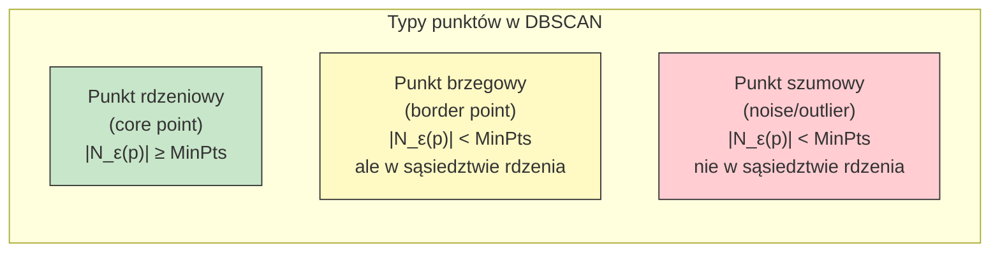
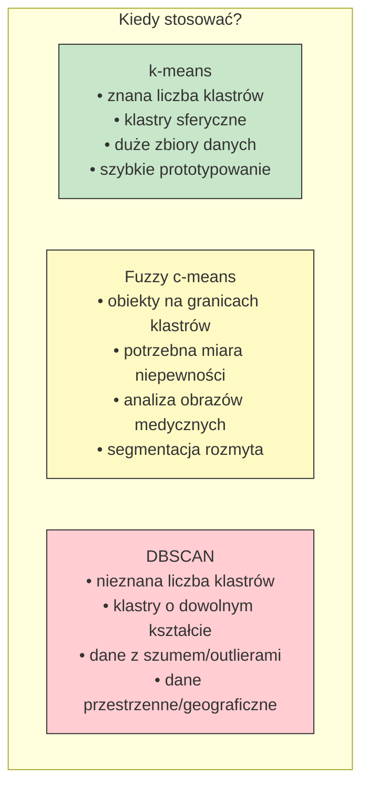

# Pytanie 26: Przedstawić algorytmy grupowania danych: klasyczne i rozmyte.

## Kluczowe pojęcia

- **k-means (k-średnich)** — klasyczny algorytm grupowania partycyjnego, w którym $k$ centroidów jest iteracyjnie przesuwanych tak, aby minimalizować sumę kwadratów odległości punktów od przypisanych centroidów. Każdy punkt należy do dokładnie jednego klastra (grupowanie twarde). Algorytm zaproponowany przez Lloyda (1957/1982) jest jednym z najczęściej stosowanych algorytmów uczenia nienadzorowanego.
- **Fuzzy c-means (FCM, rozmyte c-średnich)** — rozmyte rozszerzenie algorytmu k-means, zaproponowane przez Bezdeka (1981). Każdy punkt danych posiada stopień przynależności do każdego klastra z zakresu $[0, 1]$, przy czym suma przynależności do wszystkich klastrów wynosi 1. Pozwala to na „miękkie" przypisanie punktów leżących na granicach klastrów.
- **DBSCAN (Density-Based Spatial Clustering of Applications with Noise)** — algorytm grupowania gęstościowego zaproponowany przez Estera i in. (1996). Klastry definiowane są jako obszary o wysokiej gęstości punktów, oddzielone obszarami o niskiej gęstości. Nie wymaga podania liczby klastrów z góry i potrafi wykrywać klastry o dowolnym kształcie oraz identyfikować punkty szumowe (outliers).
- **Centroid (środek ciężkości klastra)** — punkt w przestrzeni cech będący średnią arytmetyczną wszystkich punktów przypisanych do danego klastra. W algorytmie k-means centroid $\boldsymbol{\mu}_j = \frac{1}{|C_j|} \sum_{\mathbf{x} \in C_j} \mathbf{x}$, gdzie $C_j$ to zbiór punktów klastra $j$.
- **Funkcja przynależności (membership function)** — w kontekście grupowania rozmytego, funkcja $u_{ij} \in [0, 1]$ określająca stopień przynależności punktu $\mathbf{x}_i$ do klastra $j$. W FCM spełniony jest warunek $\sum_{j=1}^{c} u_{ij} = 1$ dla każdego punktu $i$.
- **Epsilon-sąsiedztwo ($\varepsilon$-sąsiedztwo)** — w algorytmie DBSCAN, zbiór wszystkich punktów odległych od danego punktu $\mathbf{p}$ o nie więcej niż $\varepsilon$: $N_\varepsilon(\mathbf{p}) = \{\mathbf{q} \in D : d(\mathbf{p}, \mathbf{q}) \leq \varepsilon\}$. Parametr $\varepsilon$ (epsilon) definiuje promień sąsiedztwa i jest kluczowy dla działania algorytmu.

## Wprowadzenie — taksonomia metod grupowania

Grupowanie (clustering) to zadanie uczenia nienadzorowanego polegające na podziale zbioru danych na grupy (klastry) tak, aby obiekty w jednym klastrze były do siebie podobne, a obiekty z różnych klastrów — różne.



W niniejszym opracowaniu szczegółowo omówione są trzy reprezentatywne algorytmy: **k-means** (partycyjny, twardy), **fuzzy c-means** (rozmyty) i **DBSCAN** (gęstościowy).

## Algorytm k-means

### Idea

Algorytm k-means dzieli zbiór $n$ punktów $\{\mathbf{x}_1, \ldots, \mathbf{x}_n\} \subset \mathbb{R}^d$ na $k$ rozłącznych klastrów $C_1, \ldots, C_k$, minimalizując funkcję celu (sumę kwadratów wewnątrzklastrowych, WCSS):

$$J_{k\text{-means}} = \sum_{j=1}^{k} \sum_{\mathbf{x}_i \in C_j} \|\mathbf{x}_i - \boldsymbol{\mu}_j\|^2$$

gdzie $\boldsymbol{\mu}_j = \frac{1}{|C_j|} \sum_{\mathbf{x}_i \in C_j} \mathbf{x}_i$ jest centroidem klastra $C_j$.

### Algorytm (pseudokod)

```
ALGORYTM k-means(X, k)
  Wejście:
    X = {x₁, x₂, ..., xₙ}  — zbiór n punktów w ℝᵈ
    k                        — liczba klastrów

  1. INICJALIZACJA:
     Wybierz losowo k punktów z X jako początkowe centroidy μ₁, μ₂, ..., μₖ

  2. POWTARZAJ:

     // Krok przypisania (assignment step)
     3. DLA KAŻDEGO punktu xᵢ, i = 1, ..., n:
          Przypisz xᵢ do klastra o najbliższym centroidzie:
          cᵢ = arg min_j ‖xᵢ − μⱼ‖²

     // Krok aktualizacji (update step)
     4. DLA KAŻDEGO klastra j = 1, ..., k:
          Oblicz nowy centroid:
          μⱼ = (1/|Cⱼ|) · Σ_{xᵢ ∈ Cⱼ} xᵢ

  5. DOPÓKI centroidy się zmieniają (lub max_iter)

  Wyjście: Przypisania c₁, ..., cₙ oraz centroidy μ₁, ..., μₖ
```

### Złożoność obliczeniowa

| Aspekt | Złożoność |
|---|---|
| **Czasowa (jedna iteracja)** | $O(n \cdot k \cdot d)$ |
| **Czasowa (łącznie)** | $O(t \cdot n \cdot k \cdot d)$, gdzie $t$ — liczba iteracji |
| **Pamięciowa** | $O(n \cdot d + k \cdot d)$ |
| **Najgorszy przypadek** | Problem jest NP-trudny; w praktyce $t$ jest niewielkie |

### Inicjalizacja k-means++

Losowa inicjalizacja może prowadzić do słabych wyników. Metoda **k-means++** (Arthur & Vassilvitskii, 2007) wybiera początkowe centroidy tak, aby były od siebie oddalone:

```
ALGORYTM k-means++(X, k)
  1. Wybierz μ₁ losowo z X
  2. DLA j = 2, ..., k:
       Dla każdego xᵢ oblicz D(xᵢ) = min_{l<j} ‖xᵢ − μₗ‖²
       Wybierz μⱼ = xᵢ z prawdopodobieństwem proporcjonalnym do D(xᵢ)²
  3. Uruchom standardowy k-means z centroidami μ₁, ..., μₖ
```

### Własności i ograniczenia k-means

| Zaleta | Ograniczenie |
|---|---|
| Prosty i intuicyjny | Wymaga podania $k$ z góry |
| Szybki ($O(nkd)$ na iterację) | Wrażliwy na inicjalizację |
| Dobrze skaluje się do dużych zbiorów | Znajduje tylko klastry sferyczne (wypukłe) |
| Gwarantowana zbieżność | Zbieżność do minimum lokalnego (nie globalnego) |
| Łatwa interpretacja centroidów | Wrażliwy na wartości odstające (outliers) |

## Algorytm Fuzzy c-means (FCM)

### Idea

W odróżnieniu od k-means, algorytm FCM realizuje **grupowanie rozmyte** — każdy punkt $\mathbf{x}_i$ posiada stopień przynależności $u_{ij} \in [0, 1]$ do każdego klastra $j$, przy czym:

$$\sum_{j=1}^{c} u_{ij} = 1, \quad \forall i = 1, \ldots, n$$

FCM minimalizuje rozmytą funkcję celu:

$$J_{FCM} = \sum_{i=1}^{n} \sum_{j=1}^{c} u_{ij}^m \|\mathbf{x}_i - \boldsymbol{\mu}_j\|^2$$

gdzie:
- $c$ — liczba klastrów
- $m > 1$ — parametr rozmytości (fuzziness exponent), typowo $m = 2$
- $u_{ij}$ — stopień przynależności punktu $i$ do klastra $j$
- $\boldsymbol{\mu}_j$ — centroid klastra $j$

Parametr $m$ kontroluje „miękkość" grupowania:
- $m \to 1$: grupowanie zbliża się do twardego (k-means)
- $m \to \infty$: wszystkie przynależności zbliżają się do $1/c$ (brak struktury)

### Wzory aktualizacji

Minimalizacja $J_{FCM}$ metodą mnożników Lagrange'a prowadzi do dwóch reguł aktualizacji:

**Aktualizacja przynależności:**

$$u_{ij} = \frac{1}{\sum_{l=1}^{c} \left(\frac{\|\mathbf{x}_i - \boldsymbol{\mu}_j\|}{\|\mathbf{x}_i - \boldsymbol{\mu}_l\|}\right)^{\frac{2}{m-1}}}$$

**Aktualizacja centroidów:**

$$\boldsymbol{\mu}_j = \frac{\sum_{i=1}^{n} u_{ij}^m \cdot \mathbf{x}_i}{\sum_{i=1}^{n} u_{ij}^m}$$

### Algorytm (pseudokod)

```
ALGORYTM Fuzzy_C_Means(X, c, m, ε)
  Wejście:
    X = {x₁, ..., xₙ}  — zbiór n punktów w ℝᵈ
    c                    — liczba klastrów
    m                    — parametr rozmytości (typowo m = 2)
    ε                    — próg zbieżności

  1. INICJALIZACJA:
     Losowo zainicjalizuj macierz przynależności U = [uᵢⱼ]
     tak, aby Σⱼ uᵢⱼ = 1 dla każdego i, oraz uᵢⱼ ∈ [0, 1]

  2. POWTARZAJ:

     // Krok aktualizacji centroidów
     3. DLA KAŻDEGO klastra j = 1, ..., c:
          μⱼ = Σᵢ (uᵢⱼ)ᵐ · xᵢ  /  Σᵢ (uᵢⱼ)ᵐ

     // Krok aktualizacji macierzy przynależności
     4. DLA KAŻDEGO punktu i = 1, ..., n:
          DLA KAŻDEGO klastra j = 1, ..., c:
            uᵢⱼ = 1 / Σₗ (‖xᵢ − μⱼ‖ / ‖xᵢ − μₗ‖)^(2/(m−1))

     5. Oblicz zmianę: ΔU = ‖U_nowe − U_stare‖

  6. DOPÓKI ΔU > ε

  Wyjście: Macierz przynależności U oraz centroidy μ₁, ..., μ_c
```

### Macierz przynależności — interpretacja

Dla $n$ punktów i $c$ klastrów, macierz przynależności $\mathbf{U}$ ma wymiar $n \times c$:

$$\mathbf{U} = \begin{bmatrix} u_{11} & u_{12} & \cdots & u_{1c} \\ u_{21} & u_{22} & \cdots & u_{2c} \\ \vdots & \vdots & \ddots & \vdots \\ u_{n1} & u_{n2} & \cdots & u_{nc} \end{bmatrix}$$

Każdy wiersz sumuje się do 1. Punkt „pewnie" przypisany do klastra ma jedną wartość bliską 1, a pozostałe bliskie 0. Punkt na granicy klastrów ma wartości rozłożone bardziej równomiernie.

### Złożoność obliczeniowa FCM

| Aspekt | Złożoność |
|---|---|
| **Czasowa (jedna iteracja)** | $O(n \cdot c^2 \cdot d)$ |
| **Czasowa (łącznie)** | $O(t \cdot n \cdot c^2 \cdot d)$ |
| **Pamięciowa** | $O(n \cdot c + c \cdot d)$ |

## Algorytm DBSCAN

### Idea

DBSCAN definiuje klastry jako **gęste regiony** w przestrzeni danych, oddzielone regionami o niskiej gęstości. Algorytm wymaga dwóch parametrów:

- $\varepsilon$ (eps) — promień sąsiedztwa
- $MinPts$ — minimalna liczba punktów w $\varepsilon$-sąsiedztwie, aby punkt był uznany za rdzeń

### Definicje

**$\varepsilon$-sąsiedztwo** punktu $\mathbf{p}$:

$$N_\varepsilon(\mathbf{p}) = \{\mathbf{q} \in D : d(\mathbf{p}, \mathbf{q}) \leq \varepsilon\}$$

**Typy punktów:**



- **Punkt rdzeniowy (core point):** $|N_\varepsilon(\mathbf{p})| \geq MinPts$
- **Punkt brzegowy (border point):** $|N_\varepsilon(\mathbf{p})| < MinPts$, ale leży w $\varepsilon$-sąsiedztwie punktu rdzeniowego
- **Punkt szumowy (noise):** ani rdzeniowy, ani brzegowy

**Osiągalność gęstościowa:** Punkt $\mathbf{q}$ jest gęstościowo osiągalny z $\mathbf{p}$, jeśli istnieje ciąg punktów rdzeniowych $\mathbf{p} = \mathbf{p}_1, \mathbf{p}_2, \ldots, \mathbf{p}_m = \mathbf{q}$, gdzie $\mathbf{p}_{i+1} \in N_\varepsilon(\mathbf{p}_i)$.

### Algorytm (pseudokod)

```
ALGORYTM DBSCAN(X, ε, MinPts)
  Wejście:
    X = {x₁, ..., xₙ}  — zbiór n punktów
    ε                    — promień sąsiedztwa
    MinPts               — minimalna liczba punktów

  Oznacz wszystkie punkty jako NIEODWIEDZONE
  klaster_id = 0

  DLA KAŻDEGO punktu p ∈ X:
    JEŚLI p jest ODWIEDZONY: KONTYNUUJ
    Oznacz p jako ODWIEDZONY
    sąsiedzi = N_ε(p)    // znajdź wszystkie punkty w odległości ε od p

    JEŚLI |sąsiedzi| < MinPts:
      Oznacz p jako SZUM (tymczasowo)
    W PRZECIWNYM RAZIE:
      klaster_id = klaster_id + 1
      RozszerzKlaster(p, sąsiedzi, klaster_id, ε, MinPts)

PROCEDURA RozszerzKlaster(p, sąsiedzi, klaster_id, ε, MinPts)
  Przypisz p do klastra klaster_id
  DLA KAŻDEGO punktu q ∈ sąsiedzi:
    JEŚLI q jest NIEODWIEDZONY:
      Oznacz q jako ODWIEDZONY
      sąsiedzi_q = N_ε(q)
      JEŚLI |sąsiedzi_q| ≥ MinPts:
        sąsiedzi = sąsiedzi ∪ sąsiedzi_q   // rozszerz sąsiedztwo
    JEŚLI q nie jest przypisany do żadnego klastra:
      Przypisz q do klastra klaster_id

  Wyjście: Przypisania klastrów oraz zbiór punktów szumowych
```

### Złożoność obliczeniowa DBSCAN

| Aspekt | Złożoność |
|---|---|
| **Czasowa (z indeksem przestrzennym, np. R-tree)** | $O(n \log n)$ |
| **Czasowa (bez indeksu — brute force)** | $O(n^2)$ |
| **Pamięciowa** | $O(n)$ |

### Dobór parametrów DBSCAN

Dobór $\varepsilon$ i $MinPts$ jest kluczowy. Popularna heurystyka to **metoda k-distance graph**:

1. Dla każdego punktu oblicz odległość do $k$-tego najbliższego sąsiada (gdzie $k = MinPts$)
2. Posortuj odległości malejąco
3. Wykreśl wykres — punkt „łokcia" (elbow) sugeruje wartość $\varepsilon$

Typowa reguła: $MinPts \geq d + 1$, gdzie $d$ to wymiarowość danych. Dla danych 2D często $MinPts = 4$.

## Porównanie metod

| Cecha | k-means | Fuzzy c-means | DBSCAN |
|---|---|---|---|
| **Typ grupowania** | twarde (hard) | rozmyte (soft) | twarde + szum |
| **Parametry** | $k$ (liczba klastrów) | $c$ (liczba klastrów), $m$ | $\varepsilon$, $MinPts$ |
| **Wymaga $k$ z góry** | tak | tak | nie |
| **Kształt klastrów** | sferyczny (wypukły) | sferyczny (wypukły) | dowolny |
| **Obsługa szumu** | brak (wrażliwy) | częściowa (niskie $u_{ij}$) | tak (punkty szumowe) |
| **Złożoność** | $O(nkd)$ / iterację | $O(nc^2d)$ / iterację | $O(n \log n)$ z indeksem |
| **Determinizm** | nie (losowa inicjalizacja) | nie (losowa inicjalizacja) | tak (deterministyczny*) |
| **Interpretowalność** | centroidy | centroidy + przynależności | gęstość |
| **Klastry różnej wielkości** | słabo | słabo | dobrze |
| **Klastry różnej gęstości** | nie | nie | słabo |

\* DBSCAN jest deterministyczny dla punktów rdzeniowych; punkty brzegowe mogą być przypisane do różnych klastrów w zależności od kolejności przetwarzania.



## Przykłady

### Zbiór danych testowych

Rozważmy zbiór 12 punktów w $\mathbb{R}^2$:

| Punkt | $x$ | $y$ |
|---|---|---|
| $\mathbf{x}_1$ | 1.0 | 1.0 |
| $\mathbf{x}_2$ | 1.5 | 2.0 |
| $\mathbf{x}_3$ | 2.0 | 1.5 |
| $\mathbf{x}_4$ | 5.0 | 5.0 |
| $\mathbf{x}_5$ | 5.5 | 4.5 |
| $\mathbf{x}_6$ | 6.0 | 5.5 |
| $\mathbf{x}_7$ | 9.0 | 1.0 |
| $\mathbf{x}_8$ | 9.5 | 1.5 |
| $\mathbf{x}_9$ | 10.0 | 1.0 |
| $\mathbf{x}_{10}$ | 3.0 | 8.0 |
| $\mathbf{x}_{11}$ | 5.0 | 1.0 |
| $\mathbf{x}_{12}$ | 15.0 | 15.0 |

Wizualnie widać trzy skupiska: lewy dolny ($\mathbf{x}_1$–$\mathbf{x}_3$), środkowy ($\mathbf{x}_4$–$\mathbf{x}_6$), prawy dolny ($\mathbf{x}_7$–$\mathbf{x}_9$), oraz potencjalne punkty odstające ($\mathbf{x}_{10}$, $\mathbf{x}_{11}$, $\mathbf{x}_{12}$).

### Przykład 1: k-means ($k = 3$)

**Iteracja 0 — Inicjalizacja:** Wybieramy $\boldsymbol{\mu}_1 = (1.0, 1.0)$, $\boldsymbol{\mu}_2 = (5.0, 5.0)$, $\boldsymbol{\mu}_3 = (9.0, 1.0)$.

**Iteracja 1 — Przypisanie:** Każdy punkt do najbliższego centroidu (odległość euklidesowa):

| Punkt | $d(\cdot, \mu_1)$ | $d(\cdot, \mu_2)$ | $d(\cdot, \mu_3)$ | Klaster |
|---|---|---|---|---|
| $\mathbf{x}_1$ (1,1) | 0.00 | 5.66 | 8.00 | C₁ |
| $\mathbf{x}_2$ (1.5,2) | 1.12 | 4.61 | 7.57 | C₁ |
| $\mathbf{x}_3$ (2,1.5) | 1.12 | 4.61 | 7.02 | C₁ |
| $\mathbf{x}_4$ (5,5) | 5.66 | 0.00 | 5.66 | C₂ |
| $\mathbf{x}_5$ (5.5,4.5) | 5.52 | 0.71 | 4.95 | C₂ |
| $\mathbf{x}_6$ (6,5.5) | 6.26 | 1.12 | 5.41 | C₂ |
| $\mathbf{x}_7$ (9,1) | 8.00 | 5.66 | 0.00 | C₃ |
| $\mathbf{x}_8$ (9.5,1.5) | 8.52 | 5.52 | 0.71 | C₃ |
| $\mathbf{x}_9$ (10,1) | 9.00 | 6.40 | 1.00 | C₃ |
| $\mathbf{x}_{10}$ (3,8) | 7.28 | 3.61 | 9.22 | C₂ |
| $\mathbf{x}_{11}$ (5,1) | 4.00 | 4.00 | 4.00 | C₁* |
| $\mathbf{x}_{12}$ (15,15) | 18.44 | 14.14 | 15.23 | C₂ |

\* Punkt $\mathbf{x}_{11}$ jest równoodległy — przypisany do C₁ (lub losowo).

**Iteracja 1 — Aktualizacja centroidów:**
- $\boldsymbol{\mu}_1 = \frac{1}{4}((1+1.5+2+5), (1+2+1.5+1)) = (2.375, 1.375)$
- $\boldsymbol{\mu}_2 = \frac{1}{4}((5+5.5+6+3+15), (5+4.5+5.5+8+15)) = (6.9, 7.6)$
- $\boldsymbol{\mu}_3 = \frac{1}{3}((9+9.5+10), (1+1.5+1)) = (9.5, 1.17)$

Algorytm kontynuuje iteracje aż do zbieżności centroidów.

### Przykład 2: Fuzzy c-means ($c = 3$, $m = 2$)

Po zbieżności algorytmu FCM, przykładowa macierz przynależności (fragment):

| Punkt | $u_{i1}$ (C₁) | $u_{i2}$ (C₂) | $u_{i3}$ (C₃) | Suma |
|---|---|---|---|---|
| $\mathbf{x}_1$ (1,1) | **0.92** | 0.03 | 0.05 | 1.00 |
| $\mathbf{x}_2$ (1.5,2) | **0.88** | 0.06 | 0.06 | 1.00 |
| $\mathbf{x}_4$ (5,5) | 0.05 | **0.90** | 0.05 | 1.00 |
| $\mathbf{x}_7$ (9,1) | 0.04 | 0.03 | **0.93** | 1.00 |
| $\mathbf{x}_{11}$ (5,1) | 0.33 | 0.22 | **0.45** | 1.00 |
| $\mathbf{x}_{12}$ (15,15) | 0.08 | **0.72** | 0.20 | 1.00 |

Obserwacje:
- Punkty blisko centroidów mają wysoką przynależność do jednego klastra ($\mathbf{x}_1$: 0.92 do C₁)
- Punkt $\mathbf{x}_{11}$ (5,1) leży między klastrami — przynależności są rozłożone (0.33, 0.22, 0.45)
- FCM daje bogatszą informację niż k-means o niepewności przypisania

### Przykład 3: DBSCAN ($\varepsilon = 2.0$, $MinPts = 2$)

**Krok 1 — Obliczenie $\varepsilon$-sąsiedztw:**

| Punkt | $N_\varepsilon(\mathbf{p})$ | $|N_\varepsilon|$ | Typ |
|---|---|---|---|
| $\mathbf{x}_1$ (1,1) | {x₁, x₂, x₃} | 3 | rdzeniowy |
| $\mathbf{x}_2$ (1.5,2) | {x₁, x₂, x₃} | 3 | rdzeniowy |
| $\mathbf{x}_3$ (2,1.5) | {x₁, x₂, x₃} | 3 | rdzeniowy |
| $\mathbf{x}_4$ (5,5) | {x₄, x₅, x₆} | 3 | rdzeniowy |
| $\mathbf{x}_5$ (5.5,4.5) | {x₄, x₅, x₆} | 3 | rdzeniowy |
| $\mathbf{x}_6$ (6,5.5) | {x₄, x₅, x₆} | 3 | rdzeniowy |
| $\mathbf{x}_7$ (9,1) | {x₇, x₈, x₉} | 3 | rdzeniowy |
| $\mathbf{x}_8$ (9.5,1.5) | {x₇, x₈, x₉} | 3 | rdzeniowy |
| $\mathbf{x}_9$ (10,1) | {x₇, x₈, x₉} | 3 | rdzeniowy |
| $\mathbf{x}_{10}$ (3,8) | {x₁₀} | 1 | **szum** |
| $\mathbf{x}_{11}$ (5,1) | {x₁₁} | 1 | **szum** |
| $\mathbf{x}_{12}$ (15,15) | {x₁₂} | 1 | **szum** |

**Krok 2 — Formowanie klastrów:**
- **Klaster 1:** {x₁, x₂, x₃} — połączone gęstościowo
- **Klaster 2:** {x₄, x₅, x₆} — połączone gęstościowo
- **Klaster 3:** {x₇, x₈, x₉} — połączone gęstościowo
- **Szum:** {x₁₀, x₁₁, x₁₂} — punkty izolowane

### Porównanie wyników na tym samym zbiorze

| Punkt | k-means (k=3) | FCM (c=3) | DBSCAN (ε=2, MinPts=2) |
|---|---|---|---|
| $\mathbf{x}_1$–$\mathbf{x}_3$ | C₁ | C₁ (wysoka przynależność) | Klaster 1 |
| $\mathbf{x}_4$–$\mathbf{x}_6$ | C₂ | C₂ (wysoka przynależność) | Klaster 2 |
| $\mathbf{x}_7$–$\mathbf{x}_9$ | C₃ | C₃ (wysoka przynależność) | Klaster 3 |
| $\mathbf{x}_{10}$ (3,8) | C₂ (wymuszony) | C₂ (umiarkowana) | **szum** |
| $\mathbf{x}_{11}$ (5,1) | C₁ lub C₃ | mieszana przynależność | **szum** |
| $\mathbf{x}_{12}$ (15,15) | C₂ (wymuszony) | C₂ (niska) | **szum** |

Kluczowe różnice:
- **k-means** wymusza przypisanie każdego punktu do klastra, nawet outlierów ($\mathbf{x}_{12}$)
- **FCM** sygnalizuje niepewność niskimi wartościami przynależności dla punktów odstających
- **DBSCAN** jawnie identyfikuje punkty szumowe, nie wymuszając ich przypisania

## Podsumowanie

1. **k-means** to najpopularniejszy algorytm grupowania partycyjnego. Iteracyjnie przypisuje punkty do najbliższego centroidu i aktualizuje centroidy. Jest szybki ($O(nkd)$ na iterację), ale wymaga podania $k$ z góry, znajduje tylko klastry sferyczne i jest wrażliwy na inicjalizację (rozwiązanie: k-means++).

2. **Fuzzy c-means (FCM)** rozszerza k-means o grupowanie rozmyte — każdy punkt ma stopień przynależności $u_{ij} \in [0, 1]$ do każdego klastra. Minimalizuje rozmytą funkcję celu z parametrem rozmytości $m$. Macierz przynależności dostarcza informacji o niepewności przypisania, co jest cenne w analizie obrazów medycznych i segmentacji.

3. **DBSCAN** to algorytm gęstościowy definiujący klastry jako gęste regiony oddzielone obszarami rzadkimi. Nie wymaga podania liczby klastrów, wykrywa klastry o dowolnym kształcie i identyfikuje punkty szumowe. Wymaga parametrów $\varepsilon$ i $MinPts$, których dobór wpływa na wynik.

4. **Wybór algorytmu** zależy od charakterystyki danych: k-means dla dużych zbiorów z klastrami sferycznymi, FCM gdy potrzebna jest miara niepewności przypisania, DBSCAN dla danych z szumem i klastrami o nieregularnych kształtach.

5. Wszystkie trzy algorytmy mają ograniczenia: k-means i FCM zakładają klastry o podobnej wielkości i kształcie, DBSCAN ma trudności z klastrami o różnej gęstości. W praktyce warto porównać wyniki kilku metod i stosować miary jakości grupowania (silhouette score, indeks Davisa-Bouldina).

## Powiązane pytania

- [Pytanie 15: Sieci samoorganizujące vs trenowane z nauczycielem](15-sieci-samoorganizujace-vs-nauczyciel.md)
- [Pytanie 19: SVM](19-svm.md)
- [Pytanie 24: Systemy rozmyte — podstawy matematyczne](24-systemy-rozmyte-podstawy.md)
