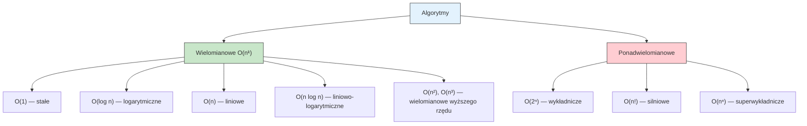
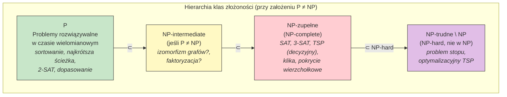
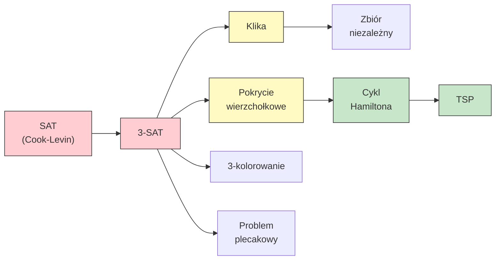

# Pytanie 27: W jaki sposób opisuje się złożoność obliczeniową algorytmów? Podać podział algorytmów według złożoności obliczeniowej.

## Kluczowe pojęcia

- **Notacja O (duże O, Big-O)** — asymptotyczne ograniczenie górne tempa wzrostu funkcji. Formalnie: $f(n) = O(g(n))$ wtedy i tylko wtedy, gdy istnieją stałe $c > 0$ i $n_0 \geq 0$ takie, że $f(n) \leq c \cdot g(n)$ dla wszystkich $n \geq n_0$. Opisuje pesymistyczny (najgorszy) przypadek złożoności algorytmu. Przykład: algorytm o złożoności $3n^2 + 5n + 7$ jest $O(n^2)$.
- **Notacja Ω (duże Omega)** — asymptotyczne ograniczenie dolne tempa wzrostu funkcji. Formalnie: $f(n) = \Omega(g(n))$ wtedy i tylko wtedy, gdy istnieją stałe $c > 0$ i $n_0 \geq 0$ takie, że $f(n) \geq c \cdot g(n)$ dla wszystkich $n \geq n_0$. Opisuje optymistyczny (najlepszy) przypadek lub dolne ograniczenie problemu.
- **Notacja Θ (duże Theta)** — asymptotycznie ścisłe ograniczenie tempa wzrostu funkcji. Formalnie: $f(n) = \Theta(g(n))$ wtedy i tylko wtedy, gdy $f(n) = O(g(n))$ i $f(n) = \Omega(g(n))$. Oznacza, że funkcja rośnie dokładnie tak szybko jak $g(n)$ (z dokładnością do stałej).
- **Klasa P (Polynomial time)** — klasa problemów decyzyjnych rozwiązywalnych w czasie wielomianowym przez deterministyczną maszynę Turinga. Formalnie: $P = \bigcup_{k=0}^{\infty} \text{DTIME}(n^k)$. Problemy z klasy P uważa się za „efektywnie rozwiązywalne". Przykłady: sortowanie, wyszukiwanie binarne, najkrótsza ścieżka (Dijkstra).
- **Klasa NP (Nondeterministic Polynomial time)** — klasa problemów decyzyjnych, dla których rozwiązanie (świadek) można zweryfikować w czasie wielomianowym przez deterministyczną maszynę Turinga. Równoważnie: problemy rozwiązywalne w czasie wielomianowym przez niedeterministyczną maszynę Turinga. Zachodzi $P \subseteq NP$.
- **Problem NP-zupełny (NP-complete)** — problem decyzyjny $L$ jest NP-zupełny, jeśli: (1) $L \in NP$ oraz (2) każdy problem z NP jest wielomianowo redukowalny do $L$ ($\forall L' \in NP: L' \leq_p L$). Problemy NP-zupełne są „najtrudniejszymi" problemami w NP — jeśli którykolwiek z nich da się rozwiązać w czasie wielomianowym, to $P = NP$.
- **Problem NP-trudny (NP-hard)** — problem $H$ jest NP-trudny, jeśli każdy problem z NP jest wielomianowo redukowalny do $H$. Problem NP-trudny nie musi należeć do NP (nie musi być problemem decyzyjnym). Każdy problem NP-zupełny jest NP-trudny, ale nie odwrotnie.
- **Redukcja wielomianowa (polynomial-time reduction)** — przekształcenie instancji problemu $A$ na instancję problemu $B$ w czasie wielomianowym, takie że odpowiedź na $A$ jest „tak" wtedy i tylko wtedy, gdy odpowiedź na $B$ jest „tak". Zapisujemy $A \leq_p B$. Redukcja jest kluczowym narzędziem do dowodzenia NP-zupełności.

## Notacje asymptotyczne — definicje formalne

Notacje asymptotyczne służą do opisu tempa wzrostu funkcji złożoności algorytmów, abstrahując od stałych multiplikatywnych i składników niższego rzędu. Pozwalają porównywać algorytmy niezależnie od sprzętu i szczegółów implementacji.

### Notacja O (ograniczenie górne)

$$O(g(n)) = \{f(n) : \exists\, c > 0,\; n_0 \geq 0 \;\text{ takie, że }\; 0 \leq f(n) \leq c \cdot g(n) \;\;\forall\, n \geq n_0\}$$

Intuicja: $f(n)$ rośnie **nie szybciej** niż $g(n)$ (z dokładnością do stałej) dla dostatecznie dużych $n$.

**Przykłady:**
- $5n^2 + 3n + 10 = O(n^2)$ — bo $5n^2 + 3n + 10 \leq 6n^2$ dla $n \geq 10$
- $\log_2 n = O(n)$ — logarytm rośnie wolniej niż funkcja liniowa
- $2^n = O(3^n)$ — ale $2^n \neq O(n^k)$ dla żadnego stałego $k$

### Notacja Ω (ograniczenie dolne)

$$\Omega(g(n)) = \{f(n) : \exists\, c > 0,\; n_0 \geq 0 \;\text{ takie, że }\; f(n) \geq c \cdot g(n) \geq 0 \;\;\forall\, n \geq n_0\}$$

Intuicja: $f(n)$ rośnie **nie wolniej** niż $g(n)$ dla dostatecznie dużych $n$.

**Przykłady:**
- $3n^2 + n = \Omega(n^2)$ — bo $3n^2 + n \geq 3n^2 \geq n^2$ dla $n \geq 1$
- Sortowanie porównawcze: $\Omega(n \log n)$ — dolne ograniczenie problemu

### Notacja Θ (ograniczenie ścisłe)

$$\Theta(g(n)) = \{f(n) : \exists\, c_1, c_2 > 0,\; n_0 \geq 0 \;\text{ takie, że }\; c_1 \cdot g(n) \leq f(n) \leq c_2 \cdot g(n) \;\;\forall\, n \geq n_0\}$$

Równoważnie: $f(n) = \Theta(g(n)) \iff f(n) = O(g(n)) \;\wedge\; f(n) = \Omega(g(n))$.

Intuicja: $f(n)$ rośnie **dokładnie tak szybko** jak $g(n)$ (z dokładnością do stałych).

**Przykład:** $4n^2 + 2n - 1 = \Theta(n^2)$, bo:
- Ograniczenie górne: $4n^2 + 2n - 1 \leq 5n^2$ dla $n \geq 2$ → $O(n^2)$
- Ograniczenie dolne: $4n^2 + 2n - 1 \geq 4n^2 - 1 \geq 3n^2$ dla $n \geq 1$ → $\Omega(n^2)$

### Notacje pomocnicze

| Notacja | Znaczenie | Analogia |
|---|---|---|
| $f = O(g)$ | $f$ rośnie nie szybciej niż $g$ | $f \leq g$ (asymptotycznie) |
| $f = \Omega(g)$ | $f$ rośnie nie wolniej niż $g$ | $f \geq g$ (asymptotycznie) |
| $f = \Theta(g)$ | $f$ rośnie tak samo szybko jak $g$ | $f = g$ (asymptotycznie) |
| $f = o(g)$ | $f$ rośnie ściśle wolniej niż $g$ | $f < g$ (asymptotycznie) |
| $f = \omega(g)$ | $f$ rośnie ściśle szybciej niż $g$ | $f > g$ (asymptotycznie) |

## Hierarchia złożoności czasowej

Poniższa tabela przedstawia najczęściej spotykane klasy złożoności czasowej, uporządkowane od najszybszych do najwolniejszych:

| Klasa | Notacja | Nazwa | Przykład algorytmu |
|---|---|---|---|
| Stała | $O(1)$ | constant | Dostęp do elementu tablicy po indeksie |
| Logarytmiczna | $O(\log n)$ | logarithmic | Wyszukiwanie binarne |
| Liniowa | $O(n)$ | linear | Wyszukiwanie liniowe, przejście listy |
| Liniowo-logarytmiczna | $O(n \log n)$ | linearithmic | Mergesort, Heapsort |
| Kwadratowa | $O(n^2)$ | quadratic | Bubble sort, Insertion sort |
| Sześcienna | $O(n^3)$ | cubic | Mnożenie macierzy (naiwne) |
| Wielomianowa | $O(n^k)$ | polynomial | Klasa P |
| Wykładnicza | $O(2^n)$ | exponential | Brute-force TSP, problem plecakowy 0-1 |
| Silniowa | $O(n!)$ | factorial | Generowanie permutacji |

### Podział algorytmów według złożoności



Granica między algorytmami „efektywnymi" a „nieefektywnymi" przebiega tradycyjnie między złożonością wielomianową a wykładniczą. Algorytmy wielomianowe ($O(n^k)$ dla stałego $k$) uważa się za praktycznie wykonalne, natomiast algorytmy wykładnicze ($O(c^n)$ dla $c > 1$) stają się niewykonalne już dla umiarkowanych rozmiarów danych.

### Porównanie tempa wzrostu

Dla ilustracji, poniższa tabela pokazuje liczbę operacji dla różnych złożoności przy $n = 10, 100, 1000$:

| $n$ | $\log_2 n$ | $n$ | $n \log_2 n$ | $n^2$ | $n^3$ | $2^n$ |
|---|---|---|---|---|---|---|
| 10 | 3.3 | 10 | 33 | 100 | 1 000 | 1 024 |
| 100 | 6.6 | 100 | 664 | 10 000 | $10^6$ | $\approx 10^{30}$ |
| 1 000 | 10 | 1 000 | 9 966 | $10^6$ | $10^9$ | $\approx 10^{301}$ |

Przy $n = 100$ algorytm $O(2^n)$ wymaga $\approx 10^{30}$ operacji — nawet komputer wykonujący $10^{12}$ operacji na sekundę potrzebowałby $\approx 10^{18}$ sekund ($\approx 3 \times 10^{10}$ lat).

## Klasy złożoności obliczeniowej

### Klasa P

Klasa **P** (Polynomial time) zawiera problemy decyzyjne rozwiązywalne w czasie wielomianowym przez deterministyczną maszynę Turinga:

$$P = \bigcup_{k=0}^{\infty} \text{DTIME}(n^k)$$

gdzie $\text{DTIME}(f(n))$ to klasa problemów rozwiązywalnych w czasie $O(f(n))$ przez deterministyczną maszynę Turinga.

**Przykłady problemów z klasy P:**
- Sortowanie tablicy — $O(n \log n)$
- Wyszukiwanie binarne — $O(\log n)$
- Najkrótsza ścieżka w grafie (Dijkstra) — $O((V + E) \log V)$
- Sprawdzanie, czy liczba jest pierwsza (AKS) — $O((\log n)^{6+\varepsilon})$
- Dopasowanie w grafie dwudzielnym (Hopcroft-Karp) — $O(E \sqrt{V})$
- 2-SAT — $O(V + E)$

### Klasa NP

Klasa **NP** (Nondeterministic Polynomial time) zawiera problemy decyzyjne, dla których istnieje wielomianowy weryfikator:

$$NP = \{L : \exists\, \text{weryfikator } V \text{ i wielomian } p \text{ takie, że } x \in L \iff \exists\, w,\; |w| \leq p(|x|),\; V(x, w) = 1\}$$

Innymi słowy: problem należy do NP, jeśli dla każdej instancji z odpowiedzią „tak" istnieje **świadek** (certyfikat) $w$ o wielomianowej długości, który można zweryfikować w czasie wielomianowym.

**Równoważna definicja:** NP to klasa problemów rozwiązywalnych w czasie wielomianowym przez **niedeterministyczną** maszynę Turinga.

**Kluczowa relacja:** $P \subseteq NP$ — każdy problem rozwiązywalny w czasie wielomianowym jest też weryfikowalny w czasie wielomianowym (sam algorytm rozwiązujący służy jako weryfikator).

### Klasa NP-zupełna (NP-complete)

Problem $L$ jest **NP-zupełny**, jeśli spełnia dwa warunki:

1. $L \in NP$ (problem jest weryfikowalny w czasie wielomianowym)
2. $\forall\, L' \in NP: L' \leq_p L$ (każdy problem z NP jest wielomianowo redukowalny do $L$)

Warunek (2) oznacza, że $L$ jest **NP-trudny** (NP-hard). Problem NP-zupełny jest więc jednocześnie w NP i NP-trudny.

**Twierdzenie Cooka-Levina (1971):** Problem SAT (spełnialność formuł logicznych w postaci CNF) jest NP-zupełny. Był to pierwszy problem, dla którego udowodniono NP-zupełność.

### Klasa NP-trudna (NP-hard)

Problem $H$ jest **NP-trudny**, jeśli:

$$\forall\, L \in NP: L \leq_p H$$

Problem NP-trudny **nie musi** należeć do NP. Przykładowo, problem stopu (Halting Problem) jest NP-trudny, ale nie należy do NP (jest nierozstrzygalny).

### Redukcja wielomianowa

**Redukcja wielomianowa** (Karp reduction) z problemu $A$ do problemu $B$ to funkcja $f$ obliczalna w czasie wielomianowym taka, że:

$$x \in A \iff f(x) \in B$$

Zapisujemy: $A \leq_p B$ (problem $A$ redukuje się wielomianowo do $B$).

**Schemat dowodzenia NP-zupełności** nowego problemu $L$:
1. Pokaż, że $L \in NP$ (podaj weryfikator wielomianowy)
2. Wybierz znany problem NP-zupełny $L'$
3. Skonstruuj redukcję wielomianową $L' \leq_p L$
4. Udowodnij poprawność redukcji (zachowanie odpowiedzi „tak"/„nie")

```
SCHEMAT REDUKCJI:

  Instancja problemu A  ──f(x)──▶  Instancja problemu B
         │                                    │
    odpowiedź "tak"  ◀═══════════▶  odpowiedź "tak"
    odpowiedź "nie"  ◀═══════════▶  odpowiedź "nie"

  f jest obliczalna w czasie wielomianowym
```

### Diagram klas złożoności



Relacje między klasami (przy założeniu $P \neq NP$):

$$P \subsetneq NP$$

$$NP\text{-complete} \subset NP \setminus P$$

$$NP\text{-complete} \subset NP\text{-hard}$$

$$NP\text{-hard} \not\subseteq NP$$

## Problem P vs NP

### Sformułowanie

Pytanie **P vs NP** jest jednym z siedmiu Problemów Milenijnych (Clay Mathematics Institute, nagroda 1 mln USD):

> Czy $P = NP$?

Innymi słowy: czy każdy problem, którego rozwiązanie można **zweryfikować** w czasie wielomianowym, da się również **rozwiązać** w czasie wielomianowym?

### Konsekwencje

| Scenariusz | Konsekwencje |
|---|---|
| **$P = NP$** | Wszystkie problemy NP-zupełne mają algorytmy wielomianowe. Kryptografia oparta na trudności obliczeniowej (RSA, ECC) traci bezpieczeństwo. Rewolucja w optymalizacji, AI, bioinformatyce. |
| **$P \neq NP$** | Istnieją problemy weryfikowalne w czasie wielomianowym, ale nierozwiązywalne w czasie wielomianowym. Uzasadnia stosowanie heurystyk i algorytmów aproksymacyjnych dla problemów NP-trudnych. |

### Stan wiedzy

- Większość informatyków uważa, że $P \neq NP$ (ankieta Gasarcha, 2019: ~80% respondentów)
- Nie istnieje dowód ani $P = NP$, ani $P \neq NP$
- Udowodniono bariery (relativization, natural proofs, algebrization), które wykluczają pewne techniki dowodowe
- Twierdzenie Ladnera (1975): jeśli $P \neq NP$, to istnieją problemy w $NP \setminus (P \cup NP\text{-complete})$ — tzw. problemy **NP-intermediate**

## Przykłady problemów NP-zupełnych

### SAT (Boolean Satisfiability Problem)

**Problem:** Czy istnieje przypisanie wartości logicznych zmiennym formuły boolowskiej w postaci CNF (koniunkcyjnej postaci normalnej), które czyni ją prawdziwą?

**Przykład:** Formuła $(x_1 \lor \neg x_2) \land (\neg x_1 \lor x_3) \land (x_2 \lor \neg x_3)$

Przypisanie $x_1 = 1, x_2 = 1, x_3 = 1$: $(1 \lor 0) \land (0 \lor 1) \land (1 \lor 0) = 1 \land 1 \land 1 = 1$ ✓

**NP-zupełność:** Twierdzenie Cooka-Levina (1971) — SAT był pierwszym problemem, dla którego udowodniono NP-zupełność. Dowód polega na symulacji obliczeń niedeterministycznej maszyny Turinga formułą boolowską.

**Wariant 3-SAT:** Każda klauzula ma dokładnie 3 literały. Również NP-zupełny (redukcja z SAT). Natomiast **2-SAT** jest w P.

### TSP (Travelling Salesman Problem)

**Problem (wersja decyzyjna):** Czy istnieje trasa odwiedzająca wszystkie $n$ miast dokładnie raz i wracająca do punktu startowego, o łącznym koszcie $\leq k$?

**NP-zupełność:** Redukcja z problemu cyklu Hamiltona (który jest NP-zupełny).

**Złożoność brute-force:** $O(n!)$ — sprawdzenie wszystkich permutacji. Algorytm dynamiczny (Held-Karp): $O(n^2 \cdot 2^n)$ — lepszy, ale nadal wykładniczy.

```
ALGORYTM TSP_BruteForce(G, n)
  Wejście: graf pełny G z wagami, n miast
  min_koszt = ∞
  DLA KAŻDEJ permutacji π miast {2, 3, ..., n}:
    koszt = w(1, π[1])
    DLA i = 1 DO n-2:
      koszt = koszt + w(π[i], π[i+1])
    koszt = koszt + w(π[n-1], 1)
    min_koszt = min(min_koszt, koszt)
  ZWRÓĆ min_koszt
```

### Problem kliki (Clique)

**Problem:** Czy w grafie nieskierowanym $G = (V, E)$ istnieje klika (podgraf pełny) o rozmiarze $\geq k$?

**NP-zupełność:** Redukcja z 3-SAT. Dla formuły z $m$ klauzulami tworzymy graf, w którym klika rozmiaru $m$ odpowiada spełniającemu przypisaniu.

### Inne ważne problemy NP-zupełne

| Problem | Opis | Redukcja z |
|---|---|---|
| **3-SAT** | Spełnialność formuły CNF z klauzulami 3-literałowymi | SAT |
| **Pokrycie wierzchołkowe** | Czy istnieje zbiór $\leq k$ wierzchołków pokrywający wszystkie krawędzie? | 3-SAT |
| **Zbiór niezależny** | Czy istnieje zbiór $\geq k$ wierzchołków parami niepołączonych? | Klika (dopełnienie grafu) |
| **Kolorowanie grafu** | Czy graf jest $k$-kolorowalny (dla $k \geq 3$)? | 3-SAT |
| **Problem plecakowy (0-1)** | Czy istnieje podzbiór przedmiotów o wartości $\geq V$ i wadze $\leq W$? | Pokrycie dokładne |
| **Cykl Hamiltona** | Czy w grafie istnieje cykl przechodzący przez każdy wierzchołek dokładnie raz? | Pokrycie wierzchołkowe |
| **Izomorfizm podgrafu** | Czy graf $H$ jest podgrafem grafu $G$? | Klika |

### Łańcuch redukcji



## Przykłady

### Analiza złożoności konkretnych algorytmów

#### Wyszukiwanie liniowe — $O(n)$

```
ALGORYTM WyszukiwanieLiniowe(A, n, klucz)
  Wejście: tablica A[1..n], szukany klucz
  DLA i = 1 DO n:
    JEŚLI A[i] = klucz:
      ZWRÓĆ i
  ZWRÓĆ -1  // nie znaleziono
```

**Analiza:**
- Pętla wykonuje się co najwyżej $n$ razy
- Każda iteracja: $O(1)$ (jedno porównanie)
- **Najgorszy przypadek:** $T(n) = O(n)$ (element na końcu lub brak)
- **Najlepszy przypadek:** $T(n) = O(1)$ (element na początku)
- **Średni przypadek:** $T(n) = O(n)$ (oczekiwana pozycja: $n/2$)

#### Wyszukiwanie binarne — $O(\log n)$

```
ALGORYTM WyszukiwanieBinarne(A, n, klucz)
  Wejście: posortowana tablica A[1..n], szukany klucz
  lewy = 1, prawy = n
  DOPÓKI lewy ≤ prawy:
    środek = ⌊(lewy + prawy) / 2⌋
    JEŚLI A[środek] = klucz:
      ZWRÓĆ środek
    JEŚLI A[środek] < klucz:
      lewy = środek + 1
    W PRZECIWNYM RAZIE:
      prawy = środek - 1
  ZWRÓĆ -1
```

**Analiza:**
- W każdej iteracji zakres przeszukiwania zmniejsza się o połowę
- Po $k$ iteracjach: zakres $= n / 2^k$
- Algorytm kończy się, gdy $n / 2^k \leq 1$, czyli $k \leq \log_2 n$
- **Złożoność:** $T(n) = O(\log n)$

#### Sortowanie przez scalanie (Mergesort) — $\Theta(n \log n)$

```
ALGORYTM MergeSort(A, lewy, prawy)
  Wejście: tablica A, indeksy lewy i prawy
  JEŚLI lewy < prawy:
    środek = ⌊(lewy + prawy) / 2⌋
    MergeSort(A, lewy, środek)        // T(n/2)
    MergeSort(A, środek + 1, prawy)   // T(n/2)
    Merge(A, lewy, środek, prawy)     // O(n)
```

**Analiza (rekurencja):**

$$T(n) = 2T(n/2) + O(n)$$

Rozwiązanie (twierdzenie o rekurencji uniwersalnej, przypadek 2: $a = 2, b = 2, f(n) = n, n^{\log_b a} = n^1 = n$):

$$T(n) = \Theta(n \log n)$$

Mergesort ma złożoność $\Theta(n \log n)$ w **każdym** przypadku (najlepszym, średnim i najgorszym).

#### Mnożenie macierzy (naiwne) — $O(n^3)$

```
ALGORYTM MnożenieMacierzy(A, B, n)
  Wejście: macierze A[n×n], B[n×n]
  Wyjście: macierz C[n×n] = A × B
  DLA i = 1 DO n:
    DLA j = 1 DO n:
      C[i][j] = 0
      DLA k = 1 DO n:
        C[i][j] = C[i][j] + A[i][k] · B[k][j]
  ZWRÓĆ C
```

**Analiza:** Trzy zagnieżdżone pętle, każda $n$ iteracji → $T(n) = \Theta(n^3)$.

Algorytm Strassena: $T(n) = \Theta(n^{\log_2 7}) \approx \Theta(n^{2.807})$ — asymptotycznie szybszy.

### Twierdzenie o rekurencji uniwersalnej (Master Theorem)

Dla rekurencji postaci $T(n) = aT(n/b) + f(n)$, gdzie $a \geq 1$, $b > 1$:

| Przypadek | Warunek | Rozwiązanie |
|---|---|---|
| 1 | $f(n) = O(n^{\log_b a - \varepsilon})$ dla pewnego $\varepsilon > 0$ | $T(n) = \Theta(n^{\log_b a})$ |
| 2 | $f(n) = \Theta(n^{\log_b a})$ | $T(n) = \Theta(n^{\log_b a} \log n)$ |
| 3 | $f(n) = \Omega(n^{\log_b a + \varepsilon})$ i $af(n/b) \leq cf(n)$ | $T(n) = \Theta(f(n))$ |

**Przykłady zastosowania:**

| Algorytm | Rekurencja | Przypadek | Złożoność |
|---|---|---|---|
| Wyszukiwanie binarne | $T(n) = T(n/2) + O(1)$ | 2 ($a=1, b=2$) | $\Theta(\log n)$ |
| Mergesort | $T(n) = 2T(n/2) + O(n)$ | 2 ($a=2, b=2$) | $\Theta(n \log n)$ |
| Strassen | $T(n) = 7T(n/2) + O(n^2)$ | 1 ($a=7, b=2$) | $\Theta(n^{\log_2 7})$ |
| Karatsuba | $T(n) = 3T(n/2) + O(n)$ | 1 ($a=3, b=2$) | $\Theta(n^{\log_2 3})$ |

## Złożoność pamięciowa

Oprócz złożoności czasowej, analizuje się również **złożoność pamięciową** (space complexity) — ilość pamięci dodatkowej wymaganej przez algorytm (poza danymi wejściowymi).

| Klasa | Opis | Przykład |
|---|---|---|
| $O(1)$ | In-place, stała pamięć dodatkowa | Heapsort, Insertion sort |
| $O(\log n)$ | Pamięć na stos rekursji | Wyszukiwanie binarne, Quicksort (stos) |
| $O(n)$ | Liniowa pamięć dodatkowa | Mergesort (tablica pomocnicza) |
| $O(n^2)$ | Kwadratowa pamięć | Programowanie dynamiczne (macierz) |

Klasy złożoności pamięciowej:
- **L** (Logarithmic space) — problemy rozwiązywalne z $O(\log n)$ dodatkowej pamięci
- **PSPACE** — problemy rozwiązywalne z wielomianową ilością pamięci
- Zachodzi: $P \subseteq NP \subseteq PSPACE$

## Podsumowanie

1. **Notacje asymptotyczne** ($O$, $\Omega$, $\Theta$) opisują tempo wzrostu funkcji złożoności, abstrahując od stałych i składników niższego rzędu. $O$ daje ograniczenie górne, $\Omega$ dolne, a $\Theta$ ścisłe (obustronne).

2. **Algorytmy dzielą się** na wielomianowe ($O(n^k)$) — uważane za efektywne — oraz ponadwielomianowe ($O(2^n)$, $O(n!)$) — niewykonalne dla dużych danych. Granica ta jest fundamentalna w teorii złożoności.

3. **Klasa P** zawiera problemy rozwiązywalne w czasie wielomianowym (sortowanie, najkrótsza ścieżka). **Klasa NP** zawiera problemy weryfikowalne w czasie wielomianowym. Zachodzi $P \subseteq NP$, ale pytanie czy $P = NP$ pozostaje otwarte.

4. **Problemy NP-zupełne** (SAT, TSP, klika, pokrycie wierzchołkowe) są najtrudniejszymi problemami w NP — rozwiązanie dowolnego z nich w czasie wielomianowym implikowałoby $P = NP$. NP-zupełność dowodzi się przez **redukcję wielomianową** ze znanego problemu NP-zupełnego.

5. **Problemy NP-trudne** są co najmniej tak trudne jak problemy NP-zupełne, ale nie muszą należeć do NP. Dla problemów NP-trudnych stosuje się algorytmy aproksymacyjne, heurystyki (np. algorytmy genetyczne) lub algorytmy parametryzowane.

6. **Twierdzenie o rekurencji uniwersalnej** (Master Theorem) pozwala szybko wyznaczać złożoność algorytmów typu „dziel i zwyciężaj" o rekurencji $T(n) = aT(n/b) + f(n)$.

## Powiązane pytania

- [Pytanie 28: Definicja algorytmu](28-definicja-algorytmu.md)
- [Pytanie 29: Algorytmy skończone i iteracyjne](29-algorytmy-skonczone-iteracyjne.md)
- [Pytanie 40: Programowanie dynamiczne](40-programowanie-dynamiczne.md)
- [Pytanie 41: Dolne ograniczenie sortowania](41-dolne-ograniczenie-sortowania.md)
- [Pytanie 43: Algorytm sortowania](43-algorytm-sortowania.md)
