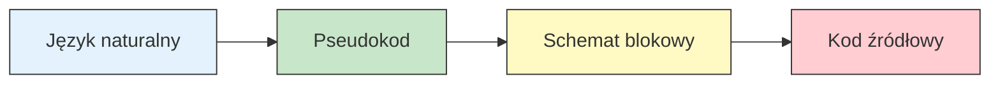
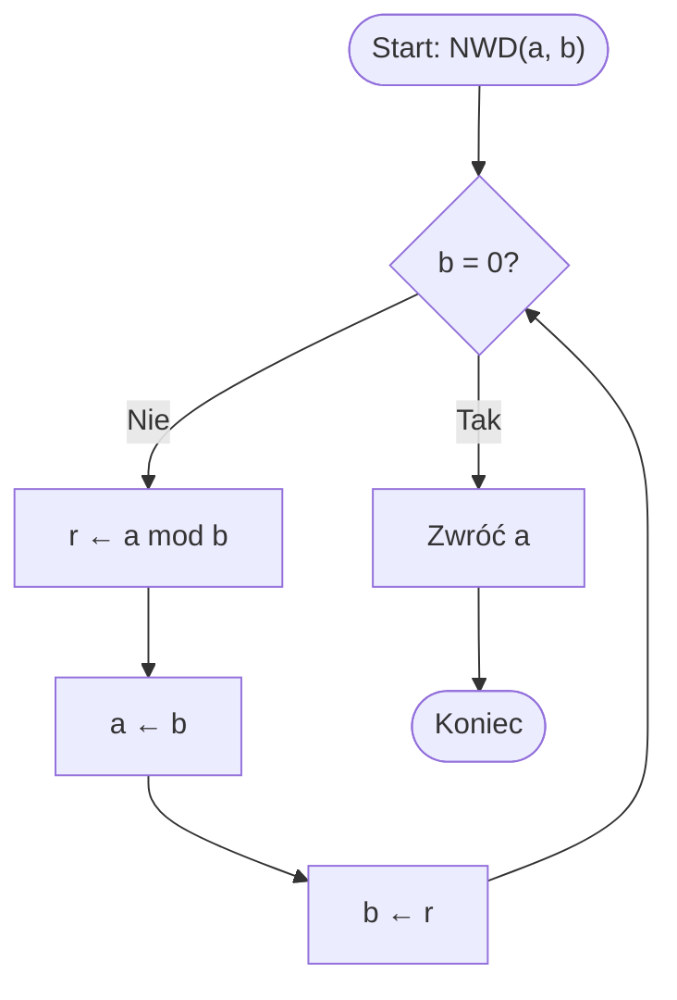

# Pytanie 28: Co to jest algorytm? Podać formy opisu algorytmu. Podać warunki poprawności algorytmu.

## Kluczowe pojęcia

- **Algorytm** — skończony, uporządkowany zbiór jednoznacznie zdefiniowanych kroków (instrukcji), które prowadzą od danych wejściowych do pożądanego wyniku. Formalnie algorytm można zdefiniować jako funkcję $f: D \to W$, gdzie $D$ to zbiór danych wejściowych, a $W$ to zbiór wyników, realizowaną przez skończony ciąg operacji elementarnych. Termin pochodzi od imienia perskiego matematyka al-Chorezmiego (IX w.).
- **Determinizm** — właściwość algorytmu polegająca na tym, że w każdym kroku wykonania, przy tych samych danych wejściowych, następny krok jest jednoznacznie określony. Algorytm deterministyczny zawsze daje ten sam wynik dla tych samych danych wejściowych. Przeciwieństwem są algorytmy niedeterministyczne i probabilistyczne.
- **Skończoność (finiteness)** — właściwość algorytmu gwarantująca, że dla każdych poprawnych danych wejściowych algorytm zakończy działanie po skończonej liczbie kroków. Algorytm, który może działać w nieskończoność, nie jest algorytmem w ścisłym sensie (jest procedurą obliczeniową).
- **Efektywność (effectiveness)** — właściwość algorytmu polegająca na tym, że każda operacja elementarna jest wystarczająco prosta, aby mogła być wykonana dokładnie i w skończonym czasie przez wykonawcę (człowieka lub maszynę). Operacje muszą być precyzyjnie zdefiniowane, bez dwuznaczności.
- **Poprawność częściowa (partial correctness)** — algorytm jest częściowo poprawny względem specyfikacji $(P, Q)$, jeśli: **gdy** algorytm zakończy działanie dla danych spełniających warunek wstępny $P$, **to** wynik spełnia warunek końcowy $Q$. Poprawność częściowa nie gwarantuje zakończenia — algorytm może działać w nieskończoność.
- **Poprawność całkowita (total correctness)** — algorytm jest całkowicie poprawny względem specyfikacji $(P, Q)$, jeśli: (1) jest częściowo poprawny oraz (2) **zawsze** kończy działanie dla danych spełniających warunek wstępny $P$. Formalnie: poprawność całkowita = poprawność częściowa + terminacja.
- **Specyfikacja algorytmu** — formalna para $(P, Q)$, gdzie $P$ to warunek wstępny (precondition) opisujący dopuszczalne dane wejściowe, a $Q$ to warunek końcowy (postcondition) opisujący oczekiwany wynik. Specyfikacja definiuje **co** algorytm ma robić, nie **jak**.
- **Pseudokod** — półformalny zapis algorytmu łączący elementy języka naturalnego z konstrukcjami programistycznymi (pętle, warunki, przypisania). Pseudokod jest niezależny od konkretnego języka programowania i służy do komunikacji idei algorytmu.
- **Schemat blokowy (flowchart)** — graficzna forma opisu algorytmu wykorzystująca standardowe symbole (prostokąty, romby, owale, równoległoboki) połączone strzałkami wskazującymi przepływ sterowania. Znormalizowany w ISO 5807.

## Formalna definicja algorytmu

### Definicja intuicyjna

Algorytm to **skończony ciąg precyzyjnie zdefiniowanych instrukcji**, które przekształcają dane wejściowe w dane wyjściowe. Każdy algorytm musi:

1. Przyjmować **dane wejściowe** (zero lub więcej wartości z określonego zbioru)
2. Produkować **dane wyjściowe** (co najmniej jedną wartość)
3. Być **jednoznaczny** — każdy krok jest precyzyjnie zdefiniowany
4. Być **skończony** — kończy działanie po skończonej liczbie kroków
5. Być **efektywny** — każdy krok jest wykonalny w skończonym czasie

### Definicja formalna (Knuth)

Donald Knuth w „The Art of Computer Programming" definiuje algorytm jako zbiór reguł podający ciąg operacji rozwiązujących określony typ problemu, spełniający pięć warunków:

| Właściwość | Opis | Przykład naruszenia |
|---|---|---|
| **Skończoność** | Algorytm musi zakończyć się po skończonej liczbie kroków | Pętla `while true` bez warunku wyjścia |
| **Określoność** | Każdy krok musi być precyzyjnie i jednoznacznie zdefiniowany | „Dodaj mniej więcej 5 do x" |
| **Wejście** | Algorytm przyjmuje zero lub więcej danych wejściowych | — |
| **Wyjście** | Algorytm produkuje co najmniej jeden wynik | Procedura bez efektu |
| **Efektywność** | Każda operacja jest wykonalna w skończonym czasie | „Wyznacz wszystkie liczby pierwsze" (nieskończony zbiór) |

### Definicja przez maszynę Turinga

Formalnie algorytm można utożsamić z **maszyną Turinga**, która:
- Posiada skończony zbiór stanów $Q$
- Operuje na skończonym alfabecie $\Sigma$
- Posiada funkcję przejścia $\delta: Q \times \Sigma \to Q \times \Sigma \times \{L, R\}$
- Rozpoczyna w stanie początkowym $q_0$ i kończy w stanie akceptującym $q_f$

**Teza Churcha-Turinga:** Każda funkcja obliczalna w intuicyjnym sensie jest obliczalna przez maszynę Turinga. Oznacza to, że maszyna Turinga jest uniwersalnym modelem algorytmu.

## Właściwości algorytmu

### Determinizm

Algorytm deterministyczny w każdym kroku ma dokładnie jedno możliwe następne działanie. Dla tych samych danych wejściowych zawsze produkuje ten sam wynik i przechodzi przez te same stany pośrednie.

**Algorytmy niedeterministyczne** mogą w danym kroku mieć wiele możliwych następnych działań (np. niedeterministyczna maszyna Turinga). W praktyce niedeterminizm symuluje się przez przeszukiwanie wszystkich możliwości (backtracking) lub losowy wybór (algorytmy probabilistyczne).

### Skończoność

Skończoność oznacza, że algorytm **zawsze** kończy działanie po skończonej (choć potencjalnie bardzo dużej) liczbie kroków. Jest to kluczowa różnica między algorytmem a **procedurą obliczeniową** (computational procedure), która może działać w nieskończoność (np. system operacyjny, serwer).

**Przykład:** Algorytm Euklidesa jest skończony, ponieważ w każdym kroku reszta z dzielenia jest ściśle mniejsza od dzielnika, więc ciąg reszt jest ściśle malejący i ograniczony od dołu przez 0.

### Efektywność

Każda operacja algorytmu musi być:
- **Wykonalna** — możliwa do zrealizowania przez wykonawcę
- **Jednoznaczna** — nie pozostawia miejsca na interpretację
- **Skończona czasowo** — wykonanie jednego kroku zajmuje skończony czas

## Formy opisu algorytmu

Algorytm można opisać na wiele sposobów, od nieformalnych po ściśle formalne. Poniżej przedstawiono cztery główne formy opisu, zilustrowane tym samym algorytmem — **algorytmem Euklidesa** wyznaczania największego wspólnego dzielnika (NWD).



### 1. Język naturalny

Opis algorytmu słowami, zrozumiały dla człowieka, ale potencjalnie niejednoznaczny.

> **Algorytm Euklidesa (język naturalny):**
> Aby wyznaczyć największy wspólny dzielnik dwóch liczb naturalnych $a$ i $b$:
> 1. Jeśli $b$ jest równe zero, wynikiem jest $a$.
> 2. W przeciwnym razie oblicz resztę z dzielenia $a$ przez $b$.
> 3. Zastąp $a$ wartością $b$, a $b$ wartością obliczonej reszty.
> 4. Wróć do kroku 1.

**Zalety:** intuicyjny, nie wymaga znajomości notacji formalnych.
**Wady:** niejednoznaczność, trudność w analizie poprawności, brak precyzji.

### 2. Pseudokod

Półformalny zapis łączący struktury programistyczne z językiem naturalnym.

```
ALGORYTM NWD_Euklides(a, b)
  Wejście: liczby naturalne a, b, gdzie a ≥ 0 i b ≥ 0
  Wyjście: NWD(a, b)

  DOPÓKI b ≠ 0:
    r ← a mod b
    a ← b
    b ← r
  ZWRÓĆ a
```

**Zalety:** precyzyjny, czytelny, niezależny od języka programowania, łatwy do analizy.
**Wady:** brak pełnej formalizacji, konwencje mogą się różnić między autorami.

### 3. Schemat blokowy (flowchart)

Graficzna reprezentacja algorytmu z użyciem standardowych symboli:

| Symbol | Kształt | Znaczenie |
|---|---|---|
| Terminator | Owal | Początek / Koniec |
| Proces | Prostokąt | Operacja / Przypisanie |
| Decyzja | Romb | Warunek (rozgałęzienie) |
| Dane | Równoległobok | Wejście / Wyjście |
| Strzałka | Linia ze strzałką | Przepływ sterowania |



**Zalety:** wizualna czytelność, łatwość śledzenia przepływu sterowania, dobry do prezentacji.
**Wady:** nieporęczny dla złożonych algorytmów, trudny w modyfikacji, zajmuje dużo miejsca.

### 4. Kod źródłowy

Implementacja w konkretnym języku programowania — najbardziej precyzyjna forma opisu.

```python
def nwd(a: int, b: int) -> int:
    """Algorytm Euklidesa — NWD(a, b)."""
    while b != 0:
        a, b = b, a % b
    return a
```

```c
int nwd(int a, int b) {
    while (b != 0) {
        int r = a % b;
        a = b;
        b = r;
    }
    return a;
}
```

**Zalety:** jednoznaczny, wykonywalny, testowalny.
**Wady:** zależny od języka, szczegóły implementacyjne mogą zaciemniać ideę algorytmu.

### Porównanie form opisu

| Cecha | Język naturalny | Pseudokod | Schemat blokowy | Kod źródłowy |
|---|---|---|---|---|
| Precyzja | Niska | Średnia | Średnia | Wysoka |
| Czytelność | Wysoka | Wysoka | Wysoka (proste alg.) | Średnia |
| Formalność | Brak | Częściowa | Częściowa | Pełna |
| Wykonywalność | Nie | Nie | Nie | Tak |
| Niezależność od języka | Tak | Tak | Tak | Nie |
| Łatwość analizy | Trudna | Łatwa | Średnia | Łatwa |

## Poprawność algorytmu

### Specyfikacja algorytmu

Aby mówić o poprawności algorytmu, potrzebna jest **specyfikacja** — formalna para warunków:

- **Warunek wstępny (precondition)** $P$ — opisuje, jakie warunki muszą spełniać dane wejściowe
- **Warunek końcowy (postcondition)** $Q$ — opisuje, jakie warunki musi spełniać wynik

**Przykład specyfikacji algorytmu Euklidesa:**
- $P$: $a \geq 0 \land b \geq 0 \land (a > 0 \lor b > 0)$
- $Q$: wynik $= \gcd(a, b)$, tj. wynik dzieli $a$ i $b$, i jest największą taką liczbą

### Poprawność częściowa

Algorytm $A$ jest **częściowo poprawny** względem specyfikacji $(P, Q)$, jeśli:

$$\{P\}\; A \;\{Q\}$$

co oznacza: **jeśli** $A$ rozpocznie działanie w stanie spełniającym $P$ **i** $A$ zakończy działanie, **to** stan końcowy spełnia $Q$.

Poprawność częściowa **nie gwarantuje terminacji** — algorytm może działać w nieskończoność. Jeśli się jednak zatrzyma, wynik jest poprawny.

**Przykład:** Rozważmy algorytm:

```
ALGORYTM Dziwny(n)
  Wejście: liczba naturalna n > 0
  DOPÓKI n ≠ 1:
    JEŚLI n jest parzyste:
      n ← n / 2
    W PRZECIWNYM RAZIE:
      n ← 3n + 1
  ZWRÓĆ n
```

Ten algorytm (problem Collatza) jest częściowo poprawny — **jeśli** się zatrzyma, zwraca 1. Ale nie wiadomo, czy zawsze się zatrzymuje (hipoteza Collatza jest otwartym problemem matematycznym).

### Poprawność całkowita

Algorytm $A$ jest **całkowicie poprawny** względem specyfikacji $(P, Q)$, jeśli:

$$[P]\; A \;[Q]$$

co oznacza: **jeśli** $A$ rozpocznie działanie w stanie spełniającym $P$, **to** $A$ **zakończy działanie** i stan końcowy spełnia $Q$.

$$\text{Poprawność całkowita} = \text{Poprawność częściowa} + \text{Terminacja}$$

### Dowodzenie poprawności

Dowodzenie poprawności algorytmu składa się z dwóch kroków:

1. **Dowód poprawności częściowej** — wykazanie, że jeśli algorytm się zatrzyma, wynik jest poprawny. Typowe techniki:
   - **Niezmiennik pętli** — warunek prawdziwy przed, w trakcie i po zakończeniu pętli
   - **Logika Hoare'a** — system aksjomatów i reguł wnioskowania o programach
   - **Indukcja strukturalna** — dla algorytmów rekurencyjnych

2. **Dowód terminacji** — wykazanie, że algorytm zawsze się zatrzymuje. Typowe techniki:
   - **Funkcja malejąca (variant)** — funkcja $V: \text{stan} \to \mathbb{N}$, która ściśle maleje w każdej iteracji pętli i jest ograniczona od dołu
   - **Dobrze ufundowana relacja** — relacja porządku bez nieskończonych ciągów malejących

### Dowód poprawności algorytmu Euklidesa

**Specyfikacja:**
- $P$: $a \geq 0 \land b \geq 0 \land (a > 0 \lor b > 0)$
- $Q$: wynik $= \gcd(a_0, b_0)$, gdzie $a_0, b_0$ to wartości początkowe

**Poprawność częściowa (niezmiennik pętli):**

Niezmiennik: $\gcd(a, b) = \gcd(a_0, b_0)$

1. **Inicjalizacja:** Przed pętlą $a = a_0$, $b = b_0$, więc $\gcd(a, b) = \gcd(a_0, b_0)$ ✓
2. **Zachowanie:** Jeśli $b \neq 0$, to $\gcd(a, b) = \gcd(b, a \bmod b)$ (własność NWD). Po przypisaniu $a \leftarrow b$, $b \leftarrow a \bmod b$ niezmiennik jest zachowany ✓
3. **Zakończenie:** Gdy $b = 0$, z niezmiennika: $\gcd(a, 0) = a = \gcd(a_0, b_0)$ ✓

**Terminacja (funkcja malejąca):**

Funkcja malejąca: $V = b$

- $b \geq 0$ (reszta z dzielenia jest nieujemna)
- W każdej iteracji: $b_{\text{nowe}} = a \bmod b < b$ (reszta jest ściśle mniejsza od dzielnika)
- Ciąg wartości $b$ jest ściśle malejącym ciągiem liczb naturalnych, więc musi osiągnąć 0

**Wniosek:** Algorytm Euklidesa jest **całkowicie poprawny**.

## Przykłady

### Algorytm Euklidesa — ślad wykonania

Obliczenie $\gcd(48, 18)$:

| Krok | $a$ | $b$ | $r = a \bmod b$ | Niezmiennik: $\gcd(a,b)$ |
|---|---|---|---|---|
| 0 | 48 | 18 | — | $\gcd(48, 18) = 6$ |
| 1 | 18 | 12 | 12 | $\gcd(18, 12) = 6$ |
| 2 | 12 | 6 | 6 | $\gcd(12, 6) = 6$ |
| 3 | 6 | 0 | 0 | $\gcd(6, 0) = 6$ |

Wynik: $\gcd(48, 18) = 6$ ✓

### Algorytm wyszukiwania liniowego — analiza poprawności

```
ALGORYTM WyszukiwanieLiniowe(A, n, klucz)
  Wejście: tablica A[1..n], szukany klucz
  Wyjście: indeks i taki, że A[i] = klucz, lub -1

  DLA i = 1 DO n:
    JEŚLI A[i] = klucz:
      ZWRÓĆ i
  ZWRÓĆ -1
```

**Specyfikacja:**
- $P$: $n \geq 0$, tablica $A[1..n]$ jest zdefiniowana
- $Q$: wynik $= i$ gdzie $A[i] = \text{klucz}$, lub wynik $= -1$ jeśli klucz nie występuje w $A$

**Poprawność częściowa:** Jeśli algorytm zwraca $i > 0$, to bezpośrednio przed zwróceniem sprawdzono $A[i] = \text{klucz}$. Jeśli zwraca $-1$, to pętla przeszła przez wszystkie indeksy $1..n$ bez znalezienia klucza.

**Terminacja:** Pętla `for` wykonuje się dokładnie $n$ razy (lub mniej, jeśli klucz zostanie znaleziony wcześniej). Funkcja malejąca: $V = n - i + 1$.

### Algorytm rekurencyjny — silnia

```
ALGORYTM Silnia(n)
  Wejście: liczba naturalna n ≥ 0
  Wyjście: n!

  JEŚLI n = 0:
    ZWRÓĆ 1
  W PRZECIWNYM RAZIE:
    ZWRÓĆ n × Silnia(n - 1)
```

**Poprawność (indukcja):**
- **Baza:** $n = 0$: zwraca 1 = $0!$ ✓
- **Krok indukcyjny:** Zakładamy, że $\text{Silnia}(n-1) = (n-1)!$. Wtedy $\text{Silnia}(n) = n \times (n-1)! = n!$ ✓

**Terminacja:** Argument $n$ ściśle maleje w każdym wywołaniu rekurencyjnym ($n \to n-1$) i jest ograniczony od dołu przez 0.

## Podsumowanie

1. **Algorytm** to skończony ciąg jednoznacznie zdefiniowanych kroków prowadzących od danych wejściowych do wyniku. Kluczowe właściwości to: determinizm, skończoność, określoność, posiadanie wejścia/wyjścia i efektywność.

2. **Formy opisu algorytmu** obejmują: język naturalny (intuicyjny, ale niejednoznaczny), pseudokod (precyzyjny i niezależny od języka), schemat blokowy (wizualny, dobry do prostych algorytmów) oraz kod źródłowy (jednoznaczny i wykonywalny, ale zależny od języka).

3. **Poprawność częściowa** gwarantuje, że jeśli algorytm się zatrzyma, wynik jest zgodny ze specyfikacją. **Poprawność całkowita** dodatkowo gwarantuje terminację (zakończenie działania). Poprawność całkowita = poprawność częściowa + terminacja.

4. **Specyfikacja** algorytmu to para warunków $(P, Q)$ — warunek wstępny i końcowy — definiująca oczekiwane zachowanie. Dowodzenie poprawności opiera się na technikach takich jak niezmiennik pętli, logika Hoare'a i indukcja.

5. **Algorytm Euklidesa** jest klasycznym przykładem algorytmu całkowicie poprawnego — niezmiennik $\gcd(a, b) = \gcd(a_0, b_0)$ dowodzi poprawności częściowej, a ściśle malejąca wartość $b$ dowodzi terminacji.

## Powiązane pytania

- [Pytanie 27: Złożoność obliczeniowa](27-zlozonosc-obliczeniowa.md)
- [Pytanie 29: Algorytmy skończone i iteracyjne](29-algorytmy-skonczone-iteracyjne.md)
- [Pytanie 39: Niezmiennik pętli](39-niezmiennik-petli.md)
