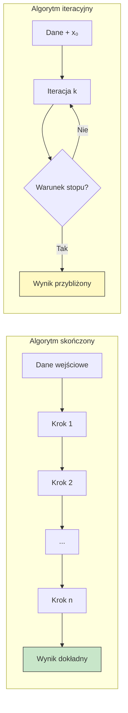

# Pytanie 29: Porównać algorytmy skończone i iteracyjne. Co to jest „warunek stopu"? Podać przykłady.

## Kluczowe pojęcia

- **Algorytm skończony (direct/finite algorithm)** — algorytm, który rozwiązuje problem w z góry określonej, skończonej liczbie kroków, niezależnej od wartości danych wejściowych (choć może zależeć od rozmiaru danych). Po wykonaniu ustalonej sekwencji operacji algorytm zawsze kończy działanie i zwraca dokładny wynik. Przykłady: sortowanie, wyszukiwanie, algorytm Euklidesa.
- **Algorytm iteracyjny (iterative/approximation algorithm)** — algorytm, który generuje ciąg kolejnych przybliżeń $x_0, x_1, x_2, \ldots$ rozwiązania, powtarzając pewien krok obliczeniowy (iterację) aż do spełnienia warunku stopu. Liczba iteracji nie jest z góry znana i zależy od danych wejściowych, punktu startowego oraz wymaganej dokładności. Przykłady: metoda Newtona, metoda bisekcji, metoda gradientu prostego.
- **Warunek stopu (stopping criterion)** — formalnie zdefiniowane kryterium, którego spełnienie powoduje zakończenie procesu iteracyjnego. Warunek stopu jest niezbędny, ponieważ algorytm iteracyjny z natury mógłby działać w nieskończoność. Typowe warunki stopu to: osiągnięcie zadanej tolerancji, przekroczenie maksymalnej liczby iteracji lub wykrycie stagnacji.
- **Zbieżność (convergence)** — właściwość algorytmu iteracyjnego polegająca na tym, że ciąg generowanych przybliżeń $\{x_k\}$ dąży do rozwiązania dokładnego $x^*$ przy $k \to \infty$. Formalnie: $\lim_{k \to \infty} x_k = x^*$. Zbieżność może być liniowa, kwadratowa lub wyższego rzędu.
- **Tolerancja (tolerance)** — parametr $\varepsilon > 0$ określający wymaganą dokładność wyniku. Algorytm iteracyjny kończy działanie, gdy miara błędu (np. $|x_{k+1} - x_k|$ lub $|f(x_k)|$) spadnie poniżej tolerancji.
- **Rząd zbieżności** — miara szybkości zbieżności algorytmu iteracyjnego. Algorytm ma zbieżność rzędu $p$, jeśli $|x_{k+1} - x^*| \leq C \cdot |x_k - x^*|^p$ dla pewnej stałej $C > 0$. Zbieżność liniowa: $p = 1$, kwadratowa: $p = 2$.

## Definicje i porównanie algorytmów skończonych i iteracyjnych

### Algorytm skończony

Algorytm skończony (zwany też algorytmem bezpośrednim lub dokładnym) wykonuje **ustaloną sekwencję kroków** i zwraca wynik dokładny. Liczba kroków jest deterministyczna — można ją wyznaczyć przed rozpoczęciem obliczeń na podstawie rozmiaru danych wejściowych.

Cechy algorytmu skończonego:
1. **Deterministyczna liczba kroków** — znana z góry lub ograniczona funkcją rozmiaru danych
2. **Wynik dokładny** — algorytm zwraca precyzyjne rozwiązanie (z dokładnością do arytmetyki maszynowej)
3. **Brak warunku stopu** — algorytm kończy się naturalnie po wykonaniu wszystkich kroków
4. **Złożoność wyrażona funkcją rozmiaru** — np. $O(n \log n)$, $O(n^2)$

```
ALGORYTM SortowaniePrzezWstawianie(A, n)
  Wejście: tablica A[1..n]
  Wyjście: tablica A posortowana rosnąco

  DLA i = 2 DO n:
    klucz ← A[i]
    j ← i - 1
    DOPÓKI j > 0 ORAZ A[j] > klucz:
      A[j+1] ← A[j]
      j ← j - 1
    A[j+1] ← klucz
  ZWRÓĆ A
```

Powyższy algorytm zawsze wykonuje się w $O(n^2)$ kroków (pesymistycznie) — nie potrzebuje warunku stopu.

### Algorytm iteracyjny

Algorytm iteracyjny generuje **ciąg przybliżeń** rozwiązania, powtarzając pewien krok obliczeniowy. Proces trwa do momentu spełnienia warunku stopu.

Cechy algorytmu iteracyjnego:
1. **Nieznana z góry liczba iteracji** — zależy od danych, punktu startowego i wymaganej dokładności
2. **Wynik przybliżony** — algorytm zwraca aproksymację rozwiązania z zadaną dokładnością
3. **Wymaga warunku stopu** — bez niego algorytm mógłby działać w nieskończoność
4. **Zbieżność** — kluczowa właściwość gwarantująca, że przybliżenia dążą do rozwiązania

```
ALGORYTM MetodaBisekcji(f, a, b, ε)
  Wejście: funkcja ciągła f, przedział [a, b] taki że f(a)·f(b) < 0, tolerancja ε
  Wyjście: przybliżenie pierwiastka f(x) = 0

  DOPÓKI (b - a) / 2 > ε:
    c ← (a + b) / 2
    JEŚLI f(c) = 0:
      ZWRÓĆ c
    JEŚLI f(a) · f(c) < 0:
      b ← c
    W PRZECIWNYM RAZIE:
      a ← c
  ZWRÓĆ (a + b) / 2
```

### Porównanie tabelaryczne

| Cecha | Algorytm skończony | Algorytm iteracyjny |
|---|---|---|
| Liczba kroków | Z góry określona | Nieznana, zależy od warunku stopu |
| Wynik | Dokładny | Przybliżony (z zadaną dokładnością) |
| Warunek stopu | Nie wymaga | Wymagany |
| Złożoność | Funkcja rozmiaru danych | Zależy od dokładności i zbieżności |
| Zastosowanie | Problemy z rozwiązaniem zamkniętym | Problemy bez rozwiązania analitycznego |
| Przykłady | Sortowanie, NWD, mnożenie macierzy | Metoda Newtona, bisekcja, gradient |



## Warunek stopu — formalna definicja

### Definicja

Warunek stopu to predykat $\text{STOP}(k, x_k, x_{k-1}, \ldots)$, który dla danego stanu algorytmu iteracyjnego zwraca wartość logiczną:

$$\text{STOP}(k, x_k, x_{k-1}, \ldots) = \begin{cases} \text{true} & \text{— zakończ iteracje} \\ \text{false} & \text{— kontynuuj} \end{cases}$$

Warunek stopu jest **niezbędny** w algorytmach iteracyjnych, ponieważ:
- Gwarantuje zakończenie algorytmu w skończonym czasie
- Kontroluje dokładność wyniku
- Zapobiega nieskończonym pętlom w przypadku braku zbieżności

### Kryteria stopu

W praktyce stosuje się kombinację kilku kryteriów. Algorytm kończy działanie, gdy **co najmniej jedno** z nich jest spełnione.

#### 1. Kryterium tolerancji bezwzględnej

Sprawdza, czy kolejne przybliżenia są wystarczająco bliskie siebie:

$$|x_{k+1} - x_k| < \varepsilon_{\text{abs}}$$

Stosowane, gdy znany jest rząd wielkości rozwiązania.

#### 2. Kryterium tolerancji względnej

Sprawdza względną zmianę przybliżenia:

$$\frac{|x_{k+1} - x_k|}{|x_{k+1}|} < \varepsilon_{\text{rel}}$$

Bardziej uniwersalne — działa dobrze niezależnie od skali rozwiązania.

#### 3. Kryterium residuum (wartości funkcji)

Sprawdza, jak blisko zera jest wartość funkcji:

$$|f(x_k)| < \varepsilon_f$$

Stosowane w problemach szukania pierwiastków równań.

#### 4. Kryterium maksymalnej liczby iteracji

Ogranicza liczbę iteracji z góry:

$$k > k_{\max}$$

Zabezpieczenie przed nieskończonym działaniem w przypadku braku zbieżności.

#### 5. Kryterium stagnacji

Wykrywa brak postępu:

$$|x_{k+1} - x_k| < \varepsilon_{\text{mach}}$$

gdzie $\varepsilon_{\text{mach}}$ to precyzja maszynowa. Oznacza, że dalsze iteracje nie poprawią wyniku.

### Złożony warunek stopu — pseudokod

```
FUNKCJA WarunekStopu(k, x_k, x_prev, f, ε_abs, ε_rel, k_max)
  // Kryterium 1: tolerancja bezwzględna
  JEŚLI |x_k - x_prev| < ε_abs:
    ZWRÓĆ PRAWDA, "zbieżność bezwzględna"

  // Kryterium 2: tolerancja względna
  JEŚLI |x_k - x_prev| / |x_k| < ε_rel:
    ZWRÓĆ PRAWDA, "zbieżność względna"

  // Kryterium 3: residuum
  JEŚLI |f(x_k)| < ε_abs:
    ZWRÓĆ PRAWDA, "residuum bliskie zeru"

  // Kryterium 4: maksymalna liczba iteracji
  JEŚLI k ≥ k_max:
    ZWRÓĆ PRAWDA, "osiągnięto limit iteracji (brak zbieżności?)"

  ZWRÓĆ FAŁSZ, "kontynuuj"
```

## Zbieżność

### Definicja zbieżności

Algorytm iteracyjny jest **zbieżny**, jeśli ciąg generowanych przybliżeń dąży do rozwiązania dokładnego:

$$\lim_{k \to \infty} x_k = x^*$$

gdzie $x^*$ jest rozwiązaniem problemu.

### Rząd zbieżności

Rząd zbieżności określa, jak szybko maleje błąd $e_k = |x_k - x^*|$:

$$|e_{k+1}| \leq C \cdot |e_k|^p$$

| Rząd $p$ | Nazwa | Szybkość | Przykład |
|---|---|---|---|
| $p = 1$ | Liniowa | Wolna — stała redukcja błędu | Metoda bisekcji |
| $p = 2$ | Kwadratowa | Szybka — podwajanie cyfr dokładności | Metoda Newtona |
| $p \approx 1.618$ | Nadliniowa | Pośrednia | Metoda siecznych |

Zbieżność kwadratowa jest znacznie szybsza — jeśli błąd wynosi $10^{-3}$, po jednej iteracji spada do $\sim 10^{-6}$, a po kolejnej do $\sim 10^{-12}$.

### Warunki zbieżności

Zbieżność algorytmu iteracyjnego zależy od:
1. **Właściwości problemu** — np. ciągłość i różniczkowalność funkcji
2. **Punktu startowego** $x_0$ — musi być wystarczająco blisko rozwiązania (zbieżność lokalna) lub algorytm musi być globalnie zbieżny
3. **Parametrów algorytmu** — np. krok uczenia w metodzie gradientowej

## Przykłady

### Przykład 1: Algorytm skończony — sortowanie przez scalanie

```
ALGORYTM MergeSort(A, lewy, prawy)
  Wejście: tablica A, indeksy lewy i prawy
  Wyjście: tablica A[lewy..prawy] posortowana

  JEŚLI lewy < prawy:
    środek ← ⌊(lewy + prawy) / 2⌋
    MergeSort(A, lewy, środek)
    MergeSort(A, środek + 1, prawy)
    Scal(A, lewy, środek, prawy)
```

- **Liczba kroków:** zawsze $O(n \log n)$ — niezależna od wartości elementów
- **Wynik:** tablica posortowana dokładnie
- **Warunek stopu:** nie potrzebny — rekurencja kończy się naturalnie gdy `lewy ≥ prawy`

### Przykład 2: Algorytm iteracyjny — metoda Newtona

Metoda Newtona (Newtona-Raphsona) szuka pierwiastka równania $f(x) = 0$ za pomocą iteracji:

$$x_{k+1} = x_k - \frac{f(x_k)}{f'(x_k)}$$

```
ALGORYTM MetodaNewtona(f, f', x₀, ε, k_max)
  Wejście: funkcja f, pochodna f', punkt startowy x₀, tolerancja ε, limit iteracji k_max
  Wyjście: przybliżenie pierwiastka x*

  k ← 0
  x ← x₀

  DOPÓKI k < k_max:
    fx ← f(x)

    // Warunek stopu 1: residuum
    JEŚLI |fx| < ε:
      ZWRÓĆ x, k, "zbieżność"

    dfx ← f'(x)
    JEŚLI dfx = 0:
      ZWRÓĆ x, k, "pochodna zerowa — brak zbieżności"

    x_nowe ← x - fx / dfx

    // Warunek stopu 2: tolerancja bezwzględna
    JEŚLI |x_nowe - x| < ε:
      ZWRÓĆ x_nowe, k, "zbieżność"

    x ← x_nowe
    k ← k + 1

  ZWRÓĆ x, k, "osiągnięto limit iteracji"
```

#### Ślad wykonania: $f(x) = x^2 - 2$ (szukamy $\sqrt{2}$)

$f'(x) = 2x$, $x_0 = 1$, $\varepsilon = 10^{-6}$

| $k$ | $x_k$ | $f(x_k)$ | $f'(x_k)$ | $x_{k+1}$ | $\|x_{k+1} - x_k\|$ |
|---|---|---|---|---|---|
| 0 | 1.000000 | −1.000000 | 2.000000 | 1.500000 | 0.500000 |
| 1 | 1.500000 | 0.250000 | 3.000000 | 1.416667 | 0.083333 |
| 2 | 1.416667 | 0.006944 | 2.833333 | 1.414216 | 0.002451 |
| 3 | 1.414216 | 0.000006 | 2.828431 | 1.414214 | 0.000002 |

Po 4 iteracjach wynik $x_4 \approx 1.414214$ z błędem $< 10^{-6}$. Widoczna **zbieżność kwadratowa** — liczba poprawnych cyfr podwaja się w każdej iteracji.

### Porównanie obu podejść na jednym problemie

Rozważmy problem: znaleźć $\sqrt{2}$.

**Podejście skończone** — algorytm Herona (skończona liczba kroków z ustaloną precyzją):
Nie istnieje algorytm skończony dający dokładną wartość $\sqrt{2}$ (liczba niewymierna). Można jedynie obliczyć przybliżenie o ustalonej precyzji.

**Podejście iteracyjne** — metoda Newtona:
Generuje ciąg przybliżeń zbieżny do $\sqrt{2}$ z dowolną dokładnością, kontrolowaną przez warunek stopu $\varepsilon$.

To ilustruje fundamentalną różnicę: algorytmy skończone nadają się do problemów z rozwiązaniem zamkniętym (np. sortowanie), a iteracyjne — do problemów wymagających aproksymacji numerycznej.

## Podsumowanie

1. **Algorytm skończony** wykonuje z góry określoną liczbę kroków i zwraca wynik dokładny. Nie wymaga warunku stopu — kończy się naturalnie po przetworzeniu wszystkich danych. Typowe zastosowania: sortowanie, wyszukiwanie, operacje na grafach.

2. **Algorytm iteracyjny** generuje ciąg przybliżeń rozwiązania, powtarzając krok obliczeniowy aż do spełnienia warunku stopu. Liczba iteracji nie jest z góry znana. Typowe zastosowania: szukanie pierwiastków, optymalizacja, rozwiązywanie układów równań.

3. **Warunek stopu** to kryterium zakończenia algorytmu iteracyjnego. W praktyce stosuje się kombinację: tolerancji bezwzględnej ($|x_{k+1} - x_k| < \varepsilon$), tolerancji względnej, residuum ($|f(x_k)| < \varepsilon$), limitu iteracji ($k > k_{\max}$) i wykrywania stagnacji.

4. **Zbieżność** algorytmu iteracyjnego gwarantuje, że przybliżenia dążą do rozwiązania. Rząd zbieżności ($p$) określa szybkość — zbieżność kwadratowa ($p = 2$, np. metoda Newtona) jest znacznie szybsza od liniowej ($p = 1$, np. bisekcja).

5. Wybór między algorytmem skończonym a iteracyjnym zależy od natury problemu — jeśli istnieje rozwiązanie zamknięte, preferujemy algorytm skończony; jeśli problem wymaga aproksymacji numerycznej, stosujemy algorytm iteracyjny z odpowiednim warunkiem stopu.

## Powiązane pytania

- [Pytanie 27: Złożoność obliczeniowa](27-zlozonosc-obliczeniowa.md)
- [Pytanie 28: Definicja algorytmu](28-definicja-algorytmu.md)
- [Pytanie 39: Niezmiennik pętli](39-niezmiennik-petli.md)
