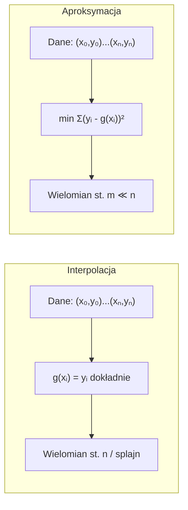

# Pytanie 30: Omówić zagadnienia aproksymacji i interpolacji.

## Kluczowe pojęcia

- **Interpolacja** — metoda konstruowania funkcji $g(x)$, która przechodzi dokładnie przez zadany zbiór punktów (węzłów) $(x_0, y_0), (x_1, y_1), \ldots, (x_n, y_n)$, tzn. $g(x_i) = y_i$ dla każdego $i = 0, 1, \ldots, n$. Interpolacja odtwarza wartości funkcji w węzłach bez żadnego błędu.
- **Aproksymacja** — metoda przybliżania zbioru danych lub funkcji inną, prostszą funkcją $g(x)$, która niekoniecznie przechodzi przez wszystkie punkty danych, ale minimalizuje pewną miarę błędu (np. sumę kwadratów odchyleń). Aproksymacja jest szczególnie przydatna, gdy dane zawierają szum pomiarowy.
- **Wielomian Lagrange'a** — wielomian interpolacyjny stopnia co najwyżej $n$, przechodzący przez $n+1$ zadanych węzłów. Konstruowany jako kombinacja liniowa wielomianów bazowych $L_i(x)$, z których każdy przyjmuje wartość 1 w jednym węźle i 0 w pozostałych.
- **Splajn (spline)** — funkcja interpolacyjna złożona z kawałków wielomianów niskiego stopnia (najczęściej 3 — splajn kubiczny), sklejonych w węzłach z zachowaniem ciągłości funkcji i jej pochodnych. Splajny unikają oscylacji typowych dla wielomianów wysokiego stopnia.
- **Metoda najmniejszych kwadratów (MNK)** — metoda aproksymacji polegająca na wyznaczeniu parametrów funkcji przybliżającej poprzez minimalizację sumy kwadratów odchyleń między wartościami zmierzonymi a wartościami funkcji: $\min \sum_{i=0}^{n} (y_i - g(x_i))^2$. Najczęściej stosowana do regresji liniowej i wielomianowej.
- **Węzły interpolacji** — punkty $(x_0, x_1, \ldots, x_n)$, w których znane są wartości funkcji i przez które funkcja interpolacyjna musi przechodzić. Rozmieszczenie węzłów (równomierne, Czebyszewa) ma kluczowy wpływ na jakość interpolacji.
- **Efekt Rungego** — zjawisko narastających oscylacji wielomianu interpolacyjnego na krańcach przedziału przy wzroście liczby równomiernie rozmieszczonych węzłów. Pokazuje, że zwiększanie stopnia wielomianu nie zawsze poprawia jakość interpolacji.

## Różnica między aproksymacją a interpolacją

### Interpolacja

Interpolacja polega na znalezieniu funkcji $g(x)$, która **dokładnie** przechodzi przez wszystkie zadane punkty:

$$g(x_i) = y_i, \quad i = 0, 1, \ldots, n$$

Funkcja interpolacyjna odtwarza wartości w węzłach bez błędu, ale między węzłami może odbiegać od rzeczywistej funkcji. Interpolacja jest odpowiednia, gdy dane są dokładne (bez szumu) i potrzebujemy estymacji wartości między znanymi punktami.

### Aproksymacja

Aproksymacja polega na znalezieniu funkcji $g(x)$, która **najlepiej przybliża** dane w sensie pewnej miary błędu, ale nie musi przechodzić przez żaden z punktów:

$$\min_{g \in \mathcal{F}} \sum_{i=0}^{n} w_i \cdot (y_i - g(x_i))^2$$

gdzie $\mathcal{F}$ to klasa funkcji przybliżających, a $w_i$ to opcjonalne wagi. Aproksymacja jest lepsza, gdy dane zawierają szum pomiarowy — wymuszanie przejścia przez zaszumione punkty prowadziłoby do niestabilnych wyników.

### Porównanie tabelaryczne

| Cecha | Interpolacja | Aproksymacja |
|---|---|---|
| Przejście przez punkty | Dokładne: $g(x_i) = y_i$ | Przybliżone: $g(x_i) \approx y_i$ |
| Liczba parametrów | Równa liczbie punktów | Zwykle mniejsza niż liczba punktów |
| Dane z szumem | Nieodpowiednia (odtwarza szum) | Odpowiednia (wygładza szum) |
| Stopień wielomianu | Rośnie z liczbą punktów | Ustalony z góry (niski) |
| Typowe metody | Lagrange, Newton, splajny | MNK, regresja, aproksymacja Czebyszewa |
| Zastosowanie | Tablice wartości, dane dokładne | Dane pomiarowe, modelowanie |



## Wielomian interpolacyjny Lagrange'a

### Wzór

Dla $n+1$ węzłów $(x_0, y_0), (x_1, y_1), \ldots, (x_n, y_n)$ o parami różnych odciętych, wielomian interpolacyjny Lagrange'a stopnia co najwyżej $n$ ma postać:

$$L(x) = \sum_{i=0}^{n} y_i \cdot \ell_i(x)$$

gdzie $\ell_i(x)$ to wielomiany bazowe Lagrange'a:

$$\ell_i(x) = \prod_{\substack{j=0 \\ j \neq i}}^{n} \frac{x - x_j}{x_i - x_j}$$

Wielomiany bazowe spełniają warunek:

$$\ell_i(x_k) = \begin{cases} 1 & \text{gdy } i = k \\ 0 & \text{gdy } i \neq k \end{cases}$$

co gwarantuje, że $L(x_k) = y_k$ dla każdego $k$.

### Błąd interpolacji

Jeśli $f$ jest funkcją $(n+1)$-krotnie różniczkowalną, to błąd interpolacji wielomianem stopnia $n$ wynosi:

$$f(x) - L(x) = \frac{f^{(n+1)}(\xi)}{(n+1)!} \prod_{i=0}^{n} (x - x_i)$$

dla pewnego $\xi$ z przedziału zawierającego $x$ i wszystkie węzły. Błąd zależy od:
- pochodnej $(n+1)$-szego rzędu funkcji $f$
- iloczynu odległości $x$ od węzłów — stąd znaczenie rozmieszczenia węzłów

### Algorytm obliczania wielomianu Lagrange'a

```
ALGORYTM InterpolacjaLagrangea(węzły, x)
  Wejście: węzły = [(x₀,y₀), (x₁,y₁), ..., (xₙ,yₙ)], punkt x
  Wyjście: wartość wielomianu L(x)

  n ← długość(węzły) - 1
  wynik ← 0

  DLA i = 0 DO n:
    li ← 1
    DLA j = 0 DO n:
      JEŚLI j ≠ i:
        li ← li · (x - węzły[j].x) / (węzły[i].x - węzły[j].x)
    wynik ← wynik + węzły[i].y · li

  ZWRÓĆ wynik
```

Złożoność: $O(n^2)$ — dwie zagnieżdżone pętle po $n+1$ węzłach.

### Własności wielomianu Lagrange'a

1. **Jednoznaczność** — wielomian interpolacyjny stopnia $\leq n$ przechodzący przez $n+1$ punktów jest jednoznaczny (niezależnie od metody konstrukcji: Lagrange, Newton, itp.)
2. **Stopień** — wielomian ma stopień co najwyżej $n$ (może być niższy, jeśli punkty leżą na wielomianie niższego stopnia)
3. **Złożoność obliczeniowa** — $O(n^2)$ dla jednorazowego obliczenia, ale dodanie nowego węzła wymaga przeliczenia od nowa (w odróżnieniu od postaci Newtona)

## Splajny kubiczne

### Idea

Zamiast jednego wielomianu wysokiego stopnia, splajn kubiczny używa **kawałków wielomianów stopnia 3**, po jednym na każdy podprzedział $[x_i, x_{i+1}]$. Na każdym podprzedziale:

$$S_i(x) = a_i + b_i(x - x_i) + c_i(x - x_i)^2 + d_i(x - x_i)^3, \quad x \in [x_i, x_{i+1}]$$

### Warunki splajnu kubicznego

Dla $n+1$ węzłów mamy $n$ podprzedziałów i $n$ wielomianów $S_0, S_1, \ldots, S_{n-1}$, co daje $4n$ niewiadomych ($a_i, b_i, c_i, d_i$ dla każdego $i$). Warunki:

1. **Interpolacja w węzłach** ($n+1$ warunków):
$$S_i(x_i) = y_i, \quad i = 0, \ldots, n-1$$
$$S_{n-1}(x_n) = y_n$$

2. **Ciągłość funkcji** w węzłach wewnętrznych ($n-1$ warunków):
$$S_{i-1}(x_i) = S_i(x_i), \quad i = 1, \ldots, n-1$$

3. **Ciągłość pierwszej pochodnej** ($n-1$ warunków):
$$S'_{i-1}(x_i) = S'_i(x_i), \quad i = 1, \ldots, n-1$$

4. **Ciągłość drugiej pochodnej** ($n-1$ warunków):
$$S''_{i-1}(x_i) = S''_i(x_i), \quad i = 1, \ldots, n-1$$

Razem: $(n+1) + (n-1) + (n-1) + (n-1) = 4n - 2$ warunków. Brakuje 2 warunków — uzupełniamy je **warunkami brzegowymi**:

- **Splajn naturalny:** $S''(x_0) = 0$ i $S''(x_n) = 0$
- **Splajn zaciskany (clamped):** $S'(x_0) = f'(x_0)$ i $S'(x_n) = f'(x_n)$
- **Splajn not-a-knot:** ciągłość trzeciej pochodnej w $x_1$ i $x_{n-1}$

### Zalety splajnów kubicznych

1. **Brak oscylacji** — wielomiany niskiego stopnia nie generują efektu Rungego
2. **Gładkość** — ciągłość $S$, $S'$ i $S''$ zapewnia wizualnie gładką krzywą
3. **Lokalność** — zmiana jednego punktu wpływa tylko na sąsiednie segmenty
4. **Stabilność numeryczna** — obliczenia są dobrze uwarunkowane

## Metoda najmniejszych kwadratów (MNK)

### Sformułowanie problemu

Dane: $m+1$ punktów $(x_0, y_0), \ldots, (x_m, y_m)$ i klasa funkcji przybliżających $g(x) = \sum_{k=0}^{n} a_k \phi_k(x)$, gdzie $\phi_k$ to funkcje bazowe (np. $\phi_k(x) = x^k$ dla aproksymacji wielomianowej), a $n < m$ (mniej parametrów niż punktów).

Szukamy współczynników $a_0, a_1, \ldots, a_n$ minimalizujących:

$$E(a_0, \ldots, a_n) = \sum_{i=0}^{m} \left( y_i - \sum_{k=0}^{n} a_k \phi_k(x_i) \right)^2$$

### Wyprowadzenie — układ równań normalnych

Warunek konieczny minimum: $\frac{\partial E}{\partial a_j} = 0$ dla $j = 0, 1, \ldots, n$.

Po obliczeniu pochodnych otrzymujemy **układ równań normalnych**:

$$\sum_{k=0}^{n} a_k \underbrace{\left( \sum_{i=0}^{m} \phi_j(x_i) \phi_k(x_i) \right)}_{G_{jk}} = \underbrace{\sum_{i=0}^{m} y_i \phi_j(x_i)}_{b_j}$$

W zapisie macierzowym: $\mathbf{G} \mathbf{a} = \mathbf{b}$, gdzie:
- $G_{jk} = \sum_{i=0}^{m} \phi_j(x_i) \phi_k(x_i)$ — macierz Grama
- $b_j = \sum_{i=0}^{m} y_i \phi_j(x_i)$

### Regresja liniowa jako szczególny przypadek

Dla $g(x) = a_0 + a_1 x$ (baza: $\phi_0(x) = 1$, $\phi_1(x) = x$) układ równań normalnych:

$$\begin{bmatrix} m+1 & \sum x_i \\ \sum x_i & \sum x_i^2 \end{bmatrix} \begin{bmatrix} a_0 \\ a_1 \end{bmatrix} = \begin{bmatrix} \sum y_i \\ \sum x_i y_i \end{bmatrix}$$

Rozwiązanie:

$$a_1 = \frac{(m+1)\sum x_i y_i - \sum x_i \sum y_i}{(m+1)\sum x_i^2 - (\sum x_i)^2}, \qquad a_0 = \frac{\sum y_i - a_1 \sum x_i}{m+1}$$

## Efekt Rungego

### Opis zjawiska

Efekt Rungego to zjawisko narastających oscylacji wielomianu interpolacyjnego na krańcach przedziału, gdy liczba **równomiernie rozmieszczonych** węzłów rośnie. Klasyczny przykład to interpolacja funkcji Rungego:

$$f(x) = \frac{1}{1 + 25x^2}, \quad x \in [-1, 1]$$

Przy $n$ równoodległych węzłach wielomian interpolacyjny stopnia $n$ coraz bardziej oscyluje w pobliżu $x = \pm 1$, a błąd interpolacji rośnie do nieskończoności:

$$\lim_{n \to \infty} \max_{x \in [-1,1]} |f(x) - L_n(x)| = \infty$$

### Przyczyna

Błąd interpolacji zależy od iloczynu $\prod_{i=0}^{n}(x - x_i)$. Dla węzłów równomiernych iloczyn ten przyjmuje duże wartości na krańcach przedziału, co w połączeniu z dużymi pochodnymi wyższych rzędów prowadzi do oscylacji.

### Rozwiązania

1. **Węzły Czebyszewa** — rozmieszczenie węzłów gęściej na krańcach:
$$x_k = \cos\left(\frac{2k+1}{2(n+1)} \pi\right), \quad k = 0, 1, \ldots, n$$
Minimalizują $\max |{\prod(x - x_i)}|$ i eliminują efekt Rungego.

2. **Splajny** — zamiast jednego wielomianu wysokiego stopnia, używamy kawałków wielomianów niskiego stopnia.

3. **Aproksymacja** — zamiast interpolacji stosujemy MNK z wielomianem niskiego stopnia.

## Przykłady

### Przykład 1: Interpolacja wielomianem Lagrange'a

Dane punkty: $(1, 2)$, $(2, 3)$, $(4, 1)$.

Węzły: $x_0 = 1, x_1 = 2, x_2 = 4$; wartości: $y_0 = 2, y_1 = 3, y_2 = 1$.

Wielomiany bazowe:

$$\ell_0(x) = \frac{(x-2)(x-4)}{(1-2)(1-4)} = \frac{(x-2)(x-4)}{3}$$

$$\ell_1(x) = \frac{(x-1)(x-4)}{(2-1)(2-4)} = \frac{(x-1)(x-4)}{-2}$$

$$\ell_2(x) = \frac{(x-1)(x-2)}{(4-1)(4-2)} = \frac{(x-1)(x-2)}{6}$$

Wielomian interpolacyjny:

$$L(x) = 2 \cdot \frac{(x-2)(x-4)}{3} + 3 \cdot \frac{(x-1)(x-4)}{-2} + 1 \cdot \frac{(x-1)(x-2)}{6}$$

Po rozwinięciu i uproszczeniu:

$$L(x) = \frac{2(x-2)(x-4)}{3} - \frac{3(x-1)(x-4)}{2} + \frac{(x-1)(x-2)}{6}$$

Sprawdzenie:
- $L(1) = \frac{2(-1)(-3)}{3} - \frac{3(0)(-3)}{2} + \frac{(0)(-1)}{6} = 2 + 0 + 0 = 2$ ✓
- $L(2) = \frac{2(0)(-2)}{3} - \frac{3(1)(-2)}{2} + \frac{(1)(0)}{6} = 0 + 3 + 0 = 3$ ✓
- $L(4) = \frac{2(2)(0)}{3} - \frac{3(3)(0)}{2} + \frac{(3)(2)}{6} = 0 + 0 + 1 = 1$ ✓

Obliczenie wartości w punkcie $x = 3$:

$$L(3) = \frac{2(1)(-1)}{3} - \frac{3(2)(-1)}{2} + \frac{(2)(1)}{6} = -\frac{2}{3} + 3 + \frac{1}{3} = \frac{8}{3} \approx 2.667$$

### Przykład 2: Interpolacja splajnem kubicznym

Dla tych samych punktów $(1, 2)$, $(2, 3)$, $(4, 1)$ konstruujemy splajn naturalny (dwa segmenty):

- $S_0(x)$ na $[1, 2]$: $S_0(x) = a_0 + b_0(x-1) + c_0(x-1)^2 + d_0(x-1)^3$
- $S_1(x)$ na $[2, 4]$: $S_1(x) = a_1 + b_1(x-2) + c_1(x-2)^2 + d_1(x-2)^3$

Warunki:
1. $S_0(1) = 2 \Rightarrow a_0 = 2$
2. $S_0(2) = 3 \Rightarrow a_0 + b_0 + c_0 + d_0 = 3$
3. $S_1(2) = 3 \Rightarrow a_1 = 3$
4. $S_1(4) = 1 \Rightarrow a_1 + 2b_1 + 4c_1 + 8d_1 = 1$
5. $S'_0(2) = S'_1(2) \Rightarrow b_0 + 2c_0 + 3d_0 = b_1$
6. $S''_0(2) = S''_1(2) \Rightarrow 2c_0 + 6d_0 = 2c_1$
7. $S''_0(1) = 0 \Rightarrow c_0 = 0$ (splajn naturalny)
8. $S''_1(4) = 0 \Rightarrow 2c_1 + 12d_1 = 0$

Rozwiązując układ: $a_0 = 2$, $b_0 = \frac{13}{10}$, $c_0 = 0$, $d_0 = -\frac{3}{10}$, $a_1 = 3$, $b_1 = \frac{4}{10}$, $c_1 = -\frac{9}{10}$, $d_1 = \frac{3}{20}$.

Splajn w punkcie $x = 3$:

$$S_1(3) = 3 + 0.4 \cdot 1 + (-0.9) \cdot 1 + 0.15 \cdot 1 = 2.65$$

Porównanie: wielomian Lagrange'a daje $L(3) \approx 2.667$, splajn daje $S(3) = 2.65$. Różnica jest niewielka dla 3 punktów, ale przy większej liczbie punktów splajn jest znacznie stabilniejszy.

### Przykład 3: Aproksymacja MNK — regresja liniowa

Dane pomiarowe (z szumem): $(0, 1.1)$, $(1, 2.8)$, $(2, 5.2)$, $(3, 6.9)$, $(4, 9.1)$.

Szukamy prostej $g(x) = a_0 + a_1 x$.

Obliczenia:
- $\sum x_i = 0 + 1 + 2 + 3 + 4 = 10$
- $\sum y_i = 1.1 + 2.8 + 5.2 + 6.9 + 9.1 = 25.1$
- $\sum x_i^2 = 0 + 1 + 4 + 9 + 16 = 30$
- $\sum x_i y_i = 0 + 2.8 + 10.4 + 20.7 + 36.4 = 70.3$

$$a_1 = \frac{5 \cdot 70.3 - 10 \cdot 25.1}{5 \cdot 30 - 100} = \frac{351.5 - 251}{150 - 100} = \frac{100.5}{50} = 2.01$$

$$a_0 = \frac{25.1 - 2.01 \cdot 10}{5} = \frac{25.1 - 20.1}{5} = 1.0$$

Prosta aproksymująca: $g(x) = 1.0 + 2.01x$.

Prosta nie przechodzi dokładnie przez żaden punkt, ale minimalizuje sumę kwadratów odchyleń — jest to optymalne przybliżenie w sensie MNK.

## Podsumowanie

1. **Interpolacja** konstruuje funkcję przechodzącą dokładnie przez zadane punkty. Jest odpowiednia dla danych dokładnych, ale wrażliwa na liczbę i rozmieszczenie węzłów. Główne metody: wielomian Lagrange'a, wielomian Newtona, splajny.

2. **Aproksymacja** przybliża dane funkcją, która nie musi przechodzić przez punkty, ale minimalizuje miarę błędu. Jest lepsza dla danych z szumem. Główna metoda: metoda najmniejszych kwadratów (MNK).

3. **Wielomian Lagrange'a** to klasyczna metoda interpolacji: $L(x) = \sum_{i=0}^{n} y_i \prod_{j \neq i} \frac{x - x_j}{x_i - x_j}$. Jest jednoznaczny, ale kosztowny obliczeniowo ($O(n^2)$) i podatny na efekt Rungego przy dużej liczbie węzłów.

4. **Splajny kubiczne** rozwiązują problem oscylacji — używają kawałków wielomianów stopnia 3 z ciągłością $S$, $S'$, $S''$. Są stabilne numerycznie, lokalne i gładkie.

5. **Metoda najmniejszych kwadratów** minimalizuje $\sum(y_i - g(x_i))^2$ i prowadzi do układu równań normalnych $\mathbf{G}\mathbf{a} = \mathbf{b}$. Szczególny przypadek — regresja liniowa — ma rozwiązanie w postaci zamkniętej.

6. **Efekt Rungego** pokazuje, że zwiększanie stopnia wielomianu interpolacyjnego z węzłami równomiernymi może pogarszać jakość przybliżenia. Rozwiązania: węzły Czebyszewa, splajny lub aproksymacja zamiast interpolacji.

## Powiązane pytania

- [Pytanie 35: Metoda elementów skończonych](35-metoda-elementow-skonczonych.md)
- [Pytanie 36: Metoda różnic skończonych](36-metoda-roznic-skonczonych.md)
- [Pytanie 47: Numeryczne rozwiązywanie równań różniczkowych](47-rownania-rozniczkowe-numerycznie.md)
