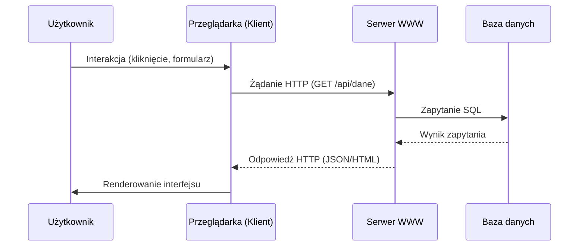
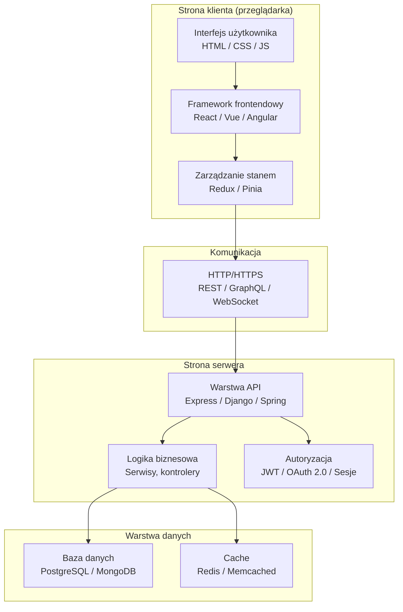

# Pytanie 31: Omówić podobieństwa i różnice w programowaniu aplikacji działających po stronie serwera i klienta w programowaniu internetowym.

## Kluczowe pojęcia

- **Frontend (strona klienta)** — warstwa aplikacji webowej wykonywana w przeglądarce użytkownika. Odpowiada za prezentację danych, interakcję z użytkownikiem i renderowanie interfejsu graficznego. Technologie bazowe to HTML, CSS i JavaScript.
- **Backend (strona serwera)** — warstwa aplikacji webowej wykonywana na serwerze. Odpowiada za logikę biznesową, przetwarzanie danych, autoryzację, komunikację z bazą danych i udostępnianie API. Przykładowe technologie: Node.js, Python (Django, Flask), Java (Spring), PHP, Go.
- **HTTP (Hypertext Transfer Protocol)** — bezstanowy protokół warstwy aplikacji, stanowiący fundament komunikacji w sieci WWW. Klient wysyła żądanie (request) z metodą (GET, POST, PUT, DELETE itp.), a serwer zwraca odpowiedź (response) z kodem statusu i treścią.
- **REST (Representational State Transfer)** — styl architektoniczny definiujący zasady projektowania API webowych: bezstanowość, jednolity interfejs, zasoby identyfikowane przez URI, reprezentacje (JSON, XML), HATEOAS. RESTful API jest obecnie dominującym podejściem do komunikacji klient-serwer.
- **Rendering SSR (Server-Side Rendering)** — technika, w której serwer generuje kompletny HTML strony i wysyła go do przeglądarki. Klient otrzymuje gotową treść, co przyspiesza pierwsze wyświetlenie (FCP) i ułatwia indeksowanie przez wyszukiwarki (SEO).
- **Rendering CSR (Client-Side Rendering)** — technika, w której serwer wysyła minimalny HTML z plikiem JavaScript, a przeglądarka buduje interfejs dynamicznie po stronie klienta. Zapewnia płynną nawigację (SPA), ale wydłuża czas pierwszego renderowania.
- **Rendering SSG (Static Site Generation)** — technika, w której strony HTML są generowane w czasie budowania (build time), a nie w czasie żądania. Gotowe pliki statyczne są serwowane z CDN, co zapewnia najszybszy czas odpowiedzi. Stosowane w Next.js, Gatsby, Hugo.
- **API (Application Programming Interface)** — interfejs programistyczny umożliwiający komunikację między komponentami oprogramowania. W kontekście webowym — zbiór endpointów HTTP udostępnianych przez backend, z których korzysta frontend lub inne systemy.
- **Sesja (session)** — mechanizm utrzymywania stanu użytkownika między kolejnymi żądaniami HTTP (które są bezstanowe). Serwer tworzy identyfikator sesji (session ID), przechowuje dane sesji po swojej stronie, a klient przesyła session ID w ciasteczku przy każdym żądaniu.
- **Ciasteczko (cookie)** — mały fragment danych przechowywany przez przeglądarkę i automatycznie dołączany do żądań HTTP kierowanych do danej domeny. Służy do identyfikacji sesji, śledzenia preferencji, uwierzytelniania (tokeny). Atrybuty bezpieczeństwa: `HttpOnly`, `Secure`, `SameSite`.

## Architektura klient-serwer

### Model komunikacji

Architektura klient-serwer to model, w którym aplikacja jest podzielona na dwie współpracujące części:

- **Klient** — inicjuje komunikację, wysyła żądania i prezentuje dane użytkownikowi
- **Serwer** — nasłuchuje na żądania, przetwarza je i zwraca odpowiedzi

Komunikacja odbywa się przez sieć (najczęściej Internet) z wykorzystaniem protokołu HTTP/HTTPS.



### Warstwy aplikacji webowej

Nowoczesna aplikacja webowa składa się z trzech logicznych warstw:

| Warstwa | Lokalizacja | Odpowiedzialność |
|---|---|---|
| **Prezentacji** | Klient (przeglądarka) | UI, interakcja, walidacja formularzy |
| **Logiki biznesowej** | Serwer | Przetwarzanie danych, reguły biznesowe, autoryzacja |
| **Danych** | Serwer (baza danych) | Przechowywanie i zarządzanie danymi |

## Technologie frontendowe (strona klienta)

### Fundament: HTML, CSS, JavaScript

Każda aplikacja frontendowa opiera się na trzech technologiach bazowych:

- **HTML** — struktura i semantyka treści (nagłówki, akapity, formularze, tabele)
- **CSS** — stylizacja i układ wizualny (kolory, czcionki, responsywność, animacje)
- **JavaScript** — logika i interaktywność (obsługa zdarzeń, manipulacja DOM, komunikacja z API)

### Frameworki i biblioteki

Współczesne aplikacje frontendowe korzystają z frameworków ułatwiających budowę złożonych interfejsów:

| Framework | Podejście | Kluczowe cechy |
|---|---|---|
| **React** | Biblioteka UI (komponentowa) | Virtual DOM, JSX, jednokierunkowy przepływ danych, hooki |
| **Vue.js** | Framework progresywny | Reaktywność, szablony HTML, Composition API, łagodna krzywa uczenia |
| **Angular** | Framework pełny (opinionated) | TypeScript, dependency injection, RxJS, dwukierunkowe wiązanie danych |
| **Svelte** | Kompilator | Brak Virtual DOM, kompilacja do natywnego JS, minimalna wielkość bundle |

### Zadania klienta

Kod po stronie klienta odpowiada za:

1. **Renderowanie UI** — budowanie i aktualizacja interfejsu użytkownika
2. **Obsługę zdarzeń** — reagowanie na kliknięcia, wpisywanie tekstu, gesty
3. **Walidację formularzy** — wstępna walidacja danych przed wysłaniem na serwer
4. **Komunikację z API** — wysyłanie żądań HTTP (fetch, axios) i przetwarzanie odpowiedzi
5. **Zarządzanie stanem** — przechowywanie stanu aplikacji (Redux, Vuex, Pinia, Zustand)
6. **Routing** — nawigacja między widokami bez przeładowania strony (SPA)

## Technologie backendowe (strona serwera)

### Popularne technologie

| Technologia | Język | Kluczowe cechy |
|---|---|---|
| **Node.js** (Express, Fastify, NestJS) | JavaScript/TypeScript | Asynchroniczny I/O, jeden język na froncie i backendzie, npm |
| **Django / Flask** | Python | Django: „batteries included", ORM, admin; Flask: mikro-framework |
| **Spring Boot** | Java/Kotlin | Enterprise, dependency injection, ekosystem Spring |
| **ASP.NET Core** | C# | Wydajny, wieloplatformowy, integracja z ekosystemem Microsoft |
| **Ruby on Rails** | Ruby | Konwencja ponad konfigurację, szybkie prototypowanie |
| **Go** (Gin, Echo) | Go | Wysoka wydajność, współbieżność (goroutines), kompilacja do binarki |

### Zadania serwera

Kod po stronie serwera odpowiada za:

1. **Logikę biznesową** — implementacja reguł i procesów biznesowych
2. **Autoryzację i uwierzytelnianie** — weryfikacja tożsamości (JWT, OAuth 2.0, sesje)
3. **Dostęp do bazy danych** — CRUD, zapytania, transakcje, migracje
4. **Walidację danych** — ostateczna walidacja (nigdy nie ufaj danym od klienta)
5. **Obsługę plików** — upload, przetwarzanie, przechowywanie
6. **Integrację z usługami zewnętrznymi** — płatności, e-mail, kolejki wiadomości
7. **Cache i optymalizację** — Redis, CDN, kompresja odpowiedzi

## Komunikacja klient-serwer

### REST API

REST to najczęściej stosowany styl architektoniczny dla API webowych:

```
GET    /api/users          → lista użytkowników
GET    /api/users/42       → szczegóły użytkownika 42
POST   /api/users          → utworzenie nowego użytkownika
PUT    /api/users/42       → aktualizacja użytkownika 42
DELETE /api/users/42       → usunięcie użytkownika 42
```

Zasady REST:
- **Bezstanowość** — każde żądanie zawiera wszystkie informacje potrzebne do jego obsługi
- **Jednolity interfejs** — standardowe metody HTTP i kody statusu
- **Zasoby** — dane identyfikowane przez URI
- **Reprezentacje** — dane przesyłane w formacie JSON (najczęściej) lub XML

### GraphQL

Alternatywa dla REST, w której klient precyzyjnie określa, jakie dane chce otrzymać:

```graphql
query {
  user(id: 42) {
    name
    email
    posts {
      title
    }
  }
}
```

**Zalety:** brak over-fetchingu i under-fetchingu, jeden endpoint, silne typowanie.
**Wady:** złożoność implementacji, trudniejsze cache'owanie, problem N+1 zapytań.

### WebSocket

Protokół umożliwiający dwukierunkową, trwałą komunikację w czasie rzeczywistym:

- Połączenie inicjowane przez HTTP Upgrade
- Serwer i klient mogą wysyłać dane w dowolnym momencie
- Zastosowania: czat, powiadomienia na żywo, gry online, współedycja dokumentów

| Cecha | REST | GraphQL | WebSocket |
|---|---|---|---|
| Kierunek | Klient → Serwer | Klient → Serwer | Dwukierunkowy |
| Połączenie | Bezstanowe (per request) | Bezstanowe (per request) | Trwałe (persistent) |
| Format danych | JSON/XML | JSON | Dowolny (tekst/binarny) |
| Zastosowanie | CRUD, API publiczne | Złożone zapytania, mobile | Real-time |

## Rendering: SSR vs CSR vs SSG

### Server-Side Rendering (SSR)

Serwer generuje kompletny HTML dla każdego żądania:

```
Klient → żądanie → Serwer (renderuje HTML) → gotowy HTML → Klient (wyświetla)
```

**Zalety:** szybkie pierwsze wyświetlenie (FCP), dobre SEO, działa bez JavaScript.
**Wady:** większe obciążenie serwera, wolniejsza nawigacja między stronami.
**Narzędzia:** Next.js (React), Nuxt.js (Vue), SvelteKit.

### Client-Side Rendering (CSR)

Serwer wysyła pusty HTML + JavaScript, przeglądarka buduje interfejs:

```
Klient → żądanie → Serwer (wysyła JS bundle) → Klient (wykonuje JS, buduje DOM)
```

**Zalety:** płynna nawigacja (SPA), mniejsze obciążenie serwera, bogata interaktywność.
**Wady:** wolne pierwsze wyświetlenie, słabe SEO (bez dodatkowych zabiegów), wymaga JS.
**Narzędzia:** Create React App, Vue CLI, Angular CLI.

### Static Site Generation (SSG)

Strony generowane w czasie budowania, serwowane jako pliki statyczne:

```
Build time: Generator → pliki HTML → CDN
Runtime: Klient → żądanie → CDN (zwraca gotowy HTML)
```

**Zalety:** najszybszy czas odpowiedzi, minimalne koszty hostingu, bezpieczeństwo.
**Wady:** wymaga przebudowy przy zmianie treści, nieodpowiednie dla dynamicznych danych.
**Narzędzia:** Next.js (SSG mode), Gatsby, Hugo, Astro.

### Porównanie strategii renderowania

| Cecha | SSR | CSR | SSG |
|---|---|---|---|
| Czas pierwszego wyświetlenia | Szybki | Wolny | Najszybszy |
| SEO | Dobre | Słabe (bez SSR) | Dobre |
| Obciążenie serwera | Wysokie | Niskie | Minimalne |
| Interaktywność | Średnia | Wysoka | Niska (bez JS) |
| Aktualność danych | Na żywo | Na żywo | Czas budowania |
| Przykład zastosowania | E-commerce, portale | Dashboardy, SaaS | Blogi, dokumentacja |

## Bezpieczeństwo

### Zagrożenia po stronie klienta

- **XSS (Cross-Site Scripting)** — wstrzyknięcie złośliwego skryptu do strony. Obrona: sanityzacja danych, Content Security Policy (CSP), unikanie `innerHTML`.
- **CSRF (Cross-Site Request Forgery)** — wymuszenie wykonania żądania w kontekście zalogowanego użytkownika. Obrona: tokeny CSRF, atrybut `SameSite` w ciasteczkach.
- **Wyciek danych w kodzie JS** — klucze API, tokeny w kodzie źródłowym widocznym dla użytkownika.

### Zagrożenia po stronie serwera

- **SQL Injection** — wstrzyknięcie złośliwego kodu SQL. Obrona: parametryzowane zapytania, ORM.
- **Broken Authentication** — słabe mechanizmy uwierzytelniania. Obrona: bcrypt/argon2 do haszowania haseł, MFA, limity prób logowania.
- **Brak walidacji danych** — przyjmowanie niezweryfikowanych danych od klienta. Obrona: walidacja po stronie serwera (zawsze!), schema validation.

### Zasada: nigdy nie ufaj klientowi

Walidacja po stronie klienta służy wygodzie użytkownika (szybki feedback), ale **nie zastępuje** walidacji po stronie serwera. Każde dane przychodzące od klienta mogą być zmanipulowane (np. przez narzędzia deweloperskie przeglądarki, Postman, curl).

## Przykłady

### Porównanie tabelaryczne: frontend vs backend

| Aspekt | Frontend (klient) | Backend (serwer) |
|---|---|---|
| **Środowisko wykonania** | Przeglądarka | Serwer (Node.js, JVM, CPython itp.) |
| **Języki** | JavaScript/TypeScript, HTML, CSS | JavaScript, Python, Java, C#, Go, PHP |
| **Dostęp do systemu plików** | Brak (sandbox przeglądarki) | Pełny |
| **Dostęp do bazy danych** | Brak (przez API) | Bezpośredni |
| **Bezpieczeństwo kodu** | Kod widoczny dla użytkownika | Kod ukryty przed użytkownikiem |
| **Skalowalność** | Każdy klient = osobna instancja | Jeden serwer obsługuje wielu klientów |
| **Stan** | Przechowywany lokalnie (pamięć, localStorage) | Sesje, baza danych, cache (Redis) |
| **Walidacja** | Wstępna (UX) | Ostateczna (bezpieczeństwo) |
| **Testowanie** | Unit (Jest), E2E (Cypress, Playwright) | Unit, integracyjne, obciążeniowe |
| **Deployment** | CDN, serwer statyczny | Serwer aplikacyjny, kontener, chmura |

### Schemat architektury aplikacji webowej



### Podobieństwa między programowaniem klienta i serwera

Mimo różnic, programowanie po obu stronach ma wiele wspólnego:

1. **Język JavaScript/TypeScript** — może być używany zarówno na froncie, jak i na backendzie (Node.js), co umożliwia współdzielenie kodu (np. walidacja, typy)
2. **Wzorce projektowe** — MVC, Observer, Dependency Injection stosowane po obu stronach
3. **Zarządzanie zależnościami** — npm/yarn/pnpm na froncie i backendzie
4. **Testowanie** — testy jednostkowe, integracyjne i E2E po obu stronach
5. **Asynchroniczność** — Promise, async/await zarówno w przeglądarce, jak i na serwerze
6. **Bezpieczeństwo** — obie strony muszą dbać o walidację, sanityzację i ochronę danych

## Podsumowanie

1. **Architektura klient-serwer** dzieli aplikację webową na frontend (przeglądarka) i backend (serwer), komunikujące się przez protokół HTTP/HTTPS. Klient odpowiada za prezentację i interakcję, serwer za logikę biznesową i dane.

2. **Technologie frontendowe** opierają się na HTML/CSS/JavaScript, z frameworkami (React, Vue, Angular) ułatwiającymi budowę złożonych interfejsów. Technologie backendowe (Node.js, Django, Spring) zapewniają przetwarzanie danych, autoryzację i dostęp do bazy danych.

3. **Komunikacja** między klientem a serwerem odbywa się najczęściej przez REST API (JSON over HTTP), ale alternatywami są GraphQL (precyzyjne zapytania) i WebSocket (komunikacja w czasie rzeczywistym).

4. **Strategie renderowania** — SSR (szybkie pierwsze wyświetlenie, dobre SEO), CSR (płynna nawigacja SPA), SSG (najszybszy czas odpowiedzi, pliki statyczne) — dobierane w zależności od wymagań aplikacji.

5. **Bezpieczeństwo** wymaga ochrony po obu stronach: klient narażony jest na XSS i CSRF, serwer na SQL Injection i ataki na uwierzytelnianie. Kluczowa zasada: walidacja po stronie klienta nie zastępuje walidacji po stronie serwera.

## Powiązane pytania

- [Pytanie 32: Współczesna technologia wytwarzania oprogramowania](32-wspolczesna-technologia.md)
- [Pytanie 33: Efektywność tworzenia systemów informatycznych](33-efektywnosc-tworzenia-systemow.md)
- [Pytanie 50: Zapytania klient/serwer i procedury składowane](50-zapytania-klient-serwer-procedury.md)
