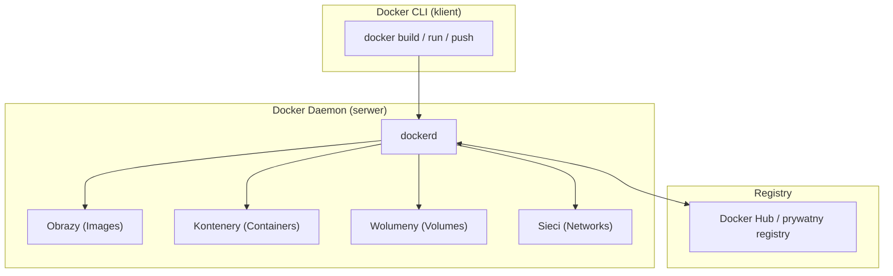
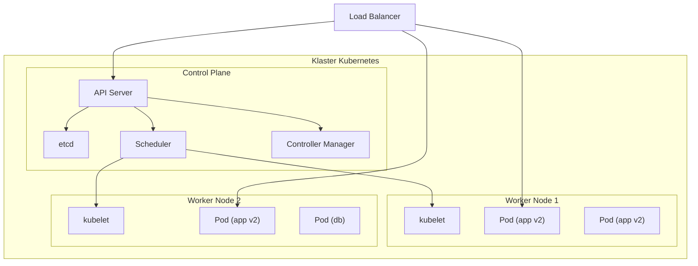
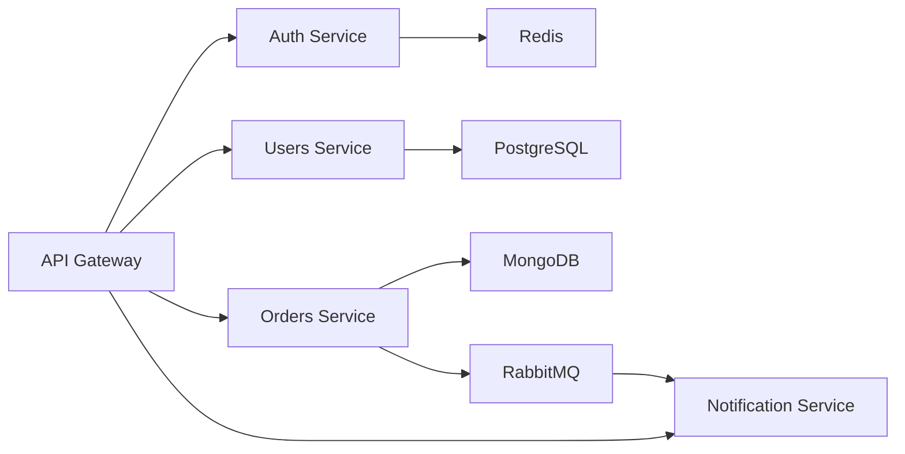

# Pytanie 32: Proszę przedstawić wybraną współczesną technologię wytwarzania oprogramowania i omówić perspektywy jej rozwoju.

## Kluczowe pojęcia

- **Konteneryzacja** — technologia wirtualizacji na poziomie systemu operacyjnego, umożliwiająca uruchamianie aplikacji w izolowanych, lekkich środowiskach (kontenerach). Kontener zawiera aplikację wraz ze wszystkimi jej zależnościami (biblioteki, konfiguracja, runtime), co gwarantuje identyczne działanie niezależnie od środowiska (development, staging, produkcja).
- **Docker** — najpopularniejsza platforma konteneryzacji. Umożliwia budowanie obrazów kontenerów (z pliku `Dockerfile`), zarządzanie nimi (Docker CLI, Docker Hub) i uruchamianie w izolowanych środowiskach. Docker wprowadził warstwowy system plików (Union FS), co pozwala na efektywne współdzielenie warstw między obrazami.
- **Kubernetes (K8s)** — system orkiestracji kontenerów opracowany przez Google, obecnie rozwijany przez CNCF (Cloud Native Computing Foundation). Automatyzuje wdrażanie, skalowanie i zarządzanie aplikacjami kontenerowymi w klastrze maszyn. Kluczowe abstrakcje: Pod, Service, Deployment, Namespace, ConfigMap, Secret.
- **CI/CD (Continuous Integration / Continuous Delivery)** — zbiór praktyk i narzędzi automatyzujących proces budowania, testowania i wdrażania oprogramowania. CI polega na częstym integrowaniu zmian w kodzie z automatycznym uruchamianiem testów. CD rozszerza CI o automatyczne wdrażanie na środowiska docelowe.
- **Mikroserwisy (Microservices)** — styl architektoniczny, w którym aplikacja jest zbudowana jako zbiór małych, niezależnych usług, z których każda realizuje jedną funkcję biznesową, posiada własną bazę danych i komunikuje się z innymi usługami przez API (REST, gRPC, kolejki wiadomości).
- **DevOps** — kultura i zbiór praktyk łączących zespoły deweloperskie (Dev) i operacyjne (Ops) w celu skrócenia cyklu wytwarzania oprogramowania. Kluczowe elementy: automatyzacja, CI/CD, Infrastructure as Code (IaC), monitoring, feedback loop.
- **Cloud-native** — podejście do budowania i uruchamiania aplikacji, które w pełni wykorzystuje zalety chmury obliczeniowej: konteneryzację, orkiestrację, mikroserwisy, deklaratywne API i automatyzację. Zdefiniowane przez CNCF jako aplikacje skalowalne, odporne na awarie i łatwe w zarządzaniu.

## Konteneryzacja jako współczesna technologia wytwarzania

### Geneza i motywacja

Przed konteneryzacją wdrażanie aplikacji wiązało się z problemem „u mnie działa" — różnice między środowiskami deweloperskimi, testowymi i produkcyjnymi powodowały trudne do zdiagnozowania błędy. Tradycyjne maszyny wirtualne (VM) rozwiązywały ten problem, ale kosztem dużego narzutu zasobów (każda VM zawiera pełny system operacyjny).

Konteneryzacja eliminuje oba problemy:
- **Powtarzalność** — kontener zawiera wszystko, czego potrzebuje aplikacja
- **Lekkość** — kontenery współdzielą jądro systemu operacyjnego hosta, uruchamiają się w sekundach i zużywają znacznie mniej zasobów niż VM

### Porównanie: kontenery vs maszyny wirtualne

| Cecha | Kontener | Maszyna wirtualna |
|---|---|---|
| **Izolacja** | Na poziomie procesu (namespaces, cgroups) | Na poziomie sprzętu (hypervisor) |
| **System operacyjny** | Współdzielone jądro hosta | Pełny OS w każdej VM |
| **Rozmiar** | Megabajty (10-500 MB) | Gigabajty (1-20 GB) |
| **Czas uruchomienia** | Sekundy | Minuty |
| **Narzut zasobów** | Minimalny | Znaczny (RAM, CPU, dysk) |
| **Gęstość** | Setki kontenerów na hoście | Dziesiątki VM na hoście |
| **Przenośność** | Bardzo wysoka (obraz = artefakt) | Ograniczona (zależność od hypervisora) |

### Architektura Docker

Docker opiera się na architekturze klient-serwer:



Kluczowe elementy:
- **Obraz (Image)** — niezmienny szablon zawierający system plików aplikacji, zbudowany warstwowo z instrukcji `Dockerfile`
- **Kontener (Container)** — uruchomiona instancja obrazu z własnym systemem plików (warstwa zapisu), siecią i procesami
- **Registry** — repozytorium obrazów (Docker Hub, GitHub Container Registry, AWS ECR)
- **Wolumin (Volume)** — mechanizm trwałego przechowywania danych poza cyklem życia kontenera

### Orkiestracja z Kubernetes

Dla aplikacji produkcyjnych pojedynczy Docker nie wystarcza. Kubernetes rozwiązuje problemy:
- **Skalowanie** — automatyczne zwiększanie/zmniejszanie liczby replik (Horizontal Pod Autoscaler)
- **Samonaprawianie** — restart kontenerów po awarii, wymiana niezdatnych Podów
- **Odkrywanie usług** — wewnętrzny DNS, Service jako abstrakcja dostępu do Podów
- **Zarządzanie konfiguracją** — ConfigMap i Secret oddzielają konfigurację od kodu
- **Rolling updates** — wdrażanie nowych wersji bez przestoju (zero-downtime deployment)



## Ekosystem konteneryzacji i DevOps

### Pipeline CI/CD

Konteneryzacja jest fundamentem nowoczesnych pipeline'ów CI/CD:

```
Commit → Build (obraz Docker) → Test → Push (registry) → Deploy (K8s)
```

Etapy pipeline'u:

1. **Commit** — deweloper pushuje kod do repozytorium (Git)
2. **Build** — system CI buduje obraz Docker z `Dockerfile`
3. **Test** — uruchomienie testów jednostkowych i integracyjnych w kontenerze
4. **Scan** — skanowanie obrazu pod kątem podatności (Trivy, Snyk)
5. **Push** — publikacja obrazu do registry z tagiem (np. `v1.2.3`)
6. **Deploy** — aktualizacja Deployment w Kubernetes (rolling update)
7. **Monitor** — obserwacja metryk i logów (Prometheus, Grafana)

### Narzędzia ekosystemu

| Kategoria | Narzędzia | Rola |
|---|---|---|
| **Konteneryzacja** | Docker, Podman, containerd | Budowanie i uruchamianie kontenerów |
| **Orkiestracja** | Kubernetes, Docker Swarm, Nomad | Zarządzanie klastrem kontenerów |
| **CI/CD** | GitHub Actions, GitLab CI, Jenkins, ArgoCD | Automatyzacja pipeline'ów |
| **Registry** | Docker Hub, GitHub CR, AWS ECR, Harbor | Przechowywanie obrazów |
| **Monitoring** | Prometheus, Grafana, Datadog | Metryki i alerty |
| **Logowanie** | ELK Stack, Loki, Fluentd | Agregacja logów |
| **Service Mesh** | Istio, Linkerd | Komunikacja między mikroserwisami |
| **IaC** | Terraform, Pulumi, Helm | Infrastruktura jako kod |

### Architektura mikroserwisowa

Konteneryzacja umożliwia efektywne wdrażanie architektury mikroserwisowej:



Każdy mikroserwis:
- Jest niezależnie wdrażany jako kontener Docker
- Ma własną bazę danych (database per service)
- Komunikuje się przez API (REST/gRPC) lub kolejki wiadomości
- Może być skalowany niezależnie od pozostałych usług
- Jest rozwijany przez autonomiczny zespół

## Perspektywy rozwoju

### Kierunki ewolucji konteneryzacji

1. **Serverless Containers** — usługi takie jak AWS Fargate, Google Cloud Run i Azure Container Instances eliminują potrzebę zarządzania infrastrukturą klastra. Deweloper dostarcza obraz kontenera, a platforma automatycznie zarządza skalowaniem i zasobami.

2. **WebAssembly (Wasm) jako alternatywa** — technologia WebAssembly wychodzi poza przeglądarkę i staje się lekką alternatywą dla kontenerów. Projekty takie jak WasmEdge i Spin umożliwiają uruchamianie aplikacji Wasm w środowiskach serwerowych z jeszcze mniejszym narzutem niż kontenery.

3. **GitOps** — model operacyjny, w którym stan infrastruktury i aplikacji jest deklaratywnie opisany w repozytorium Git. Narzędzia takie jak ArgoCD i Flux automatycznie synchronizują klaster Kubernetes ze stanem w repozytorium.

4. **eBPF i bezpieczeństwo** — technologia eBPF (extended Berkeley Packet Filter) umożliwia zaawansowany monitoring, networking i bezpieczeństwo kontenerów na poziomie jądra Linux bez modyfikacji kodu aplikacji (Cilium, Falco).

5. **AI/ML w orkiestracji** — inteligentne skalowanie i optymalizacja zasobów z wykorzystaniem uczenia maszynowego (KEDA — Kubernetes Event-Driven Autoscaling, Vertical Pod Autoscaler).

### Wpływ na proces wytwarzania oprogramowania

Konteneryzacja fundamentalnie zmienia sposób wytwarzania oprogramowania:

| Aspekt | Przed konteneryzacją | Po konteneryzacji |
|---|---|---|
| **Środowisko deweloperskie** | Ręczna konfiguracja, „u mnie działa" | `docker-compose up` — identyczne środowisko |
| **Wdrażanie** | Ręczne, ryzykowne, wielogodzinne | Automatyczne, powtarzalne, minutowe |
| **Skalowanie** | Pionowe (większy serwer) | Poziome (więcej replik kontenerów) |
| **Izolacja awarii** | Awaria jednego komponentu = awaria całości | Izolacja na poziomie kontenera/Poda |
| **Czas dostarczenia** | Tygodnie/miesiące | Godziny/dni (CI/CD) |
| **Infrastruktura** | Ręcznie zarządzane serwery | Infrastructure as Code (Terraform, Helm) |

## Przykłady

### Dockerfile — aplikacja Node.js

```dockerfile
# Etap 1: Budowanie (multi-stage build)
FROM node:20-alpine AS builder
WORKDIR /app
COPY package*.json ./
RUN npm ci --only=production
COPY . .
RUN npm run build

# Etap 2: Obraz produkcyjny
FROM node:20-alpine
WORKDIR /app
COPY --from=builder /app/dist ./dist
COPY --from=builder /app/node_modules ./node_modules
EXPOSE 3000
USER node
CMD ["node", "dist/main.js"]
```

Kluczowe praktyki:
- **Multi-stage build** — oddzielenie etapu budowania od obrazu produkcyjnego (mniejszy obraz)
- **Alpine** — minimalna dystrybucja Linux (~5 MB)
- **USER node** — uruchamianie jako użytkownik nieuprzywilejowany (bezpieczeństwo)
- **COPY package\*.json** — wykorzystanie cache warstw Docker (szybsze buildy)

### docker-compose — środowisko wielokontenerowe

```yaml
version: "3.9"
services:
  app:
    build: .
    ports:
      - "3000:3000"
    environment:
      - DATABASE_URL=postgres://user:pass@db:5432/myapp
      - REDIS_URL=redis://cache:6379
    depends_on:
      - db
      - cache

  db:
    image: postgres:16-alpine
    volumes:
      - pgdata:/var/lib/postgresql/data
    environment:
      - POSTGRES_USER=user
      - POSTGRES_PASSWORD=pass
      - POSTGRES_DB=myapp

  cache:
    image: redis:7-alpine

volumes:
  pgdata:
```

Jedno polecenie `docker-compose up` uruchamia kompletne środowisko: aplikację, bazę danych i cache.

### Pipeline CI/CD — GitHub Actions

```yaml
name: CI/CD Pipeline
on:
  push:
    branches: [main]

jobs:
  build-and-deploy:
    runs-on: ubuntu-latest
    steps:
      - uses: actions/checkout@v4

      - name: Build Docker image
        run: docker build -t myapp:${{ github.sha }} .

      - name: Run tests
        run: docker run myapp:${{ github.sha }} npm test

      - name: Push to registry
        run: |
          docker tag myapp:${{ github.sha }} ghcr.io/user/myapp:latest
          docker push ghcr.io/user/myapp:latest

      - name: Deploy to Kubernetes
        run: |
          kubectl set image deployment/myapp \
            app=ghcr.io/user/myapp:${{ github.sha }}
```

Pipeline automatycznie: buduje obraz → uruchamia testy → publikuje obraz → wdraża na klaster Kubernetes.

## Podsumowanie

1. **Konteneryzacja** (Docker + Kubernetes) to jedna z najważniejszych współczesnych technologii wytwarzania oprogramowania. Rozwiązuje fundamentalne problemy powtarzalności środowisk, izolacji aplikacji i automatyzacji wdrożeń.

2. **Docker** umożliwia pakowanie aplikacji z zależnościami w przenośne obrazy, a **Kubernetes** automatyzuje orkiestrację kontenerów w klastrze — skalowanie, samonaprawianie, rolling updates i zarządzanie konfiguracją.

3. **Ekosystem** konteneryzacji obejmuje narzędzia CI/CD (GitHub Actions, ArgoCD), monitoring (Prometheus, Grafana), service mesh (Istio) i Infrastructure as Code (Terraform, Helm), tworząc kompletną platformę DevOps.

4. **Architektura mikroserwisowa** w połączeniu z konteneryzacją umożliwia niezależne wdrażanie, skalowanie i rozwój poszczególnych komponentów systemu przez autonomiczne zespoły.

5. **Perspektywy rozwoju** obejmują serverless containers (Fargate, Cloud Run), WebAssembly jako lekką alternatywę, GitOps (ArgoCD, Flux), zaawansowane bezpieczeństwo (eBPF) oraz inteligentną orkiestrację z wykorzystaniem AI/ML.

## Powiązane pytania

- [Pytanie 31: Programowanie po stronie serwera i klienta](31-programowanie-serwer-klient.md)
- [Pytanie 33: Efektywność tworzenia systemów informatycznych](33-efektywnosc-tworzenia-systemow.md)
- [Pytanie 34: Wzorzec projektowy](34-wzorzec-projektowy.md)
