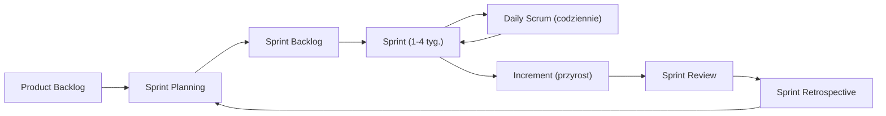
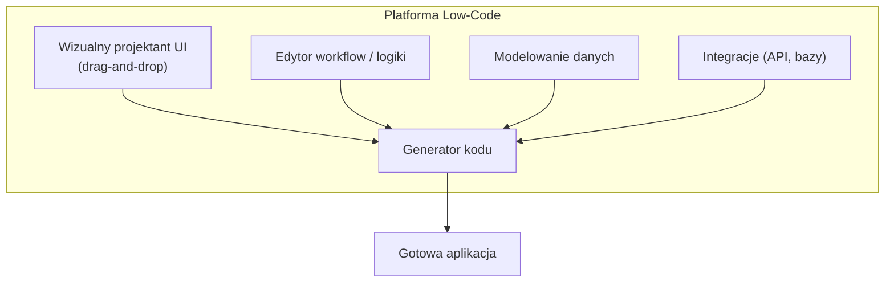
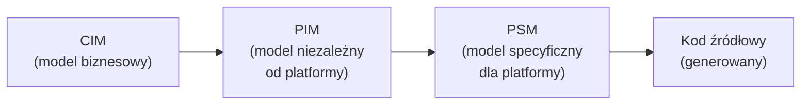

# Pytanie 33: Proszę omówić kierunki (nowe technologie i metodyki) mające na celu zwiększenie efektywności tworzenia systemów oprogramowania (systemów informatycznych).

## Kluczowe pojęcia

- **Agile (metodyki zwinne)** — rodzina podejść do wytwarzania oprogramowania opartych na iteracyjnym i przyrostowym dostarczaniu wartości. Manifest Agile (2001) definiuje cztery wartości: ludzie i interakcje ponad procesy i narzędzia, działające oprogramowanie ponad obszerną dokumentację, współpraca z klientem ponad negocjowanie umów, reagowanie na zmiany ponad podążanie za planem.
- **Scrum** — najpopularniejszy framework zwinny. Definiuje role (Product Owner, Scrum Master, Developers), zdarzenia (Sprint, Sprint Planning, Daily Scrum, Sprint Review, Sprint Retrospective) i artefakty (Product Backlog, Sprint Backlog, Increment). Sprint trwa 1-4 tygodnie.
- **Low-code/No-code** — platformy umożliwiające tworzenie aplikacji z minimalnym lub zerowym pisaniem kodu. Wykorzystują wizualne interfejsy (drag-and-drop), gotowe komponenty i automatyczne generowanie kodu. Przykłady: OutSystems, Mendix, Microsoft Power Apps, Bubble.
- **AI-assisted development** — wykorzystanie sztucznej inteligencji do wspomagania programistów: generowanie kodu, autouzupełnianie, wykrywanie błędów, refaktoryzacja, generowanie testów. Przykłady: GitHub Copilot, Amazon CodeWhisperer, ChatGPT, Cursor.
- **Automatyzacja testów** — stosowanie narzędzi i frameworków do automatycznego uruchamiania testów (jednostkowych, integracyjnych, E2E, regresyjnych) bez interwencji człowieka. Kluczowe narzędzia: Jest, Pytest, Selenium, Cypress, Playwright.
- **Infrastructure as Code (IaC)** — praktyka zarządzania infrastrukturą IT za pomocą plików konfiguracyjnych (kodu) zamiast ręcznej konfiguracji. Umożliwia wersjonowanie, powtarzalność i automatyzację wdrożeń. Narzędzia: Terraform, Pulumi, AWS CloudFormation, Ansible.

## Metodyki zwinne (Agile, Scrum, Kanban)

### Manifest Agile i zasady

Manifest Agile (2001) powstał jako odpowiedź na nieefektywność tradycyjnych metodyk kaskadowych (waterfall), w których wymagania były zamrażane na początku projektu, a dostarczenie oprogramowania następowało po wielu miesiącach. Kluczowe zasady zwiększające efektywność:

1. **Iteracyjne dostarczanie** — oprogramowanie dostarczane w krótkich cyklach (1-4 tygodnie), co pozwala na szybki feedback i korektę kursu
2. **Samoorganizujące się zespoły** — zespół sam decyduje, jak najlepiej wykonać pracę
3. **Ciągła adaptacja** — regularne retrospektywy i dostosowywanie procesu
4. **Bliska współpraca z klientem** — Product Owner reprezentuje potrzeby biznesowe

### Scrum — framework zwinny

Scrum organizuje pracę w sprintach o stałej długości:



| Element | Opis | Wpływ na efektywność |
|---|---|---|
| **Sprint** | Iteracja o stałej długości (1-4 tyg.) | Regularne dostarczanie wartości |
| **Product Backlog** | Uporządkowana lista wymagań | Priorytetyzacja najważniejszych funkcji |
| **Sprint Planning** | Planowanie zakresu sprintu | Realistyczne zobowiązania zespołu |
| **Daily Scrum** | Codzienny 15-min stand-up | Szybka identyfikacja blokad |
| **Sprint Review** | Prezentacja przyrostu interesariuszom | Wczesny feedback |
| **Retrospektywa** | Analiza procesu i usprawnienia | Ciągłe doskonalenie |

### Kanban — wizualizacja przepływu pracy

Kanban koncentruje się na wizualizacji przepływu pracy i ograniczeniu pracy w toku (WIP — Work In Progress):

```
| To Do | In Progress (WIP: 3) | Code Review (WIP: 2) | Done |
|-------|----------------------|----------------------|------|
| US-7  | US-4                 | US-2                 | US-1 |
| US-8  | US-5                 | US-3                 |      |
| US-9  | US-6                 |                      |      |
```

Kluczowe zasady Kanban:
- **Wizualizacja pracy** — tablica z kolumnami odpowiadającymi etapom procesu
- **Limity WIP** — ograniczenie liczby zadań w toku wymusza kończenie zamiast rozpoczynania nowych
- **Zarządzanie przepływem** — mierzenie lead time i cycle time, eliminacja wąskich gardeł
- **Ciągłe doskonalenie** — ewolucyjne zmiany procesu na podstawie metryk

### Porównanie Scrum vs Kanban

| Cecha | Scrum | Kanban |
|---|---|---|
| **Kadencja** | Stałe sprinty (1-4 tyg.) | Ciągły przepływ |
| **Role** | PO, SM, Developers | Brak narzuconych ról |
| **Planowanie** | Sprint Planning | Na bieżąco (just-in-time) |
| **Zmiany w trakcie** | Nie w trakcie sprintu | Dozwolone w każdej chwili |
| **Metryki** | Velocity (story points/sprint) | Lead time, cycle time, throughput |
| **Najlepsze dla** | Projekty produktowe, zespoły 5-9 osób | Utrzymanie, support, zespoły operacyjne |

## Automatyzacja (CI/CD, IaC, testy automatyczne)

### CI/CD — Continuous Integration / Continuous Delivery

CI/CD to zbiór praktyk automatyzujących budowanie, testowanie i wdrażanie oprogramowania:


| Etap | Narzędzia | Cel |
|---|---|---|
| **CI (integracja)** | GitHub Actions, GitLab CI, Jenkins | Automatyczne budowanie i testowanie po każdym commit |
| **CD (dostarczanie)** | ArgoCD, Spinnaker, Flux | Automatyczne wdrażanie na środowiska |
| **Analiza kodu** | SonarQube, ESLint, Pylint | Wykrywanie błędów i naruszeń standardów |
| **Bezpieczeństwo** | Snyk, Trivy, Dependabot | Skanowanie zależności i obrazów |

Wpływ na efektywność:
- Skrócenie czasu od commitu do wdrożenia z tygodni do minut
- Wczesne wykrywanie błędów (shift-left testing)
- Eliminacja ręcznych, podatnych na błędy procesów wdrożeniowych
- Zwiększenie częstotliwości wdrożeń (od kilku rocznie do kilku dziennie)

### Infrastructure as Code (IaC)

IaC traktuje infrastrukturę jak kod źródłowy — jest wersjonowana, testowana i automatycznie wdrażana:

```hcl
# Przykład Terraform — serwer w chmurze
resource "aws_instance" "app_server" {
  ami           = "ami-0c55b159cbfafe1f0"
  instance_type = "t3.medium"

  tags = {
    Name        = "app-server"
    Environment = "production"
  }
}
```

Korzyści IaC:
- **Powtarzalność** — identyczne środowiska (dev, staging, prod) z jednego szablonu
- **Wersjonowanie** — historia zmian infrastruktury w Git
- **Automatyzacja** — tworzenie i niszczenie środowisk jednym poleceniem
- **Dokumentacja** — kod jest jednocześnie dokumentacją infrastruktury
- **Audytowalność** — kto, kiedy i co zmienił w infrastrukturze

### Automatyzacja testów

Piramida testów definiuje proporcje różnych typów testów:

```
        /  E2E  \          ← mało, wolne, kosztowne
       /----------\
      / Integracyjne \     ← średnio
     /----------------\
    /  Jednostkowe      \  ← dużo, szybkie, tanie
```

| Typ testu | Narzędzia | Zakres | Czas wykonania |
|---|---|---|---|
| **Jednostkowe** | Jest, Pytest, JUnit | Pojedyncza funkcja/klasa | Milisekundy |
| **Integracyjne** | Supertest, Testcontainers | Współpraca komponentów | Sekundy |
| **E2E** | Cypress, Playwright, Selenium | Cały przepływ użytkownika | Minuty |
| **Regresyjne** | Automatyczne suite | Wykrywanie regresji | Minuty-godziny |
| **Property-based** | fast-check, Hypothesis | Właściwości dla losowych danych | Sekundy |

Automatyzacja testów zwiększa efektywność przez:
- Natychmiastowy feedback po każdej zmianie kodu
- Eliminację ręcznego testowania powtarzalnych scenariuszy
- Zwiększenie pokrycia kodu testami
- Umożliwienie bezpiecznego refaktoryzowania

## Platformy low-code/no-code

### Idea i architektura

Platformy low-code/no-code umożliwiają tworzenie aplikacji za pomocą wizualnych interfejsów zamiast tradycyjnego kodowania:



### Porównanie platform

| Platforma | Typ | Zastosowanie | Użytkownicy docelowi |
|---|---|---|---|
| **OutSystems** | Low-code | Aplikacje enterprise | Programiści, IT |
| **Mendix** | Low-code | Aplikacje biznesowe | Programiści + citizen developers |
| **Microsoft Power Apps** | Low-code/no-code | Aplikacje wewnętrzne, automatyzacja | Analitycy biznesowi |
| **Bubble** | No-code | Aplikacje webowe, MVP | Przedsiębiorcy, nieprogramiści |
| **Retool** | Low-code | Narzędzia wewnętrzne, dashboardy | Programiści |

### Zalety i ograniczenia

| Zalety | Ograniczenia |
|---|---|
| 5-10× szybsze tworzenie prostych aplikacji | Ograniczona elastyczność i personalizacja |
| Niższy próg wejścia (citizen developers) | Vendor lock-in (uzależnienie od platformy) |
| Mniejsze koszty rozwoju prostych rozwiązań | Trudności ze skalowaniem złożonych systemów |
| Szybkie prototypowanie i walidacja pomysłów | Ograniczona kontrola nad wydajnością |
| Automatyczne aktualizacje i bezpieczeństwo | Wyższe koszty licencji przy dużej skali |

## AI w programowaniu

### Narzędzia AI-assisted development

Sztuczna inteligencja rewolucjonizuje proces wytwarzania oprogramowania na wielu poziomach:

| Narzędzie | Producent | Możliwości |
|---|---|---|
| **GitHub Copilot** | GitHub / OpenAI | Autouzupełnianie kodu, generowanie funkcji, testy |
| **Amazon CodeWhisperer** | AWS | Generowanie kodu, skanowanie bezpieczeństwa |
| **Cursor** | Cursor Inc. | IDE z wbudowanym AI, edycja kodu w kontekście |
| **ChatGPT / Claude** | OpenAI / Anthropic | Generowanie kodu, wyjaśnianie, debugowanie, architektura |
| **Tabnine** | Tabnine | Autouzupełnianie z modeli trenowanych na prywatnym kodzie |

### Zastosowania AI w cyklu wytwarzania

1. **Generowanie kodu** — AI generuje implementację na podstawie opisu w języku naturalnym lub komentarzy
2. **Autouzupełnianie** — inteligentne podpowiedzi uwzględniające kontekst projektu
3. **Wykrywanie błędów** — statyczna analiza kodu wspomagana AI (DeepCode, Snyk Code)
4. **Generowanie testów** — automatyczne tworzenie testów jednostkowych dla istniejącego kodu
5. **Refaktoryzacja** — sugestie usprawnień kodu, eliminacja duplikacji
6. **Dokumentacja** — automatyczne generowanie docstringów, README, komentarzy
7. **Code review** — AI jako pierwszy recenzent pull requestów

### Wpływ na efektywność

Badania wskazują na znaczący wzrost produktywności programistów korzystających z narzędzi AI:
- Skrócenie czasu realizacji typowych zadań o 30-55% (badanie GitHub, 2023)
- Zwiększenie satysfakcji programistów (mniej powtarzalnej pracy)
- Szybsze onboardowanie nowych członków zespołu
- Ryzyko: generowanie niepoprawnego kodu, problemy z licencjami, nadmierne poleganie na AI

## MDD/MDA — Model-Driven Development

### Idea wytwarzania sterowanego modelami

MDD (Model-Driven Development) i MDA (Model-Driven Architecture, standard OMG) to podejście, w którym modele są głównym artefaktem procesu wytwarzania, a kod jest generowany automatycznie z modeli:



| Poziom | Opis | Przykład |
|---|---|---|
| **CIM** (Computation Independent Model) | Model dziedziny biznesowej | Diagram procesów biznesowych |
| **PIM** (Platform Independent Model) | Model logiczny, niezależny od technologii | Diagram klas UML |
| **PSM** (Platform Specific Model) | Model uwzględniający platformę docelową | Model z adnotacjami JPA/Hibernate |
| **Kod** | Wygenerowany kod źródłowy | Klasy Java, schematy SQL |

### Narzędzia MDD

- **Eclipse Modeling Framework (EMF)** — framework do budowy narzędzi opartych na metamodelach (Ecore)
- **Xtext** — generator parserów i edytorów dla języków DSL
- **Acceleo / Xtend** — generatory kodu z modeli (template-based)
- **Enterprise Architect** — narzędzie CASE z generacją kodu z UML
- **JHipster** — generator aplikacji webowych (Spring Boot + Angular/React)

### Wpływ na efektywność

| Zalety | Ograniczenia |
|---|---|
| Automatyczna generacja powtarzalnego kodu | Wysoki koszt początkowy (metamodele, transformacje) |
| Spójność między modelem a implementacją | Ograniczona elastyczność generowanego kodu |
| Wyższy poziom abstrakcji (mniej błędów) | Wymaga specjalistycznej wiedzy |
| Łatwiejsze utrzymanie (zmiany w modelu) | Trudności z niestandardowymi wymaganiami |
| Dokumentacja wbudowana w modele | Narzut narzędziowy (tooling overhead) |

## Przykłady

### Porównanie efektywności różnych podejść

| Podejście | Czas dostarczenia MVP | Elastyczność | Skalowalność | Koszt zespołu |
|---|---|---|---|---|
| **Waterfall** | 6-12 miesięcy | Niska (zmiany kosztowne) | Zależna od architektury | Wysoki |
| **Scrum/Agile** | 2-4 tygodnie (pierwszy sprint) | Wysoka (iteracje) | Zależna od architektury | Średni-wysoki |
| **Low-code** | Dni-tygodnie | Średnia (ograniczenia platformy) | Ograniczona | Niski |
| **AI-assisted + Agile** | 1-2 tygodnie | Wysoka | Wysoka | Średni |
| **MDD/MDA** | 4-8 tygodni (z przygotowaniem) | Średnia | Wysoka (generowany kod) | Wysoki (specjaliści) |

### Case study: transformacja zespołu z Waterfall na Agile + CI/CD

**Kontekst:** Zespół 8 programistów rozwijający system ERP, wcześniej pracujący w modelu kaskadowym z wdrożeniami co 6 miesięcy.

**Przed transformacją:**
- Cykl wydania: 6 miesięcy
- Wdrożenia: ręczne, weekendowe, ryzykowne
- Testy: manualne, 2 tygodnie przed wydaniem
- Błędy wykrywane: na produkcji, po miesiącach od wprowadzenia
- Satysfakcja zespołu: niska (stres przed wdrożeniami)

**Po transformacji (Scrum + CI/CD + automatyzacja testów):**
- Cykl wydania: 2 tygodnie (sprint)
- Wdrożenia: automatyczne (pipeline CI/CD), w godzinach pracy
- Testy: automatyczne (80% pokrycia), uruchamiane przy każdym commit
- Błędy wykrywane: w ciągu minut od wprowadzenia (CI)
- Satysfakcja zespołu: wysoka (przewidywalność, mniej stresu)

**Mierzalne rezultaty:**
- Czas od pomysłu do produkcji: z 6 miesięcy do 2 tygodni (12× szybciej)
- Liczba wdrożeń: z 2/rok do 26/rok (13× więcej)
- Czas naprawy błędu (MTTR): z tygodni do godzin
- Liczba błędów na produkcji: spadek o 60%

## Podsumowanie

1. **Metodyki zwinne** (Scrum, Kanban) zwiększają efektywność przez iteracyjne dostarczanie wartości, szybki feedback od klienta i ciągłe doskonalenie procesu. Scrum organizuje pracę w sprintach z jasno zdefiniowanymi rolami i zdarzeniami, Kanban wizualizuje przepływ i ogranicza pracę w toku.

2. **Automatyzacja** (CI/CD, IaC, testy automatyczne) eliminuje ręczne, powtarzalne czynności i skraca czas od commitu do wdrożenia. CI/CD automatyzuje budowanie, testowanie i wdrażanie; IaC zapewnia powtarzalność infrastruktury; automatyczne testy dają natychmiastowy feedback.

3. **Platformy low-code/no-code** umożliwiają 5-10× szybsze tworzenie prostych aplikacji przez wizualne projektowanie, ale mają ograniczenia w elastyczności i skalowalności. Są idealne do prototypowania, narzędzi wewnętrznych i aplikacji biznesowych.

4. **AI w programowaniu** (GitHub Copilot, ChatGPT) zwiększa produktywność programistów o 30-55%, automatyzując generowanie kodu, testów i dokumentacji. Stanowi najdynamiczniej rozwijający się kierunek zwiększania efektywności.

5. **MDD/MDA** podnosi poziom abstrakcji — modele stają się głównym artefaktem, a kod jest generowany automatycznie. Podejście to zwiększa spójność i ułatwia utrzymanie, ale wymaga inwestycji w narzędzia i specjalistyczną wiedzę.

## Powiązane pytania

- [Pytanie 12: Metodyka RUP](12-metodyka-rup.md)
- [Pytanie 31: Programowanie po stronie serwera i klienta](31-programowanie-serwer-klient.md)
- [Pytanie 32: Współczesna technologia wytwarzania oprogramowania](32-wspolczesna-technologia.md)
- [Pytanie 34: Wzorzec projektowy](34-wzorzec-projektowy.md)
