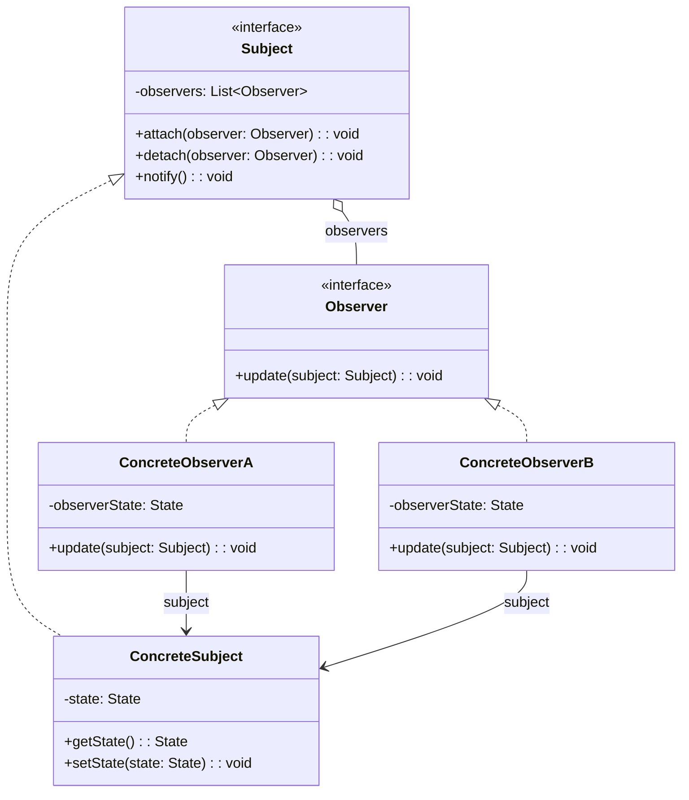
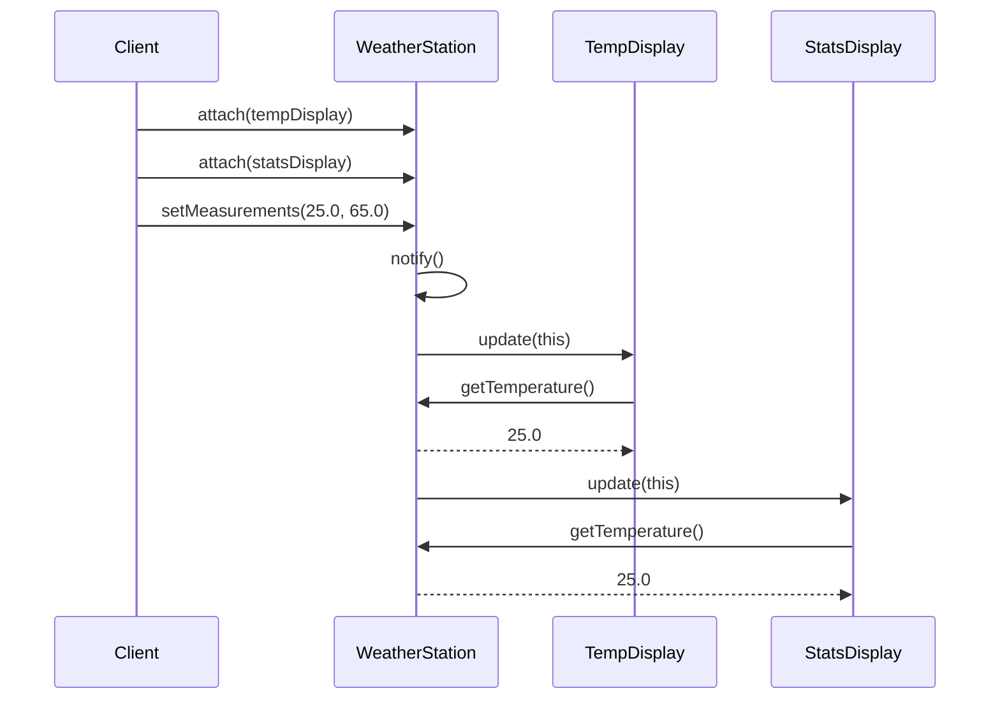

# Pytanie 34: Proszę szczegółowo omówić wybrany wzorzec projektowy dla oprogramowania oraz jego zastosowanie w praktyce.

## Kluczowe pojęcia

- **Wzorzec projektowy (design pattern)** — sprawdzone, wielokrotnie stosowane rozwiązanie typowego problemu projektowego w programowaniu obiektowym. Wzorzec opisuje problem, kontekst i strukturę rozwiązania w sposób niezależny od języka programowania.
- **Gang of Four (GoF)** — autorzy książki „Design Patterns: Elements of Reusable Object-Oriented Software" (1994): Erich Gamma, Richard Helm, Ralph Johnson, John Vlissides. Skatalogowali 23 wzorce projektowe podzielone na trzy kategorie.
- **Wzorce kreacyjne (creational)** — dotyczą mechanizmów tworzenia obiektów. Pozwalają uniezależnić kod od konkretnych klas tworzonych obiektów. Przykłady: Factory Method, Abstract Factory, Singleton, Builder, Prototype.
- **Wzorce strukturalne (structural)** — dotyczą składania klas i obiektów w większe struktury. Ułatwiają projektowanie elastycznych i wydajnych kompozycji. Przykłady: Adapter, Bridge, Composite, Decorator, Facade, Proxy.
- **Wzorce behawioralne (behavioral)** — dotyczą algorytmów i podziału odpowiedzialności między obiektami. Opisują wzorce komunikacji między obiektami. Przykłady: Observer, Strategy, Command, Iterator, State, Template Method.
- **Observer (Obserwator)** — wzorzec behawioralny definiujący zależność jeden-do-wielu między obiektami. Gdy obiekt obserwowany (subject) zmienia stan, wszystkie zależne obiekty (observers) są automatycznie powiadamiane i aktualizowane.
- **Strategy (Strategia)** — wzorzec behawioralny umożliwiający definiowanie rodziny algorytmów, hermetyzację każdego z nich i wymienność. Pozwala zmieniać algorytm niezależnie od klientów, którzy go używają.
- **Factory Method (Metoda wytwórcza)** — wzorzec kreacyjny definiujący interfejs do tworzenia obiektów, ale pozwalający podklasom decydować, którą klasę instancjonować.

## Klasyfikacja wzorców projektowych (GoF)

### Katalog 23 wzorców GoF

Wzorce GoF dzielą się na trzy kategorie według celu:

| Kategoria | Cel | Wzorce |
|---|---|---|
| **Kreacyjne** (5) | Tworzenie obiektów | Factory Method, Abstract Factory, Builder, Prototype, Singleton |
| **Strukturalne** (7) | Kompozycja klas/obiektów | Adapter, Bridge, Composite, Decorator, Facade, Flyweight, Proxy |
| **Behawioralne** (11) | Komunikacja i odpowiedzialność | Chain of Responsibility, Command, Interpreter, Iterator, Mediator, Memento, Observer, State, Strategy, Template Method, Visitor |

### Opis wzorca w katalogu GoF

Każdy wzorzec w katalogu GoF jest opisany według ustalonego schematu:

1. **Nazwa i klasyfikacja** — jednoznaczna nazwa wzorca
2. **Zamiar (intent)** — krótki opis problemu, który wzorzec rozwiązuje
3. **Znany też jako (also known as)** — alternatywne nazwy
4. **Motywacja** — scenariusz ilustrujący problem i rozwiązanie
5. **Zastosowanie (applicability)** — kiedy stosować wzorzec
6. **Struktura** — diagram klas UML
7. **Uczestnicy** — klasy/obiekty i ich role
8. **Współpraca** — jak uczestnicy współdziałają
9. **Konsekwencje** — zalety i wady
10. **Implementacja** — wskazówki implementacyjne
11. **Przykładowy kod** — implementacja w wybranym języku
12. **Znane zastosowania** — przykłady z rzeczywistych systemów
13. **Powiązane wzorce** — relacje z innymi wzorcami

## Szczegółowy opis wzorca Observer (Obserwator)

### Problem

W wielu systemach istnieje potrzeba utrzymania spójności między powiązanymi obiektami bez tworzenia ścisłego sprzężenia (tight coupling) między nimi. Na przykład:
- Interfejs graficzny musi reagować na zmiany danych w modelu
- System powiadomień musi informować wielu odbiorców o zdarzeniach
- Arkusz kalkulacyjny musi aktualizować wykresy po zmianie danych w komórkach

Bezpośrednie wywoływanie metod aktualizacji prowadzi do silnego sprzężenia — obiekt źródłowy musi znać wszystkie obiekty zależne i ich interfejsy.

### Rozwiązanie

Wzorzec Observer definiuje mechanizm subskrypcji, w którym:
- **Subject (podmiot)** utrzymuje listę obserwatorów i udostępnia metody do rejestracji/wyrejestrowania
- **Observer (obserwator)** definiuje interfejs aktualizacji
- Gdy stan podmiotu się zmienia, powiadamia on wszystkich zarejestrowanych obserwatorów
- Obserwatorzy mogą dynamicznie dołączać i odłączać się od podmiotu

### Struktura — diagram klas UML



### Uczestnicy

| Uczestnik | Rola |
|---|---|
| **Subject** | Interfejs definiujący operacje zarządzania obserwatorami: `attach()`, `detach()`, `notify()` |
| **ConcreteSubject** | Przechowuje stan interesujący obserwatorów. Wywołuje `notify()` po zmianie stanu |
| **Observer** | Interfejs definiujący metodę `update()`, wywoływaną przy zmianie stanu podmiotu |
| **ConcreteObserver** | Implementuje interfejs Observer. Utrzymuje referencję do ConcreteSubject i synchronizuje swój stan z podmiotem |

### Współpraca między uczestnikami

Sekwencja interakcji w wzorcu Observer:

1. **ConcreteSubject** zmienia swój stan (np. przez `setState()`)
2. **ConcreteSubject** wywołuje `notify()` na sobie
3. `notify()` iteruje po liście obserwatorów i wywołuje `update()` na każdym
4. Każdy **ConcreteObserver** w metodzie `update()` pobiera aktualny stan z podmiotu (`getState()`) i aktualizuje się

### Konsekwencje

| Zalety | Wady |
|---|---|
| Luźne sprzężenie — Subject nie zna konkretnych klas obserwatorów | Obserwatorzy powiadamiani w nieokreślonej kolejności |
| Dynamiczne dodawanie/usuwanie obserwatorów w runtime | Kaskadowe aktualizacje mogą być kosztowne |
| Zgodność z zasadą Open/Closed (OCP) — nowi obserwatorzy bez modyfikacji podmiotu | Ryzyko wycieków pamięci (obserwator nie wyrejestrowany) |
| Wspiera komunikację broadcast (jeden-do-wielu) | Trudniejsze debugowanie (pośredni przepływ sterowania) |
| Wielokrotne użycie podmiotu i obserwatorów niezależnie | Możliwość nieskończonych pętli aktualizacji |

### Warianty wzorca Observer

1. **Push model** — podmiot wysyła szczegółowe dane o zmianie w parametrze `update()`. Obserwator otrzymuje wszystkie potrzebne informacje bez odpytywania podmiotu.
2. **Pull model** — podmiot wysyła minimalne powiadomienie (np. tylko referencję do siebie). Obserwator sam pobiera potrzebne dane przez `getState()`.
3. **Event-based (zdarzeniowy)** — obserwatorzy subskrybują konkretne typy zdarzeń, a nie wszystkie zmiany podmiotu. Stosowany w systemach GUI i frameworkach (np. EventEmitter w Node.js, addEventListener w DOM).

## Przykłady

### Implementacja wzorca Observer w pseudokodzie

```
// Interfejs Subject
interface Subject:
    method attach(observer: Observer)
    method detach(observer: Observer)
    method notify()

// Interfejs Observer
interface Observer:
    method update(subject: Subject)

// Konkretny podmiot — stacja pogodowa
class WeatherStation implements Subject:
    private observers: List<Observer> = []
    private temperature: float
    private humidity: float

    method attach(observer: Observer):
        observers.add(observer)

    method detach(observer: Observer):
        observers.remove(observer)

    method notify():
        for each observer in observers:
            observer.update(this)

    method setMeasurements(temp: float, hum: float):
        this.temperature = temp
        this.humidity = hum
        notify()  // powiadom obserwatorów o zmianie

    method getTemperature(): float
        return this.temperature

    method getHumidity(): float
        return this.humidity

// Konkretny obserwator — wyświetlacz temperatury
class TemperatureDisplay implements Observer:
    method update(subject: Subject):
        if subject is WeatherStation:
            temp = subject.getTemperature()
            display("Temperatura: " + temp + "°C")

// Konkretny obserwator — wyświetlacz statystyk
class StatisticsDisplay implements Observer:
    private readings: List<float> = []

    method update(subject: Subject):
        if subject is WeatherStation:
            readings.add(subject.getTemperature())
            avg = sum(readings) / len(readings)
            display("Średnia temperatura: " + avg + "°C")

// Użycie
station = new WeatherStation()
tempDisplay = new TemperatureDisplay()
statsDisplay = new StatisticsDisplay()

station.attach(tempDisplay)
station.attach(statsDisplay)

station.setMeasurements(25.0, 65.0)
// Wynik:
//   Temperatura: 25.0°C
//   Średnia temperatura: 25.0°C

station.setMeasurements(28.0, 70.0)
// Wynik:
//   Temperatura: 28.0°C
//   Średnia temperatura: 26.5°C

station.detach(tempDisplay)

station.setMeasurements(22.0, 60.0)
// Wynik:
//   Średnia temperatura: 25.0°C
```

### Diagram sekwencji — przepływ powiadomień



### Zastosowanie w praktyce — przykłady z rzeczywistych systemów

| System / Technologia | Zastosowanie Observer |
|---|---|
| **GUI (Swing, Qt, WPF)** | Komponenty UI obserwują model danych (wzorzec MVC/MVVM) |
| **DOM w przeglądarce** | `addEventListener` — rejestracja obserwatorów zdarzeń (click, input, scroll) |
| **Node.js EventEmitter** | `emitter.on('event', callback)` — zdarzeniowy wariant Observer |
| **RxJS / ReactiveX** | Strumienie Observable z operatorami transformacji — reaktywny Observer |
| **Spring Framework** | `ApplicationEvent` + `@EventListener` — zdarzenia aplikacyjne |
| **Android LiveData** | Komponenty UI obserwują dane z ViewModel (architektura MVVM) |
| **Redux (React)** | Store powiadamia subskrybentów (`subscribe()`) o zmianie stanu |

### Porównanie Observer z pokrewnymi wzorcami

| Wzorzec | Relacja z Observer |
|---|---|
| **Mediator** | Centralizuje komunikację — obiekty komunikują się przez mediatora zamiast bezpośrednio. Observer jest zdecentralizowany. |
| **Publish-Subscribe** | Rozszerzenie Observer z pośrednikiem (message broker). Nadawca i odbiorca nie znają się nawzajem. |
| **Event Sourcing** | Przechowuje historię zdarzeń. Może wykorzystywać Observer do powiadamiania o nowych zdarzeniach. |
| **Strategy** | Hermetyzuje algorytm. Observer hermetyzuje reakcję na zmianę stanu. |

## Podsumowanie

1. **Wzorce projektowe GoF** to katalog 23 sprawdzonych rozwiązań typowych problemów projektowych, podzielonych na kreacyjne (tworzenie obiektów), strukturalne (kompozycja) i behawioralne (komunikacja i odpowiedzialność).

2. **Observer (Obserwator)** to wzorzec behawioralny definiujący relację jeden-do-wielu. Subject utrzymuje listę obserwatorów i powiadamia ich automatycznie o zmianach stanu przez metodę `notify()` → `update()`.

3. **Struktura wzorca** obejmuje czterech uczestników: Subject (interfejs zarządzania obserwatorami), ConcreteSubject (przechowuje stan), Observer (interfejs aktualizacji) i ConcreteObserver (reaguje na zmiany).

4. **Główne zalety** Observer to luźne sprzężenie (subject nie zna konkretnych klas obserwatorów), dynamiczna rejestracja w runtime, zgodność z zasadą Open/Closed i wsparcie komunikacji broadcast.

5. **Zastosowania praktyczne** obejmują systemy GUI (MVC/MVVM), zdarzenia DOM w przeglądarkach, EventEmitter w Node.js, programowanie reaktywne (RxJS), frameworki (Spring Events, Android LiveData) i zarządzanie stanem (Redux).

## Powiązane pytania

- [Pytanie 31: Programowanie po stronie serwera i klienta](31-programowanie-serwer-klient.md)
- [Pytanie 33: Efektywność tworzenia systemów](33-efektywnosc-tworzenia-systemow.md)
