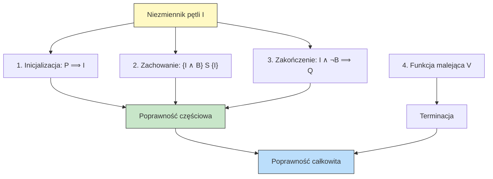

# Pytanie 39: Proszę opisać, co to jest niezmiennik pętli i jak wykorzystuje się go przy dowodzeniu poprawności algorytmów iteracyjnych.

## Kluczowe pojęcia

- **Niezmiennik pętli (loop invariant)** — warunek logiczny (predykat), który jest prawdziwy przed rozpoczęciem pętli, pozostaje prawdziwy po każdej iteracji pętli i jest prawdziwy po zakończeniu pętli. Formalnie: jeśli $I$ jest niezmiennikiem pętli `while B do S`, to $I$ zachodzi przed pętlą, a jeśli $I \land B$ zachodzi przed wykonaniem ciała $S$, to $I$ zachodzi po wykonaniu $S$. Niezmiennik pętli jest kluczowym narzędziem dowodzenia poprawności częściowej algorytmów iteracyjnych.
- **Poprawność częściowa (partial correctness)** — algorytm jest częściowo poprawny względem specyfikacji $(P, Q)$, jeśli: **gdy** algorytm zakończy działanie dla danych spełniających warunek wstępny $P$, **to** wynik spełnia warunek końcowy $Q$. Poprawność częściowa nie gwarantuje terminacji — algorytm może działać w nieskończoność. Zapisujemy to jako trójkę Hoare'a: $\{P\}\; S \;\{Q\}$.
- **Poprawność całkowita (total correctness)** — algorytm jest całkowicie poprawny względem specyfikacji $(P, Q)$, jeśli jest częściowo poprawny **i** zawsze kończy działanie dla danych spełniających $P$. Formalnie: poprawność całkowita = poprawność częściowa + terminacja. Zapisujemy: $[P]\; S \;[Q]$.
- **Indukcja matematyczna** — metoda dowodowa stosowana przy uzasadnianiu niezmiennika pętli. Dowód niezmiennika ma strukturę indukcyjną: baza (inicjalizacja — niezmiennik zachodzi przed pierwszą iteracją) i krok indukcyjny (zachowanie — jeśli niezmiennik zachodzi przed iteracją, to zachodzi po niej).
- **Warunek wstępny (precondition)** — predykat $P$ opisujący wymagania wobec danych wejściowych algorytmu. Algorytm gwarantuje poprawność wyniku tylko dla danych spełniających warunek wstępny.
- **Warunek końcowy (postcondition)** — predykat $Q$ opisujący oczekiwane właściwości wyniku algorytmu. Po zakończeniu algorytmu stan programu musi spełniać warunek końcowy.
- **Logika Hoare'a (Hoare logic)** — formalny system aksjomatów i reguł wnioskowania, zaproponowany przez C.A.R. Hoare'a w 1969 roku, służący do dowodzenia poprawności programów imperatywnych. Centralnym pojęciem jest trójka Hoare'a $\{P\}\; S \;\{Q\}$, oznaczająca: jeśli przed wykonaniem instrukcji $S$ zachodzi $P$, to po wykonaniu $S$ zachodzi $Q$.
- **Funkcja malejąca (variant/bound function)** — funkcja $V: \text{stan} \to \mathbb{N}$, która ściśle maleje w każdej iteracji pętli i jest ograniczona od dołu (zwykle przez 0). Istnienie takiej funkcji dowodzi terminacji pętli, a więc jest niezbędna do wykazania poprawności całkowitej.

## Definicja niezmiennika pętli

### Intuicja

Niezmiennik pętli to **własność, która nie zmienia się** pomimo wielokrotnego wykonywania ciała pętli. Można go porównać do „kontraktu" — pętla zobowiązuje się, że po każdej iteracji pewien warunek pozostanie spełniony. Gdy pętla się zakończy (warunek pętli stanie się fałszywy), niezmiennik w połączeniu z negacją warunku pętli pozwala wywnioskować pożądany wynik.

### Definicja formalna

Niech dana będzie pętla:

```
while B do
  S
```

Predykat $I$ jest **niezmiennikiem pętli**, jeśli spełnia następujące warunki:

1. **Inicjalizacja:** $I$ jest prawdziwy bezpośrednio przed pierwszym sprawdzeniem warunku $B$
2. **Zachowanie:** Jeśli $I \land B$ jest prawdziwy przed wykonaniem ciała $S$, to $I$ jest prawdziwy po wykonaniu $S$

Formalnie warunek zachowania zapisujemy jako trójkę Hoare'a:

$$\{I \land B\}\; S \;\{I\}$$

Po zakończeniu pętli (gdy $B$ staje się fałszywy) wiemy, że zachodzi:

$$I \land \neg B$$


To właśnie ta koniunkcja — niezmiennik plus negacja warunku pętli — stanowi klucz do dowodzenia poprawności: jeśli $I \land \neg B$ implikuje warunek końcowy $Q$, to algorytm jest częściowo poprawny.

### Analogia

Niezmiennik pętli działa jak **hipoteza indukcyjna** w dowodzie przez indukcję matematyczną:
- **Baza indukcji** = inicjalizacja niezmiennika (przed pierwszą iteracją)
- **Krok indukcyjny** = zachowanie niezmiennika (z iteracji $k$ na iterację $k+1$)
- **Wniosek** = po zakończeniu pętli niezmiennik + negacja warunku → wynik poprawny

## Trójka Hoare'a

### Definicja

**Trójka Hoare'a** (Hoare triple) to wyrażenie postaci:

$$\{P\}\; S \;\{Q\}$$

gdzie:
- $P$ — **warunek wstępny** (precondition)
- $S$ — **instrukcja** (program)
- $Q$ — **warunek końcowy** (postcondition)

Interpretacja: jeśli $P$ jest prawdziwy przed wykonaniem $S$ i $S$ zakończy działanie, to $Q$ jest prawdziwy po wykonaniu $S$.

### Podstawowe aksjomaty i reguły logiki Hoare'a

#### 1. Aksjomat przypisania

$$\{Q[x/E]\}\; x := E \;\{Q\}$$

Aby po przypisaniu $x := E$ zachodził warunek $Q$, przed przypisaniem musi zachodzić $Q$ z $x$ zastąpionym przez $E$.

**Przykład:** $\{y + 1 > 0\}\; x := y + 1 \;\{x > 0\}$

#### 2. Reguła sekwencji (kompozycji)

$$\frac{\{P\}\; S_1 \;\{R\} \quad \{R\}\; S_2 \;\{Q\}}{\{P\}\; S_1;\; S_2 \;\{Q\}}$$

Jeśli $S_1$ prowadzi od $P$ do $R$, a $S_2$ prowadzi od $R$ do $Q$, to sekwencja $S_1; S_2$ prowadzi od $P$ do $Q$.

#### 3. Reguła warunkowa (if-then-else)

$$\frac{\{P \land B\}\; S_1 \;\{Q\} \quad \{P \land \neg B\}\; S_2 \;\{Q\}}{\{P\}\; \textbf{if } B \textbf{ then } S_1 \textbf{ else } S_2 \;\{Q\}}$$

#### 4. Reguła pętli while (kluczowa dla niezmienników)

$$\frac{\{I \land B\}\; S \;\{I\}}{\{I\}\; \textbf{while } B \textbf{ do } S \;\{I \land \neg B\}}$$

To jest formalna reguła, która mówi: jeśli $I$ jest niezmiennikiem pętli (tj. ciało $S$ zachowuje $I$ przy założeniu $B$), to po zakończeniu pętli zachodzi $I \land \neg B$.

#### 5. Reguła wzmacniania/osłabiania (consequence rule)

$$\frac{P' \Rightarrow P \quad \{P\}\; S \;\{Q\} \quad Q \Rightarrow Q'}{\{P'\}\; S \;\{Q'\}}$$

Pozwala wzmocnić warunek wstępny i osłabić warunek końcowy.

## Schemat dowodu poprawności z niezmiennikiem pętli

Dowód poprawności algorytmu iteracyjnego z użyciem niezmiennika pętli składa się z trzech kroków (dla poprawności częściowej) lub czterech kroków (dla poprawności całkowitej):

### Krok 1: Inicjalizacja (Initialization)

Wykazać, że niezmiennik $I$ jest prawdziwy **przed pierwszą iteracją** pętli, tj. po wykonaniu kodu inicjalizującego, a przed pierwszym sprawdzeniem warunku pętli.

Formalnie: warunek wstępny $P$ po kodzie inicjalizującym implikuje $I$.

### Krok 2: Zachowanie (Maintenance)

Wykazać, że jeśli niezmiennik $I$ jest prawdziwy na początku iteracji i warunek pętli $B$ jest spełniony, to $I$ jest prawdziwy na końcu iteracji (po wykonaniu ciała pętli).

Formalnie: $\{I \land B\}\; S \;\{I\}$

Ten krok odpowiada krokowi indukcyjnemu w dowodzie przez indukcję.

### Krok 3: Zakończenie (Termination) — poprawność częściowa

Wykazać, że po zakończeniu pętli (gdy $\neg B$), niezmiennik $I$ w połączeniu z $\neg B$ implikuje warunek końcowy $Q$:

$$I \land \neg B \Rightarrow Q$$

### Krok 4: Terminacja (Termination) — poprawność całkowita

Wykazać, że pętla zawsze się kończy. W tym celu należy znaleźć **funkcję malejącą** (variant) $V$:
- $V$ przyjmuje wartości w $\mathbb{N}$ (lub innym zbiorze dobrze uporządkowanym)
- $V$ ściśle maleje w każdej iteracji: jeśli $I \land B$ zachodzi, to po wykonaniu ciała pętli wartość $V$ jest mniejsza
- $I \land B \Rightarrow V > 0$ (pętla nie może kontynuować, gdy $V = 0$)


### Schemat dowodu — podsumowanie

```
SCHEMAT DOWODU POPRAWNOŚCI ALGORYTMU ITERACYJNEGO

  Dany algorytm:
    { P }                          ← warunek wstępny
    <kod inicjalizujący>
    while B do
      S                            ← ciało pętli
    { Q }                          ← warunek końcowy

  Wybrany niezmiennik: I

  DOWÓD POPRAWNOŚCI CZĘŚCIOWEJ:
  ┌─────────────────────────────────────────────────┐
  │ 1. INICJALIZACJA                                │
  │    Wykazać: P ∧ <po inicjalizacji> ⟹ I         │
  │                                                 │
  │ 2. ZACHOWANIE                                   │
  │    Wykazać: {I ∧ B} S {I}                       │
  │    (ciało pętli zachowuje niezmiennik)          │
  │                                                 │
  │ 3. ZAKOŃCZENIE                                  │
  │    Wykazać: I ∧ ¬B ⟹ Q                         │
  │    (niezmiennik + koniec pętli → wynik)         │
  └─────────────────────────────────────────────────┘

  DOWÓD TERMINACJI (dla poprawności całkowitej):
  ┌─────────────────────────────────────────────────┐
  │ 4. FUNKCJA MALEJĄCA V                           │
  │    Wykazać:                                     │
  │    a) I ∧ B ⟹ V > 0                            │
  │    b) {I ∧ B ∧ V = v₀} S {V < v₀}             │
  │    (V ściśle maleje w każdej iteracji)          │
  └─────────────────────────────────────────────────┘
```

### Związek z poprawnością

Schemat dowodu z niezmiennikiem pętli łączy się z pojęciami poprawności w następujący sposób:



## Przykłady

### Przykład 1: Sumowanie elementów tablicy

Rozważmy algorytm obliczający sumę elementów tablicy:

```
ALGORYTM Suma(A, n)
  Wejście: tablica A[1..n] liczb, n ≥ 0
  Wyjście: suma elementów A

  s ← 0
  i ← 1
  DOPÓKI i ≤ n:
    s ← s + A[i]
    i ← i + 1
  ZWRÓĆ s
```

**Specyfikacja:**
- Warunek wstępny $P$: $n \geq 0$, tablica $A[1..n]$ jest zdefiniowana
- Warunek końcowy $Q$: $s = \sum_{j=1}^{n} A[j]$

**Niezmiennik pętli:**

$$I: \quad s = \sum_{j=1}^{i-1} A[j] \;\land\; 1 \leq i \leq n+1$$

**Dowód:**

**1. Inicjalizacja:** Przed pętlą $s = 0$ i $i = 1$. Wtedy $\sum_{j=1}^{0} A[j] = 0 = s$ ✓ oraz $1 \leq 1 \leq n+1$ ✓

**2. Zachowanie:** Załóżmy, że $I$ zachodzi i $i \leq n$ (warunek pętli). Po wykonaniu ciała:
- $s_{\text{nowe}} = s + A[i] = \sum_{j=1}^{i-1} A[j] + A[i] = \sum_{j=1}^{i} A[j]$
- $i_{\text{nowe}} = i + 1$
- Zatem $s_{\text{nowe}} = \sum_{j=1}^{i_{\text{nowe}}-1} A[j]$ ✓
- Ponieważ $i \leq n$, to $i_{\text{nowe}} = i + 1 \leq n + 1$ ✓

**3. Zakończenie:** Pętla kończy się, gdy $i > n$, czyli $i = n + 1$ (z niezmiennika $i \leq n+1$). Z niezmiennika: $s = \sum_{j=1}^{n+1-1} A[j] = \sum_{j=1}^{n} A[j]$ ✓

**4. Terminacja:** Funkcja malejąca $V = n - i + 1$. Przed każdą iteracją $V \geq 0$ (bo $i \leq n$, więc $V \geq 1 > 0$). Po iteracji $V$ maleje o 1 (bo $i$ rośnie o 1). ✓

**Wniosek:** Algorytm jest **całkowicie poprawny**.


### Przykład 2: Dowód poprawności wyszukiwania binarnego

Wyszukiwanie binarne jest klasycznym przykładem algorytmu, w którym niezmiennik pętli odgrywa kluczową rolę w dowodzie poprawności.

```
ALGORYTM WyszukiwanieBinarne(A, n, klucz)
  Wejście: posortowana tablica A[1..n] (rosnąco), szukany klucz
  Wyjście: indeks i taki, że A[i] = klucz, lub -1 jeśli klucz ∉ A

  lo ← 1
  hi ← n
  DOPÓKI lo ≤ hi:
    mid ← ⌊(lo + hi) / 2⌋
    JEŚLI A[mid] = klucz:
      ZWRÓĆ mid
    JEŚLI A[mid] < klucz:
      lo ← mid + 1
    W PRZECIWNYM RAZIE:
      hi ← mid - 1
  ZWRÓĆ -1
```

**Specyfikacja:**
- Warunek wstępny $P$: $n \geq 1$, tablica $A[1..n]$ jest posortowana rosnąco ($\forall_{1 \leq i < j \leq n}\; A[i] \leq A[j]$)
- Warunek końcowy $Q$: wynik $= i$ gdzie $A[i] = \text{klucz}$, lub wynik $= -1$ jeśli $\forall_{1 \leq j \leq n}\; A[j] \neq \text{klucz}$

**Niezmiennik pętli:**

$$I: \quad 1 \leq lo \;\land\; hi \leq n \;\land\; (\text{klucz} \in A[1..n] \Rightarrow \text{klucz} \in A[lo..hi])$$

Słownie: jeśli klucz znajduje się w tablicy, to znajduje się w przedziale $A[lo..hi]$. Innymi słowy, poza przedziałem $[lo, hi]$ na pewno nie ma klucza.

**Dowód:**

**1. Inicjalizacja:** Przed pętlą $lo = 1$, $hi = n$. Przedział $A[lo..hi] = A[1..n]$ obejmuje całą tablicę, więc jeśli klucz jest w tablicy, to jest w $A[1..n]$ ✓

**2. Zachowanie:** Załóżmy, że $I$ zachodzi i $lo \leq hi$. Obliczamy $mid = \lfloor(lo + hi)/2\rfloor$.

- **Przypadek $A[mid] = \text{klucz}$:** Algorytm zwraca $mid$ — poprawnie, bo $A[mid] = \text{klucz}$ ✓
- **Przypadek $A[mid] < \text{klucz}$:** Ponieważ tablica jest posortowana, $\forall_{j \leq mid}\; A[j] \leq A[mid] < \text{klucz}$. Zatem klucz (jeśli istnieje) musi być w $A[mid+1..hi]$. Ustawiamy $lo \leftarrow mid + 1$, więc niezmiennik jest zachowany ✓
- **Przypadek $A[mid] > \text{klucz}$:** Analogicznie, $\forall_{j \geq mid}\; A[j] \geq A[mid] > \text{klucz}$. Klucz (jeśli istnieje) musi być w $A[lo..mid-1]$. Ustawiamy $hi \leftarrow mid - 1$, niezmiennik zachowany ✓

**3. Zakończenie:** Pętla kończy się, gdy $lo > hi$. Przedział $A[lo..hi]$ jest pusty. Z niezmiennika: jeśli klucz byłby w tablicy, musiałby być w pustym przedziale — sprzeczność. Zatem klucz nie jest w tablicy i algorytm poprawnie zwraca $-1$ ✓

**4. Terminacja:** Funkcja malejąca $V = hi - lo + 1$ (rozmiar przeszukiwanego przedziału).
- Przed iteracją: $V \geq 1$ (bo $lo \leq hi$)
- Po iteracji: albo algorytm zwraca wynik (koniec), albo $lo$ rośnie lub $hi$ maleje, więc $V$ ściśle maleje
- Dokładniej: $mid = \lfloor(lo + hi)/2\rfloor$, więc:
  - Jeśli $lo \leftarrow mid + 1$: nowe $V = hi - (mid+1) + 1 = hi - mid \leq hi - lo = V - 1$
  - Jeśli $hi \leftarrow mid - 1$: nowe $V = (mid-1) - lo + 1 = mid - lo \leq hi - lo = V - 1$
- $V$ jest ograniczone od dołu przez 0, więc pętla musi się zakończyć ✓

**Wniosek:** Wyszukiwanie binarne jest **całkowicie poprawne**.

#### Ślad wykonania

Szukamy klucza $23$ w tablicy $A = [2, 5, 8, 12, 16, 23, 38, 56, 72, 91]$ ($n = 10$):

| Iteracja | $lo$ | $hi$ | $mid$ | $A[mid]$ | Porównanie | Akcja | Niezmiennik |
|---|---|---|---|---|---|---|---|
| 1 | 1 | 10 | 5 | 16 | $16 < 23$ | $lo \leftarrow 6$ | klucz ∈ A[6..10] |
| 2 | 6 | 10 | 8 | 56 | $56 > 23$ | $hi \leftarrow 7$ | klucz ∈ A[6..7] |
| 3 | 6 | 7 | 6 | 23 | $23 = 23$ | zwróć 6 | znaleziono ✓ |

Wynik: indeks $6$, $A[6] = 23$ ✓

### Przykład 3: Potęgowanie szybkie (fast exponentiation)

```
ALGORYTM PotegowanieSzybkie(x, n)
  Wejście: liczba x, wykładnik n ≥ 0 (całkowity)
  Wyjście: x^n

  wynik ← 1
  baza ← x
  exp ← n
  DOPÓKI exp > 0:
    JEŚLI exp jest nieparzyste:
      wynik ← wynik × baza
    baza ← baza × baza
    exp ← ⌊exp / 2⌋
  ZWRÓĆ wynik
```

**Niezmiennik pętli:**

$$I: \quad \text{wynik} \times \text{baza}^{\text{exp}} = x^n \;\land\; \text{exp} \geq 0$$

**Dowód:**

**1. Inicjalizacja:** $\text{wynik} = 1$, $\text{baza} = x$, $\text{exp} = n$. Zatem $1 \times x^n = x^n$ ✓

**2. Zachowanie:** Załóżmy $I$ i $\text{exp} > 0$.
- Jeśli $\text{exp}$ nieparzyste: $\text{wynik}_{\text{nowy}} = \text{wynik} \times \text{baza}$, $\text{baza}_{\text{nowa}} = \text{baza}^2$, $\text{exp}_{\text{nowy}} = (\text{exp}-1)/2$. Wtedy: $\text{wynik}_{\text{nowy}} \times \text{baza}_{\text{nowa}}^{\text{exp}_{\text{nowy}}} = \text{wynik} \times \text{baza} \times (\text{baza}^2)^{(\text{exp}-1)/2} = \text{wynik} \times \text{baza}^{1 + \text{exp} - 1} = \text{wynik} \times \text{baza}^{\text{exp}} = x^n$ ✓
- Jeśli $\text{exp}$ parzyste: $\text{wynik}_{\text{nowy}} = \text{wynik}$, $\text{baza}_{\text{nowa}} = \text{baza}^2$, $\text{exp}_{\text{nowy}} = \text{exp}/2$. Wtedy: $\text{wynik} \times (\text{baza}^2)^{\text{exp}/2} = \text{wynik} \times \text{baza}^{\text{exp}} = x^n$ ✓

**3. Zakończenie:** Gdy $\text{exp} = 0$: $\text{wynik} \times \text{baza}^0 = \text{wynik} = x^n$ ✓

**4. Terminacja:** $V = \text{exp}$. W każdej iteracji $\text{exp} \leftarrow \lfloor\text{exp}/2\rfloor < \text{exp}$ (bo $\text{exp} > 0$). ✓


## Jak dobierać niezmiennik pętli?

Dobór odpowiedniego niezmiennika jest najtrudniejszą częścią dowodu poprawności. Oto praktyczne wskazówki:

1. **Zacznij od warunku końcowego $Q$** — niezmiennik powinien być „uogólnieniem" warunku końcowego. Warunek końcowy mówi, co ma zachodzić po zakończeniu pętli; niezmiennik mówi, co zachodzi w trakcie.

2. **Zastąp stałe zmiennymi** — jeśli $Q$ mówi o końcowej wartości zmiennej (np. $s = \sum_{j=1}^{n} A[j]$), zastąp granicę sumowania bieżącą zmienną iteracyjną (np. $s = \sum_{j=1}^{i-1} A[j]$).

3. **Sprawdź, czy $I \land \neg B \Rightarrow Q$** — niezmiennik musi być wystarczająco silny, aby w połączeniu z negacją warunku pętli implikować wynik.

4. **Sprawdź, czy $I$ jest zachowywany** — niezmiennik nie może być zbyt silny, bo ciało pętli musi go zachowywać.

5. **Niezmiennik powinien opisywać „postęp"** — ile pracy algorytm już wykonał i jaki jest związek między zmiennymi.

### Typowe błędy

| Błąd | Opis | Konsekwencja |
|---|---|---|
| Niezmiennik zbyt słaby | $I \land \neg B$ nie implikuje $Q$ | Nie można zakończyć dowodu |
| Niezmiennik zbyt silny | Ciało pętli nie zachowuje $I$ | Krok zachowania nie przechodzi |
| Brak warunku na zakres zmiennych | Np. brak $1 \leq i \leq n+1$ | Niezmiennik nie jest pełny |
| Pominięcie inicjalizacji | Niezmiennik nie zachodzi przed pętlą | Dowód jest niepoprawny |

## Podsumowanie

1. **Niezmiennik pętli** to predykat logiczny, który jest prawdziwy przed pętlą, zachowywany przez każdą iterację i prawdziwy po zakończeniu pętli. Jest fundamentalnym narzędziem dowodzenia poprawności algorytmów iteracyjnych.

2. **Logika Hoare'a** formalizuje rozumowanie o poprawności programów za pomocą trójek $\{P\}\; S \;\{Q\}$. Reguła pętli while mówi: jeśli $\{I \land B\}\; S \;\{I\}$, to $\{I\}\; \textbf{while } B \textbf{ do } S \;\{I \land \neg B\}$.

3. **Schemat dowodu** z niezmiennikiem obejmuje trzy kroki dla poprawności częściowej: (1) inicjalizacja — $I$ zachodzi przed pętlą, (2) zachowanie — ciało pętli zachowuje $I$, (3) zakończenie — $I \land \neg B \Rightarrow Q$. Dla poprawności całkowitej dodajemy (4) terminację — istnienie funkcji malejącej $V$.

4. **Poprawność częściowa** gwarantuje poprawność wyniku pod warunkiem zakończenia algorytmu. **Poprawność całkowita** = poprawność częściowa + terminacja. Do wykazania terminacji służy funkcja malejąca (variant) — funkcja o wartościach w $\mathbb{N}$, ściśle malejąca w każdej iteracji.

5. Dobór niezmiennika wymaga intuicji i praktyki. Kluczowa zasada: niezmiennik powinien być uogólnieniem warunku końcowego, z granicami zastąpionymi bieżącymi zmiennymi iteracyjnymi. Musi być wystarczająco silny, aby implikować wynik, ale nie za silny, aby ciało pętli mogło go zachować.

## Powiązane pytania

- [Pytanie 28: Definicja algorytmu](28-definicja-algorytmu.md)
- [Pytanie 29: Algorytmy skończone i iteracyjne](29-algorytmy-skonczone-iteracyjne.md)
- [Pytanie 27: Złożoność obliczeniowa](27-zlozonosc-obliczeniowa.md)
