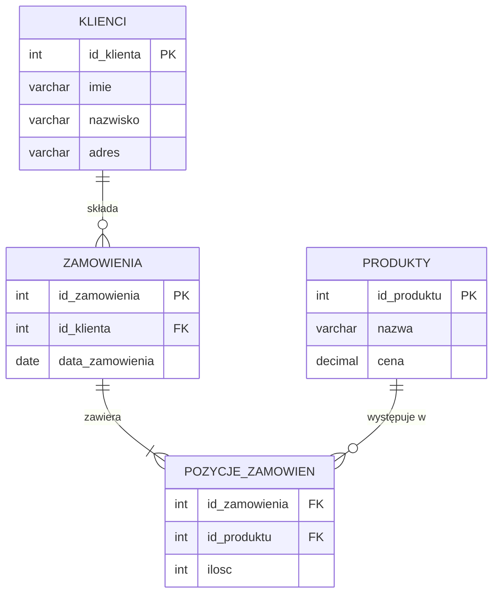

# Pytanie 49: Scharakteryzować strukturę relacyjnych baz danych.

## Kluczowe pojęcia

- **Relacja** — w sensie matematycznym podzbiór iloczynu kartezjańskiego domen (zbiorów wartości). W praktyce relacja odpowiada tabeli w bazie danych. Model relacyjny definiuje relację jako zbiór krotek (wierszy) o ustalonej strukturze atrybutów (kolumn). Relacja ma schemat (nagłówek) i ciało (zbiór krotek).
- **Tabela** — fizyczna reprezentacja relacji w systemie zarządzania bazą danych (SZBD). Składa się z kolumn (atrybutów) i wierszy (krotek/rekordów). Każda kolumna ma nazwę i typ danych, każdy wiersz reprezentuje jeden rekord.
- **Klucz główny (PRIMARY KEY)** — minimalny zbiór atrybutów, którego wartości jednoznacznie identyfikują każdą krotkę w relacji. Klucz główny nie może zawierać wartości NULL i musi być unikalny. Każda relacja powinna mieć dokładnie jeden klucz główny.
- **Klucz obcy (FOREIGN KEY)** — atrybut (lub zbiór atrybutów) w jednej relacji, którego wartości odwołują się do klucza głównego innej relacji. Klucz obcy realizuje powiązania między tabelami i zapewnia integralność referencyjną.
- **Normalizacja** — proces organizacji struktury bazy danych w celu eliminacji redundancji i anomalii (wstawiania, usuwania, aktualizacji). Normalizacja polega na dekompozycji relacji do postaci spełniającej kolejne postacie normalne (1NF, 2NF, 3NF, BCNF).
- **ACID** — zbiór czterech właściwości gwarantujących niezawodność transakcji w bazach danych: Atomicity (atomowość), Consistency (spójność), Isolation (izolacja), Durability (trwałość).
- **Indeks** — struktura danych (najczęściej B-drzewo lub B+-drzewo) przyspieszająca wyszukiwanie rekordów w tabeli. Indeks tworzy odwzorowanie wartości klucza na lokalizację wiersza, zmniejszając liczbę operacji I/O potrzebnych do znalezienia danych.

## Model relacyjny (Codd)

### Geneza i założenia

Model relacyjny został zaproponowany przez Edgara F. Codda w 1970 roku w artykule *„A Relational Model of Data for Large Shared Data Banks"*. Codd postulował oparcie baz danych na solidnych podstawach matematycznych — algebrze relacji i rachunku relacyjnym — zamiast na nawigacyjnych modelach hierarchicznych i sieciowych.

### 12 reguł Codda (wybrane)

Codd sformułował 12 reguł (plus reguła 0), które definiują, kiedy SZBD można uznać za w pełni relacyjny. Najważniejsze:

1. **Reguła informacyjna** — wszystkie dane są reprezentowane jako wartości w tabelach (relacjach)
2. **Gwarantowany dostęp** — każda wartość jest dostępna przez kombinację nazwy tabeli, klucza głównego i nazwy kolumny
3. **Systematyczne traktowanie NULL** — wartości NULL reprezentują brakujące lub nieznane dane
4. **Dynamiczny katalog** — struktura bazy (metadane) jest opisana w tych samych relacjach co dane użytkownika
5. **Niezależność fizyczna** — zmiany w fizycznym przechowywaniu danych nie wpływają na aplikacje
6. **Niezależność logiczna** — zmiany w strukturze logicznej (np. dodanie kolumny) nie wpływają na istniejące aplikacje

### Algebra relacji

Algebra relacji definiuje operacje na relacjach, których wynikiem są nowe relacje:

| Operacja | Symbol | Opis |
|---|---|---|
| Selekcja | $\sigma_{\text{warunek}}(R)$ | Wybór krotek spełniających warunek |
| Projekcja | $\pi_{\text{atrybuty}}(R)$ | Wybór kolumn |
| Iloczyn kartezjański | $R \times S$ | Wszystkie kombinacje krotek |
| Złączenie | $R \bowtie S$ | Iloczyn kartezjański + selekcja na wspólnych atrybutach |
| Suma | $R \cup S$ | Suma zbiorów krotek |
| Różnica | $R - S$ | Krotki w $R$, których nie ma w $S$ |
| Przemianowanie | $\rho_{\text{nowa}}(R)$ | Zmiana nazwy relacji/atrybutów |

## Struktura — tabele, wiersze, kolumny

### Elementy strukturalne relacji

```
Relacja (tabela): STUDENCI
┌────────┬──────────┬──────────────┬─────────┐
│ id (PK)│ imie     │ nazwisko     │ wydzial │
├────────┼──────────┼──────────────┼─────────┤
│ 1      │ Jan      │ Kowalski     │ EiTI    │  ← krotka (wiersz)
│ 2      │ Anna     │ Nowak        │ MiNI    │
│ 3      │ Piotr    │ Wiśniewski   │ EiTI    │
└────────┴──────────┴──────────────┴─────────┘
           ↑ atrybut (kolumna)
```

- **Schemat relacji** — nazwa relacji + lista atrybutów z ich domenami: `STUDENCI(id: INT, imie: VARCHAR, nazwisko: VARCHAR, wydzial: VARCHAR)`
- **Krotka** — uporządkowany zbiór wartości odpowiadających atrybutom schematu (jeden wiersz)
- **Domena** — zbiór dopuszczalnych wartości atrybutu (np. INT, VARCHAR(50), DATE)
- **Stopień relacji** — liczba atrybutów (kolumn)
- **Liczność relacji** — liczba krotek (wierszy)

### Właściwości relacji

1. Kolejność krotek nie ma znaczenia (relacja to zbiór)
2. Kolejność atrybutów nie ma znaczenia (dostęp po nazwie)
3. Wszystkie krotki są różne (brak duplikatów)
4. Wartości atrybutów są atomowe (niepodzielne) — wymóg 1NF

## Klucze i integralność referencyjna

### Rodzaje kluczy

- **Nadklucz (superkey)** — dowolny zbiór atrybutów jednoznacznie identyfikujący krotkę
- **Klucz kandydujący (candidate key)** — minimalny nadklucz (usunięcie dowolnego atrybutu powoduje utratę unikalności)
- **Klucz główny (primary key)** — wybrany klucz kandydujący, oznaczony jako główny identyfikator relacji
- **Klucz obcy (foreign key)** — atrybut odwołujący się do klucza głównego innej relacji
- **Klucz sztuczny (surrogate key)** — automatycznie generowany identyfikator (np. AUTO_INCREMENT), niezwiązany z danymi biznesowymi

### Integralność

- **Integralność encji** — klucz główny nie może zawierać wartości NULL
- **Integralność referencyjna** — wartość klucza obcego musi odpowiadać istniejącej wartości klucza głównego w tabeli referencyjnej (lub być NULL, jeśli dozwolone)
- **Integralność dziedziny** — wartości atrybutów muszą należeć do zdefiniowanej domeny

### Akcje referencyjne

Przy naruszeniu integralności referencyjnej (np. usunięcie wiersza, do którego odwołuje się klucz obcy) SZBD może wykonać:

| Akcja | Opis |
|---|---|
| `CASCADE` | Propagacja operacji (usunięcie/aktualizacja kaskadowa) |
| `SET NULL` | Ustawienie klucza obcego na NULL |
| `SET DEFAULT` | Ustawienie wartości domyślnej |
| `RESTRICT` / `NO ACTION` | Odrzucenie operacji |

## Normalizacja (1NF → 2NF → 3NF → BCNF)

### Cel normalizacji

Normalizacja eliminuje trzy rodzaje anomalii:

1. **Anomalia wstawiania** — nie można dodać danych bez podania niepotrzebnych informacji
2. **Anomalia usuwania** — usunięcie danych powoduje utratę niezwiązanych informacji
3. **Anomalia aktualizacji** — zmiana jednej informacji wymaga modyfikacji wielu wierszy

### Zależność funkcyjna

Atrybut $B$ jest **funkcyjnie zależny** od $A$ (zapisujemy $A \to B$), jeśli każdej wartości $A$ odpowiada dokładnie jedna wartość $B$. Zależność jest **pełna**, jeśli $B$ nie zależy od żadnego podzbioru $A$. Zależność jest **przechodnia**, jeśli $A \to B$ i $B \to C$, to $A \to C$ (przechodnio).

### Pierwsza postać normalna (1NF)

Relacja jest w **1NF**, jeśli:
- Wszystkie atrybuty zawierają wartości atomowe (niepodzielne)
- Brak grup powtarzających się (brak atrybutów wielowartościowych)
- Istnieje klucz główny

### Druga postać normalna (2NF)

Relacja jest w **2NF**, jeśli:
- Jest w 1NF
- Każdy atrybut niekluczowy jest **w pełni funkcyjnie zależny** od klucza głównego (brak zależności częściowych)

2NF ma znaczenie tylko gdy klucz główny jest złożony (wieloatrybutowy).

### Trzecia postać normalna (3NF)

Relacja jest w **3NF**, jeśli:
- Jest w 2NF
- Żaden atrybut niekluczowy nie jest **przechodnio zależny** od klucza głównego

Formalnie: dla każdej nietrywialnej zależności $X \to A$, albo $X$ jest nadkluczem, albo $A$ jest atrybutem kluczowym.

### Postać normalna Boyce'a-Codda (BCNF)

Relacja jest w **BCNF**, jeśli:
- Dla każdej nietrywialnej zależności funkcyjnej $X \to A$, $X$ jest nadkluczem

BCNF jest silniejsza niż 3NF — eliminuje anomalie wynikające z zależności, w których determinant nie jest nadkluczem, nawet jeśli zależny atrybut jest częścią klucza.

### Hierarchia postaci normalnych

```
Nienormalizowana ⊂ 1NF ⊂ 2NF ⊂ 3NF ⊂ BCNF ⊂ 4NF ⊂ 5NF
```

W praktyce normalizacja do 3NF lub BCNF jest wystarczająca dla większości zastosowań.

## Właściwości ACID

Właściwości ACID gwarantują niezawodność transakcji w relacyjnych bazach danych:

### Atomowość (Atomicity)

Transakcja jest niepodzielna — albo wszystkie jej operacje zostaną wykonane, albo żadna. W przypadku błędu następuje **rollback** (wycofanie) wszystkich zmian.

### Spójność (Consistency)

Transakcja przeprowadza bazę danych z jednego stanu spójnego do innego stanu spójnego. Wszystkie ograniczenia integralności (klucze, CHECK, UNIQUE, FOREIGN KEY) muszą być spełnione po zakończeniu transakcji.

### Izolacja (Isolation)

Współbieżne transakcje nie wpływają na siebie nawzajem — każda transakcja „widzi" bazę tak, jakby była jedyną wykonywaną. Poziomy izolacji (od najsłabszego):

| Poziom | Brudny odczyt | Niepowtarzalny odczyt | Fantomy |
|---|---|---|---|
| READ UNCOMMITTED | Tak | Tak | Tak |
| READ COMMITTED | Nie | Tak | Tak |
| REPEATABLE READ | Nie | Nie | Tak |
| SERIALIZABLE | Nie | Nie | Nie |

### Trwałość (Durability)

Po zatwierdzeniu transakcji (COMMIT) jej wyniki są trwale zapisane, nawet w przypadku awarii systemu. Realizowane przez mechanizmy logowania (WAL — Write-Ahead Logging) i punkty kontrolne (checkpoints).

## Indeksy

### Cel i zasada działania

Indeks przyspiesza wyszukiwanie danych kosztem dodatkowej pamięci i wolniejszych operacji zapisu. Bez indeksu SZBD musi wykonać **pełne skanowanie tabeli** (full table scan) — przejrzeć wszystkie wiersze.

### Typy indeksów

- **B-drzewo / B+-drzewo** — najczęstszy typ, efektywny dla zapytań zakresowych i punktowych. Złożoność wyszukiwania: $O(\log n)$. W B+-drzewie dane przechowywane są tylko w liściach, a liście tworzą listę powiązaną.
- **Indeks haszowy** — oparty na funkcji haszującej, efektywny dla zapytań punktowych ($O(1)$ średnio), ale nieużyteczny dla zapytań zakresowych.
- **Indeks bitmapowy** — efektywny dla kolumn o niskiej kardynalności (mało unikalnych wartości), stosowany w hurtowniach danych.
- **Indeks pełnotekstowy** — do wyszukiwania w tekście (np. FULLTEXT w MySQL).

### Indeks klastrowy vs nieklastrowy

- **Indeks klastrowy (clustered)** — fizyczna kolejność wierszy w tabeli odpowiada kolejności indeksu. Tabela może mieć co najwyżej jeden indeks klastrowy (zwykle na kluczu głównym).
- **Indeks nieklastrowy (non-clustered)** — oddzielna struktura z wskaźnikami do wierszy. Tabela może mieć wiele indeksów nieklastrowych.

### Kiedy stosować indeksy

- Kolumny często używane w WHERE, JOIN, ORDER BY
- Kolumny o wysokiej selektywności (wiele unikalnych wartości)
- Klucze główne i obce (zwykle indeksowane automatycznie)

### Kiedy unikać indeksów

- Małe tabele (pełne skanowanie jest szybsze)
- Kolumny rzadko używane w zapytaniach
- Tabele z częstymi operacjami INSERT/UPDATE/DELETE (koszt utrzymania indeksu)

## Przykłady

### Przykład 1: Normalizacja tabeli krok po kroku

**Tabela nienormalizowana — ZAMÓWIENIA:**

| id_zam | klient | adres_klienta | produkty | ceny |
|---|---|---|---|---|
| 1 | Kowalski | Warszawa, ul. Długa 5 | Laptop, Mysz | 3500, 50 |
| 2 | Nowak | Kraków, ul. Krótka 10 | Laptop | 3500 |
| 3 | Kowalski | Warszawa, ul. Długa 5 | Klawiatura | 120 |

Problemy: atrybuty wielowartościowe (produkty, ceny), redundancja danych klienta.

**Krok 1 → 1NF** — atomizacja wartości:

| id_zam | klient | adres_klienta | produkt | cena |
|---|---|---|---|---|
| 1 | Kowalski | Warszawa, ul. Długa 5 | Laptop | 3500 |
| 1 | Kowalski | Warszawa, ul. Długa 5 | Mysz | 50 |
| 2 | Nowak | Kraków, ul. Krótka 10 | Laptop | 3500 |
| 3 | Kowalski | Warszawa, ul. Długa 5 | Klawiatura | 120 |

Klucz główny: (id_zam, produkt). Zależności: id_zam → klient, adres_klienta; produkt → cena.

**Krok 2 → 2NF** — eliminacja zależności częściowych:

Tabela **ZAMÓWIENIA**:

| id_zam | klient | adres_klienta |
|---|---|---|
| 1 | Kowalski | Warszawa, ul. Długa 5 |
| 2 | Nowak | Kraków, ul. Krótka 10 |
| 3 | Kowalski | Warszawa, ul. Długa 5 |

Tabela **POZYCJE_ZAMÓWIEŃ**:

| id_zam (FK) | produkt | cena |
|---|---|---|
| 1 | Laptop | 3500 |
| 1 | Mysz | 50 |
| 2 | Laptop | 3500 |
| 3 | Klawiatura | 120 |

**Krok 3 → 3NF** — eliminacja zależności przechodnich:

Zależność przechodnia: id_zam → klient → adres_klienta.

Tabela **ZAMÓWIENIA**:

| id_zam (PK) | id_klienta (FK) |
|---|---|
| 1 | 1 |
| 2 | 2 |
| 3 | 1 |

Tabela **KLIENCI**:

| id_klienta (PK) | klient | adres_klienta |
|---|---|---|
| 1 | Kowalski | Warszawa, ul. Długa 5 |
| 2 | Nowak | Kraków, ul. Krótka 10 |

Tabela **PRODUKTY**:

| id_produktu (PK) | nazwa | cena |
|---|---|---|
| 1 | Laptop | 3500 |
| 2 | Mysz | 50 |
| 3 | Klawiatura | 120 |

Tabela **POZYCJE_ZAMÓWIEŃ**:

| id_zam (FK) | id_produktu (FK) |
|---|---|
| 1 | 1 |
| 1 | 2 |
| 2 | 1 |
| 3 | 3 |

Wynik: brak redundancji, brak anomalii wstawiania/usuwania/aktualizacji.

### Przykład 2: Diagram ER (Entity-Relationship)



Diagram przedstawia relacje między encjami: klient składa zamówienia (1:N), zamówienie zawiera pozycje (1:N), produkt występuje w wielu pozycjach (1:N). Tabela POZYCJE_ZAMÓWIEŃ realizuje relację M:N między zamówieniami a produktami.

## Podsumowanie

1. **Model relacyjny** Codda opiera bazę danych na matematycznej teorii relacji (zbiorów krotek). Dane są przechowywane w tabelach (relacjach) z atrybutami (kolumnami) i krotkami (wierszami). Operacje na danych definiuje algebra relacji (selekcja, projekcja, złączenie).

2. **Klucze** zapewniają identyfikację i powiązania: klucz główny jednoznacznie identyfikuje krotkę, klucz obcy realizuje relacje między tabelami. Integralność referencyjna gwarantuje spójność powiązań.

3. **Normalizacja** (1NF → 2NF → 3NF → BCNF) eliminuje redundancję i anomalie przez dekompozycję relacji. 1NF wymaga atomowości, 2NF eliminuje zależności częściowe, 3NF eliminuje zależności przechodnie, BCNF wymaga, by każdy determinant był nadkluczem.

4. **Właściwości ACID** (atomowość, spójność, izolacja, trwałość) gwarantują niezawodność transakcji — nawet przy współbieżnym dostępie i awariach systemowych.

5. **Indeksy** (B+-drzewo, hash, bitmap) przyspieszają wyszukiwanie danych kosztem dodatkowej pamięci i wolniejszych zapisów. Dobór indeksów jest kluczowy dla wydajności zapytań.

## Powiązane pytania

- [Pytanie 50: Zapytania klient/serwer i procedury składowane](50-zapytania-klient-serwer-procedury.md)
