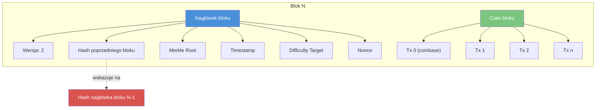
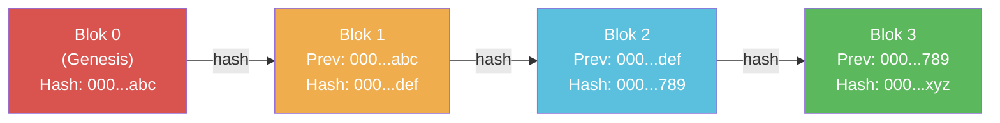
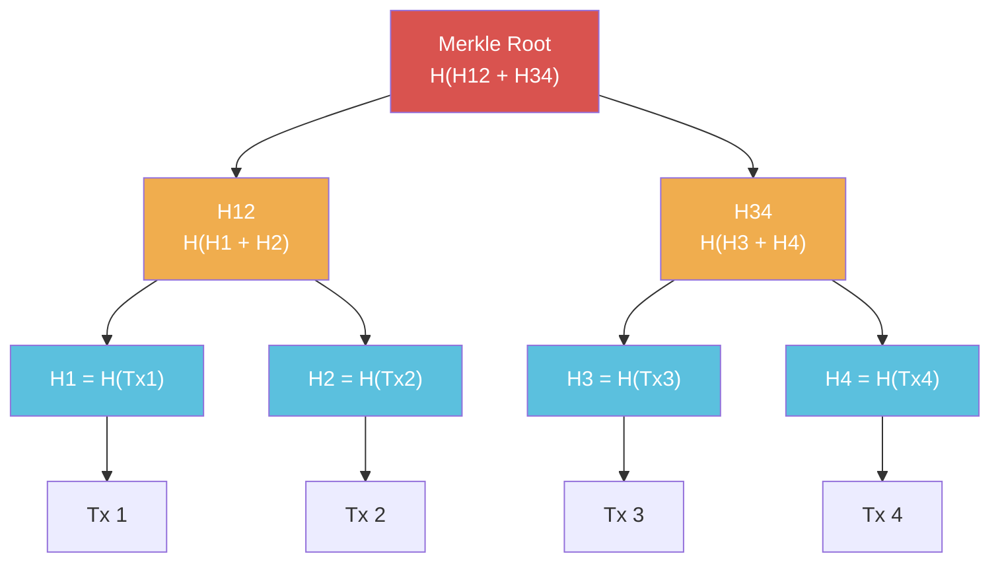

# Pytanie 51: Omów budowę rejestrów rozproszonych typu blockchain.

## Kluczowe pojęcia

- **Blockchain** — rozproszona, zdecentralizowana struktura danych w formie rosnącego łańcucha bloków, w której każdy blok zawiera kryptograficzny skrót (hash) poprzedniego bloku, znacznik czasu oraz zbiór transakcji. Blockchain zapewnia niezmienność (immutability) zapisanych danych — modyfikacja dowolnego bloku wymaga przeliczenia wszystkich kolejnych bloków, co jest obliczeniowo niewykonalne przy wystarczającej długości łańcucha.
- **Blok (block)** — podstawowa jednostka danych w blockchainie. Składa się z nagłówka (header) zawierającego metadane oraz ciała (body) zawierającego listę transakcji. Nagłówek zawiera m.in. hash poprzedniego bloku, korzeń drzewa Merkle'a, znacznik czasu, nonce (w PoW) oraz numer bloku.
- **Hash (funkcja skrótu)** — jednokierunkowa funkcja kryptograficzna (np. SHA-256) przekształcająca dane wejściowe dowolnej długości w skrót o stałej długości (256 bitów dla SHA-256). Zmiana nawet jednego bitu danych wejściowych powoduje całkowicie inny hash (efekt lawinowy). W blockchainie hash służy do łączenia bloków w łańcuch oraz weryfikacji integralności danych.
- **Drzewo Merkle'a (Merkle tree)** — binarna struktura drzewiasta, w której liście zawierają hasze poszczególnych transakcji, a każdy węzeł wewnętrzny jest hashem konkatenacji swoich dzieci. Korzeń drzewa (Merkle root) jednoznacznie reprezentuje cały zbiór transakcji w bloku. Umożliwia efektywną weryfikację przynależności transakcji do bloku (Merkle proof) w czasie O(log n).
- **Konsensus (consensus)** — mechanizm, dzięki któremu rozproszone węzły sieci blockchain osiągają zgodność co do aktualnego stanu rejestru bez centralnego autorytetu. Protokół konsensusu musi rozwiązywać problem bizantyjskich generałów — zapewniać poprawne działanie systemu nawet w obecności węzłów złośliwych lub uszkodzonych.
- **Proof of Work (PoW)** — mechanizm konsensusu, w którym węzły (górnicy) rywalizują o prawo dodania nowego bloku, rozwiązując trudny obliczeniowo problem (znalezienie nonce, dla którego hash bloku spełnia warunek trudności). Zapewnia bezpieczeństwo kosztem dużego zużycia energii. Stosowany w Bitcoin.
- **Proof of Stake (PoS)** — mechanizm konsensusu, w którym prawo do walidacji bloku jest proporcjonalne do ilości kryptowaluty zablokowanej (stake) przez walidatora. Znacznie mniejsze zużycie energii niż PoW. Stosowany w Ethereum (od wersji 2.0).
- **Smart contract (inteligentny kontrakt)** — samowykonywalny program przechowywany w blockchainie, którego kod i stan są niezmienne po wdrożeniu. Smart kontrakt automatycznie egzekwuje warunki umowy zapisane w kodzie, bez potrzeby zaufanego pośrednika. Wykonywany deterministycznie przez wszystkie węzły sieci.

## Struktura bloku

Blok jest fundamentalną jednostką danych w blockchainie. Składa się z dwóch głównych części: nagłówka i ciała.

### Nagłówek bloku (block header)

Nagłówek zawiera metadane niezbędne do utrzymania integralności łańcucha:

| Pole | Opis | Przykład (Bitcoin) |
|---|---|---|
| Wersja (version) | Numer wersji protokołu | `0x20000000` |
| Hash poprzedniego bloku | SHA-256 nagłówka poprzedniego bloku | `000000000000000000034...` |
| Merkle root | Korzeń drzewa Merkle'a transakcji | `4a5e1e4baab89f3a32...` |
| Znacznik czasu (timestamp) | Czas utworzenia bloku (Unix time) | `1231006505` |
| Bity trudności (difficulty target) | Docelowa wartość trudności PoW | `0x1d00ffff` |
| Nonce | Liczba iterowana w procesie wydobycia | `2083236893` |

### Ciało bloku (block body)

Ciało zawiera uporządkowaną listę transakcji. Pierwsza transakcja to tzw. coinbase transaction (nagroda dla górnika). Pozostałe transakcje zawierają transfery wartości między adresami.

### Diagram struktury bloku



## Łańcuch bloków

Bloki są połączone w jednokierunkowy łańcuch za pomocą haszy kryptograficznych. Każdy blok zawiera hash nagłówka poprzedniego bloku, tworząc nieprzerwaną sekwencję od bloku genezy (genesis block) do najnowszego bloku.

### Niezmienność łańcucha

Modyfikacja transakcji w bloku N powoduje:
1. Zmianę Merkle root bloku N
2. Zmianę hasha nagłówka bloku N
3. Niezgodność z polem „hash poprzedniego bloku" w bloku N+1
4. Konieczność przeliczenia wszystkich bloków od N+1 do końca łańcucha

W sieci PoW przeliczenie wymaga ponownego rozwiązania problemu obliczeniowego dla każdego bloku — przy wystarczającej długości łańcucha jest to praktycznie niewykonalne.

### Diagram łańcucha bloków



## Mechanizmy konsensusu

### Proof of Work (PoW)

Górnicy rywalizują o prawo dodania bloku, szukając wartości nonce, dla której hash nagłówka bloku jest mniejszy od docelowej wartości trudności (difficulty target):

```
hash(nagłówek_bloku) < difficulty_target
```

**Algorytm wydobycia (mining):**

```
funkcja mine(blok, difficulty_target):
    nonce ← 0
    powtarzaj:
        blok.nagłówek.nonce ← nonce
        h ← SHA256(SHA256(blok.nagłówek))
        jeśli h < difficulty_target:
            zwróć blok  // blok znaleziony
        nonce ← nonce + 1
```

**Właściwości PoW:**
- Trudność jest dynamicznie dostosowywana (Bitcoin: co 2016 bloków, cel ~10 min/blok)
- Atak 51% wymaga kontroli ponad połowy mocy obliczeniowej sieci
- Duże zużycie energii (Bitcoin: ~150 TWh/rok)

### Proof of Stake (PoS)

Walidatorzy blokują (stakują) kryptowalutę jako zabezpieczenie. Prawo do zaproponowania bloku jest losowane proporcjonalnie do wielkości stake'u.

**Właściwości PoS:**
- Energooszczędny (brak wyścigu obliczeniowego)
- Walidator ryzykuje utratę stake'u za nieuczciwość (slashing)
- Problem „nothing at stake" — rozwiązywany przez mechanizmy karne

### Practical Byzantine Fault Tolerance (PBFT)

Algorytm konsensusu tolerujący do ⌊(n-1)/3⌋ węzłów bizantyjskich (złośliwych) w sieci n węzłów.

**Fazy PBFT:**
1. **Pre-prepare** — lider proponuje blok
2. **Prepare** — węzły potwierdzają otrzymanie propozycji
3. **Commit** — po zebraniu 2/3 potwierdzeń, blok jest zatwierdzany

**Właściwości PBFT:**
- Deterministyczna finalizacja (brak forków)
- Niska latencja
- Ograniczona skalowalność (komunikacja O(n²))
- Stosowany w sieciach permissioned (Hyperledger Fabric)

### Porównanie mechanizmów konsensusu

| Cecha | PoW | PoS | PBFT |
|---|---|---|---|
| Zużycie energii | Bardzo wysokie | Niskie | Niskie |
| Przepustowość (TPS) | ~7 (Bitcoin) | ~30 (Ethereum) | ~1000+ |
| Finalizacja | Probabilistyczna | Probabilistyczna/deterministyczna | Deterministyczna |
| Tolerancja błędów | 50% mocy obliczeniowej | 33% stake'u | 33% węzłów |
| Typ sieci | Permissionless | Permissionless | Permissioned |
| Decentralizacja | Wysoka | Wysoka | Ograniczona |

## Drzewo Merkle'a

Drzewo Merkle'a to binarna struktura haszowa umożliwiająca efektywną weryfikację integralności dużych zbiorów danych.

### Budowa drzewa

1. Oblicz hash każdej transakcji (liście drzewa)
2. Połącz sąsiednie hasze parami i oblicz hash każdej pary
3. Powtarzaj aż do uzyskania jednego korzenia (Merkle root)

Jeśli liczba elementów na danym poziomie jest nieparzysta, ostatni element jest duplikowany.

### Diagram drzewa Merkle'a



### Merkle proof (dowód przynależności)

Aby udowodnić, że transakcja Tx2 należy do bloku, wystarczy dostarczyć:
- H1 (hash sąsiada na poziomie liści)
- H34 (hash sąsiada na wyższym poziomie)

Weryfikator oblicza: H12 = H(H1 + H(Tx2)), a następnie root = H(H12 + H34) i porównuje z Merkle root w nagłówku bloku.

**Złożoność:** O(log n) — dla bloku z 1000 transakcji wystarczy ~10 haszy zamiast 1000.

## Sieci P2P (peer-to-peer)

Blockchain działa w zdecentralizowanej sieci P2P, gdzie każdy węzeł (node) jest równorzędny — nie ma centralnego serwera.

### Typy węzłów

| Typ | Opis | Przechowywane dane |
|---|---|---|
| Pełny węzeł (full node) | Przechowuje cały łańcuch, weryfikuje wszystkie transakcje i bloki | Cały blockchain |
| Lekki węzeł (light/SPV node) | Przechowuje tylko nagłówki bloków, weryfikuje transakcje za pomocą Merkle proof | Nagłówki bloków |
| Węzeł wydobywczy (mining node) | Pełny węzeł + uczestniczy w procesie wydobycia (PoW) lub walidacji (PoS) | Cały blockchain + mempool |

### Propagacja bloków i transakcji

1. Użytkownik tworzy transakcję i podpisuje ją kluczem prywatnym
2. Transakcja jest rozgłaszana (broadcast) do sąsiednich węzłów
3. Węzły weryfikują transakcję i propagują dalej (protokół gossip)
4. Transakcja trafia do puli oczekujących (mempool)
5. Górnik/walidator wybiera transakcje z mempool i tworzy blok
6. Nowy blok jest rozgłaszany i weryfikowany przez sieć

## Smart kontrakty

Smart kontrakt to program przechowywany i wykonywany w blockchainie. Po wdrożeniu (deploy) jego kod jest niezmienny, a wykonanie jest deterministyczne i weryfikowalne przez wszystkie węzły.

### Właściwości smart kontraktów

- **Deterministyczność** — ten sam input zawsze daje ten sam output
- **Niezmienność** — kod nie może być zmieniony po wdrożeniu
- **Autonomiczność** — wykonanie nie wymaga zaufanego pośrednika
- **Transparentność** — kod i stan są publicznie dostępne
- **Atomowość** — transakcja albo wykonuje się w całości, albo jest cofana

### Przykład smart kontraktu (pseudokod Solidity)

```solidity
contract Escrow {
    address kupujacy;
    address sprzedajacy;
    uint kwota;
    bool towarDostarczony;

    function wplac() payable {
        require(msg.sender == kupujacy);
        require(msg.value == kwota);
    }

    function potwierdzOdbiór() {
        require(msg.sender == kupujacy);
        towarDostarczony = true;
        sprzedajacy.transfer(kwota);
    }

    function zwrot() {
        require(!towarDostarczony);
        require(block.timestamp > termin);
        kupujacy.transfer(kwota);
    }
}
```

### Platformy smart kontraktów

| Platforma | Język | Maszyna wirtualna | Konsensus |
|---|---|---|---|
| Ethereum | Solidity, Vyper | EVM (Ethereum Virtual Machine) | PoS |
| Solana | Rust, C | SVM (Sealevel VM) | PoH + PoS |
| Cardano | Plutus (Haskell) | EUTXO | PoS (Ouroboros) |
| Hyperledger Fabric | Go, Java, JS | Docker | PBFT/Raft |

## Zastosowania blockchain

### Kryptowaluty
Pierwotne i najbardziej znane zastosowanie — zdecentralizowane systemy płatności (Bitcoin, Ethereum).

### Finanse zdecentralizowane (DeFi)
Smart kontrakty umożliwiają tworzenie zdecentralizowanych giełd, protokołów pożyczkowych i stablecoinów bez pośredników finansowych.

### Łańcuch dostaw (supply chain)
Śledzenie produktów od producenta do konsumenta z niezmiennym rejestrem każdego etapu.

### Tokeny NFT
Unikalne tokeny cyfrowe reprezentujące własność zasobów cyfrowych (sztuka, kolekcje, nieruchomości wirtualne).

### Systemy głosowania
Transparentne i weryfikowalne systemy głosowania elektronicznego.

### Tożsamość cyfrowa
Zdecentralizowane systemy zarządzania tożsamością (Self-Sovereign Identity).

## Przykłady

### Przykład 1: Struktura bloku Bitcoin

Blok #800000 w sieci Bitcoin (przykładowe dane):

```
=== NAGŁÓWEK BLOKU ===
Wersja:              0x20000000
Hash poprz. bloku:   00000000000000000002a7c4c1e48d76c5a37902165a270156b7a8d72f8804bf
Merkle root:         b1a0e1c096b355e8e4b8e4e4e4e4e4e4e4e4e4e4e4e4e4e4e4e4e4e4e4e4e4e4
Timestamp:           2023-07-24 09:34:12 UTC
Difficulty target:   0x1705ae8a
Nonce:               3 141 592 653

=== CIAŁO BLOKU ===
Liczba transakcji:   3 721
Rozmiar bloku:       1.42 MB

Tx 0 (coinbase):     Nagroda 6.25 BTC + opłaty transakcyjne
Tx 1:                Adres A → Adres B: 0.5 BTC
Tx 2:                Adres C → Adres D: 1.2 BTC
...
Tx 3720:             Adres X → Adres Y: 0.001 BTC

=== HASH BLOKU ===
SHA256(SHA256(nagłówek)) = 00000000000000000003a4c...
                           ^^^^^^^^^^^^^^^^^^^^^^^^
                           Wiodące zera = spełniony warunek trudności
```

### Przykład 2: Weryfikacja integralności łańcucha (pseudokod)

```
funkcja weryfikuj_łańcuch(bloki[]):
    dla i od 1 do długość(bloki) - 1:
        blok ← bloki[i]
        poprzedni ← bloki[i - 1]
        
        // Sprawdź hash poprzedniego bloku
        jeśli blok.nagłówek.hash_poprzedniego ≠ hash(poprzedni.nagłówek):
            zwróć BŁĄD("Niezgodność hasha w bloku " + i)
        
        // Sprawdź Merkle root
        obliczony_root ← zbuduj_drzewo_merkle(blok.transakcje)
        jeśli blok.nagłówek.merkle_root ≠ obliczony_root:
            zwróć BŁĄD("Niezgodność Merkle root w bloku " + i)
        
        // Sprawdź PoW (jeśli dotyczy)
        jeśli hash(blok.nagłówek) ≥ blok.nagłówek.difficulty_target:
            zwróć BŁĄD("Niespełniony warunek PoW w bloku " + i)
    
    zwróć OK("Łańcuch poprawny")
```

### Przykład 3: Budowa drzewa Merkle'a krok po kroku

Dane wejściowe: 4 transakcje (Tx1, Tx2, Tx3, Tx4)

```
Krok 1 — hasze liści:
  H1 = SHA256("Tx1") = a1b2c3...
  H2 = SHA256("Tx2") = d4e5f6...
  H3 = SHA256("Tx3") = 789abc...
  H4 = SHA256("Tx4") = def012...

Krok 2 — hasze par:
  H12 = SHA256(H1 + H2) = SHA256("a1b2c3...d4e5f6...") = 111222...
  H34 = SHA256(H3 + H4) = SHA256("789abc...def012...") = 333444...

Krok 3 — korzeń (Merkle root):
  Root = SHA256(H12 + H34) = SHA256("111222...333444...") = aabbcc...

Merkle root zapisany w nagłówku bloku: aabbcc...
```

## Podsumowanie

1. **Blockchain** to rozproszona struktura danych w formie łańcucha bloków połączonych haszami kryptograficznymi. Każdy blok zawiera nagłówek (hash poprzedniego bloku, Merkle root, timestamp, nonce) oraz ciało z listą transakcji.

2. **Niezmienność** łańcucha wynika z kaskadowej zależności haszy — modyfikacja dowolnego bloku wymaga przeliczenia wszystkich kolejnych bloków, co jest obliczeniowo niewykonalne.

3. **Mechanizmy konsensusu** (PoW, PoS, PBFT) umożliwiają osiągnięcie zgodności między rozproszonymi węzłami bez centralnego autorytetu. PoW zapewnia bezpieczeństwo kosztem energii, PoS jest energooszczędny, PBFT oferuje deterministyczną finalizację w sieciach permissioned.

4. **Drzewo Merkle'a** umożliwia efektywną weryfikację przynależności transakcji do bloku w czasie O(log n), co jest kluczowe dla lekkich węzłów (SPV).

5. **Sieci P2P** zapewniają decentralizację — brak pojedynczego punktu awarii. Transakcje i bloki są propagowane protokołem gossip.

6. **Smart kontrakty** to samowykonywalny kod przechowywany w blockchainie, umożliwiający automatyzację umów bez zaufanego pośrednika. Są deterministyczne, niezmienne i transparentne.

7. Blockchain znajduje zastosowanie w kryptowalutach, DeFi, łańcuchach dostaw, NFT, systemach głosowania i zarządzaniu tożsamością cyfrową.

## Powiązane pytania

- [Pytanie 52: Problemy matematyczne kryptografii asymetrycznej](52-kryptografia-asymetryczna.md)
